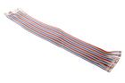

Contents
========

* [RBCC-40W-Z-L300-01>40 Wire 300 mm Rainbow Crimped Ribbon Cable](#rbcc-40w-z-l300-0140-wire-300-mm-rainbow-crimped-ribbon-cable)
	* [Images](#images)
	* [Datasheets](#datasheets)
	* [Labels](#labels)
	* [EDA](#eda)
		* [Symbols](#symbols)
	* [Tags](#tags)
  
![][im]
# RBCC-40W-Z-L300-01>40 Wire 300 mm Rainbow Crimped Ribbon Cable

- ID: RBCC-40W-Z-L300-01
- Name: RBCC-40W-Z-L300-01

## Images
  
  

|image|image_RE|
| :---: | :---: |
|||

## Datasheets

- Datasheet: [datasheet.pdf](datasheet.pdf)

## Labels
  
  

|label-front|label-inventory|label-spec|
| :---: | :---: | :---: |
||||

## EDA

### Symbols

## Tags

- oompID: RBCC-40W-Z-L300-01
- name: 40 Wire 300 mm Rainbow Crimped Ribbon Cable
- hexID: RBC3
- oompSort: 040W300
- oompType: RBCC
- oompSize: 40W
- oompColor: Z
- oompDesc: L300
- oompIndex: 01
- oompVersion: 10
- oompAbout: It&#39s often tempting to use these 300 mm long cables, however they are best avoided if possible. The longer length means there&#39s often extra cable that can clutter a project box, or be caught and unplugged unintentionally. That said they are useful at the early stage of a project where final placement is not known and the added length is an advantage.
- oompClass: Wiring
- oompClassCode: WIRE

[im]: image_600.jpg
