Contents
========

* [Parts](#parts)
	* [ANTE > Antenna](#ante--antenna)
	* [BAHO > Battery Holder](#baho--battery-holder)
	* [BAPI > Badge Pin](#bapi--badge-pin)
	* [BREB > Breadboard](#breb--breadboard)
	* [BUTA > Pushbutton (Tactile)](#buta--pushbutton-tactile)
	* [BUTP > Pushbutton](#butp--pushbutton)
	* [BUZZ > Buzzer](#buzz--buzzer)
	* [CABL > Cable](#cabl--cable)
	* [CAPC > Capacitor (Ceramic)](#capc--capacitor-ceramic)
	* [CAPE > Capacitor (Electrolytic)](#cape--capacitor-electrolytic)
	* [CAPT > Capacitor (Tantalum)](#capt--capacitor-tantalum)
	* [CERE > Ceramic Resonator](#cere--ceramic-resonator)
	* [DBCO > Connector](#dbco--connector)
	* [CRHO > Crimp Housing](#crho--crimp-housing)
	* [DCJP > DC Jack](#dcjp--dc-jack)
	* [DIOD > Diode](#diod--diode)
	* [DIOS > Diode (Schottky)](#dios--diode-schottky)
	* [DISP > Display](#disp--display)
	* [FERB > Ferrite Bead](#ferb--ferrite-bead)
	* [HEAD > Header](#head--header)
	* [HEAF > Female Header](#heaf--female-header)
	* [HEAL > Header (Long)](#heal--header-long)
	* [HEDS > Headphone Socket](#heds--headphone-socket)
	* [HELF > Female Header (Long)](#helf--female-header-long)
	* [HESH > Heat Shrink](#hesh--heat-shrink)
	* [ICIC > ](#icic--)
	* [MCUU > MCU](#mcuu--mcu)
	* [ICSO > IC Socket](#icso--ic-socket)
	* [INDU > Inductor](#indu--inductor)
	* [JSTS > JST Socket](#jsts--jst-socket)
	* [JUMP > Jumper](#jump--jumper)
	* [LEDS > LED](#leds--led)
	* [MICR > Microphone](#micr--microphone)
	* [MOSN > N-Ch. MOSFET](#mosn--n-ch-mosfet)
	* [MOSP > P-Ch. MOSFET](#mosp--p-ch-mosfet)
	* [MOTO > Motor](#moto--motor)
	* [NHFF > Nylon Standoff (F-F)](#nhff--nylon-standoff-f-f)
	* [NNUT > Nylon Nut](#nnut--nylon-nut)
	* [NSCR > Nylon Screw](#nscr--nylon-screw)
	* [NUTT > Nut](#nutt--nut)
	* [OPAM > Op Amp](#opam--op-amp)
	* [PHTR > Phototransistor](#phtr--phototransistor)
	* [POTE > Potentiometer](#pote--potentiometer)
	* [POAD > Power Adapter](#poad--power-adapter)
	* [PRIV > Plastic Rivet](#priv--plastic-rivet)
	* [RBCC > Crimped Ribbon Cable](#rbcc--crimped-ribbon-cable)
	* [REFU > Resetable Fuse](#refu--resetable-fuse)
	* [RELA > Relay](#rela--relay)
	* [RESA > Resistor Array](#resa--resistor-array)
	* [RESE > Resistor](#rese--resistor)
	* [RJ45 > RJ45](#rj45--rj45)
	* [SCRE > Machine Screw](#scre--machine-screw)
	* [SDCS > SD Card Socket](#sdcs--sd-card-socket)
	* [SENS > Sensor](#sens--sensor)
	* [SWIS > Switch (Slide)](#swis--switch-slide)
	* [TERS > Screw Terminal](#ters--screw-terminal)
	* [THER > Thermistor](#ther--thermistor)
	* [TILS > Tilt Switch](#tils--tilt-switch)
	* [TRNN > NPN Transistor](#trnn--npn-transistor)
	* [TRNP > PNP Transistor](#trnp--pnp-transistor)
	* [USBS > USB Socket](#usbs--usb-socket)
	* [UFLS > UFL Socket](#ufls--ufl-socket)
	* [VARI > Varistor](#vari--varistor)
	* [VREG > Voltage Regulator](#vreg--voltage-regulator)
	* [WIRS > Stranded Wire](#wirs--stranded-wire)
	* [XTAL > Crystal](#xtal--crystal)

# Parts

## ANTE > Antenna
  

| [ANTE-18-X-M4X4-01 > 18 mm Quad Band (850/900/1800/1900 Mhz) Antenna](ANTE-18-X-M4X4-01/)| [ANTE-40-X-G24-01 > 40 mm 2.4 Ghz Antenna](ANTE-40-X-G24-01/)| [ANTE-SMA-X-G24-01 > SMA 2.4 Ghz Antenna](ANTE-SMA-X-G24-01/)||
| :---: | :---: | :---: | :---: |

## BAHO > Battery Holder
  

| [BAHO-CR1220-M-SMDS-01 > CR1220 SMD Metal Battery Holder](BAHO-CR1220-M-SMDS-01/)| [BAHO-CR1220-X-SMDS-01 > CR1220 SMD Battery Holder](BAHO-CR1220-X-SMDS-01/)|||
| :---: | :---: | :---: | :---: |

## BAPI > Badge Pin
  

| [BAPI-06-X-STAN-01 > 6 mm Badge Pin](BAPI-06-X-STAN-01/)||||
| :---: | :---: | :---: | :---: |

## BREB > Breadboard
  

| [BREB-P400-C-STAN-01 > 400 Point Clear Breadboard](BREB-P400-C-STAN-01/)||||
| :---: | :---: | :---: | :---: |

## BUTA > Pushbutton (Tactile)
  

| [BUTA-06-X-PI02-01 > 6 mm 2 Pin Pushbutton (Tactile)](BUTA-06-X-PI02-01/)| [BUTA-06-X-SMDS-01 > 6 mm SMD Pushbutton (Tactile)](BUTA-06-X-SMDS-01/)| [BUTA-07-X-SMDS-01 > 7 mm SMD Pushbutton (Tactile)](BUTA-07-X-SMDS-01/)| [BUTA-3025-X-PI02-01 > SMD (3025) 2 Pin Pushbutton (Tactile)](BUTA-3025-X-PI02-01/)|
| :---: | :---: | :---: | :---: |
| [BUTA-3025-X-PI02-01 > SMD (3025) 2 Pin Pushbutton (Tactile)](BUTA-3025-X-PI02-01/)| [BUTA-3025-X-PI02-01 > SMD (3025) 2 Pin Pushbutton (Tactile)](BUTA-3025-X-PI02-01/)| [BUTA-4632-X-STAN-01 > SMD (4632) Pushbutton (Tactile)](BUTA-4632-X-STAN-01/)| [BUTA-52D-X--01 > 5.2 mm SMD Pushbutton (Tactile)](BUTA-52D-X--01/)|
| [BUTA-52D-X-STAN-01 > 5.2 mm Pushbutton (Tactile)](BUTA-52D-X-STAN-01/)| [BUTA-6035-X-STAN-01 > SMD (6035) Pushbutton (Tactile)](BUTA-6035-X-STAN-01/)|||

## BUTP > Pushbutton
  

| [BUTP-07-X-STAN-69 >  7 mm Pushbutton Panel Mount ](BUTP-07-X-STAN-69/)||||
| :---: | :---: | :---: | :---: |

## BUZZ > Buzzer
  

| [BUZZ-12-X-V3-01 > 12 mm 3v Buzzer](BUZZ-12-X-V3-01/)||||
| :---: | :---: | :---: | :---: |

## CABL > Cable
  

| [CABL-200-X-GROV-01 > 200 mm Grove Cable](CABL-200-X-GROV-01/)| [CABL-21D-X-V09-01 > 2.1 mm 9v Cable](CABL-21D-X-V09-01/)|||
| :---: | :---: | :---: | :---: |

## CAPC > Capacitor (Ceramic)
  

| [CAPC-0402-X-NF1-V50 > SMD (0402) 1 nF Capacitor (Ceramic) 50v](CAPC-0402-X-NF1-V50/)| [CAPC-0402-X-NF10-V50 > SMD (0402) 10 nF Capacitor (Ceramic) 50v](CAPC-0402-X-NF10-V50/)| [CAPC-0402-X-NF100-V10 > SMD (0402) 100 nF Capacitor (Ceramic) 10v](CAPC-0402-X-NF100-V10/)| [CAPC-0402-X-NF100-V16 > SMD (0402) 100 nF Capacitor (Ceramic) 16v](CAPC-0402-X-NF100-V16/)|
| :---: | :---: | :---: | :---: |
| [CAPC-0402-X-NF100-V25 > SMD (0402) 100 nF Capacitor (Ceramic) 25v](CAPC-0402-X-NF100-V25/)| [CAPC-0402-X-NF22-V50 > SMD (0402) 22 nF Capacitor (Ceramic) 50v](CAPC-0402-X-NF22-V50/)| [CAPC-0402-X-NF220-V16 > SMD (0402) 220 nF Capacitor (Ceramic) 16v](CAPC-0402-X-NF220-V16/)| [CAPC-0402-X-NF22D-V50 > SMD (0402) 2.2 nF Capacitor (Ceramic) 50v](CAPC-0402-X-NF22D-V50/)|
| [CAPC-0402-X-NF47-V25 > SMD (0402) 47 nF Capacitor (Ceramic) 25v](CAPC-0402-X-NF47-V25/)| [CAPC-0402-X-NF47D-V50 > SMD (0402) 4.7 nF Capacitor (Ceramic) 50v](CAPC-0402-X-NF47D-V50/)| [CAPC-0402-X-NF47D-V63D > SMD (0402) 4.7 nF Capacitor (Ceramic) 6.3v](CAPC-0402-X-NF47D-V63D/)| [CAPC-0402-X-PF05D-V50 > SMD (0402) 0.5 pF Capacitor (Ceramic) 50v](CAPC-0402-X-PF05D-V50/)|
| [CAPC-0402-X-PF06D-V50 > SMD (0402) 0.6 pF Capacitor (Ceramic) 50v](CAPC-0402-X-PF06D-V50/)| [CAPC-0402-X-PF1-V50 > SMD (0402) 1 pF Capacitor (Ceramic) 50v](CAPC-0402-X-PF1-V50/)| [CAPC-0402-X-PF10-V50 > SMD (0402) 10 pF Capacitor (Ceramic) 50v](CAPC-0402-X-PF10-V50/)| [CAPC-0402-X-PF100-V50 > SMD (0402) 100 pF Capacitor (Ceramic) 50v](CAPC-0402-X-PF100-V50/)|
| [CAPC-0402-X-PF12-V50 > SMD (0402) 12 pF Capacitor (Ceramic) 50v](CAPC-0402-X-PF12-V50/)| [CAPC-0402-X-PF15-V50 > SMD (0402) 15 pF Capacitor (Ceramic) 50v](CAPC-0402-X-PF15-V50/)| [CAPC-0402-X-PF15D-V50 > SMD (0402) 1.5 pF Capacitor (Ceramic) 50v](CAPC-0402-X-PF15D-V50/)| [CAPC-0402-X-PF18-V50 > SMD (0402) 18 pF Capacitor (Ceramic) 50v](CAPC-0402-X-PF18-V50/)|
| [CAPC-0402-X-PF22-V50 > SMD (0402) 22 pF Capacitor (Ceramic) 50v](CAPC-0402-X-PF22-V50/)| [CAPC-0402-X-PF220-V50 > SMD (0402) 220 pF Capacitor (Ceramic) 50v](CAPC-0402-X-PF220-V50/)| [CAPC-0402-X-PF22D-V50 > SMD (0402) 2.2 pF Capacitor (Ceramic) 50v](CAPC-0402-X-PF22D-V50/)| [CAPC-0402-X-PF27-V50 > SMD (0402) 27 pF Capacitor (Ceramic) 50v](CAPC-0402-X-PF27-V50/)|
| [CAPC-0402-X-PF33-V50 > SMD (0402) 33 pF Capacitor (Ceramic) 50v](CAPC-0402-X-PF33-V50/)| [CAPC-0402-X-PF390-V50 > SMD (0402) 390 pF Capacitor (Ceramic) 50v](CAPC-0402-X-PF390-V50/)| [CAPC-0402-X-PF47-V50 > SMD (0402) 47 pF Capacitor (Ceramic) 50v](CAPC-0402-X-PF47-V50/)| [CAPC-0402-X-UF1-V10 > SMD (0402) 1 uF Capacitor (Ceramic) 10v](CAPC-0402-X-UF1-V10/)|
| [CAPC-0402-X-UF1-V63D > SMD (0402) 1 uF Capacitor (Ceramic) 6.3v](CAPC-0402-X-UF1-V63D/)| [CAPC-0402-X-UF10-V63D > SMD (0402) 10 uF Capacitor (Ceramic) 6.3v](CAPC-0402-X-UF10-V63D/)| [CAPC-0402-X-UF47D-V63D > SMD (0402) 4.7 uF Capacitor (Ceramic) 6.3v](CAPC-0402-X-UF47D-V63D/)| [CAPC-05-X-NF100-V50 > 5 mm 100 nF Capacitor (Ceramic) 50v](CAPC-05-X-NF100-V50/)|
| [CAPC-0603-X-NF1-V50 > SMD (0603) 1 nF Capacitor (Ceramic) 50v](CAPC-0603-X-NF1-V50/)| [CAPC-0603-X-NF10-V50 > SMD (0603) 10 nF Capacitor (Ceramic) 50v](CAPC-0603-X-NF10-V50/)| [CAPC-0603-X-NF100-V50 > SMD (0603) 100 nF Capacitor (Ceramic) 50v](CAPC-0603-X-NF100-V50/)| [CAPC-0603-X-NF22-V50 > SMD (0603) 22 nF Capacitor (Ceramic) 50v](CAPC-0603-X-NF22-V50/)|
| [CAPC-0603-X-NF220-V25 > SMD (0603) 220 nF Capacitor (Ceramic) 25v](CAPC-0603-X-NF220-V25/)| [CAPC-0603-X-NF22D-V50 > SMD (0603) 2.2 nF Capacitor (Ceramic) 50v](CAPC-0603-X-NF22D-V50/)| [CAPC-0603-X-NF33-V50 > SMD (0603) 33 nF Capacitor (Ceramic) 50v](CAPC-0603-X-NF33-V50/)| [CAPC-0603-X-NF47D-V50 > SMD (0603) 4.7 nF Capacitor (Ceramic) 50v](CAPC-0603-X-NF47D-V50/)|
| [CAPC-0603-X-PF10-V50 > SMD (0603) 10 pF Capacitor (Ceramic) 50v](CAPC-0603-X-PF10-V50/)| [CAPC-0603-X-PF100-V50 > SMD (0603) 100 pF Capacitor (Ceramic) 50v](CAPC-0603-X-PF100-V50/)| [CAPC-0603-X-PF12-V50 > SMD (0603) 12 pF Capacitor (Ceramic) 50v](CAPC-0603-X-PF12-V50/)| [CAPC-0603-X-PF15-V50 > SMD (0603) 15 pF Capacitor (Ceramic) 50v](CAPC-0603-X-PF15-V50/)|
| [CAPC-0603-X-PF22-V50 > SMD (0603) 22 pF Capacitor (Ceramic) 50v](CAPC-0603-X-PF22-V50/)| [CAPC-0603-X-PF27-V50 > SMD (0603) 27 pF Capacitor (Ceramic) 50v](CAPC-0603-X-PF27-V50/)| [CAPC-0603-X-PF39-V50 > SMD (0603) 39 pF Capacitor (Ceramic) 50v](CAPC-0603-X-PF39-V50/)| [CAPC-0603-X-PF47D-V50 > SMD (0603) 4.7 pF Capacitor (Ceramic) 50v](CAPC-0603-X-PF47D-V50/)|
| [CAPC-0603-X-PF82D-V50 > SMD (0603) 8.2 pF Capacitor (Ceramic) 50v](CAPC-0603-X-PF82D-V50/)| [CAPC-0603-X-UF1-V25 > SMD (0603) 1 uF Capacitor (Ceramic) 25v](CAPC-0603-X-UF1-V25/)| [CAPC-0603-X-UF10-V10 > SMD (0603) 10 uF Capacitor (Ceramic) 10v](CAPC-0603-X-UF10-V10/)| [CAPC-0603-X-UF10-V63D > SMD (0603) 10 uF Capacitor (Ceramic) 6.3v](CAPC-0603-X-UF10-V63D/)|
| [CAPC-0603-X-UF22D-V10 > SMD (0603) 2.2 uF Capacitor (Ceramic) 10v](CAPC-0603-X-UF22D-V10/)| [CAPC-0603-X-UF47D-V10 > SMD (0603) 4.7 uF Capacitor (Ceramic) 10v](CAPC-0603-X-UF47D-V10/)| [CAPC-0805-X-NF10-V50 > SMD (0805) 10 nF Capacitor (Ceramic) 50v](CAPC-0805-X-NF10-V50/)| [CAPC-0805-X-NF100-V50 > SMD (0805) 100 nF Capacitor (Ceramic) 50v](CAPC-0805-X-NF100-V50/)|
| [CAPC-0805-X-UF1-V25 > SMD (0805) 1 uF Capacitor (Ceramic) 25v](CAPC-0805-X-UF1-V25/)| [CAPC-0805-X-UF10-V10 > SMD (0805) 10 uF Capacitor (Ceramic) 10v](CAPC-0805-X-UF10-V10/)| [CAPC-0805-X-UF10-V25 > SMD (0805) 10 uF Capacitor (Ceramic) 25v](CAPC-0805-X-UF10-V25/)| [CAPC-0805-X-UF22-V63D > SMD (0805) 22 uF Capacitor (Ceramic) 6.3v](CAPC-0805-X-UF22-V63D/)|
| [CAPC-0805-X-UF22D-V25 > SMD (0805) 2.2 uF Capacitor (Ceramic) 25v](CAPC-0805-X-UF22D-V25/)| [CAPC-0805-X-UF47D-V25 > SMD (0805) 4.7 uF Capacitor (Ceramic) 25v](CAPC-0805-X-UF47D-V25/)| [CAPC-1206-X-NF1-V1000 > SMD (1206) 1 nF Capacitor (Ceramic) 1000v](CAPC-1206-X-NF1-V1000/)| [CAPC-1206-X-UF10-V25 > SMD (1206) 10 uF Capacitor (Ceramic) 25v](CAPC-1206-X-UF10-V25/)|
| [CAPC-1206-X-UF100-V63D > SMD (1206) 100 uF Capacitor (Ceramic) 6.3v](CAPC-1206-X-UF100-V63D/)| [CAPC-45D-X-NF10-V50 > 4.5 mm 10 nF Capacitor (Ceramic) 50v](CAPC-45D-X-NF10-V50/)| [CAPC-55D-X-PF22-V50 > 5.5 mm 22 pF Capacitor (Ceramic) 50v](CAPC-55D-X-PF22-V50/)||

## CAPE > Capacitor (Electrolytic)
  

| [CAPE-05-X-UF1-VD > 5 mm 1 uF Capacitor (Electrolytic) 63v](CAPE-05-X-UF1-VD/)| [CAPE-05-X-UF1-VD > 5 mm 1 uF Capacitor (Electrolytic) 63v](CAPE-05-X-UF1-VD/)| [CAPE-05-X-UF10-V25 > 5 mm 10 uF Capacitor (Electrolytic) 25v](CAPE-05-X-UF10-V25/)| [CAPE-05-X-UF10-V25 > 5 mm 10 uF Capacitor (Electrolytic) 25v](CAPE-05-X-UF10-V25/)|
| :---: | :---: | :---: | :---: |
| [CAPE-05-X-UF100-V16 > 5 mm 100 uF Capacitor (Electrolytic) 16v](CAPE-05-X-UF100-V16/)| [CAPE-05-X-UF100-V16 > 5 mm 100 uF Capacitor (Electrolytic) 16v](CAPE-05-X-UF100-V16/)| [CAPE-05-X-UF22-V25 > 5 mm 22 uF Capacitor (Electrolytic) 25v](CAPE-05-X-UF22-V25/)| [CAPE-05-X-UF22-V25 > 5 mm 22 uF Capacitor (Electrolytic) 25v](CAPE-05-X-UF22-V25/)|
| [CAPE-05-X-UF22D-VD > 5 mm 2.2 uF Capacitor (Electrolytic) 63v](CAPE-05-X-UF22D-VD/)| [CAPE-05-X-UF22D-VD > 5 mm 2.2 uF Capacitor (Electrolytic) 63v](CAPE-05-X-UF22D-VD/)| [CAPE-05-X-UF47-V16 > 5 mm 47 uF Capacitor (Electrolytic) 16v](CAPE-05-X-UF47-V16/)| [CAPE-05-X-UF47-V16 > 5 mm 47 uF Capacitor (Electrolytic) 16v](CAPE-05-X-UF47-V16/)|
| [CAPE-05-X-UF47D-V63D > 5 mm 4.7 uF Capacitor (Electrolytic) 63v](CAPE-05-X-UF47D-V63D/)| [CAPE-05-X-UF47D-V63D > 5 mm 4.7 uF Capacitor (Electrolytic) 63v](CAPE-05-X-UF47D-V63D/)| [CAPE-10-X-UF470-V25 > 10 mm 470 uF Capacitor (Electrolytic) 25v](CAPE-10-X-UF470-V25/)| [CAPE-63D-X-UF100-V25 > 6.3 mm 100 uF Capacitor (Electrolytic) 25v](CAPE-63D-X-UF100-V25/)|
| [CAPE-S63D-X-UF220-V16 > SMD (6.3 mm) 220 uF Capacitor (Electrolytic) 16v](CAPE-S63D-X-UF220-V16/)| [CAPE-S63D-X-UF47-V25 > SMD (6.3 mm) 47 uF Capacitor (Electrolytic) 25v](CAPE-S63D-X-UF47-V25/)|||

## CAPT > Capacitor (Tantalum)
  

| [CAPT-1206-X-UF10-V10 > SMD (1206) 10 uF Capacitor (Tantalum) 10v](CAPT-1206-X-UF10-V10/)| [CAPT-1206-X-UF10-V16 > SMD (1206) 10 uF Capacitor (Tantalum) 16v](CAPT-1206-X-UF10-V16/)| [CAPT-1206-X-UF22-V10 > SMD (1206) 22 uF Capacitor (Tantalum) 10v](CAPT-1206-X-UF22-V10/)| [CAPT-1206-X-UF47D-V16 > SMD (1206) 4.7 uF Capacitor (Tantalum) 16v](CAPT-1206-X-UF47D-V16/)|
| :---: | :---: | :---: | :---: |
| [CAPT-1206-X-UF47D-V63D > SMD (1206) 4.7 uF Capacitor (Tantalum) 6.3v](CAPT-1206-X-UF47D-V63D/)| [CAPT-1210-X-UF10-V10 > SMD (1210) 10 uF Capacitor (Tantalum) 10v](CAPT-1210-X-UF10-V10/)| [CAPT-1210-X-UF10-V16 > SMD (1210) 10 uF Capacitor (Tantalum) 16v](CAPT-1210-X-UF10-V16/)| [CAPT-1210-X-UF100-V10 > SMD (1210) 100 uF Capacitor (Tantalum) 10v](CAPT-1210-X-UF100-V10/)|
| [CAPT-1210-X-UF22-V10 > SMD (1210) 22 uF Capacitor (Tantalum) 10v](CAPT-1210-X-UF22-V10/)| [CAPT-1210-X-UF22-V16 > SMD (1210) 22 uF Capacitor (Tantalum) 16v](CAPT-1210-X-UF22-V16/)| [CAPT-1210-X-UF47-V10 > SMD (1210) 47 uF Capacitor (Tantalum) 10v](CAPT-1210-X-UF47-V10/)| [CAPT-2312-X-UF100-V10 > SMD (2312) 100 uF Capacitor (Tantalum) 10v](CAPT-2312-X-UF100-V10/)|
| [CAPT-2312-X-UF100-V16 > SMD (2312) 100 uF Capacitor (Tantalum) 16v](CAPT-2312-X-UF100-V16/)| [CAPT-2312-X-UF22-V25 > SMD (2312) 22 uF Capacitor (Tantalum) 25v](CAPT-2312-X-UF22-V25/)| [CAPT-2312-X-UF47-V16 > SMD (2312) 47 uF Capacitor (Tantalum) 16v](CAPT-2312-X-UF47-V16/)| [CAPT-2917-X-UF470-V63D > SMD (2917) 470 uF Capacitor (Tantalum) 6.3v](CAPT-2917-X-UF470-V63D/)|
| [CAPT-36D-X-NF100-V50 > 3.6 mm 100 nF Capacitor (Tantalum) 50v](CAPT-36D-X-NF100-V50/)||||

## CERE > Ceramic Resonator
  

| [CERE-1263-X-MZ12-01 > SMD (1206-3) 12 MHz Ceramic Resonator](CERE-1263-X-MZ12-01/)| [CERE-1263-X-MZ16-01 > SMD (1206-3) 16 MHz Ceramic Resonator](CERE-1263-X-MZ16-01/)| [CERE-1263-X-MZ8-01 > SMD (1206-3) 8 MHz Ceramic Resonator](CERE-1263-X-MZ8-01/)||
| :---: | :---: | :---: | :---: |

## DBCO > Connector
  

| [DBCO-DB09-X-THTH-ML > DB9 Connector Male](DBCO-DB09-X-THTH-ML/)||||
| :---: | :---: | :---: | :---: |

## CRHO > Crimp Housing
  

| [CRHO-I01-B-PI01-01 > 2.54 mm 1 Pin Black Crimp Housing](CRHO-I01-B-PI01-01/)| [CRHO-I01-B-PI02-01 > 2.54 mm 2 Pin Black Crimp Housing](CRHO-I01-B-PI02-01/)| [CRHO-I01-B-PI03-01 > 2.54 mm 3 Pin Black Crimp Housing](CRHO-I01-B-PI03-01/)| [CRHO-I01-B-PI04-01 > 2.54 mm 4 Pin Black Crimp Housing](CRHO-I01-B-PI04-01/)|
| :---: | :---: | :---: | :---: |
| [CRHO-I01-B-PI05-01 > 2.54 mm 5 Pin Black Crimp Housing](CRHO-I01-B-PI05-01/)| [CRHO-I01-B-PI06-01 > 2.54 mm 6 Pin Black Crimp Housing](CRHO-I01-B-PI06-01/)| [CRHO-I01-B-PI08-01 > 2.54 mm 8 Pin Black Crimp Housing](CRHO-I01-B-PI08-01/)| [CRHO-I01-B-PI10-01 > 2.54 mm 10 Pin Black Crimp Housing](CRHO-I01-B-PI10-01/)|
|||||

## DCJP > DC Jack
  

| [DCJP-21D-X-MHI03-69 >  2.1 mm (7 mm mounting hole) DC Jack Panel Mount ](DCJP-21D-X-MHI03-69/)| [DCJP-21D-X-THTH-01 > 2.1 mm Through Hole DC Jack](DCJP-21D-X-THTH-01/)| [DCJP-21D-X-THTH-02 > 2.1 mm Through Hole DC Jack](DCJP-21D-X-THTH-02/)||
| :---: | :---: | :---: | :---: |

## DIOD > Diode
  

| [DIOD-1206-X-A015D-V7 > SMD (1206) 150 mA Diode 75v](DIOD-1206-X-A015D-V7/)| [DIOD-D214-X-A01-01 > SMD (DO-214) 1 Amp Diode](DIOD-D214-X-A01-01/)| [DIOD-I03-X-A01-V50 > 7.62 mm 1 Amp Diode 50v](DIOD-I03-X-A01-V50/)| [DIOD-MMA-X-A02D-V75 > SMD (Mini MELF) 200 mA Diode 75v](DIOD-MMA-X-A02D-V75/)|
| :---: | :---: | :---: | :---: |
| [DIOD-MMA-X-A03D-01 > SMD (Mini MELF) 300 mA Diode](DIOD-MMA-X-A03D-01/)| [DIOD-S123-X-A02D-01 > SMD (SOD-123) 200 mA Diode](DIOD-S123-X-A02D-01/)| [DIOD-S123-X-A02D-V1 > SMD (SOD-123) 200 mA Diode 100v](DIOD-S123-X-A02D-V1/)| [DIOD-S123-X-A02D-V1 > SMD (SOD-123) 200 mA Diode 100v](DIOD-S123-X-A02D-V1/)|
| [DIOD-S123-X-ESDP-01 > SMD (SOD-123) ESD Protection Diode](DIOD-S123-X-ESDP-01/)| [DIOD-S123-X-STAN-01 > SMD (SOD-123) Diode](DIOD-S123-X-STAN-01/)|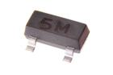 [DIOD-SO23-X-ESDP-01 > SMD (SOT-23) ESD Protection Diode](DIOD-SO23-X-ESDP-01/)| [DIOD-SO23-X-ESDP-01 > SMD (SOT-23) ESD Protection Diode](DIOD-SO23-X-ESDP-01/)|
| [DIOD-SO23-X-ESDP-V33D > SMD (SOT-23) ESD Protection Diode 3.3v](DIOD-SO23-X-ESDP-V33D/)||||

## DIOS > Diode (Schottky)
  

| [DIOS-D214-X-A01-01 > SMD (DO-214) 1 Amp Diode (Schottky)](DIOS-D214-X-A01-01/)| [DIOS-D214-X-A05-01 > SMD (DO-214) 5 Amp Diode (Schottky)](DIOS-D214-X-A05-01/)| [DIOS-S123-X-A01-01 > SMD (SOD-123) 1 Amp Diode (Schottky)](DIOS-S123-X-A01-01/)|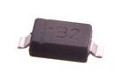 [DIOS-S123-X-A05D-01 > SMD (SOD-123) 500 mA Diode (Schottky)](DIOS-S123-X-A05D-01/)|
| :---: | :---: | :---: | :---: |
| [DIOS-S123-X-A05D-V40 > SMD (SOD-123) 500 mA Diode (Schottky) 40v](DIOS-S123-X-A05D-V40/)| [DIOS-SO23-X-A02D-01 > SMD (SOT-23) 200 mA Diode (Schottky)](DIOS-SO23-X-A02D-01/)|||

## DISP > Display
  

| [DISP-10SEL-GYR-STAN-01 > 10 Segment LED Bargraph Green, Yellow, Red Display](DISP-10SEL-GYR-STAN-01/)| [DISP-128X64-X-OLED-01 > 128 x 64 Pixels OLED Display](DISP-128X64-X-OLED-01/)| [DISP-16X2-G-LCD-01 >  16 x 2 Character LCD Green Display ](DISP-16X2-G-LCD-01/)| [DISP-16X2-G-LCD-I2 >  16 x 2 Character LCD Green Display (I2C) ](DISP-16X2-G-LCD-I2/)|
| :---: | :---: | :---: | :---: |
| [DISP-7SEL-R-4DIG-01 > 7 Segment LED 4 Digit Red Display](DISP-7SEL-R-4DIG-01/)||||

## FERB > Ferrite Bead
  

| [FERB-0402-X-O182-01 > SMD (0402) 1.8k Ohm Ferrite Bead](FERB-0402-X-O182-01/)| [FERB-0603-X-O121-01 > SMD (0603) 120 Ohm Ferrite Bead](FERB-0603-X-O121-01/)| [FERB-0603-X-O252-01 > SMD (0603) 2.5k Ohm Ferrite Bead](FERB-0603-X-O252-01/)| [FERB-0805-X-O221-01 > SMD (0805) 220 Ohm Ferrite Bead](FERB-0805-X-O221-01/)|
| :---: | :---: | :---: | :---: |
| [FERB-0805-X-O300-01 > SMD (0805) 30 Ohm Ferrite Bead](FERB-0805-X-O300-01/)| [FERB-0805-X-O331-01 > SMD (0805) 330 Ohm Ferrite Bead](FERB-0805-X-O331-01/)| [FERB-0805-X-O471-01 > SMD (0805) 470 Ohm Ferrite Bead](FERB-0805-X-O471-01/)||

## HEAD > Header
  

| [HEAD-I01-L-2X03PI-01 > 2.54 mm 6 Pin (2x3) Blue Header](HEAD-I01-L-2X03PI-01/)| [HEAD-I01-L-PI02-01 > 2.54 mm 2 Pin Blue Header](HEAD-I01-L-PI02-01/)| [HEAD-I01-L-PI06-01 > 2.54 mm 6 Pin Blue Header](HEAD-I01-L-PI06-01/)| [HEAD-I01-L-PI08-01 > 2.54 mm 8 Pin Blue Header](HEAD-I01-L-PI08-01/)|
| :---: | :---: | :---: | :---: |
| [HEAD-I01-W-PI02-01 > 2.54 mm 2 Pin White Header](HEAD-I01-W-PI02-01/)| [HEAD-I01-W-PI03-01 > 2.54 mm 3 Pin White Header](HEAD-I01-W-PI03-01/)| [HEAD-I01-W-PI08-01 > 2.54 mm 8 Pin White Header](HEAD-I01-W-PI08-01/)| [HEAD-I01-X-2X02PI-01 > 2.54 mm 4 Pin (2x2) Header](HEAD-I01-X-2X02PI-01/)|
| [HEAD-I01-X-2X02PI-RS > 2.54 mm 4 Pin (2x2) Header Right Angle (SMD)](HEAD-I01-X-2X02PI-RS/)| [HEAD-I01-X-2X03PI-01 > 2.54 mm 6 Pin (2x3) Header](HEAD-I01-X-2X03PI-01/)| [HEAD-I01-X-2X03PI-RA >  2.54 mm 6 Pin (2x3) Header Right Angle ](HEAD-I01-X-2X03PI-RA/)| [HEAD-I01-X-2X03PI-RS > 2.54 mm 6 Pin (2x3) Header Right Angle (SMD)](HEAD-I01-X-2X03PI-RS/)|
| [HEAD-I01-X-2X04PI-RA >  2.54 mm 8 Pin (2x4) Header Right Angle ](HEAD-I01-X-2X04PI-RA/)| [HEAD-I01-X-2X04PI-RS > 2.54 mm 8 Pin (2x4) Header Right Angle (SMD)](HEAD-I01-X-2X04PI-RS/)| [HEAD-I01-X-2X05PI-RS > 2.54 mm 10 Pin (2x5) Header Right Angle (SMD)](HEAD-I01-X-2X05PI-RS/)| [HEAD-I01-X-2X06PI-RS > 2.54 mm 12 Pin (2x6) Header Right Angle (SMD)](HEAD-I01-X-2X06PI-RS/)|
| [HEAD-I01-X-2X07PI-RS > 2.54 mm 14 Pin (2x7)Header Right Angle (SMD)](HEAD-I01-X-2X07PI-RS/)| [HEAD-I01-X-2X08PI-RS > 2.54 mm 16 Pin (2x8) Header Right Angle (SMD)](HEAD-I01-X-2X08PI-RS/)| [HEAD-I01-X-2X09PI-RS > 2.54 mm 18 Pin (2x9) Header Right Angle (SMD)](HEAD-I01-X-2X09PI-RS/)| [HEAD-I01-X-2X10PI-RS > 2.54 mm 20 Pin (2x10) Header Right Angle (SMD)](HEAD-I01-X-2X10PI-RS/)|
| [HEAD-I01-X-2X11PI-RS > 2.54 mm 22 Pin (2x11) Header Right Angle (SMD)](HEAD-I01-X-2X11PI-RS/)| [HEAD-I01-X-2X12PI-RS > 2.54 mm 24 Pin (2x12) Header Right Angle (SMD)](HEAD-I01-X-2X12PI-RS/)| [HEAD-I01-X-2X13PI-RS > 2.54 mm 26 Pin (2x13) Header Right Angle (SMD)](HEAD-I01-X-2X13PI-RS/)| [HEAD-I01-X-2X36PI-RA >  2.54 mm 72 Pin (2x36) Header Right Angle ](HEAD-I01-X-2X36PI-RA/)|
|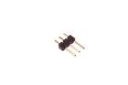 [HEAD-I01-X-PI03-01 > 2.54 mm 3 Pin Header](HEAD-I01-X-PI03-01/)| [HEAD-I01-X-PI01-RS > 2.54 mm 1 Pin Header Right Angle (SMD)](HEAD-I01-X-PI01-RS/)| [HEAD-I01-X-PI02-01 > 2.54 mm 2 Pin Header](HEAD-I01-X-PI02-01/)| [HEAD-I01-X-PI02-RS > 2.54 mm 2 Pin Header Right Angle (SMD)](HEAD-I01-X-PI02-RS/)|
| [HEAD-I01-X-PI03-01 > 2.54 mm 3 Pin Header](HEAD-I01-X-PI03-01/)| [HEAD-I01-X-PI03-OOEB > 2.54 mm 3 Pin Header (OOEB)](HEAD-I01-X-PI03-OOEB/)| [HEAD-I01-X-PI03-RA > 2.54 mm 3 Pin Header Right Angle](HEAD-I01-X-PI03-RA/)| [HEAD-I01-X-PI03-RS > 2.54 mm 3 Pin Header Right Angle (SMD)](HEAD-I01-X-PI03-RS/)|
| [HEAD-I01-X-PI04-01 > 2.54 mm 4 Pin Header](HEAD-I01-X-PI04-01/)| [HEAD-I01-X-PI04-RS > 2.54 mm 4 Pin Header Right Angle (SMD)](HEAD-I01-X-PI04-RS/)| [HEAD-I01-X-PI05-01 > 2.54 mm 5 Pin Header](HEAD-I01-X-PI05-01/)| [HEAD-I01-X-PI05-RS > 2.54 mm 5 Pin Header Right Angle (SMD)](HEAD-I01-X-PI05-RS/)|
| [HEAD-I01-X-PI06-01 > 2.54 mm 6 Pin Header](HEAD-I01-X-PI06-01/)| [HEAD-I01-X-PI06-RA > 2.54 mm 6 Pin Header Right Angle](HEAD-I01-X-PI06-RA/)| [HEAD-I01-X-PI06-RS > 2.54 mm 6 Pin Header Right Angle (SMD)](HEAD-I01-X-PI06-RS/)| [HEAD-I01-X-PI07-01 > 2.54 mm 7 Pin Header](HEAD-I01-X-PI07-01/)|
| [HEAD-I01-X-PI07-RS > 2.54 mm 7 Pin Header Right Angle (SMD)](HEAD-I01-X-PI07-RS/)| [HEAD-I01-X-PI08-01 > 2.54 mm 8 Pin Header](HEAD-I01-X-PI08-01/)| [HEAD-I01-X-PI08-RS > 2.54 mm 8 Pin Header Right Angle (SMD)](HEAD-I01-X-PI08-RS/)| [HEAD-I01-X-PI09-01 > 2.54 mm 9 Pin Header](HEAD-I01-X-PI09-01/)|
| [HEAD-I01-X-PI08-RS > 2.54 mm 8 Pin Header Right Angle (SMD)](HEAD-I01-X-PI08-RS/)| [HEAD-I01-X-PI10-01 > 2.54 mm 10 Pin Header](HEAD-I01-X-PI10-01/)| [HEAD-I01-X-PI10-RS > 2.54 mm 10 Pin Header Right Angle (SMD)](HEAD-I01-X-PI10-RS/)| [HEAD-I01-X-PI10-RS > 2.54 mm 10 Pin Header Right Angle (SMD)](HEAD-I01-X-PI10-RS/)|
| [HEAD-I01-X-PI12-01 > 2.54 mm 12 Pin Header](HEAD-I01-X-PI12-01/)| [HEAD-I01-X-PI12-RS > 2.54 mm 12 Pin Header Right Angle (SMD)](HEAD-I01-X-PI12-RS/)| [HEAD-I01-X-PI14-01 > 2.54 mm 14 Pin Header](HEAD-I01-X-PI14-01/)| [HEAD-I01-X-PI16-01 > 2.54 mm 16 Pin Header](HEAD-I01-X-PI16-01/)|
| [HEAD-I01-X-PI18-01 > 2.54 mm 18 Pin Header](HEAD-I01-X-PI18-01/)| [HEAD-I01-X-PI20-01 > 2.54 mm 20 Pin Header](HEAD-I01-X-PI20-01/)| [HEAD-I01-X-PI36-01 > 2.54 mm 36 Pin Header](HEAD-I01-X-PI36-01/)| [HEAD-I01-X-3X03PI-01 >  2.54 mm 9 Pin (3x3) Header ](HEAD-I01-X-3X03PI-01/)|
|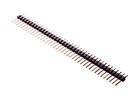 [HEAD-I01-X-PI40-01 > 2.54 mm 40 Pin Header](HEAD-I01-X-PI40-01/)| [HEAD-I01-Y-2X03PI-01 > 2.54 mm 6 Pin (2x3) Yellow Header](HEAD-I01-Y-2X03PI-01/)|||

## HEAF > Female Header
  

| [HEAF-02-L-PI10-01 > 2 mm 10 Pin Blue Female Header](HEAF-02-L-PI10-01/)| [HEAF-02-W-PI10-01 > 2 mm 10 Pin White Female Header](HEAF-02-W-PI10-01/)| [HEAF-02-X-PI10-01 > 2 mm 10 Pin Female Header](HEAF-02-X-PI10-01/)| [HEAF-02-X-PI10-SM > 2 mm 10 Pin Female Header (SMD)](HEAF-02-X-PI10-SM/)|
| :---: | :---: | :---: | :---: |
| [HEAF-I01-W-PI06-01 > 2.54 mm 6 Pin White Female Header](HEAF-I01-W-PI06-01/)| [HEAF-I01-W-PI08-01 > 2.54 mm 8 Pin White Female Header](HEAF-I01-W-PI08-01/)| [HEAF-I01-X-2X04PI-01 > 2.54 mm 8 Pin (2x4) Female Header](HEAF-I01-X-2X04PI-01/)| [HEAF-I01-X-PI02-RO > 2.54 mm 2 Pin Female Header (Round)](HEAF-I01-X-PI02-RO/)|
| [HEAF-I01-X-PI04-01 > 2.54 mm 4 Pin Female Header](HEAF-I01-X-PI04-01/)| [HEAF-I01-X-PI06-01 > 2.54 mm 6 Pin Female Header](HEAF-I01-X-PI06-01/)| [HEAF-I01-Y-PI08-01 > 2.54 mm 8 Pin Yellow Female Header](HEAF-I01-Y-PI08-01/)| [HEAF-I01-X-PI10-01 > 2.54 mm 10 Pin Female Header](HEAF-I01-X-PI10-01/)|
| [HEAF-I01-Y-PI06-01 > 2.54 mm 6 Pin Yellow Female Header](HEAF-I01-Y-PI06-01/)| [HEAF-I01-Y-PI06-01 > 2.54 mm 6 Pin Yellow Female Header](HEAF-I01-Y-PI06-01/)| [HEAF-I01-Y-PI10-01 > 2.54 mm 10 Pin Yellow Female Header](HEAF-I01-Y-PI10-01/)||

## HEAL > Header (Long)
  

| [HEAL-I01-X-PI03-01 > 2.54 mm 3 Pin Header (Long)](HEAL-I01-X-PI03-01/)| [HEAL-I01-X-PI36-01 > 2.54 mm 36 Pin Header (Long)](HEAL-I01-X-PI36-01/)|||
| :---: | :---: | :---: | :---: |

## HEDS > Headphone Socket
  

| [HEDS-35D-T-SMDS-4P > 3.5 mm SMD Headphone Socket (4 Pin)](HEDS-35D-T-SMDS-4P/)| [HEDS-35D-U-SMDS-4P > 3.5 mm SMD Headphone Socket (4 Pin)](HEDS-35D-U-SMDS-4P/)| [HEDS-35D-X-SMDS-01 > 3.5 mm SMD Headphone Socket](HEDS-35D-X-SMDS-01/)| [HEDS-35D-X-SMDS-4P > 3.5 mm SMD Headphone Socket (4 Pin)](HEDS-35D-X-SMDS-4P/)|
| :---: | :---: | :---: | :---: |
|||||

## HELF > Female Header (Long)
  

| [HELF-I01-L-2X03PI-01 > 2.54 mm 6 Pin (2x3) Blue Female Header (Long)](HELF-I01-L-2X03PI-01/)| [HELF-I01-L-PI06-01 > 2.54 mm 6 Pin Blue Female Header (Long)](HELF-I01-L-PI06-01/)| [HELF-I01-L-PI08-01 > 2.54 mm 8 Pin Blue Female Header (Long)](HELF-I01-L-PI08-01/)| [HELF-I01-L-PI10-01 > 2.54 mm 10 Pin Blue Female Header (Long)](HELF-I01-L-PI10-01/)|
| :---: | :---: | :---: | :---: |
| [HELF-I01-X-PI06-01 > 2.54 mm 6 Pin Female Header (Long)](HELF-I01-X-PI06-01/)| [HELF-I01-X-PI08-01 > 2.54 mm 8 Pin Female Header (Long)](HELF-I01-X-PI08-01/)|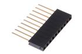 [HELF-I01-X-PI10-01 > 2.54 mm 10 Pin Female Header (Long)](HELF-I01-X-PI10-01/)||

## HESH > Heat Shrink
  

| [HESH-03-B-STAN-01 > 3 mm Black Heat Shrink](HESH-03-B-STAN-01/)| [HESH-03-E-STAN-01 > 3 mm Grey Heat Shrink](HESH-03-E-STAN-01/)| [HESH-03-G-STAN-01 > 3 mm Green Heat Shrink](HESH-03-G-STAN-01/)| [HESH-03-L-STAN-01 > 3 mm Blue Heat Shrink](HESH-03-L-STAN-01/)|
| :---: | :---: | :---: | :---: |
| [HESH-03-N-STAN-01 > 3 mm Brown Heat Shrink](HESH-03-N-STAN-01/)| [HESH-03-O-STAN-01 > 3 mm Orange Heat Shrink](HESH-03-O-STAN-01/)| [HESH-03-R-STAN-01 > 3 mm Red Heat Shrink](HESH-03-R-STAN-01/)|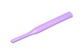 [HESH-03-V-STAN-01 > 3 mm Purple Heat Shrink](HESH-03-V-STAN-01/)|
|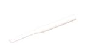 [HESH-03-W-STAN-01 > 3 mm White Heat Shrink](HESH-03-W-STAN-01/)| [HESH-03-Y-STAN-01 > 3 mm Yellow Heat Shrink](HESH-03-Y-STAN-01/)| [HESH-06-B-STAN-01 > 6 mm Black Heat Shrink](HESH-06-B-STAN-01/)| [HESH-06-E-STAN-01 > 6 mm Grey Heat Shrink](HESH-06-E-STAN-01/)|
|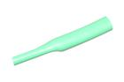 [HESH-06-G-STAN-01 > 6 mm Green Heat Shrink](HESH-06-G-STAN-01/)|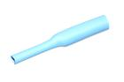 [HESH-06-L-STAN-01 > 6 mm Blue Heat Shrink](HESH-06-L-STAN-01/)|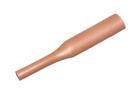 [HESH-06-N-STAN-01 > 6 mm Brown Heat Shrink](HESH-06-N-STAN-01/)| [HESH-06-O-STAN-01 > 6 mm Orange Heat Shrink](HESH-06-O-STAN-01/)|
| [HESH-06-R-STAN-01 > 6 mm Red Heat Shrink](HESH-06-R-STAN-01/)| [HESH-06-V-STAN-01 > 6 mm Purple Heat Shrink](HESH-06-V-STAN-01/)| [HESH-06-W-STAN-01 > 6 mm White Heat Shrink](HESH-06-W-STAN-01/)| [HESH-06-Y-STAN-01 > 6 mm Yellow Heat Shrink](HESH-06-Y-STAN-01/)|
| [HESH-15D-B-STAN-01 > 1.5 mm Black Heat Shrink](HESH-15D-B-STAN-01/)| [HESH-15D-E-STAN-01 > 1.5 mm Grey Heat Shrink](HESH-15D-E-STAN-01/)| [HESH-15D-G-STAN-01 > 1.5 mm Green Heat Shrink](HESH-15D-G-STAN-01/)|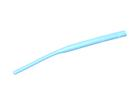 [HESH-15D-L-STAN-01 > 1.5 mm Blue Heat Shrink](HESH-15D-L-STAN-01/)|
| [HESH-15D-N-STAN-01 > 1.5 mm Brown Heat Shrink](HESH-15D-N-STAN-01/)| [HESH-15D-O-STAN-01 > 1.5 mm Orange Heat Shrink](HESH-15D-O-STAN-01/)| [HESH-15D-R-STAN-01 > 1.5 mm Red Heat Shrink](HESH-15D-R-STAN-01/)| [HESH-15D-V-STAN-01 > 1.5 mm Purple Heat Shrink](HESH-15D-V-STAN-01/)|
| [HESH-15D-W-STAN-01 > 1.5 mm White Heat Shrink](HESH-15D-W-STAN-01/)| [HESH-15D-Y-STAN-01 > 1.5 mm Yellow Heat Shrink](HESH-15D-Y-STAN-01/)|||

## ICIC > 
  

| [ICIC-DFN10-X-K7660-01 > SMD (DFN-10) 3-Axis Accelerometer (MMA7660FCR1)](ICIC-DFN10-X-K7660-01/)| [ICIC-DFN8-X-KCN3065-01 > SMD (DFN-8) Lithium Ion Battery Charger (CN3065)](ICIC-DFN8-X-KCN3065-01/)| [ICIC-DI08-X-K555-01 > 8 Pin DIP 555 Timer](ICIC-DI08-X-K555-01/)| [ICIC-DI14-X-K1820-01 > 14 Pin DIP Voice Recorder (ISD1820P)](ICIC-DI14-X-K1820-01/)|
| :---: | :---: | :---: | :---: |
| [ICIC-DI16-X-K595-01 > 16 Pin DIP 74HC595 8-Bit Shift Register (Latching)](ICIC-DI16-X-K595-01/)| [ICIC-DI16-X-KL293D-01 > 16 Pin DIP Dual H-Bridge (L293D)](ICIC-DI16-X-KL293D-01/)| [ICIC-DI18-X-K2803-01 > 18 Pin DIP ULN2803A Octal Transistor Array](ICIC-DI18-X-K2803-01/)| [ICIC-DI18-X-KTM1636-01 > 18 Pin DIP 7 Segment Driver and Keypad Scanning (TM1636)](ICIC-DI18-X-KTM1636-01/)|
| [ICIC-DI28-X-K328-01 > 28 Pin DIP AtMega328P](ICIC-DI28-X-K328-01/)| [ICIC-DI28W-X-KLPC14-01 > 28 Pin DIP (0.6") DIP LPC1114 (Cortex M0)](ICIC-DI28W-X-KLPC14-01/)| [ICIC-HQFN33-X-KLPC33-01 > 33 Pin SMD (Heatsink QFN) LPC11U35FHI33 (Cortex M0)](ICIC-HQFN33-X-KLPC33-01/)| [ICIC-LG14-X-K345-01 > 14 Pin SMD (LGA) Digital Accelerometer (ADXL345)](ICIC-LG14-X-K345-01/)|
| [ICIC-PS20-X-KL298-A4 > SMD (Power SO-20) Dual H-Bridge (L298) 4 A](ICIC-PS20-X-KL298-A4/)| [ICIC-QFN16-X-K5883-01 > 16 Pin SMD (QFN) 3-Axis Digital Compass (HMC5883L)](ICIC-QFN16-X-K5883-01/)| [ICIC-QFN24-X-K9250-01 > 24 Pin SMD (QFN) 9-Axis Inertial Measurement Unit (MPU-9250)](ICIC-QFN24-X-K9250-01/)| [ICIC-QFN28-X-K4988-01 > 28 Pin SMD (QFN) Stepper Motor Driver (A4988)](ICIC-QFN28-X-K4988-01/)|
| [ICIC-QFN32-X-K168-01 > 32 Pin SMD (QFN) AtMega168P](ICIC-QFN32-X-K168-01/)| [ICIC-QFN48-X-KRF822-01 > 48 Pin SMD (QFN) nRF51822 (Bluetooth MCU)](ICIC-QFN48-X-KRF822-01/)| [ICIC-QFP100-X-KLPC17-01 > 100 Pin SMD (TQFP) LPC1768 (Cortex M3)](ICIC-QFP100-X-KLPC17-01/)| [ICIC-QFP32-X-K8-01 > 32 Pin SMD (TQFP) AtMega8A](ICIC-QFP32-X-K8-01/)|
| [ICIC-QFP44-X-K32U4-01 > 44 Pin SMD (TQFP) AtMega32U4](ICIC-QFP44-X-K32U4-01/)| [ICIC-QFP64-X-KLPC11-01 > 64 Pin SMD (TQFP) LPC11U24 (Cortex M0)](ICIC-QFP64-X-KLPC11-01/)| [ICIC-SC16-X-KM232-01 > 16 Pin SMD (SOIC) RS232 to TTL Converter (MAX232)](ICIC-SC16-X-KM232-01/)| [ICIC-SC16W-X-K2515-01 > 16 Pin SMD (SOIC Wide) CAN Controller SPI (MCP2515)](ICIC-SC16W-X-K2515-01/)|
| [ICIC-SC75-X-K125LS-01 > 5 Pin SMD (SC70) Single Buffer (74LVC1G125)](ICIC-SC75-X-K125LS-01/)| [ICIC-SC8-X-K2551-01 > 8 Pin SMD (SOIC) CAN Tranceiver (MCP2521)](ICIC-SC8-X-K2551-01/)| [ICIC-SC8-X-KDS1307-01 > SMD (SOIC-8) Real Time Clock (DS1307)](ICIC-SC8-X-KDS1307-01/)| [ICIC-SC8-X-KDS1337-01 > 8 Pin SMD (SOIC) Real Time Clock (DS1337)](ICIC-SC8-X-KDS1337-01/)|
| [ICIC-SC8-X-KM293-01 > 8 Pin SMD (SOIC) Dual Differential Comparator (LM293)](ICIC-SC8-X-KM293-01/)| [ICIC-SO235-X-K1555-01 > SMD (SOT-23-5) Lithium Ion Battery Charger (1 Cell) (MAX1555)](ICIC-SO235-X-K1555-01/)| [ICIC-SP16-X-K2291-01 > 16 Pin SMD (SOP) PIR Motion Sensing (TM2291)](ICIC-SP16-X-K2291-01/)| [ICIC-SP16-X-KCH340-01 > 16 Pin SMD (SOP) USB-Serial (CH340)](ICIC-SP16-X-KCH340-01/)|
| [ICIC-SP20-X-K1620-01 >  20 Pin SMD (SOP) 7 Segment 8 Digit LED Driver (TM1620) ](ICIC-SP20-X-K1620-01/)| [ICIC-SP20-X-K1637-01 > 20 Pin SMD (SOP) 7 Segment 8 Digit LED Driver (TM1637)](ICIC-SP20-X-K1637-01/)| [ICIC-SP20-X-KHT46-01 >  20 Pin SMD (SOP) Holtek HT46R066 ](ICIC-SP20-X-KHT46-01/)| [ICIC-SS16-X-KF230-01 > 16 Pin SMD (SSOP) High Speed USB-Serial (FT230XS-R)](ICIC-SS16-X-KF230-01/)|
| [ICIC-SS24-X-K6612-01 > 24 Pin SMD (SSOP) Dual H-Bridge (TB6612)](ICIC-SS24-X-K6612-01/)| [ICIC-SS28-X-K232-01 > 28 Pin SMD (SSOP) FTDI USB-Serial](ICIC-SS28-X-K232-01/)| [ICIC-SS28-X-KFT232-01 > 28 Pin SMD (SSOP) USB-Serial (FT232RL)](ICIC-SS28-X-KFT232-01/)| [ICIC-TQ32-X-K328-01 > 32 Pin SMD (TQFP) AtMega328P](ICIC-TQ32-X-K328-01/)|
| [ICIC-TS14-X-K125-01 > 14 Pin SMD (TSSOP) Quad Buffer (74HC125)](ICIC-TS14-X-K125-01/)| [ICIC-TS20-X-K108-01 > 20 Pin SMD (TSSOP) 8-bit Level Shifter (TXS108E)](ICIC-TS20-X-K108-01/)| [ICIC-TS20-X-K108B-01 > 20 Pin SMD (TSSOP) 8 bit Level Shifter (TXB0108PW)](ICIC-TS20-X-K108B-01/)| [ICIC-TS24-X-K9221-01 > 24 Pin SMD (TSSOP) 12 Channel Constant Current LED Driver (MY9221)](ICIC-TS24-X-K9221-01/)|
| [ICIC-UDF6-X-K2659-01 > SMD (UDFN-6) GPS Amplifier (MAX2659)](ICIC-UDF6-X-K2659-01/)| [ICIC-VQF32-X-K328-01 > 32 Pin SMD (VQFN) AtMega328P](ICIC-VQF32-X-K328-01/)| [ICIC-VQF44-X-K32U4-01 > 44 Pin SMD (VQFN) AtMega32U4](ICIC-VQF44-X-K32U4-01/)||

## MCUU > MCU
  

| [MCUU-QFN32-X--01 > 32 Pin SMD (QFN) AtMega32U4 MCU](MCUU-QFN32-X--01/)| [MCUU-QFP100-X--01 > 100 Pin SMD (TQFP) Stepper Motor Driver (A4988) MCU](MCUU-QFP100-X--01/)|||
| :---: | :---: | :---: | :---: |

## ICSO > IC Socket
  

| [ICSO-DI16-X-STAN-01 > 16 Pin DIP IC Socket](ICSO-DI16-X-STAN-01/)| [ICSO-DI18-X-STAN-01 > 18 Pin DIP IC Socket](ICSO-DI18-X-STAN-01/)| [ICSO-DI28-X-STAN-01 > 28 Pin DIP IC Socket](ICSO-DI28-X-STAN-01/)||
| :---: | :---: | :---: | :---: |

## INDU > Inductor
  

| [INDU-0402-X-NH15-01 > SMD (0402) 15 nH Inductor](INDU-0402-X-NH15-01/)| [INDU-0402-X-NH33D-01 > SMD (0402) 3.3 NH Inductor](INDU-0402-X-NH33D-01/)| [INDU-0402-X-NH47D-01 > SMD (0402) 4.7 nH Inductor](INDU-0402-X-NH47D-01/)| [INDU-06-X-UH10-01 > 6 mm 10 uH Inductor](INDU-06-X-UH10-01/)|
| :---: | :---: | :---: | :---: |
|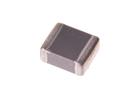 [INDU-0805-X-NH47D-01 > SMD (0805) 4.7 nH Inductor](INDU-0805-X-NH47D-01/)| [INDU-0806-X-UH10-01 > SMD (0806) 10 uH Inductor](INDU-0806-X-UH10-01/)| [INDU-39D-X-UH47D-01 > 3.9 mm 4.7 uH Inductor](INDU-39D-X-UH47D-01/)||

## JSTS > JST Socket
  

| [JSTS-01-X-PI02-SM > 1 mm 2 Pin JST Socket (SMD)](JSTS-01-X-PI02-SM/)| [JSTS-02-X-PI02-01 > 2 mm 2 Pin JST Socket](JSTS-02-X-PI02-01/)| [JSTS-02-X-PI02-RA > 2 mm 2 Pin JST Socket Right Angle](JSTS-02-X-PI02-RA/)| [JSTS-02-X-PI02-RS > 2 mm 2 Pin JST Socket Right Angle (SMD)](JSTS-02-X-PI02-RS/)|
| :---: | :---: | :---: | :---: |
| [JSTS-02-X-PI04-01 > 2 mm 4 Pin JST Socket](JSTS-02-X-PI04-01/)| [JSTS-02-X-PI04-RA > 2 mm 4 Pin JST Socket Right Angle](JSTS-02-X-PI04-RA/)| [JSTS-02-X-PI04-RS > 2 mm 4 Pin JST Socket Right Angle (SMD)](JSTS-02-X-PI04-RS/)| [JSTS-02-X-PI04-SM > 2 mm 4 Pin JST Socket SMD](JSTS-02-X-PI04-SM/)|
|||||

## JUMP > Jumper
  

| [JUMP-I01-X-STAN-01 > 2.54 mm Jumper](JUMP-I01-X-STAN-01/)||||
| :---: | :---: | :---: | :---: |

## LEDS > LED
  

| [LEDS-03-G-STAN-01 > 3 mm Green LED](LEDS-03-G-STAN-01/)| [LEDS-03-R-STAN-01 > 3 mm Red LED](LEDS-03-R-STAN-01/)| [LEDS-0402-L-STAN-01 > SMD (0402) Blue LED](LEDS-0402-L-STAN-01/)| [LEDS-0402-W-STAN-01 > SMD (0402) White LED](LEDS-0402-W-STAN-01/)|
| :---: | :---: | :---: | :---: |
| [LEDS-05-G-STAN-01 > 5 mm Green LED](LEDS-05-G-STAN-01/)| [LEDS-05-G-TINT-01 > 5 mm Tinted Green LED](LEDS-05-G-TINT-01/)| [LEDS-05-I9-STAN-01 > 5 mm IR (940 nm) LED](LEDS-05-I9-STAN-01/)| [LEDS-05-L-STAN-01 > 5 mm Blue LED](LEDS-05-L-STAN-01/)|
| [LEDS-05-L-TINT-01 > 5 mm Tinted Blue LED](LEDS-05-L-TINT-01/)| [LEDS-05-O-STAN-01 > 5 mm Orange LED](LEDS-05-O-STAN-01/)| [LEDS-05-O-TINT-01 > 5 mm Tinted Orange LED](LEDS-05-O-TINT-01/)| [LEDS-05-P-TINT-01 > 5 mm Tinted Pink LED](LEDS-05-P-TINT-01/)|
| [LEDS-05-R-STAN-01 > 5 mm Red LED](LEDS-05-R-STAN-01/)|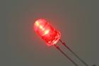 [LEDS-05-R-TINT-01 > 5 mm Tinted Red LED](LEDS-05-R-TINT-01/)| [LEDS-05-RGB-STAN-01 > 5 mm RGB LED](LEDS-05-RGB-STAN-01/)| [LEDS-05-V-STAN-01 > 5 mm Purple LED](LEDS-05-V-STAN-01/)|
| [LEDS-05-V-TINT-01 > 5 mm Tinted Purple LED](LEDS-05-V-TINT-01/)| [LEDS-05-W-STAN-01 > 5 mm White LED](LEDS-05-W-STAN-01/)| [LEDS-05-W-TINT-01 > 5 mm Tinted White LED](LEDS-05-W-TINT-01/)| [LEDS-05-Y-STAN-01 > 5 mm Yellow LED](LEDS-05-Y-STAN-01/)|
| [LEDS-05-Y-TINT-01 > 5 mm Tinted Yellow LED](LEDS-05-Y-TINT-01/)| [LEDS-0603-G-STAN-01 > SMD (0603) Green LED](LEDS-0603-G-STAN-01/)| [LEDS-0603-L-STAN-01 > SMD (0603) Blue LED](LEDS-0603-L-STAN-01/)| [LEDS-0603-R-STAN-01 > SMD (0603) Red LED](LEDS-0603-R-STAN-01/)|
|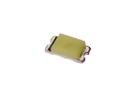 [LEDS-0603-W-STAN-01 > SMD (0603) White LED](LEDS-0603-W-STAN-01/)|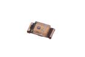 [LEDS-0603-Y-STAN-01 > SMD (0603) Yellow LED](LEDS-0603-Y-STAN-01/)| [LEDS-08-RGB-STAN-CA > 8 mm RGB LED Common Anode](LEDS-08-RGB-STAN-CA/)| [LEDS-0805-G-STAN-01 > SMD (0805) Green LED](LEDS-0805-G-STAN-01/)|
| [LEDS-0805-L-STAN-01 > SMD (0805) Blue LED](LEDS-0805-L-STAN-01/)| [LEDS-0805-R-STAN-01 > SMD (0805) Red LED](LEDS-0805-R-STAN-01/)| [LEDS-0805-Y-STAN-01 > SMD (0805) Yellow LED](LEDS-0805-Y-STAN-01/)| [LEDS-10-G-FROS-01 > 10 mm Frosted Green LED](LEDS-10-G-FROS-01/)|
| [LEDS-10-L-FROS-01 > 10 mm Frosted Blue LED](LEDS-10-L-FROS-01/)| [LEDS-10-O-FROS-01 > 10 mm Frosted Orange LED](LEDS-10-O-FROS-01/)| [LEDS-10-P-FROS-01 > 10 mm Frosted Pink LED](LEDS-10-P-FROS-01/)| [LEDS-10-R-FROS-01 > 10 mm Frosted Red LED](LEDS-10-R-FROS-01/)|
|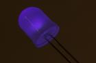 [LEDS-10-V-FROS-01 > 10 mm Frosted Purple LED](LEDS-10-V-FROS-01/)| [LEDS-10-W-FROS-01 > 10 mm Frosted White LED](LEDS-10-W-FROS-01/)| [LEDS-10-Y-FROS-01 > 10 mm Frosted Yellow LED](LEDS-10-Y-FROS-01/)| [LEDS-5050-RGB-K2812-01 > SMD (5050) Smart Controller (WS2812B) RGB LED](LEDS-5050-RGB-K2812-01/)|
|||||

## MICR > Microphone
  

| [MICR-97D-X-STAN-01 > 9.7 mm Microphone](MICR-97D-X-STAN-01/)||||
| :---: | :---: | :---: | :---: |

## MOSN > N-Ch. MOSFET
  

| [MOSN-SO23-X-A03D-01 > SMD (SOT-23) 300 mA N-Ch. MOSFET](MOSN-SO23-X-A03D-01/)| [MOSN-SO23-X-A21D-01 > SMD (SOT-23) 2.1 Amp N-Ch. MOSFET](MOSN-SO23-X-A21D-01/)|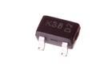 [MOSN-SO323-X-A02D-01 > SMD (SOT-323) 200 mA N-Ch. MOSFET](MOSN-SO323-X-A02D-01/)| [MOSN-T220-X-A23-01 > TO-220 23 Amp N-Ch. MOSFET](MOSN-T220-X-A23-01/)|
| :---: | :---: | :---: | :---: |
|||||

## MOSP > P-Ch. MOSFET
  

| [MOSP-SO23-X-A02-01 > SMD (SOT-23) 2 Amp P-Ch. MOSFET](MOSP-SO23-X-A02-01/)| [MOSP-SO23-X-A35D-01 > SMD (SOT-23) 3.5 Amp P-Ch. MOSFET](MOSP-SO23-X-A35D-01/)| [MOSP-SO23-X-A41D-01 > SMD (SOT-23) 4.1 Amp P-Ch. MOSFET](MOSP-SO23-X-A41D-01/)| [MOSP-SO23-X-A43D-01 > SMD (SOT-23) 4.3 Amp P-Ch. MOSFET](MOSP-SO23-X-A43D-01/)|
| :---: | :---: | :---: | :---: |
| [MOSP-SO23F-X-A06-01 > SMD (SOT-23F) 6 Amp P-Ch. MOSFET](MOSP-SO23F-X-A06-01/)| [MOSP-T220-X-A19-01 > TO-220 19 Amp P-Ch. MOSFET](MOSP-T220-X-A19-01/)|||

## MOTO > Motor
  

| [MOTO-24-X-STAN-01 > 24 mm Motor](MOTO-24-X-STAN-01/)||||
| :---: | :---: | :---: | :---: |

## NHFF > Nylon Standoff (F-F)
  

|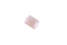 [NHFF-M3-X-06-01 > M3 x 6 mm Nylon Standoff (F-F)](NHFF-M3-X-06-01/)| [NHFF-M3-X-12-01 > M3 x 12 mm Nylon Standoff (F-F)](NHFF-M3-X-12-01/)| [NHFF-M3-X-15-01 > M3 x 15 mm Nylon Standoff (F-F)](NHFF-M3-X-15-01/)|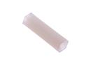 [NHFF-M3-X-20-01 > M3 x 20 mm Nylon Standoff (F-F)](NHFF-M3-X-20-01/)|
| :---: | :---: | :---: | :---: |
| [NHFF-M3-X-25-01 > M3 x 25 mm Nylon Standoff (F-F)](NHFF-M3-X-25-01/)| [NHFF-M3-X-30-01 > M3 x 30 mm Nylon Standoff (F-F)](NHFF-M3-X-30-01/)|||

## NNUT > Nylon Nut
  

| [NNUT-M3-X-STAN-01 > M3 Nylon Nut](NNUT-M3-X-STAN-01/)||||
| :---: | :---: | :---: | :---: |

## NSCR > Nylon Screw
  

| [NSCR-M3-X-12-70 > M3 x 12 mm Nylon Screw Cross Head](NSCR-M3-X-12-70/)| [NSCR-M3-X-16-70 > M3 x 16 mm Nylon Screw Cross Head](NSCR-M3-X-16-70/)| [NSCR-M3-X-20-70 > M3 x 20 mm Nylon Screw Cross Head](NSCR-M3-X-20-70/)| [NSCR-M3-X-25-70 > M3 x 25 mm Nylon Screw Cross Head](NSCR-M3-X-25-70/)|
| :---: | :---: | :---: | :---: |
|||||

## NUTT > Nut
  

| [NUTT-M3-M-STAN-01 > M3 Nut](NUTT-M3-M-STAN-01/)||||
| :---: | :---: | :---: | :---: |

## OPAM > Op Amp
  

| [OPAM-MS08-X-KLMV358-01 > 8 Pin SMD (MSOP) LMV358 Op Amp](OPAM-MS08-X-KLMV358-01/)| [OPAM-SC14-X-KLMV324-01 > SMD (SOIC-14) LMV324 Op Amp](OPAM-SC14-X-KLMV324-01/)| [OPAM-SC8-X-K2904-01 > 8 Pin SMD (SOIC) LM2904 Dual Op Amp](OPAM-SC8-X-K2904-01/)| [OPAM-SC8-X-KLM358-01 > SMD (SOIC-8) LM358 Op Amp](OPAM-SC8-X-KLM358-01/)|
| :---: | :---: | :---: | :---: |
| [OPAM-SO235-X-K333-01 > SMD (SOT-23-5) OPA333 Op Amp](OPAM-SO235-X-K333-01/)||||

## PHTR > Phototransistor
  

| [PHTR-05-I9-STAN-01 > 5 mm IR (940 nm) Phototransistor](PHTR-05-I9-STAN-01/)||||
| :---: | :---: | :---: | :---: |

## POTE > Potentiometer
  

| [POTE-07-X-O102-01 > 7 mm 1k Ohm Potentiometer](POTE-07-X-O102-01/)| [POTE-07-X-O103-01 > 7 mm 10k Ohm Potentiometer](POTE-07-X-O103-01/)| [POTE-14-X-O204-68 > 14 mm 200k Ohm Potentiometer Side Adjust](POTE-14-X-O204-68/)| [POTE-17-X-O102-69 > 17 mm 1k Ohm Potentiometer Panel Mount](POTE-17-X-O102-69/)|
| :---: | :---: | :---: | :---: |
| [POTE-17-X-O103-69 > 17 mm 10k Ohm Potentiometer Panel Mount](POTE-17-X-O103-69/)| [POTE-17-X-O104-69 > 17 mm 100k Ohm Potentiometer Panel Mount](POTE-17-X-O104-69/)| [POTE-17-X-O105-69 > 17 mm 1M Ohm Potentiometer Panel Mount](POTE-17-X-O105-69/)| [POTE-95D-L-O103-01 > 9.5 mm 10k Ohm Blue Potentiometer](POTE-95D-L-O103-01/)|
|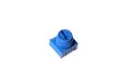 [POTE-95D-X-O103-01 > 9.5 mm 10k Ohm Potentiometer](POTE-95D-X-O103-01/)| [POTE-98D-X-O103-01 > 9.8 mm 10k Ohm Potentiometer](POTE-98D-X-O103-01/)|||

## POAD > Power Adapter
  

| [POAD-ACUS-X-V05U-A1 > American Style (120v) 5v (USB) Power Adapter 1 A](POAD-ACUS-X-V05U-A1/)||||
| :---: | :---: | :---: | :---: |

## PRIV > Plastic Rivet
  

| [PRIV-M2-X-05-01 > M2 x 5 mm Plastic Rivet](PRIV-M2-X-05-01/)| [PRIV-M3-X-06-01 > M3 x 6 mm Plastic Rivet](PRIV-M3-X-06-01/)|||
| :---: | :---: | :---: | :---: |

## RBCC > Crimped Ribbon Cable
  

| [RBCC-40W-Z-L100-01 > 40 Wire 100 mm Rainbow Crimped Ribbon Cable](RBCC-40W-Z-L100-01/)| [RBCC-40W-Z-L200-01 > 40 Wire 200 mm Rainbow Crimped Ribbon Cable](RBCC-40W-Z-L200-01/)| [RBCC-40W-Z-L300-01 > 40 Wire 300 mm Rainbow Crimped Ribbon Cable](RBCC-40W-Z-L300-01/)||
| :---: | :---: | :---: | :---: |

## REFU > Resetable Fuse
  

| [REFU-1206-X-A01-V8 > SMD (1206) 1 Amp Resetable Fuse 8v](REFU-1206-X-A01-V8/)| [REFU-1206-X-A05D-01 > SMD (1206) 500 mA Resetable Fuse](REFU-1206-X-A05D-01/)| [REFU-1206-X-A05D-V8 > SMD (1206) 500 mA Resetable Fuse 8v](REFU-1206-X-A05D-V8/)| [REFU-1206-X-A075D-V132D > SMD (1206) 750 mA Resetable Fuse 13.2v](REFU-1206-X-A075D-V132D/)|
| :---: | :---: | :---: | :---: |
| [REFU-1206-X-A075D-V16 > SMD (1206) 750 mA Resetable Fuse 16v](REFU-1206-X-A075D-V16/)| [REFU-1206-X-A075D-VF > SMD (1206) 750 mA Resetable Fuse 16v](REFU-1206-X-A075D-VF/)| [REFU-1210-X-A075D-V6 > SMD (1210) 750 mA Resetable Fuse 6v](REFU-1210-X-A075D-V6/)| [REFU-1812-X-A05D-V15 > SMD (1812) 500 mA Resetable Fuse 15v](REFU-1812-X-A05D-V15/)|
|||||

## RELA > Relay
  

| [RELA-19X15-X-SPDT-V3 > 19 x 15 mm SPDT Relay 3v](RELA-19X15-X-SPDT-V3/)| [RELA-19X15-X-SPDT-V5 > 19 x 15 mm SPDT Relay](RELA-19X15-X-SPDT-V5/)| [RELA-19X15-X-SPDT-VJ > 19 x 15 mm SPDT Relay 3v](RELA-19X15-X-SPDT-VJ/)||
| :---: | :---: | :---: | :---: |

## RESA > Resistor Array
  

| [RESA-1268-X-O102X4-01 > SMD (1206-8) 1k Ohm (x4) Resistor Array](RESA-1268-X-O102X4-01/)| [RESA-1268-X-O103X4-01 > SMD (1206-8) 10k Ohm (x4) Resistor Array](RESA-1268-X-O103X4-01/)| [RESA-1268-X-O220X4-01 > SMD (1206-8) 22 Ohm (x4) Resistor Array](RESA-1268-X-O220X4-01/)| [RESA-1268-X-O472X4-01 > SMD (1206-8) 4.7k Ohm (x4) Resistor Array](RESA-1268-X-O472X4-01/)|
| :---: | :---: | :---: | :---: |
|||||

## RESE > Resistor
  

| [RESE-0402-X-O000-01 > SMD (0402) 0 Ohm Resistor](RESE-0402-X-O000-01/)| [RESE-0402-X-O000-67 > SMD (0402) 0 Ohm Resistor 1%](RESE-0402-X-O000-67/)| [RESE-0402-X-O100-01 > SMD (0402) 10 Ohm Resistor](RESE-0402-X-O100-01/)| [RESE-0402-X-O100-67 > SMD (0402) 10 Ohm Resistor 1%](RESE-0402-X-O100-67/)|
| :---: | :---: | :---: | :---: |
| [RESE-0402-X-O101-01 > SMD (0402) 100 Ohm Resistor](RESE-0402-X-O101-01/)| [RESE-0402-X-O102-01 > SMD (0402) 1k Ohm Resistor](RESE-0402-X-O102-01/)| [RESE-0402-X-O1022-67 > SMD (0402) 10.2k Ohm Resistor 1%](RESE-0402-X-O1022-67/)| [RESE-0402-X-O103-01 > SMD (0402) 10k Ohm Resistor](RESE-0402-X-O103-01/)|
| [RESE-0402-X-O103-67 > SMD (0402) 10k Ohm Resistor 1%](RESE-0402-X-O103-67/)| [RESE-0402-X-O104-01 > SMD (0402) 110k Ohm Resistor](RESE-0402-X-O104-01/)| [RESE-0402-X-O104-67 > SMD (0402) 100k Ohm Resistor 1%](RESE-0402-X-O104-67/)| [RESE-0402-X-O105-01 > SMD (0402) 1M Ohm Resistor](RESE-0402-X-O105-01/)|
| [RESE-0402-X-O105-67 > SMD (0402) 1M Ohm Resistor 1%](RESE-0402-X-O105-67/)| [RESE-0402-X-O106-67 > SMD (0402) 10M Ohm Resistor 1%](RESE-0402-X-O106-67/)| [RESE-0402-X-O114-67 > SMD (0402) 120k Ohm Resistor 1%](RESE-0402-X-O114-67/)| [RESE-0402-X-O121-01 > SMD (0402) 120 Ohm Resistor](RESE-0402-X-O121-01/)|
| [RESE-0402-X-O121-67 > SMD (0402) 120 Ohm Resistor 1%](RESE-0402-X-O121-67/)| [RESE-0402-X-O123-01 > SMD (0402) 12k Ohm Resistor](RESE-0402-X-O123-01/)| [RESE-0402-X-O123-67 > SMD (0402) 12k Ohm Resistor 1%](RESE-0402-X-O123-67/)| [RESE-0402-X-O124-01 > SMD (0402) 120k Ohm Resistor](RESE-0402-X-O124-01/)|
| [RESE-0402-X-O124-67 > SMD (0402) 120k Ohm Resistor 1%](RESE-0402-X-O124-67/)| [RESE-0402-X-O134-01 > SMD (0402) 130k Ohm Resistor](RESE-0402-X-O134-01/)| [RESE-0402-X-O134-67 > SMD (0402) 130k Ohm Resistor 1%](RESE-0402-X-O134-67/)| [RESE-0402-X-O151-67 > SMD (0402) 150 Ohm Resistor 1%](RESE-0402-X-O151-67/)|
| [RESE-0402-X-O152-01 > SMD (0402) 1.5k Ohm Resistor](RESE-0402-X-O152-01/)| [RESE-0402-X-O152-67 > SMD (0402) 1.5k Ohm Resistor 1%](RESE-0402-X-O152-67/)| [RESE-0402-X-O153-01 > SMD (0402) 15k Ohm Resistor](RESE-0402-X-O153-01/)| [RESE-0402-X-O153-67 > SMD (0402) 15k Ohm Resistor 1%](RESE-0402-X-O153-67/)|
| [RESE-0402-X-O15X-01 > SMD (0402) 1.5 Ohm Resistor](RESE-0402-X-O15X-01/)| [RESE-0402-X-O181-01 > SMD (0402) 180 Ohm Resistor](RESE-0402-X-O181-01/)| [RESE-0402-X-O181-67 > SMD (0402) 180 Ohm Resistor 1%](RESE-0402-X-O181-67/)| [RESE-0402-X-O182-67 > SMD (0402) 1.8k Ohm Resistor 1%](RESE-0402-X-O182-67/)|
| [RESE-0402-X-O203-01 > SMD (0402) 20k Ohm Resistor](RESE-0402-X-O203-01/)| [RESE-0402-X-O203-67 > SMD (0402) 20k Ohm Resistor 1%](RESE-0402-X-O203-67/)| [RESE-0402-X-O204-01 > SMD (0402) 200k Ohm Resistor](RESE-0402-X-O204-01/)| [RESE-0402-X-O220-67 > SMD (0402) 22 Ohm Resistor 1%](RESE-0402-X-O220-67/)|
| [RESE-0402-X-O221-67 > SMD (0402) 220 Ohm Resistor 1%](RESE-0402-X-O221-67/)| [RESE-0402-X-O222-01 > SMD (0402) 2.2k Ohm Resistor](RESE-0402-X-O222-01/)| [RESE-0402-X-O222-67 > SMD (0402) 2.2k Ohm Resistor 1%](RESE-0402-X-O222-67/)| [RESE-0402-X-O224-01 > SMD (0402) 220k Ohm Resistor](RESE-0402-X-O224-01/)|
| [RESE-0402-X-O249D2-67 > SMD (0402) 2.49 Ohm Resistor 1%](RESE-0402-X-O249D2-67/)| [RESE-0402-X-O271-67 > SMD (0402) 270 Ohm Resistor 1%](RESE-0402-X-O271-67/)| [RESE-0402-X-O272-01 > SMD (0402) 2.7k Ohm Resistor](RESE-0402-X-O272-01/)| [RESE-0402-X-O272-67 > SMD (0402) 2.7k Ohm Resistor 1%](RESE-0402-X-O272-67/)|
| [RESE-0402-X-O303-01 > SMD (0402) 30k Ohm Resistor](RESE-0402-X-O303-01/)| [RESE-0402-X-O331-67 > SMD (0402) 330 Ohm Resistor 1%](RESE-0402-X-O331-67/)| [RESE-0402-X-O332-01 > SMD (0402) 3.3k Ohm Resistor](RESE-0402-X-O332-01/)| [RESE-0402-X-O332-67 > SMD (0402) 3.3k Ohm Resistor 1%](RESE-0402-X-O332-67/)|
| [RESE-0402-X-O471-01 > SMD (0402) 470 Ohm Resistor](RESE-0402-X-O471-01/)| [RESE-0402-X-O471-67 > SMD (0402) 470 Ohm Resistor 1%](RESE-0402-X-O471-67/)| [RESE-0402-X-O472-01 > SMD (0402) 4.7k Ohm Resistor](RESE-0402-X-O472-01/)| [RESE-0402-X-O473-01 > SMD (0402) 47k Ohm Resistor](RESE-0402-X-O473-01/)|
| [RESE-0402-X-O474-67 > SMD (0402) 470k Ohm Resistor 1%](RESE-0402-X-O474-67/)| [RESE-0402-X-O499D-67 > SMD (0402) 49.9 Ohm Resistor 1%](RESE-0402-X-O499D-67/)| [RESE-0402-X-O512-01 > SMD (0402) 5.1k Ohm Resistor](RESE-0402-X-O512-01/)| [RESE-0402-X-O512-67 > SMD (0402) 5.1k Ohm Resistor 1%](RESE-0402-X-O512-67/)|
| [RESE-0402-X-O514-01 > SMD (0402) 510k Ohm Resistor](RESE-0402-X-O514-01/)| [RESE-0402-X-O514-67 > SMD (0402) 510k Ohm Resistor 1%](RESE-0402-X-O514-67/)| [RESE-0402-X-O823-67 > SMD (0402) 82k Ohm Resistor 1%](RESE-0402-X-O823-67/)| [RESE-0402-X-O914-01 > SMD (0402) 910k Ohm Resistor](RESE-0402-X-O914-01/)|
| [RESE-0603-X-O000-01 > SMD (0603) 0 Ohm Resistor](RESE-0603-X-O000-01/)| [RESE-0603-X-O000-67 > SMD (0603) 0 Ohm Resistor 1%](RESE-0603-X-O000-67/)| [RESE-0603-X-O036D-01 > SMD (0603) 3.6 Ohm Resistor](RESE-0603-X-O036D-01/)| [RESE-0603-X-O100-01 > SMD (0603) 10 Ohm Resistor](RESE-0603-X-O100-01/)|
| [RESE-0603-X-O100-67 > SMD (0603) 10 Ohm Resistor 1%](RESE-0603-X-O100-67/)| [RESE-0603-X-O101-01 > SMD (0603) 100 Ohm Resistor](RESE-0603-X-O101-01/)| [RESE-0603-X-O102-01 > SMD (0603) 1k Ohm Resistor](RESE-0603-X-O102-01/)| [RESE-0603-X-O102-67 > SMD (0603) 1k Ohm Resistor 1%](RESE-0603-X-O102-67/)|
| [RESE-0603-X-O103-01 > SMD (0603) 10k Ohm Resistor](RESE-0603-X-O103-01/)| [RESE-0603-X-O103-67 > SMD (0603) 10k Ohm Resistor 1%](RESE-0603-X-O103-67/)| [RESE-0603-X-O104-01 > SMD (0603) 100k Ohm Resistor](RESE-0603-X-O104-01/)| [RESE-0603-X-O104-67 > SMD (0603) 100k Ohm Resistor 1%](RESE-0603-X-O104-67/)|
| [RESE-0603-X-O105-01 > SMD (0603) 1M Ohm Resistor](RESE-0603-X-O105-01/)| [RESE-0603-X-O105-67 > SMD (0603) 1M Ohm Resistor 1%](RESE-0603-X-O105-67/)| [RESE-0603-X-O106-01 > SMD (0603) 10M Ohm Resistor](RESE-0603-X-O106-01/)| [RESE-0603-X-O106-67 > SMD (0603) 10M Ohm Resistor 1%](RESE-0603-X-O106-67/)|
| [RESE-0603-X-O10X-67 > SMD (0603) 1 Ohm Resistor 1%](RESE-0603-X-O10X-67/)| [RESE-0603-X-O112-01 > SMD (0603) 1.1k Ohm Resistor](RESE-0603-X-O112-01/)| [RESE-0603-X-O113-67 > SMD (0603) 11k Ohm Resistor 1%](RESE-0603-X-O113-67/)| [RESE-0603-X-O120-01 > SMD (0603) 120 Ohm Resistor](RESE-0603-X-O120-01/)|
| [RESE-0603-X-O133-01 > SMD (0603) 1.2k Ohm Resistor](RESE-0603-X-O133-01/)| [RESE-0603-X-O122-67 > SMD (0603) 1.2k Ohm Resistor 1%](RESE-0603-X-O122-67/)| [RESE-0603-X-O123-01 > SMD (0603) 12k Ohm Resistor](RESE-0603-X-O123-01/)| [RESE-0603-X-O123-67 > SMD (0603) 12k Ohm Resistor 1%](RESE-0603-X-O123-67/)|
| [RESE-0603-X-O124-67 > SMD (0603) 120k Ohm Resistor 1%](RESE-0603-X-O124-67/)| [RESE-0603-X-O133-67 > SMD (0603) 13k Ohm Resistor 1%](RESE-0603-X-O133-67/)| [RESE-0603-X-O150-01 > SMD (0603) 15 Ohm Resistor](RESE-0603-X-O150-01/)| [RESE-0603-X-O160-67 > SMD (0603) 15 Ohm Resistor 1%](RESE-0603-X-O160-67/)|
| [RESE-0603-X-O151-67 > SMD (0603) 150 Ohm Resistor 1%](RESE-0603-X-O151-67/)| [RESE-0603-X-O152-01 > SMD (0603) 1.5k Ohm Resistor](RESE-0603-X-O152-01/)| [RESE-0603-X-O152-67 > SMD (0603) 1.5k Ohm Resistor 1%](RESE-0603-X-O152-67/)| [RESE-0603-X-O153-01 > SMD (0603) 16k Ohm Resistor](RESE-0603-X-O153-01/)|
| [RESE-0603-X-O153-67 > SMD (0603) 15k Ohm Resistor 1%](RESE-0603-X-O153-67/)| [RESE-0603-X-O154-01 > SMD (0603) 150k Ohm Resistor](RESE-0603-X-O154-01/)| [RESE-0603-X-O154-67 > SMD (0603) 150k Ohm Resistor 1%](RESE-0603-X-O154-67/)| [RESE-0603-X-O163-67 > SMD (0603) 16k Ohm Resistor 1%](RESE-0603-X-O163-67/)|
| [RESE-0603-X-O182-67 > SMD (0603) 1.8k Ohm Resistor 1%](RESE-0603-X-O182-67/)| [RESE-0603-X-O183-01 > SMD (0603) 18k Ohm Resistor](RESE-0603-X-O183-01/)| [RESE-0603-X-O183-67 > SMD (0603) 18k Ohm Resistor 1%](RESE-0603-X-O183-67/)| [RESE-0603-X-O200-01 > SMD (0603) 20 Ohm Resistor](RESE-0603-X-O200-01/)|
| [RESE-0603-X-O201-01 > SMD (0603) 200 Ohm Resistor](RESE-0603-X-O201-01/)| [RESE-0603-X-O201-67 > SMD (0603) 200 Ohm Resistor 1%](RESE-0603-X-O201-67/)| [RESE-0603-X-O202-01 > SMD (0603) 2k Ohm Resistor](RESE-0603-X-O202-01/)| [RESE-0603-X-O202-67 > SMD (0603) 2k Ohm Resistor 1%](RESE-0603-X-O202-67/)|
| [RESE-0603-X-O203-01 > SMD (0603) 20k Ohm Resistor](RESE-0603-X-O203-01/)| [RESE-0603-X-O203-67 > SMD (0603) 20k Ohm Resistor 1%](RESE-0603-X-O203-67/)| [RESE-0603-X-O204-01 > SMD (0603) 200k Ohm Resistor](RESE-0603-X-O204-01/)| [RESE-0603-X-O204-67 > SMD (0603) 200k Ohm Resistor 1%](RESE-0603-X-O204-67/)|
| [RESE-0603-X-O205-67 > SMD (0603) 2.0M Ohm Resistor 1%](RESE-0603-X-O205-67/)| [RESE-0603-X-O220-01 > SMD (0603) 22 Ohm Resistor](RESE-0603-X-O220-01/)|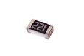 [RESE-0603-X-O221-01 > SMD (0603) 220 Ohm Resistor](RESE-0603-X-O221-01/)| [RESE-0603-X-O221-67 > SMD (0603) 220 Ohm Resistor 1%](RESE-0603-X-O221-67/)|
| [RESE-0603-X-O222-01 > SMD (0603) 2.2k Ohm Resistor](RESE-0603-X-O222-01/)| [RESE-0603-X-O223-01 > SMD (0603) 22k Ohm Resistor](RESE-0603-X-O223-01/)| [RESE-0603-X-O223-67 > SMD (0603) 22k Ohm Resistor 1%](RESE-0603-X-O223-67/)| [RESE-0603-X-O224-01 > SMD (0603) 220k Ohm Resistor](RESE-0603-X-O224-01/)|
| [RESE-0603-X-O224-67 > SMD (0603) 220k Ohm Resistor 1%](RESE-0603-X-O224-67/)| [RESE-0603-X-O22X-67 > SMD (0603) 2.2 Ohm Resistor 1%](RESE-0603-X-O22X-67/)| [RESE-0603-X--01 > SMD (0603) 240 Ohm Resistor](RESE-0603-X--01/)| [RESE-0603-X--01 > SMD (0603) 2.4k Ohm Resistor](RESE-0603-X--01/)|
| [RESE-0603-X--67 > SMD (0603) 2.4k Ohm Resistor 1%](RESE-0603-X--67/)| [RESE-0603-X--01 > SMD (0603) 25k Ohm Resistor](RESE-0603-X--01/)| [RESE-0603-X--67 > SMD (0603) 25k Ohm Resistor 1%](RESE-0603-X--67/)| [RESE-0603-X--67 > SMD (0603) 249 Ohm Resistor 1%](RESE-0603-X--67/)|
| [RESE-0603-X--67 > SMD (0603) 27 Ohm Resistor 1%](RESE-0603-X--67/)| [RESE-0603-X--01 > SMD (0603) 270 Ohm Resistor](RESE-0603-X--01/)| [RESE-0603-X--67 > SMD (0603) 270 Ohm Resistor 1%](RESE-0603-X--67/)| [RESE-0603-X--01 > SMD (0603) 2.7k Ohm Resistor](RESE-0603-X--01/)|
| [RESE-0603-X--01 > SMD (0603) 28k Ohm Resistor](RESE-0603-X--01/)| [RESE-0603-X--67 > SMD (0603) 27k Ohm Resistor 1%](RESE-0603-X--67/)| [RESE-0603-X--01 > SMD (0603) 280k Ohm Resistor](RESE-0603-X--01/)| [RESE-0603-X--67 > SMD (0603) 270k Ohm Resistor 1%](RESE-0603-X--67/)|
| [RESE-0603-X--67 > SMD (0603) 30 Ohm Resistor 1%](RESE-0603-X--67/)| [RESE-0603-X--01 > SMD (0603) 300 Ohm Resistor](RESE-0603-X--01/)| [RESE-0603-X--67 > SMD (0603) 300 Ohm Resistor 1%](RESE-0603-X--67/)| [RESE-0603-X--01 > SMD (0603) 3k Ohm Resistor](RESE-0603-X--01/)|
| [RESE-0603-X--67 > SMD (0603) 3k Ohm Resistor 1%](RESE-0603-X--67/)| [RESE-0603-X--67 > SMD (0603) 31k Ohm Resistor 1%](RESE-0603-X--67/)| [RESE-0603-X--01 > SMD (0603) 33 Ohm Resistor](RESE-0603-X--01/)| [RESE-0603-X-O330-67 > SMD (0603) 33 Ohm Resistor 1%](RESE-0603-X-O330-67/)|
| [RESE-0603-X-O331-01 > SMD (0603) 330 Ohm Resistor](RESE-0603-X-O331-01/)| [RESE-0603-X--67 > SMD (0603) 330 Ohm Resistor 1%](RESE-0603-X--67/)| [RESE-0603-X--01 > SMD (0603) 3.3k Ohm Resistor](RESE-0603-X--01/)| [RESE-0603-X--67 > SMD (0603) 3.3k Ohm Resistor 1%](RESE-0603-X--67/)|
| [RESE-0603-X--01 > SMD (0603) 360 Ohm Resistor](RESE-0603-X--01/)| [RESE-0603-X--67 > SMD (0603) 360 Ohm Resistor 1%](RESE-0603-X--67/)| [RESE-0603-X--01 > SMD (0603) 3.6k Ohm Resistor](RESE-0603-X--01/)| [RESE-0603-X--01 > SMD (0603) 39 Ohm Resistor](RESE-0603-X--01/)|
| [RESE-0603-X--01 > SMD (0603) 390 Ohm Resistor](RESE-0603-X--01/)| [RESE-0603-X--67 > SMD (0603) 390 Ohm Resistor 1%](RESE-0603-X--67/)| [RESE-0603-X--01 > SMD (0603) 3.9k Ohm Resistor](RESE-0603-X--01/)| [RESE-0603-X--67 > SMD (0603) 3.9k Ohm Resistor 1%](RESE-0603-X--67/)|
| [RESE-0603-X--01 > SMD (0603) 39k Ohm Resistor](RESE-0603-X--01/)| [RESE-0603-X--67 > SMD (0603) 39k Ohm Resistor 1%](RESE-0603-X--67/)| [RESE-0603-X-O402-67 > SMD (0603) 40k Ohm Resistor 1%](RESE-0603-X-O402-67/)| [RESE-0603-X-O432-67 > SMD (0603) 4.3k Ohm Resistor 1%](RESE-0603-X-O432-67/)|
| [RESE-0603-X-O433-01 > SMD (0603) 43k Ohm Resistor](RESE-0603-X-O433-01/)| [RESE-0603-X-O470-01 > SMD (0603) 47 Ohm Resistor](RESE-0603-X-O470-01/)| [RESE-0603-X-O471-01 > SMD (0603) 470 Ohm Resistor](RESE-0603-X-O471-01/)| [RESE-0603-X-O472-01 > SMD (0603) 4.7k Ohm Resistor](RESE-0603-X-O472-01/)|
| [RESE-0603-X-O473-01 > SMD (0603) 47k Ohm Resistor](RESE-0603-X-O473-01/)| [RESE-0603-X-O474-01 > SMD (0603) 470k Ohm Resistor](RESE-0603-X-O474-01/)| [RESE-0603-X-O474-67 > SMD (0603) 470k Ohm Resistor 1%](RESE-0603-X-O474-67/)| [RESE-0603-X-O475-01 > SMD (0603) 4.7M Ohm Resistor](RESE-0603-X-O475-01/)|
| [RESE-0603-X-O4990-67 > SMD (0603) 499 Ohm Resistor 1%](RESE-0603-X-O4990-67/)| [RESE-0603-X-O4992-67 > SMD (0603) 49.9k Ohm Resistor 1%](RESE-0603-X-O4992-67/)| [RESE-0603-X-O499D-67 > SMD (0603) 49.9 Ohm Resistor 1%](RESE-0603-X-O499D-67/)| [RESE-0603-X-O510-01 > SMD (0603) 51 Ohm Resistor](RESE-0603-X-O510-01/)|
| [RESE-0603-X-O510-67 > SMD (0603) 51 Ohm Resistor 1%](RESE-0603-X-O510-67/)| [RESE-0603-X-O511-01 > SMD (0603) 510 Ohm Resistor](RESE-0603-X-O511-01/)| [RESE-0603-X-O511-67 > SMD (0603) 510 Ohm Resistor 1%](RESE-0603-X-O511-67/)| [RESE-0603-X-O512-67 > SMD (0603) 5.1k Ohm Resistor 1%](RESE-0603-X-O512-67/)|
| [RESE-0603-X-O513-01 > SMD (0603) 51k Ohm Resistor](RESE-0603-X-O513-01/)| [RESE-0603-X-O513-67 > SMD (0603) 51k Ohm Resistor 1%](RESE-0603-X-O513-67/)| [RESE-0603-X-O560-01 > SMD (0603) 56 Ohm Resistor](RESE-0603-X-O560-01/)| [RESE-0603-X-O560-67 > SMD (0603) 56 Ohm Resistor 1%](RESE-0603-X-O560-67/)|
| [RESE-0603-X-O561-01 > SMD (0603) 560 Ohm Resistor](RESE-0603-X-O561-01/)| [RESE-0603-X-O562-01 > SMD (0603) 5.6k Ohm Resistor](RESE-0603-X-O562-01/)| [RESE-0603-X-O562-67 > SMD (0603) 5.6k Ohm Resistor 1%](RESE-0603-X-O562-67/)| [RESE-0603-X-O563-01 > SMD (0603) 56k Ohm Resistor](RESE-0603-X-O563-01/)|
| [RESE-0603-X-O563-67 > SMD (0603) 56k Ohm Resistor 1%](RESE-0603-X-O563-67/)| [RESE-0603-X-O564-01 > SMD (0603) 560k Ohm Resistor](RESE-0603-X-O564-01/)| [RESE-0603-X-O620-01 > SMD (0603) 62 Ohm Resistor](RESE-0603-X-O620-01/)| [RESE-0603-X-O621-01 > SMD (0603) 620 Ohm Resistor](RESE-0603-X-O621-01/)|
| [RESE-0603-X-O623-67 > SMD (0603) 62k Ohm Resistor 1%](RESE-0603-X-O623-67/)| [RESE-0603-X-O680-01 > SMD (0603) 68 Ohm Resistor](RESE-0603-X-O680-01/)| [RESE-0603-X-O680-67 > SMD (0603) 68 Ohm Resistor 1%](RESE-0603-X-O680-67/)| [RESE-0603-X-O681-01 > SMD (0603) 680 Ohm Resistor](RESE-0603-X-O681-01/)|
| [RESE-0603-X-O681-67 > SMD (0603) 680 Ohm Resistor 1%](RESE-0603-X-O681-67/)| [RESE-0603-X-O682-67 > SMD (0603) 6.8k Ohm Resistor 1%](RESE-0603-X-O682-67/)| [RESE-0603-X-O683-01 > SMD (0603) 68k Ohm Resistor](RESE-0603-X-O683-01/)| [RESE-0603-X-O683-67 > SMD (0603) 68k Ohm Resistor 1%](RESE-0603-X-O683-67/)|
| [RESE-0603-X-O684-67 > SMD (0603) 680k Ohm Resistor 1%](RESE-0603-X-O684-67/)| [RESE-0603-X-O750-01 > SMD (0603) 75 Ohm Resistor](RESE-0603-X-O750-01/)| [RESE-0603-X-O750-67 > SMD (0603) 75 Ohm Resistor 1%](RESE-0603-X-O750-67/)| [RESE-0603-X-O751-01 > SMD (0603) 750 Ohm Resistor](RESE-0603-X-O751-01/)|
| [RESE-0603-X-O752-01 > SMD (0603) 7.5k Ohm Resistor](RESE-0603-X-O752-01/)| [RESE-0603-X-O752-67 > SMD (0603) 7.5k Ohm Resistor 1%](RESE-0603-X-O752-67/)| [RESE-0603-X-O753-67 > SMD (0603) 75k Ohm Resistor 1%](RESE-0603-X-O753-67/)| [RESE-0603-X-O821-67 > SMD (0603) 820 Ohm Resistor 1%](RESE-0603-X-O821-67/)|
| [RESE-0603-X-O822-01 > SMD (0603) 8.2k Ohm Resistor](RESE-0603-X-O822-01/)| [RESE-0603-X-O822-67 > SMD (0603) 8.2k Ohm Resistor 1%](RESE-0603-X-O822-67/)|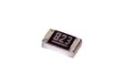 [RESE-0603-X-O823-67 > SMD (0603) 82k Ohm Resistor 1%](RESE-0603-X-O823-67/)| [RESE-0805-X-O000-67 > SMD (0805) 0 Ohm Resistor 1%](RESE-0805-X-O000-67/)|
| [RESE-0805-X-O001D-01 > SMD (0805) 0.1 Ohm Resistor](RESE-0805-X-O001D-01/)| [RESE-0805-X-O101-01 > SMD (0805) 100 Ohm Resistor](RESE-0805-X-O101-01/)|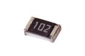 [RESE-0805-X-O102-01 > SMD (0805) 1k Ohm Resistor](RESE-0805-X-O102-01/)| [RESE-0805-X-O103-01 > SMD (0805) 10k Ohm Resistor](RESE-0805-X-O103-01/)|
| [RESE-0805-X-O103-67 > SMD (0805) 10k Ohm Resistor 1%](RESE-0805-X-O103-67/)| [RESE-0805-X-O104-67 > SMD (0805) 100k Ohm Resistor 1%](RESE-0805-X-O104-67/)| [RESE-0805-X-O105-67 > SMD (0805) 1M Ohm Resistor 1%](RESE-0805-X-O105-67/)| [RESE-0805-X-O121-01 > SMD (0805) 120 Ohm Resistor](RESE-0805-X-O121-01/)|
| [RESE-0805-X-O121-67 > SMD (0805) 120 Ohm Resistor 1%](RESE-0805-X-O121-67/)| [RESE-0805-X-O122-01 > SMD (0805) 1.2k Ohm Resistor](RESE-0805-X-O122-01/)| [RESE-0805-X-O122-67 > SMD (0805) 1.2k Ohm Resistor 1%](RESE-0805-X-O122-67/)| [RESE-0805-X-O123-01 > SMD (0805) 12k Ohm Resistor](RESE-0805-X-O123-01/)|
| [RESE-0805-X-O151-01 > SMD (0805) 150 Ohm Resistor](RESE-0805-X-O151-01/)| [RESE-0805-X-O151-67 > SMD (0805) 150 Ohm Resistor 1%](RESE-0805-X-O151-67/)| [RESE-0805-X-O152-01 > SMD (0805) 1.5k Ohm Resistor](RESE-0805-X-O152-01/)| [RESE-0805-X-O152-67 > SMD (0805) 1.5k Ohm Resistor 1%](RESE-0805-X-O152-67/)|
| [RESE-0805-X-O153-01 > SMD (0805) 15k Ohm Resistor](RESE-0805-X-O153-01/)| [RESE-0805-X-O182-01 > SMD (0805) 1.8k Ohm Resistor](RESE-0805-X-O182-01/)| [RESE-0805-X-O200-01 > SMD (0805) 20 Ohm Resistor](RESE-0805-X-O200-01/)| [RESE-0805-X-O201-67 > SMD (0805) 200 Ohm Resistor 1%](RESE-0805-X-O201-67/)|
| [RESE-0805-X-O202-01 > SMD (0805) 2k Ohm Resistor](RESE-0805-X-O202-01/)| [RESE-0805-X-O202-67 > SMD (0805) 2k Ohm Resistor 1%](RESE-0805-X-O202-67/)| [RESE-0805-X-O203-01 > SMD (0805) 20k Ohm Resistor](RESE-0805-X-O203-01/)| [RESE-0805-X-O204-67 > SMD (0805) 200k Ohm Resistor 1%](RESE-0805-X-O204-67/)|
| [RESE-0805-X-O220-01 > SMD (0805) 22 Ohm Resistor](RESE-0805-X-O220-01/)| [RESE-0805-X-O221-01 > SMD (0805) 220 Ohm Resistor](RESE-0805-X-O221-01/)| [RESE-0805-X-O221-67 > SMD (0805) 220 Ohm Resistor 1%](RESE-0805-X-O221-67/)| [RESE-0805-X-O222-01 > SMD (0805) 2.2k Ohm Resistor](RESE-0805-X-O222-01/)|
| [RESE-0805-X-O222-67 > SMD (0805) 2.2k Ohm Resistor 1%](RESE-0805-X-O222-67/)| [RESE-0805-X-O223-01 > SMD (0805) 22k Ohm Resistor](RESE-0805-X-O223-01/)| [RESE-0805-X-O223-67 > SMD (0805) 22k Ohm Resistor 1%](RESE-0805-X-O223-67/)| [RESE-0805-X-O242-01 > SMD (0805) 2.4k Ohm Resistor](RESE-0805-X-O242-01/)|
| [RESE-0805-X-O243-01 > SMD (0805) 24k Ohm Resistor](RESE-0805-X-O243-01/)| [RESE-0805-X-O271-67 > SMD (0805) 270 Ohm Resistor 1%](RESE-0805-X-O271-67/)| [RESE-0805-X-O301-67 > SMD (0805) 300 Ohm Resistor 1%](RESE-0805-X-O301-67/)| [RESE-0805-X-O302-01 > SMD (0805) 3k Ohm Resistor](RESE-0805-X-O302-01/)|
| [RESE-0805-X-O302-67 > SMD (0805) 3k Ohm Resistor 1%](RESE-0805-X-O302-67/)| [RESE-0805-X-O303-01 > SMD (0805) 30k Ohm Resistor](RESE-0805-X-O303-01/)| [RESE-0805-X-O303-67 > SMD (0805) 30k Ohm Resistor 1%](RESE-0805-X-O303-67/)| [RESE-0805-X-O330-01 > SMD (0805) 33 Ohm Resistor](RESE-0805-X-O330-01/)|
| [RESE-0805-X-O330-67 > SMD (0805) 33 Ohm Resistor 1%](RESE-0805-X-O330-67/)| [RESE-0805-X-O331-01 > SMD (0805) 330 Ohm Resistor](RESE-0805-X-O331-01/)| [RESE-0805-X-O331-67 > SMD (0805) 330 Ohm Resistor 1%](RESE-0805-X-O331-67/)| [RESE-0805-X-O332-01 > SMD (0805) 3.3k Ohm Resistor](RESE-0805-X-O332-01/)|
| [RESE-0805-X-O332-67 > SMD (0805) 3.3k Ohm Resistor 1%](RESE-0805-X-O332-67/)| [RESE-0805-X-O391-01 > SMD (0805) 390 Ohm Resistor](RESE-0805-X-O391-01/)| [RESE-0805-X-O391-67 > SMD (0805) 390 Ohm Resistor 1%](RESE-0805-X-O391-67/)| [RESE-0805-X-O392-67 > SMD (0805) 3.9k Ohm Resistor 1%](RESE-0805-X-O392-67/)|
| [RESE-0805-X-O470-67 > SMD (0805) 47 Ohm Resistor 1%](RESE-0805-X-O470-67/)| [RESE-0805-X-O471-67 > SMD (0805) 470 Ohm Resistor 1%](RESE-0805-X-O471-67/)| [RESE-0805-X-O472-01 > SMD (0805) 4.7k Ohm Resistor](RESE-0805-X-O472-01/)| [RESE-0805-X-O473-67 > SMD (0805) 47k Ohm Resistor 1%](RESE-0805-X-O473-67/)|
| [RESE-0805-X-O510-67 > SMD (0805) 51 Ohm Resistor 1%](RESE-0805-X-O510-67/)| [RESE-0805-X-O511-01 > SMD (0805) 510 Ohm Resistor](RESE-0805-X-O511-01/)| [RESE-0805-X-O511-67 > SMD (0805) 510 Ohm Resistor 1%](RESE-0805-X-O511-67/)| [RESE-0805-X-O512-67 > SMD (0805) 5.1k Ohm Resistor 1%](RESE-0805-X-O512-67/)|
| [RESE-0805-X-O514-01 > SMD (0805) 510k Ohm Resistor](RESE-0805-X-O514-01/)| [RESE-0805-X-O561-67 > SMD (0805) 560 Ohm Resistor 1%](RESE-0805-X-O561-67/)| [RESE-0805-X-O563-01 > SMD (0805) 56k Ohm Resistor](RESE-0805-X-O563-01/)| [RESE-0805-X-O563-67 > SMD (0805) 56k Ohm Resistor 1%](RESE-0805-X-O563-67/)|
| [RESE-0805-X-O680-01 > SMD (0805) 68 Ohm Resistor](RESE-0805-X-O680-01/)| [RESE-0805-X-O682-01 > SMD (0805) 6.8k Ohm Resistor](RESE-0805-X-O682-01/)| [RESE-0805-X-O750-67 > SMD (0805) 75 Ohm Resistor 1%](RESE-0805-X-O750-67/)| [RESE-0805-X-O821-67 > SMD (0805) 820 Ohm Resistor 1%](RESE-0805-X-O821-67/)|
| [RESE-0805-X-O822-01 > SMD (0805) 8.2k Ohm Resistor](RESE-0805-X-O822-01/)| [RESE-1206-X--01 > SMD (1206) 100 Ohm Resistor](RESE-1206-X--01/)| [RESE-1206-X--01 > SMD (1206) 13 Ohm Resistor](RESE-1206-X--01/)| [RESE-W04-X-O000-01 > 1/4 Watt 0 Ohm Resistor](RESE-W04-X-O000-01/)|
| [RESE-W04-X-O100-01 > 1/4 Watt 10 Ohm Resistor](RESE-W04-X-O100-01/)| [RESE-W04-X-O101-01 > 1/4 Watt 100 Ohm Resistor](RESE-W04-X-O101-01/)| [RESE-W04-X-O102-01 > 1/4 Watt 1k Ohm Resistor](RESE-W04-X-O102-01/)| [RESE-W04-X-O103-01 > 1/4 Watt 10k Ohm Resistor](RESE-W04-X-O103-01/)|
| [RESE-W04-X-O104-01 > 1/4 Watt 100k Ohm Resistor](RESE-W04-X-O104-01/)| [RESE-W04-X-O105-01 > 1/4 Watt 1M Ohm Resistor](RESE-W04-X-O105-01/)| [RESE-W04-X-O152-01 > 1/4 Watt 1.5k Ohm Resistor](RESE-W04-X-O152-01/)| [RESE-W04-X-O15X-01 > 1/4 Watt 1.5 Ohm Resistor](RESE-W04-X-O15X-01/)|
|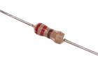 [RESE-W04-X-O221-01 > 1/4 Watt 220 Ohm Resistor](RESE-W04-X-O221-01/)| [RESE-W04-X-O222-01 > 1/4 Watt 2.2k Ohm Resistor](RESE-W04-X-O222-01/)| [RESE-W04-X-O223-01 > 1/4 Watt 22k Ohm Resistor](RESE-W04-X-O223-01/)| [RESE-W04-X-O271-01 > 1/4 Watt 270 Ohm Resistor](RESE-W04-X-O271-01/)|
| [RESE-W04-X-O331-01 > 1/4 Watt 330 Ohm Resistor](RESE-W04-X-O331-01/)| [RESE-W04-X-O332-01 > 1/4 Watt 3.3k Ohm Resistor](RESE-W04-X-O332-01/)| [RESE-W04-X-O334-01 > 1/4 Watt 330k Ohm Resistor](RESE-W04-X-O334-01/)| [RESE-W04-X-O470-01 > 1/4 Watt 47 Ohm Resistor](RESE-W04-X-O470-01/)|
| [RESE-W04-X-O471-01 > 1/4 Watt 470 Ohm Resistor](RESE-W04-X-O471-01/)| [RESE-W04-X-O472-01 > 1/4 Watt 4.7k Ohm Resistor](RESE-W04-X-O472-01/)| [RESE-W04-X-O473-01 > 1/4 Watt 47k Ohm Resistor](RESE-W04-X-O473-01/)| [RESE-W04-X-O47X-01 > 1/4 Watt 4.7 Ohm Resistor](RESE-W04-X-O47X-01/)|
| [RESE-W04-X-O561-01 > 1/4 Watt 560 Ohm Resistor](RESE-W04-X-O561-01/)| [RESE-W04-X-O681-01 > 1/4 Watt 680 Ohm Resistor](RESE-W04-X-O681-01/)| [RESE-W04-X-O682-01 > 1/4 Watt 6.8k Ohm Resistor](RESE-W04-X-O682-01/)||

## RJ45 > RJ45
  

| [RJ45-18-X-SOCK-LI > 18 mm Socket RJ45 w/Lights](RJ45-18-X-SOCK-LI/)| [RJ45-21-X-SOCK-01 > 21 mm Socket RJ45](RJ45-21-X-SOCK-01/)|||
| :---: | :---: | :---: | :---: |

## SCRE > Machine Screw
  

| [SCRE-M3-M-12-70 > M3 x 12 mm Machine Screw Cross Head](SCRE-M3-M-12-70/)| [SCRE-M3-M-16-70 > M3 x 16 mm Machine Screw Cross Head](SCRE-M3-M-16-70/)| [SCRE-M3-M-20-70 > M3 x 20 mm Metal Machine Screw Cross Head](SCRE-M3-M-20-70/)| [SCRE-M3-M-25-70 > M3 x 25 mm Machine Screw Cross Head](SCRE-M3-M-25-70/)|
| :---: | :---: | :---: | :---: |
|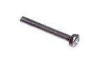 [SCRE-M3-M-30-70 > M3 x 30 mm Metal Machine Screw Cross Head](SCRE-M3-M-30-70/)| [SCRE-M3-X-05-70 > M3 x 5 mm Machine Screw Cross Head](SCRE-M3-X-05-70/)| [SCRE-M3-X-06-70 > M3 x 6 mm Machine Screw Cross Head](SCRE-M3-X-06-70/)||

## SDCS > SD Card Socket
  

| [SDCS-MC-M-SMDS-01 > Micro SMD SD Card Socket](SDCS-MC-M-SMDS-01/)| [SDCS-MC-M-SMDS-02 > Micro SMD Metal SD Card Socket](SDCS-MC-M-SMDS-02/)| [SDCS-MC-M-SMDS-03 > Micro SMD Metal SD Card Socket](SDCS-MC-M-SMDS-03/)||
| :---: | :---: | :---: | :---: |

## SENS > Sensor
  

| [SENS-05-X-LIRE-01 > 5 mm Light (Resistive) Sensor](SENS-05-X-LIRE-01/)| [SENS-12-X-TEHU-01 > 12 mm Temperature and Humidity Sensor](SENS-12-X-TEHU-01/)| [SENS-13-X-TEHU-01 > 13 mm Temperature and Humidity Sensor](SENS-13-X-TEHU-01/)| [SENS-25X13-X-PIVB-01 > 25 x 13 mm Piezo Vibration Sensor](SENS-25X13-X-PIVB-01/)|
| :---: | :---: | :---: | :---: |
| [SENS-3528-X-UVUV-01 > SMD (3528) Ultraviolet Sensor](SENS-3528-X-UVUV-01/)| [SENS-87DX45D-X-K1550-01 > 8.7 mm x 4.5 mm Photo Reflective (LTH1550) Sensor](SENS-87DX45D-X-K1550-01/)| [SENS-92D-X-PIRS-01 > 9.2 mm PIRS Sensor](SENS-92D-X-PIRS-01/)| [SENS-SO235-X--01 > SMD (SOT-23-5) 3-Axis Accelerometer (MMA7660FCR1) Sensor](SENS-SO235-X--01/)|
| [SENS-T92-X-K36-01 > TO-92 Temperature (TMP36) Sensor](SENS-T92-X-K36-01/)||||

## SWIS > Switch (Slide)
  

|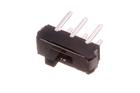 [SWIS-09-X-DPDT-01 > 9 mm DPDT Switch (Slide)](SWIS-09-X-DPDT-01/)| [SWIS-09-X-DPDT-68 > 9 mm DPDT Switch (Slide) Side Adjust](SWIS-09-X-DPDT-68/)| [SWIS-09-X-SPDT-68 >  9 mm SPDT Switch (Slide) Side Adjust ](SWIS-09-X-SPDT-68/)| [SWIS-7135-X-DPDT-01 > SMD (7135) DPDT Switch (Slide)](SWIS-7135-X-DPDT-01/)|
| :---: | :---: | :---: | :---: |
|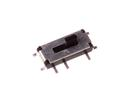 [SWIS-7827-X-SPDT-01 > SMD (7827) SPDT Switch (Slide)](SWIS-7827-X-SPDT-01/)||||

## TERS > Screw Terminal
  

| [TERS-05-G-PI02-01 > 5 mm 2 Pin Green Screw Terminal](TERS-05-G-PI02-01/)| [TERS-05-G-PI03-01 > 5 mm 3 Pin Green Screw Terminal](TERS-05-G-PI03-01/)| [TERS-35D-G-PI02-01 > 3.5 mm 2 Pin Green Screw Terminal](TERS-35D-G-PI02-01/)| [TERS-35D-L-PI08-01 > 3.5 mm 8 Pin Blue Screw Terminal](TERS-35D-L-PI08-01/)|
| :---: | :---: | :---: | :---: |
|||||

## THER > Thermistor
  

| [THER-0603-X-O104-01 > SMD (0603) 100k Ohm Thermistor](THER-0603-X-O104-01/)| [THER-65D-X-STAN-01 > 6.5 mm Thermistor](THER-65D-X-STAN-01/)|||
| :---: | :---: | :---: | :---: |

## TILS > Tilt Switch
  

| [TILS-11-X-STAN-01 > 11 mm Tilt Switch](TILS-11-X-STAN-01/)||||
| :---: | :---: | :---: | :---: |

## TRNN > NPN Transistor
  

| [TRNN-SO23-X-A01D-01 > SMD (SOT-23) 100 mA NPN Transistor](TRNN-SO23-X-A01D-01/)| [TRNN-SO23-X-A02D-01 > SMD (SOT-23) 200 mA NPN Transistor](TRNN-SO23-X-A02D-01/)| [TRNN-SO23-X-A05D-01 > SMD (SOT-23) 500 mA NPN Transistor](TRNN-SO23-X-A05D-01/)| [TRNN-SO23-X-A05D-02 > SMD (SOT-23) 500 mA NPN Transistor](TRNN-SO23-X-A05D-02/)|
| :---: | :---: | :---: | :---: |
| [TRNN-T220-BCE-A05-01 > TO-220 5 Amp NPN Transistor](TRNN-T220-BCE-A05-01/)| [TRNN-T220-X-A05-01 > TO-220 5 Amp NPN Transistor](TRNN-T220-X-A05-01/)| [TRNN-T92-X-K222-01 > TO-92 2222A NPN Transistor](TRNN-T92-X-K222-01/)||

## TRNP > PNP Transistor
  

| [TRNP-SO23-X-A02D-01 > SMD (SOT-23) 200 mA PNP Transistor](TRNP-SO23-X-A02D-01/)| [TRNP-SO23-X-A05D-01 > SMD (SOT-23) 500 mA PNP Transistor](TRNP-SO23-X-A05D-01/)|||
| :---: | :---: | :---: | :---: |

## USBS > USB Socket
  

|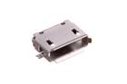 [USBS-MC-X-SMDS-01 > Micro SMD USB Socket](USBS-MC-X-SMDS-01/)| [USBS-MC-X-SMDS-02 > Micro SMD USB Socket](USBS-MC-X-SMDS-02/)| [USBS-MC-X-SMDS-03 > Micro SMD USB Socket](USBS-MC-X-SMDS-03/)| [USBS-MC-X-SMDS-04 > Micro SMD USB Socket](USBS-MC-X-SMDS-04/)|
| :---: | :---: | :---: | :---: |
| [USBS-MN-M-SMDS-01 > Mini SMD Metal USB Socket](USBS-MN-M-SMDS-01/)| [USBS-MN-M-SMDS-02 > Mini SMD USB Socket](USBS-MN-M-SMDS-02/)| [USBS-TB-X-THTH-01 > Type B Through Hole USB Socket](USBS-TB-X-THTH-01/)||

## UFLS > UFL Socket
  

| [UFLS-02-M-SMDS-01 > 2 mm SMD Metal UFL Socket](UFLS-02-M-SMDS-01/)||||
| :---: | :---: | :---: | :---: |

## VARI > Varistor
  

| [VARI-0603-X-V05-01 > SMD (0603) 5v Varistor](VARI-0603-X-V05-01/)||||
| :---: | :---: | :---: | :---: |

## VREG > Voltage Regulator
  

| [VREG-DFN8-X-BUCA-A2 > SMD (DFN-8) Adjustable Buck Voltage Regulator 2 A](VREG-DFN8-X-BUCA-A2/)| [VREG-MS08-X-ADJU-A1 > 8 Pin SMD (MSOP) Adjustable Voltage Regulator 1 A](VREG-MS08-X-ADJU-A1/)| [VREG-MS08-X-V05-A5D > 8 Pin SMD (MSOP) 5v Voltage Regulator 500 mA](VREG-MS08-X-V05-A5D/)| [VREG-SO223-X-ADJU-A1 > SMD (SOT-223) Adjustable Voltage Regulator 1 A](VREG-SO223-X-ADJU-A1/)|
| :---: | :---: | :---: | :---: |
| [VREG-SO223-X-V05-A1 > SMD (SOT-223) 5v Voltage Regulator 1 A](VREG-SO223-X-V05-A1/)| [VREG-SO223-X-V33D-A1 > SMD (SOT-223) 3.3v Voltage Regulator 1 A](VREG-SO223-X-V33D-A1/)| [VREG-SO23-X-ADJU-AE > SMD (SOT-23) Adjustable Voltage Regulator 200 mA](VREG-SO23-X-ADJU-AE/)|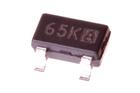 [VREG-SO23-X-BUCA-A2 > SMD (SOT-23) Adjustable Buck Voltage Regulator 2 A](VREG-SO23-X-BUCA-A2/)|
| [VREG-SO23-X-V25D-AE > SMD (SOT-23) 2.5v Voltage Regulator 200 mA](VREG-SO23-X-V25D-AE/)| [VREG-SO23-X-V3-AD > SMD (SOT-23) 3v Voltage Regulator 250 mA](VREG-SO23-X-V3-AD/)| [VREG-SO23-X-V33D-A5D > SMD (SOT-23) 3.3v Voltage Regulator 500 mA](VREG-SO23-X-V33D-A5D/)| [VREG-SO23-X-V33D-AD > SMD (SOT-23) 3.3v Voltage Regulator 250 mA](VREG-SO23-X-V33D-AD/)|
| [VREG-SO235-U-V33D-AC >  SMD (SOT-23-5) 3.3v Voltage Regulator 150 mA ](VREG-SO235-U-V33D-AC/)| [VREG-SO235-X-ADJU-AB > SMD (SOT-23-5) Adjustable Voltage Regulator 1.2 A](VREG-SO235-X-ADJU-AB/)| [VREG-SO235-X-BOS5-A5D > SMD (SOT-23-5) 5v Boost Voltage Regulator 500 mA](VREG-SO235-X-BOS5-A5D/)| [VREG-SO235-X-V33D-A5D > SMD (SOT-23-5) 3.3v Voltage Regulator 500 mA](VREG-SO235-X-V33D-A5D/)|
| [VREG-SO235-X-V33D-AC > SMD (SOT-23-5) 3.3v Voltage Regulator 150 mA](VREG-SO235-X-V33D-AC/)| [VREG-SO236-X-ADJU-AE > SMD (SOT-23-6) Adjustable Voltage Regulator 200 mA](VREG-SO236-X-ADJU-AE/)| [VREG-SO238-X-ADJU-A2 > SMD (SOT-23-8) Adjustable Voltage Regulator 2 A](VREG-SO238-X-ADJU-A2/)| [VREG-SO89-X-V33D-A1 > SMD (SOT-89) 3.3v Voltage Regulator 1 A](VREG-SO89-X-V33D-A1/)|
| [VREG-SP08-X-V36D-A2 > 8 Pin SMD (SOP) 3.6v Voltage Regulator 2 A](VREG-SP08-X-V36D-A2/)| [VREG-T220-X-V05-A1 > TO-220 5v Voltage Regulator 1 A](VREG-T220-X-V05-A1/)| [VREG-T252-X-V05-A5D > TO-252 5v Voltage Regulator 500 mA](VREG-T252-X-V05-A5D/)| [VREG-T92-X-ADJU-AH > TO-92 Adjustable Voltage Regulator 100 mA](VREG-T92-X-ADJU-AH/)|
|||||

## WIRS > Stranded Wire
  

| [WIRS-G28-B-STAN-01 > 28 AWG Black Stranded Wire](WIRS-G28-B-STAN-01/)| [WIRS-G28-E-STAN-01 > 28 AWG Grey Stranded Wire](WIRS-G28-E-STAN-01/)| [WIRS-G28-G-STAN-01 > 28 AWG Green Stranded Wire](WIRS-G28-G-STAN-01/)| [WIRS-G28-L-STAN-01 > 28 AWG Blue Stranded Wire](WIRS-G28-L-STAN-01/)|
| :---: | :---: | :---: | :---: |
| [WIRS-G28-N-STAN-01 > 28 AWG Brown Stranded Wire](WIRS-G28-N-STAN-01/)| [WIRS-G28-O-STAN-01 > 28 AWG Orange Stranded Wire](WIRS-G28-O-STAN-01/)| [WIRS-G28-R-STAN-01 > 28 AWG Red Stranded Wire](WIRS-G28-R-STAN-01/)| [WIRS-G28-V-STAN-01 > 28 AWG Purple Stranded Wire](WIRS-G28-V-STAN-01/)|
| [WIRS-G28-W-STAN-01 > 28 AWG White Stranded Wire](WIRS-G28-W-STAN-01/)| [WIRS-G28-Y-STAN-01 > 28 AWG Yellow Stranded Wire](WIRS-G28-Y-STAN-01/)|||

## XTAL > Crystal
  

| [XTAL-0805-X-KZ327D-01 > SMD (0805) 32.768 kHz Crystal](XTAL-0805-X-KZ327D-01/)| [XTAL-11-X-MZ16-01 > 11 mm 16 MHz Crystal](XTAL-11-X-MZ16-01/)|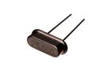 [XTAL-11-X-MZ25-01 > 11 mm 25 MHz Crystal](XTAL-11-X-MZ25-01/)| [XTAL-11-X-MZ8-01 > 11 mm 8 MHz Crystal](XTAL-11-X-MZ8-01/)|
| :---: | :---: | :---: | :---: |
| [XTAL-3215-X-KZ327D-01 > SMD (3215) 32.768 kHz Crystal](XTAL-3215-X-KZ327D-01/)| [XTAL-3215-X-MZ8-01 > SMD (3215) 8 MHz Crystal](XTAL-3215-X-MZ8-01/)| [XTAL-5032-X-MZ12-01 > SMD (5032) 12 MHz Crystal](XTAL-5032-X-MZ12-01/)|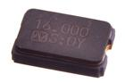 [XTAL-5032-X-MZ16-01 > SMD (5032) 16 MHz Crystal](XTAL-5032-X-MZ16-01/)|
| [XTAL-5032-X-MZ8-01 > SMD (5032) 8 MHz Crystal](XTAL-5032-X-MZ8-01/)||||
