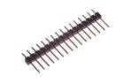
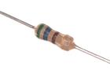

Contents
========

* [Parts](#parts)
	* [BUTA > Pushbutton (Tactile)](#buta--pushbutton-tactile)
	* [HEAD > Header](#head--header)
	* [LEDS > LED](#leds--led)
	* [PHTR > Phototransistor](#phtr--phototransistor)
	* [POTE > Potentiometer](#pote--potentiometer)
	* [RESE > Resistor](#rese--resistor)
	* [TRNN > NPN Transistor](#trnn--npn-transistor)

# Parts

## BUTA > Pushbutton (Tactile)
  

| [BUTA-06-X-STAN-01 > 6 mm Pushbutton (Tactile)](BUTA-06-X-STAN-01/)| [BUTA-12-X-STAN-01 > 12 mm Pushbutton (Tactile)](BUTA-12-X-STAN-01/)|||
| :---: | :---: | :---: | :---: |

## HEAD > Header
  

| [HEAD-I01-X-PI03-01 > 2.54 mm 3 Pin Header](HEAD-I01-X-PI03-01/)| [HEAD-I01-X-PI02-01 > 2.54 mm 2 Pin Header](HEAD-I01-X-PI02-01/)| [HEAD-I01-X-PI03-01 > 2.54 mm 3 Pin Header](HEAD-I01-X-PI03-01/)| [HEAD-I01-X-PI03-OOEB > 2.54 mm 3 Pin Header (OOEB)](HEAD-I01-X-PI03-OOEB/)|
| :---: | :---: | :---: | :---: |
| [HEAD-I01-X-PI03-RA > 2.54 mm 3 Pin Header Right Angle](HEAD-I01-X-PI03-RA/)| [HEAD-I01-X-PI04-01 > 2.54 mm 4 Pin Header](HEAD-I01-X-PI04-01/)| [HEAD-I01-X-PI05-01 > 2.54 mm 5 Pin Header](HEAD-I01-X-PI05-01/)| [HEAD-I01-X-PI06-01 > 2.54 mm 6 Pin Header](HEAD-I01-X-PI06-01/)|
| [HEAD-I01-X-PI07-01 > 2.54 mm 7 Pin Header](HEAD-I01-X-PI07-01/)| [HEAD-I01-X-PI08-01 > 2.54 mm 8 Pin Header](HEAD-I01-X-PI08-01/)| [HEAD-I01-X-PI09-01 > 2.54 mm 9 Pin Header](HEAD-I01-X-PI09-01/)| [HEAD-I01-X-PI10-01 > 2.54 mm 10 Pin Header](HEAD-I01-X-PI10-01/)|
| [HEAD-I01-X-PI12-01 > 2.54 mm 12 Pin Header](HEAD-I01-X-PI12-01/)| [HEAD-I01-X-PI14-01 > 2.54 mm 14 Pin Header](HEAD-I01-X-PI14-01/)| [HEAD-I01-X-PI16-01 > 2.54 mm 16 Pin Header](HEAD-I01-X-PI16-01/)| [HEAD-I01-X-PI18-01 > 2.54 mm 18 Pin Header](HEAD-I01-X-PI18-01/)|
|||||

## LEDS > LED
  

| [LEDS-10-R-FROS-01 > 10 mm Frosted Red LED](LEDS-10-R-FROS-01/)||||
| :---: | :---: | :---: | :---: |

## PHTR > Phototransistor
  

| [PHTR-05-I9-STAN-01 > 5 mm IR (940 nm) Phototransistor](PHTR-05-I9-STAN-01/)||||
| :---: | :---: | :---: | :---: |

## POTE > Potentiometer
  

| [POTE-95D-L-O103-01 > 9.5 mm 10k Ohm Blue Potentiometer](POTE-95D-L-O103-01/)||||
| :---: | :---: | :---: | :---: |

## RESE > Resistor
  

| [RESE-W04-X-O561-01 > 1/4 Watt 560 Ohm Resistor](RESE-W04-X-O561-01/)||||
| :---: | :---: | :---: | :---: |

## TRNN > NPN Transistor
  

| [TRNN-T220-BCE-A05-01 > TO-220 5 Amp NPN Transistor](TRNN-T220-BCE-A05-01/)||||
| :---: | :---: | :---: | :---: |
