Contents
========

* [Parts](#parts)
	* [ANTE > Antenna](#ante--antenna)
	* [BAHO > Battery Holder](#baho--battery-holder)
	* [BAPI > Badge Pin](#bapi--badge-pin)
	* [BREB > Breadboard](#breb--breadboard)
	* [BUTA > Pushbutton (Tactile)](#buta--pushbutton-tactile)
	* [BUTP > Pushbutton](#butp--pushbutton)
	* [BUZZ > Buzzer](#buzz--buzzer)
	* [CABL > Cable](#cabl--cable)
	* [CAPC > Capacitor (Ceramic)](#capc--capacitor-ceramic)
	* [CAPE > Capacitor (Electrolytic)](#cape--capacitor-electrolytic)
	* [CAPT > Capacitor (Tantalum)](#capt--capacitor-tantalum)
	* [CERE > Ceramic Resonator](#cere--ceramic-resonator)
	* [DBCO > Connector](#dbco--connector)
	* [CRHO > Crimp Housing](#crho--crimp-housing)
	* [DCJP > DC Jack](#dcjp--dc-jack)
	* [DCPP > DC Plug](#dcpp--dc-plug)
	* [DIOD > Diode](#diod--diode)
	* [DIOS > Diode (Schottky)](#dios--diode-schottky)
	* [DISP > Display](#disp--display)
	* [FERB > Ferrite Bead](#ferb--ferrite-bead)
	* [HEAD > Header](#head--header)
	* [HEAS > Header (Socket)](#heas--header-socket)
	* [HEAL > Header (Long)](#heal--header-long)
	* [HEDS > Headphone Socket](#heds--headphone-socket)
	* [HELF > Female Header (Long)](#helf--female-header-long)
	* [HESH > Heat Shrink](#hesh--heat-shrink)
	* [ICIC > ](#icic--)
	* [MCUU > MCU](#mcuu--mcu)
	* [ICSO > IC Socket](#icso--ic-socket)
	* [INDU > Inductor](#indu--inductor)
	* [JSTS > JST Socket](#jsts--jst-socket)
	* [JUMP > Jumper](#jump--jumper)
	* [LEDS > LED](#leds--led)
	* [MICR > Microphone](#micr--microphone)
	* [MOSN > N-Ch. MOSFET](#mosn--n-ch-mosfet)
	* [MOSP > P-Ch. MOSFET](#mosp--p-ch-mosfet)
	* [MOTO > Motor](#moto--motor)
	* [MOTV > Motor (Vibrating)](#motv--motor-vibrating)
	* [NHFF > Nylon Standoff (F-F)](#nhff--nylon-standoff-f-f)
	* [NNUT > Nylon Nut](#nnut--nylon-nut)
	* [NSCR > Nylon Screw](#nscr--nylon-screw)
	* [NUTT > Nut](#nutt--nut)
	* [OPAM > Op Amp](#opam--op-amp)
	* [PHTR > Phototransistor](#phtr--phototransistor)
	* [POTE > Potentiometer](#pote--potentiometer)
	* [PIEZ > Piezo Element](#piez--piezo-element)
	* [POAD > Power Adapter](#poad--power-adapter)
	* [PRIV > Plastic Rivet](#priv--plastic-rivet)
	* [RBCC > Crimped Ribbon Cable](#rbcc--crimped-ribbon-cable)
	* [REFU > Resetable Fuse](#refu--resetable-fuse)
	* [RELA > Relay](#rela--relay)
	* [RESA > Resistor Array](#resa--resistor-array)
	* [RESE > Resistor](#rese--resistor)
	* [RJ45 > RJ45](#rj45--rj45)
	* [SCRE > Machine Screw](#scre--machine-screw)
	* [SDCS > SD Card Socket](#sdcs--sd-card-socket)
	* [SENS > Sensor](#sens--sensor)
	* [SERV > Servo](#serv--servo)
	* [SWIS > Switch (Slide)](#swis--switch-slide)
	* [TERS > Screw Terminal](#ters--screw-terminal)
	* [THER > Thermistor](#ther--thermistor)
	* [TILS > Tilt Switch](#tils--tilt-switch)
	* [TINB > Tin Box](#tinb--tin-box)
	* [TRNN > NPN Transistor](#trnn--npn-transistor)
	* [TRNP > PNP Transistor](#trnp--pnp-transistor)
	* [USBS > USB Socket](#usbs--usb-socket)
	* [UFLS > UFL Socket](#ufls--ufl-socket)
	* [VARI > Varistor](#vari--varistor)
	* [VREG > Voltage Regulator](#vreg--voltage-regulator)
	* [WIRS > Stranded Wire](#wirs--stranded-wire)
	* [XTAL > Crystal](#xtal--crystal)

# Parts

## ANTE > Antenna
  

| [ANTE-18-X-M4X4-01   18 mm Quad Band (850/900/1800/1900 Mhz) Antenna](ANTE-18-X-M4X4-01/) [AN4X18](ANTE-18-X-M4X4-01/)| [ANTE-40-X-G24-01   40 mm 2.4 Ghz Antenna](ANTE-40-X-G24-01/) [AN2440](ANTE-40-X-G24-01/)| [ANTE-SMA-X-G24-01   SMA 2.4 Ghz Antenna](ANTE-SMA-X-G24-01/) [AN24SM](ANTE-SMA-X-G24-01/)||
| :---: | :---: | :---: | :---: |

## BAHO > Battery Holder
  

| [BAHO-CR1220-M-SMDS-01   CR1220 SMD Metal Battery Holder](BAHO-CR1220-M-SMDS-01/) [BHS1220M](BAHO-CR1220-M-SMDS-01/)| [BAHO-CR1220-X-SMDS-01   CR1220 SMD Battery Holder](BAHO-CR1220-X-SMDS-01/) [BHS1220](BAHO-CR1220-X-SMDS-01/)|||
| :---: | :---: | :---: | :---: |

## BAPI > Badge Pin
  

| [BAPI-06-X-STAN-01   6 mm Badge Pin](BAPI-06-X-STAN-01/) [BAPI](BAPI-06-X-STAN-01/)||||
| :---: | :---: | :---: | :---: |

## BREB > Breadboard
  

| [BREB-P170-X-STAN-01   170 Point Breadboard](BREB-P170-X-STAN-01/) [BB1](BREB-P170-X-STAN-01/)| [BREB-P400-C-STAN-01   400 Point Clear Breadboard](BREB-P400-C-STAN-01/) [BB4C](BREB-P400-C-STAN-01/)|||
| :---: | :---: | :---: | :---: |

## BUTA > Pushbutton (Tactile)
  

| [BUTA-06-X-PI02-01   6 mm 2 Pin Pushbutton (Tactile)](BUTA-06-X-PI02-01/) [BT62](BUTA-06-X-PI02-01/)| [BUTA-06-X-SMDS-01   6 mm SMD Pushbutton (Tactile)](BUTA-06-X-SMDS-01/) [B06S](BUTA-06-X-SMDS-01/)|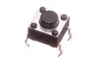 [BUTA-06-X-STAN-01   6 mm Pushbutton (Tactile)](BUTA-06-X-STAN-01/) [B06](BUTA-06-X-STAN-01/)| [BUTA-07-X-SMDS-01   7 mm SMD Pushbutton (Tactile)](BUTA-07-X-SMDS-01/) [B7S](BUTA-07-X-SMDS-01/)|
| :---: | :---: | :---: | :---: |
| [BUTA-3025-X-PI02-01   SMD (3025) 2 Pin Pushbutton (Tactile)](BUTA-3025-X-PI02-01/) [BT3025](BUTA-3025-X-PI02-01/)| [BUTA-4628-X-STAN-01   SMD (4628) Pushbutton (Tactile)](BUTA-4628-X-STAN-01/) [BT4628](BUTA-4628-X-STAN-01/)| [BUTA-4632-X-STAN-01   SMD (4632) Pushbutton (Tactile)](BUTA-4632-X-STAN-01/) [BT4632](BUTA-4632-X-STAN-01/)| [BUTA-52D-X-SMDS-01   5.2 mm SMD Pushbutton (Tactile)](BUTA-52D-X-SMDS-01/) |
| [BUTA-52D-X-STAN-01   5.2 mm Pushbutton (Tactile)](BUTA-52D-X-STAN-01/) [BT52](BUTA-52D-X-STAN-01/)| [BUTA-6035-X-STAN-01   SMD (6035) Pushbutton (Tactile)](BUTA-6035-X-STAN-01/) [B6035](BUTA-6035-X-STAN-01/)| [BUTA-6060-X-STAN-01   SMD (6060) Pushbutton (Tactile)](BUTA-6060-X-STAN-01/) [BT6060](BUTA-6060-X-STAN-01/)||

## BUTP > Pushbutton
  

| [BUTP-07-X-STAN-69    7 mm Pushbutton Panel Mount ](BUTP-07-X-STAN-69/) [BP07](BUTP-07-X-STAN-69/)||||
| :---: | :---: | :---: | :---: |

## BUZZ > Buzzer
  

| [BUZZ-12-X-V3-01   12 mm 3v Buzzer](BUZZ-12-X-V3-01/) [BZ12](BUZZ-12-X-V3-01/)||||
| :---: | :---: | :---: | :---: |

## CABL > Cable
  

|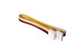 [CABL-200-X-GROV-01   200 mm Grove Cable](CABL-200-X-GROV-01/) [CBG200](CABL-200-X-GROV-01/)| [CABL-21D-X-V09-01   2.1 mm 9v Cable](CABL-21D-X-V09-01/) [CB9V21](CABL-21D-X-V09-01/)|||
| :---: | :---: | :---: | :---: |

## CAPC > Capacitor (Ceramic)
  

| [CAPC-0402-X-NF1-V50   SMD (0402) 1 nF Capacitor (Ceramic) 50v](CAPC-0402-X-NF1-V50/) [C42N001](CAPC-0402-X-NF1-V50/)| [CAPC-0402-X-NF10-V50   SMD (0402) 10 nF Capacitor (Ceramic) 50v](CAPC-0402-X-NF10-V50/) [C42N010](CAPC-0402-X-NF10-V50/)| [CAPC-0402-X-NF100-V10   SMD (0402) 100 nF Capacitor (Ceramic) 10v](CAPC-0402-X-NF100-V10/) [C42N100](CAPC-0402-X-NF100-V10/)| [CAPC-0402-X-NF100-V16   SMD (0402) 100 nF Capacitor (Ceramic) 16v](CAPC-0402-X-NF100-V16/) [R42N100](CAPC-0402-X-NF100-V16/)|
| :---: | :---: | :---: | :---: |
| [CAPC-0402-X-NF100-V25   SMD (0402) 100 nF Capacitor (Ceramic) 25v](CAPC-0402-X-NF100-V25/) [C42N100V25](CAPC-0402-X-NF100-V25/)| [CAPC-0402-X-NF22-V50   SMD (0402) 22 nF Capacitor (Ceramic) 50v](CAPC-0402-X-NF22-V50/) [C42N022](CAPC-0402-X-NF22-V50/)| [CAPC-0402-X-NF220-V16   SMD (0402) 220 nF Capacitor (Ceramic) 16v](CAPC-0402-X-NF220-V16/) [C42N220](CAPC-0402-X-NF220-V16/)| [CAPC-0402-X-NF22D-V50   SMD (0402) 2.2 nF Capacitor (Ceramic) 50v](CAPC-0402-X-NF22D-V50/) [C42N002](CAPC-0402-X-NF22D-V50/)|
| [CAPC-0402-X-NF47-V25   SMD (0402) 47 nF Capacitor (Ceramic) 25v](CAPC-0402-X-NF47-V25/) [C42N047](CAPC-0402-X-NF47-V25/)| [CAPC-0402-X-NF47D-V50   SMD (0402) 4.7 nF Capacitor (Ceramic) 50v](CAPC-0402-X-NF47D-V50/) [C42N047V50](CAPC-0402-X-NF47D-V50/)| [CAPC-0402-X-NF47D-V63D   SMD (0402) 4.7 nF Capacitor (Ceramic) 6.3v](CAPC-0402-X-NF47D-V63D/) [C42N047V63D](CAPC-0402-X-NF47D-V63D/)| [CAPC-0402-X-PF05D-V50   SMD (0402) 0.5 pF Capacitor (Ceramic) 50v](CAPC-0402-X-PF05D-V50/) [C42P0005](CAPC-0402-X-PF05D-V50/)|
| [CAPC-0402-X-PF06D-V50   SMD (0402) 0.6 pF Capacitor (Ceramic) 50v](CAPC-0402-X-PF06D-V50/) [C42P006D](CAPC-0402-X-PF06D-V50/)| [CAPC-0402-X-PF1-V50   SMD (0402) 1 pF Capacitor (Ceramic) 50v](CAPC-0402-X-PF1-V50/) [C42P001](CAPC-0402-X-PF1-V50/)| [CAPC-0402-X-PF10-V50   SMD (0402) 10 pF Capacitor (Ceramic) 50v](CAPC-0402-X-PF10-V50/) [C42P010](CAPC-0402-X-PF10-V50/)| [CAPC-0402-X-PF100-V50   SMD (0402) 100 pF Capacitor (Ceramic) 50v](CAPC-0402-X-PF100-V50/) [C42P100](CAPC-0402-X-PF100-V50/)|
| [CAPC-0402-X-PF12-V50   SMD (0402) 12 pF Capacitor (Ceramic) 50v](CAPC-0402-X-PF12-V50/) [C42P012](CAPC-0402-X-PF12-V50/)| [CAPC-0402-X-PF15-V50   SMD (0402) 15 pF Capacitor (Ceramic) 50v](CAPC-0402-X-PF15-V50/) [C42P015](CAPC-0402-X-PF15-V50/)| [CAPC-0402-X-PF15D-V50   SMD (0402) 1.5 pF Capacitor (Ceramic) 50v](CAPC-0402-X-PF15D-V50/) [C42P0015D](CAPC-0402-X-PF15D-V50/)| [CAPC-0402-X-PF18-V50   SMD (0402) 18 pF Capacitor (Ceramic) 50v](CAPC-0402-X-PF18-V50/) [C42P018](CAPC-0402-X-PF18-V50/)|
| [CAPC-0402-X-PF22-V50   SMD (0402) 22 pF Capacitor (Ceramic) 50v](CAPC-0402-X-PF22-V50/) [C42P022](CAPC-0402-X-PF22-V50/)| [CAPC-0402-X-PF220-V50   SMD (0402) 220 pF Capacitor (Ceramic) 50v](CAPC-0402-X-PF220-V50/) [C42P220](CAPC-0402-X-PF220-V50/)| [CAPC-0402-X-PF22D-V50   SMD (0402) 2.2 pF Capacitor (Ceramic) 50v](CAPC-0402-X-PF22D-V50/) [C42P0022D](CAPC-0402-X-PF22D-V50/)| [CAPC-0402-X-PF27-V50   SMD (0402) 27 pF Capacitor (Ceramic) 50v](CAPC-0402-X-PF27-V50/) [C42P027](CAPC-0402-X-PF27-V50/)|
| [CAPC-0402-X-PF33-V50   SMD (0402) 33 pF Capacitor (Ceramic) 50v](CAPC-0402-X-PF33-V50/) [C42P033](CAPC-0402-X-PF33-V50/)| [CAPC-0402-X-PF390-V50   SMD (0402) 390 pF Capacitor (Ceramic) 50v](CAPC-0402-X-PF390-V50/) [C42P390](CAPC-0402-X-PF390-V50/)| [CAPC-0402-X-PF47-V50   SMD (0402) 47 pF Capacitor (Ceramic) 50v](CAPC-0402-X-PF47-V50/) [C42P047](CAPC-0402-X-PF47-V50/)| [CAPC-0402-X-UF1-V10   SMD (0402) 1 uF Capacitor (Ceramic) 10v](CAPC-0402-X-UF1-V10/) [C42U001](CAPC-0402-X-UF1-V10/)|
| [CAPC-0402-X-UF1-V63D   SMD (0402) 1 uF Capacitor (Ceramic) 6.3v](CAPC-0402-X-UF1-V63D/) [C42U001V63D](CAPC-0402-X-UF1-V63D/)| [CAPC-0402-X-UF10-V63D   SMD (0402) 10 uF Capacitor (Ceramic) 6.3v](CAPC-0402-X-UF10-V63D/) [C42U010](CAPC-0402-X-UF10-V63D/)| [CAPC-0402-X-UF47D-V63D   SMD (0402) 4.7 uF Capacitor (Ceramic) 6.3v](CAPC-0402-X-UF47D-V63D/) [C42U004](CAPC-0402-X-UF47D-V63D/)| [CAPC-05-X-NF100-V50   5 mm 100 nF Capacitor (Ceramic) 50v](CAPC-05-X-NF100-V50/) [CCN100](CAPC-05-X-NF100-V50/)|
| [CAPC-0603-X-NF1-V50   SMD (0603) 1 nF Capacitor (Ceramic) 50v](CAPC-0603-X-NF1-V50/) [C6N001](CAPC-0603-X-NF1-V50/)| [CAPC-0603-X-NF10-V50   SMD (0603) 10 nF Capacitor (Ceramic) 50v](CAPC-0603-X-NF10-V50/) [C6N010](CAPC-0603-X-NF10-V50/)| [CAPC-0603-X-NF100-V50   SMD (0603) 100 nF Capacitor (Ceramic) 50v](CAPC-0603-X-NF100-V50/) [C6N100](CAPC-0603-X-NF100-V50/)| [CAPC-0603-X-NF22-V50   SMD (0603) 22 nF Capacitor (Ceramic) 50v](CAPC-0603-X-NF22-V50/) [C6N022](CAPC-0603-X-NF22-V50/)|
|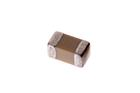 [CAPC-0603-X-NF220-V25   SMD (0603) 220 nF Capacitor (Ceramic) 25v](CAPC-0603-X-NF220-V25/) [C6N220](CAPC-0603-X-NF220-V25/)| [CAPC-0603-X-NF22D-V50   SMD (0603) 2.2 nF Capacitor (Ceramic) 50v](CAPC-0603-X-NF22D-V50/) [C6N002](CAPC-0603-X-NF22D-V50/)| [CAPC-0603-X-NF33-V50   SMD (0603) 33 nF Capacitor (Ceramic) 50v](CAPC-0603-X-NF33-V50/) [C6N033](CAPC-0603-X-NF33-V50/)| [CAPC-0603-X-NF47D-V50   SMD (0603) 4.7 nF Capacitor (Ceramic) 50v](CAPC-0603-X-NF47D-V50/) [C6N004](CAPC-0603-X-NF47D-V50/)|
| [CAPC-0603-X-PF10-V50   SMD (0603) 10 pF Capacitor (Ceramic) 50v](CAPC-0603-X-PF10-V50/) [C6P010](CAPC-0603-X-PF10-V50/)| [CAPC-0603-X-PF100-V50   SMD (0603) 100 pF Capacitor (Ceramic) 50v](CAPC-0603-X-PF100-V50/) [C6P100](CAPC-0603-X-PF100-V50/)| [CAPC-0603-X-PF12-V50   SMD (0603) 12 pF Capacitor (Ceramic) 50v](CAPC-0603-X-PF12-V50/) [C6P012](CAPC-0603-X-PF12-V50/)| [CAPC-0603-X-PF15-V50   SMD (0603) 15 pF Capacitor (Ceramic) 50v](CAPC-0603-X-PF15-V50/) [C6P015](CAPC-0603-X-PF15-V50/)|
| [CAPC-0603-X-PF22-V50   SMD (0603) 22 pF Capacitor (Ceramic) 50v](CAPC-0603-X-PF22-V50/) [C6P022](CAPC-0603-X-PF22-V50/)| [CAPC-0603-X-PF27-V50   SMD (0603) 27 pF Capacitor (Ceramic) 50v](CAPC-0603-X-PF27-V50/) [C6P027](CAPC-0603-X-PF27-V50/)| [CAPC-0603-X-PF39-V50   SMD (0603) 39 pF Capacitor (Ceramic) 50v](CAPC-0603-X-PF39-V50/) [C6P039](CAPC-0603-X-PF39-V50/)| [CAPC-0603-X-PF47D-V50   SMD (0603) 4.7 pF Capacitor (Ceramic) 50v](CAPC-0603-X-PF47D-V50/) [C6P004](CAPC-0603-X-PF47D-V50/)|
| [CAPC-0603-X-PF82D-V50   SMD (0603) 8.2 pF Capacitor (Ceramic) 50v](CAPC-0603-X-PF82D-V50/) [C6P008](CAPC-0603-X-PF82D-V50/)| [CAPC-0603-X-UF1-V25   SMD (0603) 1 uF Capacitor (Ceramic) 25v](CAPC-0603-X-UF1-V25/) [C6U001](CAPC-0603-X-UF1-V25/)| [CAPC-0603-X-UF10-V10   SMD (0603) 10 uF Capacitor (Ceramic) 10v](CAPC-0603-X-UF10-V10/) [C6U010](CAPC-0603-X-UF10-V10/)| [CAPC-0603-X-UF10-V63D   SMD (0603) 10 uF Capacitor (Ceramic) 6.3v](CAPC-0603-X-UF10-V63D/) [C6U010V63D](CAPC-0603-X-UF10-V63D/)|
| [CAPC-0603-X-UF22D-V10   SMD (0603) 2.2 uF Capacitor (Ceramic) 10v](CAPC-0603-X-UF22D-V10/) [C6U002](CAPC-0603-X-UF22D-V10/)| [CAPC-0603-X-UF47D-V10   SMD (0603) 4.7 uF Capacitor (Ceramic) 10v](CAPC-0603-X-UF47D-V10/) [C6U004](CAPC-0603-X-UF47D-V10/)| [CAPC-0805-X-NF10-V50   SMD (0805) 10 nF Capacitor (Ceramic) 50v](CAPC-0805-X-NF10-V50/) [C85N010](CAPC-0805-X-NF10-V50/)| [CAPC-0805-X-NF100-V50   SMD (0805) 100 nF Capacitor (Ceramic) 50v](CAPC-0805-X-NF100-V50/) [C85N100](CAPC-0805-X-NF100-V50/)|
| [CAPC-0805-X-UF1-V25   SMD (0805) 1 uF Capacitor (Ceramic) 25v](CAPC-0805-X-UF1-V25/) [C85U001](CAPC-0805-X-UF1-V25/)| [CAPC-0805-X-UF10-V10   SMD (0805) 10 uF Capacitor (Ceramic) 10v](CAPC-0805-X-UF10-V10/) [C85U010](CAPC-0805-X-UF10-V10/)| [CAPC-0805-X-UF10-V25   SMD (0805) 10 uF Capacitor (Ceramic) 25v](CAPC-0805-X-UF10-V25/) [C85U010](CAPC-0805-X-UF10-V25/)| [CAPC-0805-X-UF22-V63D   SMD (0805) 22 uF Capacitor (Ceramic) 6.3v](CAPC-0805-X-UF22-V63D/) [C85U022](CAPC-0805-X-UF22-V63D/)|
| [CAPC-0805-X-UF22D-V25   SMD (0805) 2.2 uF Capacitor (Ceramic) 25v](CAPC-0805-X-UF22D-V25/) [C85U002](CAPC-0805-X-UF22D-V25/)| [CAPC-0805-X-UF47D-V25   SMD (0805) 4.7 uF Capacitor (Ceramic) 25v](CAPC-0805-X-UF47D-V25/) [C85U004](CAPC-0805-X-UF47D-V25/)| [CAPC-1206-X-NF1-V1000   SMD (1206) 1 nF Capacitor (Ceramic) 1000v](CAPC-1206-X-NF1-V1000/) [C1N001](CAPC-1206-X-NF1-V1000/)| [CAPC-1206-X-UF10-V25   SMD (1206) 10 uF Capacitor (Ceramic) 25v](CAPC-1206-X-UF10-V25/) [C1U10](CAPC-1206-X-UF10-V25/)|
| [CAPC-1206-X-UF100-V63D   SMD (1206) 100 uF Capacitor (Ceramic) 6.3v](CAPC-1206-X-UF100-V63D/) [C1U100](CAPC-1206-X-UF100-V63D/)| [CAPC-45D-X-NF10-V50   4.5 mm 10 nF Capacitor (Ceramic) 50v](CAPC-45D-X-NF10-V50/) [CCN010](CAPC-45D-X-NF10-V50/)| [CAPC-55D-X-PF22-V50   5.5 mm 22 pF Capacitor (Ceramic) 50v](CAPC-55D-X-PF22-V50/) [CCP022](CAPC-55D-X-PF22-V50/)||

## CAPE > Capacitor (Electrolytic)
  

| [CAPE-05-X-UF1-V63D   5 mm 1 uF Capacitor (Electrolytic) 63v](CAPE-05-X-UF1-V63D/) [CEU001](CAPE-05-X-UF1-V63D/)| [CAPE-05-X-UF10-V25   5 mm 10 uF Capacitor (Electrolytic) 25v](CAPE-05-X-UF10-V25/) [CEU010](CAPE-05-X-UF10-V25/)| [CAPE-05-X-UF100-V16   5 mm 100 uF Capacitor (Electrolytic) 16v](CAPE-05-X-UF100-V16/) [CEU100F](CAPE-05-X-UF100-V16/)| [CAPE-05-X-UF22-V25   5 mm 22 uF Capacitor (Electrolytic) 25v](CAPE-05-X-UF22-V25/) [CEU022](CAPE-05-X-UF22-V25/)|
| :---: | :---: | :---: | :---: |
| [CAPE-05-X-UF22D-V63D   5 mm 2.2 uF Capacitor (Electrolytic) 63v](CAPE-05-X-UF22D-V63D/) [CEU002](CAPE-05-X-UF22D-V63D/)| [CAPE-05-X-UF47-V16   5 mm 47 uF Capacitor (Electrolytic) 16v](CAPE-05-X-UF47-V16/) [CEU047](CAPE-05-X-UF47-V16/)| [CAPE-05-X-UF47D-V63D   5 mm 4.7 uF Capacitor (Electrolytic) 63v](CAPE-05-X-UF47D-V63D/) [CEU004](CAPE-05-X-UF47D-V63D/)| [CAPE-10-X-UF470-V25   10 mm 470 uF Capacitor (Electrolytic) 25v](CAPE-10-X-UF470-V25/) [CEU470](CAPE-10-X-UF470-V25/)|
|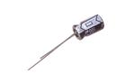 [CAPE-63D-X-UF100-V25   6.3 mm 100 uF Capacitor (Electrolytic) 25v](CAPE-63D-X-UF100-V25/) [CEU100](CAPE-63D-X-UF100-V25/)| [CAPE-PAND-X-UF220-V16   SMD (6.3 mm) (Panasonic D) 220 uF Capacitor (Electrolytic) 16v](CAPE-PAND-X-UF220-V16/) [CESU220](CAPE-PAND-X-UF220-V16/)| [CAPE-PAND-X-UF47-V25   SMD (6.3 mm) (Panasonic D) 47 uF Capacitor (Electrolytic) 25v](CAPE-PAND-X-UF47-V25/) [CESU047](CAPE-PAND-X-UF47-V25/)| [CAPE-PANG-X-UF100-V63   SMD (10 mm) (Panasonic G) 100 uF Capacitor (Electrolytic) 63v](CAPE-PANG-X-UF100-V63/) [CESU100V63](CAPE-PANG-X-UF100-V63/)|
|||||

## CAPT > Capacitor (Tantalum)
  

| [CAPT-3216-X-UF10-V10   SMD (3216) 10 uF Capacitor (Tantalum) 10v](CAPT-3216-X-UF10-V10/) [CTS21U010B](CAPT-3216-X-UF10-V10/)| [CAPT-3216-X-UF10-V16   SMD (3216) 10 uF Capacitor (Tantalum) 16v](CAPT-3216-X-UF10-V16/) [CTS32U010F](CAPT-3216-X-UF10-V16/)| [CAPT-3216-X-UF22-V10   SMD (3216) 22 uF Capacitor (Tantalum) 10v](CAPT-3216-X-UF22-V10/) [C32U022](CAPT-3216-X-UF22-V10/)| [CAPT-1206-X-UF47D-V16   SMD (1206) 4.7 uF Capacitor (Tantalum) 16v](CAPT-1206-X-UF47D-V16/) [C1U004D](CAPT-1206-X-UF47D-V16/)|
| :---: | :---: | :---: | :---: |
| [CAPT-3216-X-UF47D-V63D   SMD (3216) 4.7 uF Capacitor (Tantalum) 6.3v](CAPT-3216-X-UF47D-V63D/) [CTS1U47DF](CAPT-3216-X-UF47D-V63D/)| [CAPT-3528-X-UF10-V10   SMD (3528) 10 uF Capacitor (Tantalum) 10v](CAPT-3528-X-UF10-V10/) [CTS2U010B](CAPT-3528-X-UF10-V10/)| [CAPT-3528-X-UF10-V16   SMD (3528) 10 uF Capacitor (Tantalum) 16v](CAPT-3528-X-UF10-V16/) [CTS35U010F](CAPT-3528-X-UF10-V16/)| [CAPT-3528-X-UF100-V10   SMD (3528) 100 uF Capacitor (Tantalum) 10v](CAPT-3528-X-UF100-V10/) [C1U100](CAPT-3528-X-UF100-V10/)|
| [CAPT-3528-X-UF22-V10   SMD (3528) 22 uF Capacitor (Tantalum) 10v](CAPT-3528-X-UF22-V10/) [CTS3528U022](CAPT-3528-X-UF22-V10/)| [CAPT-3528-X-UF22-V16   SMD (3528) 22 uF Capacitor (Tantalum) 16v](CAPT-3528-X-UF22-V16/) [C3528U022F](CAPT-3528-X-UF22-V16/)| [CAPT-3528-X-UF47-V10   SMD (3528) 47 uF Capacitor (Tantalum) 10v](CAPT-3528-X-UF47-V10/) [CTS3528U047](CAPT-3528-X-UF47-V10/)|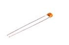 [CAPT-36D-X-NF100-V50   3.6 mm 100 nF Capacitor (Tantalum) 50v](CAPT-36D-X-NF100-V50/) [CTN100](CAPT-36D-X-NF100-V50/)|
| [CAPT-6032-X-UF100-V10   SMD (6032) 100 uF Capacitor (Tantalum) 10v](CAPT-6032-X-UF100-V10/) [CTS3U100](CAPT-6032-X-UF100-V10/)| [CAPT-6032-X-UF100-V16   SMD (6032) 100 uF Capacitor (Tantalum) 16v](CAPT-6032-X-UF100-V16/) [CTS60U100F](CAPT-6032-X-UF100-V16/)| [CAPT-6032-X-UF22-V25   SMD (6032) 22 uF Capacitor (Tantalum) 25v](CAPT-6032-X-UF22-V25/) [CTS3U022](CAPT-6032-X-UF22-V25/)| [CAPT-6032-X-UF47-V16   SMD (6032) 47 uF Capacitor (Tantalum) 16v](CAPT-6032-X-UF47-V16/) [CTS60U047](CAPT-6032-X-UF47-V16/)|
| [CAPT-7343-X-UF470-V63D   SMD (7343) 470 uF Capacitor (Tantalum) 6.3v](CAPT-7343-X-UF470-V63D/) [CTS4U470](CAPT-7343-X-UF470-V63D/)||||

## CERE > Ceramic Resonator
  

| [CERE-1263-X-MZ12-01   SMD (1206-3) 12 MHz Ceramic Resonator](CERE-1263-X-MZ12-01/) [CR16312](CERE-1263-X-MZ12-01/)| [CERE-1263-X-MZ16-01   SMD (1206-3) 16 MHz Ceramic Resonator](CERE-1263-X-MZ16-01/) [CR16316](CERE-1263-X-MZ16-01/)| [CERE-1263-X-MZ8-01   SMD (1206-3) 8 MHz Ceramic Resonator](CERE-1263-X-MZ8-01/) [CR1638](CERE-1263-X-MZ8-01/)||
| :---: | :---: | :---: | :---: |

## DBCO > Connector
  

|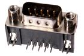 [DBCO-DB09-X-THTH-ML   DB9 Connector Male](DBCO-DB09-X-THTH-ML/) [DB09M](DBCO-DB09-X-THTH-ML/)||||
| :---: | :---: | :---: | :---: |

## CRHO > Crimp Housing
  

| [CRHO-I01-B-PI01-01   2.54 mm 1 Pin Black Crimp Housing](CRHO-I01-B-PI01-01/) [CH01](CRHO-I01-B-PI01-01/)| [CRHO-I01-B-PI02-01   2.54 mm 2 Pin Black Crimp Housing](CRHO-I01-B-PI02-01/) [CH02](CRHO-I01-B-PI02-01/)| [CRHO-I01-B-PI03-01   2.54 mm 3 Pin Black Crimp Housing](CRHO-I01-B-PI03-01/) [CH03](CRHO-I01-B-PI03-01/)| [CRHO-I01-B-PI04-01   2.54 mm 4 Pin Black Crimp Housing](CRHO-I01-B-PI04-01/) [CH04](CRHO-I01-B-PI04-01/)|
| :---: | :---: | :---: | :---: |
| [CRHO-I01-B-PI05-01   2.54 mm 5 Pin Black Crimp Housing](CRHO-I01-B-PI05-01/) [CH05](CRHO-I01-B-PI05-01/)| [CRHO-I01-B-PI06-01   2.54 mm 6 Pin Black Crimp Housing](CRHO-I01-B-PI06-01/) [CH06](CRHO-I01-B-PI06-01/)| [CRHO-I01-B-PI08-01   2.54 mm 8 Pin Black Crimp Housing](CRHO-I01-B-PI08-01/) [CH08](CRHO-I01-B-PI08-01/)| [CRHO-I01-B-PI10-01   2.54 mm 10 Pin Black Crimp Housing](CRHO-I01-B-PI10-01/) [CH10](CRHO-I01-B-PI10-01/)|
|||||

## DCJP > DC Jack
  

| [DCJP-21D-X-MHI03-69    2.1 mm (7 mm mounting hole) DC Jack Panel Mount ](DCJP-21D-X-MHI03-69/) [GJP3](DCJP-21D-X-MHI03-69/)| [DCJP-21D-X-STAN-01   2.1 mm DC Jack](DCJP-21D-X-STAN-01/) [DJ21](DCJP-21D-X-STAN-01/)| [DCJP-21D-X-STAN-02   2.1 mm DC Jack](DCJP-21D-X-STAN-02/) [DJ2Z](DCJP-21D-X-STAN-02/)| [DCJP-25D-X-INLI-01   2.5 mm (Inline) DC Jack](DCJP-25D-X-INLI-01/) [DCJ25I](DCJP-25D-X-INLI-01/)|
| :---: | :---: | :---: | :---: |
| [DCJP-S21D-X-STAN-01   2.1 mm (SMD) DC Jack](DCJP-S21D-X-STAN-01/) [DJS21](DCJP-S21D-X-STAN-01/)||||

## DCPP > DC Plug
  

| [DCPP-21D-X-STAN-01   2.1 mm DC Plug](DCPP-21D-X-STAN-01/) [DCP21](DCPP-21D-X-STAN-01/)| [DCPP-25D-X-STAN-01   2.5 mm DC Plug](DCPP-25D-X-STAN-01/) [DCP25](DCPP-25D-X-STAN-01/)|||
| :---: | :---: | :---: | :---: |

## DIOD > Diode
  

| [DIOD-1206-X-A015D-01   SMD (1206) 150 mA Diode 75v](DIOD-1206-X-A015D-01/) [DS115](DIOD-1206-X-A015D-01/)| [DIOD-D214-X-A01-01   SMD (DO-214) 1 Amp Diode](DIOD-D214-X-A01-01/) [DS201](DIOD-D214-X-A01-01/)| [DIOD-I03-X-A01-V50   7.62 mm 1 Amp Diode 50v](DIOD-I03-X-A01-V50/) [DT01](DIOD-I03-X-A01-V50/)| [DIOD-MMA-X-A02D-V75   SMD (Mini MELF) 200 mA Diode 75v](DIOD-MMA-X-A02D-V75/) [DSM2D](DIOD-MMA-X-A02D-V75/)|
| :---: | :---: | :---: | :---: |
|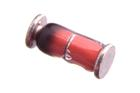 [DIOD-MMA-X-A03D-01   SMD (Mini MELF) 300 mA Diode](DIOD-MMA-X-A03D-01/) [DSM3D](DIOD-MMA-X-A03D-01/)| [DIOD-S123-X-A02D-01   SMD (SOD-123) 200 mA Diode](DIOD-S123-X-A02D-01/) [DS32D](DIOD-S123-X-A02D-01/)| [DIOD-S123-X-A02D-V1   SMD (SOD-123) 200 mA Diode 100v](DIOD-S123-X-A02D-V1/) [DS32D](DIOD-S123-X-A02D-V1/)| [DIOD-S123-X-ESDP-01   SMD (SOD-123) ESD Protection Diode](DIOD-S123-X-ESDP-01/) [DS3EP](DIOD-S123-X-ESDP-01/)|
| [DIOD-S123-X-KMBR120-01   SMD (SOD-123) MBR120 Diode](DIOD-S123-X-KMBR120-01/) [D123120](DIOD-S123-X-KMBR120-01/)| [DIOD-S123-X-STAN-01   SMD (SOD-123) Diode](DIOD-S123-X-STAN-01/) [DS301](DIOD-S123-X-STAN-01/)| [DIOD-S323-X-K4148-01   SMD (SOD-323) Diode](DIOD-S323-X-K4148-01/) [D34148](DIOD-S323-X-K4148-01/)| [DIOD-SO23-X-ESDP-01   SMD (SOT-23) ESD Protection Diode](DIOD-SO23-X-ESDP-01/) [DS2EP](DIOD-SO23-X-ESDP-01/)|
| [DIOD-SO23-X-ESDP-V33D   SMD (SOT-23) ESD Protection Diode 3.3v](DIOD-SO23-X-ESDP-V33D/) [DS3EP3](DIOD-SO23-X-ESDP-V33D/)||||

## DIOS > Diode (Schottky)
  

| [DIOS-D214-X-A01-01   SMD (DO-214) 1 Amp Diode (Schottky)](DIOS-D214-X-A01-01/) [DS201](DIOS-D214-X-A01-01/)| [DIOS-D214-X-A05-01   SMD (DO-214) 5 Amp Diode (Schottky)](DIOS-D214-X-A05-01/) [DS205](DIOS-D214-X-A05-01/)| [DIOS-S123-X-A01-01   SMD (SOD-123) 1 Amp Diode (Schottky)](DIOS-S123-X-A01-01/) [DS35D1](DIOS-S123-X-A01-01/)| [DIOS-S123-X-A05D-01   SMD (SOD-123) 500 mA Diode (Schottky)](DIOS-S123-X-A05D-01/) [DS35D](DIOS-S123-X-A05D-01/)|
| :---: | :---: | :---: | :---: |
| [DIOS-S123-X-A05D-V40   SMD (SOD-123) 500 mA Diode (Schottky) 40v](DIOS-S123-X-A05D-V40/) [DS35D](DIOS-S123-X-A05D-V40/)| [DIOS-SO23-X-A02D-01   SMD (SOT-23) 200 mA Diode (Schottky)](DIOS-SO23-X-A02D-01/) [DS22D](DIOS-SO23-X-A02D-01/)|||

## DISP > Display
  

| [DISP-10SEL-GYR-STAN-01   10 Segment LED Bargraph Green, Yellow, Red Display](DISP-10SEL-GYR-STAN-01/) [DS10M](DISP-10SEL-GYR-STAN-01/)| [DISP-128X64-X-OLED-01   128 x 64 Pixels OLED Display](DISP-128X64-X-OLED-01/) [DS16OL](DISP-128X64-X-OLED-01/)| [DISP-16X2-G-LCD-01    16 x 2 Character LCD Green Display ](DISP-16X2-G-LCD-01/) [DS16](DISP-16X2-G-LCD-01/)| [DISP-16X2-G-LCD-I2    16 x 2 Character LCD Green Display (I2C) ](DISP-16X2-G-LCD-I2/) [DS16](DISP-16X2-G-LCD-I2/)|
| :---: | :---: | :---: | :---: |
| [DISP-7SEL-R-4DIG-01   7 Segment LED 4 Digit Red Display](DISP-7SEL-R-4DIG-01/) [DS74R](DISP-7SEL-R-4DIG-01/)||||

## FERB > Ferrite Bead
  

| [FERB-0402-X-O182-01   SMD (0402) 1.8k Ohm Ferrite Bead](FERB-0402-X-O182-01/) [F42182](FERB-0402-X-O182-01/)| [FERB-0603-X-O121-01   SMD (0603) 120 Ohm Ferrite Bead](FERB-0603-X-O121-01/) [F6121](FERB-0603-X-O121-01/)| [FERB-0603-X-O252-01   SMD (0603) 2.5k Ohm Ferrite Bead](FERB-0603-X-O252-01/) [F6252](FERB-0603-X-O252-01/)| [FERB-0805-X-O121-01   SMD (0805) 120 Ohm Ferrite Bead](FERB-0805-X-O121-01/) [F6121](FERB-0805-X-O121-01/)|
| :---: | :---: | :---: | :---: |
| [FERB-0805-X-O221-01   SMD (0805) 220 Ohm Ferrite Bead](FERB-0805-X-O221-01/) [F8221](FERB-0805-X-O221-01/)| [FERB-0805-X-O300-01   SMD (0805) 30 Ohm Ferrite Bead](FERB-0805-X-O300-01/) [F8300](FERB-0805-X-O300-01/)| [FERB-0805-X-O331-01   SMD (0805) 330 Ohm Ferrite Bead](FERB-0805-X-O331-01/) [F85331](FERB-0805-X-O331-01/)| [FERB-0805-X-O471-01   SMD (0805) 470 Ohm Ferrite Bead](FERB-0805-X-O471-01/) [F85471](FERB-0805-X-O471-01/)|
|||||

## HEAD > Header
  

| [HEAD-01-X-PI04-RS   1 mm 4 Pin Header Right Angle (SMD)](HEAD-01-X-PI04-RS/) [H14RS](HEAD-01-X-PI04-RS/)| [HEAD-I01-L-PI02-01   2.54 mm 2 Pin Blue Header](HEAD-I01-L-PI02-01/) [H02L](HEAD-I01-L-PI02-01/)|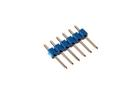 [HEAD-I01-L-PI06-01   2.54 mm 6 Pin Blue Header](HEAD-I01-L-PI06-01/) [H06L](HEAD-I01-L-PI06-01/)|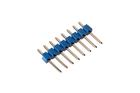 [HEAD-I01-L-PI08-01   2.54 mm 8 Pin Blue Header](HEAD-I01-L-PI08-01/) [H08L](HEAD-I01-L-PI08-01/)|
| :---: | :---: | :---: | :---: |
| [HEAD-I01-L-PI2X03-01   2.54 mm 6 Pin (2x3) Blue Header](HEAD-I01-L-PI2X03-01/) [H2X03L](HEAD-I01-L-PI2X03-01/)| [HEAD-I01-W-PI02-01   2.54 mm 2 Pin White Header](HEAD-I01-W-PI02-01/) [H02W](HEAD-I01-W-PI02-01/)| [HEAD-I01-W-PI03-01   2.54 mm 3 Pin White Header](HEAD-I01-W-PI03-01/) [H03W](HEAD-I01-W-PI03-01/)| [HEAD-I01-W-PI08-01   2.54 mm 8 Pin White Header](HEAD-I01-W-PI08-01/) [H08W](HEAD-I01-W-PI08-01/)|
| [HEAD-I01-X-PI03-01   2.54 mm 3 Pin Header](HEAD-I01-X-PI03-01/) [H03](HEAD-I01-X-PI03-01/)| [HEAD-I01-X-PI01-RS   2.54 mm 1 Pin Header Right Angle (SMD)](HEAD-I01-X-PI01-RS/) [HRS01](HEAD-I01-X-PI01-RS/)|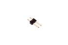 [HEAD-I01-X-PI02-01   2.54 mm 2 Pin Header](HEAD-I01-X-PI02-01/) [H02](HEAD-I01-X-PI02-01/)| [HEAD-I01-X-PI02-RS   2.54 mm 2 Pin Header Right Angle (SMD)](HEAD-I01-X-PI02-RS/) |
| [HEAD-I01-X-PI03-OOEB   2.54 mm 3 Pin Header (OOEB)](HEAD-I01-X-PI03-OOEB/) [H03OOEB](HEAD-I01-X-PI03-OOEB/)| [HEAD-I01-X-PI03-RA   2.54 mm 3 Pin Header Right Angle](HEAD-I01-X-PI03-RA/) [HR03](HEAD-I01-X-PI03-RA/)| [HEAD-I01-X-PI03-RS   2.54 mm 3 Pin Header Right Angle (SMD)](HEAD-I01-X-PI03-RS/) |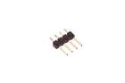 [HEAD-I01-X-PI04-01   2.54 mm 4 Pin Header](HEAD-I01-X-PI04-01/) [H04](HEAD-I01-X-PI04-01/)|
| [HEAD-I01-X-PI04-RS   2.54 mm 4 Pin Header Right Angle (SMD)](HEAD-I01-X-PI04-RS/) | [HEAD-I01-X-PI05-01   2.54 mm 5 Pin Header](HEAD-I01-X-PI05-01/) [H05](HEAD-I01-X-PI05-01/)| [HEAD-I01-X-PI05-RS   2.54 mm 5 Pin Header Right Angle (SMD)](HEAD-I01-X-PI05-RS/) | [HEAD-I01-X-PI06-01   2.54 mm 6 Pin Header](HEAD-I01-X-PI06-01/) [H06](HEAD-I01-X-PI06-01/)|
| [HEAD-I01-X-PI06-RA   2.54 mm 6 Pin Header Right Angle](HEAD-I01-X-PI06-RA/) [HR06](HEAD-I01-X-PI06-RA/)| [HEAD-I01-X-PI06-RS   2.54 mm 6 Pin Header Right Angle (SMD)](HEAD-I01-X-PI06-RS/) | [HEAD-I01-X-PI07-01   2.54 mm 7 Pin Header](HEAD-I01-X-PI07-01/) [H07](HEAD-I01-X-PI07-01/)| [HEAD-I01-X-PI07-RS   2.54 mm 7 Pin Header Right Angle (SMD)](HEAD-I01-X-PI07-RS/) [HRS07](HEAD-I01-X-PI07-RS/)|
| [HEAD-I01-X-PI08-01   2.54 mm 8 Pin Header](HEAD-I01-X-PI08-01/) [H08](HEAD-I01-X-PI08-01/)| [HEAD-I01-X-PI08-RS   2.54 mm 8 Pin Header Right Angle (SMD)](HEAD-I01-X-PI08-RS/) | [HEAD-I01-X-PI09-01   2.54 mm 9 Pin Header](HEAD-I01-X-PI09-01/) [H09](HEAD-I01-X-PI09-01/)| [HEAD-I01-X-PI10-01   2.54 mm 10 Pin Header](HEAD-I01-X-PI10-01/) [H10](HEAD-I01-X-PI10-01/)|
| [HEAD-I01-X-PI10-RS   2.54 mm 10 Pin Header Right Angle (SMD)](HEAD-I01-X-PI10-RS/) | [HEAD-I01-X-PI12-01   2.54 mm 12 Pin Header](HEAD-I01-X-PI12-01/) [H12](HEAD-I01-X-PI12-01/)| [HEAD-I01-X-PI12-RS   2.54 mm 12 Pin Header Right Angle (SMD)](HEAD-I01-X-PI12-RS/) | [HEAD-I01-X-PI14-01   2.54 mm 14 Pin Header](HEAD-I01-X-PI14-01/) [H14](HEAD-I01-X-PI14-01/)|
| [HEAD-I01-X-PI16-01   2.54 mm 16 Pin Header](HEAD-I01-X-PI16-01/) [H16](HEAD-I01-X-PI16-01/)| [HEAD-I01-X-PI18-01   2.54 mm 18 Pin Header](HEAD-I01-X-PI18-01/) [H18](HEAD-I01-X-PI18-01/)| [HEAD-I01-X-PI20-01   2.54 mm 20 Pin Header](HEAD-I01-X-PI20-01/) [H20](HEAD-I01-X-PI20-01/)| [HEAD-I01-X-PI2x02-01   2.54 mm 4 Pin (2x2) Header](HEAD-I01-X-PI2x02-01/) [H2X02](HEAD-I01-X-PI2x02-01/)|
| [HEAD-I01-X-PI2X02-RS   2.54 mm 4 Pin (2x2) Header Right Angle (SMD)](HEAD-I01-X-PI2X02-RS/) [HRS2X02](HEAD-I01-X-PI2X02-RS/)| [HEAD-I01-X-PI2X02-SHRO   2.54 mm 4 Pin (2x2) Header Shrouded (IDC)](HEAD-I01-X-PI2X02-SHRO/) [H2X2SH](HEAD-I01-X-PI2X02-SHRO/)| [HEAD-I01-X-PI2X03-01   2.54 mm 6 Pin (2x3) Header](HEAD-I01-X-PI2X03-01/) | [HEAD-I01-X-PI2X03-RA   2.54 mm 6 Pin (2x3) Header Right Angle](HEAD-I01-X-PI2X03-RA/) [HR2X03](HEAD-I01-X-PI2X03-RA/)|
| [HEAD-I01-X-2X03PI-RS   2.54 mm Header Right Angle (SMD)](HEAD-I01-X-2X03PI-RS/) [HRS2X03](HEAD-I01-X-2X03PI-RS/)| [HEAD-I01-X-PI2X03-SHRO   2.54 mm 6 Pin (2x3) Header Shrouded (IDC)](HEAD-I01-X-PI2X03-SHRO/) [H2X3SH](HEAD-I01-X-PI2X03-SHRO/)| [HEAD-I01-X-PI2X04-RA   2.54 mm 8 Pin (2x4) Header Right Angle](HEAD-I01-X-PI2X04-RA/) [HR2X03](HEAD-I01-X-PI2X04-RA/)| [HEAD-I01-X-PI2X04-RS   2.54 mm 8 Pin (2x4) Header Right Angle (SMD)](HEAD-I01-X-PI2X04-RS/) [HRS2X04](HEAD-I01-X-PI2X04-RS/)|
| [HEAD-I01-X-PI2X04-SHRO   2.54 mm 8 Pin (2x4) Header Shrouded (IDC)](HEAD-I01-X-PI2X04-SHRO/) [H2X4SH](HEAD-I01-X-PI2X04-SHRO/)| [HEAD-I01-X-PI2X05-RS   2.54 mm 10 Pin (2x5) Header Right Angle (SMD)](HEAD-I01-X-PI2X05-RS/) [HRS2X05](HEAD-I01-X-PI2X05-RS/)| [HEAD-I01-X-PI2X05-SHRO   2.54 mm 10 Pin (2x5) Header Shrouded (IDC)](HEAD-I01-X-PI2X05-SHRO/) [H2X5SH](HEAD-I01-X-PI2X05-SHRO/)| [HEAD-I01-X-PI2X06-RS   2.54 mm 12 Pin (2x6) Header Right Angle (SMD)](HEAD-I01-X-PI2X06-RS/) [HRS2X06](HEAD-I01-X-PI2X06-RS/)|
| [HEAD-I01-X-PI2X06-SHRO   2.54 mm 12 Pin (2x6) Header Shrouded (IDC)](HEAD-I01-X-PI2X06-SHRO/) [H2X6SH](HEAD-I01-X-PI2X06-SHRO/)| [HEAD-I01-X-PI2X07-RS   2.54 mm 14 Pin (2x7) Header Right Angle (SMD)](HEAD-I01-X-PI2X07-RS/) [HRS2X07](HEAD-I01-X-PI2X07-RS/)| [HEAD-I01-X-PI2X07-SHRO   2.54 mm 14 Pin (2x7) Header Shrouded (IDC)](HEAD-I01-X-PI2X07-SHRO/) [H2X7SH](HEAD-I01-X-PI2X07-SHRO/)| [HEAD-I01-X-PI2X08-RS   2.54 mm 16 Pin (2x8) Header Right Angle (SMD)](HEAD-I01-X-PI2X08-RS/) [HRS2X08](HEAD-I01-X-PI2X08-RS/)|
| [HEAD-I01-X-PI2X08-SHRO   2.54 mm 16 Pin (2x8) Header Shrouded (IDC)](HEAD-I01-X-PI2X08-SHRO/) [H2X8SH](HEAD-I01-X-PI2X08-SHRO/)| [HEAD-I01-X-PI2X09-RS   2.54 mm 18 Pin (2x9) Header Right Angle (SMD)](HEAD-I01-X-PI2X09-RS/) [HRS2X09](HEAD-I01-X-PI2X09-RS/)| [HEAD-I01-X-PI2X09-SHRO   2.54 mm 18 Pin (2x9) Header Shrouded (IDC)](HEAD-I01-X-PI2X09-SHRO/) [H2X9SH](HEAD-I01-X-PI2X09-SHRO/)| [HEAD-I01-X-PI2X10-01   2.54 mm 20 Pin (2x10) Header](HEAD-I01-X-PI2X10-01/) [SHRO](HEAD-I01-X-PI2X10-01/)|
| [HEAD-I01-X-PI2X10-RS   2.54 mm 20 Pin (2x10) Header Right Angle (SMD)](HEAD-I01-X-PI2X10-RS/) [HRS2X10](HEAD-I01-X-PI2X10-RS/)| [HEAD-I01-X-PI2X10-SHRO   2.54 mm 20 Pin (2x10) Header Shrouded (IDC)](HEAD-I01-X-PI2X10-SHRO/) [H2X10SH](HEAD-I01-X-PI2X10-SHRO/)| [HEAD-I01-X-2X11PI-RS   2.54 mm Header Right Angle (SMD)](HEAD-I01-X-2X11PI-RS/) [HRS2X11](HEAD-I01-X-2X11PI-RS/)| [HEAD-I01-X-PI2X12-RS   2.54 mm 24 Pin (2x12) Header Right Angle (SMD)](HEAD-I01-X-PI2X12-RS/) [HRS2X12](HEAD-I01-X-PI2X12-RS/)|
| [HEAD-I01-X-PI2X13-RS   2.54 mm 26 Pin (2x13) Header Right Angle (SMD)](HEAD-I01-X-PI2X13-RS/) [HRS2X13](HEAD-I01-X-PI2X13-RS/)| [HEAD-I01-X-PI2X36-RA   2.54 mm 72 Pin (2x36) Header Right Angle](HEAD-I01-X-PI2X36-RA/) [HR2X03](HEAD-I01-X-PI2X36-RA/)|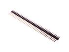 [HEAD-I01-X-PI36-01   2.54 mm 36 Pin Header](HEAD-I01-X-PI36-01/) [H36](HEAD-I01-X-PI36-01/)| [HEAD-I01-X-PI3X03-01    2.54 mm 9 Pin (3x3) Header ](HEAD-I01-X-PI3X03-01/) [H3X03](HEAD-I01-X-PI3X03-01/)|
| [HEAD-I01-X-PI40-01   2.54 mm 40 Pin Header](HEAD-I01-X-PI40-01/) [H40](HEAD-I01-X-PI40-01/)|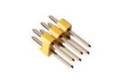 [HEAD-I01-Y-2X03PI-01   2.54 mm 6 Pin (2x3) Yellow Header](HEAD-I01-Y-2X03PI-01/) [H2X03Y](HEAD-I01-Y-2X03PI-01/)| [HEAD-JSTXH-X-PI01-01   JST XH (2.5 mm) 1 Pin Header](HEAD-JSTXH-X-PI01-01/) [HXH1](HEAD-JSTXH-X-PI01-01/)| [HEAD-JSTXH-X-PI02-01   JST XH (2.5 mm) 2 Pin Header](HEAD-JSTXH-X-PI02-01/) [HXH2](HEAD-JSTXH-X-PI02-01/)|
| [HEAD-JSTXH-X-PI03-01   JST XH (2.5 mm) 3 Pin Header](HEAD-JSTXH-X-PI03-01/) [HXH3](HEAD-JSTXH-X-PI03-01/)| [HEAD-JSTXH-X-PI04-01   JST XH (2.5 mm) 4 Pin Header](HEAD-JSTXH-X-PI04-01/) [HXH4](HEAD-JSTXH-X-PI04-01/)| [HEAD-JSTXH-X-PI05-01   JST XH (2.5 mm) 5 Pin Header](HEAD-JSTXH-X-PI05-01/) [HXH5](HEAD-JSTXH-X-PI05-01/)| [HEAD-JSTXH-X-PI06-01   JST XH (2.5 mm) 6 Pin Header](HEAD-JSTXH-X-PI06-01/) [HXH6](HEAD-JSTXH-X-PI06-01/)|
| [HEAD-JSTXH-X-PI07-01   JST XH (2.5 mm) 7 Pin Header](HEAD-JSTXH-X-PI07-01/) [HXH7](HEAD-JSTXH-X-PI07-01/)| [HEAD-JSTXH-X-PI08-01   JST XH (2.5 mm) 8 Pin Header](HEAD-JSTXH-X-PI08-01/) [HXH8](HEAD-JSTXH-X-PI08-01/)| [HEAD-JSTXH-X-PI09-01   JST XH (2.5 mm) 9 Pin Header](HEAD-JSTXH-X-PI09-01/) [HXH9](HEAD-JSTXH-X-PI09-01/)| [HEAD-JSTXH-X-PI10-01   JST XH (2.5 mm) 10 Pin Header](HEAD-JSTXH-X-PI10-01/) [HXH10](HEAD-JSTXH-X-PI10-01/)|
| [HEAD-JSTXH-X-PI11-01   JST XH (2.5 mm) 11 Pin Header](HEAD-JSTXH-X-PI11-01/) [HXH11](HEAD-JSTXH-X-PI11-01/)| [HEAD-JSTXH-X-PI12-01   JST XH (2.5 mm) 12 Pin Header](HEAD-JSTXH-X-PI12-01/) [HXH12](HEAD-JSTXH-X-PI12-01/)| [HEAD-JSTXH-X-PI13-01   JST XH (2.5 mm) 13 Pin Header](HEAD-JSTXH-X-PI13-01/) [HXH13](HEAD-JSTXH-X-PI13-01/)| [HEAD-JSTXH-X-PI14-01   JST XH (2.5 mm) 14 Pin Header](HEAD-JSTXH-X-PI14-01/) [HXH14](HEAD-JSTXH-X-PI14-01/)|
| [HEAD-JSTXH-X-PI15-01   JST XH (2.5 mm) 15 Pin Header](HEAD-JSTXH-X-PI15-01/) [HXH15](HEAD-JSTXH-X-PI15-01/)| [HEAD-JSTXH-X-PI16-01   JST XH (2.5 mm) 16 Pin Header](HEAD-JSTXH-X-PI16-01/) [HXH16](HEAD-JSTXH-X-PI16-01/)| [HEAD-JSTXH-X-PI17-01   JST XH (2.5 mm) 17 Pin Header](HEAD-JSTXH-X-PI17-01/) [HXH17](HEAD-JSTXH-X-PI17-01/)| [HEAD-JSTXH-X-PI18-01   JST XH (2.5 mm) 18 Pin Header](HEAD-JSTXH-X-PI18-01/) [HXH18](HEAD-JSTXH-X-PI18-01/)|
| [HEAD-JSTXH-X-PI19-01   JST XH (2.5 mm) 19 Pin Header](HEAD-JSTXH-X-PI19-01/) [HXH19](HEAD-JSTXH-X-PI19-01/)| [HEAD-JSTXH-X-PI20-01   JST XH (2.5 mm) 20 Pin Header](HEAD-JSTXH-X-PI20-01/) [HXH20](HEAD-JSTXH-X-PI20-01/)|||

## HEAS > Header (Socket)
  

| [HEAS-02-L-PI10-01   2 mm 10 Pin Blue Header (Socket)](HEAS-02-L-PI10-01/) [HS210](HEAS-02-L-PI10-01/)| [HEAS-02-W-PI10-01   2 mm 10 Pin White Header (Socket)](HEAS-02-W-PI10-01/) [HS210W](HEAS-02-W-PI10-01/)| [HEAS-02-X-PI10-01   2 mm 10 Pin Header (Socket)](HEAS-02-X-PI10-01/) [HS210](HEAS-02-X-PI10-01/)| [HEAS-02-X-PI10-SM   2 mm 10 Pin Header (Socket) (SMD)](HEAS-02-X-PI10-SM/) [HS210S](HEAS-02-X-PI10-SM/)|
| :---: | :---: | :---: | :---: |
| [HEAS-I01-W-PI06-01   2.54 mm 6 Pin White Header (Socket)](HEAS-I01-W-PI06-01/) [HS6W](HEAS-I01-W-PI06-01/)| [HEAS-I01-W-PI08-01   2.54 mm 8 Pin White Header (Socket)](HEAS-I01-W-PI08-01/) [HS08W](HEAS-I01-W-PI08-01/)| [HEAS-I01-X-2X04PI-01   2.54 mm Header (Socket)](HEAS-I01-X-2X04PI-01/) [HSX4](HEAS-I01-X-2X04PI-01/)| [HEAS-I01-X-PI02-RO   2.54 mm 2 Pin Header (Socket) (Round)](HEAS-I01-X-PI02-RO/) [HS2R](HEAS-I01-X-PI02-RO/)|
| [HEAS-I01-X-PI04-01   2.54 mm 4 Pin Header (Socket)](HEAS-I01-X-PI04-01/) [HS04](HEAS-I01-X-PI04-01/)| [HEAS-I01-X-PI06-01   2.54 mm 6 Pin Header (Socket)](HEAS-I01-X-PI06-01/) [HS06](HEAS-I01-X-PI06-01/)| [HEAS-I01-Y-PI08-01   2.54 mm 8 Pin Yellow Header (Socket)](HEAS-I01-Y-PI08-01/) [HS8Y](HEAS-I01-Y-PI08-01/)| [HEAS-I01-X-PI10-01   2.54 mm 10 Pin Header (Socket)](HEAS-I01-X-PI10-01/) [HS10](HEAS-I01-X-PI10-01/)|
| [HEAS-I01-X-PI15-01   2.54 mm 15 Pin Header (Socket)](HEAS-I01-X-PI15-01/) [HS15](HEAS-I01-X-PI15-01/)| [HEAS-I01-X-PI20-01   2.54 mm 20 Pin Header (Socket)](HEAS-I01-X-PI20-01/) [HS20](HEAS-I01-X-PI20-01/)| [HEAS-I01-Y-PI06-01   2.54 mm 6 Pin Yellow Header (Socket)](HEAS-I01-Y-PI06-01/) [HS06Y](HEAS-I01-Y-PI06-01/)| [HEAS-I01-Y-PI10-01   2.54 mm 10 Pin Yellow Header (Socket)](HEAS-I01-Y-PI10-01/) [HS10Y](HEAS-I01-Y-PI10-01/)|
|||||

## HEAL > Header (Long)
  

| [HEAL-I01-X-PI03-01   2.54 mm 3 Pin Header (Long)](HEAL-I01-X-PI03-01/) [HL03](HEAL-I01-X-PI03-01/)| [HEAL-I01-X-PI36-01   2.54 mm 36 Pin Header (Long)](HEAL-I01-X-PI36-01/) [HL36](HEAL-I01-X-PI36-01/)|||
| :---: | :---: | :---: | :---: |

## HEDS > Headphone Socket
  

| [HEDS-35D-T-SMDS-4P   3.5 mm SMD Headphone Socket (4 Pin)](HEDS-35D-T-SMDS-4P/) [HP34T](HEDS-35D-T-SMDS-4P/)| [HEDS-35D-U-SMDS-4P   3.5 mm SMD Headphone Socket (4 Pin)](HEDS-35D-U-SMDS-4P/) [HP34U](HEDS-35D-U-SMDS-4P/)|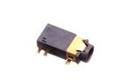 [HEDS-35D-X-SMDS-01   3.5 mm SMD Headphone Socket](HEDS-35D-X-SMDS-01/) [10C1](HEDS-35D-X-SMDS-01/)| [HEDS-35D-X-SMDS-4P   3.5 mm SMD Headphone Socket (4 Pin)](HEDS-35D-X-SMDS-4P/) [HP34X](HEDS-35D-X-SMDS-4P/)|
| :---: | :---: | :---: | :---: |
|||||

## HELF > Female Header (Long)
  

| [HELF-I01-L-2X03PI-01   2.54 mm 6 Pin (2x3) Blue Female Header (Long)](HELF-I01-L-2X03PI-01/) [HFLX03L](HELF-I01-L-2X03PI-01/)| [HELF-I01-L-PI06-01   2.54 mm 6 Pin Blue Female Header (Long)](HELF-I01-L-PI06-01/) [HFL06L](HELF-I01-L-PI06-01/)| [HELF-I01-L-PI08-01   2.54 mm 8 Pin Blue Female Header (Long)](HELF-I01-L-PI08-01/) [HFL08L](HELF-I01-L-PI08-01/)| [HELF-I01-L-PI10-01   2.54 mm 10 Pin Blue Female Header (Long)](HELF-I01-L-PI10-01/) [HFL10L](HELF-I01-L-PI10-01/)|
| :---: | :---: | :---: | :---: |
| [HELF-I01-X-PI06-01   2.54 mm 6 Pin Female Header (Long)](HELF-I01-X-PI06-01/) [HLF06](HELF-I01-X-PI06-01/)| [HELF-I01-X-PI08-01   2.54 mm 8 Pin Female Header (Long)](HELF-I01-X-PI08-01/) [HLF08](HELF-I01-X-PI08-01/)| [HELF-I01-X-PI10-01   2.54 mm 10 Pin Female Header (Long)](HELF-I01-X-PI10-01/) [HLF10](HELF-I01-X-PI10-01/)||

## HESH > Heat Shrink
  

| [HESH-03-B-STAN-01   3 mm Black Heat Shrink](HESH-03-B-STAN-01/) [HS3B](HESH-03-B-STAN-01/)| [HESH-03-E-STAN-01   3 mm Grey Heat Shrink](HESH-03-E-STAN-01/) [HS3E](HESH-03-E-STAN-01/)|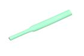 [HESH-03-G-STAN-01   3 mm Green Heat Shrink](HESH-03-G-STAN-01/) [HS3G](HESH-03-G-STAN-01/)| [HESH-03-L-STAN-01   3 mm Blue Heat Shrink](HESH-03-L-STAN-01/) [HS3L](HESH-03-L-STAN-01/)|
| :---: | :---: | :---: | :---: |
| [HESH-03-N-STAN-01   3 mm Brown Heat Shrink](HESH-03-N-STAN-01/) [HS3N](HESH-03-N-STAN-01/)|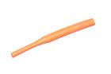 [HESH-03-O-STAN-01   3 mm Orange Heat Shrink](HESH-03-O-STAN-01/) [HS3O](HESH-03-O-STAN-01/)| [HESH-03-R-STAN-01   3 mm Red Heat Shrink](HESH-03-R-STAN-01/) [HS3R](HESH-03-R-STAN-01/)| [HESH-03-V-STAN-01   3 mm Purple Heat Shrink](HESH-03-V-STAN-01/) [HS3V](HESH-03-V-STAN-01/)|
| [HESH-03-W-STAN-01   3 mm White Heat Shrink](HESH-03-W-STAN-01/) [HS3W](HESH-03-W-STAN-01/)| [HESH-03-Y-STAN-01   3 mm Yellow Heat Shrink](HESH-03-Y-STAN-01/) [HS3Y](HESH-03-Y-STAN-01/)| [HESH-06-B-STAN-01   6 mm Black Heat Shrink](HESH-06-B-STAN-01/) [HS6B](HESH-06-B-STAN-01/)| [HESH-06-E-STAN-01   6 mm Grey Heat Shrink](HESH-06-E-STAN-01/) [HS6E](HESH-06-E-STAN-01/)|
| [HESH-06-G-STAN-01   6 mm Green Heat Shrink](HESH-06-G-STAN-01/) [HS6G](HESH-06-G-STAN-01/)| [HESH-06-L-STAN-01   6 mm Blue Heat Shrink](HESH-06-L-STAN-01/) [HS6L](HESH-06-L-STAN-01/)| [HESH-06-N-STAN-01   6 mm Brown Heat Shrink](HESH-06-N-STAN-01/) [HS6N](HESH-06-N-STAN-01/)|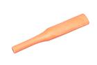 [HESH-06-O-STAN-01   6 mm Orange Heat Shrink](HESH-06-O-STAN-01/) [HS6O](HESH-06-O-STAN-01/)|
| [HESH-06-R-STAN-01   6 mm Red Heat Shrink](HESH-06-R-STAN-01/) [HS6R](HESH-06-R-STAN-01/)| [HESH-06-V-STAN-01   6 mm Purple Heat Shrink](HESH-06-V-STAN-01/) [HS6V](HESH-06-V-STAN-01/)| [HESH-06-W-STAN-01   6 mm White Heat Shrink](HESH-06-W-STAN-01/) [HS6W](HESH-06-W-STAN-01/)| [HESH-06-Y-STAN-01   6 mm Yellow Heat Shrink](HESH-06-Y-STAN-01/) [HS6Y](HESH-06-Y-STAN-01/)|
| [HESH-15D-B-STAN-01   1.5 mm Black Heat Shrink](HESH-15D-B-STAN-01/) [HS1B](HESH-15D-B-STAN-01/)| [HESH-15D-E-STAN-01   1.5 mm Grey Heat Shrink](HESH-15D-E-STAN-01/) [HS1E](HESH-15D-E-STAN-01/)| [HESH-15D-G-STAN-01   1.5 mm Green Heat Shrink](HESH-15D-G-STAN-01/) [HS1G](HESH-15D-G-STAN-01/)| [HESH-15D-L-STAN-01   1.5 mm Blue Heat Shrink](HESH-15D-L-STAN-01/) [HS1L](HESH-15D-L-STAN-01/)|
| [HESH-15D-N-STAN-01   1.5 mm Brown Heat Shrink](HESH-15D-N-STAN-01/) [HS1N](HESH-15D-N-STAN-01/)| [HESH-15D-O-STAN-01   1.5 mm Orange Heat Shrink](HESH-15D-O-STAN-01/) [HS1O](HESH-15D-O-STAN-01/)| [HESH-15D-R-STAN-01   1.5 mm Red Heat Shrink](HESH-15D-R-STAN-01/) [HS1R](HESH-15D-R-STAN-01/)| [HESH-15D-V-STAN-01   1.5 mm Purple Heat Shrink](HESH-15D-V-STAN-01/) [HS1V](HESH-15D-V-STAN-01/)|
| [HESH-15D-W-STAN-01   1.5 mm White Heat Shrink](HESH-15D-W-STAN-01/) [HS1W](HESH-15D-W-STAN-01/)| [HESH-15D-Y-STAN-01   1.5 mm Yellow Heat Shrink](HESH-15D-Y-STAN-01/) [HS1Y](HESH-15D-Y-STAN-01/)|||

## ICIC > 
  

| [ICIC-DFN10-X-K7660-01   SMD (DFN-10) 3-Axis Accelerometer (MMA7660FCR1)](ICIC-DFN10-X-K7660-01/) [ICS7660](ICIC-DFN10-X-K7660-01/)| [ICIC-DFN8-X-KCN3065-01   SMD (DFN-8) Lithium Ion Battery Charger (CN3065)](ICIC-DFN8-X-KCN3065-01/) [ICS3065](ICIC-DFN8-X-KCN3065-01/)| [ICIC-DI08-X-K555-01   8 Pin DIP 555 Timer](ICIC-DI08-X-K555-01/) [IC555](ICIC-DI08-X-K555-01/)| [ICIC-DI14-X-K1820-01   14 Pin DIP Voice Recorder (ISD1820P)](ICIC-DI14-X-K1820-01/) [IC1820P](ICIC-DI14-X-K1820-01/)|
| :---: | :---: | :---: | :---: |
| [ICIC-DI16-X-K595-01   16 Pin DIP 74HC595 8-Bit Shift Register (Latching)](ICIC-DI16-X-K595-01/) [ICSR](ICIC-DI16-X-K595-01/)| [ICIC-DI16-X-KL293D-01   16 Pin DIP Dual H-Bridge (L293D)](ICIC-DI16-X-KL293D-01/) [ICL293D](ICIC-DI16-X-KL293D-01/)| [ICIC-DI18-X-K2803-01   18 Pin DIP ULN2803A Octal Transistor Array](ICIC-DI18-X-K2803-01/) [IC2803](ICIC-DI18-X-K2803-01/)| [ICIC-DI18-X-KTM1636-01   18 Pin DIP 7 Segment Driver and Keypad Scanning (TM1636)](ICIC-DI18-X-KTM1636-01/) [IC1636](ICIC-DI18-X-KTM1636-01/)|
|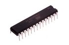 [ICIC-DI28-X-K328-01   28 Pin DIP AtMega328P](ICIC-DI28-X-K328-01/) [IC328](ICIC-DI28-X-K328-01/)| [ICIC-DI28W-X-KLPC14-01   28 Pin DIP (0.6") DIP LPC1114 (Cortex M0)](ICIC-DI28W-X-KLPC14-01/) [ICLPC14](ICIC-DI28W-X-KLPC14-01/)| [ICIC-HQFN33-X-KLPC33-01   33 Pin SMD (Heatsink QFN) LPC11U35FHI33 (Cortex M0)](ICIC-HQFN33-X-KLPC33-01/) [ICSLPC33](ICIC-HQFN33-X-KLPC33-01/)| [ICIC-LG14-X-K345-01   14 Pin SMD (LGA) Digital Accelerometer (ADXL345)](ICIC-LG14-X-K345-01/) [ICS345](ICIC-LG14-X-K345-01/)|
| [ICIC-PS20-X-KL298-A4   SMD (Power SO-20) Dual H-Bridge (L298) 4 A](ICIC-PS20-X-KL298-A4/) [ICS298](ICIC-PS20-X-KL298-A4/)| [ICIC-QFN16-X-K5883-01   16 Pin SMD (QFN) 3-Axis Digital Compass (HMC5883L)](ICIC-QFN16-X-K5883-01/) [ICS5883](ICIC-QFN16-X-K5883-01/)| [ICIC-QFN24-X-K9250-01   24 Pin SMD (QFN) 9-Axis Inertial Measurement Unit (MPU-9250)](ICIC-QFN24-X-K9250-01/) [ICS9250](ICIC-QFN24-X-K9250-01/)| [ICIC-QFN28-X-K4988-01   28 Pin SMD (QFN) Stepper Motor Driver (A4988)](ICIC-QFN28-X-K4988-01/) [IC4988](ICIC-QFN28-X-K4988-01/)|
| [ICIC-QFN32-X-K168-01   32 Pin SMD (QFN) AtMega168P](ICIC-QFN32-X-K168-01/) [ICSQ168](ICIC-QFN32-X-K168-01/)| [ICIC-QFN48-X-KRF822-01   48 Pin SMD (QFN) nRF51822 (Bluetooth MCU)](ICIC-QFN48-X-KRF822-01/) [IC822](ICIC-QFN48-X-KRF822-01/)| [ICIC-QFP100-X-KLPC17-01   100 Pin SMD (TQFP) LPC1768 (Cortex M3)](ICIC-QFP100-X-KLPC17-01/) [ICSLPC17](ICIC-QFP100-X-KLPC17-01/)| [ICIC-QFP32-X-K8-01   32 Pin SMD (TQFP) AtMega8A](ICIC-QFP32-X-K8-01/) [ICS008](ICIC-QFP32-X-K8-01/)|
| [ICIC-QFP44-X-K32U4-01   44 Pin SMD (TQFP) AtMega32U4](ICIC-QFP44-X-K32U4-01/) [ICSQ32U4](ICIC-QFP44-X-K32U4-01/)| [ICIC-QFP64-X-KLPC11-01   64 Pin SMD (TQFP) LPC11U24 (Cortex M0)](ICIC-QFP64-X-KLPC11-01/) [ICSLPC11](ICIC-QFP64-X-KLPC11-01/)| [ICIC-SC16-X-KM232-01   16 Pin SMD (SOIC) RS232 to TTL Converter (MAX232)](ICIC-SC16-X-KM232-01/) [ICSM232](ICIC-SC16-X-KM232-01/)| [ICIC-SC16W-X-K2515-01   16 Pin SMD (SOIC Wide) CAN Controller SPI (MCP2515)](ICIC-SC16W-X-K2515-01/) [ICS2515](ICIC-SC16W-X-K2515-01/)|
| [ICIC-SC75-X-K125LS-01   5 Pin SMD (SC70) Single Buffer (74LVC1G125)](ICIC-SC75-X-K125LS-01/) [ICS125LS](ICIC-SC75-X-K125LS-01/)| [ICIC-SC8-X-K2551-01   8 Pin SMD (SOIC) CAN Tranceiver (MCP2521)](ICIC-SC8-X-K2551-01/) [ICS2551](ICIC-SC8-X-K2551-01/)| [ICIC-SC8-X-KDS1307-01   SMD (SOIC-8) Real Time Clock (DS1307)](ICIC-SC8-X-KDS1307-01/) [ICS1307](ICIC-SC8-X-KDS1307-01/)| [ICIC-SC8-X-KDS1337-01   8 Pin SMD (SOIC) Real Time Clock (DS1337)](ICIC-SC8-X-KDS1337-01/) [ICS1337](ICIC-SC8-X-KDS1337-01/)|
| [ICIC-SC8-X-KM293-01   8 Pin SMD (SOIC) Dual Differential Comparator (LM293)](ICIC-SC8-X-KM293-01/) [ICSM293](ICIC-SC8-X-KM293-01/)| [ICIC-SO235-X-K1555-01   SMD (SOT-23-5) Lithium Ion Battery Charger (1 Cell) (MAX1555)](ICIC-SO235-X-K1555-01/) [ICS1555](ICIC-SO235-X-K1555-01/)| [ICIC-SP16-X-K2291-01   16 Pin SMD (SOP) PIR Motion Sensing (TM2291)](ICIC-SP16-X-K2291-01/) [ICS2291](ICIC-SP16-X-K2291-01/)| [ICIC-SP16-X-KCH340-01   16 Pin SMD (SOP) USB-Serial (CH340)](ICIC-SP16-X-KCH340-01/) [IC340](ICIC-SP16-X-KCH340-01/)|
| [ICIC-SP20-X-K1620-01    20 Pin SMD (SOP) 7 Segment 8 Digit LED Driver (TM1620) ](ICIC-SP20-X-K1620-01/) [ICS1620](ICIC-SP20-X-K1620-01/)| [ICIC-SP20-X-K1637-01   20 Pin SMD (SOP) 7 Segment 8 Digit LED Driver (TM1637)](ICIC-SP20-X-K1637-01/) [ICS1637](ICIC-SP20-X-K1637-01/)| [ICIC-SP20-X-KHT46-01    20 Pin SMD (SOP) Holtek HT46R066 ](ICIC-SP20-X-KHT46-01/) [ICSKHT46](ICIC-SP20-X-KHT46-01/)| [ICIC-SS16-X-KF230-01   16 Pin SMD (SSOP) High Speed USB-Serial (FT230XS-R)](ICIC-SS16-X-KF230-01/) [IC230](ICIC-SS16-X-KF230-01/)|
| [ICIC-SS24-X-K6612-01   24 Pin SMD (SSOP) Dual H-Bridge (TB6612)](ICIC-SS24-X-K6612-01/) [ICS6612](ICIC-SS24-X-K6612-01/)| [ICIC-SS28-X-K232-01   28 Pin SMD (SSOP) FTDI USB-Serial](ICIC-SS28-X-K232-01/) [IC232](ICIC-SS28-X-K232-01/)| [ICIC-SS28-X-KFT232-01   28 Pin SMD (SSOP) USB-Serial (FT232RL)](ICIC-SS28-X-KFT232-01/) [ICSF232](ICIC-SS28-X-KFT232-01/)| [ICIC-TQ32-X-K328-01   32 Pin SMD (TQFP) AtMega328P](ICIC-TQ32-X-K328-01/) [ICS328](ICIC-TQ32-X-K328-01/)|
| [ICIC-TS14-X-K125-01   14 Pin SMD (TSSOP) Quad Buffer (74HC125)](ICIC-TS14-X-K125-01/) [ICQB](ICIC-TS14-X-K125-01/)| [ICIC-TS20-X-K108-01   20 Pin SMD (TSSOP) 8-bit Level Shifter (TXS108E)](ICIC-TS20-X-K108-01/) [ICS108](ICIC-TS20-X-K108-01/)| [ICIC-TS20-X-K108B-01   20 Pin SMD (TSSOP) 8 bit Level Shifter (TXB0108PW)](ICIC-TS20-X-K108B-01/) [ICS108B](ICIC-TS20-X-K108B-01/)| [ICIC-TS24-X-K9221-01   24 Pin SMD (TSSOP) 12 Channel Constant Current LED Driver (MY9221)](ICIC-TS24-X-K9221-01/) [ICS9221](ICIC-TS24-X-K9221-01/)|
| [ICIC-UDF6-X-K2659-01   SMD (UDFN-6) GPS Amplifier (MAX2659)](ICIC-UDF6-X-K2659-01/) [ICSGPS](ICIC-UDF6-X-K2659-01/)| [ICIC-VQF32-X-K328-01   32 Pin SMD (VQFN) AtMega328P](ICIC-VQF32-X-K328-01/) [ICSV328](ICIC-VQF32-X-K328-01/)| [ICIC-VQF44-X-K32U4-01   44 Pin SMD (VQFN) AtMega32U4](ICIC-VQF44-X-K32U4-01/) [ICSV32U4](ICIC-VQF44-X-K32U4-01/)||

## MCUU > MCU
  

| [MCUU-QFN32-X-K16U2-01   32 Pin SMD (QFN) AtMega32U4 MCU](MCUU-QFN32-X-K16U2-01/) | [MCUU-QFP100-X-K2560-01   100 Pin SMD (TQFP) Stepper Motor Driver (A4988) MCU](MCUU-QFP100-X-K2560-01/) |||
| :---: | :---: | :---: | :---: |

## ICSO > IC Socket
  

| [ICSO-DI16-X-STAN-01   16 Pin DIP IC Socket](ICSO-DI16-X-STAN-01/) [IS16](ICSO-DI16-X-STAN-01/)| [ICSO-DI18-X-STAN-01   18 Pin DIP IC Socket](ICSO-DI18-X-STAN-01/) [IS18](ICSO-DI18-X-STAN-01/)| [ICSO-DI28-X-STAN-01   28 Pin DIP IC Socket](ICSO-DI28-X-STAN-01/) [IS28](ICSO-DI28-X-STAN-01/)||
| :---: | :---: | :---: | :---: |

## INDU > Inductor
  

| [INDU-0402-X-NH15-01   SMD (0402) 15 nH Inductor](INDU-0402-X-NH15-01/) [IN42N15](INDU-0402-X-NH15-01/)| [INDU-0402-X-NH33D-01   SMD (0402) 3.3 NH Inductor](INDU-0402-X-NH33D-01/) [IN42N33D](INDU-0402-X-NH33D-01/)| [INDU-0402-X-NH47D-01   SMD (0402) 4.7 nH Inductor](INDU-0402-X-NH47D-01/) [IN42N47D](INDU-0402-X-NH47D-01/)| [INDU-06-X-UH10-01   6 mm 10 uH Inductor](INDU-06-X-UH10-01/) [IN06U10](INDU-06-X-UH10-01/)|
| :---: | :---: | :---: | :---: |
| [INDU-0805-X-NH47D-01   SMD (0805) 4.7 nH Inductor](INDU-0805-X-NH47D-01/) [IN85U22D](INDU-0805-X-NH47D-01/)| [INDU-0806-X-UH10-01   SMD (0806) 10 uH Inductor](INDU-0806-X-UH10-01/) [IN86U10](INDU-0806-X-UH10-01/)| [INDU-39D-X-UH47D-01   3.9 mm 4.7 uH Inductor](INDU-39D-X-UH47D-01/) [IN39U47](INDU-39D-X-UH47D-01/)||

## JSTS > JST Socket
  

| [JSTS-01-X-PI02-SM   1 mm 2 Pin JST Socket (SMD)](JSTS-01-X-PI02-SM/) [J102](JSTS-01-X-PI02-SM/)| [JSTS-02-X-PI02-01   2 mm 2 Pin JST Socket](JSTS-02-X-PI02-01/) [J202](JSTS-02-X-PI02-01/)| [JSTS-02-X-PI02-RA   2 mm 2 Pin JST Socket Right Angle](JSTS-02-X-PI02-RA/) [J202R](JSTS-02-X-PI02-RA/)| [JSTS-02-X-PI02-RS   2 mm 2 Pin JST Socket Right Angle (SMD)](JSTS-02-X-PI02-RS/) [J204R](JSTS-02-X-PI02-RS/)|
| :---: | :---: | :---: | :---: |
| [JSTS-02-X-PI04-01   2 mm 4 Pin JST Socket](JSTS-02-X-PI04-01/) [J204](JSTS-02-X-PI04-01/)| [JSTS-02-X-PI04-RA   2 mm 4 Pin JST Socket Right Angle](JSTS-02-X-PI04-RA/) [J204R](JSTS-02-X-PI04-RA/)| [JSTS-02-X-PI04-RS   2 mm 4 Pin JST Socket Right Angle (SMD)](JSTS-02-X-PI04-RS/) [J204RS](JSTS-02-X-PI04-RS/)| [JSTS-02-X-PI04-SM   2 mm 4 Pin JST Socket SMD](JSTS-02-X-PI04-SM/) [J204S](JSTS-02-X-PI04-SM/)|
|||||

## JUMP > Jumper
  

| [JUMP-I01-X-STAN-01   2.54 mm Jumper](JUMP-I01-X-STAN-01/) [JU01](JUMP-I01-X-STAN-01/)||||
| :---: | :---: | :---: | :---: |

## LEDS > LED
  

|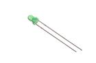 [LEDS-03-G-STAN-01   3 mm Green LED](LEDS-03-G-STAN-01/) [L3G](LEDS-03-G-STAN-01/)| [LEDS-03-R-STAN-01   3 mm Red LED](LEDS-03-R-STAN-01/) [L3R](LEDS-03-R-STAN-01/)| [LEDS-0402-L-STAN-01   SMD (0402) Blue LED](LEDS-0402-L-STAN-01/) [L42L](LEDS-0402-L-STAN-01/)| [LEDS-0402-W-STAN-01   SMD (0402) White LED](LEDS-0402-W-STAN-01/) [L42W](LEDS-0402-W-STAN-01/)|
| :---: | :---: | :---: | :---: |
| [LEDS-05-G-STAN-01   5 mm Green LED](LEDS-05-G-STAN-01/) [L5G](LEDS-05-G-STAN-01/)| [LEDS-05-G-TINT-01   5 mm Tinted Green LED](LEDS-05-G-TINT-01/) [LT5G](LEDS-05-G-TINT-01/)| [LEDS-05-I9-STAN-01   5 mm IR (940 nm) LED](LEDS-05-I9-STAN-01/) [L5I9](LEDS-05-I9-STAN-01/)| [LEDS-05-L-STAN-01   5 mm Blue LED](LEDS-05-L-STAN-01/) [L5L](LEDS-05-L-STAN-01/)|
|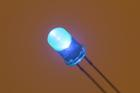 [LEDS-05-L-TINT-01   5 mm Tinted Blue LED](LEDS-05-L-TINT-01/) [LT5L](LEDS-05-L-TINT-01/)| [LEDS-05-O-STAN-01   5 mm Orange LED](LEDS-05-O-STAN-01/) [L5O](LEDS-05-O-STAN-01/)| [LEDS-05-O-TINT-01   5 mm Tinted Orange LED](LEDS-05-O-TINT-01/) [LT5O](LEDS-05-O-TINT-01/)| [LEDS-05-P-TINT-01   5 mm Tinted Pink LED](LEDS-05-P-TINT-01/) [LT5P](LEDS-05-P-TINT-01/)|
| [LEDS-05-R-STAN-01   5 mm Red LED](LEDS-05-R-STAN-01/) [L5R](LEDS-05-R-STAN-01/)| [LEDS-05-R-TINT-01   5 mm Tinted Red LED](LEDS-05-R-TINT-01/) [LT5R](LEDS-05-R-TINT-01/)| [LEDS-05-RGB-STAN-01   5 mm RGB LED](LEDS-05-RGB-STAN-01/) [L5RGB](LEDS-05-RGB-STAN-01/)| [LEDS-05-V-STAN-01   5 mm Purple LED](LEDS-05-V-STAN-01/) [L5V](LEDS-05-V-STAN-01/)|
| [LEDS-05-V-TINT-01   5 mm Tinted Purple LED](LEDS-05-V-TINT-01/) [LT5V](LEDS-05-V-TINT-01/)| [LEDS-05-W-STAN-01   5 mm White LED](LEDS-05-W-STAN-01/) [L5W](LEDS-05-W-STAN-01/)|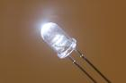 [LEDS-05-W-TINT-01   5 mm Tinted White LED](LEDS-05-W-TINT-01/) [LT5W](LEDS-05-W-TINT-01/)| [LEDS-05-Y-STAN-01   5 mm Yellow LED](LEDS-05-Y-STAN-01/) [L5Y](LEDS-05-Y-STAN-01/)|
|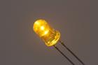 [LEDS-05-Y-TINT-01   5 mm Tinted Yellow LED](LEDS-05-Y-TINT-01/) [LT5Y](LEDS-05-Y-TINT-01/)| [LEDS-0603-G-STAN-01   SMD (0603) Green LED](LEDS-0603-G-STAN-01/) [L6G](LEDS-0603-G-STAN-01/)| [LEDS-0603-L-STAN-01   SMD (0603) Blue LED](LEDS-0603-L-STAN-01/) [L6L](LEDS-0603-L-STAN-01/)| [LEDS-0603-R-STAN-01   SMD (0603) Red LED](LEDS-0603-R-STAN-01/) [L6R](LEDS-0603-R-STAN-01/)|
| [LEDS-0603-W-STAN-01   SMD (0603) White LED](LEDS-0603-W-STAN-01/) [L6W](LEDS-0603-W-STAN-01/)| [LEDS-0603-Y-STAN-01   SMD (0603) Yellow LED](LEDS-0603-Y-STAN-01/) [L6Y](LEDS-0603-Y-STAN-01/)| [LEDS-08-RGB-FROS-WS2811   8 mm Frosted RGB LED (WS2811)](LEDS-08-RGB-FROS-WS2811/) [L8RGB21](LEDS-08-RGB-FROS-WS2811/)| [LEDS-08-RGB-STAN-CA   8 mm RGB LED Common Anode](LEDS-08-RGB-STAN-CA/) [L8RGB](LEDS-08-RGB-STAN-CA/)|
| [LEDS-0805-G-STAN-01   SMD (0805) Green LED](LEDS-0805-G-STAN-01/) [L85G](LEDS-0805-G-STAN-01/)| [LEDS-0805-L-STAN-01   SMD (0805) Blue LED](LEDS-0805-L-STAN-01/) [L85L](LEDS-0805-L-STAN-01/)| [LEDS-0805-R-STAN-01   SMD (0805) Red LED](LEDS-0805-R-STAN-01/) [L85R](LEDS-0805-R-STAN-01/)| [LEDS-0805-Y-STAN-01   SMD (0805) Yellow LED](LEDS-0805-Y-STAN-01/) [L85Y](LEDS-0805-Y-STAN-01/)|
| [LEDS-10-G-FROS-01   10 mm Frosted Green LED](LEDS-10-G-FROS-01/) [L10G](LEDS-10-G-FROS-01/)|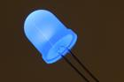 [LEDS-10-L-FROS-01   10 mm Frosted Blue LED](LEDS-10-L-FROS-01/) [L10L](LEDS-10-L-FROS-01/)| [LEDS-10-O-FROS-01   10 mm Frosted Orange LED](LEDS-10-O-FROS-01/) [L10O](LEDS-10-O-FROS-01/)| [LEDS-10-P-FROS-01   10 mm Frosted Pink LED](LEDS-10-P-FROS-01/) [L10P](LEDS-10-P-FROS-01/)|
| [LEDS-10-R-FROS-01   10 mm Frosted Red LED](LEDS-10-R-FROS-01/) [L10R](LEDS-10-R-FROS-01/)| [LEDS-10-V-FROS-01   10 mm Frosted Purple LED](LEDS-10-V-FROS-01/) [L10V](LEDS-10-V-FROS-01/)| [LEDS-10-W-FROS-01   10 mm Frosted White LED](LEDS-10-W-FROS-01/) [L10W](LEDS-10-W-FROS-01/)| [LEDS-10-Y-FROS-01   10 mm Frosted Yellow LED](LEDS-10-Y-FROS-01/) [L10Y](LEDS-10-Y-FROS-01/)|
| [LEDS-1515-RGB-K2812-01   SMD (1515) Smart Controller (WS2812B) RGB LED](LEDS-1515-RGB-K2812-01/) [L152812](LEDS-1515-RGB-K2812-01/)| [LEDS-2020-RGB-K102-01   SMD (2020) Smart Controller (APA102) RGB LED](LEDS-2020-RGB-K102-01/) [L20102](LEDS-2020-RGB-K102-01/)| [LEDS-2121-RGB-STAN-CA   SMD (2121) RGB LED Common Anode](LEDS-2121-RGB-STAN-CA/) [LRGB2121CA](LEDS-2121-RGB-STAN-CA/)| [LEDS-3535-RGB-K2812-01   SMD (3535) Smart Controller (WS2812B) RGB LED](LEDS-3535-RGB-K2812-01/) [L352812](LEDS-3535-RGB-K2812-01/)|
| [LEDS-5050-RGB-K2812-01   SMD (5050) Smart Controller (WS2812B) RGB LED](LEDS-5050-RGB-K2812-01/) [L502](LEDS-5050-RGB-K2812-01/)| [LEDS-XHP70-W-CREE-01   XHP 70 Cree White LED](LEDS-XHP70-W-CREE-01/) |||

## MICR > Microphone
  

| [MICR-97D-X-STAN-01   9.7 mm Microphone](MICR-97D-X-STAN-01/) [MI97D](MICR-97D-X-STAN-01/)||||
| :---: | :---: | :---: | :---: |

## MOSN > N-Ch. MOSFET
  

| [MOSN-SO23-X-A03D-01   SMD (SOT-23) 300 mA N-Ch. MOSFET](MOSN-SO23-X-A03D-01/) [MNS23D](MOSN-SO23-X-A03D-01/)| [MOSN-SO23-X-A21D-01   SMD (SOT-23) 2.1 Amp N-Ch. MOSFET](MOSN-SO23-X-A21D-01/) [MNS221D](MOSN-SO23-X-A21D-01/)| [MOSN-SO23-X-KBSS138-01   SMD (SOT-23) BSS138 N-Ch. MOSFET](MOSN-SO23-X-KBSS138-01/) [MN23BSS138](MOSN-SO23-X-KBSS138-01/)| [MOSN-SO323-X-A02D-01   SMD (SOT-323) 200 mA N-Ch. MOSFET](MOSN-SO323-X-A02D-01/) [MNS22D](MOSN-SO323-X-A02D-01/)|
| :---: | :---: | :---: | :---: |
| [MOSN-SO363-X-KBSS138-01   SMD (SOT-363) BSS138 N-Ch. MOSFET](MOSN-SO363-X-KBSS138-01/) [MN363BSS138](MOSN-SO363-X-KBSS138-01/)| [MOSN-T220-X-A23-01   TO-220 23 Amp N-Ch. MOSFET](MOSN-T220-X-A23-01/) [MN220A23](MOSN-T220-X-A23-01/)| [MOSN-T252-X-A50-01   TO-252 MNAOD4184A N-Ch. MOSFET](MOSN-T252-X-A50-01/) [MNAOD4184A](MOSN-T252-X-A50-01/)||

## MOSP > P-Ch. MOSFET
  

| [MOSP-SO23-X-A02-01   SMD (SOT-23) 2 Amp P-Ch. MOSFET](MOSP-SO23-X-A02-01/) [MPSS202](MOSP-SO23-X-A02-01/)| [MOSP-SO23-X-A35D-01   SMD (SOT-23) 3.5 Amp P-Ch. MOSFET](MOSP-SO23-X-A35D-01/) [MPS235D](MOSP-SO23-X-A35D-01/)| [MOSP-SO23-X-A41D-01   SMD (SOT-23) 4.1 Amp P-Ch. MOSFET](MOSP-SO23-X-A41D-01/) [MPS241D](MOSP-SO23-X-A41D-01/)| [MOSP-SO23-X-A43D-01   SMD (SOT-23) 4.3 Amp P-Ch. MOSFET](MOSP-SO23-X-A43D-01/) [MPS2343D](MOSP-SO23-X-A43D-01/)|
| :---: | :---: | :---: | :---: |
| [MOSP-SO23F-X-A06-01   SMD (SOT-23F) 6 Amp P-Ch. MOSFET](MOSP-SO23F-X-A06-01/) [MP2F6](MOSP-SO23F-X-A06-01/)| [MOSP-T220-X-A19-01   TO-220 19 Amp P-Ch. MOSFET](MOSP-T220-X-A19-01/) [MP220A19](MOSP-T220-X-A19-01/)|||

## MOTO > Motor
  

| [MOTO-24-X-STAN-01   24 mm Motor](MOTO-24-X-STAN-01/) [MT24](MOTO-24-X-STAN-01/)| [MOTO-SZ130-X-STAN-01   130 Size Motor](MOTO-SZ130-X-STAN-01/) [MSZ130](MOTO-SZ130-X-STAN-01/)|||
| :---: | :---: | :---: | :---: |

## MOTV > Motor (Vibrating)
  

| [MOTV-10-X-FLAT-01   10 mm Flat Motor (Vibrating)](MOTV-10-X-FLAT-01/) [MVF10](MOTV-10-X-FLAT-01/)||||
| :---: | :---: | :---: | :---: |

## NHFF > Nylon Standoff (F-F)
  

| [NHFF-M3-X-06-01   M3 x 6 mm Nylon Standoff (F-F)](NHFF-M3-X-06-01/) [NFF06](NHFF-M3-X-06-01/)|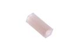 [NHFF-M3-X-12-01   M3 x 12 mm Nylon Standoff (F-F)](NHFF-M3-X-12-01/) [NFF12](NHFF-M3-X-12-01/)| [NHFF-M3-X-15-01   M3 x 15 mm Nylon Standoff (F-F)](NHFF-M3-X-15-01/) [NFF15](NHFF-M3-X-15-01/)| [NHFF-M3-X-20-01   M3 x 20 mm Nylon Standoff (F-F)](NHFF-M3-X-20-01/) [NFF20](NHFF-M3-X-20-01/)|
| :---: | :---: | :---: | :---: |
| [NHFF-M3-X-25-01   M3 x 25 mm Nylon Standoff (F-F)](NHFF-M3-X-25-01/) [NFF25](NHFF-M3-X-25-01/)| [NHFF-M3-X-30-01   M3 x 30 mm Nylon Standoff (F-F)](NHFF-M3-X-30-01/) [NFF30](NHFF-M3-X-30-01/)|||

## NNUT > Nylon Nut
  

| [NNUT-M3-X-STAN-01   M3 Nylon Nut](NNUT-M3-X-STAN-01/) [NN3](NNUT-M3-X-STAN-01/)||||
| :---: | :---: | :---: | :---: |

## NSCR > Nylon Screw
  

| [NSCR-M3-X-12-70   M3 x 12 mm Nylon Screw Cross Head](NSCR-M3-X-12-70/) [NS12](NSCR-M3-X-12-70/)| [NSCR-M3-X-16-70   M3 x 16 mm Nylon Screw Cross Head](NSCR-M3-X-16-70/) [NS16](NSCR-M3-X-16-70/)| [NSCR-M3-X-20-70   M3 x 20 mm Nylon Screw Cross Head](NSCR-M3-X-20-70/) [NS20](NSCR-M3-X-20-70/)| [NSCR-M3-X-25-70   M3 x 25 mm Nylon Screw Cross Head](NSCR-M3-X-25-70/) [NN25](NSCR-M3-X-25-70/)|
| :---: | :---: | :---: | :---: |
|||||

## NUTT > Nut
  

| [NUTT-M3-M-STAN-01   M3 Nut](NUTT-M3-M-STAN-01/) [NU3](NUTT-M3-M-STAN-01/)||||
| :---: | :---: | :---: | :---: |

## OPAM > Op Amp
  

| [OPAM-MS08-X-KLMV358-01   8 Pin SMD (MSOP) LMV358 Op Amp](OPAM-MS08-X-KLMV358-01/) [OAM358](OPAM-MS08-X-KLMV358-01/)| [OPAM-SC14-X-KLMV324-01   SMD (SOIC-14) LMV324 Op Amp](OPAM-SC14-X-KLMV324-01/) [OAS324](OPAM-SC14-X-KLMV324-01/)| [OPAM-SC8-X-K2904-01   8 Pin SMD (SOIC) LM2904 Dual Op Amp](OPAM-SC8-X-K2904-01/) [OAS2904](OPAM-SC8-X-K2904-01/)| [OPAM-SC8-X-KLM358-01   SMD (SOIC-8) LM358 Op Amp](OPAM-SC8-X-KLM358-01/) [OAS358](OPAM-SC8-X-KLM358-01/)|
| :---: | :---: | :---: | :---: |
| [OPAM-SO235-X-K333-01   SMD (SOT-23-5) OPA333 Op Amp](OPAM-SO235-X-K333-01/) [OA333](OPAM-SO235-X-K333-01/)||||

## PHTR > Phototransistor
  

| [PHTR-05-I9-STAN-01   5 mm IR (940 nm) Phototransistor](PHTR-05-I9-STAN-01/) [PT5I9](PHTR-05-I9-STAN-01/)| [PHTR-05-X-K5053-01   5 mm SGPT5053C Phototransistor](PHTR-05-X-K5053-01/) [PT55053](PHTR-05-X-K5053-01/)|||
| :---: | :---: | :---: | :---: |

## POTE > Potentiometer
  

| [POTE-07-X-O102-01   7 mm 1k Ohm Potentiometer](POTE-07-X-O102-01/) [PT7102](POTE-07-X-O102-01/)| [POTE-07-X-O103-01   7 mm 10k Ohm Potentiometer](POTE-07-X-O103-01/) [PT7103](POTE-07-X-O103-01/)| [POTE-14-X-O204-68   14 mm 200k Ohm Potentiometer Side Adjust](POTE-14-X-O204-68/) [PT4204S](POTE-14-X-O204-68/)| [POTE-17-X-O102-69   17 mm 1k Ohm Potentiometer Panel Mount](POTE-17-X-O102-69/) [PT7102](POTE-17-X-O102-69/)|
| :---: | :---: | :---: | :---: |
| [POTE-17-X-O103-69   17 mm 10k Ohm Potentiometer Panel Mount](POTE-17-X-O103-69/) [PT7103](POTE-17-X-O103-69/)| [POTE-17-X-O104-69   17 mm 100k Ohm Potentiometer Panel Mount](POTE-17-X-O104-69/) [PT7104](POTE-17-X-O104-69/)| [POTE-17-X-O105-69   17 mm 1M Ohm Potentiometer Panel Mount](POTE-17-X-O105-69/) [PT7105](POTE-17-X-O105-69/)| [POTE-95D-L-O103-01   9.5 mm 10k Ohm Blue Potentiometer](POTE-95D-L-O103-01/) [PTA103](POTE-95D-L-O103-01/)|
| [POTE-95D-X-O103-01   9.5 mm 10k Ohm Potentiometer](POTE-95D-X-O103-01/) [PT95103](POTE-95D-X-O103-01/)| [POTE-98D-X-O103-01   9.8 mm 10k Ohm Potentiometer](POTE-98D-X-O103-01/) [PT98103](POTE-98D-X-O103-01/)|||

## PIEZ > Piezo Element
  

| [PIEZ-14-B-STAN-01   14 mm Black Piezo Element](PIEZ-14-B-STAN-01/) [PZ14](PIEZ-14-B-STAN-01/)||||
| :---: | :---: | :---: | :---: |

## POAD > Power Adapter
  

| [POAD-ACUS-X-V05U-A1   American Style (120v) 5v (USB) Power Adapter 1 A](POAD-ACUS-X-V05U-A1/) [PAU5](POAD-ACUS-X-V05U-A1/)||||
| :---: | :---: | :---: | :---: |

## PRIV > Plastic Rivet
  

| [PRIV-M2-X-05-01   M2 x 5 mm Plastic Rivet](PRIV-M2-X-05-01/) [PR25](PRIV-M2-X-05-01/)| [PRIV-M3-X-06-01   M3 x 6 mm Plastic Rivet](PRIV-M3-X-06-01/) [PR36](PRIV-M3-X-06-01/)|||
| :---: | :---: | :---: | :---: |

## RBCC > Crimped Ribbon Cable
  

| [RBCC-40W-Z-L100-01   40 Wire 100 mm Rainbow Crimped Ribbon Cable](RBCC-40W-Z-L100-01/) [RBC1](RBCC-40W-Z-L100-01/)| [RBCC-40W-Z-L200-01   40 Wire 200 mm Rainbow Crimped Ribbon Cable](RBCC-40W-Z-L200-01/) [RBC2](RBCC-40W-Z-L200-01/)| [RBCC-40W-Z-L300-01   40 Wire 300 mm Rainbow Crimped Ribbon Cable](RBCC-40W-Z-L300-01/) [RBC3](RBCC-40W-Z-L300-01/)||
| :---: | :---: | :---: | :---: |

## REFU > Resetable Fuse
  

| [REFU-1206-X-A01-V8   SMD (1206) 1 Amp Resetable Fuse 8v](REFU-1206-X-A01-V8/) [RF121](REFU-1206-X-A01-V8/)| [REFU-1206-X-A05D-01   SMD (1206) 500 mA Resetable Fuse](REFU-1206-X-A05D-01/) [RF1205](REFU-1206-X-A05D-01/)| [REFU-1206-X-A05D-V8   SMD (1206) 500 mA Resetable Fuse 8v](REFU-1206-X-A05D-V8/) [RF15](REFU-1206-X-A05D-V8/)| [REFU-1206-X-A075D-V132D   SMD (1206) 750 mA Resetable Fuse 13.2v](REFU-1206-X-A075D-V132D/) [RF1175D](REFU-1206-X-A075D-V132D/)|
| :---: | :---: | :---: | :---: |
| [REFU-1206-X-A075D-V16   SMD (1206) 750 mA Resetable Fuse 16v](REFU-1206-X-A075D-V16/) [RF1275D](REFU-1206-X-A075D-V16/)| [REFU-1206-X-A075D-VF   SMD (1206) 750 mA Resetable Fuse 16v](REFU-1206-X-A075D-VF/) [RF1275D](REFU-1206-X-A075D-VF/)| [REFU-1210-X-A075D-V6   SMD (1210) 750 mA Resetable Fuse 6v](REFU-1210-X-A075D-V6/) [RF1175D](REFU-1210-X-A075D-V6/)| [REFU-1812-X-A05D-V15   SMD (1812) 500 mA Resetable Fuse 15v](REFU-1812-X-A05D-V15/) [RF805](REFU-1812-X-A05D-V15/)|
|||||

## RELA > Relay
  

| [RELA-19X15-X-SPDT-V3   19 x 15 mm SPDT Relay 3v](RELA-19X15-X-SPDT-V3/) [RL19S3](RELA-19X15-X-SPDT-V3/)| [RELA-19X15-X-SPDT-V5   19 x 15 mm SPDT Relay](RELA-19X15-X-SPDT-V5/) [RL19S](RELA-19X15-X-SPDT-V5/)| [RELA-19X15-X-SPDT-VJ   19 x 15 mm SPDT Relay 3v](RELA-19X15-X-SPDT-VJ/) [RL19S3](RELA-19X15-X-SPDT-VJ/)||
| :---: | :---: | :---: | :---: |

## RESA > Resistor Array
  

| [RESA-1268-X-O102X4-01   SMD (1206-8) 1k Ohm (x4) Resistor Array](RESA-1268-X-O102X4-01/) [RA1102](RESA-1268-X-O102X4-01/)| [RESA-1268-X-O103X4-01   SMD (1206-8) 10k Ohm (x4) Resistor Array](RESA-1268-X-O103X4-01/) [RA1103](RESA-1268-X-O103X4-01/)| [RESA-1268-X-O220X4-01   SMD (1206-8) 22 Ohm (x4) Resistor Array](RESA-1268-X-O220X4-01/) [RA1220](RESA-1268-X-O220X4-01/)|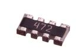 [RESA-1268-X-O472X4-01   SMD (1206-8) 4.7k Ohm (x4) Resistor Array](RESA-1268-X-O472X4-01/) [RA1472](RESA-1268-X-O472X4-01/)|
| :---: | :---: | :---: | :---: |
|||||

## RESE > Resistor
  

| [RESE-0402-X-O000-01   SMD (0402) 0 Ohm Resistor](RESE-0402-X-O000-01/) [R42000](RESE-0402-X-O000-01/)| [RESE-0402-X-O000-67   SMD (0402) 0 Ohm Resistor 1%](RESE-0402-X-O000-67/) [R42000A](RESE-0402-X-O000-67/)| [RESE-0402-X-O100-01   SMD (0402) 10 Ohm Resistor](RESE-0402-X-O100-01/) [R42100](RESE-0402-X-O100-01/)| [RESE-0402-X-O100-67   SMD (0402) 10 Ohm Resistor 1%](RESE-0402-X-O100-67/) [R42100A](RESE-0402-X-O100-67/)|
| :---: | :---: | :---: | :---: |
| [RESE-0402-X-O101-01   SMD (0402) 100 Ohm Resistor](RESE-0402-X-O101-01/) [R42101](RESE-0402-X-O101-01/)| [RESE-0402-X-O102-01   SMD (0402) 1k Ohm Resistor](RESE-0402-X-O102-01/) [R42102](RESE-0402-X-O102-01/)| [RESE-0402-X-O1022-67   SMD (0402) 10.2k Ohm Resistor 1%](RESE-0402-X-O1022-67/) [R421022A](RESE-0402-X-O1022-67/)| [RESE-0402-X-O103-01   SMD (0402) 10k Ohm Resistor](RESE-0402-X-O103-01/) [R42103](RESE-0402-X-O103-01/)|
| [RESE-0402-X-O103-67   SMD (0402) 10k Ohm Resistor 1%](RESE-0402-X-O103-67/) [R42103A](RESE-0402-X-O103-67/)| [RESE-0402-X-O104-01   SMD (0402) 110k Ohm Resistor](RESE-0402-X-O104-01/) [R42104](RESE-0402-X-O104-01/)| [RESE-0402-X-O104-67   SMD (0402) 100k Ohm Resistor 1%](RESE-0402-X-O104-67/) [R42104A](RESE-0402-X-O104-67/)| [RESE-0402-X-O105-01   SMD (0402) 1M Ohm Resistor](RESE-0402-X-O105-01/) [R42105](RESE-0402-X-O105-01/)|
| [RESE-0402-X-O105-67   SMD (0402) 1M Ohm Resistor 1%](RESE-0402-X-O105-67/) [R42105A](RESE-0402-X-O105-67/)| [RESE-0402-X-O106-67   SMD (0402) 10M Ohm Resistor 1%](RESE-0402-X-O106-67/) [R42106A](RESE-0402-X-O106-67/)| [RESE-0402-X-O114-67   SMD (0402) 120k Ohm Resistor 1%](RESE-0402-X-O114-67/) [R42114A](RESE-0402-X-O114-67/)| [RESE-0402-X-O121-01   SMD (0402) 120 Ohm Resistor](RESE-0402-X-O121-01/) [R42121](RESE-0402-X-O121-01/)|
| [RESE-0402-X-O121-67   SMD (0402) 120 Ohm Resistor 1%](RESE-0402-X-O121-67/) [R42121A](RESE-0402-X-O121-67/)| [RESE-0402-X-O123-01   SMD (0402) 12k Ohm Resistor](RESE-0402-X-O123-01/) [R42123](RESE-0402-X-O123-01/)| [RESE-0402-X-O123-67   SMD (0402) 12k Ohm Resistor 1%](RESE-0402-X-O123-67/) [R42123A](RESE-0402-X-O123-67/)| [RESE-0402-X-O124-01   SMD (0402) 120k Ohm Resistor](RESE-0402-X-O124-01/) [R42124](RESE-0402-X-O124-01/)|
| [RESE-0402-X-O124-67   SMD (0402) 120k Ohm Resistor 1%](RESE-0402-X-O124-67/) [R42124A](RESE-0402-X-O124-67/)| [RESE-0402-X-O134-01   SMD (0402) 130k Ohm Resistor](RESE-0402-X-O134-01/) [R42134](RESE-0402-X-O134-01/)| [RESE-0402-X-O134-67   SMD (0402) 130k Ohm Resistor 1%](RESE-0402-X-O134-67/) [R42134A](RESE-0402-X-O134-67/)| [RESE-0402-X-O151-67   SMD (0402) 150 Ohm Resistor 1%](RESE-0402-X-O151-67/) [R42151A](RESE-0402-X-O151-67/)|
| [RESE-0402-X-O152-01   SMD (0402) 1.5k Ohm Resistor](RESE-0402-X-O152-01/) [R4152](RESE-0402-X-O152-01/)| [RESE-0402-X-O152-67   SMD (0402) 1.5k Ohm Resistor 1%](RESE-0402-X-O152-67/) [R42152A](RESE-0402-X-O152-67/)| [RESE-0402-X-O153-01   SMD (0402) 15k Ohm Resistor](RESE-0402-X-O153-01/) [R42153](RESE-0402-X-O153-01/)| [RESE-0402-X-O153-67   SMD (0402) 15k Ohm Resistor 1%](RESE-0402-X-O153-67/) [R42153A](RESE-0402-X-O153-67/)|
| [RESE-0402-X-O15X-01   SMD (0402) 1.5 Ohm Resistor](RESE-0402-X-O15X-01/) [R4215X](RESE-0402-X-O15X-01/)| [RESE-0402-X-O181-01   SMD (0402) 180 Ohm Resistor](RESE-0402-X-O181-01/) [R42181](RESE-0402-X-O181-01/)| [RESE-0402-X-O181-67   SMD (0402) 180 Ohm Resistor 1%](RESE-0402-X-O181-67/) [R42181A](RESE-0402-X-O181-67/)| [RESE-0402-X-O182-67   SMD (0402) 1.8k Ohm Resistor 1%](RESE-0402-X-O182-67/) [R42182A](RESE-0402-X-O182-67/)|
| [RESE-0402-X-O203-01   SMD (0402) 20k Ohm Resistor](RESE-0402-X-O203-01/) [R42203](RESE-0402-X-O203-01/)| [RESE-0402-X-O203-67   SMD (0402) 20k Ohm Resistor 1%](RESE-0402-X-O203-67/) [R42203A](RESE-0402-X-O203-67/)| [RESE-0402-X-O204-01   SMD (0402) 200k Ohm Resistor](RESE-0402-X-O204-01/) [R42204](RESE-0402-X-O204-01/)| [RESE-0402-X-O220-67   SMD (0402) 22 Ohm Resistor 1%](RESE-0402-X-O220-67/) [R42220A](RESE-0402-X-O220-67/)|
| [RESE-0402-X-O221-67   SMD (0402) 220 Ohm Resistor 1%](RESE-0402-X-O221-67/) [R42221A](RESE-0402-X-O221-67/)| [RESE-0402-X-O222-01   SMD (0402) 2.2k Ohm Resistor](RESE-0402-X-O222-01/) [R42222](RESE-0402-X-O222-01/)| [RESE-0402-X-O222-67   SMD (0402) 2.2k Ohm Resistor 1%](RESE-0402-X-O222-67/) [R42222A](RESE-0402-X-O222-67/)| [RESE-0402-X-O224-01   SMD (0402) 220k Ohm Resistor](RESE-0402-X-O224-01/) [R42224](RESE-0402-X-O224-01/)|
| [RESE-0402-X-O249D2-67   SMD (0402) 2.49 Ohm Resistor 1%](RESE-0402-X-O249D2-67/) [R42249D2A](RESE-0402-X-O249D2-67/)| [RESE-0402-X-O271-67   SMD (0402) 270 Ohm Resistor 1%](RESE-0402-X-O271-67/) [R42](RESE-0402-X-O271-67/)| [RESE-0402-X-O272-01   SMD (0402) 2.7k Ohm Resistor](RESE-0402-X-O272-01/) [R42272](RESE-0402-X-O272-01/)| [RESE-0402-X-O272-67   SMD (0402) 2.7k Ohm Resistor 1%](RESE-0402-X-O272-67/) [R42272A](RESE-0402-X-O272-67/)|
| [RESE-0402-X-O303-01   SMD (0402) 30k Ohm Resistor](RESE-0402-X-O303-01/) [R42303](RESE-0402-X-O303-01/)| [RESE-0402-X-O331-67   SMD (0402) 330 Ohm Resistor 1%](RESE-0402-X-O331-67/) [R42331A](RESE-0402-X-O331-67/)| [RESE-0402-X-O332-01   SMD (0402) 3.3k Ohm Resistor](RESE-0402-X-O332-01/) [R42332](RESE-0402-X-O332-01/)| [RESE-0402-X-O332-67   SMD (0402) 3.3k Ohm Resistor 1%](RESE-0402-X-O332-67/) [R42332A](RESE-0402-X-O332-67/)|
| [RESE-0402-X-O471-01   SMD (0402) 470 Ohm Resistor](RESE-0402-X-O471-01/) [R42471](RESE-0402-X-O471-01/)| [RESE-0402-X-O471-67   SMD (0402) 470 Ohm Resistor 1%](RESE-0402-X-O471-67/) [R42471A](RESE-0402-X-O471-67/)| [RESE-0402-X-O472-01   SMD (0402) 4.7k Ohm Resistor](RESE-0402-X-O472-01/) [R42472](RESE-0402-X-O472-01/)| [RESE-0402-X-O473-01   SMD (0402) 47k Ohm Resistor](RESE-0402-X-O473-01/) [R42473](RESE-0402-X-O473-01/)|
| [RESE-0402-X-O474-67   SMD (0402) 470k Ohm Resistor 1%](RESE-0402-X-O474-67/) [R42474A](RESE-0402-X-O474-67/)| [RESE-0402-X-O499D-67   SMD (0402) 49.9 Ohm Resistor 1%](RESE-0402-X-O499D-67/) [R42499A](RESE-0402-X-O499D-67/)| [RESE-0402-X-O512-01   SMD (0402) 5.1k Ohm Resistor](RESE-0402-X-O512-01/) [R42512](RESE-0402-X-O512-01/)| [RESE-0402-X-O512-67   SMD (0402) 5.1k Ohm Resistor 1%](RESE-0402-X-O512-67/) [R42512A](RESE-0402-X-O512-67/)|
| [RESE-0402-X-O514-01   SMD (0402) 510k Ohm Resistor](RESE-0402-X-O514-01/) [R42514](RESE-0402-X-O514-01/)| [RESE-0402-X-O514-67   SMD (0402) 510k Ohm Resistor 1%](RESE-0402-X-O514-67/) [R42514A](RESE-0402-X-O514-67/)| [RESE-0402-X-O823-67   SMD (0402) 82k Ohm Resistor 1%](RESE-0402-X-O823-67/) [R42823A](RESE-0402-X-O823-67/)| [RESE-0402-X-O914-01   SMD (0402) 910k Ohm Resistor](RESE-0402-X-O914-01/) [R42914](RESE-0402-X-O914-01/)|
| [RESE-0603-X-O000-01   SMD (0603) 0 Ohm Resistor](RESE-0603-X-O000-01/) [R6000](RESE-0603-X-O000-01/)| [RESE-0603-X-O000-67   SMD (0603) 0 Ohm Resistor 1%](RESE-0603-X-O000-67/) [R6000A](RESE-0603-X-O000-67/)| [RESE-0603-X-O036D-01   SMD (0603) 3.6 Ohm Resistor](RESE-0603-X-O036D-01/) [R6036D](RESE-0603-X-O036D-01/)| [RESE-0603-X-O100-01   SMD (0603) 10 Ohm Resistor](RESE-0603-X-O100-01/) [R6100](RESE-0603-X-O100-01/)|
| [RESE-0603-X-O100-67   SMD (0603) 10 Ohm Resistor 1%](RESE-0603-X-O100-67/) [R6100A](RESE-0603-X-O100-67/)| [RESE-0603-X-O101-01   SMD (0603) 100 Ohm Resistor](RESE-0603-X-O101-01/) [R6101](RESE-0603-X-O101-01/)| [RESE-0603-X-O102-01   SMD (0603) 1k Ohm Resistor](RESE-0603-X-O102-01/) [R6102](RESE-0603-X-O102-01/)| [RESE-0603-X-O102-67   SMD (0603) 1k Ohm Resistor 1%](RESE-0603-X-O102-67/) [R6102A](RESE-0603-X-O102-67/)|
| [RESE-0603-X-O103-01   SMD (0603) 10k Ohm Resistor](RESE-0603-X-O103-01/) [R6103](RESE-0603-X-O103-01/)|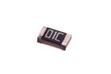 [RESE-0603-X-O103-67   SMD (0603) 10k Ohm Resistor 1%](RESE-0603-X-O103-67/) [R6103A](RESE-0603-X-O103-67/)| [RESE-0603-X-O104-01   SMD (0603) 100k Ohm Resistor](RESE-0603-X-O104-01/) [R6104](RESE-0603-X-O104-01/)| [RESE-0603-X-O104-67   SMD (0603) 100k Ohm Resistor 1%](RESE-0603-X-O104-67/) [R6104A](RESE-0603-X-O104-67/)|
| [RESE-0603-X-O105-01   SMD (0603) 1M Ohm Resistor](RESE-0603-X-O105-01/) [R6105](RESE-0603-X-O105-01/)| [RESE-0603-X-O105-67   SMD (0603) 1M Ohm Resistor 1%](RESE-0603-X-O105-67/) [R6105A](RESE-0603-X-O105-67/)| [RESE-0603-X-O106-01   SMD (0603) 10M Ohm Resistor](RESE-0603-X-O106-01/) [R6106](RESE-0603-X-O106-01/)| [RESE-0603-X-O106-67   SMD (0603) 10M Ohm Resistor 1%](RESE-0603-X-O106-67/) [R6106A](RESE-0603-X-O106-67/)|
| [RESE-0603-X-O10X-67   SMD (0603) 1 Ohm Resistor 1%](RESE-0603-X-O10X-67/) [R610XA](RESE-0603-X-O10X-67/)| [RESE-0603-X-O112-01   SMD (0603) 1.1k Ohm Resistor](RESE-0603-X-O112-01/) [R6112](RESE-0603-X-O112-01/)| [RESE-0603-X-O113-67   SMD (0603) 11k Ohm Resistor 1%](RESE-0603-X-O113-67/) [R6113A](RESE-0603-X-O113-67/)| [RESE-0603-X-O121-01   SMD (0603) 120 Ohm Resistor](RESE-0603-X-O121-01/) [R6121](RESE-0603-X-O121-01/)|
| [RESE-0603-X-O122-01   SMD (0603) 1.2k Ohm Resistor](RESE-0603-X-O122-01/) [R6122](RESE-0603-X-O122-01/)| [RESE-0603-X-O122-67   SMD (0603) 1.2k Ohm Resistor 1%](RESE-0603-X-O122-67/) [R6122A](RESE-0603-X-O122-67/)| [RESE-0603-X-O123-01   SMD (0603) 12k Ohm Resistor](RESE-0603-X-O123-01/) [R6123](RESE-0603-X-O123-01/)| [RESE-0603-X-O123-67   SMD (0603) 12k Ohm Resistor 1%](RESE-0603-X-O123-67/) [R6123A](RESE-0603-X-O123-67/)|
| [RESE-0603-X-O124-67   SMD (0603) 120k Ohm Resistor 1%](RESE-0603-X-O124-67/) [R6124A](RESE-0603-X-O124-67/)| [RESE-0603-X-O133-67   SMD (0603) 13k Ohm Resistor 1%](RESE-0603-X-O133-67/) [R6133A](RESE-0603-X-O133-67/)| [RESE-0603-X-O150-01   SMD (0603) 15 Ohm Resistor](RESE-0603-X-O150-01/) [R6150](RESE-0603-X-O150-01/)| [RESE-0603-X-O150-67   SMD (0603) 15 Ohm Resistor 1%](RESE-0603-X-O150-67/) [R6150A](RESE-0603-X-O150-67/)|
| [RESE-0603-X-O151-67   SMD (0603) 150 Ohm Resistor 1%](RESE-0603-X-O151-67/) [R6151A](RESE-0603-X-O151-67/)| [RESE-0603-X-O152-01   SMD (0603) 1.5k Ohm Resistor](RESE-0603-X-O152-01/) [R6152](RESE-0603-X-O152-01/)| [RESE-0603-X-O152-67   SMD (0603) 1.5k Ohm Resistor 1%](RESE-0603-X-O152-67/) [R6152A](RESE-0603-X-O152-67/)| [RESE-0603-X-O153-01   SMD (0603) 16k Ohm Resistor](RESE-0603-X-O153-01/) [R6153](RESE-0603-X-O153-01/)|
| [RESE-0603-X-O153-67   SMD (0603) 15k Ohm Resistor 1%](RESE-0603-X-O153-67/) [R6153A](RESE-0603-X-O153-67/)| [RESE-0603-X-O154-01   SMD (0603) 150k Ohm Resistor](RESE-0603-X-O154-01/) [R6154](RESE-0603-X-O154-01/)| [RESE-0603-X-O154-67   SMD (0603) 150k Ohm Resistor 1%](RESE-0603-X-O154-67/) [R6154A](RESE-0603-X-O154-67/)| [RESE-0603-X-O163-67   SMD (0603) 16k Ohm Resistor 1%](RESE-0603-X-O163-67/) [R6163A](RESE-0603-X-O163-67/)|
|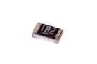 [RESE-0603-X-O182-67   SMD (0603) 1.8k Ohm Resistor 1%](RESE-0603-X-O182-67/) [R6182A](RESE-0603-X-O182-67/)| [RESE-0603-X-O183-01   SMD (0603) 18k Ohm Resistor](RESE-0603-X-O183-01/) [R6183](RESE-0603-X-O183-01/)| [RESE-0603-X-O183-67   SMD (0603) 18k Ohm Resistor 1%](RESE-0603-X-O183-67/) [R6183A](RESE-0603-X-O183-67/)| [RESE-0603-X-O200-01   SMD (0603) 20 Ohm Resistor](RESE-0603-X-O200-01/) [R6200](RESE-0603-X-O200-01/)|
| [RESE-0603-X-O201-01   SMD (0603) 200 Ohm Resistor](RESE-0603-X-O201-01/) [R6201](RESE-0603-X-O201-01/)| [RESE-0603-X-O201-67   SMD (0603) 200 Ohm Resistor 1%](RESE-0603-X-O201-67/) [R6201A](RESE-0603-X-O201-67/)| [RESE-0603-X-O202-01   SMD (0603) 2k Ohm Resistor](RESE-0603-X-O202-01/) [R6202](RESE-0603-X-O202-01/)| [RESE-0603-X-O202-67   SMD (0603) 2k Ohm Resistor 1%](RESE-0603-X-O202-67/) [R6202A](RESE-0603-X-O202-67/)|
|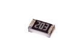 [RESE-0603-X-O203-01   SMD (0603) 20k Ohm Resistor](RESE-0603-X-O203-01/) [R6203](RESE-0603-X-O203-01/)| [RESE-0603-X-O203-67   SMD (0603) 20k Ohm Resistor 1%](RESE-0603-X-O203-67/) [R6203A](RESE-0603-X-O203-67/)| [RESE-0603-X-O204-01   SMD (0603) 200k Ohm Resistor](RESE-0603-X-O204-01/) [R6204](RESE-0603-X-O204-01/)| [RESE-0603-X-O204-67   SMD (0603) 200k Ohm Resistor 1%](RESE-0603-X-O204-67/) [R6204A](RESE-0603-X-O204-67/)|
| [RESE-0603-X-O205-67   SMD (0603) 2.0M Ohm Resistor 1%](RESE-0603-X-O205-67/) [R6205A](RESE-0603-X-O205-67/)|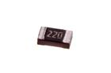 [RESE-0603-X-O220-01   SMD (0603) 22 Ohm Resistor](RESE-0603-X-O220-01/) [R6220](RESE-0603-X-O220-01/)| [RESE-0603-X-O221-01   SMD (0603) 220 Ohm Resistor](RESE-0603-X-O221-01/) [R6221](RESE-0603-X-O221-01/)| [RESE-0603-X-O221-67   SMD (0603) 220 Ohm Resistor 1%](RESE-0603-X-O221-67/) [R6221A](RESE-0603-X-O221-67/)|
| [RESE-0603-X-O222-01   SMD (0603) 2.2k Ohm Resistor](RESE-0603-X-O222-01/) [R6222](RESE-0603-X-O222-01/)| [RESE-0603-X-O223-01   SMD (0603) 22k Ohm Resistor](RESE-0603-X-O223-01/) [R6223](RESE-0603-X-O223-01/)| [RESE-0603-X-O223-67   SMD (0603) 22k Ohm Resistor 1%](RESE-0603-X-O223-67/) [R6223A](RESE-0603-X-O223-67/)| [RESE-0603-X-O224-01   SMD (0603) 220k Ohm Resistor](RESE-0603-X-O224-01/) [R6224](RESE-0603-X-O224-01/)|
| [RESE-0603-X-O224-67   SMD (0603) 220k Ohm Resistor 1%](RESE-0603-X-O224-67/) [R6224A](RESE-0603-X-O224-67/)| [RESE-0603-X-O22X-67   SMD (0603) 2.2 Ohm Resistor 1%](RESE-0603-X-O22X-67/) [R622X](RESE-0603-X-O22X-67/)| [RESE-0603-X-O241-01   SMD (0603) 240 Ohm Resistor](RESE-0603-X-O241-01/) [R6241](RESE-0603-X-O241-01/)| [RESE-0603-X-O242-01   SMD (0603) 2.4k Ohm Resistor](RESE-0603-X-O242-01/) [R6242](RESE-0603-X-O242-01/)|
| [RESE-0603-X-O242-67   SMD (0603) 2.4k Ohm Resistor 1%](RESE-0603-X-O242-67/) [R6242A](RESE-0603-X-O242-67/)| [RESE-0603-X-O243-01   SMD (0603) 25k Ohm Resistor](RESE-0603-X-O243-01/) [R6243](RESE-0603-X-O243-01/)| [RESE-0603-X-O243-67   SMD (0603) 25k Ohm Resistor 1%](RESE-0603-X-O243-67/) [R6243A](RESE-0603-X-O243-67/)| [RESE-0603-X-O2490-67   SMD (0603) 249 Ohm Resistor 1%](RESE-0603-X-O2490-67/) [R6249A](RESE-0603-X-O2490-67/)|
| [RESE-0603-X-O270-67   SMD (0603) 27 Ohm Resistor 1%](RESE-0603-X-O270-67/) [R6270](RESE-0603-X-O270-67/)| [RESE-0603-X-O271-01   SMD (0603) 270 Ohm Resistor](RESE-0603-X-O271-01/) [R6271](RESE-0603-X-O271-01/)| [RESE-0603-X-O271-67   SMD (0603) 270 Ohm Resistor 1%](RESE-0603-X-O271-67/) [R6271A](RESE-0603-X-O271-67/)| [RESE-0603-X-O272-01   SMD (0603) 2.7k Ohm Resistor](RESE-0603-X-O272-01/) [R6272](RESE-0603-X-O272-01/)|
| [RESE-0603-X-O273-01   SMD (0603) 28k Ohm Resistor](RESE-0603-X-O273-01/) [R6273](RESE-0603-X-O273-01/)| [RESE-0603-X-O273-67   SMD (0603) 27k Ohm Resistor 1%](RESE-0603-X-O273-67/) [R6273A](RESE-0603-X-O273-67/)| [RESE-0603-X-O274-01   SMD (0603) 280k Ohm Resistor](RESE-0603-X-O274-01/) [R6274](RESE-0603-X-O274-01/)| [RESE-0603-X-O274-67   SMD (0603) 270k Ohm Resistor 1%](RESE-0603-X-O274-67/) [R6274A](RESE-0603-X-O274-67/)|
| [RESE-0603-X-O300-67   SMD (0603) 30 Ohm Resistor 1%](RESE-0603-X-O300-67/) [R6300A](RESE-0603-X-O300-67/)| [RESE-0603-X-O301-01   SMD (0603) 300 Ohm Resistor](RESE-0603-X-O301-01/) [R6301](RESE-0603-X-O301-01/)| [RESE-0603-X-O301-67   SMD (0603) 300 Ohm Resistor 1%](RESE-0603-X-O301-67/) [R6301A](RESE-0603-X-O301-67/)| [RESE-0603-X-O302-01   SMD (0603) 3k Ohm Resistor](RESE-0603-X-O302-01/) [R6302](RESE-0603-X-O302-01/)|
| [RESE-0603-X-O302-67   SMD (0603) 3k Ohm Resistor 1%](RESE-0603-X-O302-67/) [R6302A](RESE-0603-X-O302-67/)| [RESE-0603-X-O303-67   SMD (0603) 31k Ohm Resistor 1%](RESE-0603-X-O303-67/) [R6303A](RESE-0603-X-O303-67/)| [RESE-0603-X-O330-01   SMD (0603) 33 Ohm Resistor](RESE-0603-X-O330-01/) [R6330](RESE-0603-X-O330-01/)| [RESE-0603-X-O330-67   SMD (0603) 33 Ohm Resistor 1%](RESE-0603-X-O330-67/) [R6330A](RESE-0603-X-O330-67/)|
| [RESE-0603-X-O331-01   SMD (0603) 330 Ohm Resistor](RESE-0603-X-O331-01/) [R6331](RESE-0603-X-O331-01/)| [RESE-0603-X-O331-67   SMD (0603) 330 Ohm Resistor 1%](RESE-0603-X-O331-67/) [R6331A](RESE-0603-X-O331-67/)| [RESE-0603-X-O332-01   SMD (0603) 3.3k Ohm Resistor](RESE-0603-X-O332-01/) [R6332](RESE-0603-X-O332-01/)|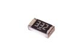 [RESE-0603-X-O332-67   SMD (0603) 3.3k Ohm Resistor 1%](RESE-0603-X-O332-67/) [R6332A](RESE-0603-X-O332-67/)|
| [RESE-0603-X-O361-01   SMD (0603) 360 Ohm Resistor](RESE-0603-X-O361-01/) [R6361](RESE-0603-X-O361-01/)| [RESE-0603-X-O361-67   SMD (0603) 360 Ohm Resistor 1%](RESE-0603-X-O361-67/) [R6361A](RESE-0603-X-O361-67/)| [RESE-0603-X-O362-01   SMD (0603) 3.6k Ohm Resistor](RESE-0603-X-O362-01/) [R6362](RESE-0603-X-O362-01/)| [RESE-0603-X-O390-01   SMD (0603) 39 Ohm Resistor](RESE-0603-X-O390-01/) [R6390](RESE-0603-X-O390-01/)|
| [RESE-0603-X-O391-01   SMD (0603) 390 Ohm Resistor](RESE-0603-X-O391-01/) [R6391](RESE-0603-X-O391-01/)| [RESE-0603-X-O391-67   SMD (0603) 390 Ohm Resistor 1%](RESE-0603-X-O391-67/) [R6391A](RESE-0603-X-O391-67/)| [RESE-0603-X-O392-01   SMD (0603) 3.9k Ohm Resistor](RESE-0603-X-O392-01/) [R6392](RESE-0603-X-O392-01/)| [RESE-0603-X-O392-67   SMD (0603) 3.9k Ohm Resistor 1%](RESE-0603-X-O392-67/) [R6392A](RESE-0603-X-O392-67/)|
| [RESE-0603-X-O393-01   SMD (0603) 39k Ohm Resistor](RESE-0603-X-O393-01/) [R6393](RESE-0603-X-O393-01/)| [RESE-0603-X-O393-67   SMD (0603) 39k Ohm Resistor 1%](RESE-0603-X-O393-67/) [R6393A](RESE-0603-X-O393-67/)| [RESE-0603-X-O4022-67   SMD (0603) 40k Ohm Resistor 1%](RESE-0603-X-O4022-67/) [R6402](RESE-0603-X-O4022-67/)| [RESE-0603-X-O432-67   SMD (0603) 4.3k Ohm Resistor 1%](RESE-0603-X-O432-67/) [R6432A](RESE-0603-X-O432-67/)|
| [RESE-0603-X-O433-01   SMD (0603) 43k Ohm Resistor](RESE-0603-X-O433-01/) [R6433](RESE-0603-X-O433-01/)| [RESE-0603-X-O470-01   SMD (0603) 47 Ohm Resistor](RESE-0603-X-O470-01/) [R6470](RESE-0603-X-O470-01/)| [RESE-0603-X-O471-01   SMD (0603) 470 Ohm Resistor](RESE-0603-X-O471-01/) [R6471](RESE-0603-X-O471-01/)| [RESE-0603-X-O472-01   SMD (0603) 4.7k Ohm Resistor](RESE-0603-X-O472-01/) [R6472](RESE-0603-X-O472-01/)|
| [RESE-0603-X-O473-01   SMD (0603) 47k Ohm Resistor](RESE-0603-X-O473-01/) [R6473](RESE-0603-X-O473-01/)| [RESE-0603-X-O474-01   SMD (0603) 470k Ohm Resistor](RESE-0603-X-O474-01/) [R6474](RESE-0603-X-O474-01/)| [RESE-0603-X-O474-67   SMD (0603) 470k Ohm Resistor 1%](RESE-0603-X-O474-67/) [R6474A](RESE-0603-X-O474-67/)| [RESE-0603-X-O475-01   SMD (0603) 4.7M Ohm Resistor](RESE-0603-X-O475-01/) [R6475](RESE-0603-X-O475-01/)|
| [RESE-0603-X-O4990-67   SMD (0603) 499 Ohm Resistor 1%](RESE-0603-X-O4990-67/) [R64990A](RESE-0603-X-O4990-67/)| [RESE-0603-X-O4992-67   SMD (0603) 49.9k Ohm Resistor 1%](RESE-0603-X-O4992-67/) [R64992A](RESE-0603-X-O4992-67/)| [RESE-0603-X-O499D-67   SMD (0603) 49.9 Ohm Resistor 1%](RESE-0603-X-O499D-67/) [R6499DA](RESE-0603-X-O499D-67/)| [RESE-0603-X-O510-01   SMD (0603) 51 Ohm Resistor](RESE-0603-X-O510-01/) [R6510](RESE-0603-X-O510-01/)|
| [RESE-0603-X-O510-67   SMD (0603) 51 Ohm Resistor 1%](RESE-0603-X-O510-67/) [R6510A](RESE-0603-X-O510-67/)| [RESE-0603-X-O511-01   SMD (0603) 510 Ohm Resistor](RESE-0603-X-O511-01/) [R6511](RESE-0603-X-O511-01/)| [RESE-0603-X-O511-67   SMD (0603) 510 Ohm Resistor 1%](RESE-0603-X-O511-67/) [R6511A](RESE-0603-X-O511-67/)| [RESE-0603-X-O512-67   SMD (0603) 5.1k Ohm Resistor 1%](RESE-0603-X-O512-67/) [R6512A](RESE-0603-X-O512-67/)|
| [RESE-0603-X-O513-01   SMD (0603) 51k Ohm Resistor](RESE-0603-X-O513-01/) [R6513](RESE-0603-X-O513-01/)| [RESE-0603-X-O513-67   SMD (0603) 51k Ohm Resistor 1%](RESE-0603-X-O513-67/) [R6513A](RESE-0603-X-O513-67/)| [RESE-0603-X-O560-01   SMD (0603) 56 Ohm Resistor](RESE-0603-X-O560-01/) [R6560](RESE-0603-X-O560-01/)| [RESE-0603-X-O560-67   SMD (0603) 56 Ohm Resistor 1%](RESE-0603-X-O560-67/) [R6560A](RESE-0603-X-O560-67/)|
| [RESE-0603-X-O561-01   SMD (0603) 560 Ohm Resistor](RESE-0603-X-O561-01/) [R6561](RESE-0603-X-O561-01/)| [RESE-0603-X-O562-01   SMD (0603) 5.6k Ohm Resistor](RESE-0603-X-O562-01/) [R6562](RESE-0603-X-O562-01/)| [RESE-0603-X-O562-67   SMD (0603) 5.6k Ohm Resistor 1%](RESE-0603-X-O562-67/) [R6562A](RESE-0603-X-O562-67/)| [RESE-0603-X-O563-01   SMD (0603) 56k Ohm Resistor](RESE-0603-X-O563-01/) [R6563](RESE-0603-X-O563-01/)|
| [RESE-0603-X-O563-67   SMD (0603) 56k Ohm Resistor 1%](RESE-0603-X-O563-67/) [R6563A](RESE-0603-X-O563-67/)| [RESE-0603-X-O564-01   SMD (0603) 560k Ohm Resistor](RESE-0603-X-O564-01/) [R6564](RESE-0603-X-O564-01/)| [RESE-0603-X-O620-01   SMD (0603) 62 Ohm Resistor](RESE-0603-X-O620-01/) [R6620](RESE-0603-X-O620-01/)| [RESE-0603-X-O621-01   SMD (0603) 620 Ohm Resistor](RESE-0603-X-O621-01/) [R6621](RESE-0603-X-O621-01/)|
| [RESE-0603-X-O623-67   SMD (0603) 62k Ohm Resistor 1%](RESE-0603-X-O623-67/) [R6623A](RESE-0603-X-O623-67/)| [RESE-0603-X-O680-01   SMD (0603) 68 Ohm Resistor](RESE-0603-X-O680-01/) [R6680](RESE-0603-X-O680-01/)| [RESE-0603-X-O680-67   SMD (0603) 68 Ohm Resistor 1%](RESE-0603-X-O680-67/) [R6680A](RESE-0603-X-O680-67/)| [RESE-0603-X-O681-01   SMD (0603) 680 Ohm Resistor](RESE-0603-X-O681-01/) [R6681](RESE-0603-X-O681-01/)|
| [RESE-0603-X-O681-67   SMD (0603) 680 Ohm Resistor 1%](RESE-0603-X-O681-67/) [R6681A](RESE-0603-X-O681-67/)| [RESE-0603-X-O682-67   SMD (0603) 6.8k Ohm Resistor 1%](RESE-0603-X-O682-67/) [R6682A](RESE-0603-X-O682-67/)| [RESE-0603-X-O683-01   SMD (0603) 68k Ohm Resistor](RESE-0603-X-O683-01/) [R6683](RESE-0603-X-O683-01/)| [RESE-0603-X-O683-67   SMD (0603) 68k Ohm Resistor 1%](RESE-0603-X-O683-67/) [R6683A](RESE-0603-X-O683-67/)|
| [RESE-0603-X-O684-67   SMD (0603) 680k Ohm Resistor 1%](RESE-0603-X-O684-67/) [R6684A](RESE-0603-X-O684-67/)| [RESE-0603-X-O750-01   SMD (0603) 75 Ohm Resistor](RESE-0603-X-O750-01/) [R6750](RESE-0603-X-O750-01/)| [RESE-0603-X-O750-67   SMD (0603) 75 Ohm Resistor 1%](RESE-0603-X-O750-67/) [R6750A](RESE-0603-X-O750-67/)| [RESE-0603-X-O751-01   SMD (0603) 750 Ohm Resistor](RESE-0603-X-O751-01/) [R6751](RESE-0603-X-O751-01/)|
| [RESE-0603-X-O752-01   SMD (0603) 7.5k Ohm Resistor](RESE-0603-X-O752-01/) [R6752](RESE-0603-X-O752-01/)| [RESE-0603-X-O752-67   SMD (0603) 7.5k Ohm Resistor 1%](RESE-0603-X-O752-67/) [R6752A](RESE-0603-X-O752-67/)| [RESE-0603-X-O753-67   SMD (0603) 75k Ohm Resistor 1%](RESE-0603-X-O753-67/) [R6753A](RESE-0603-X-O753-67/)| [RESE-0603-X-O821-67   SMD (0603) 820 Ohm Resistor 1%](RESE-0603-X-O821-67/) [R6821A](RESE-0603-X-O821-67/)|
| [RESE-0603-X-O822-01   SMD (0603) 8.2k Ohm Resistor](RESE-0603-X-O822-01/) [R6822](RESE-0603-X-O822-01/)| [RESE-0603-X-O822-67   SMD (0603) 8.2k Ohm Resistor 1%](RESE-0603-X-O822-67/) [R6822A](RESE-0603-X-O822-67/)| [RESE-0603-X-O823-67   SMD (0603) 82k Ohm Resistor 1%](RESE-0603-X-O823-67/) [R6823A](RESE-0603-X-O823-67/)| [RESE-0805-X-O000-67   SMD (0805) 0 Ohm Resistor 1%](RESE-0805-X-O000-67/) [R85000A](RESE-0805-X-O000-67/)|
| [RESE-0805-X-O001D-01   SMD (0805) 0.1 Ohm Resistor](RESE-0805-X-O001D-01/) [R85001D](RESE-0805-X-O001D-01/)| [RESE-0805-X-O101-01   SMD (0805) 100 Ohm Resistor](RESE-0805-X-O101-01/) [R85101](RESE-0805-X-O101-01/)| [RESE-0805-X-O102-01   SMD (0805) 1k Ohm Resistor](RESE-0805-X-O102-01/) [R85102](RESE-0805-X-O102-01/)| [RESE-0805-X-O103-01   SMD (0805) 10k Ohm Resistor](RESE-0805-X-O103-01/) [R85103](RESE-0805-X-O103-01/)|
|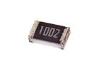 [RESE-0805-X-O103-67   SMD (0805) 10k Ohm Resistor 1%](RESE-0805-X-O103-67/) [R85103A](RESE-0805-X-O103-67/)|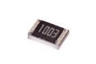 [RESE-0805-X-O104-67   SMD (0805) 100k Ohm Resistor 1%](RESE-0805-X-O104-67/) [R85104A](RESE-0805-X-O104-67/)| [RESE-0805-X-O105-67   SMD (0805) 1M Ohm Resistor 1%](RESE-0805-X-O105-67/) [R85105A](RESE-0805-X-O105-67/)| [RESE-0805-X-O121-01   SMD (0805) 120 Ohm Resistor](RESE-0805-X-O121-01/) [R85121](RESE-0805-X-O121-01/)|
| [RESE-0805-X-O121-67   SMD (0805) 120 Ohm Resistor 1%](RESE-0805-X-O121-67/) [R85121A](RESE-0805-X-O121-67/)| [RESE-0805-X-O122-01   SMD (0805) 1.2k Ohm Resistor](RESE-0805-X-O122-01/) [R85122](RESE-0805-X-O122-01/)| [RESE-0805-X-O122-67   SMD (0805) 1.2k Ohm Resistor 1%](RESE-0805-X-O122-67/) [R85122A](RESE-0805-X-O122-67/)| [RESE-0805-X-O123-01   SMD (0805) 12k Ohm Resistor](RESE-0805-X-O123-01/) [R85123](RESE-0805-X-O123-01/)|
| [RESE-0805-X-O151-01   SMD (0805) 150 Ohm Resistor](RESE-0805-X-O151-01/) [R85151](RESE-0805-X-O151-01/)| [RESE-0805-X-O151-67   SMD (0805) 150 Ohm Resistor 1%](RESE-0805-X-O151-67/) [R85151A](RESE-0805-X-O151-67/)| [RESE-0805-X-O152-01   SMD (0805) 1.5k Ohm Resistor](RESE-0805-X-O152-01/) [R85152](RESE-0805-X-O152-01/)| [RESE-0805-X-O152-67   SMD (0805) 1.5k Ohm Resistor 1%](RESE-0805-X-O152-67/) [R85152A](RESE-0805-X-O152-67/)|
| [RESE-0805-X-O153-01   SMD (0805) 15k Ohm Resistor](RESE-0805-X-O153-01/) [R85153](RESE-0805-X-O153-01/)| [RESE-0805-X-O182-01   SMD (0805) 1.8k Ohm Resistor](RESE-0805-X-O182-01/) [R85182](RESE-0805-X-O182-01/)| [RESE-0805-X-O200-01   SMD (0805) 20 Ohm Resistor](RESE-0805-X-O200-01/) [R85200](RESE-0805-X-O200-01/)| [RESE-0805-X-O201-67   SMD (0805) 200 Ohm Resistor 1%](RESE-0805-X-O201-67/) [R85201A](RESE-0805-X-O201-67/)|
|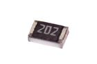 [RESE-0805-X-O202-01   SMD (0805) 2k Ohm Resistor](RESE-0805-X-O202-01/) [R85202](RESE-0805-X-O202-01/)| [RESE-0805-X-O202-67   SMD (0805) 2k Ohm Resistor 1%](RESE-0805-X-O202-67/) [R85202A](RESE-0805-X-O202-67/)| [RESE-0805-X-O203-01   SMD (0805) 20k Ohm Resistor](RESE-0805-X-O203-01/) [R85203](RESE-0805-X-O203-01/)| [RESE-0805-X-O204-67   SMD (0805) 200k Ohm Resistor 1%](RESE-0805-X-O204-67/) [R85204A](RESE-0805-X-O204-67/)|
|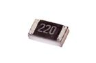 [RESE-0805-X-O220-01   SMD (0805) 22 Ohm Resistor](RESE-0805-X-O220-01/) [R85220](RESE-0805-X-O220-01/)| [RESE-0805-X-O221-01   SMD (0805) 220 Ohm Resistor](RESE-0805-X-O221-01/) [R85221](RESE-0805-X-O221-01/)| [RESE-0805-X-O221-67   SMD (0805) 220 Ohm Resistor 1%](RESE-0805-X-O221-67/) [R85221A](RESE-0805-X-O221-67/)| [RESE-0805-X-O222-01   SMD (0805) 2.2k Ohm Resistor](RESE-0805-X-O222-01/) [R85222](RESE-0805-X-O222-01/)|
| [RESE-0805-X-O222-67   SMD (0805) 2.2k Ohm Resistor 1%](RESE-0805-X-O222-67/) [R85222A](RESE-0805-X-O222-67/)| [RESE-0805-X-O223-01   SMD (0805) 22k Ohm Resistor](RESE-0805-X-O223-01/) [R85223](RESE-0805-X-O223-01/)| [RESE-0805-X-O223-67   SMD (0805) 22k Ohm Resistor 1%](RESE-0805-X-O223-67/) [R85223A](RESE-0805-X-O223-67/)| [RESE-0805-X-O242-01   SMD (0805) 2.4k Ohm Resistor](RESE-0805-X-O242-01/) [R85242](RESE-0805-X-O242-01/)|
| [RESE-0805-X-O243-01   SMD (0805) 24k Ohm Resistor](RESE-0805-X-O243-01/) [R85243](RESE-0805-X-O243-01/)| [RESE-0805-X-O271-67   SMD (0805) 270 Ohm Resistor 1%](RESE-0805-X-O271-67/) [R85271A](RESE-0805-X-O271-67/)| [RESE-0805-X-O301-67   SMD (0805) 300 Ohm Resistor 1%](RESE-0805-X-O301-67/) [R85301A](RESE-0805-X-O301-67/)| [RESE-0805-X-O302-01   SMD (0805) 3k Ohm Resistor](RESE-0805-X-O302-01/) [R85302](RESE-0805-X-O302-01/)|
| [RESE-0805-X-O302-67   SMD (0805) 3k Ohm Resistor 1%](RESE-0805-X-O302-67/) [R85302A](RESE-0805-X-O302-67/)| [RESE-0805-X-O303-01   SMD (0805) 30k Ohm Resistor](RESE-0805-X-O303-01/) [R85303](RESE-0805-X-O303-01/)| [RESE-0805-X-O303-67   SMD (0805) 30k Ohm Resistor 1%](RESE-0805-X-O303-67/) [R85303A](RESE-0805-X-O303-67/)| [RESE-0805-X-O330-01   SMD (0805) 33 Ohm Resistor](RESE-0805-X-O330-01/) [R85330](RESE-0805-X-O330-01/)|
| [RESE-0805-X-O330-67   SMD (0805) 33 Ohm Resistor 1%](RESE-0805-X-O330-67/) [R85330A](RESE-0805-X-O330-67/)| [RESE-0805-X-O331-01   SMD (0805) 330 Ohm Resistor](RESE-0805-X-O331-01/) [R85331](RESE-0805-X-O331-01/)| [RESE-0805-X-O331-67   SMD (0805) 330 Ohm Resistor 1%](RESE-0805-X-O331-67/) [R85331A](RESE-0805-X-O331-67/)| [RESE-0805-X-O332-01   SMD (0805) 3.3k Ohm Resistor](RESE-0805-X-O332-01/) [R85332](RESE-0805-X-O332-01/)|
| [RESE-0805-X-O332-67   SMD (0805) 3.3k Ohm Resistor 1%](RESE-0805-X-O332-67/) [R85332A](RESE-0805-X-O332-67/)| [RESE-0805-X-O391-01   SMD (0805) 390 Ohm Resistor](RESE-0805-X-O391-01/) [R85391](RESE-0805-X-O391-01/)| [RESE-0805-X-O391-67   SMD (0805) 390 Ohm Resistor 1%](RESE-0805-X-O391-67/) [R85391A](RESE-0805-X-O391-67/)| [RESE-0805-X-O392-67   SMD (0805) 3.9k Ohm Resistor 1%](RESE-0805-X-O392-67/) [R85392A](RESE-0805-X-O392-67/)|
| [RESE-0805-X-O470-67   SMD (0805) 47 Ohm Resistor 1%](RESE-0805-X-O470-67/) [R85470A](RESE-0805-X-O470-67/)| [RESE-0805-X-O471-67   SMD (0805) 470 Ohm Resistor 1%](RESE-0805-X-O471-67/) [R85471A](RESE-0805-X-O471-67/)| [RESE-0805-X-O472-01   SMD (0805) 4.7k Ohm Resistor](RESE-0805-X-O472-01/) [R85472](RESE-0805-X-O472-01/)| [RESE-0805-X-O473-67   SMD (0805) 47k Ohm Resistor 1%](RESE-0805-X-O473-67/) [R85473A](RESE-0805-X-O473-67/)|
| [RESE-0805-X-O510-67   SMD (0805) 51 Ohm Resistor 1%](RESE-0805-X-O510-67/) [R85510A](RESE-0805-X-O510-67/)| [RESE-0805-X-O511-01   SMD (0805) 510 Ohm Resistor](RESE-0805-X-O511-01/) [R85511](RESE-0805-X-O511-01/)| [RESE-0805-X-O511-67   SMD (0805) 510 Ohm Resistor 1%](RESE-0805-X-O511-67/) [R85511A](RESE-0805-X-O511-67/)| [RESE-0805-X-O512-67   SMD (0805) 5.1k Ohm Resistor 1%](RESE-0805-X-O512-67/) [R85512A](RESE-0805-X-O512-67/)|
| [RESE-0805-X-O514-01   SMD (0805) 510k Ohm Resistor](RESE-0805-X-O514-01/) [R85514](RESE-0805-X-O514-01/)| [RESE-0805-X-O561-67   SMD (0805) 560 Ohm Resistor 1%](RESE-0805-X-O561-67/) [R85561A](RESE-0805-X-O561-67/)| [RESE-0805-X-O563-01   SMD (0805) 56k Ohm Resistor](RESE-0805-X-O563-01/) [R85563](RESE-0805-X-O563-01/)| [RESE-0805-X-O563-67   SMD (0805) 56k Ohm Resistor 1%](RESE-0805-X-O563-67/) [R85563A](RESE-0805-X-O563-67/)|
| [RESE-0805-X-O680-01   SMD (0805) 68 Ohm Resistor](RESE-0805-X-O680-01/) [R85680](RESE-0805-X-O680-01/)| [RESE-0805-X-O682-01   SMD (0805) 6.8k Ohm Resistor](RESE-0805-X-O682-01/) [R85682](RESE-0805-X-O682-01/)| [RESE-0805-X-O750-67   SMD (0805) 75 Ohm Resistor 1%](RESE-0805-X-O750-67/) [R85750A](RESE-0805-X-O750-67/)| [RESE-0805-X-O821-67   SMD (0805) 820 Ohm Resistor 1%](RESE-0805-X-O821-67/) [R85821A](RESE-0805-X-O821-67/)|
| [RESE-0805-X-O822-01   SMD (0805) 8.2k Ohm Resistor](RESE-0805-X-O822-01/) [R85822](RESE-0805-X-O822-01/)| [RESE-1206-X-O101-01   SMD (1206) 100 Ohm Resistor](RESE-1206-X-O101-01/) [R1101](RESE-1206-X-O101-01/)| [RESE-1206-X-O130-01   SMD (1206) 13 Ohm Resistor](RESE-1206-X-O130-01/) [R1130](RESE-1206-X-O130-01/)| [RESE-W04-X-O000-01   1/4 Watt 0 Ohm Resistor](RESE-W04-X-O000-01/) [R4000](RESE-W04-X-O000-01/)|
| [RESE-W04-X-O100-01   1/4 Watt 10 Ohm Resistor](RESE-W04-X-O100-01/) [R4100](RESE-W04-X-O100-01/)| [RESE-W04-X-O101-01   1/4 Watt 100 Ohm Resistor](RESE-W04-X-O101-01/) [R4101](RESE-W04-X-O101-01/)|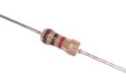 [RESE-W04-X-O102-01   1/4 Watt 1k Ohm Resistor](RESE-W04-X-O102-01/) [R4102](RESE-W04-X-O102-01/)| [RESE-W04-X-O103-01   1/4 Watt 10k Ohm Resistor](RESE-W04-X-O103-01/) [R4103](RESE-W04-X-O103-01/)|
| [RESE-W04-X-O104-01   1/4 Watt 100k Ohm Resistor](RESE-W04-X-O104-01/) [R4104](RESE-W04-X-O104-01/)| [RESE-W04-X-O105-01   1/4 Watt 1M Ohm Resistor](RESE-W04-X-O105-01/) [R4105](RESE-W04-X-O105-01/)| [RESE-W04-X-O152-01   1/4 Watt 1.5k Ohm Resistor](RESE-W04-X-O152-01/) [R4152](RESE-W04-X-O152-01/)| [RESE-W04-X-O15X-01   1/4 Watt 1.5 Ohm Resistor](RESE-W04-X-O15X-01/) [R415A](RESE-W04-X-O15X-01/)|
| [RESE-W04-X-O221-01   1/4 Watt 220 Ohm Resistor](RESE-W04-X-O221-01/) [R4221](RESE-W04-X-O221-01/)| [RESE-W04-X-O222-01   1/4 Watt 2.2k Ohm Resistor](RESE-W04-X-O222-01/) [R4222](RESE-W04-X-O222-01/)| [RESE-W04-X-O223-01   1/4 Watt 22k Ohm Resistor](RESE-W04-X-O223-01/) [R4223](RESE-W04-X-O223-01/)| [RESE-W04-X-O271-01   1/4 Watt 270 Ohm Resistor](RESE-W04-X-O271-01/) [R4271](RESE-W04-X-O271-01/)|
| [RESE-W04-X-O331-01   1/4 Watt 330 Ohm Resistor](RESE-W04-X-O331-01/) [R4331](RESE-W04-X-O331-01/)| [RESE-W04-X-O332-01   1/4 Watt 3.3k Ohm Resistor](RESE-W04-X-O332-01/) [R4332](RESE-W04-X-O332-01/)| [RESE-W04-X-O334-01   1/4 Watt 330k Ohm Resistor](RESE-W04-X-O334-01/) [R4334](RESE-W04-X-O334-01/)| [RESE-W04-X-O470-01   1/4 Watt 47 Ohm Resistor](RESE-W04-X-O470-01/) [R4470](RESE-W04-X-O470-01/)|
| [RESE-W04-X-O471-01   1/4 Watt 470 Ohm Resistor](RESE-W04-X-O471-01/) [R4471](RESE-W04-X-O471-01/)|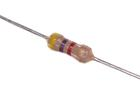 [RESE-W04-X-O472-01   1/4 Watt 4.7k Ohm Resistor](RESE-W04-X-O472-01/) [R4472](RESE-W04-X-O472-01/)| [RESE-W04-X-O473-01   1/4 Watt 47k Ohm Resistor](RESE-W04-X-O473-01/) [R4473](RESE-W04-X-O473-01/)| [RESE-W04-X-O47X-01   1/4 Watt 4.7 Ohm Resistor](RESE-W04-X-O47X-01/) [R447A](RESE-W04-X-O47X-01/)|
| [RESE-W04-X-O561-01   1/4 Watt 560 Ohm Resistor](RESE-W04-X-O561-01/) [R4561](RESE-W04-X-O561-01/)| [RESE-W04-X-O681-01   1/4 Watt 680 Ohm Resistor](RESE-W04-X-O681-01/) [R4681](RESE-W04-X-O681-01/)| [RESE-W04-X-O682-01   1/4 Watt 6.8k Ohm Resistor](RESE-W04-X-O682-01/) [R4682](RESE-W04-X-O682-01/)||

## RJ45 > RJ45
  

| [RJ45-18-X-SOCK-LI   18 mm Socket RJ45 w/Lights](RJ45-18-X-SOCK-LI/) [R45SL](RJ45-18-X-SOCK-LI/)| [RJ45-21-X-SOCK-01   21 mm Socket RJ45](RJ45-21-X-SOCK-01/) [R45S](RJ45-21-X-SOCK-01/)|||
| :---: | :---: | :---: | :---: |

## SCRE > Machine Screw
  

| [SCRE-M3-M-12-70   M3 x 12 mm Machine Screw Cross Head](SCRE-M3-M-12-70/) [M312](SCRE-M3-M-12-70/)| [SCRE-M3-M-16-70   M3 x 16 mm Machine Screw Cross Head](SCRE-M3-M-16-70/) [M316](SCRE-M3-M-16-70/)| [SCRE-M3-M-20-70   M3 x 20 mm Metal Machine Screw Cross Head](SCRE-M3-M-20-70/) [M320](SCRE-M3-M-20-70/)| [SCRE-M3-M-25-70   M3 x 25 mm Machine Screw Cross Head](SCRE-M3-M-25-70/) [M325](SCRE-M3-M-25-70/)|
| :---: | :---: | :---: | :---: |
| [SCRE-M3-M-30-70   M3 x 30 mm Metal Machine Screw Cross Head](SCRE-M3-M-30-70/) [M330](SCRE-M3-M-30-70/)| [SCRE-M3-X-05-70   M3 x 5 mm Machine Screw Cross Head](SCRE-M3-X-05-70/) [M35](SCRE-M3-X-05-70/)| [SCRE-M3-X-06-70   M3 x 6 mm Machine Screw Cross Head](SCRE-M3-X-06-70/) [M36](SCRE-M3-X-06-70/)||

## SDCS > SD Card Socket
  

| [SDCS-MC-M-SMDS-01   Micro SMD SD Card Socket](SDCS-MC-M-SMDS-01/) [SDMS](SDCS-MC-M-SMDS-01/)| [SDCS-MC-M-SMDS-02   Micro SMD Metal SD Card Socket](SDCS-MC-M-SMDS-02/) [SDMS2](SDCS-MC-M-SMDS-02/)| [SDCS-MC-M-SMDS-03   Micro SMD Metal SD Card Socket](SDCS-MC-M-SMDS-03/) [SDMS3](SDCS-MC-M-SMDS-03/)||
| :---: | :---: | :---: | :---: |

## SENS > Sensor
  

| [SENS-05-X-LIRE-01   5 mm Light (Resistive) Sensor](SENS-05-X-LIRE-01/) [SEPR](SENS-05-X-LIRE-01/)| [SENS-12-X-TEHU-01   12 mm Temperature and Humidity Sensor](SENS-12-X-TEHU-01/) [SETH1](SENS-12-X-TEHU-01/)| [SENS-13-X-TEHU-01   13 mm Temperature and Humidity Sensor](SENS-13-X-TEHU-01/) [SETH2](SENS-13-X-TEHU-01/)| [SENS-25X13-X-PIVB-01   25 x 13 mm Piezo Vibration Sensor](SENS-25X13-X-PIVB-01/) [SEVB](SENS-25X13-X-PIVB-01/)|
| :---: | :---: | :---: | :---: |
| [SENS-3528-X-UVUV-01   SMD (3528) Ultraviolet Sensor](SENS-3528-X-UVUV-01/) [SEUV](SENS-3528-X-UVUV-01/)| [SENS-87DX45D-X-K1550-01   8.7 mm x 4.5 mm Photo Reflective (LTH1550) Sensor](SENS-87DX45D-X-K1550-01/) [SEPR](SENS-87DX45D-X-K1550-01/)| [SENS-92D-X-PIRS-01   9.2 mm PIRS Sensor](SENS-92D-X-PIRS-01/) [SEPI](SENS-92D-X-PIRS-01/)| [SENS-SO235-X-K36-01   SMD (SOT-23-5) 3-Axis Accelerometer (MMA7660FCR1) Sensor](SENS-SO235-X-K36-01/) |
| [SENS-T92-X-K18B20-01   TO-92 DS18B20 (1-Wire Digital Thermometer) Sensor](SENS-T92-X-K18B20-01/) [OW918B20](SENS-T92-X-K18B20-01/)| [SENS-T92-X-K36-01   TO-92 Temperature (TMP36) Sensor](SENS-T92-X-K36-01/) [SE36](SENS-T92-X-K36-01/)|||

## SERV > Servo
  

| [SERV-MC-X-STAN-01   Micro Servo](SERV-MC-X-STAN-01/) [SVM](SERV-MC-X-STAN-01/)| [SERV-ST-X-STAN-01   Standard Servo](SERV-ST-X-STAN-01/) [SV](SERV-ST-X-STAN-01/)|||
| :---: | :---: | :---: | :---: |

## SWIS > Switch (Slide)
  

| [SWIS-09-X-DPDT-01   9 mm DPDT Switch (Slide)](SWIS-09-X-DPDT-01/) [SSW9D](SWIS-09-X-DPDT-01/)| [SWIS-09-X-DPDT-68   9 mm DPDT Switch (Slide) Side Adjust](SWIS-09-X-DPDT-68/) [SSW9S](SWIS-09-X-DPDT-68/)| [SWIS-09-X-SPDT-68    9 mm SPDT Switch (Slide) Side Adjust ](SWIS-09-X-SPDT-68/) [SSW9S](SWIS-09-X-SPDT-68/)| [SWIS-7135-X-DPDT-01   SMD (7135) DPDT Switch (Slide)](SWIS-7135-X-DPDT-01/) [SS7135](SWIS-7135-X-DPDT-01/)|
| :---: | :---: | :---: | :---: |
| [SWIS-7827-X-SPDT-01   SMD (7827) SPDT Switch (Slide)](SWIS-7827-X-SPDT-01/) [SS7827](SWIS-7827-X-SPDT-01/)||||

## TERS > Screw Terminal
  

| [TERS-05-G-PI02-01   5 mm 2 Pin Green Screw Terminal](TERS-05-G-PI02-01/) [ST502G](TERS-05-G-PI02-01/)| [TERS-05-G-PI03-01   5 mm 3 Pin Green Screw Terminal](TERS-05-G-PI03-01/) [ST502G](TERS-05-G-PI03-01/)| [TERS-35D-G-PI02-01   3.5 mm 2 Pin Green Screw Terminal](TERS-35D-G-PI02-01/) [ST302G](TERS-35D-G-PI02-01/)| [TERS-35D-L-PI01-01   3.5 mm 1 Pin Blue Screw Terminal](TERS-35D-L-PI01-01/) [T35L1](TERS-35D-L-PI01-01/)|
| :---: | :---: | :---: | :---: |
| [TERS-35D-L-PI02-01   3.5 mm 2 Pin Blue Screw Terminal](TERS-35D-L-PI02-01/) [T35L2](TERS-35D-L-PI02-01/)| [TERS-35D-L-PI03-01   3.5 mm 3 Pin Blue Screw Terminal](TERS-35D-L-PI03-01/) [T35L3](TERS-35D-L-PI03-01/)| [TERS-35D-L-PI04-01   3.5 mm 4 Pin Blue Screw Terminal](TERS-35D-L-PI04-01/) [T35L4](TERS-35D-L-PI04-01/)| [TERS-35D-L-PI05-01   3.5 mm 5 Pin Blue Screw Terminal](TERS-35D-L-PI05-01/) [T35L5](TERS-35D-L-PI05-01/)|
| [TERS-35D-L-PI06-01   3.5 mm 6 Pin Blue Screw Terminal](TERS-35D-L-PI06-01/) [T35L6](TERS-35D-L-PI06-01/)| [TERS-35D-L-PI07-01   3.5 mm 7 Pin Blue Screw Terminal](TERS-35D-L-PI07-01/) [T35L7](TERS-35D-L-PI07-01/)| [TERS-35D-L-PI08-01   3.5 mm 8 Pin Blue Screw Terminal](TERS-35D-L-PI08-01/) [T35L8](TERS-35D-L-PI08-01/)| [TERS-35D-L-PI09-01   3.5 mm 9 Pin Blue Screw Terminal](TERS-35D-L-PI09-01/) [T35L9](TERS-35D-L-PI09-01/)|
| [TERS-35D-L-PI10-01   3.5 mm 10 Pin Blue Screw Terminal](TERS-35D-L-PI10-01/) [T35L10](TERS-35D-L-PI10-01/)| [TERS-35D-L-PI11-01   3.5 mm 11 Pin Blue Screw Terminal](TERS-35D-L-PI11-01/) [T35L11](TERS-35D-L-PI11-01/)| [TERS-35D-L-PI12-01   3.5 mm 12 Pin Blue Screw Terminal](TERS-35D-L-PI12-01/) [T35L12](TERS-35D-L-PI12-01/)| [TERS-35D-L-PI13-01   3.5 mm 13 Pin Blue Screw Terminal](TERS-35D-L-PI13-01/) [T35L13](TERS-35D-L-PI13-01/)|
| [TERS-35D-L-PI14-01   3.5 mm 14 Pin Blue Screw Terminal](TERS-35D-L-PI14-01/) [T35L14](TERS-35D-L-PI14-01/)| [TERS-35D-L-PI15-01   3.5 mm 15 Pin Blue Screw Terminal](TERS-35D-L-PI15-01/) [T35L15](TERS-35D-L-PI15-01/)|||

## THER > Thermistor
  

| [THER-0603-X-O104-01   SMD (0603) 100k Ohm Thermistor](THER-0603-X-O104-01/) [TH6](THER-0603-X-O104-01/)| [THER-175D-X-O103-TC3590   1.75 mm 10k Ohm Thermistor (3590)](THER-175D-X-O103-TC3590/) [TH1033](THER-175D-X-O103-TC3590/)| [THER-65D-X-STAN-01   6.5 mm Thermistor](THER-65D-X-STAN-01/) [TH65D](THER-65D-X-STAN-01/)||
| :---: | :---: | :---: | :---: |

## TILS > Tilt Switch
  

| [TILS-11-X-STAN-01   11 mm Tilt Switch](TILS-11-X-STAN-01/) [TS11](TILS-11-X-STAN-01/)||||
| :---: | :---: | :---: | :---: |

## TINB > Tin Box
  

| [TINB-L169W130H18-X-HINGE-01   169 mm x 130 mm x 18 mm Hinged Tin Box](TINB-L169W130H18-X-HINGE-01/) [TB01](TINB-L169W130H18-X-HINGE-01/)||||
| :---: | :---: | :---: | :---: |

## TRNN > NPN Transistor
  

|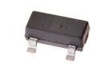 [TRNN-SO23-X-A01D-01   SMD (SOT-23) 100 mA NPN Transistor](TRNN-SO23-X-A01D-01/) [TNS21D](TRNN-SO23-X-A01D-01/)| [TRNN-SO23-X-A02D-01   SMD (SOT-23) 200 mA NPN Transistor](TRNN-SO23-X-A02D-01/) [TNS22D](TRNN-SO23-X-A02D-01/)| [TRNN-SO23-X-A05D-01   SMD (SOT-23) 500 mA NPN Transistor](TRNN-SO23-X-A05D-01/) [TNS25D](TRNN-SO23-X-A05D-01/)| [TRNN-SO23-X-A05D-02   SMD (SOT-23) 500 mA NPN Transistor](TRNN-SO23-X-A05D-02/) [TNS25D2](TRNN-SO23-X-A05D-02/)|
| :---: | :---: | :---: | :---: |
| [TRNN-SO23-X-KS8050-01   SMD (SOT-23) S8050 NPN Transistor](TRNN-SO23-X-KS8050-01/) [TN98050](TRNN-SO23-X-KS8050-01/)| [TRNN-T220-BCE-A05-01   TO-220 5 Amp NPN Transistor](TRNN-T220-BCE-A05-01/) [TN120](TRNN-T220-BCE-A05-01/)| [TRNN-T220-X-A05-01   TO-220 5 Amp NPN Transistor](TRNN-T220-X-A05-01/) [TN120](TRNN-T220-X-A05-01/)| [TRNN-T92-X-K222-01   TO-92 2222A NPN Transistor](TRNN-T92-X-K222-01/) [NT92222](TRNN-T92-X-K222-01/)|
| [TRNN-T92-X-K2N2222-01   TO-92 2N2222 NPN Transistor](TRNN-T92-X-K2N2222-01/) [TN92N2](TRNN-T92-X-K2N2222-01/)| [TRNN-T92-X-K2N3904-01   TO-92 2N3904 NPN Transistor](TRNN-T92-X-K2N3904-01/) [TN92N34](TRNN-T92-X-K2N3904-01/)| [TRNN-T92-X-KBC337-01   TO-92 BC337 NPN Transistor](TRNN-T92-X-KBC337-01/) [TN9337](TRNN-T92-X-KBC337-01/)| [TRNN-T92-X-KC1815-01   TO-92 C1815 NPN Transistor](TRNN-T92-X-KC1815-01/) [TN91815](TRNN-T92-X-KC1815-01/)|
| [TRNN-T92-X-KS8050-01   TO-92 S8050 NPN Transistor](TRNN-T92-X-KS8050-01/) [TN98050](TRNN-T92-X-KS8050-01/)||||

## TRNP > PNP Transistor
  

| [TRNP-SO23-X-A02D-01   SMD (SOT-23) 200 mA PNP Transistor](TRNP-SO23-X-A02D-01/) [TPS22D](TRNP-SO23-X-A02D-01/)| [TRNP-SO23-X-A05D-01   SMD (SOT-23) 500 mA PNP Transistor](TRNP-SO23-X-A05D-01/) [TPS25D](TRNP-SO23-X-A05D-01/)| [TRNP-SO23-X-KS8550-01   SMD (SOT-23) S8550 PNP Transistor](TRNP-SO23-X-KS8550-01/) [TP985](TRNP-SO23-X-KS8550-01/)| [TRNP-T92-X-K2N2907-01   TO-92 2N2907 PNP Transistor](TRNP-T92-X-K2N2907-01/) [TP92N27](TRNP-T92-X-K2N2907-01/)|
| :---: | :---: | :---: | :---: |
| [TRNP-T92-X-K2N3906-01   TO-92 2N3906 PNP Transistor](TRNP-T92-X-K2N3906-01/) [TP92N36](TRNP-T92-X-K2N3906-01/)| [TRNP-T92-X-KA1015-01   TO-92 A1015 PNP Transistor](TRNP-T92-X-KA1015-01/) [TP9A15](TRNP-T92-X-KA1015-01/)| [TRNP-T92-X-KBC327-01   TO-92 BC327 PNP Transistor](TRNP-T92-X-KBC327-01/) [TP9BC327](TRNP-T92-X-KBC327-01/)| [TRNP-T92-X-KS8550-01   TO-92 S8550 PNP Transistor](TRNP-T92-X-KS8550-01/) [TP985](TRNP-T92-X-KS8550-01/)|
|||||

## USBS > USB Socket
  

| [USBS-MC-X-SMDS-01   Micro SMD USB Socket](USBS-MC-X-SMDS-01/) [USM](USBS-MC-X-SMDS-01/)| [USBS-MC-X-SMDS-02   Micro SMD USB Socket](USBS-MC-X-SMDS-02/) [USM2](USBS-MC-X-SMDS-02/)| [USBS-MC-X-SMDS-03   Micro SMD USB Socket](USBS-MC-X-SMDS-03/) [USM3](USBS-MC-X-SMDS-03/)| [USBS-MC-X-SMDS-04   Micro SMD USB Socket](USBS-MC-X-SMDS-04/) [USM4](USBS-MC-X-SMDS-04/)|
| :---: | :---: | :---: | :---: |
| [USBS-MN-M-SMDS-01   Mini SMD Metal USB Socket](USBS-MN-M-SMDS-01/) [USN](USBS-MN-M-SMDS-01/)| [USBS-MN-M-SMDS-02   Mini SMD USB Socket](USBS-MN-M-SMDS-02/) [USN2](USBS-MN-M-SMDS-02/)| [USBS-TB-X-THTH-01   Type B Through Hole USB Socket](USBS-TB-X-THTH-01/) [UTB](USBS-TB-X-THTH-01/)||

## UFLS > UFL Socket
  

| [UFLS-02-M-SMDS-01   2 mm SMD Metal UFL Socket](UFLS-02-M-SMDS-01/) [UFL02S](UFLS-02-M-SMDS-01/)||||
| :---: | :---: | :---: | :---: |

## VARI > Varistor
  

| [VARI-0603-X-V05-01   SMD (0603) 5v Varistor](VARI-0603-X-V05-01/) [V6305](VARI-0603-X-V05-01/)||||
| :---: | :---: | :---: | :---: |

## VREG > Voltage Regulator
  

| [VREG-DFN8-X-BUCA-A2   SMD (DFN-8) Adjustable Buck Voltage Regulator 2 A](VREG-DFN8-X-BUCA-A2/) [VSD8A](VREG-DFN8-X-BUCA-A2/)| [VREG-MS08-X-ADJU-A1   8 Pin SMD (MSOP) Adjustable Voltage Regulator 1 A](VREG-MS08-X-ADJU-A1/) [VS8A1](VREG-MS08-X-ADJU-A1/)| [VREG-MS08-X-V05-A5D   8 Pin SMD (MSOP) 5v Voltage Regulator 500 mA](VREG-MS08-X-V05-A5D/) [VS855D](VREG-MS08-X-V05-A5D/)| [VREG-SO223-X-ADJU-A1   SMD (SOT-223) Adjustable Voltage Regulator 1 A](VREG-SO223-X-ADJU-A1/) [VS2A1](VREG-SO223-X-ADJU-A1/)|
| :---: | :---: | :---: | :---: |
| [VREG-SO223-X-V05-A1   SMD (SOT-223) 5v Voltage Regulator 1 A](VREG-SO223-X-V05-A1/) [VS251](VREG-SO223-X-V05-A1/)| [VREG-SO223-X-V33D-A1   SMD (SOT-223) 3.3v Voltage Regulator 1 A](VREG-SO223-X-V33D-A1/) [VS231](VREG-SO223-X-V33D-A1/)| [VREG-SO23-X-ADJU-AE   SMD (SOT-23) Adjustable Voltage Regulator 200 mA](VREG-SO23-X-ADJU-AE/) [VS3A2D](VREG-SO23-X-ADJU-AE/)| [VREG-SO23-X-BUCA-A2   SMD (SOT-23) Adjustable Buck Voltage Regulator 2 A](VREG-SO23-X-BUCA-A2/) [VS3BA](VREG-SO23-X-BUCA-A2/)|
| [VREG-SO23-X-V25D-AE   SMD (SOT-23) 2.5v Voltage Regulator 200 mA](VREG-SO23-X-V25D-AE/) [VS325D1](VREG-SO23-X-V25D-AE/)| [VREG-SO23-X-V3-AD   SMD (SOT-23) 3v Voltage Regulator 250 mA](VREG-SO23-X-V3-AD/) [VS33D](VREG-SO23-X-V3-AD/)| [VREG-SO23-X-KXC6206-01   SMD (SOT-23) XC6206 Voltage Regulator](VREG-SO23-X-KXC6206-01/) [VS236206](VREG-SO23-X-KXC6206-01/)|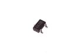 [VREG-SO23-X-V33D-AD   SMD (SOT-23) 3.3v Voltage Regulator 250 mA](VREG-SO23-X-V33D-AD/) [VS332](VREG-SO23-X-V33D-AD/)|
| [VREG-SO235-U-V33D-AC    SMD (SOT-23-5) 3.3v Voltage Regulator 150 mA ](VREG-SO235-U-V33D-AC/) [VS533](VREG-SO235-U-V33D-AC/)| [VREG-SO235-X-ADJU-AB   SMD (SOT-23-5) Adjustable Voltage Regulator 1.2 A](VREG-SO235-X-ADJU-AB/) [VS5AB](VREG-SO235-X-ADJU-AB/)| [VREG-SO235-X-BOS5-A5D   SMD (SOT-23-5) 5v Boost Voltage Regulator 500 mA](VREG-SO235-X-BOS5-A5D/) [VS25B](VREG-SO235-X-BOS5-A5D/)| [VREG-SO235-X-KAP2112K-V33D   SMD (SOT-23-5) AP2112K Voltage Regulator 3.3v](VREG-SO235-X-KAP2112K-V33D/) [V235AP2112K33](VREG-SO235-X-KAP2112K-V33D/)|
| [VREG-SO235-X-LP298XS-V33D   SMD (SOT-23-5) Voltage Regulator 3.3v](VREG-SO235-X-LP298XS-V33D/) [V235LP298XS33](VREG-SO235-X-LP298XS-V33D/)| [VREG-SO235-X-KMIC5205-V5   SMD (SOT-23-5) MIC5205 Voltage Regulator 5v](VREG-SO235-X-KMIC5205-V5/) [V235MIC52055](VREG-SO235-X-KMIC5205-V5/)| [VREG-SO235-X-KMIC5225-V33D   SMD (SOT-23-5) MIC5225 Voltage Regulator 3.3v](VREG-SO235-X-KMIC5225-V33D/) [V235MIC522533](VREG-SO235-X-KMIC5225-V33D/)| [VREG-SO235-X-V33D-A5D   SMD (SOT-23-5) 3.3v Voltage Regulator 500 mA](VREG-SO235-X-V33D-A5D/) [VS5335](VREG-SO235-X-V33D-A5D/)|
| [VREG-SO235-X-V33D-AC   SMD (SOT-23-5) 3.3v Voltage Regulator 150 mA](VREG-SO235-X-V33D-AC/) [VS533](VREG-SO235-X-V33D-AC/)| [VREG-SO236-X-ADJU-AE   SMD (SOT-23-6) Adjustable Voltage Regulator 200 mA](VREG-SO236-X-ADJU-AE/) [VS36A](VREG-SO236-X-ADJU-AE/)| [VREG-SO238-X-ADJU-A2   SMD (SOT-23-8) Adjustable Voltage Regulator 2 A](VREG-SO238-X-ADJU-A2/) [VS8A2](VREG-SO238-X-ADJU-A2/)| [VREG-SO89-X-V33D-A1   SMD (SOT-89) 3.3v Voltage Regulator 1 A](VREG-SO89-X-V33D-A1/) [VS831](VREG-SO89-X-V33D-A1/)|
| [VREG-SP08-X-V36D-A2   8 Pin SMD (SOP) 3.6v Voltage Regulator 2 A](VREG-SP08-X-V36D-A2/) [VS836](VREG-SP08-X-V36D-A2/)| [VREG-T220-X-V05-A1   TO-220 5v Voltage Regulator 1 A](VREG-T220-X-V05-A1/) [VT251](VREG-T220-X-V05-A1/)|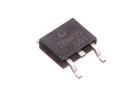 [VREG-T252-X-V05-A5D   TO-252 5v Voltage Regulator 500 mA](VREG-T252-X-V05-A5D/) [VT555](VREG-T252-X-V05-A5D/)| [VREG-T92-X-ADJU-AH   TO-92 Adjustable Voltage Regulator 100 mA](VREG-T92-X-ADJU-AH/) [V92A](VREG-T92-X-ADJU-AH/)|
|||||

## WIRS > Stranded Wire
  

| [WIRS-G28-B-STAN-01   28 AWG Black Stranded Wire](WIRS-G28-B-STAN-01/) [W2B](WIRS-G28-B-STAN-01/)| [WIRS-G28-E-STAN-01   28 AWG Grey Stranded Wire](WIRS-G28-E-STAN-01/) [W2E](WIRS-G28-E-STAN-01/)| [WIRS-G28-G-STAN-01   28 AWG Green Stranded Wire](WIRS-G28-G-STAN-01/) [W2G](WIRS-G28-G-STAN-01/)| [WIRS-G28-L-STAN-01   28 AWG Blue Stranded Wire](WIRS-G28-L-STAN-01/) [W2L](WIRS-G28-L-STAN-01/)|
| :---: | :---: | :---: | :---: |
| [WIRS-G28-N-STAN-01   28 AWG Brown Stranded Wire](WIRS-G28-N-STAN-01/) [W2N](WIRS-G28-N-STAN-01/)| [WIRS-G28-O-STAN-01   28 AWG Orange Stranded Wire](WIRS-G28-O-STAN-01/) [W2O](WIRS-G28-O-STAN-01/)| [WIRS-G28-R-STAN-01   28 AWG Red Stranded Wire](WIRS-G28-R-STAN-01/) [W2R](WIRS-G28-R-STAN-01/)| [WIRS-G28-V-STAN-01   28 AWG Purple Stranded Wire](WIRS-G28-V-STAN-01/) [W2V](WIRS-G28-V-STAN-01/)|
| [WIRS-G28-W-STAN-01   28 AWG White Stranded Wire](WIRS-G28-W-STAN-01/) [W2W](WIRS-G28-W-STAN-01/)| [WIRS-G28-Y-STAN-01   28 AWG Yellow Stranded Wire](WIRS-G28-Y-STAN-01/) [W2Y](WIRS-G28-Y-STAN-01/)|||

## XTAL > Crystal
  

| [XTAL-0805-X-KZ327D-01   SMD (0805) 32.768 kHz Crystal](XTAL-0805-X-KZ327D-01/) [X85K327D](XTAL-0805-X-KZ327D-01/)| [XTAL-11-X-MZ16-01   11 mm 16 MHz Crystal](XTAL-11-X-MZ16-01/) [XT16](XTAL-11-X-MZ16-01/)| [XTAL-11-X-MZ25-01   11 mm 25 MHz Crystal](XTAL-11-X-MZ25-01/) [XT25](XTAL-11-X-MZ25-01/)| [XTAL-11-X-MZ8-01   11 mm 8 MHz Crystal](XTAL-11-X-MZ8-01/) [XT8](XTAL-11-X-MZ8-01/)|
| :---: | :---: | :---: | :---: |
| [XTAL-3215-X-KZ327D-01   SMD (3215) 32.768 kHz Crystal](XTAL-3215-X-KZ327D-01/) [X3K327D](XTAL-3215-X-KZ327D-01/)| [XTAL-3215-X-MZ8-01   SMD (3215) 8 MHz Crystal](XTAL-3215-X-MZ8-01/) [XS38](XTAL-3215-X-MZ8-01/)| [XTAL-5032-X-MZ12-01   SMD (5032) 12 MHz Crystal](XTAL-5032-X-MZ12-01/) [XS512](XTAL-5032-X-MZ12-01/)| [XTAL-5032-X-MZ16-01   SMD (5032) 16 MHz Crystal](XTAL-5032-X-MZ16-01/) [XS516](XTAL-5032-X-MZ16-01/)|
| [XTAL-5032-X-MZ8-01   SMD (5032) 8 MHz Crystal](XTAL-5032-X-MZ8-01/) [XS58](XTAL-5032-X-MZ8-01/)||||
