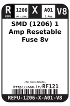

Contents
========

* [RF121 > SMD (1206) 1 Amp Resetable Fuse 8v](#rf121--smd-1206-1-amp-resetable-fuse-8v)
	* [Datasheets](#datasheets)
	* [Labels](#labels)
	* [EDA](#eda)
	* [Images](#images)
	* [Tags](#tags)
  
![][im]
# RF121 > SMD (1206) 1 Amp Resetable Fuse 8v

- ID: REFU-1206-X-A01-V8
- Hex ID: RF121
- Name: SMD (1206) 1 Amp Resetable Fuse 8v
- Description: SMD (1206) 1 Amp Resetable Fuse 8v
- Long Link: [http://oom.lt/REFU-1206-X-A01-V8](http://oom.lt/REFU-1206-X-A01-V8)
- Short Link: [http://oom.lt/RF121](http://oom.lt/RF121)

## Datasheets

- Datasheet: [datasheet.pdf](datasheet.pdf)

## Labels
  
  

|label-front|label-inventory|label-spec|
| :---: | :---: | :---: |
||||

## EDA

### Symbols

## Images
  
  

|image|label-front|label-inventory|label-spec|
| :---: | :---: | :---: | :---: |
|||||

## Tags

- oompID: REFU-1206-X-A01-V8
- name: SMD (1206) 1 Amp Resetable Fuse 8v
- hexID: RF121
- oompSort: 
- oompClass: Surface Mount
- oompClassCode: SMDS
- oompType: REFU
- oompSize: 1206
- oompColor: X
- oompDesc: A01
- oompIndex: V8
- oompVersion: 40
- oompBbls: template;XXXX-1206-X-XXXX-XX-bbls
- oompDiag: template;XXXX-1206-X-XXXX-XX-diag
- oompIden: template;XXXX-1206-X-XXXX-XX-iden
- oompSchem: template;REFU-XXXX-X-XXXX-XX-schem
- oompSimp: template;XXXX-1206-X-XXXX-XX-simp
- ooDesignator: F1

[im]: image_450.jpg
