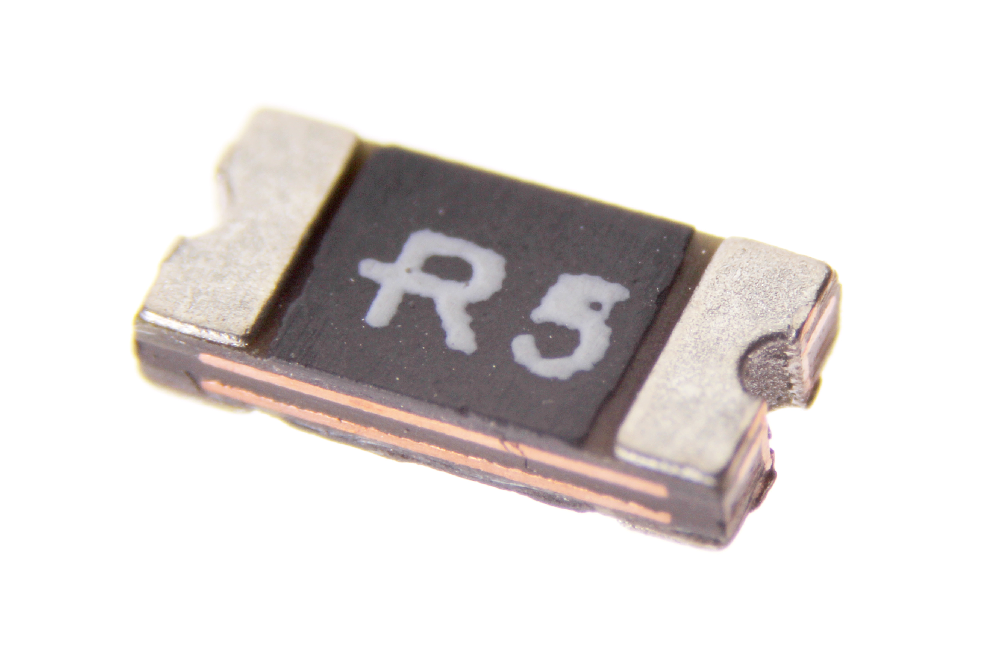
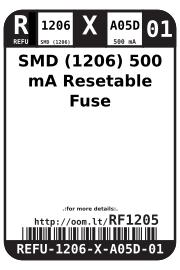

Contents
========

* [REFU-1206-X-A05D-01>SMD (1206) 500 mA Resetable Fuse](#refu-1206-x-a05d-01smd-1206-500-ma-resetable-fuse)
	* [Images](#images)
	* [Datasheets](#datasheets)
	* [Labels](#labels)
	* [EDA](#eda)
		* [Symbols](#symbols)
	* [Tags](#tags)
  
![][im]
# REFU-1206-X-A05D-01>SMD (1206) 500 mA Resetable Fuse

- ID: REFU-1206-X-A05D-01
- Name: REFU-1206-X-A05D-01

## Images
  
  

|Main|
| :---: |
||

## Datasheets

- Datasheet: [datasheet.pdf](datasheet.pdf)

## Labels
  
  

|Front|Inventory|Specifications|
| :---: | :---: | :---: |
||||

## EDA

### Symbols

## Tags

- hexID: RF1205
- oompSort: 
- oompClass: Surface Mount
- oompClassCode: SMDS
- oompType: REFU
- oompSize: 1206
- oompColor: X
- oompDesc: A05D
- oompIndex: 01
- oompVersion: 40
- oompBbls: template;XXXX-1206-X-XXXX-XX-bbls
- oompDiag: template;XXXX-1206-X-XXXX-XX-diag
- oompIden: template;XXXX-1206-X-XXXX-XX-iden
- oompSchem: template;REFU-XXXX-X-XXXX-XX-schem
- oompSimp: template;XXXX-1206-X-XXXX-XX-simp
- ooDesignator: F1

[im]: image_600.jpg
