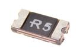

Contents
========

* [RF1205 > SMD (1206) 500 mA Resetable Fuse](#rf1205--smd-1206-500-ma-resetable-fuse)
	* [Datasheets](#datasheets)
	* [Labels](#labels)
	* [EDA](#eda)
	* [Images](#images)
	* [Tags](#tags)
  
![][im]
# RF1205 > SMD (1206) 500 mA Resetable Fuse

- ID: REFU-1206-X-A05D-01
- Hex ID: RF1205
- Name: SMD (1206) 500 mA Resetable Fuse
- Description: SMD (1206) 500 mA Resetable Fuse
- Long Link: [http://oom.lt/REFU-1206-X-A05D-01](http://oom.lt/REFU-1206-X-A05D-01)
- Short Link: [http://oom.lt/RF1205](http://oom.lt/RF1205)

## Datasheets

- Datasheet: [datasheet.pdf](datasheet.pdf)

## Labels
  
  

|label-front|label-inventory|label-spec|
| :---: | :---: | :---: |
||||

## EDA

### Symbols

## Images
  
  

|image|label-front|label-inventory|label-spec|
| :---: | :---: | :---: | :---: |
|||||

## Tags

- oompID: REFU-1206-X-A05D-01
- name: SMD (1206) 500 mA Resetable Fuse
- hexID: RF1205
- oompSort: 
- oompClass: Surface Mount
- oompClassCode: SMDS
- oompType: REFU
- oompSize: 1206
- oompColor: X
- oompDesc: A05D
- oompIndex: 01
- oompVersion: 40
- oompBbls: template;XXXX-1206-X-XXXX-XX-bbls
- oompDiag: template;XXXX-1206-X-XXXX-XX-diag
- oompIden: template;XXXX-1206-X-XXXX-XX-iden
- oompSchem: template;REFU-XXXX-X-XXXX-XX-schem
- oompSimp: template;XXXX-1206-X-XXXX-XX-simp
- ooDesignator: F1

[im]: image_450.jpg
