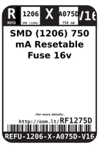
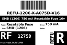

Contents
========

* [RF1275D > SMD (1206) 750 mA Resetable Fuse 16v](#rf1275d--smd-1206-750-ma-resetable-fuse-16v)
	* [Datasheets](#datasheets)
	* [Labels](#labels)
	* [EDA](#eda)
	* [Images](#images)
	* [Tags](#tags)

# RF1275D > SMD (1206) 750 mA Resetable Fuse 16v

- ID: REFU-1206-X-A075D-V16
- Hex ID: RF1275D
- Name: SMD (1206) 750 mA Resetable Fuse 16v
- Description: SMD (1206) 750 mA Resetable Fuse 16v
- Long Link: [http://oom.lt/REFU-1206-X-A075D-V16](http://oom.lt/REFU-1206-X-A075D-V16)
- Short Link: [http://oom.lt/RF1275D](http://oom.lt/RF1275D)

## Datasheets

- Datasheet: [datasheet.pdf](datasheet.pdf)

## Labels
  
  

|label-front|label-inventory|label-spec|
| :---: | :---: | :---: |
||||

## EDA

### Symbols

## Images
  
  

|label-front|label-inventory|label-spec|
| :---: | :---: | :---: |
||||

## Tags

- oompID: REFU-1206-X-A075D-V16
- name: SMD (1206) 750 mA Resetable Fuse 16v
- hexID: RF1275D
- oompSort: REFU1206A075D
- oompType: REFU
- oompSize: 1206
- oompColor: X
- oompDesc: A075D
- oompIndex: V16
- oompVersion: 98
- oompBbls: template;XXXX-1206-X-XXXX-XX-bbls
- oompDiag: template;XXXX-1206-X-XXXX-XX-diag
- oompIden: template;XXXX-1206-X-XXXX-XX-iden
- oompSchem: template;REFU-XXXX-X-XXXX-XX-schem
- oompSimp: template;XXXX-1206-X-XXXX-XX-simp
- ooDesignator: F1
