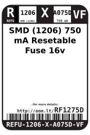
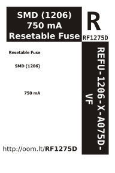

Contents
========

* [REFU-1206-X-A075D-VF>SMD (1206) 750 mA Resetable Fuse](#refu-1206-x-a075d-vfsmd-1206-750-ma-resetable-fuse)
	* [Datasheets](#datasheets)
	* [Labels](#labels)
	* [EDA](#eda)
		* [Symbols](#symbols)
	* [Tags](#tags)

# REFU-1206-X-A075D-VF>SMD (1206) 750 mA Resetable Fuse

- ID: REFU-1206-X-A075D-VF
- Name: REFU-1206-X-A075D-VF

## Datasheets

- Datasheet: [datasheet.pdf](datasheet.pdf)

## Labels
  
  

|Front|Inventory|Specifications|
| :---: | :---: | :---: |
||||

## EDA

### Symbols

## Tags

- hexID: RF1275D
- oompSort: REFU1206A075D
- oompType: REFU
- oompSize: 1206
- oompColor: X
- oompDesc: A075D
- oompIndex: VF
- oompVersion: 98
- oompBbls: template;XXXX-1206-X-XXXX-XX-bbls
- oompDiag: template;XXXX-1206-X-XXXX-XX-diag
- oompIden: template;XXXX-1206-X-XXXX-XX-iden
- oompSchem: template;REFU-XXXX-X-XXXX-XX-schem
- oompSimp: template;XXXX-1206-X-XXXX-XX-simp
- ooDesignator: F1
