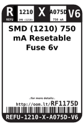
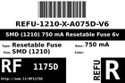
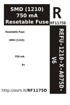
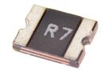

Contents
========

* [RF1175D > SMD (1210) 750 mA Resetable Fuse 6v](#rf1175d--smd-1210-750-ma-resetable-fuse-6v)
	* [Datasheets](#datasheets)
	* [Labels](#labels)
	* [EDA](#eda)
	* [Images](#images)
	* [Tags](#tags)
  
![][im]
# RF1175D > SMD (1210) 750 mA Resetable Fuse 6v

- ID: REFU-1210-X-A075D-V6
- Hex ID: RF1175D
- Name: SMD (1210) 750 mA Resetable Fuse 6v
- Description: SMD (1210) 750 mA Resetable Fuse 6v
- Long Link: [http://oom.lt/REFU-1210-X-A075D-V6](http://oom.lt/REFU-1210-X-A075D-V6)
- Long Link: [http://oom.lt/RF1175D](http://oom.lt/RF1175D)

## Datasheets

- Datasheet: [datasheet.pdf](datasheet.pdf)

## Labels
  
  

|label-front|label-inventory|label-spec|
| :---: | :---: | :---: |
||||

## EDA

### Symbols

## Images
  
  

|image|label-front|label-inventory|label-spec|
| :---: | :---: | :---: | :---: |
|||||

## Tags

- oompID: REFU-1210-X-A075D-V6
- name: SMD (1210) 750 mA Resetable Fuse 6v
- hexID: RF1175D
- oompSort: 
- oompClass: Surface Mount
- oompClassCode: SMDS
- oompType: REFU
- oompSize: 1210
- oompColor: X
- oompDesc: A075D
- oompIndex: V6
- oompVersion: 40
- oompSchem: template;REFU-XXXX-X-XXXX-XX-schem
- ooDesignator: F1

[im]: image_450.jpg
