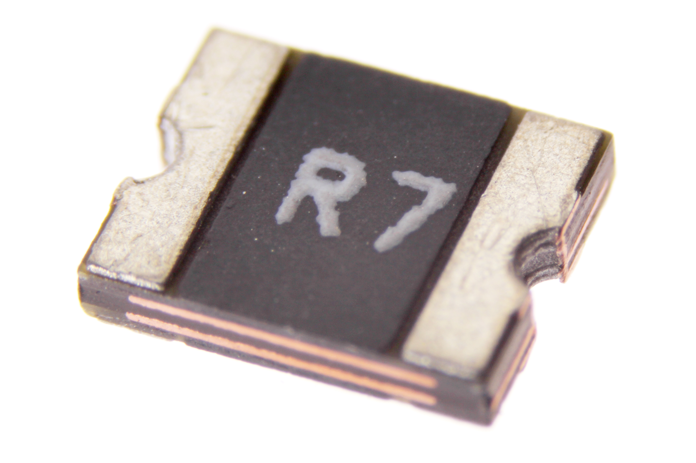

Contents
========

* [REFU-1210-X-A075D-V6>SMD (1210) 750 mA Resetable Fuse 6v](#refu-1210-x-a075d-v6smd-1210-750-ma-resetable-fuse-6v)
	* [Images](#images)
	* [Datasheets](#datasheets)
	* [EDA](#eda)
		* [Footprints](#footprints)
		* [Symbols](#symbols)
	* [Tags](#tags)
  
![][im]
# REFU-1210-X-A075D-V6>SMD (1210) 750 mA Resetable Fuse 6v

- ID: REFU-1210-X-A075D-V6
- Name: REFU-1210-X-A075D-V6

## Images
  
  

|Main|
| :---: |
||

## Datasheets

- Datasheet: [datasheet.pdf](datasheet.pdf)

## EDA

### Footprints
  

|||||
| :---: | :---: | :---: | :---: |

### Symbols

## Tags

- index: 449
- oompID: REFU-1210-X-A075D-V6
- name: SMD (1210) 750 mA Resetable Fuse 6v
- hexID: RF1175D
- oompSort: 
- oompClass: Surface Mount
- oompClassCode: SMDS
- oompType: REFU
- oompSize: 1210
- oompColor: X
- oompDesc: A075D
- oompIndex: V6
- oompVersion: 40
- oompSchem: template;REFU-XXXX-X-XXXX-XX-schem
- ooDesignator: F1

[im]: image_600.jpg
