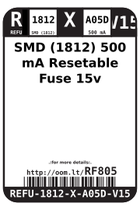
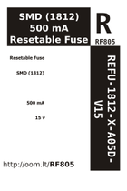

Contents
========

* [RF805 > SMD (1812) 500 mA Resetable Fuse 15v](#rf805--smd-1812-500-ma-resetable-fuse-15v)
	* [Datasheets](#datasheets)
	* [Labels](#labels)
	* [EDA](#eda)
	* [Images](#images)
	* [Tags](#tags)
  
![][im]
# RF805 > SMD (1812) 500 mA Resetable Fuse 15v

- ID: REFU-1812-X-A05D-V15
- Hex ID: RF805
- Name: SMD (1812) 500 mA Resetable Fuse 15v
- Description: SMD (1812) 500 mA Resetable Fuse 15v
- Long Link: [http://oom.lt/REFU-1812-X-A05D-V15](http://oom.lt/REFU-1812-X-A05D-V15)
- Short Link: [http://oom.lt/RF805](http://oom.lt/RF805)

## Datasheets

- Datasheet: [datasheet.pdf](datasheet.pdf)

## Labels
  
  

|label-front|label-inventory|label-spec|
| :---: | :---: | :---: |
||||

## EDA

## Images
  
  

|image|label-front|label-inventory|label-spec|
| :---: | :---: | :---: | :---: |
|||||

## Tags

- oompID: REFU-1812-X-A05D-V15
- name: SMD (1812) 500 mA Resetable Fuse 15v
- hexID: RF805
- oompSort: 181200.500
- oompType: REFU
- oompSize: 1812
- oompColor: X
- oompDesc: A05D
- oompIndex: V15
- oompVersion: 99
- ooWidth: 4.5 mm
- ooHeight: 0.75 mm
- ooLength: 3.25 mm
- com: SMD
- ooPackageMarking: 50##
- ooNumPins: 2
- oompClass: Surface Mount
- oompClassCode: SMDS
- oompSchem: template;REFU-XXXX-X-XXXX-XX-schem
- ooDesignator: F1

[im]: image_450.jpg
