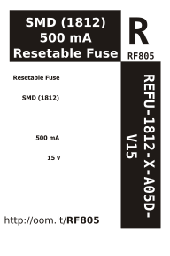

Contents
========

* [REFU-1812-X-A05D-V15>SMD (1812) 500 mA Resetable Fuse 15v](#refu-1812-x-a05d-v15smd-1812-500-ma-resetable-fuse-15v)
	* [Images](#images)
	* [Datasheets](#datasheets)
	* [Labels](#labels)
	* [EDA](#eda)
		* [Symbols](#symbols)
	* [Tags](#tags)
  
![][im]
# REFU-1812-X-A05D-V15>SMD (1812) 500 mA Resetable Fuse 15v

- ID: REFU-1812-X-A05D-V15
- Name: REFU-1812-X-A05D-V15

## Images
  
  

|Main|
| :---: |
||

## Datasheets

- Datasheet: [datasheet.pdf](datasheet.pdf)

## Labels
  
  

|Front|Inventory|Specifications|
| :---: | :---: | :---: |
||||

## EDA

### Symbols

## Tags

- index: 12749
- index: 4274
- oompID: REFU-1812-X-A05D-V15
- name: SMD (1812) 500 mA Resetable Fuse 15v
- hexID: RF805
- oompSort: 181200.500
- oompType: REFU
- oompSize: 1812
- oompColor: X
- oompDesc: A05D
- oompIndex: V15
- oompVersion: 99
- ooWidth: 4.5 mm
- ooHeight: 0.75 mm
- ooLength: 3.25 mm
- com: SMD
- ooPackageMarking: 50##
- ooNumPins: 2
- oompClass: Surface Mount
- oompClassCode: SMDS
- oompSchem: template;REFU-XXXX-X-XXXX-XX-schem
- ooDesignator: F1

[im]: image_600.jpg
