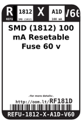
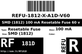
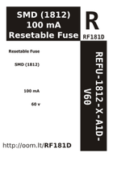

Contents
========

* [RF181D > SMD (1812) 100 mA Resetable Fuse 60 v](#rf181d--smd-1812-100-ma-resetable-fuse-60-v)
	* [Labels](#labels)
	* [EDA](#eda)
	* [Images](#images)
	* [Tags](#tags)

# RF181D > SMD (1812) 100 mA Resetable Fuse 60 v

- ID: REFU-1812-X-A1D-V60
- Hex ID: RF181D
- Name: SMD (1812) 100 mA Resetable Fuse 60 v
- Description: SMD (1812) 100 mA Resetable Fuse 60 v
- Long Link: [http://oom.lt/REFU-1812-X-A1D-V60](http://oom.lt/REFU-1812-X-A1D-V60)
- Short Link: [http://oom.lt/RF181D](http://oom.lt/RF181D)

## Labels
  
  

|label-front|label-inventory|label-spec|
| :---: | :---: | :---: |
||||

## EDA

## Images
  
  

|label-front|label-inventory|label-spec|
| :---: | :---: | :---: |
||||

## Tags

- oompType: REFU
- oompSize: 1812
- oompColor: X
- oompDesc: A1D
- oompIndex: V60
- hexID: RF181D
- oompID: REFU-1812-X-A1D-V60
