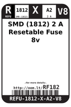
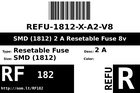
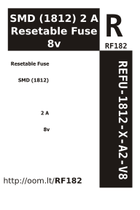

Contents
========

* [RF182 > ](#rf182--)
	* [Labels](#labels)
	* [EDA](#eda)
	* [Images](#images)
	* [Tags](#tags)

# RF182 > 

- ID: REFU-1812-X-A2-V8
- Hex ID: RF182
- Name: 
- Description: 
- Long Link: [http://oom.lt/REFU-1812-X-A2-V8](http://oom.lt/REFU-1812-X-A2-V8)
- Short Link: [http://oom.lt/RF182](http://oom.lt/RF182)

## Labels
  
  

|label-front|label-inventory|label-spec|
| :---: | :---: | :---: |
||||

## EDA

## Images
  
  

|label-front|label-inventory|label-spec|
| :---: | :---: | :---: |
||||

## Tags

- oompType: REFU
- oompSize: 1812
- oompColor: X
- oompDesc: A2
- oompIndex: V8
- hexID: RF182
- oompID: REFU-1812-X-A2-V8
