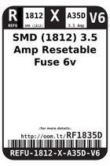
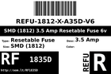
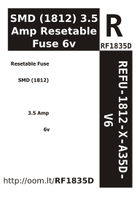

Contents
========

* [RF1835D > SMD (1812) 3.5 Amp Resetable Fuse 6v](#rf1835d--smd-1812-35-amp-resetable-fuse-6v)
	* [Labels](#labels)
	* [EDA](#eda)
	* [Images](#images)
	* [Tags](#tags)

# RF1835D > SMD (1812) 3.5 Amp Resetable Fuse 6v

- ID: REFU-1812-X-A35D-V6
- Hex ID: RF1835D
- Name: SMD (1812) 3.5 Amp Resetable Fuse 6v
- Description: SMD (1812) 3.5 Amp Resetable Fuse 6v
- Long Link: [http://oom.lt/REFU-1812-X-A35D-V6](http://oom.lt/REFU-1812-X-A35D-V6)
- Short Link: [http://oom.lt/RF1835D](http://oom.lt/RF1835D)

## Labels
  
  

|label-front|label-inventory|label-spec|
| :---: | :---: | :---: |
||||

## EDA

## Images
  
  

|label-front|label-inventory|label-spec|
| :---: | :---: | :---: |
||||

## Tags

- oompType: REFU
- oompSize: 1812
- oompColor: X
- oompDesc: A35D
- oompIndex: V6
- hexID: RF1835D
- oompID: REFU-1812-X-A35D-V6
