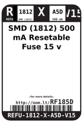
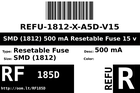
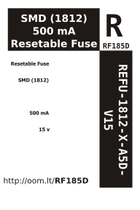

Contents
========

* [RF185D > SMD (1812) 500 mA Resetable Fuse 15 v](#rf185d--smd-1812-500-ma-resetable-fuse-15-v)
	* [Labels](#labels)
	* [EDA](#eda)
	* [Images](#images)
	* [Tags](#tags)

# RF185D > SMD (1812) 500 mA Resetable Fuse 15 v

- ID: REFU-1812-X-A5D-V15
- Hex ID: RF185D
- Name: SMD (1812) 500 mA Resetable Fuse 15 v
- Description: SMD (1812) 500 mA Resetable Fuse 15 v
- Long Link: [http://oom.lt/REFU-1812-X-A5D-V15](http://oom.lt/REFU-1812-X-A5D-V15)
- Short Link: [http://oom.lt/RF185D](http://oom.lt/RF185D)

## Labels
  
  

|label-front|label-inventory|label-spec|
| :---: | :---: | :---: |
||||

## EDA

## Images
  
  

|label-front|label-inventory|label-spec|
| :---: | :---: | :---: |
||||

## Tags

- oompType: REFU
- oompSize: 1812
- oompColor: X
- oompDesc: A5D
- oompIndex: V15
- hexID: RF185D
- oompID: REFU-1812-X-A5D-V15
