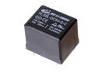

Contents
========

* [RL19S > 19 x 15 mm SPDT Relay](#rl19s--19-x-15-mm-spdt-relay)
	* [Images](#images)
	* [Datasheets](#datasheets)
	* [Labels](#labels)
	* [EDA](#eda)
	* [Tags](#tags)
  
![][im]
# RL19S > 19 x 15 mm SPDT Relay

- ID: RELA-19X15-X-SPDT-V5
- Hex ID: RL19S
- Name: 19 x 15 mm SPDT Relay
- Description: 19 x 15 mm SPDT Relay

## Images
  
  

|image|image_RE|image_BOTTOM|label-front|label-inventory|label-spec|
| :---: | :---: | :---: | :---: | :---: | :---: |
|||||||

## Datasheets

- Datasheet: [datasheet.pdf](datasheet.pdf)

## Labels
  
  

|label-front|label-inventory|label-spec|
| :---: | :---: | :---: |
||||

## EDA

### Symbols

## Tags

- oompID: RELA-19X15-X-SPDT-V5
- name: 19 x 15 mm SPDT Relay
- hexID: RL19S
- oompSort: 
- oompClass: Through Hole
- oompClassCode: THTH
- oompType: RELA
- oompSize: 19X15
- oompColor: X
- oompDesc: SPDT
- oompIndex: V5
- oompVersion: 40
- ooDesignator: K1

[im]: image_450.jpg
