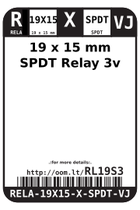
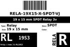
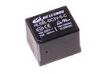

Contents
========

* [RL19S3 > 19 x 15 mm SPDT Relay 3v](#rl19s3--19-x-15-mm-spdt-relay-3v)
	* [Datasheets](#datasheets)
	* [Labels](#labels)
	* [EDA](#eda)
	* [Images](#images)
	* [Tags](#tags)
  
![][im]
# RL19S3 > 19 x 15 mm SPDT Relay 3v

- ID: RELA-19X15-X-SPDT-VJ
- Hex ID: RL19S3
- Name: 19 x 15 mm SPDT Relay 3v
- Description: 19 x 15 mm SPDT Relay 3v
- Long Link: [http://oom.lt/RELA-19X15-X-SPDT-VJ](http://oom.lt/RELA-19X15-X-SPDT-VJ)
- Short Link: [http://oom.lt/RL19S3](http://oom.lt/RL19S3)

## Datasheets

- Datasheet: [datasheet.pdf](datasheet.pdf)

## Labels
  
  

|label-front|label-inventory|label-spec|
| :---: | :---: | :---: |
||||

## EDA

### Symbols

## Images
  
  

|image|image_RE|label-front|label-inventory|label-spec|
| :---: | :---: | :---: | :---: | :---: |
||||||

## Tags

- oompID: RELA-19X15-X-SPDT-VJ
- name: 19 x 15 mm SPDT Relay 3v
- hexID: RL19S3
- oompSort: RELA19X15SPDT
- oompType: RELA
- oompSize: 19X15
- oompColor: X
- oompDesc: SPDT
- oompIndex: VJ
- oompVersion: 98
- ooWidth: 19 mm
- ooHeight: 15 mm
- ooDesignator: K

[im]: image_450.jpg
