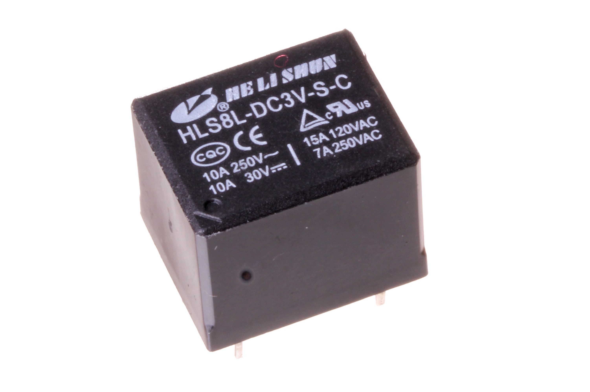
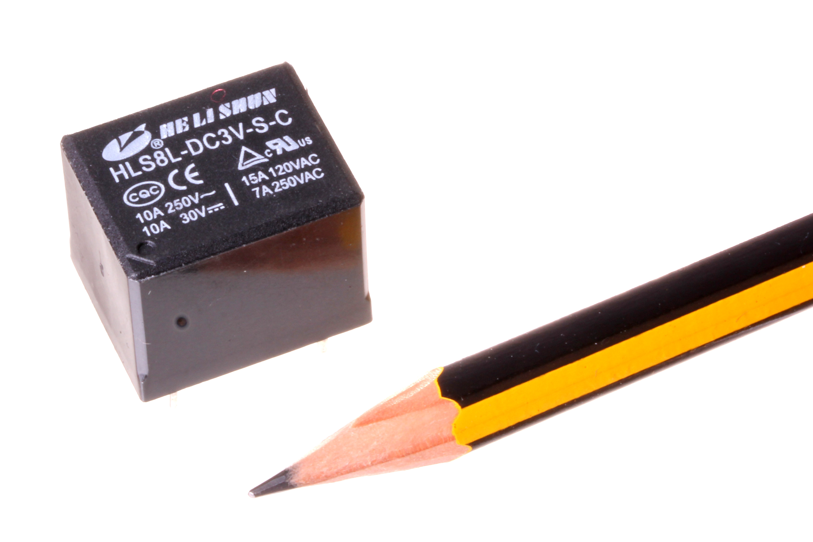
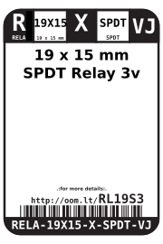
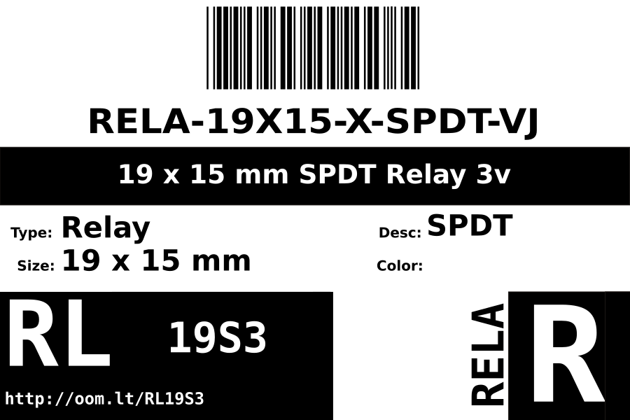
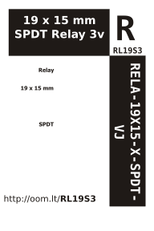

Contents
========

* [RELA-19X15-X-SPDT-VJ>19 x 15 mm SPDT Relay 3v](#rela-19x15-x-spdt-vj19-x-15-mm-spdt-relay-3v)
	* [Images](#images)
	* [Datasheets](#datasheets)
	* [Labels](#labels)
	* [EDA](#eda)
		* [Symbols](#symbols)
	* [Tags](#tags)
  
![][im]
# RELA-19X15-X-SPDT-VJ>19 x 15 mm SPDT Relay 3v

- ID: RELA-19X15-X-SPDT-VJ
- Name: RELA-19X15-X-SPDT-VJ

## Images
  
  

|Main|Reference|
| :---: | :---: |
|||

## Datasheets

- Datasheet: [datasheet.pdf](datasheet.pdf)

## Labels
  
  

|Front|Inventory|Specifications|
| :---: | :---: | :---: |
||||

## EDA

### Symbols

## Tags

- index: 453
- oompID: RELA-19X15-X-SPDT-VJ
- name: 19 x 15 mm SPDT Relay 3v
- hexID: RL19S3
- oompSort: RELA19X15SPDT
- oompType: RELA
- oompSize: 19X15
- oompColor: X
- oompDesc: SPDT
- oompIndex: VJ
- oompVersion: 98
- ooWidth: 19 mm
- ooHeight: 15 mm
- ooDesignator: K

[im]: image_600.jpg
