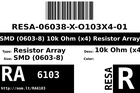
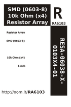

Contents
========

* [RA6103 > ](#ra6103--)
	* [Labels](#labels)
	* [EDA](#eda)
	* [Images](#images)
	* [Tags](#tags)

# RA6103 > 

- ID: RESA-06038-X-O103X4-01
- Hex ID: RA6103
- Name: 
- Description: 
- Long Link: [http://oom.lt/RESA-06038-X-O103X4-01](http://oom.lt/RESA-06038-X-O103X4-01)
- Short Link: [http://oom.lt/RA6103](http://oom.lt/RA6103)

## Labels
  
  

|label-front|label-inventory|label-spec|
| :---: | :---: | :---: |
||||

## EDA

## Images
  
  

|label-front|label-inventory|label-spec|
| :---: | :---: | :---: |
||||

## Tags

- oompType: RESA
- oompSize: 06038
- oompColor: X
- oompDesc: O103X4
- oompIndex: 01
- hexID: RA6103
- oompID: RESA-06038-X-O103X4-01
