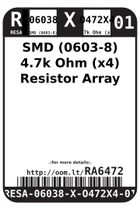
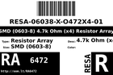
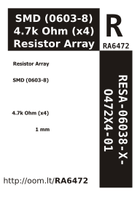

Contents
========

* [RA6472 > SMD (0603-8) 4.7k Ohm (x4) Resistor Array](#ra6472--smd-0603-8-47k-ohm-x4-resistor-array)
	* [Labels](#labels)
	* [EDA](#eda)
	* [Images](#images)
	* [Tags](#tags)

# RA6472 > SMD (0603-8) 4.7k Ohm (x4) Resistor Array

- ID: RESA-06038-X-O472X4-01
- Hex ID: RA6472
- Name: SMD (0603-8) 4.7k Ohm (x4) Resistor Array
- Description: SMD (0603-8) 4.7k Ohm (x4) Resistor Array
- Long Link: [http://oom.lt/RESA-06038-X-O472X4-01](http://oom.lt/RESA-06038-X-O472X4-01)
- Short Link: [http://oom.lt/RA6472](http://oom.lt/RA6472)

## Labels
  
  

|label-front|label-inventory|label-spec|
| :---: | :---: | :---: |
||||

## EDA

## Images
  
  

|label-front|label-inventory|label-spec|
| :---: | :---: | :---: |
||||

## Tags

- oompType: RESA
- oompSize: 06038
- oompColor: X
- oompDesc: O472X4
- oompIndex: 01
- hexID: RA6472
- oompID: RESA-06038-X-O472X4-01
