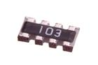

Contents
========

* [RA12103 > ](#ra12103--)
	* [Datasheets](#datasheets)
	* [Labels](#labels)
	* [EDA](#eda)
	* [Images](#images)
	* [Tags](#tags)
  
![][im]
# RA12103 > 

- ID: RESA-12068-X-O103X4-01
- Hex ID: RA12103
- Name: 
- Description: 
- Long Link: [http://oom.lt/RESA-12068-X-O103X4-01](http://oom.lt/RESA-12068-X-O103X4-01)
- Short Link: [http://oom.lt/RA12103](http://oom.lt/RA12103)

## Datasheets

- Datasheet: [datasheet.pdf](datasheet.pdf)

## Labels
  
  

|label-front|label-inventory|label-spec|
| :---: | :---: | :---: |
||||

## EDA

## Images
  
  

|image|label-front|label-inventory|label-spec|
| :---: | :---: | :---: | :---: |
|||||

## Tags

- oompType: RESA
- oompSize: 12068
- oompColor: X
- oompDesc: O103X4
- oompIndex: 01
- hexID: RA12103
- oompID: RESA-12068-X-O103X4-01

[im]: image_450.jpg
