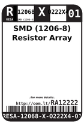
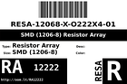
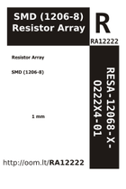

Contents
========

* [RA12222 > SMD (1206-8) Resistor Array](#ra12222--smd-1206-8-resistor-array)
	* [Labels](#labels)
	* [EDA](#eda)
	* [Images](#images)
	* [Tags](#tags)

# RA12222 > SMD (1206-8) Resistor Array

- ID: RESA-12068-X-O222X4-01
- Hex ID: RA12222
- Name: SMD (1206-8) Resistor Array
- Description: SMD (1206-8) Resistor Array
- Long Link: [http://oom.lt/RESA-12068-X-O222X4-01](http://oom.lt/RESA-12068-X-O222X4-01)
- Short Link: [http://oom.lt/RA12222](http://oom.lt/RA12222)

## Labels
  
  

|label-front|label-inventory|label-spec|
| :---: | :---: | :---: |
||||

## EDA

## Images
  
  

|label-front|label-inventory|label-spec|
| :---: | :---: | :---: |
||||

## Tags

- oompType: RESA
- oompSize: 12068
- oompColor: X
- oompDesc: O222X4
- oompIndex: 01
- hexID: RA12222
- oompID: RESA-12068-X-O222X4-01
