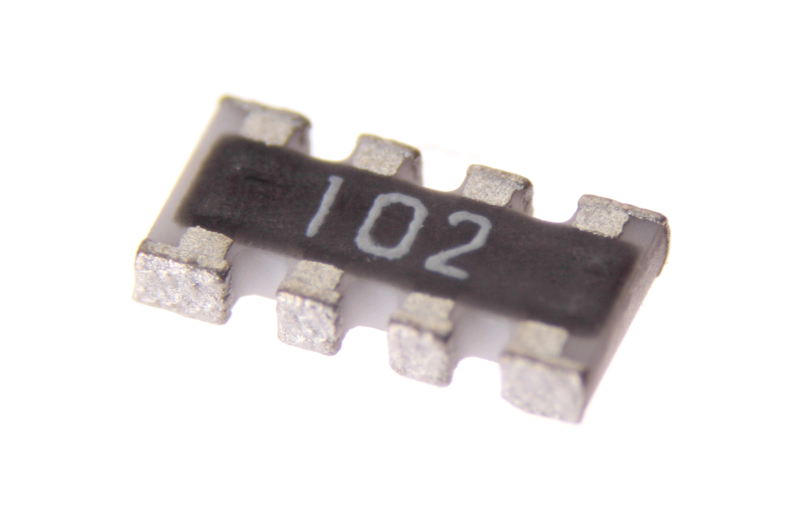
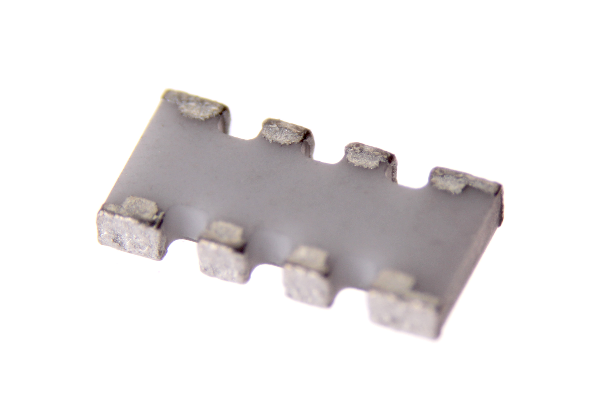

Contents
========

* [RESA-1268-X-O102X4-01>SMD (1206-8) 1k Ohm (x4) Resistor Array](#resa-1268-x-o102x4-01smd-1206-8-1k-ohm-x4-resistor-array)
	* [Images](#images)
	* [Datasheets](#datasheets)
	* [EDA](#eda)
		* [Symbols](#symbols)
	* [Tags](#tags)
  
![][im]
# RESA-1268-X-O102X4-01>SMD (1206-8) 1k Ohm (x4) Resistor Array

- ID: RESA-1268-X-O102X4-01
- Name: RESA-1268-X-O102X4-01

## Images
  
  

|Main|Bottom|
| :---: | :---: |
|||

## Datasheets

- Datasheet: [datasheet.pdf](datasheet.pdf)

## EDA

### Symbols

## Tags

- index: 454
- index: 9876
- oompID: RESA-1268-X-O102X4-01
- name: SMD (1206-8) 1k Ohm (x4) Resistor Array
- hexID: RA1102
- oompSort: 12680001000
- oompType: RESA
- oompSize: 1268
- oompColor: X
- oompDesc: O102X4
- oompIndex: 01
- oompVersion: 99
- oompSkip: true
- com: SMD
- ooPackageMarking: 102
- oompClass: Surface Mount
- oompClassCode: SMDS
- oompSchem: template;RESA-XXXX-X-XXX4-XX-schem
- ooDesignator: RN1

[im]: image_600.jpg
