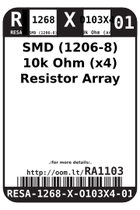
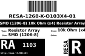
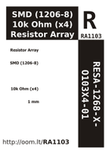

Contents
========

* [RA1103 > SMD (1206-8) 10k Ohm (x4) Resistor Array](#ra1103--smd-1206-8-10k-ohm-x4-resistor-array)
	* [Datasheets](#datasheets)
	* [Labels](#labels)
	* [EDA](#eda)
	* [Images](#images)
	* [Tags](#tags)
  
![][im]
# RA1103 > SMD (1206-8) 10k Ohm (x4) Resistor Array

- ID: RESA-1268-X-O103X4-01
- Hex ID: RA1103
- Name: SMD (1206-8) 10k Ohm (x4) Resistor Array
- Description: SMD (1206-8) 10k Ohm (x4) Resistor Array
- Long Link: [http://oom.lt/RESA-1268-X-O103X4-01](http://oom.lt/RESA-1268-X-O103X4-01)
- Short Link: [http://oom.lt/RA1103](http://oom.lt/RA1103)

## Datasheets

- Datasheet: [datasheet.pdf](datasheet.pdf)

## Labels
  
  

|label-front|label-inventory|label-spec|
| :---: | :---: | :---: |
||||

## EDA

### Symbols

## Images
  
  

|image|label-front|label-inventory|label-spec|
| :---: | :---: | :---: | :---: |
|||||

## Tags

- oompID: RESA-1268-X-O103X4-01
- name: SMD (1206-8) 10k Ohm (x4) Resistor Array
- hexID: RA1103
- oompSort: 12680010000
- oompType: RESA
- oompSize: 1268
- oompColor: X
- oompDesc: O103X4
- oompIndex: 01
- oompVersion: 99
- ooWidth: 1.6 mm
- ooLength: 3.2 mm
- com: SMD
- ooPackageMarking: 103
- ooNumPins: 8
- ooPowerRating: 62.5 mW
- ooTolerance: 5%
- oompAbout: This is a small (1206 size) component that houses 4 10k Ohm resistors. Great for saving space on a project.
- useID: 1
- importance: 1
- useTitle: Pullup Resistor
- useDescription: Used to hold a digital pin high. When you need more than one and would like to save space.
- oompClass: Surface Mount
- oompClassCode: SMDS
- oompSchem: template;RESA-XXXX-X-XXX4-XX-schem
- ooDesignator: RN1

[im]: image_450.jpg
