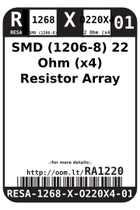
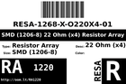
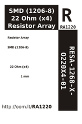

Contents
========

* [RA1220 > SMD (1206-8) 22 Ohm (x4) Resistor Array](#ra1220--smd-1206-8-22-ohm-x4-resistor-array)
	* [Datasheets](#datasheets)
	* [Labels](#labels)
	* [EDA](#eda)
	* [Images](#images)
	* [Tags](#tags)

# RA1220 > SMD (1206-8) 22 Ohm (x4) Resistor Array

- ID: RESA-1268-X-O220X4-01
- Hex ID: RA1220
- Name: SMD (1206-8) 22 Ohm (x4) Resistor Array
- Description: SMD (1206-8) 22 Ohm (x4) Resistor Array
- Long Link: [http://oom.lt/RESA-1268-X-O220X4-01](http://oom.lt/RESA-1268-X-O220X4-01)
- Long Link: [http://oom.lt/RA1220](http://oom.lt/RA1220)

## Datasheets

- Datasheet: [datasheet.pdf](datasheet.pdf)

## Labels
  
  

|label-front|label-inventory|label-spec|
| :---: | :---: | :---: |
||||

## EDA

### Symbols

## Images
  
  

|label-front|label-inventory|label-spec|
| :---: | :---: | :---: |
||||

## Tags

- oompID: RESA-1268-X-O220X4-01
- name: SMD (1206-8) 22 Ohm (x4) Resistor Array
- hexID: RA1220
- oompSort: 12680000022
- oompType: RESA
- oompSize: 1268
- oompColor: X
- oompDesc: O220X4
- oompIndex: 01
- oompVersion: 99
- oompSkip: true
- ooWidth: 3.2 mm
- ooHeight: 0.5 mm
- ooLength: 1.6 mm
- com: SMD
- ooPackageMarking: 220
- ooNumPins: 8
- oompSchem: template;RESA-XXXX-X-XXX4-XX-schem
- ooDesignator: RN1
