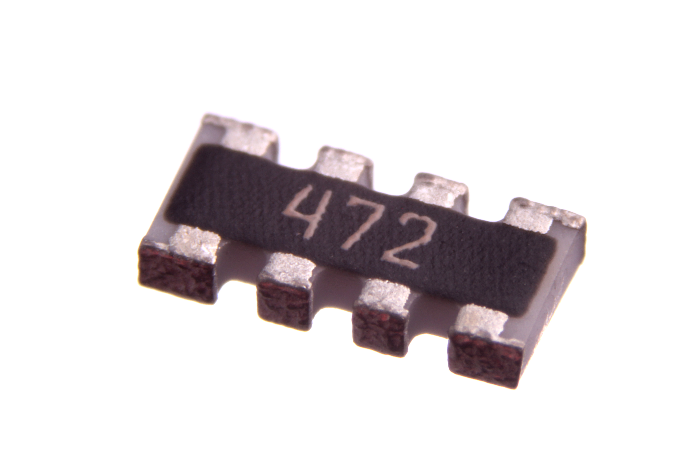
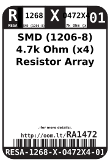
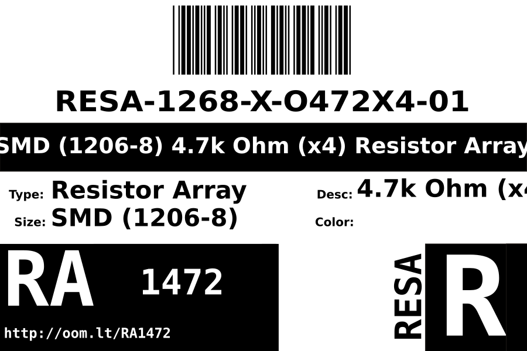
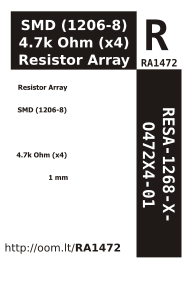

Contents
========

* [RESA-1268-X-O472X4-01>SMD (1206-8) 4.7k Ohm (x4) Resistor Array](#resa-1268-x-o472x4-01smd-1206-8-47k-ohm-x4-resistor-array)
	* [Images](#images)
	* [Datasheets](#datasheets)
	* [Labels](#labels)
	* [EDA](#eda)
		* [Symbols](#symbols)
	* [Tags](#tags)
  
![][im]
# RESA-1268-X-O472X4-01>SMD (1206-8) 4.7k Ohm (x4) Resistor Array

- ID: RESA-1268-X-O472X4-01
- Name: RESA-1268-X-O472X4-01

## Images
  
  

|Main|
| :---: |
||

## Datasheets

- Datasheet: [datasheet.pdf](datasheet.pdf)

## Labels
  
  

|Front|Inventory|Specifications|
| :---: | :---: | :---: |
||||

## EDA

### Symbols

## Tags

- index: 12756
- index: 4116
- oompID: RESA-1268-X-O472X4-01
- name: SMD (1206-8) 4.7k Ohm (x4) Resistor Array
- hexID: RA1472
- oompSort: 12680004700
- oompType: RESA
- oompSize: 1268
- oompColor: X
- oompDesc: O472X4
- oompIndex: 01
- oompVersion: 99
- ooWidth: 1.6 mm
- ooLength: 3.2 mm
- ooManufacturer: Yageo
- ooManufacturerPartNumber: YC164-JR-074K7L
- ooNumPins: 8
- ooPowerRating: 62.5 mW
- ooTolerance: 5%
- ooSEEEDsku: 0040040P1
- ooSEEEDdesc: SMD RES ARRAY 4.7K OHM 4 RES 1206	
- oompClass: Surface Mount
- oompClassCode: SMDS
- oompSchem: template;RESA-XXXX-X-XXX4-XX-schem
- ooDesignator: RN1

[im]: image_600.jpg
