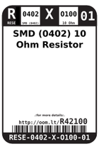

Contents
========

* [R42100 > SMD (0402) 10 Ohm Resistor](#r42100--smd-0402-10-ohm-resistor)
	* [Datasheets](#datasheets)
	* [Labels](#labels)
	* [EDA](#eda)
	* [Images](#images)
	* [Tags](#tags)
  
![][im]
# R42100 > SMD (0402) 10 Ohm Resistor

- ID: RESE-0402-X-O100-01
- Hex ID: R42100
- Name: SMD (0402) 10 Ohm Resistor
- Description: SMD (0402) 10 Ohm Resistor
- Long Link: [http://oom.lt/RESE-0402-X-O100-01](http://oom.lt/RESE-0402-X-O100-01)
- Short Link: [http://oom.lt/R42100](http://oom.lt/R42100)

## Datasheets

- Datasheet: [datasheet.pdf](datasheet.pdf)

## Labels
  
  

|label-front|label-inventory|label-spec|
| :---: | :---: | :---: |
||||

## EDA

### Instances
  
  
Used 4 times.  
Prevalance: (4\9905) 0.0404%  

|OOMP Instances|
| :---: |
|[PROJ-SPAR-10587-STAN-01  Music Instrument Shield  Used 1 times. R9](https://github.com/oomlout/oomlout_OOMP_projects/tree/main/PROJ-SPAR-10587-STAN-01/)|
|[PROJ-SPAR-10608-STAN-01  MP3 Breakout-VS1033D  Used 1 times. R7](https://github.com/oomlout/oomlout_OOMP_projects/tree/main/PROJ-SPAR-10608-STAN-01/)|
|[PROJ-SPAR-11013-STAN-01  LilyPad MP3 Player  Used 1 times. R12](https://github.com/oomlout/oomlout_OOMP_projects/tree/main/PROJ-SPAR-11013-STAN-01/)|
|[PROJ-SPAR-11684-STAN-01  MP3 Breakout-VS1063  Used 1 times. R7](https://github.com/oomlout/oomlout_OOMP_projects/tree/main/PROJ-SPAR-11684-STAN-01/)|

### Symbols

## Images
  
  

|image|image_BOTTOM|label-front|label-inventory|label-spec|
| :---: | :---: | :---: | :---: | :---: |
||||||

## Tags

- oompID: RESE-0402-X-O100-01
- hexID: R42100
- oompDesc: O100
- name: SMD (0402) 10 Ohm Resistor
- oompSort: RESE0402O100
- oompType: RESE
- oompSize: 0402
- oompColor: X
- oompIndex: 01
- oompVersion: 999
- ooWidth: 0.5mm
- ooHeight: 0.35mm
- ooLength: 1mm
- oompBbls: template;XXXX-0402-X-XXXX-XX-bbls
- oompDiag: template;XXXX-0402-X-XXXX-XX-diag
- oompIden: template;XXXX-0402-X-XXXX-XX-iden
- oompSchem: template;RESE-XXXX-X-XXXX-XX-schem
- oompSimp: template;XXXX-0402-X-XXXX-XX-simp
- ooDesignator: R1
- oompInstances: {'PROJECT': 'PROJ-SPAR-10587-STAN-01', 'ID': 'R9'}
- oompInstances: {'PROJECT': 'PROJ-SPAR-10608-STAN-01', 'ID': 'R7'}
- oompInstances: {'PROJECT': 'PROJ-SPAR-11013-STAN-01', 'ID': 'R12'}
- oompInstances: {'PROJECT': 'PROJ-SPAR-11684-STAN-01', 'ID': 'R7'}

[im]: image_450.jpg
