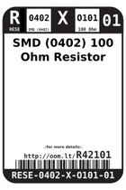
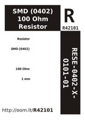

Contents
========

* [R42101 > SMD (0402) 100 Ohm Resistor](#r42101--smd-0402-100-ohm-resistor)
	* [Datasheets](#datasheets)
	* [Labels](#labels)
	* [EDA](#eda)
	* [Images](#images)
	* [Tags](#tags)
  
![][im]
# R42101 > SMD (0402) 100 Ohm Resistor

- ID: RESE-0402-X-O101-01
- Hex ID: R42101
- Name: SMD (0402) 100 Ohm Resistor
- Description: SMD (0402) 100 Ohm Resistor
- Long Link: [http://oom.lt/RESE-0402-X-O101-01](http://oom.lt/RESE-0402-X-O101-01)
- Short Link: [http://oom.lt/R42101](http://oom.lt/R42101)

## Datasheets

- Datasheet: [datasheet.pdf](datasheet.pdf)

## Labels
  
  

|label-front|label-inventory|label-spec|
| :---: | :---: | :---: |
||||

## EDA

### Instances
  
  
Used 7 times.  
Prevalance: (7\10986) 0.0637%  

|OOMP Instances|
| :---: |
|[PROJ-SPAR-10116-STAN-01  Arduino Fio  Used 1 times. R8](https://github.com/oomlout/oomlout_OOMP_projects/tree/main/PROJ-SPAR-10116-STAN-01/)|
|[PROJ-SPAR-10701-STAN-01  Color Light Sensor Evaluation Board  Used 1 times. R5](https://github.com/oomlout/oomlout_OOMP_projects/tree/main/PROJ-SPAR-10701-STAN-01/)|
|[PROJ-SPAR-10889-STAN-01  ProtoSnap-Pro Mini  Used 2 times. R5, R7](https://github.com/oomlout/oomlout_OOMP_projects/tree/main/PROJ-SPAR-10889-STAN-01/)|
|[PROJ-SPAR-11168-STAN-01  AVR ISP Shield  Used 1 times. R6](https://github.com/oomlout/oomlout_OOMP_projects/tree/main/PROJ-SPAR-11168-STAN-01/)|
|[PROJ-SPAR-11262-STAN-01  ProtoSnap-LilyPad Development Board  Used 2 times. R4, R5](https://github.com/oomlout/oomlout_OOMP_projects/tree/main/PROJ-SPAR-11262-STAN-01/)|

### Symbols

## Images
  
  

|image|image_BOTTOM|label-front|label-inventory|label-spec|
| :---: | :---: | :---: | :---: | :---: |
||||||

## Tags

- oompID: RESE-0402-X-O101-01
- hexID: R42101
- oompDesc: O101
- name: SMD (0402) 100 Ohm Resistor
- oompType: RESE
- oompSize: 0402
- oompColor: X
- oompIndex: 01
- oompVersion: 999
- ooWidth: 0.5mm
- ooHeight: 0.35mm
- ooLength: 1mm
- oompBbls: template;XXXX-0402-X-XXXX-XX-bbls
- oompDiag: template;XXXX-0402-X-XXXX-XX-diag
- oompIden: template;XXXX-0402-X-XXXX-XX-iden
- oompSchem: template;RESE-XXXX-X-XXXX-XX-schem
- oompSimp: template;XXXX-0402-X-XXXX-XX-simp
- ooDesignator: R1
- oompInstances: {'PROJECT': 'PROJ-SPAR-10116-STAN-01', 'ID': 'R8'}
- oompInstances: {'PROJECT': 'PROJ-SPAR-10701-STAN-01', 'ID': 'R5'}
- oompInstances: {'PROJECT': 'PROJ-SPAR-10889-STAN-01', 'ID': 'R5'}
- oompInstances: {'PROJECT': 'PROJ-SPAR-10889-STAN-01', 'ID': 'R7'}
- oompInstances: {'PROJECT': 'PROJ-SPAR-11168-STAN-01', 'ID': 'R6'}
- oompInstances: {'PROJECT': 'PROJ-SPAR-11262-STAN-01', 'ID': 'R4'}
- oompInstances: {'PROJECT': 'PROJ-SPAR-11262-STAN-01', 'ID': 'R5'}

[im]: image_450.jpg
