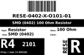

Contents
========

* [RESE-4O101-01 > SMD (0402) 100 Ohm Resistor](#rese-4o101-01--smd-0402-100-ohm-resistor)
	* [Datasheets](#datasheets)
	* [Labels](#labels)
	* [EDA](#eda)
	* [Images](#images)
	* [Tags](#tags)
  
![][im]
# RESE-4O101-01 > SMD (0402) 100 Ohm Resistor

- ID: RESE-0402-X-O101-01
- Hex ID: RESE-4O101-01
- Name: SMD (0402) 100 Ohm Resistor
- Description: SMD (0402) 100 Ohm Resistor
- Long Link: [http://oom.lt/RESE-0402-X-O101-01](http://oom.lt/RESE-0402-X-O101-01)
- Short Link: [http://oom.lt/RESE-4O101-01](http://oom.lt/RESE-4O101-01)

## Datasheets

- Datasheet: [datasheet.pdf](datasheet.pdf)

## Labels
  
  

|label-front|label-inventory|label-spec|
| :---: | :---: | :---: |
||||

## EDA

### Footprints
  

|[  FOOTPRINT-kicad-kicad-footprints-Resistor_SMD-R_0402_1005Metric](https://github.com/oomlout/oomlout_OOMP_eda/tree/main/FOOTPRINT/kicad/kicad-footprints/Resistor_SMD/R_0402_1005Metric/)|[  FOOTPRINT-kicad-kicad-footprints-Resistor_SMD-R_0402_1005Metric_Pad0.72x0.64mm_HandSolder](https://github.com/oomlout/oomlout_OOMP_eda/tree/main/FOOTPRINT/kicad/kicad-footprints/Resistor_SMD/R_0402_1005Metric_Pad0.72x0.64mm_HandSolder/)|||
| :---: | :---: | :---: | :---: |

### Symbols
  

|[  SYMBOL-kicad-kicad-symbols-Device-R](https://github.com/oomlout/oomlout_OOMP_eda/tree/main/SYMBOL/kicad/kicad-symbols/Device/R/)||||
| :---: | :---: | :---: | :---: |
  

### Instances
  
Used 7 times.  
Prevalance: (7\10986) 0.0637%  

|Project|Occur- rences|Identifiers|
| :---: | :---: | :---: |
|[PROJ-SPAR-10116-STAN-01 Arduino Fio](https://github.com/oomlout/oomlout_OOMP_projects/tree/main/PROJ-SPAR-10116-STAN-01/)|[1](https://github.com/oomlout/oomlout_OOMP_projects/tree/main/PROJ-SPAR-10116-STAN-01/)|[R8](https://github.com/oomlout/oomlout_OOMP_projects/tree/main/PROJ-SPAR-10116-STAN-01/)|
|[PROJ-SPAR-10701-STAN-01 Color Light Sensor Evaluation Board](https://github.com/oomlout/oomlout_OOMP_projects/tree/main/PROJ-SPAR-10701-STAN-01/)|[1](https://github.com/oomlout/oomlout_OOMP_projects/tree/main/PROJ-SPAR-10701-STAN-01/)|[R5](https://github.com/oomlout/oomlout_OOMP_projects/tree/main/PROJ-SPAR-10701-STAN-01/)|
|[PROJ-SPAR-10889-STAN-01 ProtoSnap-Pro Mini](https://github.com/oomlout/oomlout_OOMP_projects/tree/main/PROJ-SPAR-10889-STAN-01/)|[2](https://github.com/oomlout/oomlout_OOMP_projects/tree/main/PROJ-SPAR-10889-STAN-01/)|[R5, R7](https://github.com/oomlout/oomlout_OOMP_projects/tree/main/PROJ-SPAR-10889-STAN-01/)|
|[PROJ-SPAR-11168-STAN-01 AVR ISP Shield](https://github.com/oomlout/oomlout_OOMP_projects/tree/main/PROJ-SPAR-11168-STAN-01/)|[1](https://github.com/oomlout/oomlout_OOMP_projects/tree/main/PROJ-SPAR-11168-STAN-01/)|[R6](https://github.com/oomlout/oomlout_OOMP_projects/tree/main/PROJ-SPAR-11168-STAN-01/)|
|[PROJ-SPAR-11262-STAN-01 ProtoSnap-LilyPad Development Board](https://github.com/oomlout/oomlout_OOMP_projects/tree/main/PROJ-SPAR-11262-STAN-01/)|[2](https://github.com/oomlout/oomlout_OOMP_projects/tree/main/PROJ-SPAR-11262-STAN-01/)|[R4, R5](https://github.com/oomlout/oomlout_OOMP_projects/tree/main/PROJ-SPAR-11262-STAN-01/)|

## Images
  
  

|image|image_BOTTOM|label-front|label-inventory|label-spec|
| :---: | :---: | :---: | :---: | :---: |
||||||

## Tags

- oompType: RESE
- oompSize: 0402
- oompColor: X
- oompDesc: O101
- oompIndex: 01
- oplPartNumber: {'code': 'C-JLCC', 'name': 'JLC Parts Library', 'partID': 'C25076', 'desc': '62.5mW Thick Film Resistors 50V ??1% ??200ppm/?? -55??~+155?? 100?? 0402  Chip Resistor - Surface Mount ROHS'}
- distributorPartNumber: {'code': 'C-LCSC', 'name': 'LCSC', 'partID': 'C25076'}
- manufacturerPartNumber: {'code': 'C-XXXX', 'name': 'UNI-ROYAL(Uniroyal Elec)', 'partID': '0402WGF1000TCE'}
- hexID: RESE-4O101-01
- oompID: RESE-0402-X-O101-01
- oompInstances: {'PROJECT': 'PROJ-SPAR-10116-STAN-01', 'ID': 'R8'}
- oompInstances: {'PROJECT': 'PROJ-SPAR-10701-STAN-01', 'ID': 'R5'}
- oompInstances: {'PROJECT': 'PROJ-SPAR-10889-STAN-01', 'ID': 'R5'}
- oompInstances: {'PROJECT': 'PROJ-SPAR-10889-STAN-01', 'ID': 'R7'}
- oompInstances: {'PROJECT': 'PROJ-SPAR-11168-STAN-01', 'ID': 'R6'}
- oompInstances: {'PROJECT': 'PROJ-SPAR-11262-STAN-01', 'ID': 'R4'}
- oompInstances: {'PROJECT': 'PROJ-SPAR-11262-STAN-01', 'ID': 'R5'}
- footprintKicad: FOOTPRINT-kicad-kicad-footprints-Resistor_SMD-R_0402_1005Metric
- footprintKicad: FOOTPRINT-kicad-kicad-footprints-Resistor_SMD-R_0402_1005Metric_Pad0.72x0.64mm_HandSolder
- symbolKicad: SYMBOL-kicad-kicad-symbols-Device-R

[im]: image_450.jpg
