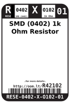
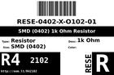
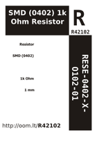
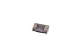

Contents
========

* [R4O102 > SMD (0402) 1k Ohm Resistor](#r4o102--smd-0402-1k-ohm-resistor)
	* [Datasheets](#datasheets)
	* [Labels](#labels)
	* [EDA](#eda)
	* [Images](#images)
	* [Tags](#tags)
  
![][im]
# R4O102 > SMD (0402) 1k Ohm Resistor

- ID: RESE-0402-X-O102-01
- Hex ID: R4O102
- Name: SMD (0402) 1k Ohm Resistor
- Description: SMD (0402) 1k Ohm Resistor
- Long Link: [http://oom.lt/RESE-0402-X-O102-01](http://oom.lt/RESE-0402-X-O102-01)
- Short Link: [http://oom.lt/R4O102](http://oom.lt/R4O102)

## Datasheets

- Datasheet: [datasheet.pdf](datasheet.pdf)

## Labels
  
  

|label-front|label-inventory|label-spec|
| :---: | :---: | :---: |
||||

## EDA

### Footprints
  

|[  FOOTPRINT-kicad-kicad-footprints-Resistor_SMD-R_0402_1005Metric](https://github.com/oomlout/oomlout_OOMP_eda/tree/main/FOOTPRINT/kicad/kicad-footprints/Resistor_SMD/R_0402_1005Metric/)|[  FOOTPRINT-kicad-kicad-footprints-Resistor_SMD-R_0402_1005Metric_Pad0.72x0.64mm_HandSolder](https://github.com/oomlout/oomlout_OOMP_eda/tree/main/FOOTPRINT/kicad/kicad-footprints/Resistor_SMD/R_0402_1005Metric_Pad0.72x0.64mm_HandSolder/)|||
| :---: | :---: | :---: | :---: |

### Symbols
  

|[  SYMBOL-kicad-kicad-symbols-Device-R](https://github.com/oomlout/oomlout_OOMP_eda/tree/main/SYMBOL/kicad/kicad-symbols/Device/R/)||||
| :---: | :---: | :---: | :---: |
  

### Instances
  
Used 85 times.  
Prevalance: (85\10986) 0.7737%  

|Project|Occur- rences|Identifiers|
| :---: | :---: | :---: |
|[PROJ-ADAF-4888-STAN-01 Adafruit ItsyBitsy RP2040 PCB](https://github.com/oomlout/oomlout_OOMP_projects/tree/main/PROJ-ADAF-4888-STAN-01/)|[3](https://github.com/oomlout/oomlout_OOMP_projects/tree/main/PROJ-ADAF-4888-STAN-01/)|[R6, R7, R11](https://github.com/oomlout/oomlout_OOMP_projects/tree/main/PROJ-ADAF-4888-STAN-01/)|
|[PROJ-ADAF-4900-STAN-01 Adafruit QT Py RP2040 PCB](https://github.com/oomlout/oomlout_OOMP_projects/tree/main/PROJ-ADAF-4900-STAN-01/)|[2](https://github.com/oomlout/oomlout_OOMP_projects/tree/main/PROJ-ADAF-4900-STAN-01/)|[R6, R16](https://github.com/oomlout/oomlout_OOMP_projects/tree/main/PROJ-ADAF-4900-STAN-01/)|
|[PROJ-ADAF-5302-STAN-01 Adafruit KB2040 PCB](https://github.com/oomlout/oomlout_OOMP_projects/tree/main/PROJ-ADAF-5302-STAN-01/)|[2](https://github.com/oomlout/oomlout_OOMP_projects/tree/main/PROJ-ADAF-5302-STAN-01/)|[R6, R11](https://github.com/oomlout/oomlout_OOMP_projects/tree/main/PROJ-ADAF-5302-STAN-01/)|
|[PROJ-ADAF-5405-STAN-01 Adafruit QT Py ESP32 C3 PCB](https://github.com/oomlout/oomlout_OOMP_projects/tree/main/PROJ-ADAF-5405-STAN-01/)|[1](https://github.com/oomlout/oomlout_OOMP_projects/tree/main/PROJ-ADAF-5405-STAN-01/)|[R4](https://github.com/oomlout/oomlout_OOMP_projects/tree/main/PROJ-ADAF-5405-STAN-01/)|
|[PROJ-ARDU-DUE-STAN-01 Arduino DUE](https://github.com/oomlout/oomlout_OOMP_projects/tree/main/PROJ-ARDU-DUE-STAN-01/)|[5](https://github.com/oomlout/oomlout_OOMP_projects/tree/main/PROJ-ARDU-DUE-STAN-01/)|[R3, R14, R15, R21, R23](https://github.com/oomlout/oomlout_OOMP_projects/tree/main/PROJ-ARDU-DUE-STAN-01/)|
|[PROJ-ARDU-MICRO-STAN-01 Arduino Micro](https://github.com/oomlout/oomlout_OOMP_projects/tree/main/PROJ-ARDU-MICRO-STAN-01/)|[4](https://github.com/oomlout/oomlout_OOMP_projects/tree/main/PROJ-ARDU-MICRO-STAN-01/)|[R5, R6, R7, R8](https://github.com/oomlout/oomlout_OOMP_projects/tree/main/PROJ-ARDU-MICRO-STAN-01/)|
|[PROJ-SPAR-10116-STAN-01 Arduino Fio](https://github.com/oomlout/oomlout_OOMP_projects/tree/main/PROJ-SPAR-10116-STAN-01/)|[3](https://github.com/oomlout/oomlout_OOMP_projects/tree/main/PROJ-SPAR-10116-STAN-01/)|[R1, R2, R3](https://github.com/oomlout/oomlout_OOMP_projects/tree/main/PROJ-SPAR-10116-STAN-01/)|
|[PROJ-SPAR-10182-STAN-01 Monster Moto Shield](https://github.com/oomlout/oomlout_OOMP_projects/tree/main/PROJ-SPAR-10182-STAN-01/)|[10](https://github.com/oomlout/oomlout_OOMP_projects/tree/main/PROJ-SPAR-10182-STAN-01/)|[R1, R2, R3, R4, R7, R10, R11, R12, R13, R16](https://github.com/oomlout/oomlout_OOMP_projects/tree/main/PROJ-SPAR-10182-STAN-01/)|
|[PROJ-SPAR-10587-STAN-01 Music Instrument Shield](https://github.com/oomlout/oomlout_OOMP_projects/tree/main/PROJ-SPAR-10587-STAN-01/)|[2](https://github.com/oomlout/oomlout_OOMP_projects/tree/main/PROJ-SPAR-10587-STAN-01/)|[R13, R14](https://github.com/oomlout/oomlout_OOMP_projects/tree/main/PROJ-SPAR-10587-STAN-01/)|
|[PROJ-SPAR-10617-STAN-01 Lipo Fuel Gauge](https://github.com/oomlout/oomlout_OOMP_projects/tree/main/PROJ-SPAR-10617-STAN-01/)|[1](https://github.com/oomlout/oomlout_OOMP_projects/tree/main/PROJ-SPAR-10617-STAN-01/)|[R1](https://github.com/oomlout/oomlout_OOMP_projects/tree/main/PROJ-SPAR-10617-STAN-01/)|
|[PROJ-SPAR-10743-STAN-01 Mega Pro Mini](https://github.com/oomlout/oomlout_OOMP_projects/tree/main/PROJ-SPAR-10743-STAN-01/)|[2](https://github.com/oomlout/oomlout_OOMP_projects/tree/main/PROJ-SPAR-10743-STAN-01/)|[R1, R7](https://github.com/oomlout/oomlout_OOMP_projects/tree/main/PROJ-SPAR-10743-STAN-01/)|
|[PROJ-SPAR-10864-STAN-01 PoEthernet Shield](https://github.com/oomlout/oomlout_OOMP_projects/tree/main/PROJ-SPAR-10864-STAN-01/)|[9](https://github.com/oomlout/oomlout_OOMP_projects/tree/main/PROJ-SPAR-10864-STAN-01/)|[R1, R2, R3, R4, R5, R6, R7, R8, R11](https://github.com/oomlout/oomlout_OOMP_projects/tree/main/PROJ-SPAR-10864-STAN-01/)|
|[PROJ-SPAR-10889-STAN-01 ProtoSnap-Pro Mini](https://github.com/oomlout/oomlout_OOMP_projects/tree/main/PROJ-SPAR-10889-STAN-01/)|[2](https://github.com/oomlout/oomlout_OOMP_projects/tree/main/PROJ-SPAR-10889-STAN-01/)|[R1, R3](https://github.com/oomlout/oomlout_OOMP_projects/tree/main/PROJ-SPAR-10889-STAN-01/)|
|[PROJ-SPAR-10914-STAN-01 Arduino Pro 328](https://github.com/oomlout/oomlout_OOMP_projects/tree/main/PROJ-SPAR-10914-STAN-01/)|[3](https://github.com/oomlout/oomlout_OOMP_projects/tree/main/PROJ-SPAR-10914-STAN-01/)|[R1, R3, R6](https://github.com/oomlout/oomlout_OOMP_projects/tree/main/PROJ-SPAR-10914-STAN-01/)|
|[PROJ-SPAR-11013-STAN-01 LilyPad MP3 Player](https://github.com/oomlout/oomlout_OOMP_projects/tree/main/PROJ-SPAR-11013-STAN-01/)|[2](https://github.com/oomlout/oomlout_OOMP_projects/tree/main/PROJ-SPAR-11013-STAN-01/)|[R2, R20](https://github.com/oomlout/oomlout_OOMP_projects/tree/main/PROJ-SPAR-11013-STAN-01/)|
|[PROJ-SPAR-11084-STAN-01 MPL3115A2 Breakout](https://github.com/oomlout/oomlout_OOMP_projects/tree/main/PROJ-SPAR-11084-STAN-01/)|[2](https://github.com/oomlout/oomlout_OOMP_projects/tree/main/PROJ-SPAR-11084-STAN-01/)|[R1, R2](https://github.com/oomlout/oomlout_OOMP_projects/tree/main/PROJ-SPAR-11084-STAN-01/)|
|[PROJ-SPAR-11197-STAN-01 ATmega128RFA1 Dev](https://github.com/oomlout/oomlout_OOMP_projects/tree/main/PROJ-SPAR-11197-STAN-01/)|[1](https://github.com/oomlout/oomlout_OOMP_projects/tree/main/PROJ-SPAR-11197-STAN-01/)|[R2](https://github.com/oomlout/oomlout_OOMP_projects/tree/main/PROJ-SPAR-11197-STAN-01/)|
|[PROJ-SPAR-11323-STAN-01 EL Sequencer](https://github.com/oomlout/oomlout_OOMP_projects/tree/main/PROJ-SPAR-11323-STAN-01/)|[4](https://github.com/oomlout/oomlout_OOMP_projects/tree/main/PROJ-SPAR-11323-STAN-01/)|[R3, R5, R7, R9](https://github.com/oomlout/oomlout_OOMP_projects/tree/main/PROJ-SPAR-11323-STAN-01/)|
|[PROJ-SPAR-11373-STAN-01 XBee Explorer Regulated](https://github.com/oomlout/oomlout_OOMP_projects/tree/main/PROJ-SPAR-11373-STAN-01/)|[8](https://github.com/oomlout/oomlout_OOMP_projects/tree/main/PROJ-SPAR-11373-STAN-01/)|[R1, R3, R4, R5, R6, R7, R8, R11](https://github.com/oomlout/oomlout_OOMP_projects/tree/main/PROJ-SPAR-11373-STAN-01/)|
|[PROJ-SPAR-11629-STAN-01 Serial7SegmentDisplay](https://github.com/oomlout/oomlout_OOMP_projects/tree/main/PROJ-SPAR-11629-STAN-01/)|[8](https://github.com/oomlout/oomlout_OOMP_projects/tree/main/PROJ-SPAR-11629-STAN-01/)|[R2, R3, R4, R6, R7, R8, R9, R10](https://github.com/oomlout/oomlout_OOMP_projects/tree/main/PROJ-SPAR-11629-STAN-01/)|
|[PROJ-SPAR-11703-STAN-01 UDB5](https://github.com/oomlout/oomlout_OOMP_projects/tree/main/PROJ-SPAR-11703-STAN-01/)|[1](https://github.com/oomlout/oomlout_OOMP_projects/tree/main/PROJ-SPAR-11703-STAN-01/)|[R25](https://github.com/oomlout/oomlout_OOMP_projects/tree/main/PROJ-SPAR-11703-STAN-01/)|
|[PROJ-SPAR-11736-STAN-01 FT231X Breakout](https://github.com/oomlout/oomlout_OOMP_projects/tree/main/PROJ-SPAR-11736-STAN-01/)|[2](https://github.com/oomlout/oomlout_OOMP_projects/tree/main/PROJ-SPAR-11736-STAN-01/)|[R3, R4](https://github.com/oomlout/oomlout_OOMP_projects/tree/main/PROJ-SPAR-11736-STAN-01/)|
|[PROJ-SPAR-12081-STAN-01 USB Weather Board](https://github.com/oomlout/oomlout_OOMP_projects/tree/main/PROJ-SPAR-12081-STAN-01/)|[8](https://github.com/oomlout/oomlout_OOMP_projects/tree/main/PROJ-SPAR-12081-STAN-01/)|[R7, R8, R11, R12, R13, R14, R15, R16](https://github.com/oomlout/oomlout_OOMP_projects/tree/main/PROJ-SPAR-12081-STAN-01/)|

## Images
  
  

|image|image_BOTTOM|label-front|label-inventory|label-spec|
| :---: | :---: | :---: | :---: | :---: |
||||||

## Tags

- oompType: RESE
- oompSize: 0402
- oompColor: X
- oompDesc: O102
- oompIndex: 01
- oplPartNumber: {'code': 'C-JLCC', 'name': 'JLC Parts Library', 'partID': 'C11702', 'desc': '62.5mW Thick Film Resistors 50V ??100ppm/?? ??1% -55??~+155?? 1k?? 0402  Chip Resistor - Surface Mount ROHS'}
- distributorPartNumber: {'code': 'C-LCSC', 'name': 'LCSC', 'partID': 'C11702'}
- manufacturerPartNumber: {'code': 'C-XXXX', 'name': 'UNI-ROYAL(Uniroyal Elec)', 'partID': '0402WGF1001TCE'}
- hexID: R4O102
- oompID: RESE-0402-X-O102-01
- oompInstances: {'PROJECT': 'PROJ-ADAF-4888-STAN-01', 'ID': 'R6'}
- oompInstances: {'PROJECT': 'PROJ-ADAF-4888-STAN-01', 'ID': 'R7'}
- oompInstances: {'PROJECT': 'PROJ-ADAF-4888-STAN-01', 'ID': 'R11'}
- oompInstances: {'PROJECT': 'PROJ-ADAF-4900-STAN-01', 'ID': 'R6'}
- oompInstances: {'PROJECT': 'PROJ-ADAF-4900-STAN-01', 'ID': 'R16'}
- oompInstances: {'PROJECT': 'PROJ-ADAF-5302-STAN-01', 'ID': 'R6'}
- oompInstances: {'PROJECT': 'PROJ-ADAF-5302-STAN-01', 'ID': 'R11'}
- oompInstances: {'PROJECT': 'PROJ-ADAF-5405-STAN-01', 'ID': 'R4'}
- oompInstances: {'PROJECT': 'PROJ-ARDU-DUE-STAN-01', 'ID': 'R3'}
- oompInstances: {'PROJECT': 'PROJ-ARDU-DUE-STAN-01', 'ID': 'R14'}
- oompInstances: {'PROJECT': 'PROJ-ARDU-DUE-STAN-01', 'ID': 'R15'}
- oompInstances: {'PROJECT': 'PROJ-ARDU-DUE-STAN-01', 'ID': 'R21'}
- oompInstances: {'PROJECT': 'PROJ-ARDU-DUE-STAN-01', 'ID': 'R23'}
- oompInstances: {'PROJECT': 'PROJ-ARDU-MICRO-STAN-01', 'ID': 'R5'}
- oompInstances: {'PROJECT': 'PROJ-ARDU-MICRO-STAN-01', 'ID': 'R6'}
- oompInstances: {'PROJECT': 'PROJ-ARDU-MICRO-STAN-01', 'ID': 'R7'}
- oompInstances: {'PROJECT': 'PROJ-ARDU-MICRO-STAN-01', 'ID': 'R8'}
- oompInstances: {'PROJECT': 'PROJ-SPAR-10116-STAN-01', 'ID': 'R1'}
- oompInstances: {'PROJECT': 'PROJ-SPAR-10116-STAN-01', 'ID': 'R2'}
- oompInstances: {'PROJECT': 'PROJ-SPAR-10116-STAN-01', 'ID': 'R3'}
- oompInstances: {'PROJECT': 'PROJ-SPAR-10182-STAN-01', 'ID': 'R1'}
- oompInstances: {'PROJECT': 'PROJ-SPAR-10182-STAN-01', 'ID': 'R2'}
- oompInstances: {'PROJECT': 'PROJ-SPAR-10182-STAN-01', 'ID': 'R3'}
- oompInstances: {'PROJECT': 'PROJ-SPAR-10182-STAN-01', 'ID': 'R4'}
- oompInstances: {'PROJECT': 'PROJ-SPAR-10182-STAN-01', 'ID': 'R7'}
- oompInstances: {'PROJECT': 'PROJ-SPAR-10182-STAN-01', 'ID': 'R10'}
- oompInstances: {'PROJECT': 'PROJ-SPAR-10182-STAN-01', 'ID': 'R11'}
- oompInstances: {'PROJECT': 'PROJ-SPAR-10182-STAN-01', 'ID': 'R12'}
- oompInstances: {'PROJECT': 'PROJ-SPAR-10182-STAN-01', 'ID': 'R13'}
- oompInstances: {'PROJECT': 'PROJ-SPAR-10182-STAN-01', 'ID': 'R16'}
- oompInstances: {'PROJECT': 'PROJ-SPAR-10587-STAN-01', 'ID': 'R13'}
- oompInstances: {'PROJECT': 'PROJ-SPAR-10587-STAN-01', 'ID': 'R14'}
- oompInstances: {'PROJECT': 'PROJ-SPAR-10617-STAN-01', 'ID': 'R1'}
- oompInstances: {'PROJECT': 'PROJ-SPAR-10743-STAN-01', 'ID': 'R1'}
- oompInstances: {'PROJECT': 'PROJ-SPAR-10743-STAN-01', 'ID': 'R7'}
- oompInstances: {'PROJECT': 'PROJ-SPAR-10864-STAN-01', 'ID': 'R1'}
- oompInstances: {'PROJECT': 'PROJ-SPAR-10864-STAN-01', 'ID': 'R2'}
- oompInstances: {'PROJECT': 'PROJ-SPAR-10864-STAN-01', 'ID': 'R3'}
- oompInstances: {'PROJECT': 'PROJ-SPAR-10864-STAN-01', 'ID': 'R4'}
- oompInstances: {'PROJECT': 'PROJ-SPAR-10864-STAN-01', 'ID': 'R5'}
- oompInstances: {'PROJECT': 'PROJ-SPAR-10864-STAN-01', 'ID': 'R6'}
- oompInstances: {'PROJECT': 'PROJ-SPAR-10864-STAN-01', 'ID': 'R7'}
- oompInstances: {'PROJECT': 'PROJ-SPAR-10864-STAN-01', 'ID': 'R8'}
- oompInstances: {'PROJECT': 'PROJ-SPAR-10864-STAN-01', 'ID': 'R11'}
- oompInstances: {'PROJECT': 'PROJ-SPAR-10889-STAN-01', 'ID': 'R1'}
- oompInstances: {'PROJECT': 'PROJ-SPAR-10889-STAN-01', 'ID': 'R3'}
- oompInstances: {'PROJECT': 'PROJ-SPAR-10914-STAN-01', 'ID': 'R1'}
- oompInstances: {'PROJECT': 'PROJ-SPAR-10914-STAN-01', 'ID': 'R3'}
- oompInstances: {'PROJECT': 'PROJ-SPAR-10914-STAN-01', 'ID': 'R6'}
- oompInstances: {'PROJECT': 'PROJ-SPAR-11013-STAN-01', 'ID': 'R2'}
- oompInstances: {'PROJECT': 'PROJ-SPAR-11013-STAN-01', 'ID': 'R20'}
- oompInstances: {'PROJECT': 'PROJ-SPAR-11084-STAN-01', 'ID': 'R1'}
- oompInstances: {'PROJECT': 'PROJ-SPAR-11084-STAN-01', 'ID': 'R2'}
- oompInstances: {'PROJECT': 'PROJ-SPAR-11197-STAN-01', 'ID': 'R2'}
- oompInstances: {'PROJECT': 'PROJ-SPAR-11323-STAN-01', 'ID': 'R3'}
- oompInstances: {'PROJECT': 'PROJ-SPAR-11323-STAN-01', 'ID': 'R5'}
- oompInstances: {'PROJECT': 'PROJ-SPAR-11323-STAN-01', 'ID': 'R7'}
- oompInstances: {'PROJECT': 'PROJ-SPAR-11323-STAN-01', 'ID': 'R9'}
- oompInstances: {'PROJECT': 'PROJ-SPAR-11373-STAN-01', 'ID': 'R1'}
- oompInstances: {'PROJECT': 'PROJ-SPAR-11373-STAN-01', 'ID': 'R3'}
- oompInstances: {'PROJECT': 'PROJ-SPAR-11373-STAN-01', 'ID': 'R4'}
- oompInstances: {'PROJECT': 'PROJ-SPAR-11373-STAN-01', 'ID': 'R5'}
- oompInstances: {'PROJECT': 'PROJ-SPAR-11373-STAN-01', 'ID': 'R6'}
- oompInstances: {'PROJECT': 'PROJ-SPAR-11373-STAN-01', 'ID': 'R7'}
- oompInstances: {'PROJECT': 'PROJ-SPAR-11373-STAN-01', 'ID': 'R8'}
- oompInstances: {'PROJECT': 'PROJ-SPAR-11373-STAN-01', 'ID': 'R11'}
- oompInstances: {'PROJECT': 'PROJ-SPAR-11629-STAN-01', 'ID': 'R2'}
- oompInstances: {'PROJECT': 'PROJ-SPAR-11629-STAN-01', 'ID': 'R3'}
- oompInstances: {'PROJECT': 'PROJ-SPAR-11629-STAN-01', 'ID': 'R4'}
- oompInstances: {'PROJECT': 'PROJ-SPAR-11629-STAN-01', 'ID': 'R6'}
- oompInstances: {'PROJECT': 'PROJ-SPAR-11629-STAN-01', 'ID': 'R7'}
- oompInstances: {'PROJECT': 'PROJ-SPAR-11629-STAN-01', 'ID': 'R8'}
- oompInstances: {'PROJECT': 'PROJ-SPAR-11629-STAN-01', 'ID': 'R9'}
- oompInstances: {'PROJECT': 'PROJ-SPAR-11629-STAN-01', 'ID': 'R10'}
- oompInstances: {'PROJECT': 'PROJ-SPAR-11703-STAN-01', 'ID': 'R25'}
- oompInstances: {'PROJECT': 'PROJ-SPAR-11736-STAN-01', 'ID': 'R3'}
- oompInstances: {'PROJECT': 'PROJ-SPAR-11736-STAN-01', 'ID': 'R4'}
- oompInstances: {'PROJECT': 'PROJ-SPAR-12081-STAN-01', 'ID': 'R7'}
- oompInstances: {'PROJECT': 'PROJ-SPAR-12081-STAN-01', 'ID': 'R8'}
- oompInstances: {'PROJECT': 'PROJ-SPAR-12081-STAN-01', 'ID': 'R11'}
- oompInstances: {'PROJECT': 'PROJ-SPAR-12081-STAN-01', 'ID': 'R12'}
- oompInstances: {'PROJECT': 'PROJ-SPAR-12081-STAN-01', 'ID': 'R13'}
- oompInstances: {'PROJECT': 'PROJ-SPAR-12081-STAN-01', 'ID': 'R14'}
- oompInstances: {'PROJECT': 'PROJ-SPAR-12081-STAN-01', 'ID': 'R15'}
- oompInstances: {'PROJECT': 'PROJ-SPAR-12081-STAN-01', 'ID': 'R16'}
- symbolKicad: SYMBOL-kicad-kicad-symbols-Device-R
- footprintKicad: FOOTPRINT-kicad-kicad-footprints-Resistor_SMD-R_0402_1005Metric
- footprintKicad: FOOTPRINT-kicad-kicad-footprints-Resistor_SMD-R_0402_1005Metric_Pad0.72x0.64mm_HandSolder

[im]: image_450.jpg
