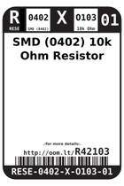
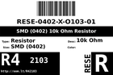
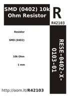

Contents
========

* [R42103 > SMD (0402) 10k Ohm Resistor](#r42103--smd-0402-10k-ohm-resistor)
	* [Datasheets](#datasheets)
	* [Labels](#labels)
	* [EDA](#eda)
	* [Images](#images)
	* [Tags](#tags)
  
![][im]
# R42103 > SMD (0402) 10k Ohm Resistor

- ID: RESE-0402-X-O103-01
- Hex ID: R42103
- Name: SMD (0402) 10k Ohm Resistor
- Description: SMD (0402) 10k Ohm Resistor
- Long Link: [http://oom.lt/RESE-0402-X-O103-01](http://oom.lt/RESE-0402-X-O103-01)
- Short Link: [http://oom.lt/R42103](http://oom.lt/R42103)

## Datasheets

- Datasheet: [datasheet.pdf](datasheet.pdf)

## Labels
  
  

|label-front|label-inventory|label-spec|
| :---: | :---: | :---: |
||||

## EDA

### Instances
  
  
Used 115 times.  
Prevalance: (115\10986) 1.0468%  

|OOMP Instances|
| :---: |
|[PROJ-ADAF-4888-STAN-01  Adafruit ItsyBitsy RP2040 PCB  Used 3 times. R1, R2, R5](https://github.com/oomlout/oomlout_OOMP_projects/tree/main/PROJ-ADAF-4888-STAN-01/)|
|[PROJ-ADAF-4900-STAN-01  Adafruit QT Py RP2040 PCB  Used 2 times. R3, R9](https://github.com/oomlout/oomlout_OOMP_projects/tree/main/PROJ-ADAF-4900-STAN-01/)|
|[PROJ-ADAF-5302-STAN-01  Adafruit KB2040 PCB  Used 3 times. R5, R7, R9](https://github.com/oomlout/oomlout_OOMP_projects/tree/main/PROJ-ADAF-5302-STAN-01/)|
|[PROJ-ADAF-5325-STAN-01  Adafruit QT Py ESP32 S2 PCB  Used 2 times. R1, R2](https://github.com/oomlout/oomlout_OOMP_projects/tree/main/PROJ-ADAF-5325-STAN-01/)|
|[PROJ-ADAF-5395-STAN-01  Adafruit QT Py ESP32 Pico PCB  Used 4 times. R1, R2, R3, R7](https://github.com/oomlout/oomlout_OOMP_projects/tree/main/PROJ-ADAF-5395-STAN-01/)|
|[PROJ-ADAF-5405-STAN-01  Adafruit QT Py ESP32 C3 PCB  Used 2 times. R1, R2](https://github.com/oomlout/oomlout_OOMP_projects/tree/main/PROJ-ADAF-5405-STAN-01/)|
|[PROJ-ADAF-5426-STAN-01  Adafruit QT Py ESP32 S3 PCB  Used 1 times. R1](https://github.com/oomlout/oomlout_OOMP_projects/tree/main/PROJ-ADAF-5426-STAN-01/)|
|[PROJ-ARDU-DUE-STAN-01  Arduino DUE  Used 4 times. R2, R13, R18, R99](https://github.com/oomlout/oomlout_OOMP_projects/tree/main/PROJ-ARDU-DUE-STAN-01/)|
|[PROJ-ARDU-MICRO-STAN-01  Arduino Micro  Used 4 times. R1, R2, R4, R9](https://github.com/oomlout/oomlout_OOMP_projects/tree/main/PROJ-ARDU-MICRO-STAN-01/)|
|[PROJ-SPAR-10116-STAN-01  Arduino Fio  Used 1 times. R4](https://github.com/oomlout/oomlout_OOMP_projects/tree/main/PROJ-SPAR-10116-STAN-01/)|
|[PROJ-SPAR-10160-STAN-01  DeadOn RTC  Used 1 times. R1](https://github.com/oomlout/oomlout_OOMP_projects/tree/main/PROJ-SPAR-10160-STAN-01/)|
|[PROJ-SPAR-10182-STAN-01  Monster Moto Shield  Used 2 times. R5, R14](https://github.com/oomlout/oomlout_OOMP_projects/tree/main/PROJ-SPAR-10182-STAN-01/)|
|[PROJ-SPAR-10274-STAN-01  LilyPad Arduino Simple  Used 2 times. R2, R3](https://github.com/oomlout/oomlout_OOMP_projects/tree/main/PROJ-SPAR-10274-STAN-01/)|
|[PROJ-SPAR-10406-STAN-01  RFID Evaluation Shield  Used 1 times. R1](https://github.com/oomlout/oomlout_OOMP_projects/tree/main/PROJ-SPAR-10406-STAN-01/)|
|[PROJ-SPAR-10612-STAN-01  Tri-Axis Gyro Breakout-L3G4200D  Used 3 times. R1, R2, R3](https://github.com/oomlout/oomlout_OOMP_projects/tree/main/PROJ-SPAR-10612-STAN-01/)|
|[PROJ-SPAR-10615-STAN-01  PWM Shield  Used 1 times. R1](https://github.com/oomlout/oomlout_OOMP_projects/tree/main/PROJ-SPAR-10615-STAN-01/)|
|[PROJ-SPAR-10701-STAN-01  Color Light Sensor Evaluation Board  Used 4 times. R1, R2, R3, R6](https://github.com/oomlout/oomlout_OOMP_projects/tree/main/PROJ-SPAR-10701-STAN-01/)|
|[PROJ-SPAR-10740-STAN-01  IR Thermometer Evaluation Board-MLX90614  Used 3 times. R1, R2, R5](https://github.com/oomlout/oomlout_OOMP_projects/tree/main/PROJ-SPAR-10740-STAN-01/)|
|[PROJ-SPAR-10743-STAN-01  Mega Pro Mini  Used 3 times. R2, R3, R4](https://github.com/oomlout/oomlout_OOMP_projects/tree/main/PROJ-SPAR-10743-STAN-01/)|
|[PROJ-SPAR-10864-STAN-01  PoEthernet Shield  Used 1 times. R17](https://github.com/oomlout/oomlout_OOMP_projects/tree/main/PROJ-SPAR-10864-STAN-01/)|
|[PROJ-SPAR-10889-STAN-01  ProtoSnap-Pro Mini  Used 3 times. R2, R8, R11](https://github.com/oomlout/oomlout_OOMP_projects/tree/main/PROJ-SPAR-10889-STAN-01/)|
|[PROJ-SPAR-10914-STAN-01  Arduino Pro 328  Used 1 times. R2](https://github.com/oomlout/oomlout_OOMP_projects/tree/main/PROJ-SPAR-10914-STAN-01/)|
|[PROJ-SPAR-10941-STAN-01  LilyPad Arduino SimpleSnap  Used 2 times. R2, R3](https://github.com/oomlout/oomlout_OOMP_projects/tree/main/PROJ-SPAR-10941-STAN-01/)|
|[PROJ-SPAR-10995-STAN-01  GPS Evaluation Board GP-2106  Used 8 times. R1, R2, R3, R4, R5, R6, R7, R8](https://github.com/oomlout/oomlout_OOMP_projects/tree/main/PROJ-SPAR-10995-STAN-01/)|
|[PROJ-SPAR-11007-STAN-01  Mega Pro  Used 3 times. R3, R4, R5](https://github.com/oomlout/oomlout_OOMP_projects/tree/main/PROJ-SPAR-11007-STAN-01/)|
|[PROJ-SPAR-11013-STAN-01  LilyPad MP3 Player  Used 2 times. R3, R22](https://github.com/oomlout/oomlout_OOMP_projects/tree/main/PROJ-SPAR-11013-STAN-01/)|
|[PROJ-SPAR-11018-STAN-01  RFM22 Shield-434MHz  Used 1 times. R1](https://github.com/oomlout/oomlout_OOMP_projects/tree/main/PROJ-SPAR-11018-STAN-01/)|
|[PROJ-SPAR-11058-STAN-01  Venus GPS SMA Connector  Used 2 times. R2, R6](https://github.com/oomlout/oomlout_OOMP_projects/tree/main/PROJ-SPAR-11058-STAN-01/)|
|[PROJ-SPAR-11083-STAN-01  FM Tuner Basic Breakout-Si4703  Used 2 times. R1, R2](https://github.com/oomlout/oomlout_OOMP_projects/tree/main/PROJ-SPAR-11083-STAN-01/)|
|[PROJ-SPAR-11088-STAN-01  Run-SPOT-Run  Used 1 times. R2](https://github.com/oomlout/oomlout_OOMP_projects/tree/main/PROJ-SPAR-11088-STAN-01/)|
|[PROJ-SPAR-11113-STAN-01  Pro Mini Candy  Used 2 times. R2, R11](https://github.com/oomlout/oomlout_OOMP_projects/tree/main/PROJ-SPAR-11113-STAN-01/)|
|[PROJ-SPAR-11129-STAN-01  Si4707 Breakout  Used 2 times. R7, R8](https://github.com/oomlout/oomlout_OOMP_projects/tree/main/PROJ-SPAR-11129-STAN-01/)|
|[PROJ-SPAR-11168-STAN-01  AVR ISP Shield  Used 1 times. R3](https://github.com/oomlout/oomlout_OOMP_projects/tree/main/PROJ-SPAR-11168-STAN-01/)|
|[PROJ-SPAR-11197-STAN-01  ATmega128RFA1 Dev  Used 1 times. R1](https://github.com/oomlout/oomlout_OOMP_projects/tree/main/PROJ-SPAR-11197-STAN-01/)|
|[PROJ-SPAR-11201-STAN-01  ProtoSnap-LilyPad Dev Simple  Used 2 times. R2, R13](https://github.com/oomlout/oomlout_OOMP_projects/tree/main/PROJ-SPAR-11201-STAN-01/)|
|[PROJ-SPAR-11214-STAN-01  MOSFET Power Controller  Used 1 times. R1](https://github.com/oomlout/oomlout_OOMP_projects/tree/main/PROJ-SPAR-11214-STAN-01/)|
|[PROJ-SPAR-11257-STAN-01  Mr.Roboto  Used 2 times. R2, R6](https://github.com/oomlout/oomlout_OOMP_projects/tree/main/PROJ-SPAR-11257-STAN-01/)|
|[PROJ-SPAR-11262-STAN-01  ProtoSnap-LilyPad Development Board  Used 3 times. R2, R7, R13](https://github.com/oomlout/oomlout_OOMP_projects/tree/main/PROJ-SPAR-11262-STAN-01/)|
|[PROJ-SPAR-11323-STAN-01  EL Sequencer  Used 1 times. R8](https://github.com/oomlout/oomlout_OOMP_projects/tree/main/PROJ-SPAR-11323-STAN-01/)|
|[PROJ-SPAR-11341-STAN-01  Gyro Breakout-LPY503AL  Used 4 times. R1, R2, R3, R4](https://github.com/oomlout/oomlout_OOMP_projects/tree/main/PROJ-SPAR-11341-STAN-01/)|
|[PROJ-SPAR-11486-STAN-01  MPU-9150 Breakout  Used 2 times. R1, R2](https://github.com/oomlout/oomlout_OOMP_projects/tree/main/PROJ-SPAR-11486-STAN-01/)|
|[PROJ-SPAR-11509-STAN-01  Papilio Button LED Wing  Used 4 times. R5, R6, R7, R8](https://github.com/oomlout/oomlout_OOMP_projects/tree/main/PROJ-SPAR-11509-STAN-01/)|
|[PROJ-SPAR-11512-STAN-01  SN74HC165-Shift-In-Breakout  Used 1 times. R1](https://github.com/oomlout/oomlout_OOMP_projects/tree/main/PROJ-SPAR-11512-STAN-01/)|
|[PROJ-SPAR-11525-STAN-01  P8X32A Breakout  Used 2 times. R3, R6](https://github.com/oomlout/oomlout_OOMP_projects/tree/main/PROJ-SPAR-11525-STAN-01/)|
|[PROJ-SPAR-11590-STAN-01  LilyTwinkle ProtoSnap  Used 1 times. R5](https://github.com/oomlout/oomlout_OOMP_projects/tree/main/PROJ-SPAR-11590-STAN-01/)|
|[PROJ-SPAR-11629-STAN-01  Serial7SegmentDisplay  Used 1 times. R1](https://github.com/oomlout/oomlout_OOMP_projects/tree/main/PROJ-SPAR-11629-STAN-01/)|
|[PROJ-SPAR-11645-STAN-01  OpenSegment  Used 1 times. R1](https://github.com/oomlout/oomlout_OOMP_projects/tree/main/PROJ-SPAR-11645-STAN-01/)|
|[PROJ-SPAR-11703-STAN-01  UDB5  Used 5 times. R3, R5, R6, R12, R24](https://github.com/oomlout/oomlout_OOMP_projects/tree/main/PROJ-SPAR-11703-STAN-01/)|
|[PROJ-SPAR-11736-STAN-01  FT231X Breakout  Used 2 times. R5, R6](https://github.com/oomlout/oomlout_OOMP_projects/tree/main/PROJ-SPAR-11736-STAN-01/)|
|[PROJ-SPAR-11801-STAN-01  Tiny-AVR-Programmer  Used 1 times. R4](https://github.com/oomlout/oomlout_OOMP_projects/tree/main/PROJ-SPAR-11801-STAN-01/)|
|[PROJ-SPAR-12081-STAN-01  USB Weather Board  Used 1 times. R3](https://github.com/oomlout/oomlout_OOMP_projects/tree/main/PROJ-SPAR-12081-STAN-01/)|
|[PROJ-SPAR-13926-STAN-01  MMA8452 Accelerometer  Used 3 times. R1, R2, R3](https://github.com/oomlout/oomlout_OOMP_projects/tree/main/PROJ-SPAR-13926-STAN-01/)|

### Symbols

## Images
  
  

|image|image_BOTTOM|label-front|label-inventory|label-spec|
| :---: | :---: | :---: | :---: | :---: |
||||||

## Tags

- oompID: RESE-0402-X-O103-01
- hexID: R42103
- oompDesc: O103
- name: SMD (0402) 10k Ohm Resistor
- oompType: RESE
- oompSize: 0402
- oompColor: X
- oompIndex: 01
- oompVersion: 999
- ooWidth: 0.5mm
- ooHeight: 0.35mm
- ooLength: 1mm
- oompBbls: template;XXXX-0402-X-XXXX-XX-bbls
- oompDiag: template;XXXX-0402-X-XXXX-XX-diag
- oompIden: template;XXXX-0402-X-XXXX-XX-iden
- oompSchem: template;RESE-XXXX-X-XXXX-XX-schem
- oompSimp: template;XXXX-0402-X-XXXX-XX-simp
- ooDesignator: R1
- oompInstances: {'PROJECT': 'PROJ-ADAF-4888-STAN-01', 'ID': 'R1'}
- oompInstances: {'PROJECT': 'PROJ-ADAF-4888-STAN-01', 'ID': 'R2'}
- oompInstances: {'PROJECT': 'PROJ-ADAF-4888-STAN-01', 'ID': 'R5'}
- oompInstances: {'PROJECT': 'PROJ-ADAF-4900-STAN-01', 'ID': 'R3'}
- oompInstances: {'PROJECT': 'PROJ-ADAF-4900-STAN-01', 'ID': 'R9'}
- oompInstances: {'PROJECT': 'PROJ-ADAF-5302-STAN-01', 'ID': 'R5'}
- oompInstances: {'PROJECT': 'PROJ-ADAF-5302-STAN-01', 'ID': 'R7'}
- oompInstances: {'PROJECT': 'PROJ-ADAF-5302-STAN-01', 'ID': 'R9'}
- oompInstances: {'PROJECT': 'PROJ-ADAF-5325-STAN-01', 'ID': 'R1'}
- oompInstances: {'PROJECT': 'PROJ-ADAF-5325-STAN-01', 'ID': 'R2'}
- oompInstances: {'PROJECT': 'PROJ-ADAF-5395-STAN-01', 'ID': 'R1'}
- oompInstances: {'PROJECT': 'PROJ-ADAF-5395-STAN-01', 'ID': 'R2'}
- oompInstances: {'PROJECT': 'PROJ-ADAF-5395-STAN-01', 'ID': 'R3'}
- oompInstances: {'PROJECT': 'PROJ-ADAF-5395-STAN-01', 'ID': 'R7'}
- oompInstances: {'PROJECT': 'PROJ-ADAF-5405-STAN-01', 'ID': 'R1'}
- oompInstances: {'PROJECT': 'PROJ-ADAF-5405-STAN-01', 'ID': 'R2'}
- oompInstances: {'PROJECT': 'PROJ-ADAF-5426-STAN-01', 'ID': 'R1'}
- oompInstances: {'PROJECT': 'PROJ-ARDU-DUE-STAN-01', 'ID': 'R2'}
- oompInstances: {'PROJECT': 'PROJ-ARDU-DUE-STAN-01', 'ID': 'R13'}
- oompInstances: {'PROJECT': 'PROJ-ARDU-DUE-STAN-01', 'ID': 'R18'}
- oompInstances: {'PROJECT': 'PROJ-ARDU-DUE-STAN-01', 'ID': 'R99'}
- oompInstances: {'PROJECT': 'PROJ-ARDU-MICRO-STAN-01', 'ID': 'R1'}
- oompInstances: {'PROJECT': 'PROJ-ARDU-MICRO-STAN-01', 'ID': 'R2'}
- oompInstances: {'PROJECT': 'PROJ-ARDU-MICRO-STAN-01', 'ID': 'R4'}
- oompInstances: {'PROJECT': 'PROJ-ARDU-MICRO-STAN-01', 'ID': 'R9'}
- oompInstances: {'PROJECT': 'PROJ-SPAR-10116-STAN-01', 'ID': 'R4'}
- oompInstances: {'PROJECT': 'PROJ-SPAR-10160-STAN-01', 'ID': 'R1'}
- oompInstances: {'PROJECT': 'PROJ-SPAR-10182-STAN-01', 'ID': 'R5'}
- oompInstances: {'PROJECT': 'PROJ-SPAR-10182-STAN-01', 'ID': 'R14'}
- oompInstances: {'PROJECT': 'PROJ-SPAR-10274-STAN-01', 'ID': 'R2'}
- oompInstances: {'PROJECT': 'PROJ-SPAR-10274-STAN-01', 'ID': 'R3'}
- oompInstances: {'PROJECT': 'PROJ-SPAR-10406-STAN-01', 'ID': 'R1'}
- oompInstances: {'PROJECT': 'PROJ-SPAR-10612-STAN-01', 'ID': 'R1'}
- oompInstances: {'PROJECT': 'PROJ-SPAR-10612-STAN-01', 'ID': 'R2'}
- oompInstances: {'PROJECT': 'PROJ-SPAR-10612-STAN-01', 'ID': 'R3'}
- oompInstances: {'PROJECT': 'PROJ-SPAR-10615-STAN-01', 'ID': 'R1'}
- oompInstances: {'PROJECT': 'PROJ-SPAR-10701-STAN-01', 'ID': 'R1'}
- oompInstances: {'PROJECT': 'PROJ-SPAR-10701-STAN-01', 'ID': 'R2'}
- oompInstances: {'PROJECT': 'PROJ-SPAR-10701-STAN-01', 'ID': 'R3'}
- oompInstances: {'PROJECT': 'PROJ-SPAR-10701-STAN-01', 'ID': 'R6'}
- oompInstances: {'PROJECT': 'PROJ-SPAR-10740-STAN-01', 'ID': 'R1'}
- oompInstances: {'PROJECT': 'PROJ-SPAR-10740-STAN-01', 'ID': 'R2'}
- oompInstances: {'PROJECT': 'PROJ-SPAR-10740-STAN-01', 'ID': 'R5'}
- oompInstances: {'PROJECT': 'PROJ-SPAR-10743-STAN-01', 'ID': 'R2'}
- oompInstances: {'PROJECT': 'PROJ-SPAR-10743-STAN-01', 'ID': 'R3'}
- oompInstances: {'PROJECT': 'PROJ-SPAR-10743-STAN-01', 'ID': 'R4'}
- oompInstances: {'PROJECT': 'PROJ-SPAR-10864-STAN-01', 'ID': 'R17'}
- oompInstances: {'PROJECT': 'PROJ-SPAR-10889-STAN-01', 'ID': 'R2'}
- oompInstances: {'PROJECT': 'PROJ-SPAR-10889-STAN-01', 'ID': 'R8'}
- oompInstances: {'PROJECT': 'PROJ-SPAR-10889-STAN-01', 'ID': 'R11'}
- oompInstances: {'PROJECT': 'PROJ-SPAR-10914-STAN-01', 'ID': 'R2'}
- oompInstances: {'PROJECT': 'PROJ-SPAR-10941-STAN-01', 'ID': 'R2'}
- oompInstances: {'PROJECT': 'PROJ-SPAR-10941-STAN-01', 'ID': 'R3'}
- oompInstances: {'PROJECT': 'PROJ-SPAR-10995-STAN-01', 'ID': 'R1'}
- oompInstances: {'PROJECT': 'PROJ-SPAR-10995-STAN-01', 'ID': 'R2'}
- oompInstances: {'PROJECT': 'PROJ-SPAR-10995-STAN-01', 'ID': 'R3'}
- oompInstances: {'PROJECT': 'PROJ-SPAR-10995-STAN-01', 'ID': 'R4'}
- oompInstances: {'PROJECT': 'PROJ-SPAR-10995-STAN-01', 'ID': 'R5'}
- oompInstances: {'PROJECT': 'PROJ-SPAR-10995-STAN-01', 'ID': 'R6'}
- oompInstances: {'PROJECT': 'PROJ-SPAR-10995-STAN-01', 'ID': 'R7'}
- oompInstances: {'PROJECT': 'PROJ-SPAR-10995-STAN-01', 'ID': 'R8'}
- oompInstances: {'PROJECT': 'PROJ-SPAR-11007-STAN-01', 'ID': 'R3'}
- oompInstances: {'PROJECT': 'PROJ-SPAR-11007-STAN-01', 'ID': 'R4'}
- oompInstances: {'PROJECT': 'PROJ-SPAR-11007-STAN-01', 'ID': 'R5'}
- oompInstances: {'PROJECT': 'PROJ-SPAR-11013-STAN-01', 'ID': 'R3'}
- oompInstances: {'PROJECT': 'PROJ-SPAR-11013-STAN-01', 'ID': 'R22'}
- oompInstances: {'PROJECT': 'PROJ-SPAR-11018-STAN-01', 'ID': 'R1'}
- oompInstances: {'PROJECT': 'PROJ-SPAR-11058-STAN-01', 'ID': 'R2'}
- oompInstances: {'PROJECT': 'PROJ-SPAR-11058-STAN-01', 'ID': 'R6'}
- oompInstances: {'PROJECT': 'PROJ-SPAR-11083-STAN-01', 'ID': 'R1'}
- oompInstances: {'PROJECT': 'PROJ-SPAR-11083-STAN-01', 'ID': 'R2'}
- oompInstances: {'PROJECT': 'PROJ-SPAR-11088-STAN-01', 'ID': 'R2'}
- oompInstances: {'PROJECT': 'PROJ-SPAR-11113-STAN-01', 'ID': 'R2'}
- oompInstances: {'PROJECT': 'PROJ-SPAR-11113-STAN-01', 'ID': 'R11'}
- oompInstances: {'PROJECT': 'PROJ-SPAR-11129-STAN-01', 'ID': 'R7'}
- oompInstances: {'PROJECT': 'PROJ-SPAR-11129-STAN-01', 'ID': 'R8'}
- oompInstances: {'PROJECT': 'PROJ-SPAR-11168-STAN-01', 'ID': 'R3'}
- oompInstances: {'PROJECT': 'PROJ-SPAR-11197-STAN-01', 'ID': 'R1'}
- oompInstances: {'PROJECT': 'PROJ-SPAR-11201-STAN-01', 'ID': 'R2'}
- oompInstances: {'PROJECT': 'PROJ-SPAR-11201-STAN-01', 'ID': 'R13'}
- oompInstances: {'PROJECT': 'PROJ-SPAR-11214-STAN-01', 'ID': 'R1'}
- oompInstances: {'PROJECT': 'PROJ-SPAR-11257-STAN-01', 'ID': 'R2'}
- oompInstances: {'PROJECT': 'PROJ-SPAR-11257-STAN-01', 'ID': 'R6'}
- oompInstances: {'PROJECT': 'PROJ-SPAR-11262-STAN-01', 'ID': 'R2'}
- oompInstances: {'PROJECT': 'PROJ-SPAR-11262-STAN-01', 'ID': 'R7'}
- oompInstances: {'PROJECT': 'PROJ-SPAR-11262-STAN-01', 'ID': 'R13'}
- oompInstances: {'PROJECT': 'PROJ-SPAR-11323-STAN-01', 'ID': 'R8'}
- oompInstances: {'PROJECT': 'PROJ-SPAR-11341-STAN-01', 'ID': 'R1'}
- oompInstances: {'PROJECT': 'PROJ-SPAR-11341-STAN-01', 'ID': 'R2'}
- oompInstances: {'PROJECT': 'PROJ-SPAR-11341-STAN-01', 'ID': 'R3'}
- oompInstances: {'PROJECT': 'PROJ-SPAR-11341-STAN-01', 'ID': 'R4'}
- oompInstances: {'PROJECT': 'PROJ-SPAR-11486-STAN-01', 'ID': 'R1'}
- oompInstances: {'PROJECT': 'PROJ-SPAR-11486-STAN-01', 'ID': 'R2'}
- oompInstances: {'PROJECT': 'PROJ-SPAR-11509-STAN-01', 'ID': 'R5'}
- oompInstances: {'PROJECT': 'PROJ-SPAR-11509-STAN-01', 'ID': 'R6'}
- oompInstances: {'PROJECT': 'PROJ-SPAR-11509-STAN-01', 'ID': 'R7'}
- oompInstances: {'PROJECT': 'PROJ-SPAR-11509-STAN-01', 'ID': 'R8'}
- oompInstances: {'PROJECT': 'PROJ-SPAR-11512-STAN-01', 'ID': 'R1'}
- oompInstances: {'PROJECT': 'PROJ-SPAR-11525-STAN-01', 'ID': 'R3'}
- oompInstances: {'PROJECT': 'PROJ-SPAR-11525-STAN-01', 'ID': 'R6'}
- oompInstances: {'PROJECT': 'PROJ-SPAR-11590-STAN-01', 'ID': 'R5'}
- oompInstances: {'PROJECT': 'PROJ-SPAR-11629-STAN-01', 'ID': 'R1'}
- oompInstances: {'PROJECT': 'PROJ-SPAR-11645-STAN-01', 'ID': 'R1'}
- oompInstances: {'PROJECT': 'PROJ-SPAR-11703-STAN-01', 'ID': 'R3'}
- oompInstances: {'PROJECT': 'PROJ-SPAR-11703-STAN-01', 'ID': 'R5'}
- oompInstances: {'PROJECT': 'PROJ-SPAR-11703-STAN-01', 'ID': 'R6'}
- oompInstances: {'PROJECT': 'PROJ-SPAR-11703-STAN-01', 'ID': 'R12'}
- oompInstances: {'PROJECT': 'PROJ-SPAR-11703-STAN-01', 'ID': 'R24'}
- oompInstances: {'PROJECT': 'PROJ-SPAR-11736-STAN-01', 'ID': 'R5'}
- oompInstances: {'PROJECT': 'PROJ-SPAR-11736-STAN-01', 'ID': 'R6'}
- oompInstances: {'PROJECT': 'PROJ-SPAR-11801-STAN-01', 'ID': 'R4'}
- oompInstances: {'PROJECT': 'PROJ-SPAR-12081-STAN-01', 'ID': 'R3'}
- oompInstances: {'PROJECT': 'PROJ-SPAR-13926-STAN-01', 'ID': 'R1'}
- oompInstances: {'PROJECT': 'PROJ-SPAR-13926-STAN-01', 'ID': 'R2'}
- oompInstances: {'PROJECT': 'PROJ-SPAR-13926-STAN-01', 'ID': 'R3'}

[im]: image_450.jpg
