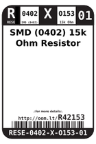
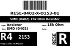
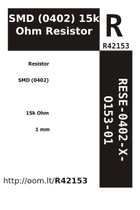

Contents
========

* [RESE-4O153-01 > SMD (0402) 15k Ohm Resistor](#rese-4o153-01--smd-0402-15k-ohm-resistor)
	* [Labels](#labels)
	* [EDA](#eda)
	* [Images](#images)
	* [Tags](#tags)
  
![][im]
# RESE-4O153-01 > SMD (0402) 15k Ohm Resistor

- ID: RESE-0402-X-O153-01
- Hex ID: RESE-4O153-01
- Name: SMD (0402) 15k Ohm Resistor
- Description: SMD (0402) 15k Ohm Resistor
- Long Link: [http://oom.lt/RESE-0402-X-O153-01](http://oom.lt/RESE-0402-X-O153-01)
- Short Link: [http://oom.lt/RESE-4O153-01](http://oom.lt/RESE-4O153-01)

## Labels
  
  

|label-front|label-inventory|label-spec|
| :---: | :---: | :---: |
||||

## EDA

## Images
  
  

|image|image_BOTTOM|label-front|label-inventory|label-spec|
| :---: | :---: | :---: | :---: | :---: |
||||||

## Tags

- oompType: RESE
- oompSize: 0402
- oompColor: X
- oompDesc: O153
- oompIndex: 01
- oplPartNumber: {'code': 'C-JLCC', 'name': 'JLC Parts Library', 'partID': 'C25756', 'desc': '62.5mW Thick Film Resistors 50V ??100ppm/?? ??1% -55??~+155?? 15k?? 0402  Chip Resistor - Surface Mount ROHS'}
- distributorPartNumber: {'code': 'C-LCSC', 'name': 'LCSC', 'partID': 'C25756'}
- manufacturerPartNumber: {'code': 'C-XXXX', 'name': 'UNI-ROYAL(Uniroyal Elec)', 'partID': '0402WGF1502TCE'}
- hexID: RESE-4O153-01
- oompID: RESE-0402-X-O153-01

[im]: image_450.jpg
