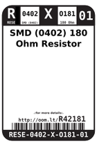
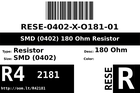
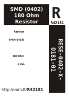

Contents
========

* [R42181 > SMD (0402) 180 Ohm Resistor](#r42181--smd-0402-180-ohm-resistor)
	* [Labels](#labels)
	* [EDA](#eda)
	* [Images](#images)
	* [Tags](#tags)
  
![][im]
# R42181 > SMD (0402) 180 Ohm Resistor

- ID: RESE-0402-X-O181-01
- Hex ID: R42181
- Name: SMD (0402) 180 Ohm Resistor
- Description: SMD (0402) 180 Ohm Resistor
- Long Link: [http://oom.lt/RESE-0402-X-O181-01](http://oom.lt/RESE-0402-X-O181-01)
- Short Link: [http://oom.lt/R42181](http://oom.lt/R42181)

## Labels
  
  

|label-front|label-inventory|label-spec|
| :---: | :---: | :---: |
||||

## EDA

### Footprints
  

|[  FOOTPRINT-kicad-kicad-footprints-Resistor_SMD-R_0402_1005Metric](https://github.com/oomlout/oomlout_OOMP_eda/tree/main/FOOTPRINT/kicad/kicad-footprints/Resistor_SMD/R_0402_1005Metric/)|[  FOOTPRINT-kicad-kicad-footprints-Resistor_SMD-R_0402_1005Metric_Pad0.72x0.64mm_HandSolder](https://github.com/oomlout/oomlout_OOMP_eda/tree/main/FOOTPRINT/kicad/kicad-footprints/Resistor_SMD/R_0402_1005Metric_Pad0.72x0.64mm_HandSolder/)|||
| :---: | :---: | :---: | :---: |

### Symbols
  

|[  SYMBOL-kicad-kicad-symbols-Device-R](https://github.com/oomlout/oomlout_OOMP_eda/tree/main/SYMBOL/kicad/kicad-symbols/Device/R/)||||
| :---: | :---: | :---: | :---: |
  

### Instances
  
Used 2 times.  
Prevalance: (2\10986) 0.0182%  

|Project|Occur- rences|Identifiers|
| :---: | :---: | :---: |
|[PROJ-SPAR-10617-STAN-01 Lipo Fuel Gauge](https://github.com/oomlout/oomlout_OOMP_projects/tree/main/PROJ-SPAR-10617-STAN-01/)|[1](https://github.com/oomlout/oomlout_OOMP_projects/tree/main/PROJ-SPAR-10617-STAN-01/)|[R2](https://github.com/oomlout/oomlout_OOMP_projects/tree/main/PROJ-SPAR-10617-STAN-01/)|
|[PROJ-SPAR-12081-STAN-01 USB Weather Board](https://github.com/oomlout/oomlout_OOMP_projects/tree/main/PROJ-SPAR-12081-STAN-01/)|[1](https://github.com/oomlout/oomlout_OOMP_projects/tree/main/PROJ-SPAR-12081-STAN-01/)|[R2](https://github.com/oomlout/oomlout_OOMP_projects/tree/main/PROJ-SPAR-12081-STAN-01/)|

## Images
  
  

|image|image_BOTTOM|label-front|label-inventory|label-spec|
| :---: | :---: | :---: | :---: | :---: |
||||||

## Tags

- oompID: RESE-0402-X-O181-01
- name: SMD (0402) 180 Ohm Resistor
- hexID: R42181
- oompDesc: O181
- oompType: RESE
- oompSize: 0402
- oompColor: X
- oompIndex: 01
- oompVersion: 999
- ooWidth: 0.5mm
- ooHeight: 0.35mm
- ooLength: 1mm
- oompBbls: template;XXXX-0402-X-XXXX-XX-bbls
- oompDiag: template;XXXX-0402-X-XXXX-XX-diag
- oompIden: template;XXXX-0402-X-XXXX-XX-iden
- oompSchem: template;RESE-XXXX-X-XXXX-XX-schem
- oompSimp: template;XXXX-0402-X-XXXX-XX-simp
- ooDesignator: R1
- oompInstances: {'PROJECT': 'PROJ-SPAR-10617-STAN-01', 'ID': 'R2'}
- oompInstances: {'PROJECT': 'PROJ-SPAR-12081-STAN-01', 'ID': 'R2'}
- footprintKicad: FOOTPRINT-kicad-kicad-footprints-Resistor_SMD-R_0402_1005Metric
- footprintKicad: FOOTPRINT-kicad-kicad-footprints-Resistor_SMD-R_0402_1005Metric_Pad0.72x0.64mm_HandSolder
- symbolKicad: SYMBOL-kicad-kicad-symbols-Device-R

[im]: image_450.jpg
