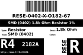
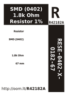

Contents
========

* [R42182A > SMD (0402) 1.8k Ohm Resistor 1%](#r42182a--smd-0402-18k-ohm-resistor-1)
	* [Labels](#labels)
	* [EDA](#eda)
	* [Images](#images)
	* [Tags](#tags)
  
![][im]
# R42182A > SMD (0402) 1.8k Ohm Resistor 1%

- ID: RESE-0402-X-O182-67
- Hex ID: R42182A
- Name: SMD (0402) 1.8k Ohm Resistor 1%
- Description: SMD (0402) 1.8k Ohm Resistor 1%
- Long Link: [http://oom.lt/RESE-0402-X-O182-67](http://oom.lt/RESE-0402-X-O182-67)
- Short Link: [http://oom.lt/R42182A](http://oom.lt/R42182A)

## Labels
  
  

|label-front|label-inventory|label-spec|
| :---: | :---: | :---: |
||||

## EDA

### Footprints
  

|[  FOOTPRINT-kicad-kicad-footprints-Resistor_SMD-R_0402_1005Metric](https://github.com/oomlout/oomlout_OOMP_eda/tree/main/FOOTPRINT/kicad/kicad-footprints/Resistor_SMD/R_0402_1005Metric/)|[  FOOTPRINT-kicad-kicad-footprints-Resistor_SMD-R_0402_1005Metric_Pad0.72x0.64mm_HandSolder](https://github.com/oomlout/oomlout_OOMP_eda/tree/main/FOOTPRINT/kicad/kicad-footprints/Resistor_SMD/R_0402_1005Metric_Pad0.72x0.64mm_HandSolder/)|||
| :---: | :---: | :---: | :---: |

### Symbols
  

|[  SYMBOL-kicad-kicad-symbols-Device-R](https://github.com/oomlout/oomlout_OOMP_eda/tree/main/SYMBOL/kicad/kicad-symbols/Device/R/)||||
| :---: | :---: | :---: | :---: |

## Images
  
  

|image|image_BOTTOM|label-front|label-inventory|label-spec|
| :---: | :---: | :---: | :---: | :---: |
||||||

## Tags

- oompID: RESE-0402-X-O182-67
- name: SMD (0402) 1.8k Ohm Resistor 1%
- hexID: R42182A
- oompDesc: O182
- oompType: RESE
- oompSize: 0402
- oompColor: X
- oompIndex: 67
- oompVersion: 999
- ooWidth: 0.5mm
- ooHeight: 0.35mm
- ooLength: 1mm
- oompBbls: template;XXXX-0402-X-XXXX-XX-bbls
- oompDiag: template;XXXX-0402-X-XXXX-XX-diag
- oompIden: template;XXXX-0402-X-XXXX-XX-iden
- oompSchem: template;RESE-XXXX-X-XXXX-XX-schem
- oompSimp: template;XXXX-0402-X-XXXX-XX-simp
- ooDesignator: R1
- symbolKicad: SYMBOL-kicad-kicad-symbols-Device-R
- footprintKicad: FOOTPRINT-kicad-kicad-footprints-Resistor_SMD-R_0402_1005Metric
- footprintKicad: FOOTPRINT-kicad-kicad-footprints-Resistor_SMD-R_0402_1005Metric_Pad0.72x0.64mm_HandSolder

[im]: image_450.jpg
