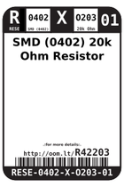
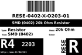
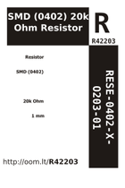

Contents
========

* [R42203 > SMD (0402) 20k Ohm Resistor](#r42203--smd-0402-20k-ohm-resistor)
	* [Labels](#labels)
	* [EDA](#eda)
	* [Images](#images)
	* [Tags](#tags)
  
![][im]
# R42203 > SMD (0402) 20k Ohm Resistor

- ID: RESE-0402-X-O203-01
- Hex ID: R42203
- Name: SMD (0402) 20k Ohm Resistor
- Description: SMD (0402) 20k Ohm Resistor
- Long Link: [http://oom.lt/RESE-0402-X-O203-01](http://oom.lt/RESE-0402-X-O203-01)
- Short Link: [http://oom.lt/R42203](http://oom.lt/R42203)

## Labels
  
  

|label-front|label-inventory|label-spec|
| :---: | :---: | :---: |
||||

## EDA
  

### Instances
  
Used 7 times.  
Prevalance: (7\10986) 0.0637%  

|OOMP Instances|
| :---: |
|[PROJ-SPAR-10507-STAN-01  Quadstepper Motor Driver  Used 4 times. R6, R13, R20, R27](https://github.com/oomlout/oomlout_OOMP_projects/tree/main/PROJ-SPAR-10507-STAN-01/)|
|[PROJ-SPAR-11129-STAN-01  Si4707 Breakout  Used 2 times. R9, R10](https://github.com/oomlout/oomlout_OOMP_projects/tree/main/PROJ-SPAR-11129-STAN-01/)|
|[PROJ-SPAR-11703-STAN-01  UDB5  Used 1 times. R1](https://github.com/oomlout/oomlout_OOMP_projects/tree/main/PROJ-SPAR-11703-STAN-01/)|

## Images
  
  

|image|image_BOTTOM|label-front|label-inventory|label-spec|
| :---: | :---: | :---: | :---: | :---: |
||||||

## Tags

- oompID: RESE-0402-X-O203-01
- name: SMD (0402) 20k Ohm Resistor
- hexID: R42203
- oompDesc: O203
- oompType: RESE
- oompSize: 0402
- oompColor: X
- oompIndex: 01
- oompVersion: 999
- ooWidth: 0.5mm
- ooHeight: 0.35mm
- ooLength: 1mm
- oompBbls: template;XXXX-0402-X-XXXX-XX-bbls
- oompDiag: template;XXXX-0402-X-XXXX-XX-diag
- oompIden: template;XXXX-0402-X-XXXX-XX-iden
- oompSchem: template;RESE-XXXX-X-XXXX-XX-schem
- oompSimp: template;XXXX-0402-X-XXXX-XX-simp
- ooDesignator: R1
- oompInstances: {'PROJECT': 'PROJ-SPAR-10507-STAN-01', 'ID': 'R6'}
- oompInstances: {'PROJECT': 'PROJ-SPAR-10507-STAN-01', 'ID': 'R13'}
- oompInstances: {'PROJECT': 'PROJ-SPAR-10507-STAN-01', 'ID': 'R20'}
- oompInstances: {'PROJECT': 'PROJ-SPAR-10507-STAN-01', 'ID': 'R27'}
- oompInstances: {'PROJECT': 'PROJ-SPAR-11129-STAN-01', 'ID': 'R9'}
- oompInstances: {'PROJECT': 'PROJ-SPAR-11129-STAN-01', 'ID': 'R10'}
- oompInstances: {'PROJECT': 'PROJ-SPAR-11703-STAN-01', 'ID': 'R1'}

[im]: image_450.jpg
