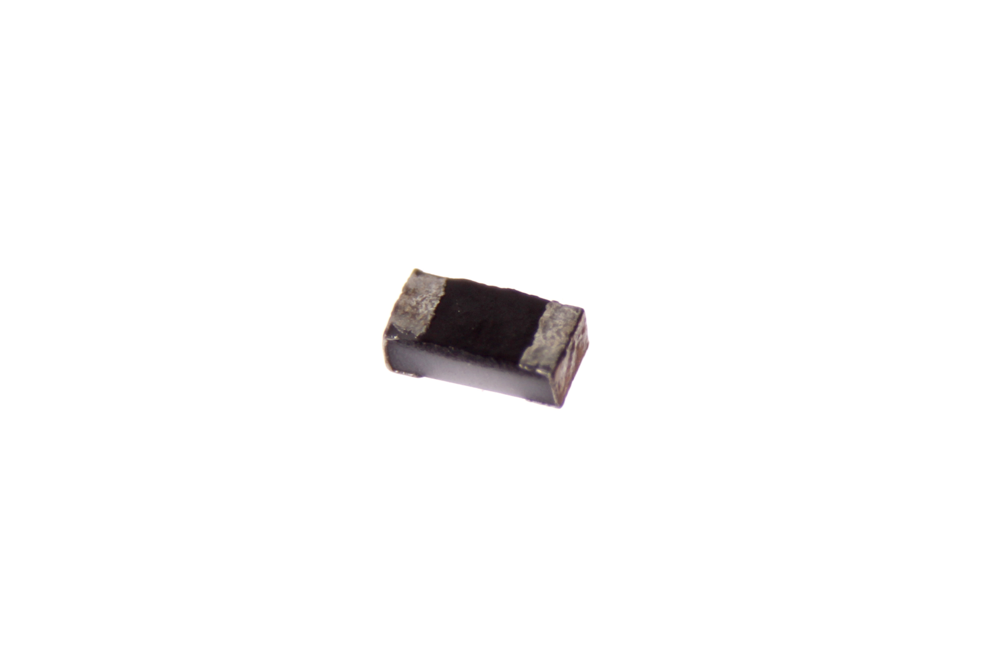
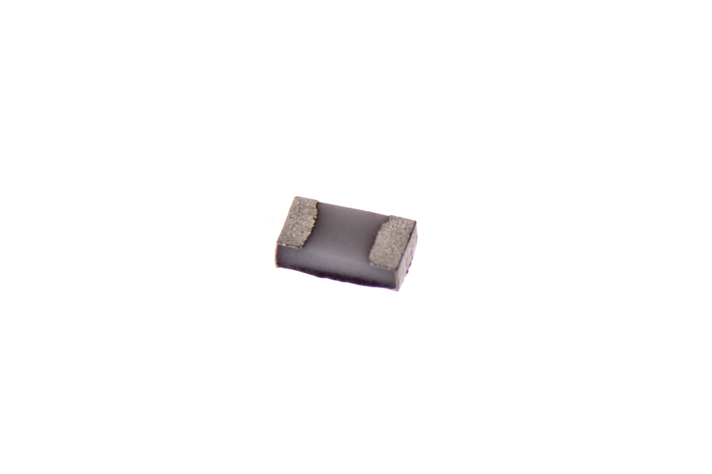

Contents
========

* [RESE-0402-X-O220-67>SMD (0402) 22 Ohm Resistor 1%](#rese-0402-x-o220-67smd-0402-22-ohm-resistor-1)
	* [Images](#images)
	* [Datasheets](#datasheets)
	* [Labels](#labels)
	* [EDA](#eda)
		* [Symbols](#symbols)
	* [Tags](#tags)
  
![][im]
# RESE-0402-X-O220-67>SMD (0402) 22 Ohm Resistor 1%

- ID: RESE-0402-X-O220-67
- Name: RESE-0402-X-O220-67

## Images
  
  

|Main|Bottom|
| :---: | :---: |
|||

## Datasheets

- Datasheet: [datasheet.pdf](datasheet.pdf)

## Labels
  
  

|Front|Inventory|Specifications|
| :---: | :---: | :---: |
||||

## EDA

### Symbols

## Tags

- hexID: R42220A
- oompSort: RESE0402O220
- oompType: RESE
- oompSize: 0402
- oompColor: X
- oompDesc: O220
- oompIndex: 67
- oompVersion: 98
- ooWidth: 0.5 mm
- ooLength: 1.0 mm
- ooNumPins: 2
- oompBbls: template;XXXX-0402-X-XXXX-XX-bbls
- oompDiag: template;XXXX-0402-X-XXXX-XX-diag
- oompIden: template;XXXX-0402-X-XXXX-XX-iden
- oompSchem: template;RESE-XXXX-X-XXXX-XX-schem
- oompSimp: template;XXXX-0402-X-XXXX-XX-simp
- ooDesignator: R1

[im]: image_600.jpg
