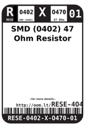
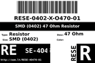
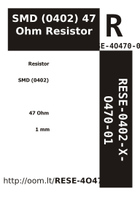

Contents
========

* [R4O470 > SMD (0402) 47 Ohm Resistor](#r4o470--smd-0402-47-ohm-resistor)
	* [Labels](#labels)
	* [EDA](#eda)
	* [Images](#images)
	* [Tags](#tags)

# R4O470 > SMD (0402) 47 Ohm Resistor

- ID: RESE-0402-X-O470-01
- Hex ID: R4O470
- Name: SMD (0402) 47 Ohm Resistor
- Description: SMD (0402) 47 Ohm Resistor
- Long Link: [http://oom.lt/RESE-0402-X-O470-01](http://oom.lt/RESE-0402-X-O470-01)
- Short Link: [http://oom.lt/R4O470](http://oom.lt/R4O470)

## Labels
  
  

|label-front|label-inventory|label-spec|
| :---: | :---: | :---: |
||||

## EDA

### Footprints
  

|[  FOOTPRINT-kicad-kicad-footprints-Resistor_SMD-R_0402_1005Metric](https://github.com/oomlout/oomlout_OOMP_eda/tree/main/FOOTPRINT/kicad/kicad-footprints/Resistor_SMD/R_0402_1005Metric/)|[  FOOTPRINT-kicad-kicad-footprints-Resistor_SMD-R_0402_1005Metric_Pad0.72x0.64mm_HandSolder](https://github.com/oomlout/oomlout_OOMP_eda/tree/main/FOOTPRINT/kicad/kicad-footprints/Resistor_SMD/R_0402_1005Metric_Pad0.72x0.64mm_HandSolder/)|||
| :---: | :---: | :---: | :---: |

### Symbols
  

|[  SYMBOL-kicad-kicad-symbols-Device-R](https://github.com/oomlout/oomlout_OOMP_eda/tree/main/SYMBOL/kicad/kicad-symbols/Device/R/)||||
| :---: | :---: | :---: | :---: |

## Images
  
  

|label-front|label-inventory|label-spec|
| :---: | :---: | :---: |
||||

## Tags

- oompType: RESE
- oompSize: 0402
- oompColor: X
- oompDesc: O470
- oompIndex: 01
- oplPartNumber: {'code': 'C-JLCC', 'name': 'JLC Parts Library', 'partID': 'C25118', 'desc': '62.5mW Thick Film Resistors 50V ??1% ??200ppm/?? -55??~+155?? 47?? 0402  Chip Resistor - Surface Mount ROHS'}
- distributorPartNumber: {'code': 'C-LCSC', 'name': 'LCSC', 'partID': 'C25118'}
- manufacturerPartNumber: {'code': 'C-XXXX', 'name': 'UNI-ROYAL(Uniroyal Elec)', 'partID': '0402WGF470JTCE'}
- hexID: R4O470
- oompID: RESE-0402-X-O470-01
- symbolKicad: SYMBOL-kicad-kicad-symbols-Device-R
- footprintKicad: FOOTPRINT-kicad-kicad-footprints-Resistor_SMD-R_0402_1005Metric
- footprintKicad: FOOTPRINT-kicad-kicad-footprints-Resistor_SMD-R_0402_1005Metric_Pad0.72x0.64mm_HandSolder
