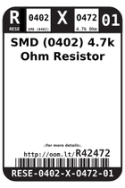
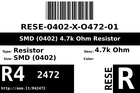
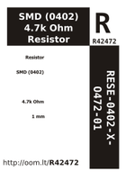

Contents
========

* [R42472 > SMD (0402) 4.7k Ohm Resistor](#r42472--smd-0402-47k-ohm-resistor)
	* [Datasheets](#datasheets)
	* [Labels](#labels)
	* [EDA](#eda)
	* [Images](#images)
	* [Tags](#tags)
  
![][im]
# R42472 > SMD (0402) 4.7k Ohm Resistor

- ID: RESE-0402-X-O472-01
- Hex ID: R42472
- Name: SMD (0402) 4.7k Ohm Resistor
- Description: SMD (0402) 4.7k Ohm Resistor
- Long Link: [http://oom.lt/RESE-0402-X-O472-01](http://oom.lt/RESE-0402-X-O472-01)
- Short Link: [http://oom.lt/R42472](http://oom.lt/R42472)

## Datasheets

- Datasheet: [datasheet.pdf](datasheet.pdf)

## Labels
  
  

|label-front|label-inventory|label-spec|
| :---: | :---: | :---: |
||||

## EDA

### Instances
  
  
Used 46 times.  
Prevalance: (46\9905) 0.4644%  

|OOMP Instances|
| :---: |
|[PROJ-ADAF-4600-STAN-01  Adafruit QT Py PCB  Used 3 times. R1, R5, R6](https://github.com/oomlout/oomlout_OOMP_projects/tree/main/PROJ-ADAF-4600-STAN-01/)|
|[PROJ-ADAF-4900-STAN-01  Adafruit QT Py RP2040 PCB  Used 2 times. R12, R13](https://github.com/oomlout/oomlout_OOMP_projects/tree/main/PROJ-ADAF-4900-STAN-01/)|
|[PROJ-ADAF-5302-STAN-01  Adafruit KB2040 PCB  Used 4 times. R1, R2, R10, R12](https://github.com/oomlout/oomlout_OOMP_projects/tree/main/PROJ-ADAF-5302-STAN-01/)|
|[PROJ-ADAF-5325-STAN-01  Adafruit QT Py ESP32 S2 PCB  Used 2 times. R5, R6](https://github.com/oomlout/oomlout_OOMP_projects/tree/main/PROJ-ADAF-5325-STAN-01/)|
|[PROJ-ADAF-5395-STAN-01  Adafruit QT Py ESP32 Pico PCB  Used 2 times. R5, R6](https://github.com/oomlout/oomlout_OOMP_projects/tree/main/PROJ-ADAF-5395-STAN-01/)|
|[PROJ-ADAF-5405-STAN-01  Adafruit QT Py ESP32 C3 PCB  Used 2 times. R5, R6](https://github.com/oomlout/oomlout_OOMP_projects/tree/main/PROJ-ADAF-5405-STAN-01/)|
|[PROJ-ADAF-5426-STAN-01  Adafruit QT Py ESP32 S3 PCB  Used 2 times. R5, R6](https://github.com/oomlout/oomlout_OOMP_projects/tree/main/PROJ-ADAF-5426-STAN-01/)|
|[PROJ-SPAR-10103-STAN-01  Serial Alphanumeric Display Driver  Used 1 times. R1](https://github.com/oomlout/oomlout_OOMP_projects/tree/main/PROJ-SPAR-10103-STAN-01/)|
|[PROJ-SPAR-10182-STAN-01  Monster Moto Shield  Used 2 times. R8, R17](https://github.com/oomlout/oomlout_OOMP_projects/tree/main/PROJ-SPAR-10182-STAN-01/)|
|[PROJ-SPAR-10406-STAN-01  RFID Evaluation Shield  Used 2 times. R5, R6](https://github.com/oomlout/oomlout_OOMP_projects/tree/main/PROJ-SPAR-10406-STAN-01/)|
|[PROJ-SPAR-10617-STAN-01  Lipo Fuel Gauge  Used 4 times. R3, R4, R5, R6](https://github.com/oomlout/oomlout_OOMP_projects/tree/main/PROJ-SPAR-10617-STAN-01/)|
|[PROJ-SPAR-10888-STAN-01  LSM303 Breakout  Used 4 times. R1, R2, R3, R4](https://github.com/oomlout/oomlout_OOMP_projects/tree/main/PROJ-SPAR-10888-STAN-01/)|
|[PROJ-SPAR-10914-STAN-01  Arduino Pro 328  Used 1 times. R11](https://github.com/oomlout/oomlout_OOMP_projects/tree/main/PROJ-SPAR-10914-STAN-01/)|
|[PROJ-SPAR-11013-STAN-01  LilyPad MP3 Player  Used 2 times. R18, R19](https://github.com/oomlout/oomlout_OOMP_projects/tree/main/PROJ-SPAR-11013-STAN-01/)|
|[PROJ-SPAR-11083-STAN-01  FM Tuner Basic Breakout-Si4703  Used 2 times. R3, R8](https://github.com/oomlout/oomlout_OOMP_projects/tree/main/PROJ-SPAR-11083-STAN-01/)|
|[PROJ-SPAR-11129-STAN-01  Si4707 Breakout  Used 2 times. R5, R6](https://github.com/oomlout/oomlout_OOMP_projects/tree/main/PROJ-SPAR-11129-STAN-01/)|
|[PROJ-SPAR-11282-STAN-01  BMP085 Breakout  Used 2 times. R1, R2](https://github.com/oomlout/oomlout_OOMP_projects/tree/main/PROJ-SPAR-11282-STAN-01/)|
|[PROJ-SPAR-11703-STAN-01  UDB5  Used 4 times. R7, R9, R13, R14](https://github.com/oomlout/oomlout_OOMP_projects/tree/main/PROJ-SPAR-11703-STAN-01/)|
|[PROJ-SPAR-12081-STAN-01  USB Weather Board  Used 3 times. R4, R5, R17](https://github.com/oomlout/oomlout_OOMP_projects/tree/main/PROJ-SPAR-12081-STAN-01/)|

### Symbols

## Images
  
  

|image|image_BOTTOM|label-front|label-inventory|label-spec|
| :---: | :---: | :---: | :---: | :---: |
||||||

## Tags

- oompID: RESE-0402-X-O472-01
- hexID: R42472
- oompDesc: O472
- name: SMD (0402) 4.7k Ohm Resistor
- oompSort: RESE0402O472
- oompType: RESE
- oompSize: 0402
- oompColor: X
- oompIndex: 01
- oompVersion: 999
- ooWidth: 0.5mm
- ooHeight: 0.35mm
- ooLength: 1mm
- oompBbls: template;XXXX-0402-X-XXXX-XX-bbls
- oompDiag: template;XXXX-0402-X-XXXX-XX-diag
- oompIden: template;XXXX-0402-X-XXXX-XX-iden
- oompSchem: template;RESE-XXXX-X-XXXX-XX-schem
- oompSimp: template;XXXX-0402-X-XXXX-XX-simp
- ooDesignator: R1
- oompInstances: {'PROJECT': 'PROJ-ADAF-4600-STAN-01', 'ID': 'R1'}
- oompInstances: {'PROJECT': 'PROJ-ADAF-4600-STAN-01', 'ID': 'R5'}
- oompInstances: {'PROJECT': 'PROJ-ADAF-4600-STAN-01', 'ID': 'R6'}
- oompInstances: {'PROJECT': 'PROJ-ADAF-4900-STAN-01', 'ID': 'R12'}
- oompInstances: {'PROJECT': 'PROJ-ADAF-4900-STAN-01', 'ID': 'R13'}
- oompInstances: {'PROJECT': 'PROJ-ADAF-5302-STAN-01', 'ID': 'R1'}
- oompInstances: {'PROJECT': 'PROJ-ADAF-5302-STAN-01', 'ID': 'R2'}
- oompInstances: {'PROJECT': 'PROJ-ADAF-5302-STAN-01', 'ID': 'R10'}
- oompInstances: {'PROJECT': 'PROJ-ADAF-5302-STAN-01', 'ID': 'R12'}
- oompInstances: {'PROJECT': 'PROJ-ADAF-5325-STAN-01', 'ID': 'R5'}
- oompInstances: {'PROJECT': 'PROJ-ADAF-5325-STAN-01', 'ID': 'R6'}
- oompInstances: {'PROJECT': 'PROJ-ADAF-5395-STAN-01', 'ID': 'R5'}
- oompInstances: {'PROJECT': 'PROJ-ADAF-5395-STAN-01', 'ID': 'R6'}
- oompInstances: {'PROJECT': 'PROJ-ADAF-5405-STAN-01', 'ID': 'R5'}
- oompInstances: {'PROJECT': 'PROJ-ADAF-5405-STAN-01', 'ID': 'R6'}
- oompInstances: {'PROJECT': 'PROJ-ADAF-5426-STAN-01', 'ID': 'R5'}
- oompInstances: {'PROJECT': 'PROJ-ADAF-5426-STAN-01', 'ID': 'R6'}
- oompInstances: {'PROJECT': 'PROJ-SPAR-10103-STAN-01', 'ID': 'R1'}
- oompInstances: {'PROJECT': 'PROJ-SPAR-10182-STAN-01', 'ID': 'R8'}
- oompInstances: {'PROJECT': 'PROJ-SPAR-10182-STAN-01', 'ID': 'R17'}
- oompInstances: {'PROJECT': 'PROJ-SPAR-10406-STAN-01', 'ID': 'R5'}
- oompInstances: {'PROJECT': 'PROJ-SPAR-10406-STAN-01', 'ID': 'R6'}
- oompInstances: {'PROJECT': 'PROJ-SPAR-10617-STAN-01', 'ID': 'R3'}
- oompInstances: {'PROJECT': 'PROJ-SPAR-10617-STAN-01', 'ID': 'R4'}
- oompInstances: {'PROJECT': 'PROJ-SPAR-10617-STAN-01', 'ID': 'R5'}
- oompInstances: {'PROJECT': 'PROJ-SPAR-10617-STAN-01', 'ID': 'R6'}
- oompInstances: {'PROJECT': 'PROJ-SPAR-10888-STAN-01', 'ID': 'R1'}
- oompInstances: {'PROJECT': 'PROJ-SPAR-10888-STAN-01', 'ID': 'R2'}
- oompInstances: {'PROJECT': 'PROJ-SPAR-10888-STAN-01', 'ID': 'R3'}
- oompInstances: {'PROJECT': 'PROJ-SPAR-10888-STAN-01', 'ID': 'R4'}
- oompInstances: {'PROJECT': 'PROJ-SPAR-10914-STAN-01', 'ID': 'R11'}
- oompInstances: {'PROJECT': 'PROJ-SPAR-11013-STAN-01', 'ID': 'R18'}
- oompInstances: {'PROJECT': 'PROJ-SPAR-11013-STAN-01', 'ID': 'R19'}
- oompInstances: {'PROJECT': 'PROJ-SPAR-11083-STAN-01', 'ID': 'R3'}
- oompInstances: {'PROJECT': 'PROJ-SPAR-11083-STAN-01', 'ID': 'R8'}
- oompInstances: {'PROJECT': 'PROJ-SPAR-11129-STAN-01', 'ID': 'R5'}
- oompInstances: {'PROJECT': 'PROJ-SPAR-11129-STAN-01', 'ID': 'R6'}
- oompInstances: {'PROJECT': 'PROJ-SPAR-11282-STAN-01', 'ID': 'R1'}
- oompInstances: {'PROJECT': 'PROJ-SPAR-11282-STAN-01', 'ID': 'R2'}
- oompInstances: {'PROJECT': 'PROJ-SPAR-11703-STAN-01', 'ID': 'R7'}
- oompInstances: {'PROJECT': 'PROJ-SPAR-11703-STAN-01', 'ID': 'R9'}
- oompInstances: {'PROJECT': 'PROJ-SPAR-11703-STAN-01', 'ID': 'R13'}
- oompInstances: {'PROJECT': 'PROJ-SPAR-11703-STAN-01', 'ID': 'R14'}
- oompInstances: {'PROJECT': 'PROJ-SPAR-12081-STAN-01', 'ID': 'R4'}
- oompInstances: {'PROJECT': 'PROJ-SPAR-12081-STAN-01', 'ID': 'R5'}
- oompInstances: {'PROJECT': 'PROJ-SPAR-12081-STAN-01', 'ID': 'R17'}

[im]: image_450.jpg
