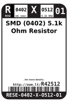
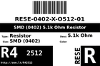
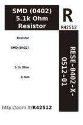

Contents
========

* [R42512 > SMD (0402) 5.1k Ohm Resistor](#r42512--smd-0402-51k-ohm-resistor)
	* [Labels](#labels)
	* [EDA](#eda)
	* [Images](#images)
	* [Tags](#tags)
  
![][im]
# R42512 > SMD (0402) 5.1k Ohm Resistor

- ID: RESE-0402-X-O512-01
- Hex ID: R42512
- Name: SMD (0402) 5.1k Ohm Resistor
- Description: SMD (0402) 5.1k Ohm Resistor
- Long Link: [http://oom.lt/RESE-0402-X-O512-01](http://oom.lt/RESE-0402-X-O512-01)
- Short Link: [http://oom.lt/R42512](http://oom.lt/R42512)

## Labels
  
  

|label-front|label-inventory|label-spec|
| :---: | :---: | :---: |
||||

## EDA

### Symbols

## Images
  
  

|image|image_BOTTOM|label-front|label-inventory|label-spec|
| :---: | :---: | :---: | :---: | :---: |
||||||

## Tags

- oompID: RESE-0402-X-O512-01
- name: SMD (0402) 5.1k Ohm Resistor
- hexID: R42512
- oompDesc: O512
- oompType: RESE
- oompSize: 0402
- oompColor: X
- oompIndex: 01
- oompVersion: 999
- ooWidth: 0.5mm
- ooHeight: 0.35mm
- ooLength: 1mm
- oompBbls: template;XXXX-0402-X-XXXX-XX-bbls
- oompDiag: template;XXXX-0402-X-XXXX-XX-diag
- oompIden: template;XXXX-0402-X-XXXX-XX-iden
- oompSchem: template;RESE-XXXX-X-XXXX-XX-schem
- oompSimp: template;XXXX-0402-X-XXXX-XX-simp
- ooDesignator: R1

[im]: image_450.jpg
