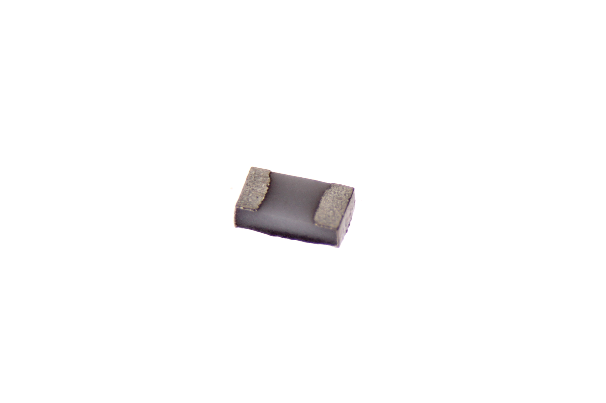

Contents
========

* [RESE-0402-X-O514-01>SMD (0402) 510k Ohm Resistor](#rese-0402-x-o514-01smd-0402-510k-ohm-resistor)
	* [Images](#images)
	* [Datasheets](#datasheets)
	* [EDA](#eda)
		* [Footprints](#footprints)
		* [Symbols](#symbols)
	* [Tags](#tags)

# RESE-0402-X-O514-01>SMD (0402) 510k Ohm Resistor

- ID: RESE-0402-X-O514-01
- Name: RESE-0402-X-O514-01

## Images
  
  

|Main|Bottom|
| :---: | :---: |
|||

## Datasheets

- Datasheet: [datasheet.pdf](datasheet.pdf)

## EDA

### Footprints
  

|||||
| :---: | :---: | :---: | :---: |

### Symbols

## Tags

- index: 514
- oompID: RESE-0402-X-O514-01
- name: SMD (0402) 510k Ohm Resistor
- hexID: R42514
- oompDesc: O514
- oompType: RESE
- oompSize: 0402
- oompColor: X
- oompIndex: 01
- oompVersion: 999
- ooWidth: 0.5mm
- ooHeight: 0.35mm
- ooLength: 1mm
- oompBbls: template;XXXX-0402-X-XXXX-XX-bbls
- oompDiag: template;XXXX-0402-X-XXXX-XX-diag
- oompIden: template;XXXX-0402-X-XXXX-XX-iden
- oompSchem: template;RESE-XXXX-X-XXXX-XX-schem
- oompSimp: template;XXXX-0402-X-XXXX-XX-simp
- ooDesignator: R1
