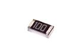

Contents
========

* [R6100 > SMD (0603) 10 Ohm Resistor](#r6100--smd-0603-10-ohm-resistor)
	* [Datasheets](#datasheets)
	* [Labels](#labels)
	* [EDA](#eda)
	* [Images](#images)
	* [Tags](#tags)
  
![][im]
# R6100 > SMD (0603) 10 Ohm Resistor

- ID: RESE-0603-X-O100-01
- Hex ID: R6100
- Name: SMD (0603) 10 Ohm Resistor
- Description: SMD (0603) 10 Ohm Resistor
- Long Link: [http://oom.lt/RESE-0603-X-O100-01](http://oom.lt/RESE-0603-X-O100-01)
- Short Link: [http://oom.lt/R6100](http://oom.lt/R6100)

## Datasheets

- Datasheet: [datasheet.pdf](datasheet.pdf)

## Labels
  
  

|label-front|label-inventory|label-spec|
| :---: | :---: | :---: |
||||

## EDA

### Footprints
  

|  [kicad/kicad-footprints/Resistor_SMD/R_0603_1608Metric_Pad0.98x0.95mm_HandSolder](https://github.com/oomlout/oomlout_OOMP_eda/tree/main/footprints/kicad/kicad-footprints/Resistor_SMD/R_0603_1608Metric_Pad0.98x0.95mm_HandSolder/)|  [kicad/kicad-footprints/Resistor_SMD/R_0603_1608Metric](https://github.com/oomlout/oomlout_OOMP_eda/tree/main/footprints/kicad/kicad-footprints/Resistor_SMD/R_0603_1608Metric/)|  [eagle/Adafruit-Eagle-Library/adafruit/R0603](https://github.com/oomlout/oomlout_OOMP_eda/tree/main/footprints/eagle/Adafruit-Eagle-Library/adafruit/R0603/)||
| :---: | :---: | :---: | :---: |

### Instances
  
  
Used 24 times.  
Prevalance: (24\9905) 0.2423%  

|OOMP Instances|
| :---: |
|[PROJ-ADAF-3201-STAN-01  Adafruit Ethernet FeatherWing PCB  Used 1 times. R12](https://github.com/oomlout/oomlout_OOMP_projects/tree/main/PROJ-ADAF-3201-STAN-01/)|
|[PROJ-ADAF-3321-STAN-01  Adafruit Mini TFT with Joystick Featherwing PCB  Used 1 times. R1](https://github.com/oomlout/oomlout_OOMP_projects/tree/main/PROJ-ADAF-3321-STAN-01/)|
|[PROJ-ADAF-3787-STAN-01  Adafruit 1.54 inch 240x240 TFT PCB  Used 1 times. R5](https://github.com/oomlout/oomlout_OOMP_projects/tree/main/PROJ-ADAF-3787-STAN-01/)|
|[PROJ-ADAF-4300-STAN-01  Adafruit Hallowing M4 PCB  Used 1 times. R23](https://github.com/oomlout/oomlout_OOMP_projects/tree/main/PROJ-ADAF-4300-STAN-01/)|
|[PROJ-ADAF-4313-STAN-01  Adafruit 1.3 inch 240x240 TFT PCB  Used 1 times. R5](https://github.com/oomlout/oomlout_OOMP_projects/tree/main/PROJ-ADAF-4313-STAN-01/)|
|[PROJ-ADAF-4393-STAN-01  Adafruit Mini PiTFT 240x135 TFT PCB  Used 1 times. R5](https://github.com/oomlout/oomlout_OOMP_projects/tree/main/PROJ-ADAF-4393-STAN-01/)|
|[PROJ-ADAF-4500-STAN-01  Adafruit CLUE PCB  Used 2 times. R5, R6](https://github.com/oomlout/oomlout_OOMP_projects/tree/main/PROJ-ADAF-4500-STAN-01/)|
|[PROJ-ADAF-4506-STAN-01  Adafruit 1.3in Color TFT Bonnet PCB  Used 1 times. R5](https://github.com/oomlout/oomlout_OOMP_projects/tree/main/PROJ-ADAF-4506-STAN-01/)|
|[PROJ-ADAF-4740-STAN-01  Adafruit MIDI FeatherWing PCB  Used 1 times. R4](https://github.com/oomlout/oomlout_OOMP_projects/tree/main/PROJ-ADAF-4740-STAN-01/)|
|[PROJ-ADAF-5206-STAN-01  Adafruit 1.69in 280x240 Round Rectangle TFT PCB  Used 1 times. R5](https://github.com/oomlout/oomlout_OOMP_projects/tree/main/PROJ-ADAF-5206-STAN-01/)|
|[PROJ-ADAF-5393-STAN-01  Adafruit 1.47in 320x172 Round Rectangle TFT PCB  Used 1 times. R5](https://github.com/oomlout/oomlout_OOMP_projects/tree/main/PROJ-ADAF-5393-STAN-01/)|
|[PROJ-SPAR-12660-STAN-01  MP3 Player Shield  Used 1 times. R9](https://github.com/oomlout/oomlout_OOMP_projects/tree/main/PROJ-SPAR-12660-STAN-01/)|
|[PROJ-SPAR-13810-STAN-01  tsunami  Used 8 times. R37, R38, R39, R40, R41, R42, R43, R44](https://github.com/oomlout/oomlout_OOMP_projects/tree/main/PROJ-SPAR-13810-STAN-01/)|
|[PROJ-SPAR-14006-STAN-01  Lil Soundie Audio Player  Used 1 times. R27](https://github.com/oomlout/oomlout_OOMP_projects/tree/main/PROJ-SPAR-14006-STAN-01/)|
|[PROJ-SPAR-14554-STAN-01  Papa Soundie Audio Player  Used 1 times. R27](https://github.com/oomlout/oomlout_OOMP_projects/tree/main/PROJ-SPAR-14554-STAN-01/)|
|[PROJ-SPAR-15005-STAN-01  Qwiic GPS-RTK  Used 1 times. R14](https://github.com/oomlout/oomlout_OOMP_projects/tree/main/PROJ-SPAR-15005-STAN-01/)|

### Symbols

## Images
  
  

|image|image_RE|image_BOTTOM|label-front|label-inventory|label-spec|
| :---: | :---: | :---: | :---: | :---: | :---: |
|||||||

## Tags

- oompID: RESE-0603-X-O100-01
- name: SMD (0603) 10 Ohm Resistor
- hexID: R6100
- ooPackageMarking: 100
- oompDesc: O100
- oompType: RESE
- oompSize: 0603
- oompColor: X
- oompIndex: 01
- oompVersion: 999
- ooWidth: 0.8mm
- ooHeight: 0.45mm
- ooLength: 1.6mm
- oompBbls: template;XXXX-0603-X-XXXX-XX-bbls
- oompDiag: template;XXXX-0603-X-XXXX-XX-diag
- oompIden: template;XXXX-0603-X-XXXX-XX-iden
- oompSchem: template;RESE-XXXX-X-XXXX-XX-schem
- oompSimp: template;XXXX-0603-X-XXXX-XX-simp
- ooDesignator: R1
- footprintEagle: Adafruit-Eagle-Library/adafruit/R0603
- footprintKicad: kicad-footprints/Resistor_SMD/R_0603_1608Metric_Pad0.98x0.95mm_HandSolder
- footprintKicad: kicad-footprints/Resistor_SMD/R_0603_1608Metric
- oompInstances: {'PROJECT': 'PROJ-ADAF-3201-STAN-01', 'ID': 'R12'}
- oompInstances: {'PROJECT': 'PROJ-ADAF-3321-STAN-01', 'ID': 'R1'}
- oompInstances: {'PROJECT': 'PROJ-ADAF-3787-STAN-01', 'ID': 'R5'}
- oompInstances: {'PROJECT': 'PROJ-ADAF-4300-STAN-01', 'ID': 'R23'}
- oompInstances: {'PROJECT': 'PROJ-ADAF-4313-STAN-01', 'ID': 'R5'}
- oompInstances: {'PROJECT': 'PROJ-ADAF-4393-STAN-01', 'ID': 'R5'}
- oompInstances: {'PROJECT': 'PROJ-ADAF-4500-STAN-01', 'ID': 'R5'}
- oompInstances: {'PROJECT': 'PROJ-ADAF-4500-STAN-01', 'ID': 'R6'}
- oompInstances: {'PROJECT': 'PROJ-ADAF-4506-STAN-01', 'ID': 'R5'}
- oompInstances: {'PROJECT': 'PROJ-ADAF-4740-STAN-01', 'ID': 'R4'}
- oompInstances: {'PROJECT': 'PROJ-ADAF-5206-STAN-01', 'ID': 'R5'}
- oompInstances: {'PROJECT': 'PROJ-ADAF-5393-STAN-01', 'ID': 'R5'}
- oompInstances: {'PROJECT': 'PROJ-SPAR-12660-STAN-01', 'ID': 'R9'}
- oompInstances: {'PROJECT': 'PROJ-SPAR-13810-STAN-01', 'ID': 'R37'}
- oompInstances: {'PROJECT': 'PROJ-SPAR-13810-STAN-01', 'ID': 'R38'}
- oompInstances: {'PROJECT': 'PROJ-SPAR-13810-STAN-01', 'ID': 'R39'}
- oompInstances: {'PROJECT': 'PROJ-SPAR-13810-STAN-01', 'ID': 'R40'}
- oompInstances: {'PROJECT': 'PROJ-SPAR-13810-STAN-01', 'ID': 'R41'}
- oompInstances: {'PROJECT': 'PROJ-SPAR-13810-STAN-01', 'ID': 'R42'}
- oompInstances: {'PROJECT': 'PROJ-SPAR-13810-STAN-01', 'ID': 'R43'}
- oompInstances: {'PROJECT': 'PROJ-SPAR-13810-STAN-01', 'ID': 'R44'}
- oompInstances: {'PROJECT': 'PROJ-SPAR-14006-STAN-01', 'ID': 'R27'}
- oompInstances: {'PROJECT': 'PROJ-SPAR-14554-STAN-01', 'ID': 'R27'}
- oompInstances: {'PROJECT': 'PROJ-SPAR-15005-STAN-01', 'ID': 'R14'}

[im]: image_450.jpg
