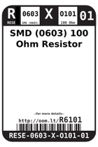
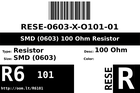
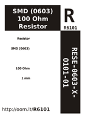

Contents
========

* [R6101 > SMD (0603) 100 Ohm Resistor](#r6101--smd-0603-100-ohm-resistor)
	* [Datasheets](#datasheets)
	* [Labels](#labels)
	* [EDA](#eda)
	* [Images](#images)
	* [Tags](#tags)
  
![][im]
# R6101 > SMD (0603) 100 Ohm Resistor

- ID: RESE-0603-X-O101-01
- Hex ID: R6101
- Name: SMD (0603) 100 Ohm Resistor
- Description: SMD (0603) 100 Ohm Resistor
- Long Link: [http://oom.lt/RESE-0603-X-O101-01](http://oom.lt/RESE-0603-X-O101-01)
- Short Link: [http://oom.lt/R6101](http://oom.lt/R6101)

## Datasheets

- Datasheet: [datasheet.pdf](datasheet.pdf)

## Labels
  
  

|label-front|label-inventory|label-spec|
| :---: | :---: | :---: |
||||

## EDA
  

### Instances
  
Used 139 times.  
Prevalance: (139\10986) 1.2652%  

|Project|Occur- rences|Identifiers|
| :---: | :---: | :---: |
|[PROJ-ADAF-2741-STAN-01 Pixie 3W Smart LED PCB](https://github.com/oomlout/oomlout_OOMP_projects/tree/main/PROJ-ADAF-2741-STAN-01/)|[2](https://github.com/oomlout/oomlout_OOMP_projects/tree/main/PROJ-ADAF-2741-STAN-01/)|[R7, R9](https://github.com/oomlout/oomlout_OOMP_projects/tree/main/PROJ-ADAF-2741-STAN-01/)|
|[PROJ-ADAF-3000-STAN-01 Adafruit Circuit Playground PCB](https://github.com/oomlout/oomlout_OOMP_projects/tree/main/PROJ-ADAF-3000-STAN-01/)|[1](https://github.com/oomlout/oomlout_OOMP_projects/tree/main/PROJ-ADAF-3000-STAN-01/)|[R21](https://github.com/oomlout/oomlout_OOMP_projects/tree/main/PROJ-ADAF-3000-STAN-01/)|
|[PROJ-ADAF-3333-STAN-01 Adafruit Circuit Playground Express PCB](https://github.com/oomlout/oomlout_OOMP_projects/tree/main/PROJ-ADAF-3333-STAN-01/)|[2](https://github.com/oomlout/oomlout_OOMP_projects/tree/main/PROJ-ADAF-3333-STAN-01/)|[R8, R9](https://github.com/oomlout/oomlout_OOMP_projects/tree/main/PROJ-ADAF-3333-STAN-01/)|
|[PROJ-ADAF-3357-STAN-01 Adafruit Music Maker FeatherWing PCB](https://github.com/oomlout/oomlout_OOMP_projects/tree/main/PROJ-ADAF-3357-STAN-01/)|[2](https://github.com/oomlout/oomlout_OOMP_projects/tree/main/PROJ-ADAF-3357-STAN-01/)|[R6, R7](https://github.com/oomlout/oomlout_OOMP_projects/tree/main/PROJ-ADAF-3357-STAN-01/)|
|[PROJ-ADAF-3885-STAN-01 Adafruit STEMMA Speaker PCB](https://github.com/oomlout/oomlout_OOMP_projects/tree/main/PROJ-ADAF-3885-STAN-01/)|[2](https://github.com/oomlout/oomlout_OOMP_projects/tree/main/PROJ-ADAF-3885-STAN-01/)|[R12, R13](https://github.com/oomlout/oomlout_OOMP_projects/tree/main/PROJ-ADAF-3885-STAN-01/)|
|[PROJ-ADAF-3900-STAN-01 Adafruit Hallowing M0 PCB](https://github.com/oomlout/oomlout_OOMP_projects/tree/main/PROJ-ADAF-3900-STAN-01/)|[2](https://github.com/oomlout/oomlout_OOMP_projects/tree/main/PROJ-ADAF-3900-STAN-01/)|[R12, R13](https://github.com/oomlout/oomlout_OOMP_projects/tree/main/PROJ-ADAF-3900-STAN-01/)|
|[PROJ-ADAF-3988-STAN-01 Adafruit Prop Maker FeatherWing PCB](https://github.com/oomlout/oomlout_OOMP_projects/tree/main/PROJ-ADAF-3988-STAN-01/)|[2](https://github.com/oomlout/oomlout_OOMP_projects/tree/main/PROJ-ADAF-3988-STAN-01/)|[R12, R13](https://github.com/oomlout/oomlout_OOMP_projects/tree/main/PROJ-ADAF-3988-STAN-01/)|
|[PROJ-ADAF-4037-STAN-01 Adafruit I2S Audio Bonnet for Raspberry Pi PCB](https://github.com/oomlout/oomlout_OOMP_projects/tree/main/PROJ-ADAF-4037-STAN-01/)|[2](https://github.com/oomlout/oomlout_OOMP_projects/tree/main/PROJ-ADAF-4037-STAN-01/)|[R4, R6](https://github.com/oomlout/oomlout_OOMP_projects/tree/main/PROJ-ADAF-4037-STAN-01/)|
|[PROJ-ADAF-4367-STAN-01 Adafruit TFT Gizmo PCB](https://github.com/oomlout/oomlout_OOMP_projects/tree/main/PROJ-ADAF-4367-STAN-01/)|[2](https://github.com/oomlout/oomlout_OOMP_projects/tree/main/PROJ-ADAF-4367-STAN-01/)|[R12, R13](https://github.com/oomlout/oomlout_OOMP_projects/tree/main/PROJ-ADAF-4367-STAN-01/)|
|[PROJ-ADAF-4428-STAN-01 Adafruit Circuit Playground Tri Color E Ink Gizmo PCB](https://github.com/oomlout/oomlout_OOMP_projects/tree/main/PROJ-ADAF-4428-STAN-01/)|[2](https://github.com/oomlout/oomlout_OOMP_projects/tree/main/PROJ-ADAF-4428-STAN-01/)|[R12, R13](https://github.com/oomlout/oomlout_OOMP_projects/tree/main/PROJ-ADAF-4428-STAN-01/)|
|[PROJ-ADAF-4712-STAN-01 Adafruit LC709203F PCB](https://github.com/oomlout/oomlout_OOMP_projects/tree/main/PROJ-ADAF-4712-STAN-01/)|[1](https://github.com/oomlout/oomlout_OOMP_projects/tree/main/PROJ-ADAF-4712-STAN-01/)|[R4](https://github.com/oomlout/oomlout_OOMP_projects/tree/main/PROJ-ADAF-4712-STAN-01/)|
|[PROJ-ADAF-4985-STAN-01 Adafruit FunHouse PCB](https://github.com/oomlout/oomlout_OOMP_projects/tree/main/PROJ-ADAF-4985-STAN-01/)|[1](https://github.com/oomlout/oomlout_OOMP_projects/tree/main/PROJ-ADAF-4985-STAN-01/)|[R11](https://github.com/oomlout/oomlout_OOMP_projects/tree/main/PROJ-ADAF-4985-STAN-01/)|
|[PROJ-ADAF-5165-STAN-01 Adafruit MCP9601 PCB](https://github.com/oomlout/oomlout_OOMP_projects/tree/main/PROJ-ADAF-5165-STAN-01/)|[2](https://github.com/oomlout/oomlout_OOMP_projects/tree/main/PROJ-ADAF-5165-STAN-01/)|[R5, R6](https://github.com/oomlout/oomlout_OOMP_projects/tree/main/PROJ-ADAF-5165-STAN-01/)|
|[PROJ-ADAF-5296-STAN-01 Adafruit LED Arcade Button 1x4 PCB](https://github.com/oomlout/oomlout_OOMP_projects/tree/main/PROJ-ADAF-5296-STAN-01/)|[4](https://github.com/oomlout/oomlout_OOMP_projects/tree/main/PROJ-ADAF-5296-STAN-01/)|[R2, R4, R5, R6](https://github.com/oomlout/oomlout_OOMP_projects/tree/main/PROJ-ADAF-5296-STAN-01/)|
|[PROJ-SPAR-11201-STAN-01 ProtoSnap-LilyPad Dev Simple](https://github.com/oomlout/oomlout_OOMP_projects/tree/main/PROJ-SPAR-11201-STAN-01/)|[4](https://github.com/oomlout/oomlout_OOMP_projects/tree/main/PROJ-SPAR-11201-STAN-01/)|[R7, R8, R9, R10](https://github.com/oomlout/oomlout_OOMP_projects/tree/main/PROJ-SPAR-11201-STAN-01/)|
|[PROJ-SPAR-11262-STAN-01 ProtoSnap-LilyPad Development Board](https://github.com/oomlout/oomlout_OOMP_projects/tree/main/PROJ-SPAR-11262-STAN-01/)|[5](https://github.com/oomlout/oomlout_OOMP_projects/tree/main/PROJ-SPAR-11262-STAN-01/)|[R, R8, R9, R10, R11](https://github.com/oomlout/oomlout_OOMP_projects/tree/main/PROJ-SPAR-11262-STAN-01/)|
|[PROJ-SPAR-11520-STAN-01 Fio v3](https://github.com/oomlout/oomlout_OOMP_projects/tree/main/PROJ-SPAR-11520-STAN-01/)|[1](https://github.com/oomlout/oomlout_OOMP_projects/tree/main/PROJ-SPAR-11520-STAN-01/)|[R8](https://github.com/oomlout/oomlout_OOMP_projects/tree/main/PROJ-SPAR-11520-STAN-01/)|
|[PROJ-SPAR-11590-STAN-01 LilyTwinkle ProtoSnap](https://github.com/oomlout/oomlout_OOMP_projects/tree/main/PROJ-SPAR-11590-STAN-01/)|[4](https://github.com/oomlout/oomlout_OOMP_projects/tree/main/PROJ-SPAR-11590-STAN-01/)|[R1, R2, R3, R4](https://github.com/oomlout/oomlout_OOMP_projects/tree/main/PROJ-SPAR-11590-STAN-01/)|
|[PROJ-SPAR-11769-STAN-01 RedBot Line Sensor](https://github.com/oomlout/oomlout_OOMP_projects/tree/main/PROJ-SPAR-11769-STAN-01/)|[1](https://github.com/oomlout/oomlout_OOMP_projects/tree/main/PROJ-SPAR-11769-STAN-01/)|[R1](https://github.com/oomlout/oomlout_OOMP_projects/tree/main/PROJ-SPAR-11769-STAN-01/)|
|[PROJ-SPAR-12000-STAN-01 WAV Trigger](https://github.com/oomlout/oomlout_OOMP_projects/tree/main/PROJ-SPAR-12000-STAN-01/)|[17](https://github.com/oomlout/oomlout_OOMP_projects/tree/main/PROJ-SPAR-12000-STAN-01/)|[R11, R12, R13, R15, R18, R21, R22, R23, R24, R33, R34, R35, R36, R37, R38, R39, R40](https://github.com/oomlout/oomlout_OOMP_projects/tree/main/PROJ-SPAR-12000-STAN-01/)|
|[PROJ-SPAR-12080-STAN-01 VKey Voltage Keypad](https://github.com/oomlout/oomlout_OOMP_projects/tree/main/PROJ-SPAR-12080-STAN-01/)|[1](https://github.com/oomlout/oomlout_OOMP_projects/tree/main/PROJ-SPAR-12080-STAN-01/)|[R4](https://github.com/oomlout/oomlout_OOMP_projects/tree/main/PROJ-SPAR-12080-STAN-01/)|
|[PROJ-SPAR-12617-STAN-01 Magician Encoder](https://github.com/oomlout/oomlout_OOMP_projects/tree/main/PROJ-SPAR-12617-STAN-01/)|[4](https://github.com/oomlout/oomlout_OOMP_projects/tree/main/PROJ-SPAR-12617-STAN-01/)|[R1, R6, R7, R12](https://github.com/oomlout/oomlout_OOMP_projects/tree/main/PROJ-SPAR-12617-STAN-01/)|
|[PROJ-SPAR-12642-STAN-01 Sound Detector](https://github.com/oomlout/oomlout_OOMP_projects/tree/main/PROJ-SPAR-12642-STAN-01/)|[4](https://github.com/oomlout/oomlout_OOMP_projects/tree/main/PROJ-SPAR-12642-STAN-01/)|[R8, R15, R18, R19](https://github.com/oomlout/oomlout_OOMP_projects/tree/main/PROJ-SPAR-12642-STAN-01/)|
|[PROJ-SPAR-12651-STAN-01 Digital Sandbox](https://github.com/oomlout/oomlout_OOMP_projects/tree/main/PROJ-SPAR-12651-STAN-01/)|[2](https://github.com/oomlout/oomlout_OOMP_projects/tree/main/PROJ-SPAR-12651-STAN-01/)|[R19, R21](https://github.com/oomlout/oomlout_OOMP_projects/tree/main/PROJ-SPAR-12651-STAN-01/)|
|[PROJ-SPAR-12829-STAN-01 ISL29125 Breakout](https://github.com/oomlout/oomlout_OOMP_projects/tree/main/PROJ-SPAR-12829-STAN-01/)|[1](https://github.com/oomlout/oomlout_OOMP_projects/tree/main/PROJ-SPAR-12829-STAN-01/)|[R1](https://github.com/oomlout/oomlout_OOMP_projects/tree/main/PROJ-SPAR-12829-STAN-01/)|
|[PROJ-SPAR-13144-STAN-01 Touch Potentiometer](https://github.com/oomlout/oomlout_OOMP_projects/tree/main/PROJ-SPAR-13144-STAN-01/)|[10](https://github.com/oomlout/oomlout_OOMP_projects/tree/main/PROJ-SPAR-13144-STAN-01/)|[R2, R3, R4, R5, R6, R7, R8, R9, R10, R11](https://github.com/oomlout/oomlout_OOMP_projects/tree/main/PROJ-SPAR-13144-STAN-01/)|
|[PROJ-SPAR-13157-STAN-01 Breadboard Power Supply Stick 3.3V-1.8V](https://github.com/oomlout/oomlout_OOMP_projects/tree/main/PROJ-SPAR-13157-STAN-01/)|[1](https://github.com/oomlout/oomlout_OOMP_projects/tree/main/PROJ-SPAR-13157-STAN-01/)|[R2](https://github.com/oomlout/oomlout_OOMP_projects/tree/main/PROJ-SPAR-13157-STAN-01/)|
|[PROJ-SPAR-13230-STAN-01 HX711-Load-Cell-Amplifier](https://github.com/oomlout/oomlout_OOMP_projects/tree/main/PROJ-SPAR-13230-STAN-01/)|[2](https://github.com/oomlout/oomlout_OOMP_projects/tree/main/PROJ-SPAR-13230-STAN-01/)|[R3, R4](https://github.com/oomlout/oomlout_OOMP_projects/tree/main/PROJ-SPAR-13230-STAN-01/)|
|[PROJ-SPAR-13261-STAN-01 OpenScale](https://github.com/oomlout/oomlout_OOMP_projects/tree/main/PROJ-SPAR-13261-STAN-01/)|[2](https://github.com/oomlout/oomlout_OOMP_projects/tree/main/PROJ-SPAR-13261-STAN-01/)|[R3, R4](https://github.com/oomlout/oomlout_OOMP_projects/tree/main/PROJ-SPAR-13261-STAN-01/)|
|[PROJ-SPAR-13262-STAN-01 CAN-Bus Shield](https://github.com/oomlout/oomlout_OOMP_projects/tree/main/PROJ-SPAR-13262-STAN-01/)|[2](https://github.com/oomlout/oomlout_OOMP_projects/tree/main/PROJ-SPAR-13262-STAN-01/)|[R10, R12](https://github.com/oomlout/oomlout_OOMP_projects/tree/main/PROJ-SPAR-13262-STAN-01/)|
|[PROJ-SPAR-13321-STAN-01 Photon RedBoard](https://github.com/oomlout/oomlout_OOMP_projects/tree/main/PROJ-SPAR-13321-STAN-01/)|[2](https://github.com/oomlout/oomlout_OOMP_projects/tree/main/PROJ-SPAR-13321-STAN-01/)|[R8, R9](https://github.com/oomlout/oomlout_OOMP_projects/tree/main/PROJ-SPAR-13321-STAN-01/)|
|[PROJ-SPAR-13582-STAN-01 Line Follower Array](https://github.com/oomlout/oomlout_OOMP_projects/tree/main/PROJ-SPAR-13582-STAN-01/)|[9](https://github.com/oomlout/oomlout_OOMP_projects/tree/main/PROJ-SPAR-13582-STAN-01/)|[R3, R9, R11, R13, R21, R23, R24, R25, R31](https://github.com/oomlout/oomlout_OOMP_projects/tree/main/PROJ-SPAR-13582-STAN-01/)|
|[PROJ-SPAR-13632-STAN-01 SparkFun Simblee Breakout Board](https://github.com/oomlout/oomlout_OOMP_projects/tree/main/PROJ-SPAR-13632-STAN-01/)|[1](https://github.com/oomlout/oomlout_OOMP_projects/tree/main/PROJ-SPAR-13632-STAN-01/)|[R3](https://github.com/oomlout/oomlout_OOMP_projects/tree/main/PROJ-SPAR-13632-STAN-01/)|
|[PROJ-SPAR-13720-STAN-01 MP3 Trigger](https://github.com/oomlout/oomlout_OOMP_projects/tree/main/PROJ-SPAR-13720-STAN-01/)|[19](https://github.com/oomlout/oomlout_OOMP_projects/tree/main/PROJ-SPAR-13720-STAN-01/)|[R20, R21, R22, R23, R24, R25, R26, R27, R28, R29, R30, R31, R32, R33, R34, R35, R36, R37, R38](https://github.com/oomlout/oomlout_OOMP_projects/tree/main/PROJ-SPAR-13720-STAN-01/)|
|[PROJ-SPAR-13735-STAN-01 LilyPad Tri-Color LED](https://github.com/oomlout/oomlout_OOMP_projects/tree/main/PROJ-SPAR-13735-STAN-01/)|[2](https://github.com/oomlout/oomlout_OOMP_projects/tree/main/PROJ-SPAR-13735-STAN-01/)|[R2, R3](https://github.com/oomlout/oomlout_OOMP_projects/tree/main/PROJ-SPAR-13735-STAN-01/)|
|[PROJ-SPAR-13752-STAN-01 L6470-AutoDriver](https://github.com/oomlout/oomlout_OOMP_projects/tree/main/PROJ-SPAR-13752-STAN-01/)|[1](https://github.com/oomlout/oomlout_OOMP_projects/tree/main/PROJ-SPAR-13752-STAN-01/)|[R3](https://github.com/oomlout/oomlout_OOMP_projects/tree/main/PROJ-SPAR-13752-STAN-01/)|
|[PROJ-SPAR-13810-STAN-01 tsunami](https://github.com/oomlout/oomlout_OOMP_projects/tree/main/PROJ-SPAR-13810-STAN-01/)|[5](https://github.com/oomlout/oomlout_OOMP_projects/tree/main/PROJ-SPAR-13810-STAN-01/)|[R24, R25, R26, R27, R28](https://github.com/oomlout/oomlout_OOMP_projects/tree/main/PROJ-SPAR-13810-STAN-01/)|
|[PROJ-SPAR-14002-STAN-01 THAT 1206 Breakout](https://github.com/oomlout/oomlout_OOMP_projects/tree/main/PROJ-SPAR-14002-STAN-01/)|[2](https://github.com/oomlout/oomlout_OOMP_projects/tree/main/PROJ-SPAR-14002-STAN-01/)|[R1, R2](https://github.com/oomlout/oomlout_OOMP_projects/tree/main/PROJ-SPAR-14002-STAN-01/)|
|[PROJ-SPAR-14130-STAN-01 Roshamglo](https://github.com/oomlout/oomlout_OOMP_projects/tree/main/PROJ-SPAR-14130-STAN-01/)|[2](https://github.com/oomlout/oomlout_OOMP_projects/tree/main/PROJ-SPAR-14130-STAN-01/)|[R4, R5](https://github.com/oomlout/oomlout_OOMP_projects/tree/main/PROJ-SPAR-14130-STAN-01/)|
|[PROJ-SPAR-14346-STAN-01 LilyPad ProtoSnap Plus](https://github.com/oomlout/oomlout_OOMP_projects/tree/main/PROJ-SPAR-14346-STAN-01/)|[4](https://github.com/oomlout/oomlout_OOMP_projects/tree/main/PROJ-SPAR-14346-STAN-01/)|[R25, R26, R29, R30](https://github.com/oomlout/oomlout_OOMP_projects/tree/main/PROJ-SPAR-14346-STAN-01/)|
|[PROJ-SPAR-14589-STAN-01 SparkFun Differential I2C Breakout PCA9615 Qwiic](https://github.com/oomlout/oomlout_OOMP_projects/tree/main/PROJ-SPAR-14589-STAN-01/)|[2](https://github.com/oomlout/oomlout_OOMP_projects/tree/main/PROJ-SPAR-14589-STAN-01/)|[R2, R5](https://github.com/oomlout/oomlout_OOMP_projects/tree/main/PROJ-SPAR-14589-STAN-01/)|
|[PROJ-SPAR-14891-STAN-01 gator starter](https://github.com/oomlout/oomlout_OOMP_projects/tree/main/PROJ-SPAR-14891-STAN-01/)|[2](https://github.com/oomlout/oomlout_OOMP_projects/tree/main/PROJ-SPAR-14891-STAN-01/)|[R9, R10](https://github.com/oomlout/oomlout_OOMP_projects/tree/main/PROJ-SPAR-14891-STAN-01/)|

## Images
  
  

|image|image_RE|image_BOTTOM|label-front|label-inventory|label-spec|
| :---: | :---: | :---: | :---: | :---: | :---: |
|||||||

## Tags

- oompID: RESE-0603-X-O101-01
- name: SMD (0603) 100 Ohm Resistor
- hexID: R6101
- ooPackageMarking: 101
- oompDesc: O101
- oompSort: RESE0603O101
- oompType: RESE
- oompSize: 0603
- oompColor: X
- oompIndex: 01
- oompVersion: 999
- ooWidth: 0.8mm
- ooHeight: 0.45mm
- ooLength: 1.6mm
- oompBbls: template;XXXX-0603-X-XXXX-XX-bbls
- oompDiag: template;XXXX-0603-X-XXXX-XX-diag
- oompIden: template;XXXX-0603-X-XXXX-XX-iden
- oompSchem: template;RESE-XXXX-X-XXXX-XX-schem
- oompSimp: template;XXXX-0603-X-XXXX-XX-simp
- ooDesignator: R1
- oompInstances: {'PROJECT': 'PROJ-ADAF-2741-STAN-01', 'ID': 'R7'}
- oompInstances: {'PROJECT': 'PROJ-ADAF-2741-STAN-01', 'ID': 'R9'}
- oompInstances: {'PROJECT': 'PROJ-ADAF-3000-STAN-01', 'ID': 'R21'}
- oompInstances: {'PROJECT': 'PROJ-ADAF-3333-STAN-01', 'ID': 'R8'}
- oompInstances: {'PROJECT': 'PROJ-ADAF-3333-STAN-01', 'ID': 'R9'}
- oompInstances: {'PROJECT': 'PROJ-ADAF-3357-STAN-01', 'ID': 'R6'}
- oompInstances: {'PROJECT': 'PROJ-ADAF-3357-STAN-01', 'ID': 'R7'}
- oompInstances: {'PROJECT': 'PROJ-ADAF-3885-STAN-01', 'ID': 'R12'}
- oompInstances: {'PROJECT': 'PROJ-ADAF-3885-STAN-01', 'ID': 'R13'}
- oompInstances: {'PROJECT': 'PROJ-ADAF-3900-STAN-01', 'ID': 'R12'}
- oompInstances: {'PROJECT': 'PROJ-ADAF-3900-STAN-01', 'ID': 'R13'}
- oompInstances: {'PROJECT': 'PROJ-ADAF-3988-STAN-01', 'ID': 'R12'}
- oompInstances: {'PROJECT': 'PROJ-ADAF-3988-STAN-01', 'ID': 'R13'}
- oompInstances: {'PROJECT': 'PROJ-ADAF-4037-STAN-01', 'ID': 'R4'}
- oompInstances: {'PROJECT': 'PROJ-ADAF-4037-STAN-01', 'ID': 'R6'}
- oompInstances: {'PROJECT': 'PROJ-ADAF-4367-STAN-01', 'ID': 'R12'}
- oompInstances: {'PROJECT': 'PROJ-ADAF-4367-STAN-01', 'ID': 'R13'}
- oompInstances: {'PROJECT': 'PROJ-ADAF-4428-STAN-01', 'ID': 'R12'}
- oompInstances: {'PROJECT': 'PROJ-ADAF-4428-STAN-01', 'ID': 'R13'}
- oompInstances: {'PROJECT': 'PROJ-ADAF-4712-STAN-01', 'ID': 'R4'}
- oompInstances: {'PROJECT': 'PROJ-ADAF-4985-STAN-01', 'ID': 'R11'}
- oompInstances: {'PROJECT': 'PROJ-ADAF-5165-STAN-01', 'ID': 'R5'}
- oompInstances: {'PROJECT': 'PROJ-ADAF-5165-STAN-01', 'ID': 'R6'}
- oompInstances: {'PROJECT': 'PROJ-ADAF-5296-STAN-01', 'ID': 'R2'}
- oompInstances: {'PROJECT': 'PROJ-ADAF-5296-STAN-01', 'ID': 'R4'}
- oompInstances: {'PROJECT': 'PROJ-ADAF-5296-STAN-01', 'ID': 'R5'}
- oompInstances: {'PROJECT': 'PROJ-ADAF-5296-STAN-01', 'ID': 'R6'}
- oompInstances: {'PROJECT': 'PROJ-SPAR-11201-STAN-01', 'ID': 'R7'}
- oompInstances: {'PROJECT': 'PROJ-SPAR-11201-STAN-01', 'ID': 'R8'}
- oompInstances: {'PROJECT': 'PROJ-SPAR-11201-STAN-01', 'ID': 'R9'}
- oompInstances: {'PROJECT': 'PROJ-SPAR-11201-STAN-01', 'ID': 'R10'}
- oompInstances: {'PROJECT': 'PROJ-SPAR-11262-STAN-01', 'ID': 'R'}
- oompInstances: {'PROJECT': 'PROJ-SPAR-11262-STAN-01', 'ID': 'R8'}
- oompInstances: {'PROJECT': 'PROJ-SPAR-11262-STAN-01', 'ID': 'R9'}
- oompInstances: {'PROJECT': 'PROJ-SPAR-11262-STAN-01', 'ID': 'R10'}
- oompInstances: {'PROJECT': 'PROJ-SPAR-11262-STAN-01', 'ID': 'R11'}
- oompInstances: {'PROJECT': 'PROJ-SPAR-11520-STAN-01', 'ID': 'R8'}
- oompInstances: {'PROJECT': 'PROJ-SPAR-11590-STAN-01', 'ID': 'R1'}
- oompInstances: {'PROJECT': 'PROJ-SPAR-11590-STAN-01', 'ID': 'R2'}
- oompInstances: {'PROJECT': 'PROJ-SPAR-11590-STAN-01', 'ID': 'R3'}
- oompInstances: {'PROJECT': 'PROJ-SPAR-11590-STAN-01', 'ID': 'R4'}
- oompInstances: {'PROJECT': 'PROJ-SPAR-11769-STAN-01', 'ID': 'R1'}
- oompInstances: {'PROJECT': 'PROJ-SPAR-12000-STAN-01', 'ID': 'R11'}
- oompInstances: {'PROJECT': 'PROJ-SPAR-12000-STAN-01', 'ID': 'R12'}
- oompInstances: {'PROJECT': 'PROJ-SPAR-12000-STAN-01', 'ID': 'R13'}
- oompInstances: {'PROJECT': 'PROJ-SPAR-12000-STAN-01', 'ID': 'R15'}
- oompInstances: {'PROJECT': 'PROJ-SPAR-12000-STAN-01', 'ID': 'R18'}
- oompInstances: {'PROJECT': 'PROJ-SPAR-12000-STAN-01', 'ID': 'R21'}
- oompInstances: {'PROJECT': 'PROJ-SPAR-12000-STAN-01', 'ID': 'R22'}
- oompInstances: {'PROJECT': 'PROJ-SPAR-12000-STAN-01', 'ID': 'R23'}
- oompInstances: {'PROJECT': 'PROJ-SPAR-12000-STAN-01', 'ID': 'R24'}
- oompInstances: {'PROJECT': 'PROJ-SPAR-12000-STAN-01', 'ID': 'R33'}
- oompInstances: {'PROJECT': 'PROJ-SPAR-12000-STAN-01', 'ID': 'R34'}
- oompInstances: {'PROJECT': 'PROJ-SPAR-12000-STAN-01', 'ID': 'R35'}
- oompInstances: {'PROJECT': 'PROJ-SPAR-12000-STAN-01', 'ID': 'R36'}
- oompInstances: {'PROJECT': 'PROJ-SPAR-12000-STAN-01', 'ID': 'R37'}
- oompInstances: {'PROJECT': 'PROJ-SPAR-12000-STAN-01', 'ID': 'R38'}
- oompInstances: {'PROJECT': 'PROJ-SPAR-12000-STAN-01', 'ID': 'R39'}
- oompInstances: {'PROJECT': 'PROJ-SPAR-12000-STAN-01', 'ID': 'R40'}
- oompInstances: {'PROJECT': 'PROJ-SPAR-12080-STAN-01', 'ID': 'R4'}
- oompInstances: {'PROJECT': 'PROJ-SPAR-12617-STAN-01', 'ID': 'R1'}
- oompInstances: {'PROJECT': 'PROJ-SPAR-12617-STAN-01', 'ID': 'R6'}
- oompInstances: {'PROJECT': 'PROJ-SPAR-12617-STAN-01', 'ID': 'R7'}
- oompInstances: {'PROJECT': 'PROJ-SPAR-12617-STAN-01', 'ID': 'R12'}
- oompInstances: {'PROJECT': 'PROJ-SPAR-12642-STAN-01', 'ID': 'R8'}
- oompInstances: {'PROJECT': 'PROJ-SPAR-12642-STAN-01', 'ID': 'R15'}
- oompInstances: {'PROJECT': 'PROJ-SPAR-12642-STAN-01', 'ID': 'R18'}
- oompInstances: {'PROJECT': 'PROJ-SPAR-12642-STAN-01', 'ID': 'R19'}
- oompInstances: {'PROJECT': 'PROJ-SPAR-12651-STAN-01', 'ID': 'R19'}
- oompInstances: {'PROJECT': 'PROJ-SPAR-12651-STAN-01', 'ID': 'R21'}
- oompInstances: {'PROJECT': 'PROJ-SPAR-12829-STAN-01', 'ID': 'R1'}
- oompInstances: {'PROJECT': 'PROJ-SPAR-13144-STAN-01', 'ID': 'R2'}
- oompInstances: {'PROJECT': 'PROJ-SPAR-13144-STAN-01', 'ID': 'R3'}
- oompInstances: {'PROJECT': 'PROJ-SPAR-13144-STAN-01', 'ID': 'R4'}
- oompInstances: {'PROJECT': 'PROJ-SPAR-13144-STAN-01', 'ID': 'R5'}
- oompInstances: {'PROJECT': 'PROJ-SPAR-13144-STAN-01', 'ID': 'R6'}
- oompInstances: {'PROJECT': 'PROJ-SPAR-13144-STAN-01', 'ID': 'R7'}
- oompInstances: {'PROJECT': 'PROJ-SPAR-13144-STAN-01', 'ID': 'R8'}
- oompInstances: {'PROJECT': 'PROJ-SPAR-13144-STAN-01', 'ID': 'R9'}
- oompInstances: {'PROJECT': 'PROJ-SPAR-13144-STAN-01', 'ID': 'R10'}
- oompInstances: {'PROJECT': 'PROJ-SPAR-13144-STAN-01', 'ID': 'R11'}
- oompInstances: {'PROJECT': 'PROJ-SPAR-13157-STAN-01', 'ID': 'R2'}
- oompInstances: {'PROJECT': 'PROJ-SPAR-13230-STAN-01', 'ID': 'R3'}
- oompInstances: {'PROJECT': 'PROJ-SPAR-13230-STAN-01', 'ID': 'R4'}
- oompInstances: {'PROJECT': 'PROJ-SPAR-13261-STAN-01', 'ID': 'R3'}
- oompInstances: {'PROJECT': 'PROJ-SPAR-13261-STAN-01', 'ID': 'R4'}
- oompInstances: {'PROJECT': 'PROJ-SPAR-13262-STAN-01', 'ID': 'R10'}
- oompInstances: {'PROJECT': 'PROJ-SPAR-13262-STAN-01', 'ID': 'R12'}
- oompInstances: {'PROJECT': 'PROJ-SPAR-13321-STAN-01', 'ID': 'R8'}
- oompInstances: {'PROJECT': 'PROJ-SPAR-13321-STAN-01', 'ID': 'R9'}
- oompInstances: {'PROJECT': 'PROJ-SPAR-13582-STAN-01', 'ID': 'R3'}
- oompInstances: {'PROJECT': 'PROJ-SPAR-13582-STAN-01', 'ID': 'R9'}
- oompInstances: {'PROJECT': 'PROJ-SPAR-13582-STAN-01', 'ID': 'R11'}
- oompInstances: {'PROJECT': 'PROJ-SPAR-13582-STAN-01', 'ID': 'R13'}
- oompInstances: {'PROJECT': 'PROJ-SPAR-13582-STAN-01', 'ID': 'R21'}
- oompInstances: {'PROJECT': 'PROJ-SPAR-13582-STAN-01', 'ID': 'R23'}
- oompInstances: {'PROJECT': 'PROJ-SPAR-13582-STAN-01', 'ID': 'R24'}
- oompInstances: {'PROJECT': 'PROJ-SPAR-13582-STAN-01', 'ID': 'R25'}
- oompInstances: {'PROJECT': 'PROJ-SPAR-13582-STAN-01', 'ID': 'R31'}
- oompInstances: {'PROJECT': 'PROJ-SPAR-13632-STAN-01', 'ID': 'R3'}
- oompInstances: {'PROJECT': 'PROJ-SPAR-13720-STAN-01', 'ID': 'R20'}
- oompInstances: {'PROJECT': 'PROJ-SPAR-13720-STAN-01', 'ID': 'R21'}
- oompInstances: {'PROJECT': 'PROJ-SPAR-13720-STAN-01', 'ID': 'R22'}
- oompInstances: {'PROJECT': 'PROJ-SPAR-13720-STAN-01', 'ID': 'R23'}
- oompInstances: {'PROJECT': 'PROJ-SPAR-13720-STAN-01', 'ID': 'R24'}
- oompInstances: {'PROJECT': 'PROJ-SPAR-13720-STAN-01', 'ID': 'R25'}
- oompInstances: {'PROJECT': 'PROJ-SPAR-13720-STAN-01', 'ID': 'R26'}
- oompInstances: {'PROJECT': 'PROJ-SPAR-13720-STAN-01', 'ID': 'R27'}
- oompInstances: {'PROJECT': 'PROJ-SPAR-13720-STAN-01', 'ID': 'R28'}
- oompInstances: {'PROJECT': 'PROJ-SPAR-13720-STAN-01', 'ID': 'R29'}
- oompInstances: {'PROJECT': 'PROJ-SPAR-13720-STAN-01', 'ID': 'R30'}
- oompInstances: {'PROJECT': 'PROJ-SPAR-13720-STAN-01', 'ID': 'R31'}
- oompInstances: {'PROJECT': 'PROJ-SPAR-13720-STAN-01', 'ID': 'R32'}
- oompInstances: {'PROJECT': 'PROJ-SPAR-13720-STAN-01', 'ID': 'R33'}
- oompInstances: {'PROJECT': 'PROJ-SPAR-13720-STAN-01', 'ID': 'R34'}
- oompInstances: {'PROJECT': 'PROJ-SPAR-13720-STAN-01', 'ID': 'R35'}
- oompInstances: {'PROJECT': 'PROJ-SPAR-13720-STAN-01', 'ID': 'R36'}
- oompInstances: {'PROJECT': 'PROJ-SPAR-13720-STAN-01', 'ID': 'R37'}
- oompInstances: {'PROJECT': 'PROJ-SPAR-13720-STAN-01', 'ID': 'R38'}
- oompInstances: {'PROJECT': 'PROJ-SPAR-13735-STAN-01', 'ID': 'R2'}
- oompInstances: {'PROJECT': 'PROJ-SPAR-13735-STAN-01', 'ID': 'R3'}
- oompInstances: {'PROJECT': 'PROJ-SPAR-13752-STAN-01', 'ID': 'R3'}
- oompInstances: {'PROJECT': 'PROJ-SPAR-13810-STAN-01', 'ID': 'R24'}
- oompInstances: {'PROJECT': 'PROJ-SPAR-13810-STAN-01', 'ID': 'R25'}
- oompInstances: {'PROJECT': 'PROJ-SPAR-13810-STAN-01', 'ID': 'R26'}
- oompInstances: {'PROJECT': 'PROJ-SPAR-13810-STAN-01', 'ID': 'R27'}
- oompInstances: {'PROJECT': 'PROJ-SPAR-13810-STAN-01', 'ID': 'R28'}
- oompInstances: {'PROJECT': 'PROJ-SPAR-14002-STAN-01', 'ID': 'R1'}
- oompInstances: {'PROJECT': 'PROJ-SPAR-14002-STAN-01', 'ID': 'R2'}
- oompInstances: {'PROJECT': 'PROJ-SPAR-14130-STAN-01', 'ID': 'R4'}
- oompInstances: {'PROJECT': 'PROJ-SPAR-14130-STAN-01', 'ID': 'R5'}
- oompInstances: {'PROJECT': 'PROJ-SPAR-14346-STAN-01', 'ID': 'R25'}
- oompInstances: {'PROJECT': 'PROJ-SPAR-14346-STAN-01', 'ID': 'R26'}
- oompInstances: {'PROJECT': 'PROJ-SPAR-14346-STAN-01', 'ID': 'R29'}
- oompInstances: {'PROJECT': 'PROJ-SPAR-14346-STAN-01', 'ID': 'R30'}
- oompInstances: {'PROJECT': 'PROJ-SPAR-14589-STAN-01', 'ID': 'R2'}
- oompInstances: {'PROJECT': 'PROJ-SPAR-14589-STAN-01', 'ID': 'R5'}
- oompInstances: {'PROJECT': 'PROJ-SPAR-14891-STAN-01', 'ID': 'R9'}
- oompInstances: {'PROJECT': 'PROJ-SPAR-14891-STAN-01', 'ID': 'R10'}

[im]: image_450.jpg
