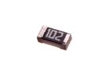

Contents
========

* [R6102 > SMD (0603) 1k Ohm Resistor](#r6102--smd-0603-1k-ohm-resistor)
	* [Datasheets](#datasheets)
	* [Labels](#labels)
	* [EDA](#eda)
	* [Images](#images)
	* [Tags](#tags)
  
![][im]
# R6102 > SMD (0603) 1k Ohm Resistor

- ID: RESE-0603-X-O102-01
- Hex ID: R6102
- Name: SMD (0603) 1k Ohm Resistor
- Description: SMD (0603) 1k Ohm Resistor
- Long Link: [http://oom.lt/RESE-0603-X-O102-01](http://oom.lt/RESE-0603-X-O102-01)
- Short Link: [http://oom.lt/R6102](http://oom.lt/R6102)

## Datasheets

- Datasheet: [datasheet.pdf](datasheet.pdf)

## Labels
  
  

|label-front|label-inventory|label-spec|
| :---: | :---: | :---: |
||||

## EDA
  

### Instances
  
Used 347 times.  
Prevalance: (347\10986) 3.1586%  

|OOMP Instances|
| :---: |
|[PROJ-ADAF-1312-STAN-01  Adafruit_Breadboard_NeoPixel_PCB  Used 1 times. R1](https://github.com/oomlout/oomlout_OOMP_projects/tree/main/PROJ-ADAF-1312-STAN-01/)|
|[PROJ-ADAF-1982-STAN-01  Adafruit MPR121 PCB  Used 1 times. R7](https://github.com/oomlout/oomlout_OOMP_projects/tree/main/PROJ-ADAF-1982-STAN-01/)|
|[PROJ-ADAF-2264-STAN-01  Adafruit FT232H Breakout PCB  Used 2 times. R3, R4](https://github.com/oomlout/oomlout_OOMP_projects/tree/main/PROJ-ADAF-2264-STAN-01/)|
|[PROJ-ADAF-2771-STAN-01  Adafruit Feather 32u4 Basic Proto PCB  Used 1 times. R2](https://github.com/oomlout/oomlout_OOMP_projects/tree/main/PROJ-ADAF-2771-STAN-01/)|
|[PROJ-ADAF-2772-STAN-01  Adafruit Feather M0 Basic Proto PCB  Used 1 times. R2](https://github.com/oomlout/oomlout_OOMP_projects/tree/main/PROJ-ADAF-2772-STAN-01/)|
|[PROJ-ADAF-2795-STAN-01  Adafruit Feather 32u4 Adalogger PCB  Used 2 times. R1, R2](https://github.com/oomlout/oomlout_OOMP_projects/tree/main/PROJ-ADAF-2795-STAN-01/)|
|[PROJ-ADAF-2796-STAN-01  Adafruit Feather M0 Adalogger PCB  Used 2 times. R2, R4](https://github.com/oomlout/oomlout_OOMP_projects/tree/main/PROJ-ADAF-2796-STAN-01/)|
|[PROJ-ADAF-2821-STAN-01  Adafruit Feather ESP8266 HUZZAH PCB  Used 3 times. R2, R10, R11](https://github.com/oomlout/oomlout_OOMP_projects/tree/main/PROJ-ADAF-2821-STAN-01/)|
|[PROJ-ADAF-2829-STAN-01  Adafruit Feather 32u4 Bluefruit LE PCB  Used 1 times. R2](https://github.com/oomlout/oomlout_OOMP_projects/tree/main/PROJ-ADAF-2829-STAN-01/)|
|[PROJ-ADAF-2922-STAN-01  Adafruit Adalogger FeatherWing PCB  Used 1 times. R4](https://github.com/oomlout/oomlout_OOMP_projects/tree/main/PROJ-ADAF-2922-STAN-01/)|
|[PROJ-ADAF-2995-STAN-01  Adafruit Feather M0 Bluefruit LE PCB  Used 1 times. R2](https://github.com/oomlout/oomlout_OOMP_projects/tree/main/PROJ-ADAF-2995-STAN-01/)|
|[PROJ-ADAF-3000-STAN-01  Adafruit Circuit Playground PCB  Used 3 times. R3, R5, R8](https://github.com/oomlout/oomlout_OOMP_projects/tree/main/PROJ-ADAF-3000-STAN-01/)|
|[PROJ-ADAF-3027-STAN-01  Adafruit Feather 32u4 FONA PCB  Used 3 times. R1, R2, R3](https://github.com/oomlout/oomlout_OOMP_projects/tree/main/PROJ-ADAF-3027-STAN-01/)|
|[PROJ-ADAF-3056-STAN-01  Adafruit WICED WiFi Feather PCB  Used 1 times. R2](https://github.com/oomlout/oomlout_OOMP_projects/tree/main/PROJ-ADAF-3056-STAN-01/)|
|[PROJ-ADAF-3178-STAN-01  Adafruit Feather M0 RFM LoRa PCB  Used 1 times. R2](https://github.com/oomlout/oomlout_OOMP_projects/tree/main/PROJ-ADAF-3178-STAN-01/)|
|[PROJ-ADAF-3200-STAN-01  Adafruit Teensy 3.x Feather Adapter PCB  Used 1 times. R2](https://github.com/oomlout/oomlout_OOMP_projects/tree/main/PROJ-ADAF-3200-STAN-01/)|
|[PROJ-ADAF-3321-STAN-01  Adafruit Mini TFT with Joystick Featherwing PCB  Used 1 times. R7](https://github.com/oomlout/oomlout_OOMP_projects/tree/main/PROJ-ADAF-3321-STAN-01/)|
|[PROJ-ADAF-3333-STAN-01  Adafruit Circuit Playground Express PCB  Used 2 times. R3, R5](https://github.com/oomlout/oomlout_OOMP_projects/tree/main/PROJ-ADAF-3333-STAN-01/)|
|[PROJ-ADAF-3382-STAN-01  Adafruit Metro M4 Express PCB  Used 1 times. R4](https://github.com/oomlout/oomlout_OOMP_projects/tree/main/PROJ-ADAF-3382-STAN-01/)|
|[PROJ-ADAF-3403-STAN-01  Adafruit Feather M0 Express PCB  Used 1 times. R2](https://github.com/oomlout/oomlout_OOMP_projects/tree/main/PROJ-ADAF-3403-STAN-01/)|
|[PROJ-ADAF-3405-STAN-01  Adafruit HUZZAH32 ESP32 Feather PCB  Used 2 times. R2, R10](https://github.com/oomlout/oomlout_OOMP_projects/tree/main/PROJ-ADAF-3405-STAN-01/)|
|[PROJ-ADAF-3422-STAN-01  Adafruit Arcade Bonnet PCB  Used 1 times. R5](https://github.com/oomlout/oomlout_OOMP_projects/tree/main/PROJ-ADAF-3422-STAN-01/)|
|[PROJ-ADAF-3458-STAN-01  Adafruit Feather 328P PCB  Used 5 times. R1, R2, R6, R7, R10](https://github.com/oomlout/oomlout_OOMP_projects/tree/main/PROJ-ADAF-3458-STAN-01/)|
|[PROJ-ADAF-3501-STAN-01  Adafruit Gemma M0 PCB  Used 1 times. R5](https://github.com/oomlout/oomlout_OOMP_projects/tree/main/PROJ-ADAF-3501-STAN-01/)|
|[PROJ-ADAF-3533-STAN-01  Adafruit 0.96 160x80 TFT Display Breakout PCB  Used 1 times. R7](https://github.com/oomlout/oomlout_OOMP_projects/tree/main/PROJ-ADAF-3533-STAN-01/)|
|[PROJ-ADAF-3632-STAN-01  Adafruit Joy Featherwing PCB  Used 2 times. R2, R5](https://github.com/oomlout/oomlout_OOMP_projects/tree/main/PROJ-ADAF-3632-STAN-01/)|
|[PROJ-ADAF-3657-STAN-01  Adafruit SAMD09 Breakout PCB  Used 3 times. R1, R2, R3](https://github.com/oomlout/oomlout_OOMP_projects/tree/main/PROJ-ADAF-3657-STAN-01/)|
|[PROJ-ADAF-3857-STAN-01  Adafruit Feather M4 Express PCB  Used 1 times. R2](https://github.com/oomlout/oomlout_OOMP_projects/tree/main/PROJ-ADAF-3857-STAN-01/)|
|[PROJ-ADAF-3900-STAN-01  Adafruit Hallowing M0 PCB  Used 3 times. R2, R5, R6](https://github.com/oomlout/oomlout_OOMP_projects/tree/main/PROJ-ADAF-3900-STAN-01/)|
|[PROJ-ADAF-4000-STAN-01  Adafruit Metro M4 Express AirLift PCB  Used 1 times. R4](https://github.com/oomlout/oomlout_OOMP_projects/tree/main/PROJ-ADAF-4000-STAN-01/)|
|[PROJ-ADAF-4026-STAN-01  Adafruit STEMMA Soil Sensor PCB  Used 2 times. R1, R2](https://github.com/oomlout/oomlout_OOMP_projects/tree/main/PROJ-ADAF-4026-STAN-01/)|
|[PROJ-ADAF-4064-STAN-01  Adafruit Grand Central PCB  Used 1 times. R4](https://github.com/oomlout/oomlout_OOMP_projects/tree/main/PROJ-ADAF-4064-STAN-01/)|
|[PROJ-ADAF-4172-STAN-01  Adafruit ESP32 HUZZAH Breakout PCB  Used 1 times. R2](https://github.com/oomlout/oomlout_OOMP_projects/tree/main/PROJ-ADAF-4172-STAN-01/)|
|[PROJ-ADAF-4300-STAN-01  Adafruit Hallowing M4 PCB  Used 3 times. R11, R17, R18](https://github.com/oomlout/oomlout_OOMP_projects/tree/main/PROJ-ADAF-4300-STAN-01/)|
|[PROJ-ADAF-4367-STAN-01  Adafruit TFT Gizmo PCB  Used 2 times. R2, R5](https://github.com/oomlout/oomlout_OOMP_projects/tree/main/PROJ-ADAF-4367-STAN-01/)|
|[PROJ-ADAF-4382-STAN-01  Adafruit Feather STM32F405 Express PCB  Used 1 times. R2](https://github.com/oomlout/oomlout_OOMP_projects/tree/main/PROJ-ADAF-4382-STAN-01/)|
|[PROJ-ADAF-4383-STAN-01  Adafruit 1.14 inch 240x135 TFT PCB  Used 1 times. R7](https://github.com/oomlout/oomlout_OOMP_projects/tree/main/PROJ-ADAF-4383-STAN-01/)|
|[PROJ-ADAF-4393-STAN-01  Adafruit Mini PiTFT 240x135 TFT PCB  Used 1 times. R7](https://github.com/oomlout/oomlout_OOMP_projects/tree/main/PROJ-ADAF-4393-STAN-01/)|
|[PROJ-ADAF-4409-STAN-01  Adafruit STEMMA Non Latching Mini Relay PCB  Used 2 times. R1, R3](https://github.com/oomlout/oomlout_OOMP_projects/tree/main/PROJ-ADAF-4409-STAN-01/)|
|[PROJ-ADAF-4428-STAN-01  Adafruit Circuit Playground Tri Color E Ink Gizmo PCB  Used 2 times. R2, R5](https://github.com/oomlout/oomlout_OOMP_projects/tree/main/PROJ-ADAF-4428-STAN-01/)|
|[PROJ-ADAF-4481-STAN-01  Adafruit ItsyBitsy nRF52840 Express PCB  Used 1 times. R2](https://github.com/oomlout/oomlout_OOMP_projects/tree/main/PROJ-ADAF-4481-STAN-01/)|
|[PROJ-ADAF-4500-STAN-01  Adafruit CLUE PCB  Used 1 times. R2](https://github.com/oomlout/oomlout_OOMP_projects/tree/main/PROJ-ADAF-4500-STAN-01/)|
|[PROJ-ADAF-4516-STAN-01  Adafruit Feather nRF52840 Sense PCB  Used 1 times. R3](https://github.com/oomlout/oomlout_OOMP_projects/tree/main/PROJ-ADAF-4516-STAN-01/)|
|[PROJ-ADAF-4534-STAN-01  Adafruit Bonsai Buckaroo PCB  Used 1 times. R2](https://github.com/oomlout/oomlout_OOMP_projects/tree/main/PROJ-ADAF-4534-STAN-01/)|
|[PROJ-ADAF-4681-STAN-01  Adafruit BH1750 PCB  Used 1 times. R4](https://github.com/oomlout/oomlout_OOMP_projects/tree/main/PROJ-ADAF-4681-STAN-01/)|
|[PROJ-ADAF-4686-STAN-01  Adafruit TMP235 PCB  Used 1 times. R3](https://github.com/oomlout/oomlout_OOMP_projects/tree/main/PROJ-ADAF-4686-STAN-01/)|
|[PROJ-ADAF-4745-STAN-01  Adafruit MatrixPortal M4 PCB  Used 2 times. R4, R9](https://github.com/oomlout/oomlout_OOMP_projects/tree/main/PROJ-ADAF-4745-STAN-01/)|
|[PROJ-ADAF-4757-STAN-01  Adafruit Voice Bonnet PCB  Used 1 times. R7](https://github.com/oomlout/oomlout_OOMP_projects/tree/main/PROJ-ADAF-4757-STAN-01/)|
|[PROJ-ADAF-4800-STAN-01  Adafruit_MagTag_PCBs  Used 2 times. R16, R18](https://github.com/oomlout/oomlout_OOMP_projects/tree/main/PROJ-ADAF-4800-STAN-01/)|
|[PROJ-ADAF-4863-STAN-01  Adafruit CYBERDECK PCB  Used 2 times. R7, R8](https://github.com/oomlout/oomlout_OOMP_projects/tree/main/PROJ-ADAF-4863-STAN-01/)|
|[PROJ-ADAF-4985-STAN-01  Adafruit FunHouse PCB  Used 3 times. R2, R16, R18](https://github.com/oomlout/oomlout_OOMP_projects/tree/main/PROJ-ADAF-4985-STAN-01/)|
|[PROJ-ADAF-5056-STAN-01  Adafruit Trinkey QT2040 PCB  Used 2 times. R6, R16](https://github.com/oomlout/oomlout_OOMP_projects/tree/main/PROJ-ADAF-5056-STAN-01/)|
|[PROJ-ADAF-5100-STAN-01  Adafruit MacroPad RP2040 PCB  Used 3 times. R6, R8, R11](https://github.com/oomlout/oomlout_OOMP_projects/tree/main/PROJ-ADAF-5100-STAN-01/)|
|[PROJ-SPAR-10311-STAN-01  PicoBoard  Used 2 times. R1, R2](https://github.com/oomlout/oomlout_OOMP_projects/tree/main/PROJ-SPAR-10311-STAN-01/)|
|[PROJ-SPAR-10653-STAN-01  Voice Recorder Breakout-ISD1932  Used 1 times. R1](https://github.com/oomlout/oomlout_OOMP_projects/tree/main/PROJ-SPAR-10653-STAN-01/)|
|[PROJ-SPAR-11117-STAN-01  32U4 Breakout Board  Used 1 times. R4](https://github.com/oomlout/oomlout_OOMP_projects/tree/main/PROJ-SPAR-11117-STAN-01/)|
|[PROJ-SPAR-11259-STAN-01  LilyPad Power Supply  Used 1 times. R1](https://github.com/oomlout/oomlout_OOMP_projects/tree/main/PROJ-SPAR-11259-STAN-01/)|
|[PROJ-SPAR-11260-STAN-01  LilyPad LiPower  Used 1 times. R1](https://github.com/oomlout/oomlout_OOMP_projects/tree/main/PROJ-SPAR-11260-STAN-01/)|
|[PROJ-SPAR-11345-STAN-01  Geiger Counter  Used 2 times. R1, R2](https://github.com/oomlout/oomlout_OOMP_projects/tree/main/PROJ-SPAR-11345-STAN-01/)|
|[PROJ-SPAR-11520-STAN-01  Fio v3  Used 2 times. R14, R15](https://github.com/oomlout/oomlout_OOMP_projects/tree/main/PROJ-SPAR-11520-STAN-01/)|
|[PROJ-SPAR-11622-STAN-01  RedBot with Optical Encoder  Used 7 times. R2, R3, R4, R5, R6, R7, R8](https://github.com/oomlout/oomlout_OOMP_projects/tree/main/PROJ-SPAR-11622-STAN-01/)|
|[PROJ-SPAR-11697-STAN-01  XBee Explorer Dongle  Used 3 times. R1, R3, R11](https://github.com/oomlout/oomlout_OOMP_projects/tree/main/PROJ-SPAR-11697-STAN-01/)|
|[PROJ-SPAR-11890-STAN-01  MiniMoto  Used 2 times. R1, R2](https://github.com/oomlout/oomlout_OOMP_projects/tree/main/PROJ-SPAR-11890-STAN-01/)|
|[PROJ-SPAR-11931-STAN-01  Digital Temperature Sensor Breakout - TMP102  Used 3 times. R1, R2, R3](https://github.com/oomlout/oomlout_OOMP_projects/tree/main/PROJ-SPAR-11931-STAN-01/)|
|[PROJ-SPAR-12080-STAN-01  VKey Voltage Keypad  Used 2 times. R2, R17](https://github.com/oomlout/oomlout_OOMP_projects/tree/main/PROJ-SPAR-12080-STAN-01/)|
|[PROJ-SPAR-12642-STAN-01  Sound Detector  Used 3 times. R2, R10, R13](https://github.com/oomlout/oomlout_OOMP_projects/tree/main/PROJ-SPAR-12642-STAN-01/)|
|[PROJ-SPAR-12650-STAN-01  AD8232 Heart Rate Monitor  Used 1 times. R16](https://github.com/oomlout/oomlout_OOMP_projects/tree/main/PROJ-SPAR-12650-STAN-01/)|
|[PROJ-SPAR-12651-STAN-01  Digital Sandbox  Used 4 times. R6, R7, R13, R15](https://github.com/oomlout/oomlout_OOMP_projects/tree/main/PROJ-SPAR-12651-STAN-01/)|
|[PROJ-SPAR-12660-STAN-01  MP3 Player Shield  Used 2 times. R13, R14](https://github.com/oomlout/oomlout_OOMP_projects/tree/main/PROJ-SPAR-12660-STAN-01/)|
|[PROJ-SPAR-12761-STAN-01  microSD Shield  Used 1 times. R1](https://github.com/oomlout/oomlout_OOMP_projects/tree/main/PROJ-SPAR-12761-STAN-01/)|
|[PROJ-SPAR-12773-STAN-01  CryptoCape  Used 1 times. R2](https://github.com/oomlout/oomlout_OOMP_projects/tree/main/PROJ-SPAR-12773-STAN-01/)|
|[PROJ-SPAR-12774-STAN-01  BeagleBone Black Proto Cape  Used 2 times. R7, R8](https://github.com/oomlout/oomlout_OOMP_projects/tree/main/PROJ-SPAR-12774-STAN-01/)|
|[PROJ-SPAR-12779-STAN-01  Easy Driver  Used 3 times. R9, R18, R19](https://github.com/oomlout/oomlout_OOMP_projects/tree/main/PROJ-SPAR-12779-STAN-01/)|
|[PROJ-SPAR-12847-STAN-01  XBee Shield  Used 9 times. R1, R2, R3, R4, R5, R6, R7, R8, R11](https://github.com/oomlout/oomlout_OOMP_projects/tree/main/PROJ-SPAR-12847-STAN-01/)|
|[PROJ-SPAR-12859-STAN-01  Big Easy Driver  Used 3 times. R9, R14, R15](https://github.com/oomlout/oomlout_OOMP_projects/tree/main/PROJ-SPAR-12859-STAN-01/)|
|[PROJ-SPAR-12924-STAN-01  MicroView USB Programmer  Used 3 times. R3, R4, R5](https://github.com/oomlout/oomlout_OOMP_projects/tree/main/PROJ-SPAR-12924-STAN-01/)|
|[PROJ-SPAR-12935-STAN-01  FTDI SmartBasic  Used 4 times. R1, R2, R3, R5](https://github.com/oomlout/oomlout_OOMP_projects/tree/main/PROJ-SPAR-12935-STAN-01/)|
|[PROJ-SPAR-12942-STAN-01  Bus Pirate  Used 4 times. R4, R6, R7, R9](https://github.com/oomlout/oomlout_OOMP_projects/tree/main/PROJ-SPAR-12942-STAN-01/)|
|[PROJ-SPAR-13019-STAN-01  BLE Mate2  Used 3 times. R1, R5, R8](https://github.com/oomlout/oomlout_OOMP_projects/tree/main/PROJ-SPAR-13019-STAN-01/)|
|[PROJ-SPAR-13037-STAN-01  Edison Battery Block  Used 1 times. R3](https://github.com/oomlout/oomlout_OOMP_projects/tree/main/PROJ-SPAR-13037-STAN-01/)|
|[PROJ-SPAR-13040-STAN-01  Edison UART Block  Used 2 times. R5, R15](https://github.com/oomlout/oomlout_OOMP_projects/tree/main/PROJ-SPAR-13040-STAN-01/)|
|[PROJ-SPAR-13042-STAN-01  Edison PWM Block  Used 14 times. R6, R7, R8, R9, R10, R11, R12, R13, R14, R15, R16, R17, R18, R19](https://github.com/oomlout/oomlout_OOMP_projects/tree/main/PROJ-SPAR-13042-STAN-01/)|
|[PROJ-SPAR-13044-STAN-01  Edison Pi Block  Used 2 times. R6, R11](https://github.com/oomlout/oomlout_OOMP_projects/tree/main/PROJ-SPAR-13044-STAN-01/)|
|[PROJ-SPAR-13058-STAN-01  MiP ProMini-Pack  Used 5 times. R7, R8, R9, R10, R11](https://github.com/oomlout/oomlout_OOMP_projects/tree/main/PROJ-SPAR-13058-STAN-01/)|
|[PROJ-SPAR-13120-STAN-01  MG2639 Cellular Shield  Used 5 times. R2, R5, R7, R8, R9](https://github.com/oomlout/oomlout_OOMP_projects/tree/main/PROJ-SPAR-13120-STAN-01/)|
|[PROJ-SPAR-13124-STAN-01  Proto Pedal  Used 1 times. R5](https://github.com/oomlout/oomlout_OOMP_projects/tree/main/PROJ-SPAR-13124-STAN-01/)|
|[PROJ-SPAR-13155-STAN-01  SparkFun Stepoko  Used 12 times. R31, R32, R39, R40, R41, R42, R43, R44, R45, R46, R47, R49](https://github.com/oomlout/oomlout_OOMP_projects/tree/main/PROJ-SPAR-13155-STAN-01/)|
|[PROJ-SPAR-13158-STAN-01  LiPower-Shield  Used 1 times. R1](https://github.com/oomlout/oomlout_OOMP_projects/tree/main/PROJ-SPAR-13158-STAN-01/)|
|[PROJ-SPAR-13162-STAN-01  ZX Gesture Sensor SMD  Used 4 times. R4, R9, R13, R14](https://github.com/oomlout/oomlout_OOMP_projects/tree/main/PROJ-SPAR-13162-STAN-01/)|
|[PROJ-SPAR-13183-STAN-01  CryptoShield  Used 1 times. R1](https://github.com/oomlout/oomlout_OOMP_projects/tree/main/PROJ-SPAR-13183-STAN-01/)|
|[PROJ-SPAR-13261-STAN-01  OpenScale  Used 5 times. R5, R11, R12, R13, R15](https://github.com/oomlout/oomlout_OOMP_projects/tree/main/PROJ-SPAR-13261-STAN-01/)|
|[PROJ-SPAR-13262-STAN-01  CAN-Bus Shield  Used 3 times. R1, R2, R3](https://github.com/oomlout/oomlout_OOMP_projects/tree/main/PROJ-SPAR-13262-STAN-01/)|
|[PROJ-SPAR-13287-STAN-01  ESP8266 WiFi Shield  Used 1 times. R14](https://github.com/oomlout/oomlout_OOMP_projects/tree/main/PROJ-SPAR-13287-STAN-01/)|
|[PROJ-SPAR-13310-STAN-01  Ludus ProtoShield  Used 4 times. R1, R2, R3, R4](https://github.com/oomlout/oomlout_OOMP_projects/tree/main/PROJ-SPAR-13310-STAN-01/)|
|[PROJ-SPAR-13321-STAN-01  Photon RedBoard  Used 1 times. R3](https://github.com/oomlout/oomlout_OOMP_projects/tree/main/PROJ-SPAR-13321-STAN-01/)|
|[PROJ-SPAR-13582-STAN-01  Line Follower Array  Used 8 times. R5, R6, R7, R8, R17, R18, R19, R20](https://github.com/oomlout/oomlout_OOMP_projects/tree/main/PROJ-SPAR-13582-STAN-01/)|
|[PROJ-SPAR-13626-STAN-01  Photon Battery Shield  Used 2 times. R1, R4](https://github.com/oomlout/oomlout_OOMP_projects/tree/main/PROJ-SPAR-13626-STAN-01/)|
|[PROJ-SPAR-13630-STAN-01  Photon Weather Shield  Used 6 times. R11, R12, R13, R14, R15, R16](https://github.com/oomlout/oomlout_OOMP_projects/tree/main/PROJ-SPAR-13630-STAN-01/)|
|[PROJ-SPAR-13632-STAN-01  SparkFun Simblee Breakout Board  Used 2 times. R2, R4](https://github.com/oomlout/oomlout_OOMP_projects/tree/main/PROJ-SPAR-13632-STAN-01/)|
|[PROJ-SPAR-13633-STAN-01  SparkFun LilyPad Simblee  Used 2 times. R4, R5](https://github.com/oomlout/oomlout_OOMP_projects/tree/main/PROJ-SPAR-13633-STAN-01/)|
|[PROJ-SPAR-13711-STAN-01  ESP8266 Thing Dev 4H  Used 4 times. R12, R13, R15, R16](https://github.com/oomlout/oomlout_OOMP_projects/tree/main/PROJ-SPAR-13711-STAN-01/)|
|[PROJ-SPAR-13712-STAN-01  OpenLog  Used 1 times. R1](https://github.com/oomlout/oomlout_OOMP_projects/tree/main/PROJ-SPAR-13712-STAN-01/)|
|[PROJ-SPAR-13720-STAN-01  MP3 Trigger  Used 2 times. R1, R12](https://github.com/oomlout/oomlout_OOMP_projects/tree/main/PROJ-SPAR-13720-STAN-01/)|
|[PROJ-SPAR-13741-STAN-01  RedStick  Used 2 times. R5, R6](https://github.com/oomlout/oomlout_OOMP_projects/tree/main/PROJ-SPAR-13741-STAN-01/)|
|[PROJ-SPAR-13746-STAN-01  Beefy 3  Used 2 times. R1, R2](https://github.com/oomlout/oomlout_OOMP_projects/tree/main/PROJ-SPAR-13746-STAN-01/)|
|[PROJ-SPAR-13750-STAN-01  GPS Shield  Used 1 times. R1](https://github.com/oomlout/oomlout_OOMP_projects/tree/main/PROJ-SPAR-13750-STAN-01/)|
|[PROJ-SPAR-13777-STAN-01  Battery Babysitter  Used 1 times. R10](https://github.com/oomlout/oomlout_OOMP_projects/tree/main/PROJ-SPAR-13777-STAN-01/)|
|[PROJ-SPAR-13794-STAN-01  Blynk Board ESP8266  Used 2 times. R2, R12](https://github.com/oomlout/oomlout_OOMP_projects/tree/main/PROJ-SPAR-13794-STAN-01/)|
|[PROJ-SPAR-13830-STAN-01  USB UART Serial Breakout-CY7C65213  Used 2 times. R3, R4](https://github.com/oomlout/oomlout_OOMP_projects/tree/main/PROJ-SPAR-13830-STAN-01/)|
|[PROJ-SPAR-13956-STAN-01  Weather Shield  Used 9 times. R1, R6, R7, R11, R12, R13, R14, R15, R16](https://github.com/oomlout/oomlout_OOMP_projects/tree/main/PROJ-SPAR-13956-STAN-01/)|
|[PROJ-SPAR-13968-STAN-01  OpenPIR  Used 1 times. R8](https://github.com/oomlout/oomlout_OOMP_projects/tree/main/PROJ-SPAR-13968-STAN-01/)|
|[PROJ-SPAR-13975-STAN-01  RedBoard  Used 5 times. R1, R6, R7, R8, R9](https://github.com/oomlout/oomlout_OOMP_projects/tree/main/PROJ-SPAR-13975-STAN-01/)|
|[PROJ-SPAR-13990-STAN-01  nRF52832 Breakout  Used 2 times. R1, R2](https://github.com/oomlout/oomlout_OOMP_projects/tree/main/PROJ-SPAR-13990-STAN-01/)|
|[PROJ-SPAR-14001-STAN-01  9DOF Razor IMU  Used 3 times. R3, R5, R9](https://github.com/oomlout/oomlout_OOMP_projects/tree/main/PROJ-SPAR-14001-STAN-01/)|
|[PROJ-SPAR-14050-STAN-01  Serial Basic Breakout-CH340G  Used 1 times. R2](https://github.com/oomlout/oomlout_OOMP_projects/tree/main/PROJ-SPAR-14050-STAN-01/)|
|[PROJ-SPAR-14051-STAN-01  Wireless Joystick  Used 1 times. R5](https://github.com/oomlout/oomlout_OOMP_projects/tree/main/PROJ-SPAR-14051-STAN-01/)|
|[PROJ-SPAR-14063-STAN-01  LilyPad LilyMini ProtoSnap  Used 1 times. R4](https://github.com/oomlout/oomlout_OOMP_projects/tree/main/PROJ-SPAR-14063-STAN-01/)|
|[PROJ-SPAR-14066-STAN-01  Simultaneous RFID Tag Reader  Used 2 times. R1, R3](https://github.com/oomlout/oomlout_OOMP_projects/tree/main/PROJ-SPAR-14066-STAN-01/)|
|[PROJ-SPAR-14129-STAN-01  Ardumoto-Motor Driver Shield  Used 8 times. R1, R2, R3, R4, R5, R6, R7, R8](https://github.com/oomlout/oomlout_OOMP_projects/tree/main/PROJ-SPAR-14129-STAN-01/)|
|[PROJ-SPAR-14130-STAN-01  Roshamglo  Used 2 times. R7, R9](https://github.com/oomlout/oomlout_OOMP_projects/tree/main/PROJ-SPAR-14130-STAN-01/)|
|[PROJ-SPAR-14153-STAN-01  ESP32 Environment Sensor Shield  Used 2 times. R3, R9](https://github.com/oomlout/oomlout_OOMP_projects/tree/main/PROJ-SPAR-14153-STAN-01/)|
|[PROJ-SPAR-14155-STAN-01  ESP32 Power Control Shield  Used 1 times. R13](https://github.com/oomlout/oomlout_OOMP_projects/tree/main/PROJ-SPAR-14155-STAN-01/)|
|[PROJ-SPAR-14285-STAN-01  Wireless Motor Driver Shield  Used 13 times. R1, R2, R3, R4, R6, R7, R8, R9, R10, R11, R12, R13, R14](https://github.com/oomlout/oomlout_OOMP_projects/tree/main/PROJ-SPAR-14285-STAN-01/)|
|[PROJ-SPAR-14346-STAN-01  LilyPad ProtoSnap Plus  Used 1 times. R17](https://github.com/oomlout/oomlout_OOMP_projects/tree/main/PROJ-SPAR-14346-STAN-01/)|
|[PROJ-SPAR-14411-STAN-01  LiPo Charger Booster 5V 1A  Used 1 times. R9](https://github.com/oomlout/oomlout_OOMP_projects/tree/main/PROJ-SPAR-14411-STAN-01/)|
|[PROJ-SPAR-14414-STAN-01  SparkFun GPS Breakout XA1110 Qwiic  Used 1 times. R5](https://github.com/oomlout/oomlout_OOMP_projects/tree/main/PROJ-SPAR-14414-STAN-01/)|
|[PROJ-SPAR-14449-STAN-01  Variable Load  Used 2 times. R9, R13](https://github.com/oomlout/oomlout_OOMP_projects/tree/main/PROJ-SPAR-14449-STAN-01/)|
|[PROJ-SPAR-14475-STAN-01  Noisy Cricket-1.5W Stereo Amplifier Breakout  Used 2 times. R3, R4](https://github.com/oomlout/oomlout_OOMP_projects/tree/main/PROJ-SPAR-14475-STAN-01/)|
|[PROJ-SPAR-14478-STAN-01  MaKeyMaKey  Used 3 times. R16, R19, R23](https://github.com/oomlout/oomlout_OOMP_projects/tree/main/PROJ-SPAR-14478-STAN-01/)|
|[PROJ-SPAR-14531-STAN-01  Pioneer IoT Kit Shield  Used 2 times. R1, R7](https://github.com/oomlout/oomlout_OOMP_projects/tree/main/PROJ-SPAR-14531-STAN-01/)|
|[PROJ-SPAR-14544-STAN-01  Current Sensor Breakout-ACS723-Low Current  Used 1 times. R2](https://github.com/oomlout/oomlout_OOMP_projects/tree/main/PROJ-SPAR-14544-STAN-01/)|
|[PROJ-SPAR-14666-STAN-01  Qwiic Flex Glove Controller  Used 1 times. R5](https://github.com/oomlout/oomlout_OOMP_projects/tree/main/PROJ-SPAR-14666-STAN-01/)|
|[PROJ-SPAR-14686-STAN-01  Qwiic IMU BNO080  Used 1 times. R2](https://github.com/oomlout/oomlout_OOMP_projects/tree/main/PROJ-SPAR-14686-STAN-01/)|
|[PROJ-SPAR-14691-STAN-01  Qwiic Transparent OLED HUD  Used 1 times. R5](https://github.com/oomlout/oomlout_OOMP_projects/tree/main/PROJ-SPAR-14691-STAN-01/)|
|[PROJ-SPAR-14713-STAN-01  SAMD51 Thing Plus  Used 1 times. R3](https://github.com/oomlout/oomlout_OOMP_projects/tree/main/PROJ-SPAR-14713-STAN-01/)|
|[PROJ-SPAR-14722-STAN-01  Qwiic Distance VL53L1X  Used 1 times. R3](https://github.com/oomlout/oomlout_OOMP_projects/tree/main/PROJ-SPAR-14722-STAN-01/)|
|[PROJ-SPAR-14765-STAN-01  Single Supply Logic Level Converter  Used 1 times. R4](https://github.com/oomlout/oomlout_OOMP_projects/tree/main/PROJ-SPAR-14765-STAN-01/)|
|[PROJ-SPAR-14779-STAN-01  LumiDrive  Used 2 times. R1, R2](https://github.com/oomlout/oomlout_OOMP_projects/tree/main/PROJ-SPAR-14779-STAN-01/)|
|[PROJ-SPAR-14843-STAN-01  Qwiic IR Array MLX90640  Used 1 times. R3](https://github.com/oomlout/oomlout_OOMP_projects/tree/main/PROJ-SPAR-14843-STAN-01/)|
|[PROJ-SPAR-14916-STAN-01  SAMD21 Pro RF  Used 5 times. R3, R7, R9, R10, R13](https://github.com/oomlout/oomlout_OOMP_projects/tree/main/PROJ-SPAR-14916-STAN-01/)|
|[PROJ-SPAR-14997-STAN-01  LTE Cat M1 Shield  Used 3 times. R2, R5, R7](https://github.com/oomlout/oomlout_OOMP_projects/tree/main/PROJ-SPAR-14997-STAN-01/)|
|[PROJ-SPAR-15005-STAN-01  Qwiic GPS-RTK  Used 5 times. R1, R5, R11, R12, R13](https://github.com/oomlout/oomlout_OOMP_projects/tree/main/PROJ-SPAR-15005-STAN-01/)|
|[PROJ-SPAR-15006-STAN-01  ESP32 LoRa 1Ch Gateway  Used 2 times. R2, R3](https://github.com/oomlout/oomlout_OOMP_projects/tree/main/PROJ-SPAR-15006-STAN-01/)|
|[PROJ-SPAR-15031-STAN-01  ESP8266 WiFi IR Blaster  Used 3 times. R3, R5, R7](https://github.com/oomlout/oomlout_OOMP_projects/tree/main/PROJ-SPAR-15031-STAN-01/)|

## Images
  
  

|image|image_RE|image_BOTTOM|label-front|label-inventory|label-spec|
| :---: | :---: | :---: | :---: | :---: | :---: |
|||||||

## Tags

- oompID: RESE-0603-X-O102-01
- name: SMD (0603) 1k Ohm Resistor
- hexID: R6102
- ooPackageMarking: 102
- oompDesc: O102
- oompSort: RESE0603O102
- oompType: RESE
- oompSize: 0603
- oompColor: X
- oompIndex: 01
- oompVersion: 999
- ooWidth: 0.8mm
- ooHeight: 0.45mm
- ooLength: 1.6mm
- oompBbls: template;XXXX-0603-X-XXXX-XX-bbls
- oompDiag: template;XXXX-0603-X-XXXX-XX-diag
- oompIden: template;XXXX-0603-X-XXXX-XX-iden
- oompSchem: template;RESE-XXXX-X-XXXX-XX-schem
- oompSimp: template;XXXX-0603-X-XXXX-XX-simp
- ooDesignator: R1
- oompInstances: {'PROJECT': 'PROJ-ADAF-1312-STAN-01', 'ID': 'R1'}
- oompInstances: {'PROJECT': 'PROJ-ADAF-1982-STAN-01', 'ID': 'R7'}
- oompInstances: {'PROJECT': 'PROJ-ADAF-2264-STAN-01', 'ID': 'R3'}
- oompInstances: {'PROJECT': 'PROJ-ADAF-2264-STAN-01', 'ID': 'R4'}
- oompInstances: {'PROJECT': 'PROJ-ADAF-2771-STAN-01', 'ID': 'R2'}
- oompInstances: {'PROJECT': 'PROJ-ADAF-2772-STAN-01', 'ID': 'R2'}
- oompInstances: {'PROJECT': 'PROJ-ADAF-2795-STAN-01', 'ID': 'R1'}
- oompInstances: {'PROJECT': 'PROJ-ADAF-2795-STAN-01', 'ID': 'R2'}
- oompInstances: {'PROJECT': 'PROJ-ADAF-2796-STAN-01', 'ID': 'R2'}
- oompInstances: {'PROJECT': 'PROJ-ADAF-2796-STAN-01', 'ID': 'R4'}
- oompInstances: {'PROJECT': 'PROJ-ADAF-2821-STAN-01', 'ID': 'R2'}
- oompInstances: {'PROJECT': 'PROJ-ADAF-2821-STAN-01', 'ID': 'R10'}
- oompInstances: {'PROJECT': 'PROJ-ADAF-2821-STAN-01', 'ID': 'R11'}
- oompInstances: {'PROJECT': 'PROJ-ADAF-2829-STAN-01', 'ID': 'R2'}
- oompInstances: {'PROJECT': 'PROJ-ADAF-2922-STAN-01', 'ID': 'R4'}
- oompInstances: {'PROJECT': 'PROJ-ADAF-2995-STAN-01', 'ID': 'R2'}
- oompInstances: {'PROJECT': 'PROJ-ADAF-3000-STAN-01', 'ID': 'R3'}
- oompInstances: {'PROJECT': 'PROJ-ADAF-3000-STAN-01', 'ID': 'R5'}
- oompInstances: {'PROJECT': 'PROJ-ADAF-3000-STAN-01', 'ID': 'R8'}
- oompInstances: {'PROJECT': 'PROJ-ADAF-3027-STAN-01', 'ID': 'R1'}
- oompInstances: {'PROJECT': 'PROJ-ADAF-3027-STAN-01', 'ID': 'R2'}
- oompInstances: {'PROJECT': 'PROJ-ADAF-3027-STAN-01', 'ID': 'R3'}
- oompInstances: {'PROJECT': 'PROJ-ADAF-3056-STAN-01', 'ID': 'R2'}
- oompInstances: {'PROJECT': 'PROJ-ADAF-3178-STAN-01', 'ID': 'R2'}
- oompInstances: {'PROJECT': 'PROJ-ADAF-3200-STAN-01', 'ID': 'R2'}
- oompInstances: {'PROJECT': 'PROJ-ADAF-3321-STAN-01', 'ID': 'R7'}
- oompInstances: {'PROJECT': 'PROJ-ADAF-3333-STAN-01', 'ID': 'R3'}
- oompInstances: {'PROJECT': 'PROJ-ADAF-3333-STAN-01', 'ID': 'R5'}
- oompInstances: {'PROJECT': 'PROJ-ADAF-3382-STAN-01', 'ID': 'R4'}
- oompInstances: {'PROJECT': 'PROJ-ADAF-3403-STAN-01', 'ID': 'R2'}
- oompInstances: {'PROJECT': 'PROJ-ADAF-3405-STAN-01', 'ID': 'R2'}
- oompInstances: {'PROJECT': 'PROJ-ADAF-3405-STAN-01', 'ID': 'R10'}
- oompInstances: {'PROJECT': 'PROJ-ADAF-3422-STAN-01', 'ID': 'R5'}
- oompInstances: {'PROJECT': 'PROJ-ADAF-3458-STAN-01', 'ID': 'R1'}
- oompInstances: {'PROJECT': 'PROJ-ADAF-3458-STAN-01', 'ID': 'R2'}
- oompInstances: {'PROJECT': 'PROJ-ADAF-3458-STAN-01', 'ID': 'R6'}
- oompInstances: {'PROJECT': 'PROJ-ADAF-3458-STAN-01', 'ID': 'R7'}
- oompInstances: {'PROJECT': 'PROJ-ADAF-3458-STAN-01', 'ID': 'R10'}
- oompInstances: {'PROJECT': 'PROJ-ADAF-3501-STAN-01', 'ID': 'R5'}
- oompInstances: {'PROJECT': 'PROJ-ADAF-3533-STAN-01', 'ID': 'R7'}
- oompInstances: {'PROJECT': 'PROJ-ADAF-3632-STAN-01', 'ID': 'R2'}
- oompInstances: {'PROJECT': 'PROJ-ADAF-3632-STAN-01', 'ID': 'R5'}
- oompInstances: {'PROJECT': 'PROJ-ADAF-3657-STAN-01', 'ID': 'R1'}
- oompInstances: {'PROJECT': 'PROJ-ADAF-3657-STAN-01', 'ID': 'R2'}
- oompInstances: {'PROJECT': 'PROJ-ADAF-3657-STAN-01', 'ID': 'R3'}
- oompInstances: {'PROJECT': 'PROJ-ADAF-3857-STAN-01', 'ID': 'R2'}
- oompInstances: {'PROJECT': 'PROJ-ADAF-3900-STAN-01', 'ID': 'R2'}
- oompInstances: {'PROJECT': 'PROJ-ADAF-3900-STAN-01', 'ID': 'R5'}
- oompInstances: {'PROJECT': 'PROJ-ADAF-3900-STAN-01', 'ID': 'R6'}
- oompInstances: {'PROJECT': 'PROJ-ADAF-4000-STAN-01', 'ID': 'R4'}
- oompInstances: {'PROJECT': 'PROJ-ADAF-4026-STAN-01', 'ID': 'R1'}
- oompInstances: {'PROJECT': 'PROJ-ADAF-4026-STAN-01', 'ID': 'R2'}
- oompInstances: {'PROJECT': 'PROJ-ADAF-4064-STAN-01', 'ID': 'R4'}
- oompInstances: {'PROJECT': 'PROJ-ADAF-4172-STAN-01', 'ID': 'R2'}
- oompInstances: {'PROJECT': 'PROJ-ADAF-4300-STAN-01', 'ID': 'R11'}
- oompInstances: {'PROJECT': 'PROJ-ADAF-4300-STAN-01', 'ID': 'R17'}
- oompInstances: {'PROJECT': 'PROJ-ADAF-4300-STAN-01', 'ID': 'R18'}
- oompInstances: {'PROJECT': 'PROJ-ADAF-4367-STAN-01', 'ID': 'R2'}
- oompInstances: {'PROJECT': 'PROJ-ADAF-4367-STAN-01', 'ID': 'R5'}
- oompInstances: {'PROJECT': 'PROJ-ADAF-4382-STAN-01', 'ID': 'R2'}
- oompInstances: {'PROJECT': 'PROJ-ADAF-4383-STAN-01', 'ID': 'R7'}
- oompInstances: {'PROJECT': 'PROJ-ADAF-4393-STAN-01', 'ID': 'R7'}
- oompInstances: {'PROJECT': 'PROJ-ADAF-4409-STAN-01', 'ID': 'R1'}
- oompInstances: {'PROJECT': 'PROJ-ADAF-4409-STAN-01', 'ID': 'R3'}
- oompInstances: {'PROJECT': 'PROJ-ADAF-4428-STAN-01', 'ID': 'R2'}
- oompInstances: {'PROJECT': 'PROJ-ADAF-4428-STAN-01', 'ID': 'R5'}
- oompInstances: {'PROJECT': 'PROJ-ADAF-4481-STAN-01', 'ID': 'R2'}
- oompInstances: {'PROJECT': 'PROJ-ADAF-4500-STAN-01', 'ID': 'R2'}
- oompInstances: {'PROJECT': 'PROJ-ADAF-4516-STAN-01', 'ID': 'R3'}
- oompInstances: {'PROJECT': 'PROJ-ADAF-4534-STAN-01', 'ID': 'R2'}
- oompInstances: {'PROJECT': 'PROJ-ADAF-4681-STAN-01', 'ID': 'R4'}
- oompInstances: {'PROJECT': 'PROJ-ADAF-4686-STAN-01', 'ID': 'R3'}
- oompInstances: {'PROJECT': 'PROJ-ADAF-4745-STAN-01', 'ID': 'R4'}
- oompInstances: {'PROJECT': 'PROJ-ADAF-4745-STAN-01', 'ID': 'R9'}
- oompInstances: {'PROJECT': 'PROJ-ADAF-4757-STAN-01', 'ID': 'R7'}
- oompInstances: {'PROJECT': 'PROJ-ADAF-4800-STAN-01', 'ID': 'R16'}
- oompInstances: {'PROJECT': 'PROJ-ADAF-4800-STAN-01', 'ID': 'R18'}
- oompInstances: {'PROJECT': 'PROJ-ADAF-4863-STAN-01', 'ID': 'R7'}
- oompInstances: {'PROJECT': 'PROJ-ADAF-4863-STAN-01', 'ID': 'R8'}
- oompInstances: {'PROJECT': 'PROJ-ADAF-4985-STAN-01', 'ID': 'R2'}
- oompInstances: {'PROJECT': 'PROJ-ADAF-4985-STAN-01', 'ID': 'R16'}
- oompInstances: {'PROJECT': 'PROJ-ADAF-4985-STAN-01', 'ID': 'R18'}
- oompInstances: {'PROJECT': 'PROJ-ADAF-5056-STAN-01', 'ID': 'R6'}
- oompInstances: {'PROJECT': 'PROJ-ADAF-5056-STAN-01', 'ID': 'R16'}
- oompInstances: {'PROJECT': 'PROJ-ADAF-5100-STAN-01', 'ID': 'R6'}
- oompInstances: {'PROJECT': 'PROJ-ADAF-5100-STAN-01', 'ID': 'R8'}
- oompInstances: {'PROJECT': 'PROJ-ADAF-5100-STAN-01', 'ID': 'R11'}
- oompInstances: {'PROJECT': 'PROJ-SPAR-10311-STAN-01', 'ID': 'R1'}
- oompInstances: {'PROJECT': 'PROJ-SPAR-10311-STAN-01', 'ID': 'R2'}
- oompInstances: {'PROJECT': 'PROJ-SPAR-10653-STAN-01', 'ID': 'R1'}
- oompInstances: {'PROJECT': 'PROJ-SPAR-11117-STAN-01', 'ID': 'R4'}
- oompInstances: {'PROJECT': 'PROJ-SPAR-11259-STAN-01', 'ID': 'R1'}
- oompInstances: {'PROJECT': 'PROJ-SPAR-11260-STAN-01', 'ID': 'R1'}
- oompInstances: {'PROJECT': 'PROJ-SPAR-11345-STAN-01', 'ID': 'R1'}
- oompInstances: {'PROJECT': 'PROJ-SPAR-11345-STAN-01', 'ID': 'R2'}
- oompInstances: {'PROJECT': 'PROJ-SPAR-11520-STAN-01', 'ID': 'R14'}
- oompInstances: {'PROJECT': 'PROJ-SPAR-11520-STAN-01', 'ID': 'R15'}
- oompInstances: {'PROJECT': 'PROJ-SPAR-11622-STAN-01', 'ID': 'R2'}
- oompInstances: {'PROJECT': 'PROJ-SPAR-11622-STAN-01', 'ID': 'R3'}
- oompInstances: {'PROJECT': 'PROJ-SPAR-11622-STAN-01', 'ID': 'R4'}
- oompInstances: {'PROJECT': 'PROJ-SPAR-11622-STAN-01', 'ID': 'R5'}
- oompInstances: {'PROJECT': 'PROJ-SPAR-11622-STAN-01', 'ID': 'R6'}
- oompInstances: {'PROJECT': 'PROJ-SPAR-11622-STAN-01', 'ID': 'R7'}
- oompInstances: {'PROJECT': 'PROJ-SPAR-11622-STAN-01', 'ID': 'R8'}
- oompInstances: {'PROJECT': 'PROJ-SPAR-11697-STAN-01', 'ID': 'R1'}
- oompInstances: {'PROJECT': 'PROJ-SPAR-11697-STAN-01', 'ID': 'R3'}
- oompInstances: {'PROJECT': 'PROJ-SPAR-11697-STAN-01', 'ID': 'R11'}
- oompInstances: {'PROJECT': 'PROJ-SPAR-11890-STAN-01', 'ID': 'R1'}
- oompInstances: {'PROJECT': 'PROJ-SPAR-11890-STAN-01', 'ID': 'R2'}
- oompInstances: {'PROJECT': 'PROJ-SPAR-11931-STAN-01', 'ID': 'R1'}
- oompInstances: {'PROJECT': 'PROJ-SPAR-11931-STAN-01', 'ID': 'R2'}
- oompInstances: {'PROJECT': 'PROJ-SPAR-11931-STAN-01', 'ID': 'R3'}
- oompInstances: {'PROJECT': 'PROJ-SPAR-12080-STAN-01', 'ID': 'R2'}
- oompInstances: {'PROJECT': 'PROJ-SPAR-12080-STAN-01', 'ID': 'R17'}
- oompInstances: {'PROJECT': 'PROJ-SPAR-12642-STAN-01', 'ID': 'R2'}
- oompInstances: {'PROJECT': 'PROJ-SPAR-12642-STAN-01', 'ID': 'R10'}
- oompInstances: {'PROJECT': 'PROJ-SPAR-12642-STAN-01', 'ID': 'R13'}
- oompInstances: {'PROJECT': 'PROJ-SPAR-12650-STAN-01', 'ID': 'R16'}
- oompInstances: {'PROJECT': 'PROJ-SPAR-12651-STAN-01', 'ID': 'R6'}
- oompInstances: {'PROJECT': 'PROJ-SPAR-12651-STAN-01', 'ID': 'R7'}
- oompInstances: {'PROJECT': 'PROJ-SPAR-12651-STAN-01', 'ID': 'R13'}
- oompInstances: {'PROJECT': 'PROJ-SPAR-12651-STAN-01', 'ID': 'R15'}
- oompInstances: {'PROJECT': 'PROJ-SPAR-12660-STAN-01', 'ID': 'R13'}
- oompInstances: {'PROJECT': 'PROJ-SPAR-12660-STAN-01', 'ID': 'R14'}
- oompInstances: {'PROJECT': 'PROJ-SPAR-12761-STAN-01', 'ID': 'R1'}
- oompInstances: {'PROJECT': 'PROJ-SPAR-12773-STAN-01', 'ID': 'R2'}
- oompInstances: {'PROJECT': 'PROJ-SPAR-12774-STAN-01', 'ID': 'R7'}
- oompInstances: {'PROJECT': 'PROJ-SPAR-12774-STAN-01', 'ID': 'R8'}
- oompInstances: {'PROJECT': 'PROJ-SPAR-12779-STAN-01', 'ID': 'R9'}
- oompInstances: {'PROJECT': 'PROJ-SPAR-12779-STAN-01', 'ID': 'R18'}
- oompInstances: {'PROJECT': 'PROJ-SPAR-12779-STAN-01', 'ID': 'R19'}
- oompInstances: {'PROJECT': 'PROJ-SPAR-12847-STAN-01', 'ID': 'R1'}
- oompInstances: {'PROJECT': 'PROJ-SPAR-12847-STAN-01', 'ID': 'R2'}
- oompInstances: {'PROJECT': 'PROJ-SPAR-12847-STAN-01', 'ID': 'R3'}
- oompInstances: {'PROJECT': 'PROJ-SPAR-12847-STAN-01', 'ID': 'R4'}
- oompInstances: {'PROJECT': 'PROJ-SPAR-12847-STAN-01', 'ID': 'R5'}
- oompInstances: {'PROJECT': 'PROJ-SPAR-12847-STAN-01', 'ID': 'R6'}
- oompInstances: {'PROJECT': 'PROJ-SPAR-12847-STAN-01', 'ID': 'R7'}
- oompInstances: {'PROJECT': 'PROJ-SPAR-12847-STAN-01', 'ID': 'R8'}
- oompInstances: {'PROJECT': 'PROJ-SPAR-12847-STAN-01', 'ID': 'R11'}
- oompInstances: {'PROJECT': 'PROJ-SPAR-12859-STAN-01', 'ID': 'R9'}
- oompInstances: {'PROJECT': 'PROJ-SPAR-12859-STAN-01', 'ID': 'R14'}
- oompInstances: {'PROJECT': 'PROJ-SPAR-12859-STAN-01', 'ID': 'R15'}
- oompInstances: {'PROJECT': 'PROJ-SPAR-12924-STAN-01', 'ID': 'R3'}
- oompInstances: {'PROJECT': 'PROJ-SPAR-12924-STAN-01', 'ID': 'R4'}
- oompInstances: {'PROJECT': 'PROJ-SPAR-12924-STAN-01', 'ID': 'R5'}
- oompInstances: {'PROJECT': 'PROJ-SPAR-12935-STAN-01', 'ID': 'R1'}
- oompInstances: {'PROJECT': 'PROJ-SPAR-12935-STAN-01', 'ID': 'R2'}
- oompInstances: {'PROJECT': 'PROJ-SPAR-12935-STAN-01', 'ID': 'R3'}
- oompInstances: {'PROJECT': 'PROJ-SPAR-12935-STAN-01', 'ID': 'R5'}
- oompInstances: {'PROJECT': 'PROJ-SPAR-12942-STAN-01', 'ID': 'R4'}
- oompInstances: {'PROJECT': 'PROJ-SPAR-12942-STAN-01', 'ID': 'R6'}
- oompInstances: {'PROJECT': 'PROJ-SPAR-12942-STAN-01', 'ID': 'R7'}
- oompInstances: {'PROJECT': 'PROJ-SPAR-12942-STAN-01', 'ID': 'R9'}
- oompInstances: {'PROJECT': 'PROJ-SPAR-13019-STAN-01', 'ID': 'R1'}
- oompInstances: {'PROJECT': 'PROJ-SPAR-13019-STAN-01', 'ID': 'R5'}
- oompInstances: {'PROJECT': 'PROJ-SPAR-13019-STAN-01', 'ID': 'R8'}
- oompInstances: {'PROJECT': 'PROJ-SPAR-13037-STAN-01', 'ID': 'R3'}
- oompInstances: {'PROJECT': 'PROJ-SPAR-13040-STAN-01', 'ID': 'R5'}
- oompInstances: {'PROJECT': 'PROJ-SPAR-13040-STAN-01', 'ID': 'R15'}
- oompInstances: {'PROJECT': 'PROJ-SPAR-13042-STAN-01', 'ID': 'R6'}
- oompInstances: {'PROJECT': 'PROJ-SPAR-13042-STAN-01', 'ID': 'R7'}
- oompInstances: {'PROJECT': 'PROJ-SPAR-13042-STAN-01', 'ID': 'R8'}
- oompInstances: {'PROJECT': 'PROJ-SPAR-13042-STAN-01', 'ID': 'R9'}
- oompInstances: {'PROJECT': 'PROJ-SPAR-13042-STAN-01', 'ID': 'R10'}
- oompInstances: {'PROJECT': 'PROJ-SPAR-13042-STAN-01', 'ID': 'R11'}
- oompInstances: {'PROJECT': 'PROJ-SPAR-13042-STAN-01', 'ID': 'R12'}
- oompInstances: {'PROJECT': 'PROJ-SPAR-13042-STAN-01', 'ID': 'R13'}
- oompInstances: {'PROJECT': 'PROJ-SPAR-13042-STAN-01', 'ID': 'R14'}
- oompInstances: {'PROJECT': 'PROJ-SPAR-13042-STAN-01', 'ID': 'R15'}
- oompInstances: {'PROJECT': 'PROJ-SPAR-13042-STAN-01', 'ID': 'R16'}
- oompInstances: {'PROJECT': 'PROJ-SPAR-13042-STAN-01', 'ID': 'R17'}
- oompInstances: {'PROJECT': 'PROJ-SPAR-13042-STAN-01', 'ID': 'R18'}
- oompInstances: {'PROJECT': 'PROJ-SPAR-13042-STAN-01', 'ID': 'R19'}
- oompInstances: {'PROJECT': 'PROJ-SPAR-13044-STAN-01', 'ID': 'R6'}
- oompInstances: {'PROJECT': 'PROJ-SPAR-13044-STAN-01', 'ID': 'R11'}
- oompInstances: {'PROJECT': 'PROJ-SPAR-13058-STAN-01', 'ID': 'R7'}
- oompInstances: {'PROJECT': 'PROJ-SPAR-13058-STAN-01', 'ID': 'R8'}
- oompInstances: {'PROJECT': 'PROJ-SPAR-13058-STAN-01', 'ID': 'R9'}
- oompInstances: {'PROJECT': 'PROJ-SPAR-13058-STAN-01', 'ID': 'R10'}
- oompInstances: {'PROJECT': 'PROJ-SPAR-13058-STAN-01', 'ID': 'R11'}
- oompInstances: {'PROJECT': 'PROJ-SPAR-13120-STAN-01', 'ID': 'R2'}
- oompInstances: {'PROJECT': 'PROJ-SPAR-13120-STAN-01', 'ID': 'R5'}
- oompInstances: {'PROJECT': 'PROJ-SPAR-13120-STAN-01', 'ID': 'R7'}
- oompInstances: {'PROJECT': 'PROJ-SPAR-13120-STAN-01', 'ID': 'R8'}
- oompInstances: {'PROJECT': 'PROJ-SPAR-13120-STAN-01', 'ID': 'R9'}
- oompInstances: {'PROJECT': 'PROJ-SPAR-13124-STAN-01', 'ID': 'R5'}
- oompInstances: {'PROJECT': 'PROJ-SPAR-13155-STAN-01', 'ID': 'R31'}
- oompInstances: {'PROJECT': 'PROJ-SPAR-13155-STAN-01', 'ID': 'R32'}
- oompInstances: {'PROJECT': 'PROJ-SPAR-13155-STAN-01', 'ID': 'R39'}
- oompInstances: {'PROJECT': 'PROJ-SPAR-13155-STAN-01', 'ID': 'R40'}
- oompInstances: {'PROJECT': 'PROJ-SPAR-13155-STAN-01', 'ID': 'R41'}
- oompInstances: {'PROJECT': 'PROJ-SPAR-13155-STAN-01', 'ID': 'R42'}
- oompInstances: {'PROJECT': 'PROJ-SPAR-13155-STAN-01', 'ID': 'R43'}
- oompInstances: {'PROJECT': 'PROJ-SPAR-13155-STAN-01', 'ID': 'R44'}
- oompInstances: {'PROJECT': 'PROJ-SPAR-13155-STAN-01', 'ID': 'R45'}
- oompInstances: {'PROJECT': 'PROJ-SPAR-13155-STAN-01', 'ID': 'R46'}
- oompInstances: {'PROJECT': 'PROJ-SPAR-13155-STAN-01', 'ID': 'R47'}
- oompInstances: {'PROJECT': 'PROJ-SPAR-13155-STAN-01', 'ID': 'R49'}
- oompInstances: {'PROJECT': 'PROJ-SPAR-13158-STAN-01', 'ID': 'R1'}
- oompInstances: {'PROJECT': 'PROJ-SPAR-13162-STAN-01', 'ID': 'R4'}
- oompInstances: {'PROJECT': 'PROJ-SPAR-13162-STAN-01', 'ID': 'R9'}
- oompInstances: {'PROJECT': 'PROJ-SPAR-13162-STAN-01', 'ID': 'R13'}
- oompInstances: {'PROJECT': 'PROJ-SPAR-13162-STAN-01', 'ID': 'R14'}
- oompInstances: {'PROJECT': 'PROJ-SPAR-13183-STAN-01', 'ID': 'R1'}
- oompInstances: {'PROJECT': 'PROJ-SPAR-13261-STAN-01', 'ID': 'R5'}
- oompInstances: {'PROJECT': 'PROJ-SPAR-13261-STAN-01', 'ID': 'R11'}
- oompInstances: {'PROJECT': 'PROJ-SPAR-13261-STAN-01', 'ID': 'R12'}
- oompInstances: {'PROJECT': 'PROJ-SPAR-13261-STAN-01', 'ID': 'R13'}
- oompInstances: {'PROJECT': 'PROJ-SPAR-13261-STAN-01', 'ID': 'R15'}
- oompInstances: {'PROJECT': 'PROJ-SPAR-13262-STAN-01', 'ID': 'R1'}
- oompInstances: {'PROJECT': 'PROJ-SPAR-13262-STAN-01', 'ID': 'R2'}
- oompInstances: {'PROJECT': 'PROJ-SPAR-13262-STAN-01', 'ID': 'R3'}
- oompInstances: {'PROJECT': 'PROJ-SPAR-13287-STAN-01', 'ID': 'R14'}
- oompInstances: {'PROJECT': 'PROJ-SPAR-13310-STAN-01', 'ID': 'R1'}
- oompInstances: {'PROJECT': 'PROJ-SPAR-13310-STAN-01', 'ID': 'R2'}
- oompInstances: {'PROJECT': 'PROJ-SPAR-13310-STAN-01', 'ID': 'R3'}
- oompInstances: {'PROJECT': 'PROJ-SPAR-13310-STAN-01', 'ID': 'R4'}
- oompInstances: {'PROJECT': 'PROJ-SPAR-13321-STAN-01', 'ID': 'R3'}
- oompInstances: {'PROJECT': 'PROJ-SPAR-13582-STAN-01', 'ID': 'R5'}
- oompInstances: {'PROJECT': 'PROJ-SPAR-13582-STAN-01', 'ID': 'R6'}
- oompInstances: {'PROJECT': 'PROJ-SPAR-13582-STAN-01', 'ID': 'R7'}
- oompInstances: {'PROJECT': 'PROJ-SPAR-13582-STAN-01', 'ID': 'R8'}
- oompInstances: {'PROJECT': 'PROJ-SPAR-13582-STAN-01', 'ID': 'R17'}
- oompInstances: {'PROJECT': 'PROJ-SPAR-13582-STAN-01', 'ID': 'R18'}
- oompInstances: {'PROJECT': 'PROJ-SPAR-13582-STAN-01', 'ID': 'R19'}
- oompInstances: {'PROJECT': 'PROJ-SPAR-13582-STAN-01', 'ID': 'R20'}
- oompInstances: {'PROJECT': 'PROJ-SPAR-13626-STAN-01', 'ID': 'R1'}
- oompInstances: {'PROJECT': 'PROJ-SPAR-13626-STAN-01', 'ID': 'R4'}
- oompInstances: {'PROJECT': 'PROJ-SPAR-13630-STAN-01', 'ID': 'R11'}
- oompInstances: {'PROJECT': 'PROJ-SPAR-13630-STAN-01', 'ID': 'R12'}
- oompInstances: {'PROJECT': 'PROJ-SPAR-13630-STAN-01', 'ID': 'R13'}
- oompInstances: {'PROJECT': 'PROJ-SPAR-13630-STAN-01', 'ID': 'R14'}
- oompInstances: {'PROJECT': 'PROJ-SPAR-13630-STAN-01', 'ID': 'R15'}
- oompInstances: {'PROJECT': 'PROJ-SPAR-13630-STAN-01', 'ID': 'R16'}
- oompInstances: {'PROJECT': 'PROJ-SPAR-13632-STAN-01', 'ID': 'R2'}
- oompInstances: {'PROJECT': 'PROJ-SPAR-13632-STAN-01', 'ID': 'R4'}
- oompInstances: {'PROJECT': 'PROJ-SPAR-13633-STAN-01', 'ID': 'R4'}
- oompInstances: {'PROJECT': 'PROJ-SPAR-13633-STAN-01', 'ID': 'R5'}
- oompInstances: {'PROJECT': 'PROJ-SPAR-13711-STAN-01', 'ID': 'R12'}
- oompInstances: {'PROJECT': 'PROJ-SPAR-13711-STAN-01', 'ID': 'R13'}
- oompInstances: {'PROJECT': 'PROJ-SPAR-13711-STAN-01', 'ID': 'R15'}
- oompInstances: {'PROJECT': 'PROJ-SPAR-13711-STAN-01', 'ID': 'R16'}
- oompInstances: {'PROJECT': 'PROJ-SPAR-13712-STAN-01', 'ID': 'R1'}
- oompInstances: {'PROJECT': 'PROJ-SPAR-13720-STAN-01', 'ID': 'R1'}
- oompInstances: {'PROJECT': 'PROJ-SPAR-13720-STAN-01', 'ID': 'R12'}
- oompInstances: {'PROJECT': 'PROJ-SPAR-13741-STAN-01', 'ID': 'R5'}
- oompInstances: {'PROJECT': 'PROJ-SPAR-13741-STAN-01', 'ID': 'R6'}
- oompInstances: {'PROJECT': 'PROJ-SPAR-13746-STAN-01', 'ID': 'R1'}
- oompInstances: {'PROJECT': 'PROJ-SPAR-13746-STAN-01', 'ID': 'R2'}
- oompInstances: {'PROJECT': 'PROJ-SPAR-13750-STAN-01', 'ID': 'R1'}
- oompInstances: {'PROJECT': 'PROJ-SPAR-13777-STAN-01', 'ID': 'R10'}
- oompInstances: {'PROJECT': 'PROJ-SPAR-13794-STAN-01', 'ID': 'R2'}
- oompInstances: {'PROJECT': 'PROJ-SPAR-13794-STAN-01', 'ID': 'R12'}
- oompInstances: {'PROJECT': 'PROJ-SPAR-13830-STAN-01', 'ID': 'R3'}
- oompInstances: {'PROJECT': 'PROJ-SPAR-13830-STAN-01', 'ID': 'R4'}
- oompInstances: {'PROJECT': 'PROJ-SPAR-13956-STAN-01', 'ID': 'R1'}
- oompInstances: {'PROJECT': 'PROJ-SPAR-13956-STAN-01', 'ID': 'R6'}
- oompInstances: {'PROJECT': 'PROJ-SPAR-13956-STAN-01', 'ID': 'R7'}
- oompInstances: {'PROJECT': 'PROJ-SPAR-13956-STAN-01', 'ID': 'R11'}
- oompInstances: {'PROJECT': 'PROJ-SPAR-13956-STAN-01', 'ID': 'R12'}
- oompInstances: {'PROJECT': 'PROJ-SPAR-13956-STAN-01', 'ID': 'R13'}
- oompInstances: {'PROJECT': 'PROJ-SPAR-13956-STAN-01', 'ID': 'R14'}
- oompInstances: {'PROJECT': 'PROJ-SPAR-13956-STAN-01', 'ID': 'R15'}
- oompInstances: {'PROJECT': 'PROJ-SPAR-13956-STAN-01', 'ID': 'R16'}
- oompInstances: {'PROJECT': 'PROJ-SPAR-13968-STAN-01', 'ID': 'R8'}
- oompInstances: {'PROJECT': 'PROJ-SPAR-13975-STAN-01', 'ID': 'R1'}
- oompInstances: {'PROJECT': 'PROJ-SPAR-13975-STAN-01', 'ID': 'R6'}
- oompInstances: {'PROJECT': 'PROJ-SPAR-13975-STAN-01', 'ID': 'R7'}
- oompInstances: {'PROJECT': 'PROJ-SPAR-13975-STAN-01', 'ID': 'R8'}
- oompInstances: {'PROJECT': 'PROJ-SPAR-13975-STAN-01', 'ID': 'R9'}
- oompInstances: {'PROJECT': 'PROJ-SPAR-13990-STAN-01', 'ID': 'R1'}
- oompInstances: {'PROJECT': 'PROJ-SPAR-13990-STAN-01', 'ID': 'R2'}
- oompInstances: {'PROJECT': 'PROJ-SPAR-14001-STAN-01', 'ID': 'R3'}
- oompInstances: {'PROJECT': 'PROJ-SPAR-14001-STAN-01', 'ID': 'R5'}
- oompInstances: {'PROJECT': 'PROJ-SPAR-14001-STAN-01', 'ID': 'R9'}
- oompInstances: {'PROJECT': 'PROJ-SPAR-14050-STAN-01', 'ID': 'R2'}
- oompInstances: {'PROJECT': 'PROJ-SPAR-14051-STAN-01', 'ID': 'R5'}
- oompInstances: {'PROJECT': 'PROJ-SPAR-14063-STAN-01', 'ID': 'R4'}
- oompInstances: {'PROJECT': 'PROJ-SPAR-14066-STAN-01', 'ID': 'R1'}
- oompInstances: {'PROJECT': 'PROJ-SPAR-14066-STAN-01', 'ID': 'R3'}
- oompInstances: {'PROJECT': 'PROJ-SPAR-14129-STAN-01', 'ID': 'R1'}
- oompInstances: {'PROJECT': 'PROJ-SPAR-14129-STAN-01', 'ID': 'R2'}
- oompInstances: {'PROJECT': 'PROJ-SPAR-14129-STAN-01', 'ID': 'R3'}
- oompInstances: {'PROJECT': 'PROJ-SPAR-14129-STAN-01', 'ID': 'R4'}
- oompInstances: {'PROJECT': 'PROJ-SPAR-14129-STAN-01', 'ID': 'R5'}
- oompInstances: {'PROJECT': 'PROJ-SPAR-14129-STAN-01', 'ID': 'R6'}
- oompInstances: {'PROJECT': 'PROJ-SPAR-14129-STAN-01', 'ID': 'R7'}
- oompInstances: {'PROJECT': 'PROJ-SPAR-14129-STAN-01', 'ID': 'R8'}
- oompInstances: {'PROJECT': 'PROJ-SPAR-14130-STAN-01', 'ID': 'R7'}
- oompInstances: {'PROJECT': 'PROJ-SPAR-14130-STAN-01', 'ID': 'R9'}
- oompInstances: {'PROJECT': 'PROJ-SPAR-14153-STAN-01', 'ID': 'R3'}
- oompInstances: {'PROJECT': 'PROJ-SPAR-14153-STAN-01', 'ID': 'R9'}
- oompInstances: {'PROJECT': 'PROJ-SPAR-14155-STAN-01', 'ID': 'R13'}
- oompInstances: {'PROJECT': 'PROJ-SPAR-14285-STAN-01', 'ID': 'R1'}
- oompInstances: {'PROJECT': 'PROJ-SPAR-14285-STAN-01', 'ID': 'R2'}
- oompInstances: {'PROJECT': 'PROJ-SPAR-14285-STAN-01', 'ID': 'R3'}
- oompInstances: {'PROJECT': 'PROJ-SPAR-14285-STAN-01', 'ID': 'R4'}
- oompInstances: {'PROJECT': 'PROJ-SPAR-14285-STAN-01', 'ID': 'R6'}
- oompInstances: {'PROJECT': 'PROJ-SPAR-14285-STAN-01', 'ID': 'R7'}
- oompInstances: {'PROJECT': 'PROJ-SPAR-14285-STAN-01', 'ID': 'R8'}
- oompInstances: {'PROJECT': 'PROJ-SPAR-14285-STAN-01', 'ID': 'R9'}
- oompInstances: {'PROJECT': 'PROJ-SPAR-14285-STAN-01', 'ID': 'R10'}
- oompInstances: {'PROJECT': 'PROJ-SPAR-14285-STAN-01', 'ID': 'R11'}
- oompInstances: {'PROJECT': 'PROJ-SPAR-14285-STAN-01', 'ID': 'R12'}
- oompInstances: {'PROJECT': 'PROJ-SPAR-14285-STAN-01', 'ID': 'R13'}
- oompInstances: {'PROJECT': 'PROJ-SPAR-14285-STAN-01', 'ID': 'R14'}
- oompInstances: {'PROJECT': 'PROJ-SPAR-14346-STAN-01', 'ID': 'R17'}
- oompInstances: {'PROJECT': 'PROJ-SPAR-14411-STAN-01', 'ID': 'R9'}
- oompInstances: {'PROJECT': 'PROJ-SPAR-14414-STAN-01', 'ID': 'R5'}
- oompInstances: {'PROJECT': 'PROJ-SPAR-14449-STAN-01', 'ID': 'R9'}
- oompInstances: {'PROJECT': 'PROJ-SPAR-14449-STAN-01', 'ID': 'R13'}
- oompInstances: {'PROJECT': 'PROJ-SPAR-14475-STAN-01', 'ID': 'R3'}
- oompInstances: {'PROJECT': 'PROJ-SPAR-14475-STAN-01', 'ID': 'R4'}
- oompInstances: {'PROJECT': 'PROJ-SPAR-14478-STAN-01', 'ID': 'R16'}
- oompInstances: {'PROJECT': 'PROJ-SPAR-14478-STAN-01', 'ID': 'R19'}
- oompInstances: {'PROJECT': 'PROJ-SPAR-14478-STAN-01', 'ID': 'R23'}
- oompInstances: {'PROJECT': 'PROJ-SPAR-14531-STAN-01', 'ID': 'R1'}
- oompInstances: {'PROJECT': 'PROJ-SPAR-14531-STAN-01', 'ID': 'R7'}
- oompInstances: {'PROJECT': 'PROJ-SPAR-14544-STAN-01', 'ID': 'R2'}
- oompInstances: {'PROJECT': 'PROJ-SPAR-14666-STAN-01', 'ID': 'R5'}
- oompInstances: {'PROJECT': 'PROJ-SPAR-14686-STAN-01', 'ID': 'R2'}
- oompInstances: {'PROJECT': 'PROJ-SPAR-14691-STAN-01', 'ID': 'R5'}
- oompInstances: {'PROJECT': 'PROJ-SPAR-14713-STAN-01', 'ID': 'R3'}
- oompInstances: {'PROJECT': 'PROJ-SPAR-14722-STAN-01', 'ID': 'R3'}
- oompInstances: {'PROJECT': 'PROJ-SPAR-14765-STAN-01', 'ID': 'R4'}
- oompInstances: {'PROJECT': 'PROJ-SPAR-14779-STAN-01', 'ID': 'R1'}
- oompInstances: {'PROJECT': 'PROJ-SPAR-14779-STAN-01', 'ID': 'R2'}
- oompInstances: {'PROJECT': 'PROJ-SPAR-14843-STAN-01', 'ID': 'R3'}
- oompInstances: {'PROJECT': 'PROJ-SPAR-14916-STAN-01', 'ID': 'R3'}
- oompInstances: {'PROJECT': 'PROJ-SPAR-14916-STAN-01', 'ID': 'R7'}
- oompInstances: {'PROJECT': 'PROJ-SPAR-14916-STAN-01', 'ID': 'R9'}
- oompInstances: {'PROJECT': 'PROJ-SPAR-14916-STAN-01', 'ID': 'R10'}
- oompInstances: {'PROJECT': 'PROJ-SPAR-14916-STAN-01', 'ID': 'R13'}
- oompInstances: {'PROJECT': 'PROJ-SPAR-14997-STAN-01', 'ID': 'R2'}
- oompInstances: {'PROJECT': 'PROJ-SPAR-14997-STAN-01', 'ID': 'R5'}
- oompInstances: {'PROJECT': 'PROJ-SPAR-14997-STAN-01', 'ID': 'R7'}
- oompInstances: {'PROJECT': 'PROJ-SPAR-15005-STAN-01', 'ID': 'R1'}
- oompInstances: {'PROJECT': 'PROJ-SPAR-15005-STAN-01', 'ID': 'R5'}
- oompInstances: {'PROJECT': 'PROJ-SPAR-15005-STAN-01', 'ID': 'R11'}
- oompInstances: {'PROJECT': 'PROJ-SPAR-15005-STAN-01', 'ID': 'R12'}
- oompInstances: {'PROJECT': 'PROJ-SPAR-15005-STAN-01', 'ID': 'R13'}
- oompInstances: {'PROJECT': 'PROJ-SPAR-15006-STAN-01', 'ID': 'R2'}
- oompInstances: {'PROJECT': 'PROJ-SPAR-15006-STAN-01', 'ID': 'R3'}
- oompInstances: {'PROJECT': 'PROJ-SPAR-15031-STAN-01', 'ID': 'R3'}
- oompInstances: {'PROJECT': 'PROJ-SPAR-15031-STAN-01', 'ID': 'R5'}
- oompInstances: {'PROJECT': 'PROJ-SPAR-15031-STAN-01', 'ID': 'R7'}

[im]: image_450.jpg
