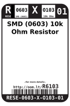
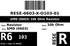
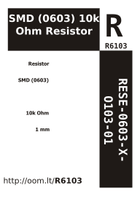

Contents
========

* [R6103 > SMD (0603) 10k Ohm Resistor](#r6103--smd-0603-10k-ohm-resistor)
	* [Datasheets](#datasheets)
	* [Labels](#labels)
	* [EDA](#eda)
	* [Images](#images)
	* [Tags](#tags)
  
![][im]
# R6103 > SMD (0603) 10k Ohm Resistor

- ID: RESE-0603-X-O103-01
- Hex ID: R6103
- Name: SMD (0603) 10k Ohm Resistor
- Description: SMD (0603) 10k Ohm Resistor
- Long Link: [http://oom.lt/RESE-0603-X-O103-01](http://oom.lt/RESE-0603-X-O103-01)
- Short Link: [http://oom.lt/R6103](http://oom.lt/R6103)

## Datasheets

- Datasheet: [datasheet.pdf](datasheet.pdf)

## Labels
  
  

|label-front|label-inventory|label-spec|
| :---: | :---: | :---: |
||||

## EDA
  

### Instances
  
Used 710 times.  
Prevalance: (710\10986) 6.4628%  

|Project|Occur- rences|Identifiers|
| :---: | :---: | :---: |
|[PROJ-ADAF-1982-STAN-01 Adafruit MPR121 PCB](https://github.com/oomlout/oomlout_OOMP_projects/tree/main/PROJ-ADAF-1982-STAN-01/)|[3](https://github.com/oomlout/oomlout_OOMP_projects/tree/main/PROJ-ADAF-1982-STAN-01/)|[R1, R6, R9](https://github.com/oomlout/oomlout_OOMP_projects/tree/main/PROJ-ADAF-1982-STAN-01/)|
|[PROJ-ADAF-2748-STAN-01 Adafruit ALS PT19 Sensor Breakout PCB](https://github.com/oomlout/oomlout_OOMP_projects/tree/main/PROJ-ADAF-2748-STAN-01/)|[1](https://github.com/oomlout/oomlout_OOMP_projects/tree/main/PROJ-ADAF-2748-STAN-01/)|[R1](https://github.com/oomlout/oomlout_OOMP_projects/tree/main/PROJ-ADAF-2748-STAN-01/)|
|[PROJ-ADAF-2821-STAN-01 Adafruit Feather ESP8266 HUZZAH PCB](https://github.com/oomlout/oomlout_OOMP_projects/tree/main/PROJ-ADAF-2821-STAN-01/)|[6](https://github.com/oomlout/oomlout_OOMP_projects/tree/main/PROJ-ADAF-2821-STAN-01/)|[R1, R3, R4, R5, R7, R9](https://github.com/oomlout/oomlout_OOMP_projects/tree/main/PROJ-ADAF-2821-STAN-01/)|
|[PROJ-ADAF-2857-STAN-01 Adafruit SHT31 Sensor Breakout PCB](https://github.com/oomlout/oomlout_OOMP_projects/tree/main/PROJ-ADAF-2857-STAN-01/)|[1](https://github.com/oomlout/oomlout_OOMP_projects/tree/main/PROJ-ADAF-2857-STAN-01/)|[R1](https://github.com/oomlout/oomlout_OOMP_projects/tree/main/PROJ-ADAF-2857-STAN-01/)|
|[PROJ-ADAF-2922-STAN-01 Adafruit Adalogger FeatherWing PCB](https://github.com/oomlout/oomlout_OOMP_projects/tree/main/PROJ-ADAF-2922-STAN-01/)|[2](https://github.com/oomlout/oomlout_OOMP_projects/tree/main/PROJ-ADAF-2922-STAN-01/)|[R1, R2](https://github.com/oomlout/oomlout_OOMP_projects/tree/main/PROJ-ADAF-2922-STAN-01/)|
|[PROJ-ADAF-3000-STAN-01 Adafruit Circuit Playground PCB](https://github.com/oomlout/oomlout_OOMP_projects/tree/main/PROJ-ADAF-3000-STAN-01/)|[6](https://github.com/oomlout/oomlout_OOMP_projects/tree/main/PROJ-ADAF-3000-STAN-01/)|[R4, R6, R7, R10, R13, R14](https://github.com/oomlout/oomlout_OOMP_projects/tree/main/PROJ-ADAF-3000-STAN-01/)|
|[PROJ-ADAF-3201-STAN-01 Adafruit Ethernet FeatherWing PCB](https://github.com/oomlout/oomlout_OOMP_projects/tree/main/PROJ-ADAF-3201-STAN-01/)|[6](https://github.com/oomlout/oomlout_OOMP_projects/tree/main/PROJ-ADAF-3201-STAN-01/)|[R3, R5, R6, R7, R8, R15](https://github.com/oomlout/oomlout_OOMP_projects/tree/main/PROJ-ADAF-3201-STAN-01/)|
|[PROJ-ADAF-3251-STAN-01 Adafruit Si7021 PCB](https://github.com/oomlout/oomlout_OOMP_projects/tree/main/PROJ-ADAF-3251-STAN-01/)|[1](https://github.com/oomlout/oomlout_OOMP_projects/tree/main/PROJ-ADAF-3251-STAN-01/)|[R6](https://github.com/oomlout/oomlout_OOMP_projects/tree/main/PROJ-ADAF-3251-STAN-01/)|
|[PROJ-ADAF-3321-STAN-01 Adafruit Mini TFT with Joystick Featherwing PCB](https://github.com/oomlout/oomlout_OOMP_projects/tree/main/PROJ-ADAF-3321-STAN-01/)|[2](https://github.com/oomlout/oomlout_OOMP_projects/tree/main/PROJ-ADAF-3321-STAN-01/)|[R5, R6](https://github.com/oomlout/oomlout_OOMP_projects/tree/main/PROJ-ADAF-3321-STAN-01/)|
|[PROJ-ADAF-3333-STAN-01 Adafruit Circuit Playground Express PCB](https://github.com/oomlout/oomlout_OOMP_projects/tree/main/PROJ-ADAF-3333-STAN-01/)|[5](https://github.com/oomlout/oomlout_OOMP_projects/tree/main/PROJ-ADAF-3333-STAN-01/)|[R2, R4, R6, R7, R10](https://github.com/oomlout/oomlout_OOMP_projects/tree/main/PROJ-ADAF-3333-STAN-01/)|
|[PROJ-ADAF-3382-STAN-01 Adafruit Metro M4 Express PCB](https://github.com/oomlout/oomlout_OOMP_projects/tree/main/PROJ-ADAF-3382-STAN-01/)|[3](https://github.com/oomlout/oomlout_OOMP_projects/tree/main/PROJ-ADAF-3382-STAN-01/)|[R3, R5, R7](https://github.com/oomlout/oomlout_OOMP_projects/tree/main/PROJ-ADAF-3382-STAN-01/)|
|[PROJ-ADAF-3387-STAN-01 Adafruit LSM9DS1 Breakout PCB](https://github.com/oomlout/oomlout_OOMP_projects/tree/main/PROJ-ADAF-3387-STAN-01/)|[2](https://github.com/oomlout/oomlout_OOMP_projects/tree/main/PROJ-ADAF-3387-STAN-01/)|[R1, R5](https://github.com/oomlout/oomlout_OOMP_projects/tree/main/PROJ-ADAF-3387-STAN-01/)|
|[PROJ-ADAF-3403-STAN-01 Adafruit Feather M0 Express PCB](https://github.com/oomlout/oomlout_OOMP_projects/tree/main/PROJ-ADAF-3403-STAN-01/)|[1](https://github.com/oomlout/oomlout_OOMP_projects/tree/main/PROJ-ADAF-3403-STAN-01/)|[R5](https://github.com/oomlout/oomlout_OOMP_projects/tree/main/PROJ-ADAF-3403-STAN-01/)|
|[PROJ-ADAF-3421-STAN-01 Adafruit I2S Microphone Breakout PCB](https://github.com/oomlout/oomlout_OOMP_projects/tree/main/PROJ-ADAF-3421-STAN-01/)|[1](https://github.com/oomlout/oomlout_OOMP_projects/tree/main/PROJ-ADAF-3421-STAN-01/)|[R2](https://github.com/oomlout/oomlout_OOMP_projects/tree/main/PROJ-ADAF-3421-STAN-01/)|
|[PROJ-ADAF-3458-STAN-01 Adafruit Feather 328P PCB](https://github.com/oomlout/oomlout_OOMP_projects/tree/main/PROJ-ADAF-3458-STAN-01/)|[2](https://github.com/oomlout/oomlout_OOMP_projects/tree/main/PROJ-ADAF-3458-STAN-01/)|[R4, R8](https://github.com/oomlout/oomlout_OOMP_projects/tree/main/PROJ-ADAF-3458-STAN-01/)|
|[PROJ-ADAF-3467-STAN-01 Adafruit CharliePlex Bonnet PCBs](https://github.com/oomlout/oomlout_OOMP_projects/tree/main/PROJ-ADAF-3467-STAN-01/)|[2](https://github.com/oomlout/oomlout_OOMP_projects/tree/main/PROJ-ADAF-3467-STAN-01/)|[R1, R2](https://github.com/oomlout/oomlout_OOMP_projects/tree/main/PROJ-ADAF-3467-STAN-01/)|
|[PROJ-ADAF-3500-STAN-01 Adafruit Trinket M0 PCB](https://github.com/oomlout/oomlout_OOMP_projects/tree/main/PROJ-ADAF-3500-STAN-01/)|[1](https://github.com/oomlout/oomlout_OOMP_projects/tree/main/PROJ-ADAF-3500-STAN-01/)|[R4](https://github.com/oomlout/oomlout_OOMP_projects/tree/main/PROJ-ADAF-3500-STAN-01/)|
|[PROJ-ADAF-3533-STAN-01 Adafruit 0.96 160x80 TFT Display Breakout PCB](https://github.com/oomlout/oomlout_OOMP_projects/tree/main/PROJ-ADAF-3533-STAN-01/)|[2](https://github.com/oomlout/oomlout_OOMP_projects/tree/main/PROJ-ADAF-3533-STAN-01/)|[R2, R8](https://github.com/oomlout/oomlout_OOMP_projects/tree/main/PROJ-ADAF-3533-STAN-01/)|
|[PROJ-ADAF-3589-STAN-01 Adafruit PiUART PCB](https://github.com/oomlout/oomlout_OOMP_projects/tree/main/PROJ-ADAF-3589-STAN-01/)|[2](https://github.com/oomlout/oomlout_OOMP_projects/tree/main/PROJ-ADAF-3589-STAN-01/)|[R3, R7](https://github.com/oomlout/oomlout_OOMP_projects/tree/main/PROJ-ADAF-3589-STAN-01/)|
|[PROJ-ADAF-3632-STAN-01 Adafruit Joy Featherwing PCB](https://github.com/oomlout/oomlout_OOMP_projects/tree/main/PROJ-ADAF-3632-STAN-01/)|[2](https://github.com/oomlout/oomlout_OOMP_projects/tree/main/PROJ-ADAF-3632-STAN-01/)|[R3, R4](https://github.com/oomlout/oomlout_OOMP_projects/tree/main/PROJ-ADAF-3632-STAN-01/)|
|[PROJ-ADAF-3657-STAN-01 Adafruit SAMD09 Breakout PCB](https://github.com/oomlout/oomlout_OOMP_projects/tree/main/PROJ-ADAF-3657-STAN-01/)|[2](https://github.com/oomlout/oomlout_OOMP_projects/tree/main/PROJ-ADAF-3657-STAN-01/)|[R4, R5](https://github.com/oomlout/oomlout_OOMP_projects/tree/main/PROJ-ADAF-3657-STAN-01/)|
|[PROJ-ADAF-3660-STAN-01 Adafruit BME680 PCB](https://github.com/oomlout/oomlout_OOMP_projects/tree/main/PROJ-ADAF-3660-STAN-01/)|[3](https://github.com/oomlout/oomlout_OOMP_projects/tree/main/PROJ-ADAF-3660-STAN-01/)|[R1, R4, R5](https://github.com/oomlout/oomlout_OOMP_projects/tree/main/PROJ-ADAF-3660-STAN-01/)|
|[PROJ-ADAF-3678-STAN-01 Adafruit UDA1334A I2S Stereo DAC PCB](https://github.com/oomlout/oomlout_OOMP_projects/tree/main/PROJ-ADAF-3678-STAN-01/)|[6](https://github.com/oomlout/oomlout_OOMP_projects/tree/main/PROJ-ADAF-3678-STAN-01/)|[R1, R2, R7, R8, R9, R10](https://github.com/oomlout/oomlout_OOMP_projects/tree/main/PROJ-ADAF-3678-STAN-01/)|
|[PROJ-ADAF-3709-STAN-01 Adafruit SGP30 PCB](https://github.com/oomlout/oomlout_OOMP_projects/tree/main/PROJ-ADAF-3709-STAN-01/)|[1](https://github.com/oomlout/oomlout_OOMP_projects/tree/main/PROJ-ADAF-3709-STAN-01/)|[R2](https://github.com/oomlout/oomlout_OOMP_projects/tree/main/PROJ-ADAF-3709-STAN-01/)|
|[PROJ-ADAF-3779-STAN-01 Adafruit AS7262 Breakout PCB](https://github.com/oomlout/oomlout_OOMP_projects/tree/main/PROJ-ADAF-3779-STAN-01/)|[1](https://github.com/oomlout/oomlout_OOMP_projects/tree/main/PROJ-ADAF-3779-STAN-01/)|[R7](https://github.com/oomlout/oomlout_OOMP_projects/tree/main/PROJ-ADAF-3779-STAN-01/)|
|[PROJ-ADAF-3787-STAN-01 Adafruit 1.54 inch 240x240 TFT PCB](https://github.com/oomlout/oomlout_OOMP_projects/tree/main/PROJ-ADAF-3787-STAN-01/)|[4](https://github.com/oomlout/oomlout_OOMP_projects/tree/main/PROJ-ADAF-3787-STAN-01/)|[R1, R2, R3, R4](https://github.com/oomlout/oomlout_OOMP_projects/tree/main/PROJ-ADAF-3787-STAN-01/)|
|[PROJ-ADAF-3800-STAN-01 Adafruit ItsyBitsy M4 Express PCB](https://github.com/oomlout/oomlout_OOMP_projects/tree/main/PROJ-ADAF-3800-STAN-01/)|[1](https://github.com/oomlout/oomlout_OOMP_projects/tree/main/PROJ-ADAF-3800-STAN-01/)|[R4](https://github.com/oomlout/oomlout_OOMP_projects/tree/main/PROJ-ADAF-3800-STAN-01/)|
|[PROJ-ADAF-3857-STAN-01 Adafruit Feather M4 Express PCB](https://github.com/oomlout/oomlout_OOMP_projects/tree/main/PROJ-ADAF-3857-STAN-01/)|[4](https://github.com/oomlout/oomlout_OOMP_projects/tree/main/PROJ-ADAF-3857-STAN-01/)|[R3, R4, R5, R6](https://github.com/oomlout/oomlout_OOMP_projects/tree/main/PROJ-ADAF-3857-STAN-01/)|
|[PROJ-ADAF-3886-STAN-01 Adafruit MPU6050 PCB](https://github.com/oomlout/oomlout_OOMP_projects/tree/main/PROJ-ADAF-3886-STAN-01/)|[2](https://github.com/oomlout/oomlout_OOMP_projects/tree/main/PROJ-ADAF-3886-STAN-01/)|[R2, R4](https://github.com/oomlout/oomlout_OOMP_projects/tree/main/PROJ-ADAF-3886-STAN-01/)|
|[PROJ-ADAF-3900-STAN-01 Adafruit Hallowing M0 PCB](https://github.com/oomlout/oomlout_OOMP_projects/tree/main/PROJ-ADAF-3900-STAN-01/)|[2](https://github.com/oomlout/oomlout_OOMP_projects/tree/main/PROJ-ADAF-3900-STAN-01/)|[R3, R8](https://github.com/oomlout/oomlout_OOMP_projects/tree/main/PROJ-ADAF-3900-STAN-01/)|
|[PROJ-ADAF-3954-STAN-01 Adafruit NeoTrellis 4x4 PCB](https://github.com/oomlout/oomlout_OOMP_projects/tree/main/PROJ-ADAF-3954-STAN-01/)|[6](https://github.com/oomlout/oomlout_OOMP_projects/tree/main/PROJ-ADAF-3954-STAN-01/)|[R3, R4, R5, R6, R7, R8](https://github.com/oomlout/oomlout_OOMP_projects/tree/main/PROJ-ADAF-3954-STAN-01/)|
|[PROJ-ADAF-3965-STAN-01 Adafruit MPRLS Pressure Sensor Breakout PCB](https://github.com/oomlout/oomlout_OOMP_projects/tree/main/PROJ-ADAF-3965-STAN-01/)|[1](https://github.com/oomlout/oomlout_OOMP_projects/tree/main/PROJ-ADAF-3965-STAN-01/)|[R1](https://github.com/oomlout/oomlout_OOMP_projects/tree/main/PROJ-ADAF-3965-STAN-01/)|
|[PROJ-ADAF-3966-STAN-01 Adafruit BMP3xx PCB](https://github.com/oomlout/oomlout_OOMP_projects/tree/main/PROJ-ADAF-3966-STAN-01/)|[3](https://github.com/oomlout/oomlout_OOMP_projects/tree/main/PROJ-ADAF-3966-STAN-01/)|[R1, R4, R5](https://github.com/oomlout/oomlout_OOMP_projects/tree/main/PROJ-ADAF-3966-STAN-01/)|
|[PROJ-ADAF-3967-STAN-01 Adafruit VL53L1X PCB](https://github.com/oomlout/oomlout_OOMP_projects/tree/main/PROJ-ADAF-3967-STAN-01/)|[3](https://github.com/oomlout/oomlout_OOMP_projects/tree/main/PROJ-ADAF-3967-STAN-01/)|[R1, R2, R3](https://github.com/oomlout/oomlout_OOMP_projects/tree/main/PROJ-ADAF-3967-STAN-01/)|
|[PROJ-ADAF-3988-STAN-01 Adafruit Prop Maker FeatherWing PCB](https://github.com/oomlout/oomlout_OOMP_projects/tree/main/PROJ-ADAF-3988-STAN-01/)|[2](https://github.com/oomlout/oomlout_OOMP_projects/tree/main/PROJ-ADAF-3988-STAN-01/)|[R2, R3](https://github.com/oomlout/oomlout_OOMP_projects/tree/main/PROJ-ADAF-3988-STAN-01/)|
|[PROJ-ADAF-4000-STAN-01 Adafruit Metro M4 Express AirLift PCB](https://github.com/oomlout/oomlout_OOMP_projects/tree/main/PROJ-ADAF-4000-STAN-01/)|[3](https://github.com/oomlout/oomlout_OOMP_projects/tree/main/PROJ-ADAF-4000-STAN-01/)|[R5, R7, R15](https://github.com/oomlout/oomlout_OOMP_projects/tree/main/PROJ-ADAF-4000-STAN-01/)|
|[PROJ-ADAF-4037-STAN-01 Adafruit I2S Audio Bonnet for Raspberry Pi PCB](https://github.com/oomlout/oomlout_OOMP_projects/tree/main/PROJ-ADAF-4037-STAN-01/)|[2](https://github.com/oomlout/oomlout_OOMP_projects/tree/main/PROJ-ADAF-4037-STAN-01/)|[R1, R2](https://github.com/oomlout/oomlout_OOMP_projects/tree/main/PROJ-ADAF-4037-STAN-01/)|
|[PROJ-ADAF-4064-STAN-01 Adafruit Grand Central PCB](https://github.com/oomlout/oomlout_OOMP_projects/tree/main/PROJ-ADAF-4064-STAN-01/)|[3](https://github.com/oomlout/oomlout_OOMP_projects/tree/main/PROJ-ADAF-4064-STAN-01/)|[R3, R5, R7](https://github.com/oomlout/oomlout_OOMP_projects/tree/main/PROJ-ADAF-4064-STAN-01/)|
|[PROJ-ADAF-4089-STAN-01 Adafruit ADT7410 PCB](https://github.com/oomlout/oomlout_OOMP_projects/tree/main/PROJ-ADAF-4089-STAN-01/)|[6](https://github.com/oomlout/oomlout_OOMP_projects/tree/main/PROJ-ADAF-4089-STAN-01/)|[R1, R2, R3, R4, R5, R6](https://github.com/oomlout/oomlout_OOMP_projects/tree/main/PROJ-ADAF-4089-STAN-01/)|
|[PROJ-ADAF-4097-STAN-01 Adafruit_ADXL343_PCB](https://github.com/oomlout/oomlout_OOMP_projects/tree/main/PROJ-ADAF-4097-STAN-01/)|[2](https://github.com/oomlout/oomlout_OOMP_projects/tree/main/PROJ-ADAF-4097-STAN-01/)|[R5, R6](https://github.com/oomlout/oomlout_OOMP_projects/tree/main/PROJ-ADAF-4097-STAN-01/)|
|[PROJ-ADAF-4132-STAN-01 Adafruit GPIO Expander Bonnet PCBs](https://github.com/oomlout/oomlout_OOMP_projects/tree/main/PROJ-ADAF-4132-STAN-01/)|[9](https://github.com/oomlout/oomlout_OOMP_projects/tree/main/PROJ-ADAF-4132-STAN-01/)|[R1, R2, R3, R4, R5, R6, R7, R8, R9](https://github.com/oomlout/oomlout_OOMP_projects/tree/main/PROJ-ADAF-4132-STAN-01/)|
|[PROJ-ADAF-4161-STAN-01 Adafruit VCNL4040 PCB](https://github.com/oomlout/oomlout_OOMP_projects/tree/main/PROJ-ADAF-4161-STAN-01/)|[1](https://github.com/oomlout/oomlout_OOMP_projects/tree/main/PROJ-ADAF-4161-STAN-01/)|[R1](https://github.com/oomlout/oomlout_OOMP_projects/tree/main/PROJ-ADAF-4161-STAN-01/)|
|[PROJ-ADAF-4172-STAN-01 Adafruit ESP32 HUZZAH Breakout PCB](https://github.com/oomlout/oomlout_OOMP_projects/tree/main/PROJ-ADAF-4172-STAN-01/)|[1](https://github.com/oomlout/oomlout_OOMP_projects/tree/main/PROJ-ADAF-4172-STAN-01/)|[R4](https://github.com/oomlout/oomlout_OOMP_projects/tree/main/PROJ-ADAF-4172-STAN-01/)|
|[PROJ-ADAF-4226-STAN-01 Adafruit INA260 PCB](https://github.com/oomlout/oomlout_OOMP_projects/tree/main/PROJ-ADAF-4226-STAN-01/)|[4](https://github.com/oomlout/oomlout_OOMP_projects/tree/main/PROJ-ADAF-4226-STAN-01/)|[R1, R2, R3, R4](https://github.com/oomlout/oomlout_OOMP_projects/tree/main/PROJ-ADAF-4226-STAN-01/)|
|[PROJ-ADAF-4286-STAN-01 Adafruit DS3502 PCB](https://github.com/oomlout/oomlout_OOMP_projects/tree/main/PROJ-ADAF-4286-STAN-01/)|[1](https://github.com/oomlout/oomlout_OOMP_projects/tree/main/PROJ-ADAF-4286-STAN-01/)|[R1](https://github.com/oomlout/oomlout_OOMP_projects/tree/main/PROJ-ADAF-4286-STAN-01/)|
|[PROJ-ADAF-4300-STAN-01 Adafruit Hallowing M4 PCB](https://github.com/oomlout/oomlout_OOMP_projects/tree/main/PROJ-ADAF-4300-STAN-01/)|[3](https://github.com/oomlout/oomlout_OOMP_projects/tree/main/PROJ-ADAF-4300-STAN-01/)|[R3, R19, R20](https://github.com/oomlout/oomlout_OOMP_projects/tree/main/PROJ-ADAF-4300-STAN-01/)|
|[PROJ-ADAF-4313-STAN-01 Adafruit 1.3 inch 240x240 TFT PCB](https://github.com/oomlout/oomlout_OOMP_projects/tree/main/PROJ-ADAF-4313-STAN-01/)|[3](https://github.com/oomlout/oomlout_OOMP_projects/tree/main/PROJ-ADAF-4313-STAN-01/)|[R1, R2, R4](https://github.com/oomlout/oomlout_OOMP_projects/tree/main/PROJ-ADAF-4313-STAN-01/)|
|[PROJ-ADAF-4314-STAN-01 Adafruit ATECC608 PCB](https://github.com/oomlout/oomlout_OOMP_projects/tree/main/PROJ-ADAF-4314-STAN-01/)|[2](https://github.com/oomlout/oomlout_OOMP_projects/tree/main/PROJ-ADAF-4314-STAN-01/)|[R4, R5](https://github.com/oomlout/oomlout_OOMP_projects/tree/main/PROJ-ADAF-4314-STAN-01/)|
|[PROJ-ADAF-4319-STAN-01 Adafruit PyRuler PCB](https://github.com/oomlout/oomlout_OOMP_projects/tree/main/PROJ-ADAF-4319-STAN-01/)|[3](https://github.com/oomlout/oomlout_OOMP_projects/tree/main/PROJ-ADAF-4319-STAN-01/)|[R4, R5, R6](https://github.com/oomlout/oomlout_OOMP_projects/tree/main/PROJ-ADAF-4319-STAN-01/)|
|[PROJ-ADAF-4333-STAN-01 Adafruit Circuit Playground Bluefruit PCB](https://github.com/oomlout/oomlout_OOMP_projects/tree/main/PROJ-ADAF-4333-STAN-01/)|[5](https://github.com/oomlout/oomlout_OOMP_projects/tree/main/PROJ-ADAF-4333-STAN-01/)|[R2, R3, R4, R6, R7](https://github.com/oomlout/oomlout_OOMP_projects/tree/main/PROJ-ADAF-4333-STAN-01/)|
|[PROJ-ADAF-4366-STAN-01 Adafruit TLV493D PCB](https://github.com/oomlout/oomlout_OOMP_projects/tree/main/PROJ-ADAF-4366-STAN-01/)|[1](https://github.com/oomlout/oomlout_OOMP_projects/tree/main/PROJ-ADAF-4366-STAN-01/)|[R1](https://github.com/oomlout/oomlout_OOMP_projects/tree/main/PROJ-ADAF-4366-STAN-01/)|
|[PROJ-ADAF-4367-STAN-01 Adafruit TFT Gizmo PCB](https://github.com/oomlout/oomlout_OOMP_projects/tree/main/PROJ-ADAF-4367-STAN-01/)|[2](https://github.com/oomlout/oomlout_OOMP_projects/tree/main/PROJ-ADAF-4367-STAN-01/)|[R3, R4](https://github.com/oomlout/oomlout_OOMP_projects/tree/main/PROJ-ADAF-4367-STAN-01/)|
|[PROJ-ADAF-4382-STAN-01 Adafruit Feather STM32F405 Express PCB](https://github.com/oomlout/oomlout_OOMP_projects/tree/main/PROJ-ADAF-4382-STAN-01/)|[1](https://github.com/oomlout/oomlout_OOMP_projects/tree/main/PROJ-ADAF-4382-STAN-01/)|[R3](https://github.com/oomlout/oomlout_OOMP_projects/tree/main/PROJ-ADAF-4382-STAN-01/)|
|[PROJ-ADAF-4383-STAN-01 Adafruit 1.14 inch 240x135 TFT PCB](https://github.com/oomlout/oomlout_OOMP_projects/tree/main/PROJ-ADAF-4383-STAN-01/)|[2](https://github.com/oomlout/oomlout_OOMP_projects/tree/main/PROJ-ADAF-4383-STAN-01/)|[R2, R8](https://github.com/oomlout/oomlout_OOMP_projects/tree/main/PROJ-ADAF-4383-STAN-01/)|
|[PROJ-ADAF-4393-STAN-01 Adafruit Mini PiTFT 240x135 TFT PCB](https://github.com/oomlout/oomlout_OOMP_projects/tree/main/PROJ-ADAF-4393-STAN-01/)|[4](https://github.com/oomlout/oomlout_OOMP_projects/tree/main/PROJ-ADAF-4393-STAN-01/)|[R1, R2, R3, R8](https://github.com/oomlout/oomlout_OOMP_projects/tree/main/PROJ-ADAF-4393-STAN-01/)|
|[PROJ-ADAF-4407-STAN-01 Adafruit MLX90640 PCB](https://github.com/oomlout/oomlout_OOMP_projects/tree/main/PROJ-ADAF-4407-STAN-01/)|[1](https://github.com/oomlout/oomlout_OOMP_projects/tree/main/PROJ-ADAF-4407-STAN-01/)|[R1](https://github.com/oomlout/oomlout_OOMP_projects/tree/main/PROJ-ADAF-4407-STAN-01/)|
|[PROJ-ADAF-4409-STAN-01 Adafruit STEMMA Non Latching Mini Relay PCB](https://github.com/oomlout/oomlout_OOMP_projects/tree/main/PROJ-ADAF-4409-STAN-01/)|[1](https://github.com/oomlout/oomlout_OOMP_projects/tree/main/PROJ-ADAF-4409-STAN-01/)|[R2](https://github.com/oomlout/oomlout_OOMP_projects/tree/main/PROJ-ADAF-4409-STAN-01/)|
|[PROJ-ADAF-4471-STAN-01 Adafruit MCP2221 PCB](https://github.com/oomlout/oomlout_OOMP_projects/tree/main/PROJ-ADAF-4471-STAN-01/)|[1](https://github.com/oomlout/oomlout_OOMP_projects/tree/main/PROJ-ADAF-4471-STAN-01/)|[R3](https://github.com/oomlout/oomlout_OOMP_projects/tree/main/PROJ-ADAF-4471-STAN-01/)|
|[PROJ-ADAF-4479-STAN-01 Adafruit LIS3MDL PCB](https://github.com/oomlout/oomlout_OOMP_projects/tree/main/PROJ-ADAF-4479-STAN-01/)|[3](https://github.com/oomlout/oomlout_OOMP_projects/tree/main/PROJ-ADAF-4479-STAN-01/)|[R1, R2, R4](https://github.com/oomlout/oomlout_OOMP_projects/tree/main/PROJ-ADAF-4479-STAN-01/)|
|[PROJ-ADAF-4481-STAN-01 Adafruit ItsyBitsy nRF52840 Express PCB](https://github.com/oomlout/oomlout_OOMP_projects/tree/main/PROJ-ADAF-4481-STAN-01/)|[1](https://github.com/oomlout/oomlout_OOMP_projects/tree/main/PROJ-ADAF-4481-STAN-01/)|[R1](https://github.com/oomlout/oomlout_OOMP_projects/tree/main/PROJ-ADAF-4481-STAN-01/)|
|[PROJ-ADAF-4488-STAN-01 Adafruit LIS2MDL PCB](https://github.com/oomlout/oomlout_OOMP_projects/tree/main/PROJ-ADAF-4488-STAN-01/)|[3](https://github.com/oomlout/oomlout_OOMP_projects/tree/main/PROJ-ADAF-4488-STAN-01/)|[R1, R2, R4](https://github.com/oomlout/oomlout_OOMP_projects/tree/main/PROJ-ADAF-4488-STAN-01/)|
|[PROJ-ADAF-4494-STAN-01 Adafruit DPS310 PCB](https://github.com/oomlout/oomlout_OOMP_projects/tree/main/PROJ-ADAF-4494-STAN-01/)|[3](https://github.com/oomlout/oomlout_OOMP_projects/tree/main/PROJ-ADAF-4494-STAN-01/)|[R1, R4, R5](https://github.com/oomlout/oomlout_OOMP_projects/tree/main/PROJ-ADAF-4494-STAN-01/)|
|[PROJ-ADAF-4500-STAN-01 Adafruit CLUE PCB](https://github.com/oomlout/oomlout_OOMP_projects/tree/main/PROJ-ADAF-4500-STAN-01/)|[2](https://github.com/oomlout/oomlout_OOMP_projects/tree/main/PROJ-ADAF-4500-STAN-01/)|[R4, R12](https://github.com/oomlout/oomlout_OOMP_projects/tree/main/PROJ-ADAF-4500-STAN-01/)|
|[PROJ-ADAF-4506-STAN-01 Adafruit 1.3in Color TFT Bonnet PCB](https://github.com/oomlout/oomlout_OOMP_projects/tree/main/PROJ-ADAF-4506-STAN-01/)|[1](https://github.com/oomlout/oomlout_OOMP_projects/tree/main/PROJ-ADAF-4506-STAN-01/)|[R2](https://github.com/oomlout/oomlout_OOMP_projects/tree/main/PROJ-ADAF-4506-STAN-01/)|
|[PROJ-ADAF-4530-STAN-01 Adafruit LPS2X PCB](https://github.com/oomlout/oomlout_OOMP_projects/tree/main/PROJ-ADAF-4530-STAN-01/)|[3](https://github.com/oomlout/oomlout_OOMP_projects/tree/main/PROJ-ADAF-4530-STAN-01/)|[R1, R4, R5](https://github.com/oomlout/oomlout_OOMP_projects/tree/main/PROJ-ADAF-4530-STAN-01/)|
|[PROJ-ADAF-4534-STAN-01 Adafruit Bonsai Buckaroo PCB](https://github.com/oomlout/oomlout_OOMP_projects/tree/main/PROJ-ADAF-4534-STAN-01/)|[2](https://github.com/oomlout/oomlout_OOMP_projects/tree/main/PROJ-ADAF-4534-STAN-01/)|[R1, R12](https://github.com/oomlout/oomlout_OOMP_projects/tree/main/PROJ-ADAF-4534-STAN-01/)|
|[PROJ-ADAF-4535-STAN-01 Adafruit HTS221 PCB](https://github.com/oomlout/oomlout_OOMP_projects/tree/main/PROJ-ADAF-4535-STAN-01/)|[2](https://github.com/oomlout/oomlout_OOMP_projects/tree/main/PROJ-ADAF-4535-STAN-01/)|[R1, R5](https://github.com/oomlout/oomlout_OOMP_projects/tree/main/PROJ-ADAF-4535-STAN-01/)|
|[PROJ-ADAF-4569-STAN-01 Adafruit ISM330DHCX LIS3MDL FeatherWing PCB](https://github.com/oomlout/oomlout_OOMP_projects/tree/main/PROJ-ADAF-4569-STAN-01/)|[6](https://github.com/oomlout/oomlout_OOMP_projects/tree/main/PROJ-ADAF-4569-STAN-01/)|[R1, R2, R3, R4, R5, R7](https://github.com/oomlout/oomlout_OOMP_projects/tree/main/PROJ-ADAF-4569-STAN-01/)|
|[PROJ-ADAF-4570-STAN-01 Adafruit DS1841 PCB](https://github.com/oomlout/oomlout_OOMP_projects/tree/main/PROJ-ADAF-4570-STAN-01/)|[1](https://github.com/oomlout/oomlout_OOMP_projects/tree/main/PROJ-ADAF-4570-STAN-01/)|[R1](https://github.com/oomlout/oomlout_OOMP_projects/tree/main/PROJ-ADAF-4570-STAN-01/)|
|[PROJ-ADAF-4632-STAN-01 Adafruit PMSA003I PCB](https://github.com/oomlout/oomlout_OOMP_projects/tree/main/PROJ-ADAF-4632-STAN-01/)|[1](https://github.com/oomlout/oomlout_OOMP_projects/tree/main/PROJ-ADAF-4632-STAN-01/)|[R1](https://github.com/oomlout/oomlout_OOMP_projects/tree/main/PROJ-ADAF-4632-STAN-01/)|
|[PROJ-ADAF-4636-STAN-01 Adafruit SHTC3 PCB](https://github.com/oomlout/oomlout_OOMP_projects/tree/main/PROJ-ADAF-4636-STAN-01/)|[1](https://github.com/oomlout/oomlout_OOMP_projects/tree/main/PROJ-ADAF-4636-STAN-01/)|[R1](https://github.com/oomlout/oomlout_OOMP_projects/tree/main/PROJ-ADAF-4636-STAN-01/)|
|[PROJ-ADAF-4681-STAN-01 Adafruit BH1750 PCB](https://github.com/oomlout/oomlout_OOMP_projects/tree/main/PROJ-ADAF-4681-STAN-01/)|[2](https://github.com/oomlout/oomlout_OOMP_projects/tree/main/PROJ-ADAF-4681-STAN-01/)|[R1, R2](https://github.com/oomlout/oomlout_OOMP_projects/tree/main/PROJ-ADAF-4681-STAN-01/)|
|[PROJ-ADAF-4698-STAN-01 Adafruit AS7341 PCB](https://github.com/oomlout/oomlout_OOMP_projects/tree/main/PROJ-ADAF-4698-STAN-01/)|[2](https://github.com/oomlout/oomlout_OOMP_projects/tree/main/PROJ-ADAF-4698-STAN-01/)|[R1, R2](https://github.com/oomlout/oomlout_OOMP_projects/tree/main/PROJ-ADAF-4698-STAN-01/)|
|[PROJ-ADAF-4712-STAN-01 Adafruit LC709203F PCB](https://github.com/oomlout/oomlout_OOMP_projects/tree/main/PROJ-ADAF-4712-STAN-01/)|[1](https://github.com/oomlout/oomlout_OOMP_projects/tree/main/PROJ-ADAF-4712-STAN-01/)|[R1](https://github.com/oomlout/oomlout_OOMP_projects/tree/main/PROJ-ADAF-4712-STAN-01/)|
|[PROJ-ADAF-4716-STAN-01 Adafruit MS8607 PCB](https://github.com/oomlout/oomlout_OOMP_projects/tree/main/PROJ-ADAF-4716-STAN-01/)|[1](https://github.com/oomlout/oomlout_OOMP_projects/tree/main/PROJ-ADAF-4716-STAN-01/)|[R1](https://github.com/oomlout/oomlout_OOMP_projects/tree/main/PROJ-ADAF-4716-STAN-01/)|
|[PROJ-ADAF-4741-STAN-01 Adafruit Grayscale 1.5 inch 128x128 OLED PCB](https://github.com/oomlout/oomlout_OOMP_projects/tree/main/PROJ-ADAF-4741-STAN-01/)|[2](https://github.com/oomlout/oomlout_OOMP_projects/tree/main/PROJ-ADAF-4741-STAN-01/)|[R1, R7](https://github.com/oomlout/oomlout_OOMP_projects/tree/main/PROJ-ADAF-4741-STAN-01/)|
|[PROJ-ADAF-4745-STAN-01 Adafruit MatrixPortal M4 PCB](https://github.com/oomlout/oomlout_OOMP_projects/tree/main/PROJ-ADAF-4745-STAN-01/)|[6](https://github.com/oomlout/oomlout_OOMP_projects/tree/main/PROJ-ADAF-4745-STAN-01/)|[R1, R2, R5, R6, R7, R15](https://github.com/oomlout/oomlout_OOMP_projects/tree/main/PROJ-ADAF-4745-STAN-01/)|
|[PROJ-ADAF-4757-STAN-01 Adafruit Voice Bonnet PCB](https://github.com/oomlout/oomlout_OOMP_projects/tree/main/PROJ-ADAF-4757-STAN-01/)|[3](https://github.com/oomlout/oomlout_OOMP_projects/tree/main/PROJ-ADAF-4757-STAN-01/)|[R1, R4, R6](https://github.com/oomlout/oomlout_OOMP_projects/tree/main/PROJ-ADAF-4757-STAN-01/)|
|[PROJ-ADAF-4759-STAN-01 Adafruit Feather M4 CAN PCB](https://github.com/oomlout/oomlout_OOMP_projects/tree/main/PROJ-ADAF-4759-STAN-01/)|[6](https://github.com/oomlout/oomlout_OOMP_projects/tree/main/PROJ-ADAF-4759-STAN-01/)|[R2, R3, R4, R5, R6, R7](https://github.com/oomlout/oomlout_OOMP_projects/tree/main/PROJ-ADAF-4759-STAN-01/)|
|[PROJ-ADAF-4775-STAN-01 Adafruit Metro ESP32 S2 PCB](https://github.com/oomlout/oomlout_OOMP_projects/tree/main/PROJ-ADAF-4775-STAN-01/)|[3](https://github.com/oomlout/oomlout_OOMP_projects/tree/main/PROJ-ADAF-4775-STAN-01/)|[R2, R6, R9](https://github.com/oomlout/oomlout_OOMP_projects/tree/main/PROJ-ADAF-4775-STAN-01/)|
|[PROJ-ADAF-4800-STAN-01 Adafruit_MagTag_PCBs](https://github.com/oomlout/oomlout_OOMP_projects/tree/main/PROJ-ADAF-4800-STAN-01/)|[6](https://github.com/oomlout/oomlout_OOMP_projects/tree/main/PROJ-ADAF-4800-STAN-01/)|[R1, R2, R5, R7, R9, R20](https://github.com/oomlout/oomlout_OOMP_projects/tree/main/PROJ-ADAF-4800-STAN-01/)|
|[PROJ-ADAF-4808-STAN-01 Adafruit EMC2101 PCB](https://github.com/oomlout/oomlout_OOMP_projects/tree/main/PROJ-ADAF-4808-STAN-01/)|[1](https://github.com/oomlout/oomlout_OOMP_projects/tree/main/PROJ-ADAF-4808-STAN-01/)|[R1](https://github.com/oomlout/oomlout_OOMP_projects/tree/main/PROJ-ADAF-4808-STAN-01/)|
|[PROJ-ADAF-4829-STAN-01 Adafruit SGP40 PCB](https://github.com/oomlout/oomlout_OOMP_projects/tree/main/PROJ-ADAF-4829-STAN-01/)|[1](https://github.com/oomlout/oomlout_OOMP_projects/tree/main/PROJ-ADAF-4829-STAN-01/)|[R2](https://github.com/oomlout/oomlout_OOMP_projects/tree/main/PROJ-ADAF-4829-STAN-01/)|
|[PROJ-ADAF-4831-STAN-01 Adafruit LTR390 PCB](https://github.com/oomlout/oomlout_OOMP_projects/tree/main/PROJ-ADAF-4831-STAN-01/)|[2](https://github.com/oomlout/oomlout_OOMP_projects/tree/main/PROJ-ADAF-4831-STAN-01/)|[R1, R2](https://github.com/oomlout/oomlout_OOMP_projects/tree/main/PROJ-ADAF-4831-STAN-01/)|
|[PROJ-ADAF-4832-STAN-01 Adafruit HTU31 PCB](https://github.com/oomlout/oomlout_OOMP_projects/tree/main/PROJ-ADAF-4832-STAN-01/)|[1](https://github.com/oomlout/oomlout_OOMP_projects/tree/main/PROJ-ADAF-4832-STAN-01/)|[R2](https://github.com/oomlout/oomlout_OOMP_projects/tree/main/PROJ-ADAF-4832-STAN-01/)|
|[PROJ-ADAF-4836-STAN-01 Adafruit Wii Nunchuck Breakout Adapter PCB](https://github.com/oomlout/oomlout_OOMP_projects/tree/main/PROJ-ADAF-4836-STAN-01/)|[1](https://github.com/oomlout/oomlout_OOMP_projects/tree/main/PROJ-ADAF-4836-STAN-01/)|[R1](https://github.com/oomlout/oomlout_OOMP_projects/tree/main/PROJ-ADAF-4836-STAN-01/)|
|[PROJ-ADAF-4867-STAN-01 Adafruit SCD 30 PCB](https://github.com/oomlout/oomlout_OOMP_projects/tree/main/PROJ-ADAF-4867-STAN-01/)|[1](https://github.com/oomlout/oomlout_OOMP_projects/tree/main/PROJ-ADAF-4867-STAN-01/)|[R1](https://github.com/oomlout/oomlout_OOMP_projects/tree/main/PROJ-ADAF-4867-STAN-01/)|
|[PROJ-ADAF-4885-STAN-01 Adafruit SHT40 PCB](https://github.com/oomlout/oomlout_OOMP_projects/tree/main/PROJ-ADAF-4885-STAN-01/)|[1](https://github.com/oomlout/oomlout_OOMP_projects/tree/main/PROJ-ADAF-4885-STAN-01/)|[R1](https://github.com/oomlout/oomlout_OOMP_projects/tree/main/PROJ-ADAF-4885-STAN-01/)|
|[PROJ-ADAF-4886-STAN-01 Adafruit AW9523 PCB](https://github.com/oomlout/oomlout_OOMP_projects/tree/main/PROJ-ADAF-4886-STAN-01/)|[2](https://github.com/oomlout/oomlout_OOMP_projects/tree/main/PROJ-ADAF-4886-STAN-01/)|[R1, R2](https://github.com/oomlout/oomlout_OOMP_projects/tree/main/PROJ-ADAF-4886-STAN-01/)|
|[PROJ-ADAF-4899-STAN-01 Adafruit SPI Flash SD Card PCB](https://github.com/oomlout/oomlout_OOMP_projects/tree/main/PROJ-ADAF-4899-STAN-01/)|[1](https://github.com/oomlout/oomlout_OOMP_projects/tree/main/PROJ-ADAF-4899-STAN-01/)|[R1](https://github.com/oomlout/oomlout_OOMP_projects/tree/main/PROJ-ADAF-4899-STAN-01/)|
|[PROJ-ADAF-4920-STAN-01 Adafruit TPS62827 PCB](https://github.com/oomlout/oomlout_OOMP_projects/tree/main/PROJ-ADAF-4920-STAN-01/)|[1](https://github.com/oomlout/oomlout_OOMP_projects/tree/main/PROJ-ADAF-4920-STAN-01/)|[R4](https://github.com/oomlout/oomlout_OOMP_projects/tree/main/PROJ-ADAF-4920-STAN-01/)|
|[PROJ-ADAF-4980-STAN-01 Adafruit NeoKey 1x4 PCB](https://github.com/oomlout/oomlout_OOMP_projects/tree/main/PROJ-ADAF-4980-STAN-01/)|[3](https://github.com/oomlout/oomlout_OOMP_projects/tree/main/PROJ-ADAF-4980-STAN-01/)|[R1, R2, R7](https://github.com/oomlout/oomlout_OOMP_projects/tree/main/PROJ-ADAF-4980-STAN-01/)|
|[PROJ-ADAF-4985-STAN-01 Adafruit FunHouse PCB](https://github.com/oomlout/oomlout_OOMP_projects/tree/main/PROJ-ADAF-4985-STAN-01/)|[9](https://github.com/oomlout/oomlout_OOMP_projects/tree/main/PROJ-ADAF-4985-STAN-01/)|[R1, R4, R5, R7, R9, R10, R12, R13, R20](https://github.com/oomlout/oomlout_OOMP_projects/tree/main/PROJ-ADAF-4985-STAN-01/)|
|[PROJ-ADAF-4991-STAN-01 Adafruit I2C QT Rotary Encoder PCB](https://github.com/oomlout/oomlout_OOMP_projects/tree/main/PROJ-ADAF-4991-STAN-01/)|[3](https://github.com/oomlout/oomlout_OOMP_projects/tree/main/PROJ-ADAF-4991-STAN-01/)|[R1, R2, R7](https://github.com/oomlout/oomlout_OOMP_projects/tree/main/PROJ-ADAF-4991-STAN-01/)|
|[PROJ-ADAF-5100-STAN-01 Adafruit MacroPad RP2040 PCB](https://github.com/oomlout/oomlout_OOMP_projects/tree/main/PROJ-ADAF-5100-STAN-01/)|[3](https://github.com/oomlout/oomlout_OOMP_projects/tree/main/PROJ-ADAF-5100-STAN-01/)|[R2, R7, R10](https://github.com/oomlout/oomlout_OOMP_projects/tree/main/PROJ-ADAF-5100-STAN-01/)|
|[PROJ-ADAF-5188-STAN-01 Adafruit DS3231 Precision RTC Breakout PCB](https://github.com/oomlout/oomlout_OOMP_projects/tree/main/PROJ-ADAF-5188-STAN-01/)|[3](https://github.com/oomlout/oomlout_OOMP_projects/tree/main/PROJ-ADAF-5188-STAN-01/)|[R1, R2, R3](https://github.com/oomlout/oomlout_OOMP_projects/tree/main/PROJ-ADAF-5188-STAN-01/)|
|[PROJ-ADAF-5190-STAN-01 Adafruit SCD 4x PCB](https://github.com/oomlout/oomlout_OOMP_projects/tree/main/PROJ-ADAF-5190-STAN-01/)|[1](https://github.com/oomlout/oomlout_OOMP_projects/tree/main/PROJ-ADAF-5190-STAN-01/)|[R1](https://github.com/oomlout/oomlout_OOMP_projects/tree/main/PROJ-ADAF-5190-STAN-01/)|
|[PROJ-ADAF-5206-STAN-01 Adafruit 1.69in 280x240 Round Rectangle TFT PCB](https://github.com/oomlout/oomlout_OOMP_projects/tree/main/PROJ-ADAF-5206-STAN-01/)|[4](https://github.com/oomlout/oomlout_OOMP_projects/tree/main/PROJ-ADAF-5206-STAN-01/)|[R1, R2, R3, R4](https://github.com/oomlout/oomlout_OOMP_projects/tree/main/PROJ-ADAF-5206-STAN-01/)|
|[PROJ-ADAF-5233-STAN-01 Adafruit ATtiny8x7 Breakout PCB](https://github.com/oomlout/oomlout_OOMP_projects/tree/main/PROJ-ADAF-5233-STAN-01/)|[1](https://github.com/oomlout/oomlout_OOMP_projects/tree/main/PROJ-ADAF-5233-STAN-01/)|[R1](https://github.com/oomlout/oomlout_OOMP_projects/tree/main/PROJ-ADAF-5233-STAN-01/)|
|[PROJ-ADAF-5295-STAN-01 Adafruit NeoSlider PCB](https://github.com/oomlout/oomlout_OOMP_projects/tree/main/PROJ-ADAF-5295-STAN-01/)|[5](https://github.com/oomlout/oomlout_OOMP_projects/tree/main/PROJ-ADAF-5295-STAN-01/)|[R1, R2, R3, R4, R7](https://github.com/oomlout/oomlout_OOMP_projects/tree/main/PROJ-ADAF-5295-STAN-01/)|
|[PROJ-ADAF-5296-STAN-01 Adafruit LED Arcade Button 1x4 PCB](https://github.com/oomlout/oomlout_OOMP_projects/tree/main/PROJ-ADAF-5296-STAN-01/)|[4](https://github.com/oomlout/oomlout_OOMP_projects/tree/main/PROJ-ADAF-5296-STAN-01/)|[R1, R3, R7, R8](https://github.com/oomlout/oomlout_OOMP_projects/tree/main/PROJ-ADAF-5296-STAN-01/)|
|[PROJ-ADAF-5297-STAN-01 Adafruit 1.12in 128x128 OLED PCB](https://github.com/oomlout/oomlout_OOMP_projects/tree/main/PROJ-ADAF-5297-STAN-01/)|[2](https://github.com/oomlout/oomlout_OOMP_projects/tree/main/PROJ-ADAF-5297-STAN-01/)|[R1, R7](https://github.com/oomlout/oomlout_OOMP_projects/tree/main/PROJ-ADAF-5297-STAN-01/)|
|[PROJ-ADAF-5393-STAN-01 Adafruit 1.47in 320x172 Round Rectangle TFT PCB](https://github.com/oomlout/oomlout_OOMP_projects/tree/main/PROJ-ADAF-5393-STAN-01/)|[4](https://github.com/oomlout/oomlout_OOMP_projects/tree/main/PROJ-ADAF-5393-STAN-01/)|[R1, R2, R3, R4](https://github.com/oomlout/oomlout_OOMP_projects/tree/main/PROJ-ADAF-5393-STAN-01/)|
|[PROJ-ADAF-5396-STAN-01 Adafruit VL53L4CD PCB](https://github.com/oomlout/oomlout_OOMP_projects/tree/main/PROJ-ADAF-5396-STAN-01/)|[3](https://github.com/oomlout/oomlout_OOMP_projects/tree/main/PROJ-ADAF-5396-STAN-01/)|[R1, R2, R3](https://github.com/oomlout/oomlout_OOMP_projects/tree/main/PROJ-ADAF-5396-STAN-01/)|
|[PROJ-ADAF-5425-STAN-01 Adafruit VL53L4CX PCB](https://github.com/oomlout/oomlout_OOMP_projects/tree/main/PROJ-ADAF-5425-STAN-01/)|[3](https://github.com/oomlout/oomlout_OOMP_projects/tree/main/PROJ-ADAF-5425-STAN-01/)|[R1, R2, R3](https://github.com/oomlout/oomlout_OOMP_projects/tree/main/PROJ-ADAF-5425-STAN-01/)|
|[PROJ-ARDU-LEO-STAN-01 Arduino Leonardo](https://github.com/oomlout/oomlout_OOMP_projects/tree/main/PROJ-ARDU-LEO-STAN-01/)|[1](https://github.com/oomlout/oomlout_OOMP_projects/tree/main/PROJ-ARDU-LEO-STAN-01/)|[R4](https://github.com/oomlout/oomlout_OOMP_projects/tree/main/PROJ-ARDU-LEO-STAN-01/)|
|[PROJ-SPAR-10025-STAN-01 EiBotBoard](https://github.com/oomlout/oomlout_OOMP_projects/tree/main/PROJ-SPAR-10025-STAN-01/)|[6](https://github.com/oomlout/oomlout_OOMP_projects/tree/main/PROJ-SPAR-10025-STAN-01/)|[R5, R6, R9, R10, R21, R22](https://github.com/oomlout/oomlout_OOMP_projects/tree/main/PROJ-SPAR-10025-STAN-01/)|
|[PROJ-SPAR-10101-STAN-01 Window Comparator](https://github.com/oomlout/oomlout_OOMP_projects/tree/main/PROJ-SPAR-10101-STAN-01/)|[2](https://github.com/oomlout/oomlout_OOMP_projects/tree/main/PROJ-SPAR-10101-STAN-01/)|[R3, R5](https://github.com/oomlout/oomlout_OOMP_projects/tree/main/PROJ-SPAR-10101-STAN-01/)|
|[PROJ-SPAR-10311-STAN-01 PicoBoard](https://github.com/oomlout/oomlout_OOMP_projects/tree/main/PROJ-SPAR-10311-STAN-01/)|[7](https://github.com/oomlout/oomlout_OOMP_projects/tree/main/PROJ-SPAR-10311-STAN-01/)|[R3, R5, R6, R10, R11, R12, R13](https://github.com/oomlout/oomlout_OOMP_projects/tree/main/PROJ-SPAR-10311-STAN-01/)|
|[PROJ-SPAR-10661-STAN-01 VoiceBox Shield](https://github.com/oomlout/oomlout_OOMP_projects/tree/main/PROJ-SPAR-10661-STAN-01/)|[8](https://github.com/oomlout/oomlout_OOMP_projects/tree/main/PROJ-SPAR-10661-STAN-01/)|[R1, R3, R4, R6, R7, R9, R10, R14](https://github.com/oomlout/oomlout_OOMP_projects/tree/main/PROJ-SPAR-10661-STAN-01/)|
|[PROJ-SPAR-10889-STAN-01 ProtoSnap-Pro Mini](https://github.com/oomlout/oomlout_OOMP_projects/tree/main/PROJ-SPAR-10889-STAN-01/)|[1](https://github.com/oomlout/oomlout_OOMP_projects/tree/main/PROJ-SPAR-10889-STAN-01/)|[R9](https://github.com/oomlout/oomlout_OOMP_projects/tree/main/PROJ-SPAR-10889-STAN-01/)|
|[PROJ-SPAR-10899-STAN-01 LilyTiny LilyTwinkle](https://github.com/oomlout/oomlout_OOMP_projects/tree/main/PROJ-SPAR-10899-STAN-01/)|[1](https://github.com/oomlout/oomlout_OOMP_projects/tree/main/PROJ-SPAR-10899-STAN-01/)|[R1](https://github.com/oomlout/oomlout_OOMP_projects/tree/main/PROJ-SPAR-10899-STAN-01/)|
|[PROJ-SPAR-10920-STAN-01 Venus GPS Logger SMA](https://github.com/oomlout/oomlout_OOMP_projects/tree/main/PROJ-SPAR-10920-STAN-01/)|[1](https://github.com/oomlout/oomlout_OOMP_projects/tree/main/PROJ-SPAR-10920-STAN-01/)|[R2](https://github.com/oomlout/oomlout_OOMP_projects/tree/main/PROJ-SPAR-10920-STAN-01/)|
|[PROJ-SPAR-11028-STAN-01 MPU-6050 Breakout](https://github.com/oomlout/oomlout_OOMP_projects/tree/main/PROJ-SPAR-11028-STAN-01/)|[2](https://github.com/oomlout/oomlout_OOMP_projects/tree/main/PROJ-SPAR-11028-STAN-01/)|[R1, R2](https://github.com/oomlout/oomlout_OOMP_projects/tree/main/PROJ-SPAR-11028-STAN-01/)|
|[PROJ-SPAR-11040-STAN-01 LED RingCoder Breakout](https://github.com/oomlout/oomlout_OOMP_projects/tree/main/PROJ-SPAR-11040-STAN-01/)|[1](https://github.com/oomlout/oomlout_OOMP_projects/tree/main/PROJ-SPAR-11040-STAN-01/)|[R20](https://github.com/oomlout/oomlout_OOMP_projects/tree/main/PROJ-SPAR-11040-STAN-01/)|
|[PROJ-SPAR-11044-STAN-01 Mono Audio Amp Breakout-TPA2005D1](https://github.com/oomlout/oomlout_OOMP_projects/tree/main/PROJ-SPAR-11044-STAN-01/)|[2](https://github.com/oomlout/oomlout_OOMP_projects/tree/main/PROJ-SPAR-11044-STAN-01/)|[R3, R5](https://github.com/oomlout/oomlout_OOMP_projects/tree/main/PROJ-SPAR-11044-STAN-01/)|
|[PROJ-SPAR-11117-STAN-01 32U4 Breakout Board](https://github.com/oomlout/oomlout_OOMP_projects/tree/main/PROJ-SPAR-11117-STAN-01/)|[1](https://github.com/oomlout/oomlout_OOMP_projects/tree/main/PROJ-SPAR-11117-STAN-01/)|[R1](https://github.com/oomlout/oomlout_OOMP_projects/tree/main/PROJ-SPAR-11117-STAN-01/)|
|[PROJ-SPAR-11187-STAN-01 5-Way Tactile Switch Breakout](https://github.com/oomlout/oomlout_OOMP_projects/tree/main/PROJ-SPAR-11187-STAN-01/)|[5](https://github.com/oomlout/oomlout_OOMP_projects/tree/main/PROJ-SPAR-11187-STAN-01/)|[R1, R2, R3, R4, R5](https://github.com/oomlout/oomlout_OOMP_projects/tree/main/PROJ-SPAR-11187-STAN-01/)|
|[PROJ-SPAR-11190-STAN-01 LilyPad Arduino USB](https://github.com/oomlout/oomlout_OOMP_projects/tree/main/PROJ-SPAR-11190-STAN-01/)|[2](https://github.com/oomlout/oomlout_OOMP_projects/tree/main/PROJ-SPAR-11190-STAN-01/)|[R2, R3](https://github.com/oomlout/oomlout_OOMP_projects/tree/main/PROJ-SPAR-11190-STAN-01/)|
|[PROJ-SPAR-11343-STAN-01 IOIO-OTG](https://github.com/oomlout/oomlout_OOMP_projects/tree/main/PROJ-SPAR-11343-STAN-01/)|[1](https://github.com/oomlout/oomlout_OOMP_projects/tree/main/PROJ-SPAR-11343-STAN-01/)|[R1](https://github.com/oomlout/oomlout_OOMP_projects/tree/main/PROJ-SPAR-11343-STAN-01/)|
|[PROJ-SPAR-11345-STAN-01 Geiger Counter](https://github.com/oomlout/oomlout_OOMP_projects/tree/main/PROJ-SPAR-11345-STAN-01/)|[1](https://github.com/oomlout/oomlout_OOMP_projects/tree/main/PROJ-SPAR-11345-STAN-01/)|[R11](https://github.com/oomlout/oomlout_OOMP_projects/tree/main/PROJ-SPAR-11345-STAN-01/)|
|[PROJ-SPAR-11420-STAN-01 MiniGen](https://github.com/oomlout/oomlout_OOMP_projects/tree/main/PROJ-SPAR-11420-STAN-01/)|[2](https://github.com/oomlout/oomlout_OOMP_projects/tree/main/PROJ-SPAR-11420-STAN-01/)|[R6, R7](https://github.com/oomlout/oomlout_OOMP_projects/tree/main/PROJ-SPAR-11420-STAN-01/)|
|[PROJ-SPAR-11447-STAN-01 Wake on shake](https://github.com/oomlout/oomlout_OOMP_projects/tree/main/PROJ-SPAR-11447-STAN-01/)|[2](https://github.com/oomlout/oomlout_OOMP_projects/tree/main/PROJ-SPAR-11447-STAN-01/)|[R3, R4](https://github.com/oomlout/oomlout_OOMP_projects/tree/main/PROJ-SPAR-11447-STAN-01/)|
|[PROJ-SPAR-11520-STAN-01 Fio v3](https://github.com/oomlout/oomlout_OOMP_projects/tree/main/PROJ-SPAR-11520-STAN-01/)|[1](https://github.com/oomlout/oomlout_OOMP_projects/tree/main/PROJ-SPAR-11520-STAN-01/)|[R6](https://github.com/oomlout/oomlout_OOMP_projects/tree/main/PROJ-SPAR-11520-STAN-01/)|
|[PROJ-SPAR-11622-STAN-01 RedBot with Optical Encoder](https://github.com/oomlout/oomlout_OOMP_projects/tree/main/PROJ-SPAR-11622-STAN-01/)|[6](https://github.com/oomlout/oomlout_OOMP_projects/tree/main/PROJ-SPAR-11622-STAN-01/)|[R1, R9, R10, R11, R12, R13](https://github.com/oomlout/oomlout_OOMP_projects/tree/main/PROJ-SPAR-11622-STAN-01/)|
|[PROJ-SPAR-11769-STAN-01 RedBot Line Sensor](https://github.com/oomlout/oomlout_OOMP_projects/tree/main/PROJ-SPAR-11769-STAN-01/)|[1](https://github.com/oomlout/oomlout_OOMP_projects/tree/main/PROJ-SPAR-11769-STAN-01/)|[R2](https://github.com/oomlout/oomlout_OOMP_projects/tree/main/PROJ-SPAR-11769-STAN-01/)|
|[PROJ-SPAR-11859-STAN-01 TMP006-Temp Sensor Breakout](https://github.com/oomlout/oomlout_OOMP_projects/tree/main/PROJ-SPAR-11859-STAN-01/)|[5](https://github.com/oomlout/oomlout_OOMP_projects/tree/main/PROJ-SPAR-11859-STAN-01/)|[R1, R2, R3, R4, R5](https://github.com/oomlout/oomlout_OOMP_projects/tree/main/PROJ-SPAR-11859-STAN-01/)|
|[PROJ-SPAR-11890-STAN-01 MiniMoto](https://github.com/oomlout/oomlout_OOMP_projects/tree/main/PROJ-SPAR-11890-STAN-01/)|[2](https://github.com/oomlout/oomlout_OOMP_projects/tree/main/PROJ-SPAR-11890-STAN-01/)|[R4, R5](https://github.com/oomlout/oomlout_OOMP_projects/tree/main/PROJ-SPAR-11890-STAN-01/)|
|[PROJ-SPAR-11924-STAN-01 Purpletooth Jamboree](https://github.com/oomlout/oomlout_OOMP_projects/tree/main/PROJ-SPAR-11924-STAN-01/)|[9](https://github.com/oomlout/oomlout_OOMP_projects/tree/main/PROJ-SPAR-11924-STAN-01/)|[R1, R5, R6, R7, R8, R9, R10, R27, R33](https://github.com/oomlout/oomlout_OOMP_projects/tree/main/PROJ-SPAR-11924-STAN-01/)|
|[PROJ-SPAR-11927-STAN-01 BC127 Breakout Board](https://github.com/oomlout/oomlout_OOMP_projects/tree/main/PROJ-SPAR-11927-STAN-01/)|[8](https://github.com/oomlout/oomlout_OOMP_projects/tree/main/PROJ-SPAR-11927-STAN-01/)|[R1, R5, R6, R7, R8, R9, R10, R13](https://github.com/oomlout/oomlout_OOMP_projects/tree/main/PROJ-SPAR-11927-STAN-01/)|
|[PROJ-SPAR-11977-STAN-01 ITG-3200 Breakout](https://github.com/oomlout/oomlout_OOMP_projects/tree/main/PROJ-SPAR-11977-STAN-01/)|[1](https://github.com/oomlout/oomlout_OOMP_projects/tree/main/PROJ-SPAR-11977-STAN-01/)|[R3](https://github.com/oomlout/oomlout_OOMP_projects/tree/main/PROJ-SPAR-11977-STAN-01/)|
|[PROJ-SPAR-11999-STAN-01 RedBot Whisker Bumper](https://github.com/oomlout/oomlout_OOMP_projects/tree/main/PROJ-SPAR-11999-STAN-01/)|[1](https://github.com/oomlout/oomlout_OOMP_projects/tree/main/PROJ-SPAR-11999-STAN-01/)|[R1](https://github.com/oomlout/oomlout_OOMP_projects/tree/main/PROJ-SPAR-11999-STAN-01/)|
|[PROJ-SPAR-12000-STAN-01 WAV Trigger](https://github.com/oomlout/oomlout_OOMP_projects/tree/main/PROJ-SPAR-12000-STAN-01/)|[6](https://github.com/oomlout/oomlout_OOMP_projects/tree/main/PROJ-SPAR-12000-STAN-01/)|[R8, R10, R14, R16, R17, R20](https://github.com/oomlout/oomlout_OOMP_projects/tree/main/PROJ-SPAR-12000-STAN-01/)|
|[PROJ-SPAR-12009-STAN-01 Logic Level Converter](https://github.com/oomlout/oomlout_OOMP_projects/tree/main/PROJ-SPAR-12009-STAN-01/)|[6](https://github.com/oomlout/oomlout_OOMP_projects/tree/main/PROJ-SPAR-12009-STAN-01/)|[R1, R3, R4, R6, R7, R8](https://github.com/oomlout/oomlout_OOMP_projects/tree/main/PROJ-SPAR-12009-STAN-01/)|
|[PROJ-SPAR-12013-STAN-01 Touch Shield](https://github.com/oomlout/oomlout_OOMP_projects/tree/main/PROJ-SPAR-12013-STAN-01/)|[5](https://github.com/oomlout/oomlout_OOMP_projects/tree/main/PROJ-SPAR-12013-STAN-01/)|[R2, R3, R4, R5, R6](https://github.com/oomlout/oomlout_OOMP_projects/tree/main/PROJ-SPAR-12013-STAN-01/)|
|[PROJ-SPAR-12017-STAN-01 MPR121 Capacitive Touch Keypad](https://github.com/oomlout/oomlout_OOMP_projects/tree/main/PROJ-SPAR-12017-STAN-01/)|[1](https://github.com/oomlout/oomlout_OOMP_projects/tree/main/PROJ-SPAR-12017-STAN-01/)|[R2](https://github.com/oomlout/oomlout_OOMP_projects/tree/main/PROJ-SPAR-12017-STAN-01/)|
|[PROJ-SPAR-12039-STAN-01 SparkFun T5403 Barometric Breakout](https://github.com/oomlout/oomlout_OOMP_projects/tree/main/PROJ-SPAR-12039-STAN-01/)|[2](https://github.com/oomlout/oomlout_OOMP_projects/tree/main/PROJ-SPAR-12039-STAN-01/)|[R3, R4](https://github.com/oomlout/oomlout_OOMP_projects/tree/main/PROJ-SPAR-12039-STAN-01/)|
|[PROJ-SPAR-12040-STAN-01 INA169 Breakout](https://github.com/oomlout/oomlout_OOMP_projects/tree/main/PROJ-SPAR-12040-STAN-01/)|[1](https://github.com/oomlout/oomlout_OOMP_projects/tree/main/PROJ-SPAR-12040-STAN-01/)|[R2](https://github.com/oomlout/oomlout_OOMP_projects/tree/main/PROJ-SPAR-12040-STAN-01/)|
|[PROJ-SPAR-12041-STAN-01 AT42QT1010 Capacitive Touch Breakout](https://github.com/oomlout/oomlout_OOMP_projects/tree/main/PROJ-SPAR-12041-STAN-01/)|[1](https://github.com/oomlout/oomlout_OOMP_projects/tree/main/PROJ-SPAR-12041-STAN-01/)|[R1](https://github.com/oomlout/oomlout_OOMP_projects/tree/main/PROJ-SPAR-12041-STAN-01/)|
|[PROJ-SPAR-12055-STAN-01 TSL2561 Luminosity Sensor BOB](https://github.com/oomlout/oomlout_OOMP_projects/tree/main/PROJ-SPAR-12055-STAN-01/)|[2](https://github.com/oomlout/oomlout_OOMP_projects/tree/main/PROJ-SPAR-12055-STAN-01/)|[R1, R4](https://github.com/oomlout/oomlout_OOMP_projects/tree/main/PROJ-SPAR-12055-STAN-01/)|
|[PROJ-SPAR-12071-STAN-01 CC3000 WiFi Shield](https://github.com/oomlout/oomlout_OOMP_projects/tree/main/PROJ-SPAR-12071-STAN-01/)|[2](https://github.com/oomlout/oomlout_OOMP_projects/tree/main/PROJ-SPAR-12071-STAN-01/)|[R4, R5](https://github.com/oomlout/oomlout_OOMP_projects/tree/main/PROJ-SPAR-12071-STAN-01/)|
|[PROJ-SPAR-12080-STAN-01 VKey Voltage Keypad](https://github.com/oomlout/oomlout_OOMP_projects/tree/main/PROJ-SPAR-12080-STAN-01/)|[1](https://github.com/oomlout/oomlout_OOMP_projects/tree/main/PROJ-SPAR-12080-STAN-01/)|[R1](https://github.com/oomlout/oomlout_OOMP_projects/tree/main/PROJ-SPAR-12080-STAN-01/)|
|[PROJ-SPAR-12581-STAN-01 RooTooth](https://github.com/oomlout/oomlout_OOMP_projects/tree/main/PROJ-SPAR-12581-STAN-01/)|[5](https://github.com/oomlout/oomlout_OOMP_projects/tree/main/PROJ-SPAR-12581-STAN-01/)|[R1, R2, R3, R4, R7](https://github.com/oomlout/oomlout_OOMP_projects/tree/main/PROJ-SPAR-12581-STAN-01/)|
|[PROJ-SPAR-12582-STAN-01 BlueSMiRF](https://github.com/oomlout/oomlout_OOMP_projects/tree/main/PROJ-SPAR-12582-STAN-01/)|[7](https://github.com/oomlout/oomlout_OOMP_projects/tree/main/PROJ-SPAR-12582-STAN-01/)|[R2, R3, R4, R5, R7, R8, R9](https://github.com/oomlout/oomlout_OOMP_projects/tree/main/PROJ-SPAR-12582-STAN-01/)|
|[PROJ-SPAR-12589-STAN-01 RedBot Accelerometer](https://github.com/oomlout/oomlout_OOMP_projects/tree/main/PROJ-SPAR-12589-STAN-01/)|[5](https://github.com/oomlout/oomlout_OOMP_projects/tree/main/PROJ-SPAR-12589-STAN-01/)|[R1, R7, R8, R9, R10](https://github.com/oomlout/oomlout_OOMP_projects/tree/main/PROJ-SPAR-12589-STAN-01/)|
|[PROJ-SPAR-12617-STAN-01 Magician Encoder](https://github.com/oomlout/oomlout_OOMP_projects/tree/main/PROJ-SPAR-12617-STAN-01/)|[2](https://github.com/oomlout/oomlout_OOMP_projects/tree/main/PROJ-SPAR-12617-STAN-01/)|[R2, R8](https://github.com/oomlout/oomlout_OOMP_projects/tree/main/PROJ-SPAR-12617-STAN-01/)|
|[PROJ-SPAR-12636-STAN-01 LSM9DS0 Breakout](https://github.com/oomlout/oomlout_OOMP_projects/tree/main/PROJ-SPAR-12636-STAN-01/)|[6](https://github.com/oomlout/oomlout_OOMP_projects/tree/main/PROJ-SPAR-12636-STAN-01/)|[R1, R2, R3, R4, R5, R6](https://github.com/oomlout/oomlout_OOMP_projects/tree/main/PROJ-SPAR-12636-STAN-01/)|
|[PROJ-SPAR-12642-STAN-01 Sound Detector](https://github.com/oomlout/oomlout_OOMP_projects/tree/main/PROJ-SPAR-12642-STAN-01/)|[4](https://github.com/oomlout/oomlout_OOMP_projects/tree/main/PROJ-SPAR-12642-STAN-01/)|[R4, R5, R6, R9](https://github.com/oomlout/oomlout_OOMP_projects/tree/main/PROJ-SPAR-12642-STAN-01/)|
|[PROJ-SPAR-12650-STAN-01 AD8232 Heart Rate Monitor](https://github.com/oomlout/oomlout_OOMP_projects/tree/main/PROJ-SPAR-12650-STAN-01/)|[1](https://github.com/oomlout/oomlout_OOMP_projects/tree/main/PROJ-SPAR-12650-STAN-01/)|[R15](https://github.com/oomlout/oomlout_OOMP_projects/tree/main/PROJ-SPAR-12650-STAN-01/)|
|[PROJ-SPAR-12651-STAN-01 Digital Sandbox](https://github.com/oomlout/oomlout_OOMP_projects/tree/main/PROJ-SPAR-12651-STAN-01/)|[8](https://github.com/oomlout/oomlout_OOMP_projects/tree/main/PROJ-SPAR-12651-STAN-01/)|[R2, R3, R4, R14, R23, R24, R26, R27](https://github.com/oomlout/oomlout_OOMP_projects/tree/main/PROJ-SPAR-12651-STAN-01/)|
|[PROJ-SPAR-12660-STAN-01 MP3 Player Shield](https://github.com/oomlout/oomlout_OOMP_projects/tree/main/PROJ-SPAR-12660-STAN-01/)|[2](https://github.com/oomlout/oomlout_OOMP_projects/tree/main/PROJ-SPAR-12660-STAN-01/)|[R15, R16](https://github.com/oomlout/oomlout_OOMP_projects/tree/main/PROJ-SPAR-12660-STAN-01/)|
|[PROJ-SPAR-12705-STAN-01 ML8511 Breakout](https://github.com/oomlout/oomlout_OOMP_projects/tree/main/PROJ-SPAR-12705-STAN-01/)|[1](https://github.com/oomlout/oomlout_OOMP_projects/tree/main/PROJ-SPAR-12705-STAN-01/)|[R1](https://github.com/oomlout/oomlout_OOMP_projects/tree/main/PROJ-SPAR-12705-STAN-01/)|
|[PROJ-SPAR-12711-STAN-01 USB LiPolyCharger SingleCell](https://github.com/oomlout/oomlout_OOMP_projects/tree/main/PROJ-SPAR-12711-STAN-01/)|[1](https://github.com/oomlout/oomlout_OOMP_projects/tree/main/PROJ-SPAR-12711-STAN-01/)|[R-PROG2](https://github.com/oomlout/oomlout_OOMP_projects/tree/main/PROJ-SPAR-12711-STAN-01/)|
|[PROJ-SPAR-12773-STAN-01 CryptoCape](https://github.com/oomlout/oomlout_OOMP_projects/tree/main/PROJ-SPAR-12773-STAN-01/)|[2](https://github.com/oomlout/oomlout_OOMP_projects/tree/main/PROJ-SPAR-12773-STAN-01/)|[R1, R12](https://github.com/oomlout/oomlout_OOMP_projects/tree/main/PROJ-SPAR-12773-STAN-01/)|
|[PROJ-SPAR-12774-STAN-01 BeagleBone Black Proto Cape](https://github.com/oomlout/oomlout_OOMP_projects/tree/main/PROJ-SPAR-12774-STAN-01/)|[1](https://github.com/oomlout/oomlout_OOMP_projects/tree/main/PROJ-SPAR-12774-STAN-01/)|[R6](https://github.com/oomlout/oomlout_OOMP_projects/tree/main/PROJ-SPAR-12774-STAN-01/)|
|[PROJ-SPAR-12779-STAN-01 Easy Driver](https://github.com/oomlout/oomlout_OOMP_projects/tree/main/PROJ-SPAR-12779-STAN-01/)|[8](https://github.com/oomlout/oomlout_OOMP_projects/tree/main/PROJ-SPAR-12779-STAN-01/)|[R10, R11, R12, R13, R14, R15, R20, R21](https://github.com/oomlout/oomlout_OOMP_projects/tree/main/PROJ-SPAR-12779-STAN-01/)|
|[PROJ-SPAR-12787-STAN-01 APDS-9960 RGB and Gesture Sensor](https://github.com/oomlout/oomlout_OOMP_projects/tree/main/PROJ-SPAR-12787-STAN-01/)|[1](https://github.com/oomlout/oomlout_OOMP_projects/tree/main/PROJ-SPAR-12787-STAN-01/)|[R1](https://github.com/oomlout/oomlout_OOMP_projects/tree/main/PROJ-SPAR-12787-STAN-01/)|
|[PROJ-SPAR-12829-STAN-01 ISL29125 Breakout](https://github.com/oomlout/oomlout_OOMP_projects/tree/main/PROJ-SPAR-12829-STAN-01/)|[3](https://github.com/oomlout/oomlout_OOMP_projects/tree/main/PROJ-SPAR-12829-STAN-01/)|[R2, R3, R4](https://github.com/oomlout/oomlout_OOMP_projects/tree/main/PROJ-SPAR-12829-STAN-01/)|
|[PROJ-SPAR-12858-STAN-01 Vernier Interface Shield](https://github.com/oomlout/oomlout_OOMP_projects/tree/main/PROJ-SPAR-12858-STAN-01/)|[11](https://github.com/oomlout/oomlout_OOMP_projects/tree/main/PROJ-SPAR-12858-STAN-01/)|[R1, R5, R6, R7, R11, R12, R13, R15, R17, R18, R20](https://github.com/oomlout/oomlout_OOMP_projects/tree/main/PROJ-SPAR-12858-STAN-01/)|
|[PROJ-SPAR-12885-STAN-01 SunnyBuddy](https://github.com/oomlout/oomlout_OOMP_projects/tree/main/PROJ-SPAR-12885-STAN-01/)|[2](https://github.com/oomlout/oomlout_OOMP_projects/tree/main/PROJ-SPAR-12885-STAN-01/)|[R4, R5](https://github.com/oomlout/oomlout_OOMP_projects/tree/main/PROJ-SPAR-12885-STAN-01/)|
|[PROJ-SPAR-12887-STAN-01 Electric Imp Shield](https://github.com/oomlout/oomlout_OOMP_projects/tree/main/PROJ-SPAR-12887-STAN-01/)|[4](https://github.com/oomlout/oomlout_OOMP_projects/tree/main/PROJ-SPAR-12887-STAN-01/)|[R2, R3, R6, R10](https://github.com/oomlout/oomlout_OOMP_projects/tree/main/PROJ-SPAR-12887-STAN-01/)|
|[PROJ-SPAR-12909-STAN-01 MS5803-14BA Breakout](https://github.com/oomlout/oomlout_OOMP_projects/tree/main/PROJ-SPAR-12909-STAN-01/)|[2](https://github.com/oomlout/oomlout_OOMP_projects/tree/main/PROJ-SPAR-12909-STAN-01/)|[R3, R4](https://github.com/oomlout/oomlout_OOMP_projects/tree/main/PROJ-SPAR-12909-STAN-01/)|
|[PROJ-SPAR-12916-STAN-01 HMC6343 Breakout](https://github.com/oomlout/oomlout_OOMP_projects/tree/main/PROJ-SPAR-12916-STAN-01/)|[2](https://github.com/oomlout/oomlout_OOMP_projects/tree/main/PROJ-SPAR-12916-STAN-01/)|[R1, R2](https://github.com/oomlout/oomlout_OOMP_projects/tree/main/PROJ-SPAR-12916-STAN-01/)|
|[PROJ-SPAR-12918-STAN-01 MCP4725 Breakout](https://github.com/oomlout/oomlout_OOMP_projects/tree/main/PROJ-SPAR-12918-STAN-01/)|[1](https://github.com/oomlout/oomlout_OOMP_projects/tree/main/PROJ-SPAR-12918-STAN-01/)|[R3](https://github.com/oomlout/oomlout_OOMP_projects/tree/main/PROJ-SPAR-12918-STAN-01/)|
|[PROJ-SPAR-12924-STAN-01 MicroView USB Programmer](https://github.com/oomlout/oomlout_OOMP_projects/tree/main/PROJ-SPAR-12924-STAN-01/)|[2](https://github.com/oomlout/oomlout_OOMP_projects/tree/main/PROJ-SPAR-12924-STAN-01/)|[R1, R2](https://github.com/oomlout/oomlout_OOMP_projects/tree/main/PROJ-SPAR-12924-STAN-01/)|
|[PROJ-SPAR-12935-STAN-01 FTDI SmartBasic](https://github.com/oomlout/oomlout_OOMP_projects/tree/main/PROJ-SPAR-12935-STAN-01/)|[1](https://github.com/oomlout/oomlout_OOMP_projects/tree/main/PROJ-SPAR-12935-STAN-01/)|[R4](https://github.com/oomlout/oomlout_OOMP_projects/tree/main/PROJ-SPAR-12935-STAN-01/)|
|[PROJ-SPAR-12938-STAN-01 Si4703 FM Tuner Evaluation Board](https://github.com/oomlout/oomlout_OOMP_projects/tree/main/PROJ-SPAR-12938-STAN-01/)|[2](https://github.com/oomlout/oomlout_OOMP_projects/tree/main/PROJ-SPAR-12938-STAN-01/)|[R1, R2](https://github.com/oomlout/oomlout_OOMP_projects/tree/main/PROJ-SPAR-12938-STAN-01/)|
|[PROJ-SPAR-12958-STAN-01 Electric Imp imp002 Breakout](https://github.com/oomlout/oomlout_OOMP_projects/tree/main/PROJ-SPAR-12958-STAN-01/)|[1](https://github.com/oomlout/oomlout_OOMP_projects/tree/main/PROJ-SPAR-12958-STAN-01/)|[R7](https://github.com/oomlout/oomlout_OOMP_projects/tree/main/PROJ-SPAR-12958-STAN-01/)|
|[PROJ-SPAR-13019-STAN-01 BLE Mate2](https://github.com/oomlout/oomlout_OOMP_projects/tree/main/PROJ-SPAR-13019-STAN-01/)|[2](https://github.com/oomlout/oomlout_OOMP_projects/tree/main/PROJ-SPAR-13019-STAN-01/)|[R3, R4](https://github.com/oomlout/oomlout_OOMP_projects/tree/main/PROJ-SPAR-13019-STAN-01/)|
|[PROJ-SPAR-13033-STAN-01 Edison 9DOF Block](https://github.com/oomlout/oomlout_OOMP_projects/tree/main/PROJ-SPAR-13033-STAN-01/)|[6](https://github.com/oomlout/oomlout_OOMP_projects/tree/main/PROJ-SPAR-13033-STAN-01/)|[R1, R2, R3, R4, R5, R6](https://github.com/oomlout/oomlout_OOMP_projects/tree/main/PROJ-SPAR-13033-STAN-01/)|
|[PROJ-SPAR-13034-STAN-01 Edison I2C Breakout Block](https://github.com/oomlout/oomlout_OOMP_projects/tree/main/PROJ-SPAR-13034-STAN-01/)|[2](https://github.com/oomlout/oomlout_OOMP_projects/tree/main/PROJ-SPAR-13034-STAN-01/)|[R1, R2](https://github.com/oomlout/oomlout_OOMP_projects/tree/main/PROJ-SPAR-13034-STAN-01/)|
|[PROJ-SPAR-13035-STAN-01 Edison OLED Block](https://github.com/oomlout/oomlout_OOMP_projects/tree/main/PROJ-SPAR-13035-STAN-01/)|[7](https://github.com/oomlout/oomlout_OOMP_projects/tree/main/PROJ-SPAR-13035-STAN-01/)|[R2, R3, R4, R5, R6, R7, R8](https://github.com/oomlout/oomlout_OOMP_projects/tree/main/PROJ-SPAR-13035-STAN-01/)|
|[PROJ-SPAR-13036-STAN-01 Edison Arduino Block](https://github.com/oomlout/oomlout_OOMP_projects/tree/main/PROJ-SPAR-13036-STAN-01/)|[2](https://github.com/oomlout/oomlout_OOMP_projects/tree/main/PROJ-SPAR-13036-STAN-01/)|[R2, R11](https://github.com/oomlout/oomlout_OOMP_projects/tree/main/PROJ-SPAR-13036-STAN-01/)|
|[PROJ-SPAR-13040-STAN-01 Edison UART Block](https://github.com/oomlout/oomlout_OOMP_projects/tree/main/PROJ-SPAR-13040-STAN-01/)|[1](https://github.com/oomlout/oomlout_OOMP_projects/tree/main/PROJ-SPAR-13040-STAN-01/)|[R8](https://github.com/oomlout/oomlout_OOMP_projects/tree/main/PROJ-SPAR-13040-STAN-01/)|
|[PROJ-SPAR-13042-STAN-01 Edison PWM Block](https://github.com/oomlout/oomlout_OOMP_projects/tree/main/PROJ-SPAR-13042-STAN-01/)|[2](https://github.com/oomlout/oomlout_OOMP_projects/tree/main/PROJ-SPAR-13042-STAN-01/)|[R1, R2](https://github.com/oomlout/oomlout_OOMP_projects/tree/main/PROJ-SPAR-13042-STAN-01/)|
|[PROJ-SPAR-13044-STAN-01 Edison Pi Block](https://github.com/oomlout/oomlout_OOMP_projects/tree/main/PROJ-SPAR-13044-STAN-01/)|[3](https://github.com/oomlout/oomlout_OOMP_projects/tree/main/PROJ-SPAR-13044-STAN-01/)|[R1, R2, R9](https://github.com/oomlout/oomlout_OOMP_projects/tree/main/PROJ-SPAR-13044-STAN-01/)|
|[PROJ-SPAR-13058-STAN-01 MiP ProMini-Pack](https://github.com/oomlout/oomlout_OOMP_projects/tree/main/PROJ-SPAR-13058-STAN-01/)|[3](https://github.com/oomlout/oomlout_OOMP_projects/tree/main/PROJ-SPAR-13058-STAN-01/)|[R2, R4, R5](https://github.com/oomlout/oomlout_OOMP_projects/tree/main/PROJ-SPAR-13058-STAN-01/)|
|[PROJ-SPAR-13118-STAN-01 Servo Trigger](https://github.com/oomlout/oomlout_OOMP_projects/tree/main/PROJ-SPAR-13118-STAN-01/)|[3](https://github.com/oomlout/oomlout_OOMP_projects/tree/main/PROJ-SPAR-13118-STAN-01/)|[R4, R5, R6](https://github.com/oomlout/oomlout_OOMP_projects/tree/main/PROJ-SPAR-13118-STAN-01/)|
|[PROJ-SPAR-13120-STAN-01 MG2639 Cellular Shield](https://github.com/oomlout/oomlout_OOMP_projects/tree/main/PROJ-SPAR-13120-STAN-01/)|[2](https://github.com/oomlout/oomlout_OOMP_projects/tree/main/PROJ-SPAR-13120-STAN-01/)|[R1, R6](https://github.com/oomlout/oomlout_OOMP_projects/tree/main/PROJ-SPAR-13120-STAN-01/)|
|[PROJ-SPAR-13144-STAN-01 Touch Potentiometer](https://github.com/oomlout/oomlout_OOMP_projects/tree/main/PROJ-SPAR-13144-STAN-01/)|[1](https://github.com/oomlout/oomlout_OOMP_projects/tree/main/PROJ-SPAR-13144-STAN-01/)|[R1](https://github.com/oomlout/oomlout_OOMP_projects/tree/main/PROJ-SPAR-13144-STAN-01/)|
|[PROJ-SPAR-13155-STAN-01 SparkFun Stepoko](https://github.com/oomlout/oomlout_OOMP_projects/tree/main/PROJ-SPAR-13155-STAN-01/)|[12](https://github.com/oomlout/oomlout_OOMP_projects/tree/main/PROJ-SPAR-13155-STAN-01/)|[R6, R16, R25, R27, R28, R29, R35, R37, R38, R51, R52, R56](https://github.com/oomlout/oomlout_OOMP_projects/tree/main/PROJ-SPAR-13155-STAN-01/)|
|[PROJ-SPAR-13158-STAN-01 LiPower-Shield](https://github.com/oomlout/oomlout_OOMP_projects/tree/main/PROJ-SPAR-13158-STAN-01/)|[3](https://github.com/oomlout/oomlout_OOMP_projects/tree/main/PROJ-SPAR-13158-STAN-01/)|[R5, R8, R11](https://github.com/oomlout/oomlout_OOMP_projects/tree/main/PROJ-SPAR-13158-STAN-01/)|
|[PROJ-SPAR-13162-STAN-01 ZX Gesture Sensor SMD](https://github.com/oomlout/oomlout_OOMP_projects/tree/main/PROJ-SPAR-13162-STAN-01/)|[1](https://github.com/oomlout/oomlout_OOMP_projects/tree/main/PROJ-SPAR-13162-STAN-01/)|[R12](https://github.com/oomlout/oomlout_OOMP_projects/tree/main/PROJ-SPAR-13162-STAN-01/)|
|[PROJ-SPAR-13183-STAN-01 CryptoShield](https://github.com/oomlout/oomlout_OOMP_projects/tree/main/PROJ-SPAR-13183-STAN-01/)|[5](https://github.com/oomlout/oomlout_OOMP_projects/tree/main/PROJ-SPAR-13183-STAN-01/)|[R2, R4, R5, R6, R7](https://github.com/oomlout/oomlout_OOMP_projects/tree/main/PROJ-SPAR-13183-STAN-01/)|
|[PROJ-SPAR-13230-STAN-01 HX711-Load-Cell-Amplifier](https://github.com/oomlout/oomlout_OOMP_projects/tree/main/PROJ-SPAR-13230-STAN-01/)|[1](https://github.com/oomlout/oomlout_OOMP_projects/tree/main/PROJ-SPAR-13230-STAN-01/)|[R5](https://github.com/oomlout/oomlout_OOMP_projects/tree/main/PROJ-SPAR-13230-STAN-01/)|
|[PROJ-SPAR-13261-STAN-01 OpenScale](https://github.com/oomlout/oomlout_OOMP_projects/tree/main/PROJ-SPAR-13261-STAN-01/)|[4](https://github.com/oomlout/oomlout_OOMP_projects/tree/main/PROJ-SPAR-13261-STAN-01/)|[R2, R7, R10, R18](https://github.com/oomlout/oomlout_OOMP_projects/tree/main/PROJ-SPAR-13261-STAN-01/)|
|[PROJ-SPAR-13266-STAN-01 MAX31855K Thermocouple Breakout](https://github.com/oomlout/oomlout_OOMP_projects/tree/main/PROJ-SPAR-13266-STAN-01/)|[1](https://github.com/oomlout/oomlout_OOMP_projects/tree/main/PROJ-SPAR-13266-STAN-01/)|[R1](https://github.com/oomlout/oomlout_OOMP_projects/tree/main/PROJ-SPAR-13266-STAN-01/)|
|[PROJ-SPAR-13284-STAN-01 LSM9DS1 Breakout](https://github.com/oomlout/oomlout_OOMP_projects/tree/main/PROJ-SPAR-13284-STAN-01/)|[6](https://github.com/oomlout/oomlout_OOMP_projects/tree/main/PROJ-SPAR-13284-STAN-01/)|[R1, R2, R3, R4, R5, R6](https://github.com/oomlout/oomlout_OOMP_projects/tree/main/PROJ-SPAR-13284-STAN-01/)|
|[PROJ-SPAR-13287-STAN-01 ESP8266 WiFi Shield](https://github.com/oomlout/oomlout_OOMP_projects/tree/main/PROJ-SPAR-13287-STAN-01/)|[7](https://github.com/oomlout/oomlout_OOMP_projects/tree/main/PROJ-SPAR-13287-STAN-01/)|[R3, R5, R7, R8, R9, R12, R13](https://github.com/oomlout/oomlout_OOMP_projects/tree/main/PROJ-SPAR-13287-STAN-01/)|
|[PROJ-SPAR-13321-STAN-01 Photon RedBoard](https://github.com/oomlout/oomlout_OOMP_projects/tree/main/PROJ-SPAR-13321-STAN-01/)|[1](https://github.com/oomlout/oomlout_OOMP_projects/tree/main/PROJ-SPAR-13321-STAN-01/)|[R6](https://github.com/oomlout/oomlout_OOMP_projects/tree/main/PROJ-SPAR-13321-STAN-01/)|
|[PROJ-SPAR-13339-STAN-01 LSM6DS3 Breakout](https://github.com/oomlout/oomlout_OOMP_projects/tree/main/PROJ-SPAR-13339-STAN-01/)|[1](https://github.com/oomlout/oomlout_OOMP_projects/tree/main/PROJ-SPAR-13339-STAN-01/)|[R3](https://github.com/oomlout/oomlout_OOMP_projects/tree/main/PROJ-SPAR-13339-STAN-01/)|
|[PROJ-SPAR-13601-STAN-01 SX1509 IO-Expander](https://github.com/oomlout/oomlout_OOMP_projects/tree/main/PROJ-SPAR-13601-STAN-01/)|[6](https://github.com/oomlout/oomlout_OOMP_projects/tree/main/PROJ-SPAR-13601-STAN-01/)|[R1, R2, R3, R4, R5, R6](https://github.com/oomlout/oomlout_OOMP_projects/tree/main/PROJ-SPAR-13601-STAN-01/)|
|[PROJ-SPAR-13614-STAN-01 Qduino Mini SFE](https://github.com/oomlout/oomlout_OOMP_projects/tree/main/PROJ-SPAR-13614-STAN-01/)|[2](https://github.com/oomlout/oomlout_OOMP_projects/tree/main/PROJ-SPAR-13614-STAN-01/)|[R7, R8](https://github.com/oomlout/oomlout_OOMP_projects/tree/main/PROJ-SPAR-13614-STAN-01/)|
|[PROJ-SPAR-13626-STAN-01 Photon Battery Shield](https://github.com/oomlout/oomlout_OOMP_projects/tree/main/PROJ-SPAR-13626-STAN-01/)|[2](https://github.com/oomlout/oomlout_OOMP_projects/tree/main/PROJ-SPAR-13626-STAN-01/)|[R5, R6](https://github.com/oomlout/oomlout_OOMP_projects/tree/main/PROJ-SPAR-13626-STAN-01/)|
|[PROJ-SPAR-13628-STAN-01 Photon OLED Shield](https://github.com/oomlout/oomlout_OOMP_projects/tree/main/PROJ-SPAR-13628-STAN-01/)|[3](https://github.com/oomlout/oomlout_OOMP_projects/tree/main/PROJ-SPAR-13628-STAN-01/)|[R2, R5, R7](https://github.com/oomlout/oomlout_OOMP_projects/tree/main/PROJ-SPAR-13628-STAN-01/)|
|[PROJ-SPAR-13629-STAN-01 Photon IMU Shield](https://github.com/oomlout/oomlout_OOMP_projects/tree/main/PROJ-SPAR-13629-STAN-01/)|[6](https://github.com/oomlout/oomlout_OOMP_projects/tree/main/PROJ-SPAR-13629-STAN-01/)|[R1, R2, R3, R4, R5, R6](https://github.com/oomlout/oomlout_OOMP_projects/tree/main/PROJ-SPAR-13629-STAN-01/)|
|[PROJ-SPAR-13630-STAN-01 Photon Weather Shield](https://github.com/oomlout/oomlout_OOMP_projects/tree/main/PROJ-SPAR-13630-STAN-01/)|[2](https://github.com/oomlout/oomlout_OOMP_projects/tree/main/PROJ-SPAR-13630-STAN-01/)|[R2, R3](https://github.com/oomlout/oomlout_OOMP_projects/tree/main/PROJ-SPAR-13630-STAN-01/)|
|[PROJ-SPAR-13632-STAN-01 SparkFun Simblee Breakout Board](https://github.com/oomlout/oomlout_OOMP_projects/tree/main/PROJ-SPAR-13632-STAN-01/)|[1](https://github.com/oomlout/oomlout_OOMP_projects/tree/main/PROJ-SPAR-13632-STAN-01/)|[R1](https://github.com/oomlout/oomlout_OOMP_projects/tree/main/PROJ-SPAR-13632-STAN-01/)|
|[PROJ-SPAR-13633-STAN-01 SparkFun LilyPad Simblee](https://github.com/oomlout/oomlout_OOMP_projects/tree/main/PROJ-SPAR-13633-STAN-01/)|[2](https://github.com/oomlout/oomlout_OOMP_projects/tree/main/PROJ-SPAR-13633-STAN-01/)|[R2, R3](https://github.com/oomlout/oomlout_OOMP_projects/tree/main/PROJ-SPAR-13633-STAN-01/)|
|[PROJ-SPAR-13664-STAN-01 SAMD21 Mini Breakout](https://github.com/oomlout/oomlout_OOMP_projects/tree/main/PROJ-SPAR-13664-STAN-01/)|[1](https://github.com/oomlout/oomlout_OOMP_projects/tree/main/PROJ-SPAR-13664-STAN-01/)|[R1](https://github.com/oomlout/oomlout_OOMP_projects/tree/main/PROJ-SPAR-13664-STAN-01/)|
|[PROJ-SPAR-13672-STAN-01 SAMD21 Dev Breakout](https://github.com/oomlout/oomlout_OOMP_projects/tree/main/PROJ-SPAR-13672-STAN-01/)|[1](https://github.com/oomlout/oomlout_OOMP_projects/tree/main/PROJ-SPAR-13672-STAN-01/)|[R11](https://github.com/oomlout/oomlout_OOMP_projects/tree/main/PROJ-SPAR-13672-STAN-01/)|
|[PROJ-SPAR-13683-STAN-01 SHT15 Breakout](https://github.com/oomlout/oomlout_OOMP_projects/tree/main/PROJ-SPAR-13683-STAN-01/)|[1](https://github.com/oomlout/oomlout_OOMP_projects/tree/main/PROJ-SPAR-13683-STAN-01/)|[R1](https://github.com/oomlout/oomlout_OOMP_projects/tree/main/PROJ-SPAR-13683-STAN-01/)|
|[PROJ-SPAR-13688-STAN-01 MyoWare LED Shield](https://github.com/oomlout/oomlout_OOMP_projects/tree/main/PROJ-SPAR-13688-STAN-01/)|[1](https://github.com/oomlout/oomlout_OOMP_projects/tree/main/PROJ-SPAR-13688-STAN-01/)|[R4](https://github.com/oomlout/oomlout_OOMP_projects/tree/main/PROJ-SPAR-13688-STAN-01/)|
|[PROJ-SPAR-13711-STAN-01 ESP8266 Thing Dev 4H](https://github.com/oomlout/oomlout_OOMP_projects/tree/main/PROJ-SPAR-13711-STAN-01/)|[7](https://github.com/oomlout/oomlout_OOMP_projects/tree/main/PROJ-SPAR-13711-STAN-01/)|[R2, R5, R9, R10, R11, R14, R17](https://github.com/oomlout/oomlout_OOMP_projects/tree/main/PROJ-SPAR-13711-STAN-01/)|
|[PROJ-SPAR-13712-STAN-01 OpenLog](https://github.com/oomlout/oomlout_OOMP_projects/tree/main/PROJ-SPAR-13712-STAN-01/)|[1](https://github.com/oomlout/oomlout_OOMP_projects/tree/main/PROJ-SPAR-13712-STAN-01/)|[R2](https://github.com/oomlout/oomlout_OOMP_projects/tree/main/PROJ-SPAR-13712-STAN-01/)|
|[PROJ-SPAR-13714-STAN-01 FreeSoc2](https://github.com/oomlout/oomlout_OOMP_projects/tree/main/PROJ-SPAR-13714-STAN-01/)|[2](https://github.com/oomlout/oomlout_OOMP_projects/tree/main/PROJ-SPAR-13714-STAN-01/)|[R3, R4](https://github.com/oomlout/oomlout_OOMP_projects/tree/main/PROJ-SPAR-13714-STAN-01/)|
|[PROJ-SPAR-13720-STAN-01 MP3 Trigger](https://github.com/oomlout/oomlout_OOMP_projects/tree/main/PROJ-SPAR-13720-STAN-01/)|[3](https://github.com/oomlout/oomlout_OOMP_projects/tree/main/PROJ-SPAR-13720-STAN-01/)|[R16, R18, R19](https://github.com/oomlout/oomlout_OOMP_projects/tree/main/PROJ-SPAR-13720-STAN-01/)|
|[PROJ-SPAR-13741-STAN-01 RedStick](https://github.com/oomlout/oomlout_OOMP_projects/tree/main/PROJ-SPAR-13741-STAN-01/)|[3](https://github.com/oomlout/oomlout_OOMP_projects/tree/main/PROJ-SPAR-13741-STAN-01/)|[R3, R7, R8](https://github.com/oomlout/oomlout_OOMP_projects/tree/main/PROJ-SPAR-13741-STAN-01/)|
|[PROJ-SPAR-13752-STAN-01 L6470-AutoDriver](https://github.com/oomlout/oomlout_OOMP_projects/tree/main/PROJ-SPAR-13752-STAN-01/)|[2](https://github.com/oomlout/oomlout_OOMP_projects/tree/main/PROJ-SPAR-13752-STAN-01/)|[R1, R2](https://github.com/oomlout/oomlout_OOMP_projects/tree/main/PROJ-SPAR-13752-STAN-01/)|
|[PROJ-SPAR-13762-STAN-01 MPU-9250 Breakout](https://github.com/oomlout/oomlout_OOMP_projects/tree/main/PROJ-SPAR-13762-STAN-01/)|[3](https://github.com/oomlout/oomlout_OOMP_projects/tree/main/PROJ-SPAR-13762-STAN-01/)|[R1, R2, R3](https://github.com/oomlout/oomlout_OOMP_projects/tree/main/PROJ-SPAR-13762-STAN-01/)|
|[PROJ-SPAR-13770-STAN-01 Edison ADC Block](https://github.com/oomlout/oomlout_OOMP_projects/tree/main/PROJ-SPAR-13770-STAN-01/)|[2](https://github.com/oomlout/oomlout_OOMP_projects/tree/main/PROJ-SPAR-13770-STAN-01/)|[R1, R2](https://github.com/oomlout/oomlout_OOMP_projects/tree/main/PROJ-SPAR-13770-STAN-01/)|
|[PROJ-SPAR-13777-STAN-01 Battery Babysitter](https://github.com/oomlout/oomlout_OOMP_projects/tree/main/PROJ-SPAR-13777-STAN-01/)|[4](https://github.com/oomlout/oomlout_OOMP_projects/tree/main/PROJ-SPAR-13777-STAN-01/)|[R2, R15, R16, R17](https://github.com/oomlout/oomlout_OOMP_projects/tree/main/PROJ-SPAR-13777-STAN-01/)|
|[PROJ-SPAR-13794-STAN-01 Blynk Board ESP8266](https://github.com/oomlout/oomlout_OOMP_projects/tree/main/PROJ-SPAR-13794-STAN-01/)|[1](https://github.com/oomlout/oomlout_OOMP_projects/tree/main/PROJ-SPAR-13794-STAN-01/)|[R4](https://github.com/oomlout/oomlout_OOMP_projects/tree/main/PROJ-SPAR-13794-STAN-01/)|
|[PROJ-SPAR-13810-STAN-01 tsunami](https://github.com/oomlout/oomlout_OOMP_projects/tree/main/PROJ-SPAR-13810-STAN-01/)|[3](https://github.com/oomlout/oomlout_OOMP_projects/tree/main/PROJ-SPAR-13810-STAN-01/)|[R3, R18, R23](https://github.com/oomlout/oomlout_OOMP_projects/tree/main/PROJ-SPAR-13810-STAN-01/)|
|[PROJ-SPAR-13906-STAN-01 74HC4051 8-Channel Mux Breakout](https://github.com/oomlout/oomlout_OOMP_projects/tree/main/PROJ-SPAR-13906-STAN-01/)|[1](https://github.com/oomlout/oomlout_OOMP_projects/tree/main/PROJ-SPAR-13906-STAN-01/)|[R1](https://github.com/oomlout/oomlout_OOMP_projects/tree/main/PROJ-SPAR-13906-STAN-01/)|
|[PROJ-SPAR-13956-STAN-01 Weather Shield](https://github.com/oomlout/oomlout_OOMP_projects/tree/main/PROJ-SPAR-13956-STAN-01/)|[1](https://github.com/oomlout/oomlout_OOMP_projects/tree/main/PROJ-SPAR-13956-STAN-01/)|[R10](https://github.com/oomlout/oomlout_OOMP_projects/tree/main/PROJ-SPAR-13956-STAN-01/)|
|[PROJ-SPAR-13963-STAN-01 LIS3DH Breakout](https://github.com/oomlout/oomlout_OOMP_projects/tree/main/PROJ-SPAR-13963-STAN-01/)|[2](https://github.com/oomlout/oomlout_OOMP_projects/tree/main/PROJ-SPAR-13963-STAN-01/)|[R3, R4](https://github.com/oomlout/oomlout_OOMP_projects/tree/main/PROJ-SPAR-13963-STAN-01/)|
|[PROJ-SPAR-13968-STAN-01 OpenPIR](https://github.com/oomlout/oomlout_OOMP_projects/tree/main/PROJ-SPAR-13968-STAN-01/)|[2](https://github.com/oomlout/oomlout_OOMP_projects/tree/main/PROJ-SPAR-13968-STAN-01/)|[R1, R3](https://github.com/oomlout/oomlout_OOMP_projects/tree/main/PROJ-SPAR-13968-STAN-01/)|
|[PROJ-SPAR-13975-STAN-01 RedBoard](https://github.com/oomlout/oomlout_OOMP_projects/tree/main/PROJ-SPAR-13975-STAN-01/)|[4](https://github.com/oomlout/oomlout_OOMP_projects/tree/main/PROJ-SPAR-13975-STAN-01/)|[R3, R4, R11, R13](https://github.com/oomlout/oomlout_OOMP_projects/tree/main/PROJ-SPAR-13975-STAN-01/)|
|[PROJ-SPAR-14001-STAN-01 9DOF Razor IMU](https://github.com/oomlout/oomlout_OOMP_projects/tree/main/PROJ-SPAR-14001-STAN-01/)|[1](https://github.com/oomlout/oomlout_OOMP_projects/tree/main/PROJ-SPAR-14001-STAN-01/)|[R8](https://github.com/oomlout/oomlout_OOMP_projects/tree/main/PROJ-SPAR-14001-STAN-01/)|
|[PROJ-SPAR-14006-STAN-01 Lil Soundie Audio Player](https://github.com/oomlout/oomlout_OOMP_projects/tree/main/PROJ-SPAR-14006-STAN-01/)|[2](https://github.com/oomlout/oomlout_OOMP_projects/tree/main/PROJ-SPAR-14006-STAN-01/)|[R4, R5](https://github.com/oomlout/oomlout_OOMP_projects/tree/main/PROJ-SPAR-14006-STAN-01/)|
|[PROJ-SPAR-14051-STAN-01 Wireless Joystick](https://github.com/oomlout/oomlout_OOMP_projects/tree/main/PROJ-SPAR-14051-STAN-01/)|[1](https://github.com/oomlout/oomlout_OOMP_projects/tree/main/PROJ-SPAR-14051-STAN-01/)|[R13](https://github.com/oomlout/oomlout_OOMP_projects/tree/main/PROJ-SPAR-14051-STAN-01/)|
|[PROJ-SPAR-14063-STAN-01 LilyPad LilyMini ProtoSnap](https://github.com/oomlout/oomlout_OOMP_projects/tree/main/PROJ-SPAR-14063-STAN-01/)|[2](https://github.com/oomlout/oomlout_OOMP_projects/tree/main/PROJ-SPAR-14063-STAN-01/)|[R1, R6](https://github.com/oomlout/oomlout_OOMP_projects/tree/main/PROJ-SPAR-14063-STAN-01/)|
|[PROJ-SPAR-14130-STAN-01 Roshamglo](https://github.com/oomlout/oomlout_OOMP_projects/tree/main/PROJ-SPAR-14130-STAN-01/)|[1](https://github.com/oomlout/oomlout_OOMP_projects/tree/main/PROJ-SPAR-14130-STAN-01/)|[R8](https://github.com/oomlout/oomlout_OOMP_projects/tree/main/PROJ-SPAR-14130-STAN-01/)|
|[PROJ-SPAR-14153-STAN-01 ESP32 Environment Sensor Shield](https://github.com/oomlout/oomlout_OOMP_projects/tree/main/PROJ-SPAR-14153-STAN-01/)|[3](https://github.com/oomlout/oomlout_OOMP_projects/tree/main/PROJ-SPAR-14153-STAN-01/)|[R2, R8, R10](https://github.com/oomlout/oomlout_OOMP_projects/tree/main/PROJ-SPAR-14153-STAN-01/)|
|[PROJ-SPAR-14155-STAN-01 ESP32 Power Control Shield](https://github.com/oomlout/oomlout_OOMP_projects/tree/main/PROJ-SPAR-14155-STAN-01/)|[6](https://github.com/oomlout/oomlout_OOMP_projects/tree/main/PROJ-SPAR-14155-STAN-01/)|[R1, R2, R3, R4, R5, R6](https://github.com/oomlout/oomlout_OOMP_projects/tree/main/PROJ-SPAR-14155-STAN-01/)|
|[PROJ-SPAR-14193-STAN-01 CCS811 Air Quality Breakout](https://github.com/oomlout/oomlout_OOMP_projects/tree/main/PROJ-SPAR-14193-STAN-01/)|[1](https://github.com/oomlout/oomlout_OOMP_projects/tree/main/PROJ-SPAR-14193-STAN-01/)|[R10](https://github.com/oomlout/oomlout_OOMP_projects/tree/main/PROJ-SPAR-14193-STAN-01/)|
|[PROJ-SPAR-14285-STAN-01 Wireless Motor Driver Shield](https://github.com/oomlout/oomlout_OOMP_projects/tree/main/PROJ-SPAR-14285-STAN-01/)|[4](https://github.com/oomlout/oomlout_OOMP_projects/tree/main/PROJ-SPAR-14285-STAN-01/)|[R15, R16, R17, R18](https://github.com/oomlout/oomlout_OOMP_projects/tree/main/PROJ-SPAR-14285-STAN-01/)|
|[PROJ-SPAR-14346-STAN-01 LilyPad ProtoSnap Plus](https://github.com/oomlout/oomlout_OOMP_projects/tree/main/PROJ-SPAR-14346-STAN-01/)|[3](https://github.com/oomlout/oomlout_OOMP_projects/tree/main/PROJ-SPAR-14346-STAN-01/)|[R2, R3, R24](https://github.com/oomlout/oomlout_OOMP_projects/tree/main/PROJ-SPAR-14346-STAN-01/)|
|[PROJ-SPAR-14347-STAN-01 Qwiic Spectral Sensor AS726X](https://github.com/oomlout/oomlout_OOMP_projects/tree/main/PROJ-SPAR-14347-STAN-01/)|[2](https://github.com/oomlout/oomlout_OOMP_projects/tree/main/PROJ-SPAR-14347-STAN-01/)|[R3, R4](https://github.com/oomlout/oomlout_OOMP_projects/tree/main/PROJ-SPAR-14347-STAN-01/)|
|[PROJ-SPAR-14349-STAN-01 Qwiic Human Presence Sensor Breakout AK9753](https://github.com/oomlout/oomlout_OOMP_projects/tree/main/PROJ-SPAR-14349-STAN-01/)|[3](https://github.com/oomlout/oomlout_OOMP_projects/tree/main/PROJ-SPAR-14349-STAN-01/)|[R1, R2, R3](https://github.com/oomlout/oomlout_OOMP_projects/tree/main/PROJ-SPAR-14349-STAN-01/)|
|[PROJ-SPAR-14350-STAN-01 APDS-9301 Breakout](https://github.com/oomlout/oomlout_OOMP_projects/tree/main/PROJ-SPAR-14350-STAN-01/)|[2](https://github.com/oomlout/oomlout_OOMP_projects/tree/main/PROJ-SPAR-14350-STAN-01/)|[R3, R4](https://github.com/oomlout/oomlout_OOMP_projects/tree/main/PROJ-SPAR-14350-STAN-01/)|
|[PROJ-SPAR-14380-STAN-01 Adjustable Lipo Charger](https://github.com/oomlout/oomlout_OOMP_projects/tree/main/PROJ-SPAR-14380-STAN-01/)|[3](https://github.com/oomlout/oomlout_OOMP_projects/tree/main/PROJ-SPAR-14380-STAN-01/)|[R4, R5, R6](https://github.com/oomlout/oomlout_OOMP_projects/tree/main/PROJ-SPAR-14380-STAN-01/)|
|[PROJ-SPAR-14414-STAN-01 SparkFun GPS Breakout XA1110 Qwiic](https://github.com/oomlout/oomlout_OOMP_projects/tree/main/PROJ-SPAR-14414-STAN-01/)|[2](https://github.com/oomlout/oomlout_OOMP_projects/tree/main/PROJ-SPAR-14414-STAN-01/)|[R1, R2](https://github.com/oomlout/oomlout_OOMP_projects/tree/main/PROJ-SPAR-14414-STAN-01/)|
|[PROJ-SPAR-14430-STAN-01 ESP32 Motion Shield](https://github.com/oomlout/oomlout_OOMP_projects/tree/main/PROJ-SPAR-14430-STAN-01/)|[7](https://github.com/oomlout/oomlout_OOMP_projects/tree/main/PROJ-SPAR-14430-STAN-01/)|[R2, R4, R5, R9, R10, R11, R12](https://github.com/oomlout/oomlout_OOMP_projects/tree/main/PROJ-SPAR-14430-STAN-01/)|
|[PROJ-SPAR-14478-STAN-01 MaKeyMaKey](https://github.com/oomlout/oomlout_OOMP_projects/tree/main/PROJ-SPAR-14478-STAN-01/)|[1](https://github.com/oomlout/oomlout_OOMP_projects/tree/main/PROJ-SPAR-14478-STAN-01/)|[R3](https://github.com/oomlout/oomlout_OOMP_projects/tree/main/PROJ-SPAR-14478-STAN-01/)|
|[PROJ-SPAR-14480-STAN-01 Triple Axis Accelerometer Breakout-H3LIS331DL](https://github.com/oomlout/oomlout_OOMP_projects/tree/main/PROJ-SPAR-14480-STAN-01/)|[2](https://github.com/oomlout/oomlout_OOMP_projects/tree/main/PROJ-SPAR-14480-STAN-01/)|[R1, R4](https://github.com/oomlout/oomlout_OOMP_projects/tree/main/PROJ-SPAR-14480-STAN-01/)|
|[PROJ-SPAR-14531-STAN-01 Pioneer IoT Kit Shield](https://github.com/oomlout/oomlout_OOMP_projects/tree/main/PROJ-SPAR-14531-STAN-01/)|[4](https://github.com/oomlout/oomlout_OOMP_projects/tree/main/PROJ-SPAR-14531-STAN-01/)|[R2, R3, R4, R5](https://github.com/oomlout/oomlout_OOMP_projects/tree/main/PROJ-SPAR-14531-STAN-01/)|
|[PROJ-SPAR-14532-STAN-01 Qwiic Micro OLED](https://github.com/oomlout/oomlout_OOMP_projects/tree/main/PROJ-SPAR-14532-STAN-01/)|[2](https://github.com/oomlout/oomlout_OOMP_projects/tree/main/PROJ-SPAR-14532-STAN-01/)|[R2, R3](https://github.com/oomlout/oomlout_OOMP_projects/tree/main/PROJ-SPAR-14532-STAN-01/)|
|[PROJ-SPAR-14554-STAN-01 Papa Soundie Audio Player](https://github.com/oomlout/oomlout_OOMP_projects/tree/main/PROJ-SPAR-14554-STAN-01/)|[3](https://github.com/oomlout/oomlout_OOMP_projects/tree/main/PROJ-SPAR-14554-STAN-01/)|[R4, R5, R9](https://github.com/oomlout/oomlout_OOMP_projects/tree/main/PROJ-SPAR-14554-STAN-01/)|
|[PROJ-SPAR-14571-STAN-01 Qwiic Magnetometer MLX90393](https://github.com/oomlout/oomlout_OOMP_projects/tree/main/PROJ-SPAR-14571-STAN-01/)|[2](https://github.com/oomlout/oomlout_OOMP_projects/tree/main/PROJ-SPAR-14571-STAN-01/)|[R1, R2](https://github.com/oomlout/oomlout_OOMP_projects/tree/main/PROJ-SPAR-14571-STAN-01/)|
|[PROJ-SPAR-14587-STAN-01 Qwiic Accelerometer MMA8452Q](https://github.com/oomlout/oomlout_OOMP_projects/tree/main/PROJ-SPAR-14587-STAN-01/)|[1](https://github.com/oomlout/oomlout_OOMP_projects/tree/main/PROJ-SPAR-14587-STAN-01/)|[R2](https://github.com/oomlout/oomlout_OOMP_projects/tree/main/PROJ-SPAR-14587-STAN-01/)|
|[PROJ-SPAR-14607-STAN-01 Qwiic GRIDEye](https://github.com/oomlout/oomlout_OOMP_projects/tree/main/PROJ-SPAR-14607-STAN-01/)|[1](https://github.com/oomlout/oomlout_OOMP_projects/tree/main/PROJ-SPAR-14607-STAN-01/)|[R2](https://github.com/oomlout/oomlout_OOMP_projects/tree/main/PROJ-SPAR-14607-STAN-01/)|
|[PROJ-SPAR-14631-STAN-01 LilyPad USB Plus Standalone](https://github.com/oomlout/oomlout_OOMP_projects/tree/main/PROJ-SPAR-14631-STAN-01/)|[2](https://github.com/oomlout/oomlout_OOMP_projects/tree/main/PROJ-SPAR-14631-STAN-01/)|[R2, R3](https://github.com/oomlout/oomlout_OOMP_projects/tree/main/PROJ-SPAR-14631-STAN-01/)|
|[PROJ-SPAR-14669-STAN-01 BlackBoard](https://github.com/oomlout/oomlout_OOMP_projects/tree/main/PROJ-SPAR-14669-STAN-01/)|[3](https://github.com/oomlout/oomlout_OOMP_projects/tree/main/PROJ-SPAR-14669-STAN-01/)|[R2, R3, R4](https://github.com/oomlout/oomlout_OOMP_projects/tree/main/PROJ-SPAR-14669-STAN-01/)|
|[PROJ-SPAR-14686-STAN-01 Qwiic IMU BNO080](https://github.com/oomlout/oomlout_OOMP_projects/tree/main/PROJ-SPAR-14686-STAN-01/)|[5](https://github.com/oomlout/oomlout_OOMP_projects/tree/main/PROJ-SPAR-14686-STAN-01/)|[R1, R3, R6, R7, R8](https://github.com/oomlout/oomlout_OOMP_projects/tree/main/PROJ-SPAR-14686-STAN-01/)|
|[PROJ-SPAR-14691-STAN-01 Qwiic Transparent OLED HUD](https://github.com/oomlout/oomlout_OOMP_projects/tree/main/PROJ-SPAR-14691-STAN-01/)|[1](https://github.com/oomlout/oomlout_OOMP_projects/tree/main/PROJ-SPAR-14691-STAN-01/)|[R1](https://github.com/oomlout/oomlout_OOMP_projects/tree/main/PROJ-SPAR-14691-STAN-01/)|
|[PROJ-SPAR-14713-STAN-01 SAMD51 Thing Plus](https://github.com/oomlout/oomlout_OOMP_projects/tree/main/PROJ-SPAR-14713-STAN-01/)|[4](https://github.com/oomlout/oomlout_OOMP_projects/tree/main/PROJ-SPAR-14713-STAN-01/)|[R1, R2, R4, R7](https://github.com/oomlout/oomlout_OOMP_projects/tree/main/PROJ-SPAR-14713-STAN-01/)|
|[PROJ-SPAR-14722-STAN-01 Qwiic Distance VL53L1X](https://github.com/oomlout/oomlout_OOMP_projects/tree/main/PROJ-SPAR-14722-STAN-01/)|[2](https://github.com/oomlout/oomlout_OOMP_projects/tree/main/PROJ-SPAR-14722-STAN-01/)|[R1, R2](https://github.com/oomlout/oomlout_OOMP_projects/tree/main/PROJ-SPAR-14722-STAN-01/)|
|[PROJ-SPAR-14779-STAN-01 LumiDrive](https://github.com/oomlout/oomlout_OOMP_projects/tree/main/PROJ-SPAR-14779-STAN-01/)|[3](https://github.com/oomlout/oomlout_OOMP_projects/tree/main/PROJ-SPAR-14779-STAN-01/)|[R4, R5, R10](https://github.com/oomlout/oomlout_OOMP_projects/tree/main/PROJ-SPAR-14779-STAN-01/)|
|[PROJ-SPAR-14812-STAN-01 RedBoard Turbo](https://github.com/oomlout/oomlout_OOMP_projects/tree/main/PROJ-SPAR-14812-STAN-01/)|[1](https://github.com/oomlout/oomlout_OOMP_projects/tree/main/PROJ-SPAR-14812-STAN-01/)|[R11](https://github.com/oomlout/oomlout_OOMP_projects/tree/main/PROJ-SPAR-14812-STAN-01/)|
|[PROJ-SPAR-14874-STAN-01 TSH82 Configurable Op Amp Board](https://github.com/oomlout/oomlout_OOMP_projects/tree/main/PROJ-SPAR-14874-STAN-01/)|[4](https://github.com/oomlout/oomlout_OOMP_projects/tree/main/PROJ-SPAR-14874-STAN-01/)|[R3, R4, R5, R6](https://github.com/oomlout/oomlout_OOMP_projects/tree/main/PROJ-SPAR-14874-STAN-01/)|
|[PROJ-SPAR-14891-STAN-01 gator starter](https://github.com/oomlout/oomlout_OOMP_projects/tree/main/PROJ-SPAR-14891-STAN-01/)|[1](https://github.com/oomlout/oomlout_OOMP_projects/tree/main/PROJ-SPAR-14891-STAN-01/)|[R11](https://github.com/oomlout/oomlout_OOMP_projects/tree/main/PROJ-SPAR-14891-STAN-01/)|
|[PROJ-SPAR-14916-STAN-01 SAMD21 Pro RF](https://github.com/oomlout/oomlout_OOMP_projects/tree/main/PROJ-SPAR-14916-STAN-01/)|[3](https://github.com/oomlout/oomlout_OOMP_projects/tree/main/PROJ-SPAR-14916-STAN-01/)|[R4, R6, R8](https://github.com/oomlout/oomlout_OOMP_projects/tree/main/PROJ-SPAR-14916-STAN-01/)|
|[PROJ-SPAR-14997-STAN-01 LTE Cat M1 Shield](https://github.com/oomlout/oomlout_OOMP_projects/tree/main/PROJ-SPAR-14997-STAN-01/)|[2](https://github.com/oomlout/oomlout_OOMP_projects/tree/main/PROJ-SPAR-14997-STAN-01/)|[R4, R6](https://github.com/oomlout/oomlout_OOMP_projects/tree/main/PROJ-SPAR-14997-STAN-01/)|
|[PROJ-SPAR-15006-STAN-01 ESP32 LoRa 1Ch Gateway](https://github.com/oomlout/oomlout_OOMP_projects/tree/main/PROJ-SPAR-15006-STAN-01/)|[5](https://github.com/oomlout/oomlout_OOMP_projects/tree/main/PROJ-SPAR-15006-STAN-01/)|[R1, R4, R5, R7, R8](https://github.com/oomlout/oomlout_OOMP_projects/tree/main/PROJ-SPAR-15006-STAN-01/)|
|[PROJ-SPAR-15031-STAN-01 ESP8266 WiFi IR Blaster](https://github.com/oomlout/oomlout_OOMP_projects/tree/main/PROJ-SPAR-15031-STAN-01/)|[4](https://github.com/oomlout/oomlout_OOMP_projects/tree/main/PROJ-SPAR-15031-STAN-01/)|[R1, R2, R4, R8](https://github.com/oomlout/oomlout_OOMP_projects/tree/main/PROJ-SPAR-15031-STAN-01/)|

## Images
  
  

|image|image_RE|image_BOTTOM|label-front|label-inventory|label-spec|
| :---: | :---: | :---: | :---: | :---: | :---: |
|||||||

## Tags

- oompID: RESE-0603-X-O103-01
- name: SMD (0603) 10k Ohm Resistor
- hexID: R6103
- ooPackageMarking: 103
- oompDesc: O103
- oompSort: RESE0603O103
- oompType: RESE
- oompSize: 0603
- oompColor: X
- oompIndex: 01
- oompVersion: 999
- ooWidth: 0.8mm
- ooHeight: 0.45mm
- ooLength: 1.6mm
- oompBbls: template;XXXX-0603-X-XXXX-XX-bbls
- oompDiag: template;XXXX-0603-X-XXXX-XX-diag
- oompIden: template;XXXX-0603-X-XXXX-XX-iden
- oompSchem: template;RESE-XXXX-X-XXXX-XX-schem
- oompSimp: template;XXXX-0603-X-XXXX-XX-simp
- ooDesignator: R1
- oompInstances: {'PROJECT': 'PROJ-ADAF-1982-STAN-01', 'ID': 'R1'}
- oompInstances: {'PROJECT': 'PROJ-ADAF-1982-STAN-01', 'ID': 'R6'}
- oompInstances: {'PROJECT': 'PROJ-ADAF-1982-STAN-01', 'ID': 'R9'}
- oompInstances: {'PROJECT': 'PROJ-ADAF-2748-STAN-01', 'ID': 'R1'}
- oompInstances: {'PROJECT': 'PROJ-ADAF-2821-STAN-01', 'ID': 'R1'}
- oompInstances: {'PROJECT': 'PROJ-ADAF-2821-STAN-01', 'ID': 'R3'}
- oompInstances: {'PROJECT': 'PROJ-ADAF-2821-STAN-01', 'ID': 'R4'}
- oompInstances: {'PROJECT': 'PROJ-ADAF-2821-STAN-01', 'ID': 'R5'}
- oompInstances: {'PROJECT': 'PROJ-ADAF-2821-STAN-01', 'ID': 'R7'}
- oompInstances: {'PROJECT': 'PROJ-ADAF-2821-STAN-01', 'ID': 'R9'}
- oompInstances: {'PROJECT': 'PROJ-ADAF-2857-STAN-01', 'ID': 'R1'}
- oompInstances: {'PROJECT': 'PROJ-ADAF-2922-STAN-01', 'ID': 'R1'}
- oompInstances: {'PROJECT': 'PROJ-ADAF-2922-STAN-01', 'ID': 'R2'}
- oompInstances: {'PROJECT': 'PROJ-ADAF-3000-STAN-01', 'ID': 'R4'}
- oompInstances: {'PROJECT': 'PROJ-ADAF-3000-STAN-01', 'ID': 'R6'}
- oompInstances: {'PROJECT': 'PROJ-ADAF-3000-STAN-01', 'ID': 'R7'}
- oompInstances: {'PROJECT': 'PROJ-ADAF-3000-STAN-01', 'ID': 'R10'}
- oompInstances: {'PROJECT': 'PROJ-ADAF-3000-STAN-01', 'ID': 'R13'}
- oompInstances: {'PROJECT': 'PROJ-ADAF-3000-STAN-01', 'ID': 'R14'}
- oompInstances: {'PROJECT': 'PROJ-ADAF-3201-STAN-01', 'ID': 'R3'}
- oompInstances: {'PROJECT': 'PROJ-ADAF-3201-STAN-01', 'ID': 'R5'}
- oompInstances: {'PROJECT': 'PROJ-ADAF-3201-STAN-01', 'ID': 'R6'}
- oompInstances: {'PROJECT': 'PROJ-ADAF-3201-STAN-01', 'ID': 'R7'}
- oompInstances: {'PROJECT': 'PROJ-ADAF-3201-STAN-01', 'ID': 'R8'}
- oompInstances: {'PROJECT': 'PROJ-ADAF-3201-STAN-01', 'ID': 'R15'}
- oompInstances: {'PROJECT': 'PROJ-ADAF-3251-STAN-01', 'ID': 'R6'}
- oompInstances: {'PROJECT': 'PROJ-ADAF-3321-STAN-01', 'ID': 'R5'}
- oompInstances: {'PROJECT': 'PROJ-ADAF-3321-STAN-01', 'ID': 'R6'}
- oompInstances: {'PROJECT': 'PROJ-ADAF-3333-STAN-01', 'ID': 'R2'}
- oompInstances: {'PROJECT': 'PROJ-ADAF-3333-STAN-01', 'ID': 'R4'}
- oompInstances: {'PROJECT': 'PROJ-ADAF-3333-STAN-01', 'ID': 'R6'}
- oompInstances: {'PROJECT': 'PROJ-ADAF-3333-STAN-01', 'ID': 'R7'}
- oompInstances: {'PROJECT': 'PROJ-ADAF-3333-STAN-01', 'ID': 'R10'}
- oompInstances: {'PROJECT': 'PROJ-ADAF-3382-STAN-01', 'ID': 'R3'}
- oompInstances: {'PROJECT': 'PROJ-ADAF-3382-STAN-01', 'ID': 'R5'}
- oompInstances: {'PROJECT': 'PROJ-ADAF-3382-STAN-01', 'ID': 'R7'}
- oompInstances: {'PROJECT': 'PROJ-ADAF-3387-STAN-01', 'ID': 'R1'}
- oompInstances: {'PROJECT': 'PROJ-ADAF-3387-STAN-01', 'ID': 'R5'}
- oompInstances: {'PROJECT': 'PROJ-ADAF-3403-STAN-01', 'ID': 'R5'}
- oompInstances: {'PROJECT': 'PROJ-ADAF-3421-STAN-01', 'ID': 'R2'}
- oompInstances: {'PROJECT': 'PROJ-ADAF-3458-STAN-01', 'ID': 'R4'}
- oompInstances: {'PROJECT': 'PROJ-ADAF-3458-STAN-01', 'ID': 'R8'}
- oompInstances: {'PROJECT': 'PROJ-ADAF-3467-STAN-01', 'ID': 'R1'}
- oompInstances: {'PROJECT': 'PROJ-ADAF-3467-STAN-01', 'ID': 'R2'}
- oompInstances: {'PROJECT': 'PROJ-ADAF-3500-STAN-01', 'ID': 'R4'}
- oompInstances: {'PROJECT': 'PROJ-ADAF-3533-STAN-01', 'ID': 'R2'}
- oompInstances: {'PROJECT': 'PROJ-ADAF-3533-STAN-01', 'ID': 'R8'}
- oompInstances: {'PROJECT': 'PROJ-ADAF-3589-STAN-01', 'ID': 'R3'}
- oompInstances: {'PROJECT': 'PROJ-ADAF-3589-STAN-01', 'ID': 'R7'}
- oompInstances: {'PROJECT': 'PROJ-ADAF-3632-STAN-01', 'ID': 'R3'}
- oompInstances: {'PROJECT': 'PROJ-ADAF-3632-STAN-01', 'ID': 'R4'}
- oompInstances: {'PROJECT': 'PROJ-ADAF-3657-STAN-01', 'ID': 'R4'}
- oompInstances: {'PROJECT': 'PROJ-ADAF-3657-STAN-01', 'ID': 'R5'}
- oompInstances: {'PROJECT': 'PROJ-ADAF-3660-STAN-01', 'ID': 'R1'}
- oompInstances: {'PROJECT': 'PROJ-ADAF-3660-STAN-01', 'ID': 'R4'}
- oompInstances: {'PROJECT': 'PROJ-ADAF-3660-STAN-01', 'ID': 'R5'}
- oompInstances: {'PROJECT': 'PROJ-ADAF-3678-STAN-01', 'ID': 'R1'}
- oompInstances: {'PROJECT': 'PROJ-ADAF-3678-STAN-01', 'ID': 'R2'}
- oompInstances: {'PROJECT': 'PROJ-ADAF-3678-STAN-01', 'ID': 'R7'}
- oompInstances: {'PROJECT': 'PROJ-ADAF-3678-STAN-01', 'ID': 'R8'}
- oompInstances: {'PROJECT': 'PROJ-ADAF-3678-STAN-01', 'ID': 'R9'}
- oompInstances: {'PROJECT': 'PROJ-ADAF-3678-STAN-01', 'ID': 'R10'}
- oompInstances: {'PROJECT': 'PROJ-ADAF-3709-STAN-01', 'ID': 'R2'}
- oompInstances: {'PROJECT': 'PROJ-ADAF-3779-STAN-01', 'ID': 'R7'}
- oompInstances: {'PROJECT': 'PROJ-ADAF-3787-STAN-01', 'ID': 'R1'}
- oompInstances: {'PROJECT': 'PROJ-ADAF-3787-STAN-01', 'ID': 'R2'}
- oompInstances: {'PROJECT': 'PROJ-ADAF-3787-STAN-01', 'ID': 'R3'}
- oompInstances: {'PROJECT': 'PROJ-ADAF-3787-STAN-01', 'ID': 'R4'}
- oompInstances: {'PROJECT': 'PROJ-ADAF-3800-STAN-01', 'ID': 'R4'}
- oompInstances: {'PROJECT': 'PROJ-ADAF-3857-STAN-01', 'ID': 'R3'}
- oompInstances: {'PROJECT': 'PROJ-ADAF-3857-STAN-01', 'ID': 'R4'}
- oompInstances: {'PROJECT': 'PROJ-ADAF-3857-STAN-01', 'ID': 'R5'}
- oompInstances: {'PROJECT': 'PROJ-ADAF-3857-STAN-01', 'ID': 'R6'}
- oompInstances: {'PROJECT': 'PROJ-ADAF-3886-STAN-01', 'ID': 'R2'}
- oompInstances: {'PROJECT': 'PROJ-ADAF-3886-STAN-01', 'ID': 'R4'}
- oompInstances: {'PROJECT': 'PROJ-ADAF-3900-STAN-01', 'ID': 'R3'}
- oompInstances: {'PROJECT': 'PROJ-ADAF-3900-STAN-01', 'ID': 'R8'}
- oompInstances: {'PROJECT': 'PROJ-ADAF-3954-STAN-01', 'ID': 'R3'}
- oompInstances: {'PROJECT': 'PROJ-ADAF-3954-STAN-01', 'ID': 'R4'}
- oompInstances: {'PROJECT': 'PROJ-ADAF-3954-STAN-01', 'ID': 'R5'}
- oompInstances: {'PROJECT': 'PROJ-ADAF-3954-STAN-01', 'ID': 'R6'}
- oompInstances: {'PROJECT': 'PROJ-ADAF-3954-STAN-01', 'ID': 'R7'}
- oompInstances: {'PROJECT': 'PROJ-ADAF-3954-STAN-01', 'ID': 'R8'}
- oompInstances: {'PROJECT': 'PROJ-ADAF-3965-STAN-01', 'ID': 'R1'}
- oompInstances: {'PROJECT': 'PROJ-ADAF-3966-STAN-01', 'ID': 'R1'}
- oompInstances: {'PROJECT': 'PROJ-ADAF-3966-STAN-01', 'ID': 'R4'}
- oompInstances: {'PROJECT': 'PROJ-ADAF-3966-STAN-01', 'ID': 'R5'}
- oompInstances: {'PROJECT': 'PROJ-ADAF-3967-STAN-01', 'ID': 'R1'}
- oompInstances: {'PROJECT': 'PROJ-ADAF-3967-STAN-01', 'ID': 'R2'}
- oompInstances: {'PROJECT': 'PROJ-ADAF-3967-STAN-01', 'ID': 'R3'}
- oompInstances: {'PROJECT': 'PROJ-ADAF-3988-STAN-01', 'ID': 'R2'}
- oompInstances: {'PROJECT': 'PROJ-ADAF-3988-STAN-01', 'ID': 'R3'}
- oompInstances: {'PROJECT': 'PROJ-ADAF-4000-STAN-01', 'ID': 'R5'}
- oompInstances: {'PROJECT': 'PROJ-ADAF-4000-STAN-01', 'ID': 'R7'}
- oompInstances: {'PROJECT': 'PROJ-ADAF-4000-STAN-01', 'ID': 'R15'}
- oompInstances: {'PROJECT': 'PROJ-ADAF-4037-STAN-01', 'ID': 'R1'}
- oompInstances: {'PROJECT': 'PROJ-ADAF-4037-STAN-01', 'ID': 'R2'}
- oompInstances: {'PROJECT': 'PROJ-ADAF-4064-STAN-01', 'ID': 'R3'}
- oompInstances: {'PROJECT': 'PROJ-ADAF-4064-STAN-01', 'ID': 'R5'}
- oompInstances: {'PROJECT': 'PROJ-ADAF-4064-STAN-01', 'ID': 'R7'}
- oompInstances: {'PROJECT': 'PROJ-ADAF-4089-STAN-01', 'ID': 'R1'}
- oompInstances: {'PROJECT': 'PROJ-ADAF-4089-STAN-01', 'ID': 'R2'}
- oompInstances: {'PROJECT': 'PROJ-ADAF-4089-STAN-01', 'ID': 'R3'}
- oompInstances: {'PROJECT': 'PROJ-ADAF-4089-STAN-01', 'ID': 'R4'}
- oompInstances: {'PROJECT': 'PROJ-ADAF-4089-STAN-01', 'ID': 'R5'}
- oompInstances: {'PROJECT': 'PROJ-ADAF-4089-STAN-01', 'ID': 'R6'}
- oompInstances: {'PROJECT': 'PROJ-ADAF-4097-STAN-01', 'ID': 'R5'}
- oompInstances: {'PROJECT': 'PROJ-ADAF-4097-STAN-01', 'ID': 'R6'}
- oompInstances: {'PROJECT': 'PROJ-ADAF-4132-STAN-01', 'ID': 'R1'}
- oompInstances: {'PROJECT': 'PROJ-ADAF-4132-STAN-01', 'ID': 'R2'}
- oompInstances: {'PROJECT': 'PROJ-ADAF-4132-STAN-01', 'ID': 'R3'}
- oompInstances: {'PROJECT': 'PROJ-ADAF-4132-STAN-01', 'ID': 'R4'}
- oompInstances: {'PROJECT': 'PROJ-ADAF-4132-STAN-01', 'ID': 'R5'}
- oompInstances: {'PROJECT': 'PROJ-ADAF-4132-STAN-01', 'ID': 'R6'}
- oompInstances: {'PROJECT': 'PROJ-ADAF-4132-STAN-01', 'ID': 'R7'}
- oompInstances: {'PROJECT': 'PROJ-ADAF-4132-STAN-01', 'ID': 'R8'}
- oompInstances: {'PROJECT': 'PROJ-ADAF-4132-STAN-01', 'ID': 'R9'}
- oompInstances: {'PROJECT': 'PROJ-ADAF-4161-STAN-01', 'ID': 'R1'}
- oompInstances: {'PROJECT': 'PROJ-ADAF-4172-STAN-01', 'ID': 'R4'}
- oompInstances: {'PROJECT': 'PROJ-ADAF-4226-STAN-01', 'ID': 'R1'}
- oompInstances: {'PROJECT': 'PROJ-ADAF-4226-STAN-01', 'ID': 'R2'}
- oompInstances: {'PROJECT': 'PROJ-ADAF-4226-STAN-01', 'ID': 'R3'}
- oompInstances: {'PROJECT': 'PROJ-ADAF-4226-STAN-01', 'ID': 'R4'}
- oompInstances: {'PROJECT': 'PROJ-ADAF-4286-STAN-01', 'ID': 'R1'}
- oompInstances: {'PROJECT': 'PROJ-ADAF-4300-STAN-01', 'ID': 'R3'}
- oompInstances: {'PROJECT': 'PROJ-ADAF-4300-STAN-01', 'ID': 'R19'}
- oompInstances: {'PROJECT': 'PROJ-ADAF-4300-STAN-01', 'ID': 'R20'}
- oompInstances: {'PROJECT': 'PROJ-ADAF-4313-STAN-01', 'ID': 'R1'}
- oompInstances: {'PROJECT': 'PROJ-ADAF-4313-STAN-01', 'ID': 'R2'}
- oompInstances: {'PROJECT': 'PROJ-ADAF-4313-STAN-01', 'ID': 'R4'}
- oompInstances: {'PROJECT': 'PROJ-ADAF-4314-STAN-01', 'ID': 'R4'}
- oompInstances: {'PROJECT': 'PROJ-ADAF-4314-STAN-01', 'ID': 'R5'}
- oompInstances: {'PROJECT': 'PROJ-ADAF-4319-STAN-01', 'ID': 'R4'}
- oompInstances: {'PROJECT': 'PROJ-ADAF-4319-STAN-01', 'ID': 'R5'}
- oompInstances: {'PROJECT': 'PROJ-ADAF-4319-STAN-01', 'ID': 'R6'}
- oompInstances: {'PROJECT': 'PROJ-ADAF-4333-STAN-01', 'ID': 'R2'}
- oompInstances: {'PROJECT': 'PROJ-ADAF-4333-STAN-01', 'ID': 'R3'}
- oompInstances: {'PROJECT': 'PROJ-ADAF-4333-STAN-01', 'ID': 'R4'}
- oompInstances: {'PROJECT': 'PROJ-ADAF-4333-STAN-01', 'ID': 'R6'}
- oompInstances: {'PROJECT': 'PROJ-ADAF-4333-STAN-01', 'ID': 'R7'}
- oompInstances: {'PROJECT': 'PROJ-ADAF-4366-STAN-01', 'ID': 'R1'}
- oompInstances: {'PROJECT': 'PROJ-ADAF-4367-STAN-01', 'ID': 'R3'}
- oompInstances: {'PROJECT': 'PROJ-ADAF-4367-STAN-01', 'ID': 'R4'}
- oompInstances: {'PROJECT': 'PROJ-ADAF-4382-STAN-01', 'ID': 'R3'}
- oompInstances: {'PROJECT': 'PROJ-ADAF-4383-STAN-01', 'ID': 'R2'}
- oompInstances: {'PROJECT': 'PROJ-ADAF-4383-STAN-01', 'ID': 'R8'}
- oompInstances: {'PROJECT': 'PROJ-ADAF-4393-STAN-01', 'ID': 'R1'}
- oompInstances: {'PROJECT': 'PROJ-ADAF-4393-STAN-01', 'ID': 'R2'}
- oompInstances: {'PROJECT': 'PROJ-ADAF-4393-STAN-01', 'ID': 'R3'}
- oompInstances: {'PROJECT': 'PROJ-ADAF-4393-STAN-01', 'ID': 'R8'}
- oompInstances: {'PROJECT': 'PROJ-ADAF-4407-STAN-01', 'ID': 'R1'}
- oompInstances: {'PROJECT': 'PROJ-ADAF-4409-STAN-01', 'ID': 'R2'}
- oompInstances: {'PROJECT': 'PROJ-ADAF-4471-STAN-01', 'ID': 'R3'}
- oompInstances: {'PROJECT': 'PROJ-ADAF-4479-STAN-01', 'ID': 'R1'}
- oompInstances: {'PROJECT': 'PROJ-ADAF-4479-STAN-01', 'ID': 'R2'}
- oompInstances: {'PROJECT': 'PROJ-ADAF-4479-STAN-01', 'ID': 'R4'}
- oompInstances: {'PROJECT': 'PROJ-ADAF-4481-STAN-01', 'ID': 'R1'}
- oompInstances: {'PROJECT': 'PROJ-ADAF-4488-STAN-01', 'ID': 'R1'}
- oompInstances: {'PROJECT': 'PROJ-ADAF-4488-STAN-01', 'ID': 'R2'}
- oompInstances: {'PROJECT': 'PROJ-ADAF-4488-STAN-01', 'ID': 'R4'}
- oompInstances: {'PROJECT': 'PROJ-ADAF-4494-STAN-01', 'ID': 'R1'}
- oompInstances: {'PROJECT': 'PROJ-ADAF-4494-STAN-01', 'ID': 'R4'}
- oompInstances: {'PROJECT': 'PROJ-ADAF-4494-STAN-01', 'ID': 'R5'}
- oompInstances: {'PROJECT': 'PROJ-ADAF-4500-STAN-01', 'ID': 'R4'}
- oompInstances: {'PROJECT': 'PROJ-ADAF-4500-STAN-01', 'ID': 'R12'}
- oompInstances: {'PROJECT': 'PROJ-ADAF-4506-STAN-01', 'ID': 'R2'}
- oompInstances: {'PROJECT': 'PROJ-ADAF-4530-STAN-01', 'ID': 'R1'}
- oompInstances: {'PROJECT': 'PROJ-ADAF-4530-STAN-01', 'ID': 'R4'}
- oompInstances: {'PROJECT': 'PROJ-ADAF-4530-STAN-01', 'ID': 'R5'}
- oompInstances: {'PROJECT': 'PROJ-ADAF-4534-STAN-01', 'ID': 'R1'}
- oompInstances: {'PROJECT': 'PROJ-ADAF-4534-STAN-01', 'ID': 'R12'}
- oompInstances: {'PROJECT': 'PROJ-ADAF-4535-STAN-01', 'ID': 'R1'}
- oompInstances: {'PROJECT': 'PROJ-ADAF-4535-STAN-01', 'ID': 'R5'}
- oompInstances: {'PROJECT': 'PROJ-ADAF-4569-STAN-01', 'ID': 'R1'}
- oompInstances: {'PROJECT': 'PROJ-ADAF-4569-STAN-01', 'ID': 'R2'}
- oompInstances: {'PROJECT': 'PROJ-ADAF-4569-STAN-01', 'ID': 'R3'}
- oompInstances: {'PROJECT': 'PROJ-ADAF-4569-STAN-01', 'ID': 'R4'}
- oompInstances: {'PROJECT': 'PROJ-ADAF-4569-STAN-01', 'ID': 'R5'}
- oompInstances: {'PROJECT': 'PROJ-ADAF-4569-STAN-01', 'ID': 'R7'}
- oompInstances: {'PROJECT': 'PROJ-ADAF-4570-STAN-01', 'ID': 'R1'}
- oompInstances: {'PROJECT': 'PROJ-ADAF-4632-STAN-01', 'ID': 'R1'}
- oompInstances: {'PROJECT': 'PROJ-ADAF-4636-STAN-01', 'ID': 'R1'}
- oompInstances: {'PROJECT': 'PROJ-ADAF-4681-STAN-01', 'ID': 'R1'}
- oompInstances: {'PROJECT': 'PROJ-ADAF-4681-STAN-01', 'ID': 'R2'}
- oompInstances: {'PROJECT': 'PROJ-ADAF-4698-STAN-01', 'ID': 'R1'}
- oompInstances: {'PROJECT': 'PROJ-ADAF-4698-STAN-01', 'ID': 'R2'}
- oompInstances: {'PROJECT': 'PROJ-ADAF-4712-STAN-01', 'ID': 'R1'}
- oompInstances: {'PROJECT': 'PROJ-ADAF-4716-STAN-01', 'ID': 'R1'}
- oompInstances: {'PROJECT': 'PROJ-ADAF-4741-STAN-01', 'ID': 'R1'}
- oompInstances: {'PROJECT': 'PROJ-ADAF-4741-STAN-01', 'ID': 'R7'}
- oompInstances: {'PROJECT': 'PROJ-ADAF-4745-STAN-01', 'ID': 'R1'}
- oompInstances: {'PROJECT': 'PROJ-ADAF-4745-STAN-01', 'ID': 'R2'}
- oompInstances: {'PROJECT': 'PROJ-ADAF-4745-STAN-01', 'ID': 'R5'}
- oompInstances: {'PROJECT': 'PROJ-ADAF-4745-STAN-01', 'ID': 'R6'}
- oompInstances: {'PROJECT': 'PROJ-ADAF-4745-STAN-01', 'ID': 'R7'}
- oompInstances: {'PROJECT': 'PROJ-ADAF-4745-STAN-01', 'ID': 'R15'}
- oompInstances: {'PROJECT': 'PROJ-ADAF-4757-STAN-01', 'ID': 'R1'}
- oompInstances: {'PROJECT': 'PROJ-ADAF-4757-STAN-01', 'ID': 'R4'}
- oompInstances: {'PROJECT': 'PROJ-ADAF-4757-STAN-01', 'ID': 'R6'}
- oompInstances: {'PROJECT': 'PROJ-ADAF-4759-STAN-01', 'ID': 'R2'}
- oompInstances: {'PROJECT': 'PROJ-ADAF-4759-STAN-01', 'ID': 'R3'}
- oompInstances: {'PROJECT': 'PROJ-ADAF-4759-STAN-01', 'ID': 'R4'}
- oompInstances: {'PROJECT': 'PROJ-ADAF-4759-STAN-01', 'ID': 'R5'}
- oompInstances: {'PROJECT': 'PROJ-ADAF-4759-STAN-01', 'ID': 'R6'}
- oompInstances: {'PROJECT': 'PROJ-ADAF-4759-STAN-01', 'ID': 'R7'}
- oompInstances: {'PROJECT': 'PROJ-ADAF-4775-STAN-01', 'ID': 'R2'}
- oompInstances: {'PROJECT': 'PROJ-ADAF-4775-STAN-01', 'ID': 'R6'}
- oompInstances: {'PROJECT': 'PROJ-ADAF-4775-STAN-01', 'ID': 'R9'}
- oompInstances: {'PROJECT': 'PROJ-ADAF-4800-STAN-01', 'ID': 'R1'}
- oompInstances: {'PROJECT': 'PROJ-ADAF-4800-STAN-01', 'ID': 'R2'}
- oompInstances: {'PROJECT': 'PROJ-ADAF-4800-STAN-01', 'ID': 'R5'}
- oompInstances: {'PROJECT': 'PROJ-ADAF-4800-STAN-01', 'ID': 'R7'}
- oompInstances: {'PROJECT': 'PROJ-ADAF-4800-STAN-01', 'ID': 'R9'}
- oompInstances: {'PROJECT': 'PROJ-ADAF-4800-STAN-01', 'ID': 'R20'}
- oompInstances: {'PROJECT': 'PROJ-ADAF-4808-STAN-01', 'ID': 'R1'}
- oompInstances: {'PROJECT': 'PROJ-ADAF-4829-STAN-01', 'ID': 'R2'}
- oompInstances: {'PROJECT': 'PROJ-ADAF-4831-STAN-01', 'ID': 'R1'}
- oompInstances: {'PROJECT': 'PROJ-ADAF-4831-STAN-01', 'ID': 'R2'}
- oompInstances: {'PROJECT': 'PROJ-ADAF-4832-STAN-01', 'ID': 'R2'}
- oompInstances: {'PROJECT': 'PROJ-ADAF-4836-STAN-01', 'ID': 'R1'}
- oompInstances: {'PROJECT': 'PROJ-ADAF-4867-STAN-01', 'ID': 'R1'}
- oompInstances: {'PROJECT': 'PROJ-ADAF-4885-STAN-01', 'ID': 'R1'}
- oompInstances: {'PROJECT': 'PROJ-ADAF-4886-STAN-01', 'ID': 'R1'}
- oompInstances: {'PROJECT': 'PROJ-ADAF-4886-STAN-01', 'ID': 'R2'}
- oompInstances: {'PROJECT': 'PROJ-ADAF-4899-STAN-01', 'ID': 'R1'}
- oompInstances: {'PROJECT': 'PROJ-ADAF-4920-STAN-01', 'ID': 'R4'}
- oompInstances: {'PROJECT': 'PROJ-ADAF-4980-STAN-01', 'ID': 'R1'}
- oompInstances: {'PROJECT': 'PROJ-ADAF-4980-STAN-01', 'ID': 'R2'}
- oompInstances: {'PROJECT': 'PROJ-ADAF-4980-STAN-01', 'ID': 'R7'}
- oompInstances: {'PROJECT': 'PROJ-ADAF-4985-STAN-01', 'ID': 'R1'}
- oompInstances: {'PROJECT': 'PROJ-ADAF-4985-STAN-01', 'ID': 'R4'}
- oompInstances: {'PROJECT': 'PROJ-ADAF-4985-STAN-01', 'ID': 'R5'}
- oompInstances: {'PROJECT': 'PROJ-ADAF-4985-STAN-01', 'ID': 'R7'}
- oompInstances: {'PROJECT': 'PROJ-ADAF-4985-STAN-01', 'ID': 'R9'}
- oompInstances: {'PROJECT': 'PROJ-ADAF-4985-STAN-01', 'ID': 'R10'}
- oompInstances: {'PROJECT': 'PROJ-ADAF-4985-STAN-01', 'ID': 'R12'}
- oompInstances: {'PROJECT': 'PROJ-ADAF-4985-STAN-01', 'ID': 'R13'}
- oompInstances: {'PROJECT': 'PROJ-ADAF-4985-STAN-01', 'ID': 'R20'}
- oompInstances: {'PROJECT': 'PROJ-ADAF-4991-STAN-01', 'ID': 'R1'}
- oompInstances: {'PROJECT': 'PROJ-ADAF-4991-STAN-01', 'ID': 'R2'}
- oompInstances: {'PROJECT': 'PROJ-ADAF-4991-STAN-01', 'ID': 'R7'}
- oompInstances: {'PROJECT': 'PROJ-ADAF-5100-STAN-01', 'ID': 'R2'}
- oompInstances: {'PROJECT': 'PROJ-ADAF-5100-STAN-01', 'ID': 'R7'}
- oompInstances: {'PROJECT': 'PROJ-ADAF-5100-STAN-01', 'ID': 'R10'}
- oompInstances: {'PROJECT': 'PROJ-ADAF-5188-STAN-01', 'ID': 'R1'}
- oompInstances: {'PROJECT': 'PROJ-ADAF-5188-STAN-01', 'ID': 'R2'}
- oompInstances: {'PROJECT': 'PROJ-ADAF-5188-STAN-01', 'ID': 'R3'}
- oompInstances: {'PROJECT': 'PROJ-ADAF-5190-STAN-01', 'ID': 'R1'}
- oompInstances: {'PROJECT': 'PROJ-ADAF-5206-STAN-01', 'ID': 'R1'}
- oompInstances: {'PROJECT': 'PROJ-ADAF-5206-STAN-01', 'ID': 'R2'}
- oompInstances: {'PROJECT': 'PROJ-ADAF-5206-STAN-01', 'ID': 'R3'}
- oompInstances: {'PROJECT': 'PROJ-ADAF-5206-STAN-01', 'ID': 'R4'}
- oompInstances: {'PROJECT': 'PROJ-ADAF-5233-STAN-01', 'ID': 'R1'}
- oompInstances: {'PROJECT': 'PROJ-ADAF-5295-STAN-01', 'ID': 'R1'}
- oompInstances: {'PROJECT': 'PROJ-ADAF-5295-STAN-01', 'ID': 'R2'}
- oompInstances: {'PROJECT': 'PROJ-ADAF-5295-STAN-01', 'ID': 'R3'}
- oompInstances: {'PROJECT': 'PROJ-ADAF-5295-STAN-01', 'ID': 'R4'}
- oompInstances: {'PROJECT': 'PROJ-ADAF-5295-STAN-01', 'ID': 'R7'}
- oompInstances: {'PROJECT': 'PROJ-ADAF-5296-STAN-01', 'ID': 'R1'}
- oompInstances: {'PROJECT': 'PROJ-ADAF-5296-STAN-01', 'ID': 'R3'}
- oompInstances: {'PROJECT': 'PROJ-ADAF-5296-STAN-01', 'ID': 'R7'}
- oompInstances: {'PROJECT': 'PROJ-ADAF-5296-STAN-01', 'ID': 'R8'}
- oompInstances: {'PROJECT': 'PROJ-ADAF-5297-STAN-01', 'ID': 'R1'}
- oompInstances: {'PROJECT': 'PROJ-ADAF-5297-STAN-01', 'ID': 'R7'}
- oompInstances: {'PROJECT': 'PROJ-ADAF-5393-STAN-01', 'ID': 'R1'}
- oompInstances: {'PROJECT': 'PROJ-ADAF-5393-STAN-01', 'ID': 'R2'}
- oompInstances: {'PROJECT': 'PROJ-ADAF-5393-STAN-01', 'ID': 'R3'}
- oompInstances: {'PROJECT': 'PROJ-ADAF-5393-STAN-01', 'ID': 'R4'}
- oompInstances: {'PROJECT': 'PROJ-ADAF-5396-STAN-01', 'ID': 'R1'}
- oompInstances: {'PROJECT': 'PROJ-ADAF-5396-STAN-01', 'ID': 'R2'}
- oompInstances: {'PROJECT': 'PROJ-ADAF-5396-STAN-01', 'ID': 'R3'}
- oompInstances: {'PROJECT': 'PROJ-ADAF-5425-STAN-01', 'ID': 'R1'}
- oompInstances: {'PROJECT': 'PROJ-ADAF-5425-STAN-01', 'ID': 'R2'}
- oompInstances: {'PROJECT': 'PROJ-ADAF-5425-STAN-01', 'ID': 'R3'}
- oompInstances: {'PROJECT': 'PROJ-ARDU-LEO-STAN-01', 'ID': 'R4'}
- oompInstances: {'PROJECT': 'PROJ-SPAR-10025-STAN-01', 'ID': 'R5'}
- oompInstances: {'PROJECT': 'PROJ-SPAR-10025-STAN-01', 'ID': 'R6'}
- oompInstances: {'PROJECT': 'PROJ-SPAR-10025-STAN-01', 'ID': 'R9'}
- oompInstances: {'PROJECT': 'PROJ-SPAR-10025-STAN-01', 'ID': 'R10'}
- oompInstances: {'PROJECT': 'PROJ-SPAR-10025-STAN-01', 'ID': 'R21'}
- oompInstances: {'PROJECT': 'PROJ-SPAR-10025-STAN-01', 'ID': 'R22'}
- oompInstances: {'PROJECT': 'PROJ-SPAR-10101-STAN-01', 'ID': 'R3'}
- oompInstances: {'PROJECT': 'PROJ-SPAR-10101-STAN-01', 'ID': 'R5'}
- oompInstances: {'PROJECT': 'PROJ-SPAR-10311-STAN-01', 'ID': 'R3'}
- oompInstances: {'PROJECT': 'PROJ-SPAR-10311-STAN-01', 'ID': 'R5'}
- oompInstances: {'PROJECT': 'PROJ-SPAR-10311-STAN-01', 'ID': 'R6'}
- oompInstances: {'PROJECT': 'PROJ-SPAR-10311-STAN-01', 'ID': 'R10'}
- oompInstances: {'PROJECT': 'PROJ-SPAR-10311-STAN-01', 'ID': 'R11'}
- oompInstances: {'PROJECT': 'PROJ-SPAR-10311-STAN-01', 'ID': 'R12'}
- oompInstances: {'PROJECT': 'PROJ-SPAR-10311-STAN-01', 'ID': 'R13'}
- oompInstances: {'PROJECT': 'PROJ-SPAR-10661-STAN-01', 'ID': 'R1'}
- oompInstances: {'PROJECT': 'PROJ-SPAR-10661-STAN-01', 'ID': 'R3'}
- oompInstances: {'PROJECT': 'PROJ-SPAR-10661-STAN-01', 'ID': 'R4'}
- oompInstances: {'PROJECT': 'PROJ-SPAR-10661-STAN-01', 'ID': 'R6'}
- oompInstances: {'PROJECT': 'PROJ-SPAR-10661-STAN-01', 'ID': 'R7'}
- oompInstances: {'PROJECT': 'PROJ-SPAR-10661-STAN-01', 'ID': 'R9'}
- oompInstances: {'PROJECT': 'PROJ-SPAR-10661-STAN-01', 'ID': 'R10'}
- oompInstances: {'PROJECT': 'PROJ-SPAR-10661-STAN-01', 'ID': 'R14'}
- oompInstances: {'PROJECT': 'PROJ-SPAR-10889-STAN-01', 'ID': 'R9'}
- oompInstances: {'PROJECT': 'PROJ-SPAR-10899-STAN-01', 'ID': 'R1'}
- oompInstances: {'PROJECT': 'PROJ-SPAR-10920-STAN-01', 'ID': 'R2'}
- oompInstances: {'PROJECT': 'PROJ-SPAR-11028-STAN-01', 'ID': 'R1'}
- oompInstances: {'PROJECT': 'PROJ-SPAR-11028-STAN-01', 'ID': 'R2'}
- oompInstances: {'PROJECT': 'PROJ-SPAR-11040-STAN-01', 'ID': 'R20'}
- oompInstances: {'PROJECT': 'PROJ-SPAR-11044-STAN-01', 'ID': 'R3'}
- oompInstances: {'PROJECT': 'PROJ-SPAR-11044-STAN-01', 'ID': 'R5'}
- oompInstances: {'PROJECT': 'PROJ-SPAR-11117-STAN-01', 'ID': 'R1'}
- oompInstances: {'PROJECT': 'PROJ-SPAR-11187-STAN-01', 'ID': 'R1'}
- oompInstances: {'PROJECT': 'PROJ-SPAR-11187-STAN-01', 'ID': 'R2'}
- oompInstances: {'PROJECT': 'PROJ-SPAR-11187-STAN-01', 'ID': 'R3'}
- oompInstances: {'PROJECT': 'PROJ-SPAR-11187-STAN-01', 'ID': 'R4'}
- oompInstances: {'PROJECT': 'PROJ-SPAR-11187-STAN-01', 'ID': 'R5'}
- oompInstances: {'PROJECT': 'PROJ-SPAR-11190-STAN-01', 'ID': 'R2'}
- oompInstances: {'PROJECT': 'PROJ-SPAR-11190-STAN-01', 'ID': 'R3'}
- oompInstances: {'PROJECT': 'PROJ-SPAR-11343-STAN-01', 'ID': 'R1'}
- oompInstances: {'PROJECT': 'PROJ-SPAR-11345-STAN-01', 'ID': 'R11'}
- oompInstances: {'PROJECT': 'PROJ-SPAR-11420-STAN-01', 'ID': 'R6'}
- oompInstances: {'PROJECT': 'PROJ-SPAR-11420-STAN-01', 'ID': 'R7'}
- oompInstances: {'PROJECT': 'PROJ-SPAR-11447-STAN-01', 'ID': 'R3'}
- oompInstances: {'PROJECT': 'PROJ-SPAR-11447-STAN-01', 'ID': 'R4'}
- oompInstances: {'PROJECT': 'PROJ-SPAR-11520-STAN-01', 'ID': 'R6'}
- oompInstances: {'PROJECT': 'PROJ-SPAR-11622-STAN-01', 'ID': 'R1'}
- oompInstances: {'PROJECT': 'PROJ-SPAR-11622-STAN-01', 'ID': 'R9'}
- oompInstances: {'PROJECT': 'PROJ-SPAR-11622-STAN-01', 'ID': 'R10'}
- oompInstances: {'PROJECT': 'PROJ-SPAR-11622-STAN-01', 'ID': 'R11'}
- oompInstances: {'PROJECT': 'PROJ-SPAR-11622-STAN-01', 'ID': 'R12'}
- oompInstances: {'PROJECT': 'PROJ-SPAR-11622-STAN-01', 'ID': 'R13'}
- oompInstances: {'PROJECT': 'PROJ-SPAR-11769-STAN-01', 'ID': 'R2'}
- oompInstances: {'PROJECT': 'PROJ-SPAR-11859-STAN-01', 'ID': 'R1'}
- oompInstances: {'PROJECT': 'PROJ-SPAR-11859-STAN-01', 'ID': 'R2'}
- oompInstances: {'PROJECT': 'PROJ-SPAR-11859-STAN-01', 'ID': 'R3'}
- oompInstances: {'PROJECT': 'PROJ-SPAR-11859-STAN-01', 'ID': 'R4'}
- oompInstances: {'PROJECT': 'PROJ-SPAR-11859-STAN-01', 'ID': 'R5'}
- oompInstances: {'PROJECT': 'PROJ-SPAR-11890-STAN-01', 'ID': 'R4'}
- oompInstances: {'PROJECT': 'PROJ-SPAR-11890-STAN-01', 'ID': 'R5'}
- oompInstances: {'PROJECT': 'PROJ-SPAR-11924-STAN-01', 'ID': 'R1'}
- oompInstances: {'PROJECT': 'PROJ-SPAR-11924-STAN-01', 'ID': 'R5'}
- oompInstances: {'PROJECT': 'PROJ-SPAR-11924-STAN-01', 'ID': 'R6'}
- oompInstances: {'PROJECT': 'PROJ-SPAR-11924-STAN-01', 'ID': 'R7'}
- oompInstances: {'PROJECT': 'PROJ-SPAR-11924-STAN-01', 'ID': 'R8'}
- oompInstances: {'PROJECT': 'PROJ-SPAR-11924-STAN-01', 'ID': 'R9'}
- oompInstances: {'PROJECT': 'PROJ-SPAR-11924-STAN-01', 'ID': 'R10'}
- oompInstances: {'PROJECT': 'PROJ-SPAR-11924-STAN-01', 'ID': 'R27'}
- oompInstances: {'PROJECT': 'PROJ-SPAR-11924-STAN-01', 'ID': 'R33'}
- oompInstances: {'PROJECT': 'PROJ-SPAR-11927-STAN-01', 'ID': 'R1'}
- oompInstances: {'PROJECT': 'PROJ-SPAR-11927-STAN-01', 'ID': 'R5'}
- oompInstances: {'PROJECT': 'PROJ-SPAR-11927-STAN-01', 'ID': 'R6'}
- oompInstances: {'PROJECT': 'PROJ-SPAR-11927-STAN-01', 'ID': 'R7'}
- oompInstances: {'PROJECT': 'PROJ-SPAR-11927-STAN-01', 'ID': 'R8'}
- oompInstances: {'PROJECT': 'PROJ-SPAR-11927-STAN-01', 'ID': 'R9'}
- oompInstances: {'PROJECT': 'PROJ-SPAR-11927-STAN-01', 'ID': 'R10'}
- oompInstances: {'PROJECT': 'PROJ-SPAR-11927-STAN-01', 'ID': 'R13'}
- oompInstances: {'PROJECT': 'PROJ-SPAR-11977-STAN-01', 'ID': 'R3'}
- oompInstances: {'PROJECT': 'PROJ-SPAR-11999-STAN-01', 'ID': 'R1'}
- oompInstances: {'PROJECT': 'PROJ-SPAR-12000-STAN-01', 'ID': 'R8'}
- oompInstances: {'PROJECT': 'PROJ-SPAR-12000-STAN-01', 'ID': 'R10'}
- oompInstances: {'PROJECT': 'PROJ-SPAR-12000-STAN-01', 'ID': 'R14'}
- oompInstances: {'PROJECT': 'PROJ-SPAR-12000-STAN-01', 'ID': 'R16'}
- oompInstances: {'PROJECT': 'PROJ-SPAR-12000-STAN-01', 'ID': 'R17'}
- oompInstances: {'PROJECT': 'PROJ-SPAR-12000-STAN-01', 'ID': 'R20'}
- oompInstances: {'PROJECT': 'PROJ-SPAR-12009-STAN-01', 'ID': 'R1'}
- oompInstances: {'PROJECT': 'PROJ-SPAR-12009-STAN-01', 'ID': 'R3'}
- oompInstances: {'PROJECT': 'PROJ-SPAR-12009-STAN-01', 'ID': 'R4'}
- oompInstances: {'PROJECT': 'PROJ-SPAR-12009-STAN-01', 'ID': 'R6'}
- oompInstances: {'PROJECT': 'PROJ-SPAR-12009-STAN-01', 'ID': 'R7'}
- oompInstances: {'PROJECT': 'PROJ-SPAR-12009-STAN-01', 'ID': 'R8'}
- oompInstances: {'PROJECT': 'PROJ-SPAR-12013-STAN-01', 'ID': 'R2'}
- oompInstances: {'PROJECT': 'PROJ-SPAR-12013-STAN-01', 'ID': 'R3'}
- oompInstances: {'PROJECT': 'PROJ-SPAR-12013-STAN-01', 'ID': 'R4'}
- oompInstances: {'PROJECT': 'PROJ-SPAR-12013-STAN-01', 'ID': 'R5'}
- oompInstances: {'PROJECT': 'PROJ-SPAR-12013-STAN-01', 'ID': 'R6'}
- oompInstances: {'PROJECT': 'PROJ-SPAR-12017-STAN-01', 'ID': 'R2'}
- oompInstances: {'PROJECT': 'PROJ-SPAR-12039-STAN-01', 'ID': 'R3'}
- oompInstances: {'PROJECT': 'PROJ-SPAR-12039-STAN-01', 'ID': 'R4'}
- oompInstances: {'PROJECT': 'PROJ-SPAR-12040-STAN-01', 'ID': 'R2'}
- oompInstances: {'PROJECT': 'PROJ-SPAR-12041-STAN-01', 'ID': 'R1'}
- oompInstances: {'PROJECT': 'PROJ-SPAR-12055-STAN-01', 'ID': 'R1'}
- oompInstances: {'PROJECT': 'PROJ-SPAR-12055-STAN-01', 'ID': 'R4'}
- oompInstances: {'PROJECT': 'PROJ-SPAR-12071-STAN-01', 'ID': 'R4'}
- oompInstances: {'PROJECT': 'PROJ-SPAR-12071-STAN-01', 'ID': 'R5'}
- oompInstances: {'PROJECT': 'PROJ-SPAR-12080-STAN-01', 'ID': 'R1'}
- oompInstances: {'PROJECT': 'PROJ-SPAR-12581-STAN-01', 'ID': 'R1'}
- oompInstances: {'PROJECT': 'PROJ-SPAR-12581-STAN-01', 'ID': 'R2'}
- oompInstances: {'PROJECT': 'PROJ-SPAR-12581-STAN-01', 'ID': 'R3'}
- oompInstances: {'PROJECT': 'PROJ-SPAR-12581-STAN-01', 'ID': 'R4'}
- oompInstances: {'PROJECT': 'PROJ-SPAR-12581-STAN-01', 'ID': 'R7'}
- oompInstances: {'PROJECT': 'PROJ-SPAR-12582-STAN-01', 'ID': 'R2'}
- oompInstances: {'PROJECT': 'PROJ-SPAR-12582-STAN-01', 'ID': 'R3'}
- oompInstances: {'PROJECT': 'PROJ-SPAR-12582-STAN-01', 'ID': 'R4'}
- oompInstances: {'PROJECT': 'PROJ-SPAR-12582-STAN-01', 'ID': 'R5'}
- oompInstances: {'PROJECT': 'PROJ-SPAR-12582-STAN-01', 'ID': 'R7'}
- oompInstances: {'PROJECT': 'PROJ-SPAR-12582-STAN-01', 'ID': 'R8'}
- oompInstances: {'PROJECT': 'PROJ-SPAR-12582-STAN-01', 'ID': 'R9'}
- oompInstances: {'PROJECT': 'PROJ-SPAR-12589-STAN-01', 'ID': 'R1'}
- oompInstances: {'PROJECT': 'PROJ-SPAR-12589-STAN-01', 'ID': 'R7'}
- oompInstances: {'PROJECT': 'PROJ-SPAR-12589-STAN-01', 'ID': 'R8'}
- oompInstances: {'PROJECT': 'PROJ-SPAR-12589-STAN-01', 'ID': 'R9'}
- oompInstances: {'PROJECT': 'PROJ-SPAR-12589-STAN-01', 'ID': 'R10'}
- oompInstances: {'PROJECT': 'PROJ-SPAR-12617-STAN-01', 'ID': 'R2'}
- oompInstances: {'PROJECT': 'PROJ-SPAR-12617-STAN-01', 'ID': 'R8'}
- oompInstances: {'PROJECT': 'PROJ-SPAR-12636-STAN-01', 'ID': 'R1'}
- oompInstances: {'PROJECT': 'PROJ-SPAR-12636-STAN-01', 'ID': 'R2'}
- oompInstances: {'PROJECT': 'PROJ-SPAR-12636-STAN-01', 'ID': 'R3'}
- oompInstances: {'PROJECT': 'PROJ-SPAR-12636-STAN-01', 'ID': 'R4'}
- oompInstances: {'PROJECT': 'PROJ-SPAR-12636-STAN-01', 'ID': 'R5'}
- oompInstances: {'PROJECT': 'PROJ-SPAR-12636-STAN-01', 'ID': 'R6'}
- oompInstances: {'PROJECT': 'PROJ-SPAR-12642-STAN-01', 'ID': 'R4'}
- oompInstances: {'PROJECT': 'PROJ-SPAR-12642-STAN-01', 'ID': 'R5'}
- oompInstances: {'PROJECT': 'PROJ-SPAR-12642-STAN-01', 'ID': 'R6'}
- oompInstances: {'PROJECT': 'PROJ-SPAR-12642-STAN-01', 'ID': 'R9'}
- oompInstances: {'PROJECT': 'PROJ-SPAR-12650-STAN-01', 'ID': 'R15'}
- oompInstances: {'PROJECT': 'PROJ-SPAR-12651-STAN-01', 'ID': 'R2'}
- oompInstances: {'PROJECT': 'PROJ-SPAR-12651-STAN-01', 'ID': 'R3'}
- oompInstances: {'PROJECT': 'PROJ-SPAR-12651-STAN-01', 'ID': 'R4'}
- oompInstances: {'PROJECT': 'PROJ-SPAR-12651-STAN-01', 'ID': 'R14'}
- oompInstances: {'PROJECT': 'PROJ-SPAR-12651-STAN-01', 'ID': 'R23'}
- oompInstances: {'PROJECT': 'PROJ-SPAR-12651-STAN-01', 'ID': 'R24'}
- oompInstances: {'PROJECT': 'PROJ-SPAR-12651-STAN-01', 'ID': 'R26'}
- oompInstances: {'PROJECT': 'PROJ-SPAR-12651-STAN-01', 'ID': 'R27'}
- oompInstances: {'PROJECT': 'PROJ-SPAR-12660-STAN-01', 'ID': 'R15'}
- oompInstances: {'PROJECT': 'PROJ-SPAR-12660-STAN-01', 'ID': 'R16'}
- oompInstances: {'PROJECT': 'PROJ-SPAR-12705-STAN-01', 'ID': 'R1'}
- oompInstances: {'PROJECT': 'PROJ-SPAR-12711-STAN-01', 'ID': 'R-PROG2'}
- oompInstances: {'PROJECT': 'PROJ-SPAR-12773-STAN-01', 'ID': 'R1'}
- oompInstances: {'PROJECT': 'PROJ-SPAR-12773-STAN-01', 'ID': 'R12'}
- oompInstances: {'PROJECT': 'PROJ-SPAR-12774-STAN-01', 'ID': 'R6'}
- oompInstances: {'PROJECT': 'PROJ-SPAR-12779-STAN-01', 'ID': 'R10'}
- oompInstances: {'PROJECT': 'PROJ-SPAR-12779-STAN-01', 'ID': 'R11'}
- oompInstances: {'PROJECT': 'PROJ-SPAR-12779-STAN-01', 'ID': 'R12'}
- oompInstances: {'PROJECT': 'PROJ-SPAR-12779-STAN-01', 'ID': 'R13'}
- oompInstances: {'PROJECT': 'PROJ-SPAR-12779-STAN-01', 'ID': 'R14'}
- oompInstances: {'PROJECT': 'PROJ-SPAR-12779-STAN-01', 'ID': 'R15'}
- oompInstances: {'PROJECT': 'PROJ-SPAR-12779-STAN-01', 'ID': 'R20'}
- oompInstances: {'PROJECT': 'PROJ-SPAR-12779-STAN-01', 'ID': 'R21'}
- oompInstances: {'PROJECT': 'PROJ-SPAR-12787-STAN-01', 'ID': 'R1'}
- oompInstances: {'PROJECT': 'PROJ-SPAR-12829-STAN-01', 'ID': 'R2'}
- oompInstances: {'PROJECT': 'PROJ-SPAR-12829-STAN-01', 'ID': 'R3'}
- oompInstances: {'PROJECT': 'PROJ-SPAR-12829-STAN-01', 'ID': 'R4'}
- oompInstances: {'PROJECT': 'PROJ-SPAR-12858-STAN-01', 'ID': 'R1'}
- oompInstances: {'PROJECT': 'PROJ-SPAR-12858-STAN-01', 'ID': 'R5'}
- oompInstances: {'PROJECT': 'PROJ-SPAR-12858-STAN-01', 'ID': 'R6'}
- oompInstances: {'PROJECT': 'PROJ-SPAR-12858-STAN-01', 'ID': 'R7'}
- oompInstances: {'PROJECT': 'PROJ-SPAR-12858-STAN-01', 'ID': 'R11'}
- oompInstances: {'PROJECT': 'PROJ-SPAR-12858-STAN-01', 'ID': 'R12'}
- oompInstances: {'PROJECT': 'PROJ-SPAR-12858-STAN-01', 'ID': 'R13'}
- oompInstances: {'PROJECT': 'PROJ-SPAR-12858-STAN-01', 'ID': 'R15'}
- oompInstances: {'PROJECT': 'PROJ-SPAR-12858-STAN-01', 'ID': 'R17'}
- oompInstances: {'PROJECT': 'PROJ-SPAR-12858-STAN-01', 'ID': 'R18'}
- oompInstances: {'PROJECT': 'PROJ-SPAR-12858-STAN-01', 'ID': 'R20'}
- oompInstances: {'PROJECT': 'PROJ-SPAR-12885-STAN-01', 'ID': 'R4'}
- oompInstances: {'PROJECT': 'PROJ-SPAR-12885-STAN-01', 'ID': 'R5'}
- oompInstances: {'PROJECT': 'PROJ-SPAR-12887-STAN-01', 'ID': 'R2'}
- oompInstances: {'PROJECT': 'PROJ-SPAR-12887-STAN-01', 'ID': 'R3'}
- oompInstances: {'PROJECT': 'PROJ-SPAR-12887-STAN-01', 'ID': 'R6'}
- oompInstances: {'PROJECT': 'PROJ-SPAR-12887-STAN-01', 'ID': 'R10'}
- oompInstances: {'PROJECT': 'PROJ-SPAR-12909-STAN-01', 'ID': 'R3'}
- oompInstances: {'PROJECT': 'PROJ-SPAR-12909-STAN-01', 'ID': 'R4'}
- oompInstances: {'PROJECT': 'PROJ-SPAR-12916-STAN-01', 'ID': 'R1'}
- oompInstances: {'PROJECT': 'PROJ-SPAR-12916-STAN-01', 'ID': 'R2'}
- oompInstances: {'PROJECT': 'PROJ-SPAR-12918-STAN-01', 'ID': 'R3'}
- oompInstances: {'PROJECT': 'PROJ-SPAR-12924-STAN-01', 'ID': 'R1'}
- oompInstances: {'PROJECT': 'PROJ-SPAR-12924-STAN-01', 'ID': 'R2'}
- oompInstances: {'PROJECT': 'PROJ-SPAR-12935-STAN-01', 'ID': 'R4'}
- oompInstances: {'PROJECT': 'PROJ-SPAR-12938-STAN-01', 'ID': 'R1'}
- oompInstances: {'PROJECT': 'PROJ-SPAR-12938-STAN-01', 'ID': 'R2'}
- oompInstances: {'PROJECT': 'PROJ-SPAR-12958-STAN-01', 'ID': 'R7'}
- oompInstances: {'PROJECT': 'PROJ-SPAR-13019-STAN-01', 'ID': 'R3'}
- oompInstances: {'PROJECT': 'PROJ-SPAR-13019-STAN-01', 'ID': 'R4'}
- oompInstances: {'PROJECT': 'PROJ-SPAR-13033-STAN-01', 'ID': 'R1'}
- oompInstances: {'PROJECT': 'PROJ-SPAR-13033-STAN-01', 'ID': 'R2'}
- oompInstances: {'PROJECT': 'PROJ-SPAR-13033-STAN-01', 'ID': 'R3'}
- oompInstances: {'PROJECT': 'PROJ-SPAR-13033-STAN-01', 'ID': 'R4'}
- oompInstances: {'PROJECT': 'PROJ-SPAR-13033-STAN-01', 'ID': 'R5'}
- oompInstances: {'PROJECT': 'PROJ-SPAR-13033-STAN-01', 'ID': 'R6'}
- oompInstances: {'PROJECT': 'PROJ-SPAR-13034-STAN-01', 'ID': 'R1'}
- oompInstances: {'PROJECT': 'PROJ-SPAR-13034-STAN-01', 'ID': 'R2'}
- oompInstances: {'PROJECT': 'PROJ-SPAR-13035-STAN-01', 'ID': 'R2'}
- oompInstances: {'PROJECT': 'PROJ-SPAR-13035-STAN-01', 'ID': 'R3'}
- oompInstances: {'PROJECT': 'PROJ-SPAR-13035-STAN-01', 'ID': 'R4'}
- oompInstances: {'PROJECT': 'PROJ-SPAR-13035-STAN-01', 'ID': 'R5'}
- oompInstances: {'PROJECT': 'PROJ-SPAR-13035-STAN-01', 'ID': 'R6'}
- oompInstances: {'PROJECT': 'PROJ-SPAR-13035-STAN-01', 'ID': 'R7'}
- oompInstances: {'PROJECT': 'PROJ-SPAR-13035-STAN-01', 'ID': 'R8'}
- oompInstances: {'PROJECT': 'PROJ-SPAR-13036-STAN-01', 'ID': 'R2'}
- oompInstances: {'PROJECT': 'PROJ-SPAR-13036-STAN-01', 'ID': 'R11'}
- oompInstances: {'PROJECT': 'PROJ-SPAR-13040-STAN-01', 'ID': 'R8'}
- oompInstances: {'PROJECT': 'PROJ-SPAR-13042-STAN-01', 'ID': 'R1'}
- oompInstances: {'PROJECT': 'PROJ-SPAR-13042-STAN-01', 'ID': 'R2'}
- oompInstances: {'PROJECT': 'PROJ-SPAR-13044-STAN-01', 'ID': 'R1'}
- oompInstances: {'PROJECT': 'PROJ-SPAR-13044-STAN-01', 'ID': 'R2'}
- oompInstances: {'PROJECT': 'PROJ-SPAR-13044-STAN-01', 'ID': 'R9'}
- oompInstances: {'PROJECT': 'PROJ-SPAR-13058-STAN-01', 'ID': 'R2'}
- oompInstances: {'PROJECT': 'PROJ-SPAR-13058-STAN-01', 'ID': 'R4'}
- oompInstances: {'PROJECT': 'PROJ-SPAR-13058-STAN-01', 'ID': 'R5'}
- oompInstances: {'PROJECT': 'PROJ-SPAR-13118-STAN-01', 'ID': 'R4'}
- oompInstances: {'PROJECT': 'PROJ-SPAR-13118-STAN-01', 'ID': 'R5'}
- oompInstances: {'PROJECT': 'PROJ-SPAR-13118-STAN-01', 'ID': 'R6'}
- oompInstances: {'PROJECT': 'PROJ-SPAR-13120-STAN-01', 'ID': 'R1'}
- oompInstances: {'PROJECT': 'PROJ-SPAR-13120-STAN-01', 'ID': 'R6'}
- oompInstances: {'PROJECT': 'PROJ-SPAR-13144-STAN-01', 'ID': 'R1'}
- oompInstances: {'PROJECT': 'PROJ-SPAR-13155-STAN-01', 'ID': 'R6'}
- oompInstances: {'PROJECT': 'PROJ-SPAR-13155-STAN-01', 'ID': 'R16'}
- oompInstances: {'PROJECT': 'PROJ-SPAR-13155-STAN-01', 'ID': 'R25'}
- oompInstances: {'PROJECT': 'PROJ-SPAR-13155-STAN-01', 'ID': 'R27'}
- oompInstances: {'PROJECT': 'PROJ-SPAR-13155-STAN-01', 'ID': 'R28'}
- oompInstances: {'PROJECT': 'PROJ-SPAR-13155-STAN-01', 'ID': 'R29'}
- oompInstances: {'PROJECT': 'PROJ-SPAR-13155-STAN-01', 'ID': 'R35'}
- oompInstances: {'PROJECT': 'PROJ-SPAR-13155-STAN-01', 'ID': 'R37'}
- oompInstances: {'PROJECT': 'PROJ-SPAR-13155-STAN-01', 'ID': 'R38'}
- oompInstances: {'PROJECT': 'PROJ-SPAR-13155-STAN-01', 'ID': 'R51'}
- oompInstances: {'PROJECT': 'PROJ-SPAR-13155-STAN-01', 'ID': 'R52'}
- oompInstances: {'PROJECT': 'PROJ-SPAR-13155-STAN-01', 'ID': 'R56'}
- oompInstances: {'PROJECT': 'PROJ-SPAR-13158-STAN-01', 'ID': 'R5'}
- oompInstances: {'PROJECT': 'PROJ-SPAR-13158-STAN-01', 'ID': 'R8'}
- oompInstances: {'PROJECT': 'PROJ-SPAR-13158-STAN-01', 'ID': 'R11'}
- oompInstances: {'PROJECT': 'PROJ-SPAR-13162-STAN-01', 'ID': 'R12'}
- oompInstances: {'PROJECT': 'PROJ-SPAR-13183-STAN-01', 'ID': 'R2'}
- oompInstances: {'PROJECT': 'PROJ-SPAR-13183-STAN-01', 'ID': 'R4'}
- oompInstances: {'PROJECT': 'PROJ-SPAR-13183-STAN-01', 'ID': 'R5'}
- oompInstances: {'PROJECT': 'PROJ-SPAR-13183-STAN-01', 'ID': 'R6'}
- oompInstances: {'PROJECT': 'PROJ-SPAR-13183-STAN-01', 'ID': 'R7'}
- oompInstances: {'PROJECT': 'PROJ-SPAR-13230-STAN-01', 'ID': 'R5'}
- oompInstances: {'PROJECT': 'PROJ-SPAR-13261-STAN-01', 'ID': 'R2'}
- oompInstances: {'PROJECT': 'PROJ-SPAR-13261-STAN-01', 'ID': 'R7'}
- oompInstances: {'PROJECT': 'PROJ-SPAR-13261-STAN-01', 'ID': 'R10'}
- oompInstances: {'PROJECT': 'PROJ-SPAR-13261-STAN-01', 'ID': 'R18'}
- oompInstances: {'PROJECT': 'PROJ-SPAR-13266-STAN-01', 'ID': 'R1'}
- oompInstances: {'PROJECT': 'PROJ-SPAR-13284-STAN-01', 'ID': 'R1'}
- oompInstances: {'PROJECT': 'PROJ-SPAR-13284-STAN-01', 'ID': 'R2'}
- oompInstances: {'PROJECT': 'PROJ-SPAR-13284-STAN-01', 'ID': 'R3'}
- oompInstances: {'PROJECT': 'PROJ-SPAR-13284-STAN-01', 'ID': 'R4'}
- oompInstances: {'PROJECT': 'PROJ-SPAR-13284-STAN-01', 'ID': 'R5'}
- oompInstances: {'PROJECT': 'PROJ-SPAR-13284-STAN-01', 'ID': 'R6'}
- oompInstances: {'PROJECT': 'PROJ-SPAR-13287-STAN-01', 'ID': 'R3'}
- oompInstances: {'PROJECT': 'PROJ-SPAR-13287-STAN-01', 'ID': 'R5'}
- oompInstances: {'PROJECT': 'PROJ-SPAR-13287-STAN-01', 'ID': 'R7'}
- oompInstances: {'PROJECT': 'PROJ-SPAR-13287-STAN-01', 'ID': 'R8'}
- oompInstances: {'PROJECT': 'PROJ-SPAR-13287-STAN-01', 'ID': 'R9'}
- oompInstances: {'PROJECT': 'PROJ-SPAR-13287-STAN-01', 'ID': 'R12'}
- oompInstances: {'PROJECT': 'PROJ-SPAR-13287-STAN-01', 'ID': 'R13'}
- oompInstances: {'PROJECT': 'PROJ-SPAR-13321-STAN-01', 'ID': 'R6'}
- oompInstances: {'PROJECT': 'PROJ-SPAR-13339-STAN-01', 'ID': 'R3'}
- oompInstances: {'PROJECT': 'PROJ-SPAR-13601-STAN-01', 'ID': 'R1'}
- oompInstances: {'PROJECT': 'PROJ-SPAR-13601-STAN-01', 'ID': 'R2'}
- oompInstances: {'PROJECT': 'PROJ-SPAR-13601-STAN-01', 'ID': 'R3'}
- oompInstances: {'PROJECT': 'PROJ-SPAR-13601-STAN-01', 'ID': 'R4'}
- oompInstances: {'PROJECT': 'PROJ-SPAR-13601-STAN-01', 'ID': 'R5'}
- oompInstances: {'PROJECT': 'PROJ-SPAR-13601-STAN-01', 'ID': 'R6'}
- oompInstances: {'PROJECT': 'PROJ-SPAR-13614-STAN-01', 'ID': 'R7'}
- oompInstances: {'PROJECT': 'PROJ-SPAR-13614-STAN-01', 'ID': 'R8'}
- oompInstances: {'PROJECT': 'PROJ-SPAR-13626-STAN-01', 'ID': 'R5'}
- oompInstances: {'PROJECT': 'PROJ-SPAR-13626-STAN-01', 'ID': 'R6'}
- oompInstances: {'PROJECT': 'PROJ-SPAR-13628-STAN-01', 'ID': 'R2'}
- oompInstances: {'PROJECT': 'PROJ-SPAR-13628-STAN-01', 'ID': 'R5'}
- oompInstances: {'PROJECT': 'PROJ-SPAR-13628-STAN-01', 'ID': 'R7'}
- oompInstances: {'PROJECT': 'PROJ-SPAR-13629-STAN-01', 'ID': 'R1'}
- oompInstances: {'PROJECT': 'PROJ-SPAR-13629-STAN-01', 'ID': 'R2'}
- oompInstances: {'PROJECT': 'PROJ-SPAR-13629-STAN-01', 'ID': 'R3'}
- oompInstances: {'PROJECT': 'PROJ-SPAR-13629-STAN-01', 'ID': 'R4'}
- oompInstances: {'PROJECT': 'PROJ-SPAR-13629-STAN-01', 'ID': 'R5'}
- oompInstances: {'PROJECT': 'PROJ-SPAR-13629-STAN-01', 'ID': 'R6'}
- oompInstances: {'PROJECT': 'PROJ-SPAR-13630-STAN-01', 'ID': 'R2'}
- oompInstances: {'PROJECT': 'PROJ-SPAR-13630-STAN-01', 'ID': 'R3'}
- oompInstances: {'PROJECT': 'PROJ-SPAR-13632-STAN-01', 'ID': 'R1'}
- oompInstances: {'PROJECT': 'PROJ-SPAR-13633-STAN-01', 'ID': 'R2'}
- oompInstances: {'PROJECT': 'PROJ-SPAR-13633-STAN-01', 'ID': 'R3'}
- oompInstances: {'PROJECT': 'PROJ-SPAR-13664-STAN-01', 'ID': 'R1'}
- oompInstances: {'PROJECT': 'PROJ-SPAR-13672-STAN-01', 'ID': 'R11'}
- oompInstances: {'PROJECT': 'PROJ-SPAR-13683-STAN-01', 'ID': 'R1'}
- oompInstances: {'PROJECT': 'PROJ-SPAR-13688-STAN-01', 'ID': 'R4'}
- oompInstances: {'PROJECT': 'PROJ-SPAR-13711-STAN-01', 'ID': 'R2'}
- oompInstances: {'PROJECT': 'PROJ-SPAR-13711-STAN-01', 'ID': 'R5'}
- oompInstances: {'PROJECT': 'PROJ-SPAR-13711-STAN-01', 'ID': 'R9'}
- oompInstances: {'PROJECT': 'PROJ-SPAR-13711-STAN-01', 'ID': 'R10'}
- oompInstances: {'PROJECT': 'PROJ-SPAR-13711-STAN-01', 'ID': 'R11'}
- oompInstances: {'PROJECT': 'PROJ-SPAR-13711-STAN-01', 'ID': 'R14'}
- oompInstances: {'PROJECT': 'PROJ-SPAR-13711-STAN-01', 'ID': 'R17'}
- oompInstances: {'PROJECT': 'PROJ-SPAR-13712-STAN-01', 'ID': 'R2'}
- oompInstances: {'PROJECT': 'PROJ-SPAR-13714-STAN-01', 'ID': 'R3'}
- oompInstances: {'PROJECT': 'PROJ-SPAR-13714-STAN-01', 'ID': 'R4'}
- oompInstances: {'PROJECT': 'PROJ-SPAR-13720-STAN-01', 'ID': 'R16'}
- oompInstances: {'PROJECT': 'PROJ-SPAR-13720-STAN-01', 'ID': 'R18'}
- oompInstances: {'PROJECT': 'PROJ-SPAR-13720-STAN-01', 'ID': 'R19'}
- oompInstances: {'PROJECT': 'PROJ-SPAR-13741-STAN-01', 'ID': 'R3'}
- oompInstances: {'PROJECT': 'PROJ-SPAR-13741-STAN-01', 'ID': 'R7'}
- oompInstances: {'PROJECT': 'PROJ-SPAR-13741-STAN-01', 'ID': 'R8'}
- oompInstances: {'PROJECT': 'PROJ-SPAR-13752-STAN-01', 'ID': 'R1'}
- oompInstances: {'PROJECT': 'PROJ-SPAR-13752-STAN-01', 'ID': 'R2'}
- oompInstances: {'PROJECT': 'PROJ-SPAR-13762-STAN-01', 'ID': 'R1'}
- oompInstances: {'PROJECT': 'PROJ-SPAR-13762-STAN-01', 'ID': 'R2'}
- oompInstances: {'PROJECT': 'PROJ-SPAR-13762-STAN-01', 'ID': 'R3'}
- oompInstances: {'PROJECT': 'PROJ-SPAR-13770-STAN-01', 'ID': 'R1'}
- oompInstances: {'PROJECT': 'PROJ-SPAR-13770-STAN-01', 'ID': 'R2'}
- oompInstances: {'PROJECT': 'PROJ-SPAR-13777-STAN-01', 'ID': 'R2'}
- oompInstances: {'PROJECT': 'PROJ-SPAR-13777-STAN-01', 'ID': 'R15'}
- oompInstances: {'PROJECT': 'PROJ-SPAR-13777-STAN-01', 'ID': 'R16'}
- oompInstances: {'PROJECT': 'PROJ-SPAR-13777-STAN-01', 'ID': 'R17'}
- oompInstances: {'PROJECT': 'PROJ-SPAR-13794-STAN-01', 'ID': 'R4'}
- oompInstances: {'PROJECT': 'PROJ-SPAR-13810-STAN-01', 'ID': 'R3'}
- oompInstances: {'PROJECT': 'PROJ-SPAR-13810-STAN-01', 'ID': 'R18'}
- oompInstances: {'PROJECT': 'PROJ-SPAR-13810-STAN-01', 'ID': 'R23'}
- oompInstances: {'PROJECT': 'PROJ-SPAR-13906-STAN-01', 'ID': 'R1'}
- oompInstances: {'PROJECT': 'PROJ-SPAR-13956-STAN-01', 'ID': 'R10'}
- oompInstances: {'PROJECT': 'PROJ-SPAR-13963-STAN-01', 'ID': 'R3'}
- oompInstances: {'PROJECT': 'PROJ-SPAR-13963-STAN-01', 'ID': 'R4'}
- oompInstances: {'PROJECT': 'PROJ-SPAR-13968-STAN-01', 'ID': 'R1'}
- oompInstances: {'PROJECT': 'PROJ-SPAR-13968-STAN-01', 'ID': 'R3'}
- oompInstances: {'PROJECT': 'PROJ-SPAR-13975-STAN-01', 'ID': 'R3'}
- oompInstances: {'PROJECT': 'PROJ-SPAR-13975-STAN-01', 'ID': 'R4'}
- oompInstances: {'PROJECT': 'PROJ-SPAR-13975-STAN-01', 'ID': 'R11'}
- oompInstances: {'PROJECT': 'PROJ-SPAR-13975-STAN-01', 'ID': 'R13'}
- oompInstances: {'PROJECT': 'PROJ-SPAR-14001-STAN-01', 'ID': 'R8'}
- oompInstances: {'PROJECT': 'PROJ-SPAR-14006-STAN-01', 'ID': 'R4'}
- oompInstances: {'PROJECT': 'PROJ-SPAR-14006-STAN-01', 'ID': 'R5'}
- oompInstances: {'PROJECT': 'PROJ-SPAR-14051-STAN-01', 'ID': 'R13'}
- oompInstances: {'PROJECT': 'PROJ-SPAR-14063-STAN-01', 'ID': 'R1'}
- oompInstances: {'PROJECT': 'PROJ-SPAR-14063-STAN-01', 'ID': 'R6'}
- oompInstances: {'PROJECT': 'PROJ-SPAR-14130-STAN-01', 'ID': 'R8'}
- oompInstances: {'PROJECT': 'PROJ-SPAR-14153-STAN-01', 'ID': 'R2'}
- oompInstances: {'PROJECT': 'PROJ-SPAR-14153-STAN-01', 'ID': 'R8'}
- oompInstances: {'PROJECT': 'PROJ-SPAR-14153-STAN-01', 'ID': 'R10'}
- oompInstances: {'PROJECT': 'PROJ-SPAR-14155-STAN-01', 'ID': 'R1'}
- oompInstances: {'PROJECT': 'PROJ-SPAR-14155-STAN-01', 'ID': 'R2'}
- oompInstances: {'PROJECT': 'PROJ-SPAR-14155-STAN-01', 'ID': 'R3'}
- oompInstances: {'PROJECT': 'PROJ-SPAR-14155-STAN-01', 'ID': 'R4'}
- oompInstances: {'PROJECT': 'PROJ-SPAR-14155-STAN-01', 'ID': 'R5'}
- oompInstances: {'PROJECT': 'PROJ-SPAR-14155-STAN-01', 'ID': 'R6'}
- oompInstances: {'PROJECT': 'PROJ-SPAR-14193-STAN-01', 'ID': 'R10'}
- oompInstances: {'PROJECT': 'PROJ-SPAR-14285-STAN-01', 'ID': 'R15'}
- oompInstances: {'PROJECT': 'PROJ-SPAR-14285-STAN-01', 'ID': 'R16'}
- oompInstances: {'PROJECT': 'PROJ-SPAR-14285-STAN-01', 'ID': 'R17'}
- oompInstances: {'PROJECT': 'PROJ-SPAR-14285-STAN-01', 'ID': 'R18'}
- oompInstances: {'PROJECT': 'PROJ-SPAR-14346-STAN-01', 'ID': 'R2'}
- oompInstances: {'PROJECT': 'PROJ-SPAR-14346-STAN-01', 'ID': 'R3'}
- oompInstances: {'PROJECT': 'PROJ-SPAR-14346-STAN-01', 'ID': 'R24'}
- oompInstances: {'PROJECT': 'PROJ-SPAR-14347-STAN-01', 'ID': 'R3'}
- oompInstances: {'PROJECT': 'PROJ-SPAR-14347-STAN-01', 'ID': 'R4'}
- oompInstances: {'PROJECT': 'PROJ-SPAR-14349-STAN-01', 'ID': 'R1'}
- oompInstances: {'PROJECT': 'PROJ-SPAR-14349-STAN-01', 'ID': 'R2'}
- oompInstances: {'PROJECT': 'PROJ-SPAR-14349-STAN-01', 'ID': 'R3'}
- oompInstances: {'PROJECT': 'PROJ-SPAR-14350-STAN-01', 'ID': 'R3'}
- oompInstances: {'PROJECT': 'PROJ-SPAR-14350-STAN-01', 'ID': 'R4'}
- oompInstances: {'PROJECT': 'PROJ-SPAR-14380-STAN-01', 'ID': 'R4'}
- oompInstances: {'PROJECT': 'PROJ-SPAR-14380-STAN-01', 'ID': 'R5'}
- oompInstances: {'PROJECT': 'PROJ-SPAR-14380-STAN-01', 'ID': 'R6'}
- oompInstances: {'PROJECT': 'PROJ-SPAR-14414-STAN-01', 'ID': 'R1'}
- oompInstances: {'PROJECT': 'PROJ-SPAR-14414-STAN-01', 'ID': 'R2'}
- oompInstances: {'PROJECT': 'PROJ-SPAR-14430-STAN-01', 'ID': 'R2'}
- oompInstances: {'PROJECT': 'PROJ-SPAR-14430-STAN-01', 'ID': 'R4'}
- oompInstances: {'PROJECT': 'PROJ-SPAR-14430-STAN-01', 'ID': 'R5'}
- oompInstances: {'PROJECT': 'PROJ-SPAR-14430-STAN-01', 'ID': 'R9'}
- oompInstances: {'PROJECT': 'PROJ-SPAR-14430-STAN-01', 'ID': 'R10'}
- oompInstances: {'PROJECT': 'PROJ-SPAR-14430-STAN-01', 'ID': 'R11'}
- oompInstances: {'PROJECT': 'PROJ-SPAR-14430-STAN-01', 'ID': 'R12'}
- oompInstances: {'PROJECT': 'PROJ-SPAR-14478-STAN-01', 'ID': 'R3'}
- oompInstances: {'PROJECT': 'PROJ-SPAR-14480-STAN-01', 'ID': 'R1'}
- oompInstances: {'PROJECT': 'PROJ-SPAR-14480-STAN-01', 'ID': 'R4'}
- oompInstances: {'PROJECT': 'PROJ-SPAR-14531-STAN-01', 'ID': 'R2'}
- oompInstances: {'PROJECT': 'PROJ-SPAR-14531-STAN-01', 'ID': 'R3'}
- oompInstances: {'PROJECT': 'PROJ-SPAR-14531-STAN-01', 'ID': 'R4'}
- oompInstances: {'PROJECT': 'PROJ-SPAR-14531-STAN-01', 'ID': 'R5'}
- oompInstances: {'PROJECT': 'PROJ-SPAR-14532-STAN-01', 'ID': 'R2'}
- oompInstances: {'PROJECT': 'PROJ-SPAR-14532-STAN-01', 'ID': 'R3'}
- oompInstances: {'PROJECT': 'PROJ-SPAR-14554-STAN-01', 'ID': 'R4'}
- oompInstances: {'PROJECT': 'PROJ-SPAR-14554-STAN-01', 'ID': 'R5'}
- oompInstances: {'PROJECT': 'PROJ-SPAR-14554-STAN-01', 'ID': 'R9'}
- oompInstances: {'PROJECT': 'PROJ-SPAR-14571-STAN-01', 'ID': 'R1'}
- oompInstances: {'PROJECT': 'PROJ-SPAR-14571-STAN-01', 'ID': 'R2'}
- oompInstances: {'PROJECT': 'PROJ-SPAR-14587-STAN-01', 'ID': 'R2'}
- oompInstances: {'PROJECT': 'PROJ-SPAR-14607-STAN-01', 'ID': 'R2'}
- oompInstances: {'PROJECT': 'PROJ-SPAR-14631-STAN-01', 'ID': 'R2'}
- oompInstances: {'PROJECT': 'PROJ-SPAR-14631-STAN-01', 'ID': 'R3'}
- oompInstances: {'PROJECT': 'PROJ-SPAR-14669-STAN-01', 'ID': 'R2'}
- oompInstances: {'PROJECT': 'PROJ-SPAR-14669-STAN-01', 'ID': 'R3'}
- oompInstances: {'PROJECT': 'PROJ-SPAR-14669-STAN-01', 'ID': 'R4'}
- oompInstances: {'PROJECT': 'PROJ-SPAR-14686-STAN-01', 'ID': 'R1'}
- oompInstances: {'PROJECT': 'PROJ-SPAR-14686-STAN-01', 'ID': 'R3'}
- oompInstances: {'PROJECT': 'PROJ-SPAR-14686-STAN-01', 'ID': 'R6'}
- oompInstances: {'PROJECT': 'PROJ-SPAR-14686-STAN-01', 'ID': 'R7'}
- oompInstances: {'PROJECT': 'PROJ-SPAR-14686-STAN-01', 'ID': 'R8'}
- oompInstances: {'PROJECT': 'PROJ-SPAR-14691-STAN-01', 'ID': 'R1'}
- oompInstances: {'PROJECT': 'PROJ-SPAR-14713-STAN-01', 'ID': 'R1'}
- oompInstances: {'PROJECT': 'PROJ-SPAR-14713-STAN-01', 'ID': 'R2'}
- oompInstances: {'PROJECT': 'PROJ-SPAR-14713-STAN-01', 'ID': 'R4'}
- oompInstances: {'PROJECT': 'PROJ-SPAR-14713-STAN-01', 'ID': 'R7'}
- oompInstances: {'PROJECT': 'PROJ-SPAR-14722-STAN-01', 'ID': 'R1'}
- oompInstances: {'PROJECT': 'PROJ-SPAR-14722-STAN-01', 'ID': 'R2'}
- oompInstances: {'PROJECT': 'PROJ-SPAR-14779-STAN-01', 'ID': 'R4'}
- oompInstances: {'PROJECT': 'PROJ-SPAR-14779-STAN-01', 'ID': 'R5'}
- oompInstances: {'PROJECT': 'PROJ-SPAR-14779-STAN-01', 'ID': 'R10'}
- oompInstances: {'PROJECT': 'PROJ-SPAR-14812-STAN-01', 'ID': 'R11'}
- oompInstances: {'PROJECT': 'PROJ-SPAR-14874-STAN-01', 'ID': 'R3'}
- oompInstances: {'PROJECT': 'PROJ-SPAR-14874-STAN-01', 'ID': 'R4'}
- oompInstances: {'PROJECT': 'PROJ-SPAR-14874-STAN-01', 'ID': 'R5'}
- oompInstances: {'PROJECT': 'PROJ-SPAR-14874-STAN-01', 'ID': 'R6'}
- oompInstances: {'PROJECT': 'PROJ-SPAR-14891-STAN-01', 'ID': 'R11'}
- oompInstances: {'PROJECT': 'PROJ-SPAR-14916-STAN-01', 'ID': 'R4'}
- oompInstances: {'PROJECT': 'PROJ-SPAR-14916-STAN-01', 'ID': 'R6'}
- oompInstances: {'PROJECT': 'PROJ-SPAR-14916-STAN-01', 'ID': 'R8'}
- oompInstances: {'PROJECT': 'PROJ-SPAR-14997-STAN-01', 'ID': 'R4'}
- oompInstances: {'PROJECT': 'PROJ-SPAR-14997-STAN-01', 'ID': 'R6'}
- oompInstances: {'PROJECT': 'PROJ-SPAR-15006-STAN-01', 'ID': 'R1'}
- oompInstances: {'PROJECT': 'PROJ-SPAR-15006-STAN-01', 'ID': 'R4'}
- oompInstances: {'PROJECT': 'PROJ-SPAR-15006-STAN-01', 'ID': 'R5'}
- oompInstances: {'PROJECT': 'PROJ-SPAR-15006-STAN-01', 'ID': 'R7'}
- oompInstances: {'PROJECT': 'PROJ-SPAR-15006-STAN-01', 'ID': 'R8'}
- oompInstances: {'PROJECT': 'PROJ-SPAR-15031-STAN-01', 'ID': 'R1'}
- oompInstances: {'PROJECT': 'PROJ-SPAR-15031-STAN-01', 'ID': 'R2'}
- oompInstances: {'PROJECT': 'PROJ-SPAR-15031-STAN-01', 'ID': 'R4'}
- oompInstances: {'PROJECT': 'PROJ-SPAR-15031-STAN-01', 'ID': 'R8'}

[im]: image_450.jpg
