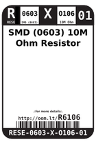
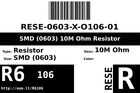
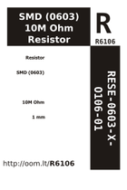
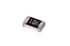

Contents
========

* [R6106 > SMD (0603) 10M Ohm Resistor](#r6106--smd-0603-10m-ohm-resistor)
	* [Datasheets](#datasheets)
	* [Labels](#labels)
	* [EDA](#eda)
	* [Images](#images)
	* [Tags](#tags)
  
![][im]
# R6106 > SMD (0603) 10M Ohm Resistor

- ID: RESE-0603-X-O106-01
- Hex ID: R6106
- Name: SMD (0603) 10M Ohm Resistor
- Description: SMD (0603) 10M Ohm Resistor
- Long Link: [http://oom.lt/RESE-0603-X-O106-01](http://oom.lt/RESE-0603-X-O106-01)
- Short Link: [http://oom.lt/R6106](http://oom.lt/R6106)

## Datasheets

- Datasheet: [datasheet.pdf](datasheet.pdf)

## Labels
  
  

|label-front|label-inventory|label-spec|
| :---: | :---: | :---: |
||||

## EDA

### Footprints
  

|  [kicad/kicad-footprints/Resistor_SMD/R_0603_1608Metric_Pad0.98x0.95mm_HandSolder](https://github.com/oomlout/oomlout_OOMP_eda/tree/main/footprints/kicad/kicad-footprints/Resistor_SMD/R_0603_1608Metric_Pad0.98x0.95mm_HandSolder/)|  [kicad/kicad-footprints/Resistor_SMD/R_0603_1608Metric](https://github.com/oomlout/oomlout_OOMP_eda/tree/main/footprints/kicad/kicad-footprints/Resistor_SMD/R_0603_1608Metric/)|  [eagle/Adafruit-Eagle-Library/adafruit/R0603](https://github.com/oomlout/oomlout_OOMP_eda/tree/main/footprints/eagle/Adafruit-Eagle-Library/adafruit/R0603/)||
| :---: | :---: | :---: | :---: |

### Instances
  
  
Used 6 times.  
Prevalance: (6\9905) 0.0606%  

|OOMP Instances|
| :---: |
|[PROJ-SPAR-12650-STAN-01  AD8232 Heart Rate Monitor  Used 6 times. R1, R2, R10, R11, R13, R14](https://github.com/oomlout/oomlout_OOMP_projects/tree/main/PROJ-SPAR-12650-STAN-01/)|

### Symbols

## Images
  
  

|image|image_RE|image_BOTTOM|label-front|label-inventory|label-spec|
| :---: | :---: | :---: | :---: | :---: | :---: |
|||||||

## Tags

- oompID: RESE-0603-X-O106-01
- name: SMD (0603) 10M Ohm Resistor
- hexID: R6106
- ooPackageMarking: 106
- oompDesc: O106
- oompType: RESE
- oompSize: 0603
- oompColor: X
- oompIndex: 01
- oompVersion: 999
- ooWidth: 0.8mm
- ooHeight: 0.45mm
- ooLength: 1.6mm
- oompBbls: template;XXXX-0603-X-XXXX-XX-bbls
- oompDiag: template;XXXX-0603-X-XXXX-XX-diag
- oompIden: template;XXXX-0603-X-XXXX-XX-iden
- oompSchem: template;RESE-XXXX-X-XXXX-XX-schem
- oompSimp: template;XXXX-0603-X-XXXX-XX-simp
- ooDesignator: R1
- footprintEagle: Adafruit-Eagle-Library/adafruit/R0603
- footprintKicad: kicad-footprints/Resistor_SMD/R_0603_1608Metric_Pad0.98x0.95mm_HandSolder
- footprintKicad: kicad-footprints/Resistor_SMD/R_0603_1608Metric
- oompInstances: {'PROJECT': 'PROJ-SPAR-12650-STAN-01', 'ID': 'R1'}
- oompInstances: {'PROJECT': 'PROJ-SPAR-12650-STAN-01', 'ID': 'R2'}
- oompInstances: {'PROJECT': 'PROJ-SPAR-12650-STAN-01', 'ID': 'R10'}
- oompInstances: {'PROJECT': 'PROJ-SPAR-12650-STAN-01', 'ID': 'R11'}
- oompInstances: {'PROJECT': 'PROJ-SPAR-12650-STAN-01', 'ID': 'R13'}
- oompInstances: {'PROJECT': 'PROJ-SPAR-12650-STAN-01', 'ID': 'R14'}

[im]: image_450.jpg
