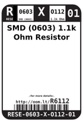
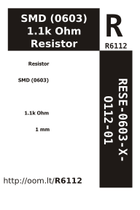

Contents
========

* [R6112 > SMD (0603) 1.1k Ohm Resistor](#r6112--smd-0603-11k-ohm-resistor)
	* [Datasheets](#datasheets)
	* [Labels](#labels)
	* [EDA](#eda)
	* [Images](#images)
	* [Tags](#tags)
  
![][im]
# R6112 > SMD (0603) 1.1k Ohm Resistor

- ID: RESE-0603-X-O112-01
- Hex ID: R6112
- Name: SMD (0603) 1.1k Ohm Resistor
- Description: SMD (0603) 1.1k Ohm Resistor
- Long Link: [http://oom.lt/RESE-0603-X-O112-01](http://oom.lt/RESE-0603-X-O112-01)
- Short Link: [http://oom.lt/R6112](http://oom.lt/R6112)

## Datasheets

- Datasheet: [datasheet.pdf](datasheet.pdf)

## Labels
  
  

|label-front|label-inventory|label-spec|
| :---: | :---: | :---: |
||||

## EDA

### Footprints
  

|  [eagle/Adafruit-Eagle-Library/adafruit/R0603](https://github.com/oomlout/oomlout_OOMP_eda/tree/main/footprints/eagle/Adafruit-Eagle-Library/adafruit/R0603/)||||
| :---: | :---: | :---: | :---: |

### Symbols

## Images
  
  

|image|image_RE|image_BOTTOM|label-front|label-inventory|label-spec|
| :---: | :---: | :---: | :---: | :---: | :---: |
|||||||

## Tags

- oompID: RESE-0603-X-O112-01
- name: SMD (0603) 1.1k Ohm Resistor
- ooPackageMarking: 112
- hexID: R6112
- oompSort: 
- oompClass: Surface Mount
- oompClassCode: SMDS
- oompType: RESE
- oompSize: 0603
- oompColor: X
- oompDesc: O112
- oompIndex: 01
- oompVersion: 40
- oompBbls: template;XXXX-0603-X-XXXX-XX-bbls
- oompDiag: template;XXXX-0603-X-XXXX-XX-diag
- oompIden: template;XXXX-0603-X-XXXX-XX-iden
- oompSchem: template;RESE-XXXX-X-XXXX-XX-schem
- oompSimp: template;XXXX-0603-X-XXXX-XX-simp
- ooDesignator: R1
- footprintEagle: Adafruit-Eagle-Library/adafruit/R0603
- footprintKicad: kicad-footprints/Resistor_SMD/R_0603_1608Metric_Pad0.98x0.95mm_HandSolder
- footprintKicad: kicad-footprints/Resistor_SMD/R_0603_1608Metric

[im]: image_450.jpg
