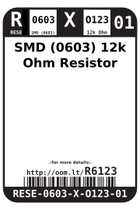
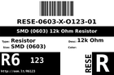
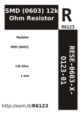

Contents
========

* [RESE-6O123-01 > SMD (0603) 12k Ohm Resistor](#rese-6o123-01--smd-0603-12k-ohm-resistor)
	* [Labels](#labels)
	* [EDA](#eda)
	* [Images](#images)
	* [Tags](#tags)

# RESE-6O123-01 > SMD (0603) 12k Ohm Resistor

- ID: RESE-0603-X-O123-01
- Hex ID: RESE-6O123-01
- Name: SMD (0603) 12k Ohm Resistor
- Description: SMD (0603) 12k Ohm Resistor
- Long Link: [http://oom.lt/RESE-0603-X-O123-01](http://oom.lt/RESE-0603-X-O123-01)
- Short Link: [http://oom.lt/RESE-6O123-01](http://oom.lt/RESE-6O123-01)

## Labels
  
  

|label-front|label-inventory|label-spec|
| :---: | :---: | :---: |
||||

## EDA
  

### Instances
  
Used 7 times.  
Prevalance: (7\10986) 0.0637%  

|Project|Occur- rences|Identifiers|
| :---: | :---: | :---: |
|[PROJ-ADAF-2264-STAN-01 Adafruit FT232H Breakout PCB](https://github.com/oomlout/oomlout_OOMP_projects/tree/main/PROJ-ADAF-2264-STAN-01/)|[4](https://github.com/oomlout/oomlout_OOMP_projects/tree/main/PROJ-ADAF-2264-STAN-01/)|[R1, R7, R10, R11](https://github.com/oomlout/oomlout_OOMP_projects/tree/main/PROJ-ADAF-2264-STAN-01/)|
|[PROJ-SPAR-13287-STAN-01 ESP8266 WiFi Shield](https://github.com/oomlout/oomlout_OOMP_projects/tree/main/PROJ-SPAR-13287-STAN-01/)|[1](https://github.com/oomlout/oomlout_OOMP_projects/tree/main/PROJ-SPAR-13287-STAN-01/)|[R1](https://github.com/oomlout/oomlout_OOMP_projects/tree/main/PROJ-SPAR-13287-STAN-01/)|
|[PROJ-SPAR-13711-STAN-01 ESP8266 Thing Dev 4H](https://github.com/oomlout/oomlout_OOMP_projects/tree/main/PROJ-SPAR-13711-STAN-01/)|[1](https://github.com/oomlout/oomlout_OOMP_projects/tree/main/PROJ-SPAR-13711-STAN-01/)|[R1](https://github.com/oomlout/oomlout_OOMP_projects/tree/main/PROJ-SPAR-13711-STAN-01/)|
|[PROJ-SPAR-13794-STAN-01 Blynk Board ESP8266](https://github.com/oomlout/oomlout_OOMP_projects/tree/main/PROJ-SPAR-13794-STAN-01/)|[1](https://github.com/oomlout/oomlout_OOMP_projects/tree/main/PROJ-SPAR-13794-STAN-01/)|[R1](https://github.com/oomlout/oomlout_OOMP_projects/tree/main/PROJ-SPAR-13794-STAN-01/)|

## Images
  
  

|image_RE|image_BOTTOM|label-front|label-inventory|label-spec|
| :---: | :---: | :---: | :---: | :---: |
||||||

## Tags

- oompType: RESE
- oompSize: 0603
- oompColor: X
- oompDesc: O123
- oompIndex: 01
- oplPartNumber: {'code': 'C-JLCC', 'name': 'JLC Parts Library', 'partID': 'C22790', 'desc': '100mW Thick Film Resistors 75V ??100ppm/?? ??1% -55??~+155?? 12k?? 0603  Chip Resistor - Surface Mount ROHS'}
- distributorPartNumber: {'code': 'C-LCSC', 'name': 'LCSC', 'partID': 'C22790'}
- manufacturerPartNumber: {'code': 'C-XXXX', 'name': 'UNI-ROYAL(Uniroyal Elec)', 'partID': '0603WAF1202T5E'}
- hexID: RESE-6O123-01
- oompID: RESE-0603-X-O123-01
- oompInstances: {'PROJECT': 'PROJ-ADAF-2264-STAN-01', 'ID': 'R1'}
- oompInstances: {'PROJECT': 'PROJ-ADAF-2264-STAN-01', 'ID': 'R7'}
- oompInstances: {'PROJECT': 'PROJ-ADAF-2264-STAN-01', 'ID': 'R10'}
- oompInstances: {'PROJECT': 'PROJ-ADAF-2264-STAN-01', 'ID': 'R11'}
- oompInstances: {'PROJECT': 'PROJ-SPAR-13287-STAN-01', 'ID': 'R1'}
- oompInstances: {'PROJECT': 'PROJ-SPAR-13711-STAN-01', 'ID': 'R1'}
- oompInstances: {'PROJECT': 'PROJ-SPAR-13794-STAN-01', 'ID': 'R1'}
