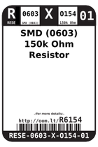
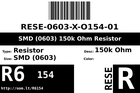
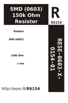
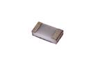

Contents
========

* [RESE-6O154-01 > SMD (0603) 150k Ohm Resistor](#rese-6o154-01--smd-0603-150k-ohm-resistor)
	* [Datasheets](#datasheets)
	* [Labels](#labels)
	* [EDA](#eda)
	* [Images](#images)
	* [Tags](#tags)
  
![][im]
# RESE-6O154-01 > SMD (0603) 150k Ohm Resistor

- ID: RESE-0603-X-O154-01
- Hex ID: RESE-6O154-01
- Name: SMD (0603) 150k Ohm Resistor
- Description: SMD (0603) 150k Ohm Resistor
- Long Link: [http://oom.lt/RESE-0603-X-O154-01](http://oom.lt/RESE-0603-X-O154-01)
- Short Link: [http://oom.lt/RESE-6O154-01](http://oom.lt/RESE-6O154-01)

## Datasheets

- Datasheet: [datasheet.pdf](datasheet.pdf)

## Labels
  
  

|label-front|label-inventory|label-spec|
| :---: | :---: | :---: |
||||

## EDA

## Images
  
  

|image|image_RE|image_BOTTOM|label-front|label-inventory|label-spec|
| :---: | :---: | :---: | :---: | :---: | :---: |
|||||||

## Tags

- oompType: RESE
- oompSize: 0603
- oompColor: X
- oompDesc: O154
- oompIndex: 01
- oplPartNumber: {'code': 'C-JLCC', 'name': 'JLC Parts Library', 'partID': 'C22807', 'desc': '100mW Thick Film Resistors 75V ??100ppm/?? ??1% -55??~+155?? 150k?? 0603  Chip Resistor - Surface Mount ROHS'}
- distributorPartNumber: {'code': 'C-LCSC', 'name': 'LCSC', 'partID': 'C22807'}
- manufacturerPartNumber: {'code': 'C-XXXX', 'name': 'UNI-ROYAL(Uniroyal Elec)', 'partID': '0603WAF1503T5E'}
- hexID: RESE-6O154-01
- oompID: RESE-0603-X-O154-01

[im]: image_450.jpg
